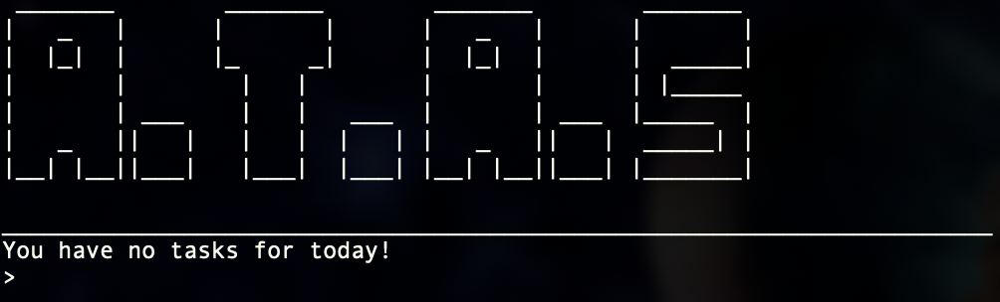

# ATAS (Amazing Task and Assignment System)

## Introduction to ATAS
ATAS (Amazing Task and Assignment System) is a cross platform Command Line Interface (CLI) program that allows you to track your assignments and events. ATAS is catered for students who want to maximise their productivity and cultivate effective time management habits through a desktop application. ATAS is optimised for users who prefer to work with the CLI.

## Main Features of ATAS
- Store assignments and events in the application
- Set events as repeat
- Track upcoming events 
- Manage incomplete assignments
- Effortlessly search through list of tasks
- View assignments and events in a calendar format 

## Site Map 
* [User Guide](https://ay1920s2-cs2113t-m16-1.github.io/tp/UserGuide.html)
* [Developer Guide](https://ay1920s2-cs2113t-m16-1.github.io/tp/DeveloperGuide.html)
* [About Us](https://ay1920s2-cs2113t-m16-1.github.io/tp/AboutUs.html)

