# ATAS (Amazing Task and Assignment System) Developer Guide
By: `Team M16-1` Since: `Jan 2020` License: `MIT`

Table of Contents
- [Setting up](#1-setting-up)
	- [Prerequisites](#11-prerequisites)
	- [Setting up the project](#12-setting-up-the-project)
	- [Verifying the Setup](#13-verifying-the-setup)
- [Design](#2-design)
	- [Architecture](#21-architecture)
	- [UI Component](#22-ui-component)
	- [Logic Component](#23-logic-component)
	- [Model Component](#24-model-component)
	- [Storage Component](#25-storage-component)
	- [Atas Component](#26-atas-component)
- [Implementation](#3-implementation)
	- [Delete Task Feature](#31-delete-task-feature)
		- [Design Considerations](#311-design-considerations)
	- [Search task feature](#32-search-task-feature)
		- [Current Implementation](#321-current-implementation)
		- [Design Considerations:](#322-design-considerations)
	- [Clear Task feature](#33-clear-task-feature)
		- [Current Implementation](#331-current-implementation)
		- [Design Considerations](#332-design-considerations)
	- [Repeat event feature](#34-repeat-event-feature)
		- [Current Implementation](#341-current-implementation)
		- [`Event` and `RepeatEvent` Differences and Impact](#342-event-and-repeatevent-differences-and-impact)
		- [Design Considerations](#343-design-considerations)
		- [Future Enhancement](#344-future-enhancement)
	- [Edit Task Feature](#35-edit-task-feature)
		- [Implementation](#351-implementation)
		- [Design Considerations](#352-design-considerations)
	- [View Calendar feature](#36-view-calendar-feature)
		- [Implementation](#361-implementation)
		- [Design Considerations](#362-design-considerations)
		- [Future Enhancements](#363-future-enhancements)
	- [Storage](#37-storage)
		- [Implementation](#371-implementation)
			- [Saving the current state of **ATAS** with `Storage#save()`:](#372-saving-the-current-state-of-atas-with-storagesave)
			- [Loading previously saved `TaskList` data into **ATAS** with `Storage#load()`:](#373-loading-previously-saved-tasklist-data-into-atas-with-storageload)
		- [Design Considerations](#374-design-considerations)
- [Testing](#4-testing)
	- [Using IntelliJ JUnit Tests](#41-using-intellij-junit-tests)
	- [Using Input-Output Tests](#42-using-input-output-tests)
- [DevOps](#5-devops)
    - [Build Automation](#51-build-automation)
    - [Continuous Integration](#52-continuous-integration)
    - [Coverage Reporting](#53-coverage-reporting)
    - [Making a Release](#54-making-a-release)
- [Appendices](#6-appendices)
    - [Product Scope](#61-appendix-a-product-scope)
    - [User Stories](#62-appendix-b-user-stories)
    - [Use Cases](#63-appendix-c-use-cases)
    - [Non-Functional Requirements](#64-appendix-d-non-functional-requirements)
    - [Documentation](#65-appendix-e-documentation)

## 1. Setting up
This section will guide you on how to set up this project on your own computer.

### 1.1. Prerequisites

1.  JDK 11 or above

2.  IntelliJ IDE

### 1.2. Setting up the project
1.  Fork this repository, and clone the fork to your computer

2.  Open the IntelliJ IDE. If you are not in the welcome screen, click `File` &gt; `Close Project` to close the existing project.

3.  Set up the correct JDK version for Gradle

    1.  Click `Configure` &gt; `Project Defaults` &gt; `Project Structure`

    2.  Click `New...` and find the directory of the JDK

4.  Click on `Import Project`

5.  Locate and select the `build.gradle` file, then click `OK`

6.  Click `Open as Project`

7.  Click `OK` to use the default settings provided

### 1.3. Verifying the Setup
1.  In an IntelliJ terminal, run `gradlew build`

2.  Move to the folder `build` &gt; `libs` and run: `java -jar atas-2.0.0.jar`

    1.  To use **ATAS**, type a valid command into the terminal and press the enter key to run the command.  
        e.g. Typing `help` and pressing the enter key will show the available commands

    2.  Some example commands you can try to get familiar with **ATAS**:

        -   `help`: Lists the commands that **ATAS** supports.

        -   `assignment n/Assignment One m/CS2113T d/01/02/20 1600 c/Important Assignment`: Adds an assignment called **Assignment One** for the module **CS2113T**. This assignment is due on **1st February 2020 4pm** and the comments for this assignment is that it is an **Important Assignment**.

        -   `exit`: Exits **ATAS**.

## 2. Design
This section will give a high-level overview of how various components in **ATAS** function and interact with each other.

### 2.1. Architecture
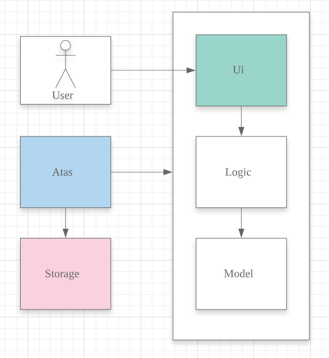

The architecture diagram above illustrates the high-level design of the **ATAS** application.  

The `Atas` component contains all the other components in the application.  

-   `Ui`: Reads user input, and shows the results of commands to the user

-   `Logic`: Handles execution of user input commands

-   `Model`: Stores the runtime data of the application

-   `Storage`: Reads and stores data from a file stored on the user’s computer

The following sections will explain each component in greater detail.

### 2.2. UI Component
1.  The `Ui` component reads user input which represents a command.

2.  The `Ui` component shows the result of the command to the user.

### 2.3. Logic Component

The Logic component comprises the `Parser`, `Command`, and `CommandResult` classes:  

1.  `Parser` will interpret the user command and return the corresponding `Command` object.  

2.  `Command#execute()` is called to run the command, returning a `CommandResult` object.  

3.  The `CommandResult` object will contain the output to be shown to the user.

### 2.4. Model Component
The Model component contains the `Task` and `TaskList` classes, which store the user’s schedule.

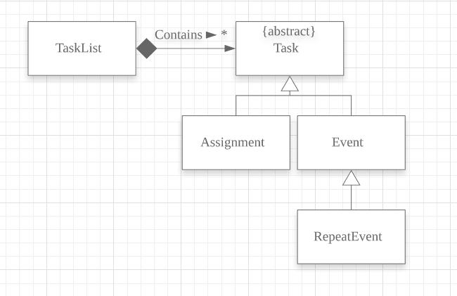

### 2.5. Storage Component
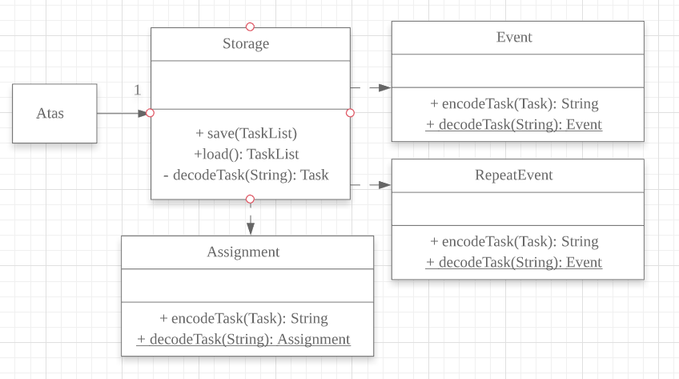

1.  A `Storage` object is created by the `Atas` class to handle the loading and saving of `Task` data.

2.  The `load()` method is used to read saved data from a local file into the current session of **ATAS**.

3.  The `save()` method writes the current state of **ATAS** into the local save file using the `Task#encodeTask()` method.

### 2.6. Atas Component
The `Atas` component integrates all the aforementioned components to run the overall application logic.  
The sequence diagram below shows how various components, broken down into the various classes, interact when the user enters a `help` command  

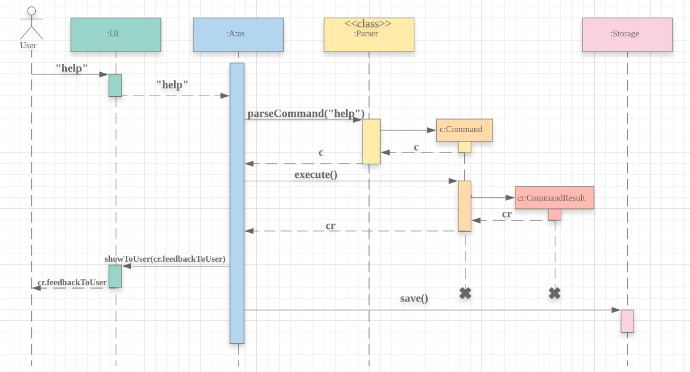

1.  The `Ui` class is used to read user input.  

2.  The `Parser` class is used to parse the user input string, returning a `Command` object.  

3.  The `Command#execute()` method is run, returning a `CommandResult` object.  

4.  The `Ui` class is used to show the `CommandResult` message to the user.  

5.  The `Storage` object is used to save the new state of the application.

## 3. Implementation
This section will detail how some noteworthy features are implemented.

> Note: 
> You will need to create tasks to use the features mentioned below.  
> Create an `assignment`: `assignment n/[NAME] m/[MODULE] d/[DATE] [TIME] c/[COMMENTS]`  
> Create an `event`     : `event n/[NAME] l/[LOCATION] d/[DATE] [START_TIME] - [END_TIME] c/[COMMENTS]`  
> Dates follow the `DD/MM/YY` format, and times follow the `HHmm` format.  
> For more information, please refer to the user guide.

### 3.1. Delete Task Feature
Current Implementation:  
The `DeleteCommand` extends the `Command` class and initializes the `delete index` in its constructor. The `delete index` specifies the index of task that the user wants to delete.

Given below is an example usage and how the `DeleteCommand` mechanism behaves at each step:

**Step 1**  
The user launches the app and retrieves the tasks which are saved under a local file using `Storage`.

**Step 2**  
The user enters `delete 1` into the command line. Method `Parser#parseCommand()` will be called to parse the command provided. It will obtain information to get `delete index`.

> **Warning:**
> If `IndexOutOfBoundsException` or `NumberFormatException` is caught, a new instance of `IncorrectCommand` class will be called to print the respective error messages

**Step 3**  
A new instance of `DeleteCommand` with `delete index` initialized will be created. The `DeleteCommand#execute()` will be called.

**Step 4**  
The `DeleteCommand#execute()` method will do 2 things:

-   If there are no tasks in the existing task list, it will create a new instance of `CommandResult` that prints out an error message indicating an empty task list

-   If there are tasks in the existing task list, the `DeleteCommand` class will call the `TaskList#deleteTask()` method to delete the task, based on the index. At the end of the execution, 
the `DeleteCommand` class will create a new instance of `CommandResult` class that prints out the success message for task deletion.

The following sequence diagram summarizes how delete command operation works:  

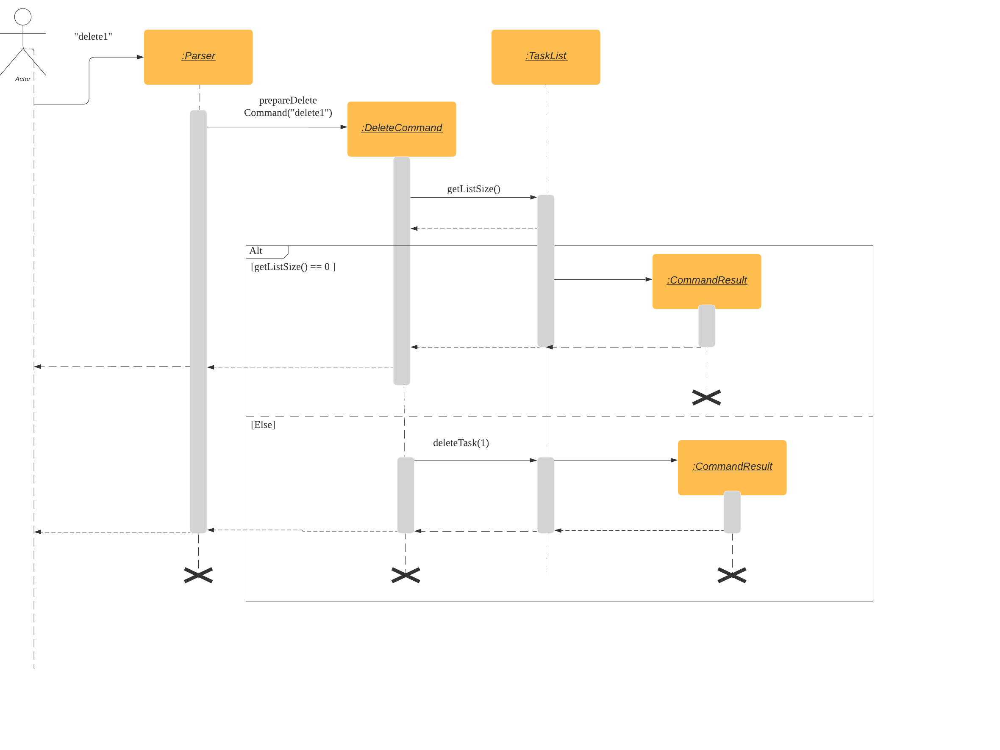

#### 3.1.1. Design Considerations

-   Calling `remove()` method in `deleteTask()` command of `TaskList` method instead of calling `remove()` method within the `execute()` method of the `DeleteCommand` class

    -   Pros: Easier implementation for other classes that requires the same use. 

    -   Cons: Additional functional call to `TaskList#deleteTask` is needed to delete a task from the task list, which may increase time complexity of delete operation.

    -   Rationale: We decided to implement it in such a way because we feel that the increase is time complexity is not 
    going to have a big impact on our code as this app is developed to be used as a CLI. Furthermore, such 
    implementation also allows us to keep all the related commands to the list of tasks within a class which keeps our 
    code cleaner.

### 3.2. Search task feature
#### 3.2.1 Current Implementation

The search task feature is currently implemented in `SearchCommand` class that inherits from the `Command` class.
-   `SearchCommand` initializes the `taskType`, `searchParam` and `date` in its constructor.
    -   `taskType` refers to the type of task the user wants to search through.
    -   `searchParam` refers to the search query that the user wants to find.
    -   `date` refers to the date of the task that the user wants to find. It is set as a default value of NULL if it is a *search* command.
    -   `SearchCommand` class contains `CURRENT_COMMAND_WORD` to store the command word used by the user(i.e. `search` or `searchd`)
    -   `SearchCommand` class also contains `CURRENT_COMMAND_USAGE` to store the error messages for the respective commands.

Given below is an example usage of the `Search` command:  

**Step 1**  
The user launches the app and retrieves the tasks that are saved under a local file using `Storage`.

**Step 2**  
The user enters the input into the command line. Method `Parser#parseCommand()` will be called to parse the command 
provided to obtain the `taskType`, `searchParam` and `date` .

**Step 3**  
A new instance of `SearchCommand` with the `taskType`, `searchParam` and `date` will be created.
-   `SearchCommand` contains an ArrayList `storeIndex` to store the original index of the task containing the search query.

-   Depending on the input that the user puts in, the `CURRENT_COMMAND_WORD` in the `SearchCommand` class will be updated to the *command word* of the user and the 
`CURRENT_COMMAND_USAGE` in the `SearchCommand` class will be updated accordingly.

    -   If there are no tasks in the existing task list, it will initialize a new `CommandResult` class that prints out an error message, indicating an empty task list

    -   Otherwise, If the `taskType` is an *assignment* or *event* , `SearchCommand#getSearchQueryAssignments()` or `SearcCommand#getSearchQueryEvents()`will be called respectively.
    
        -   In the method, a *linked hash map* will be used to store the results from `Parser#getEventsHashMap()` and `Parser#getAssignmentsHashMap()` respectively.
        
        -   We will iterate through the linked hash map to find the *events* or *assignments* matching the search query and date(if applicable) and add the
        original index to the `storeIndex` and return an ArrayList containing the results.
        
    -   Lastly, If `taskType` is *all*, `SearchCommand#etSearchQueryAllTasks` will be called.
        
        -   In the method, an *ArrayList* will be used to store the updated task list from `Parser#getTaskArray()`
        
        -   We will iterate through the *ArrayList* to find the tasks matching the search query and date(if applicable) and add the original index
        to the `storeIndex` and return an ArrayList containing the results.

**Step 4**  
The ArrayList containing the results from Step 3 will be parsed into `SearchCommand#SearchList` to format the results into a String suitable 
for printing out to the users.

**Step 5**  
The String results from Step 5 will be parsed into `SearchCommand#resultsList` to print out the results.

-   If there are no matching search query, a new instance of `CommandResult` class will be created to print out the error message, indicating no matching search query,

-   Otherwise, a new `CommandResult` class will be created to print out the search results.
        
The following sequence diagram summarizes how the *search* and *searchd* command works :

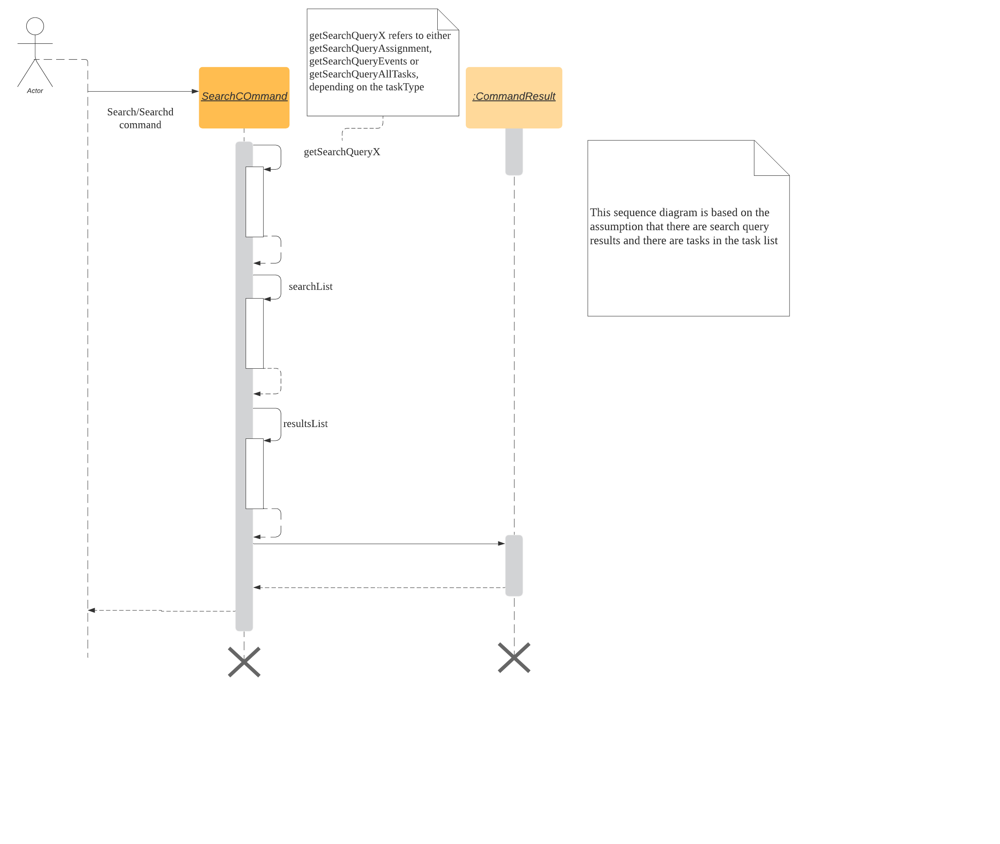

#### 3.2.2. Design Considerations:

-   Using Linked HashMap to store key-value pairs for *events* and *assignments*

    -   Rationale:
        To maintain an ordering among the events and assignments that we iterate through so that there is no need to sort through the list again to restore the original ordering
        
    -   Alternatives Considered:
    
        1.  Use a HashMap to store the key-value pairs
        
            -   Pros: HashMap does not maintain a doubly-linked list running though all entries so there is less overhead as compared to a Linked HashMap, leading to better performance in terms of memory usage
            
            -   Cons: HashMap does not maintain an iteration order so more sorting has to be done to restore the original order, which will incur additional time complexities

-   Creating 2 separate classes for `SearchCommand` and `SearchdCommand`

    -   Rationale:  
        To create 2 separate commands so that users can filter their search query more easily.

    -   Alternatives Considered:  

        1.  Use a `Search` class that implements both functions of `SearchCommand` and `SearchdCommand`

            -   Pros: Reduced coupling. Improved code structure.

            -   Cons: More difficult to implement

        2.  Create another `SearchdCommand` within the `Parser` class that does the same operations as the `SearchdCommand`.

            -   Pros: Easier to implement.

            -   Cons: Makes the code for `Parser` unnecessarily long. Makes the code less OOP.

### 3.3. Clear Task feature
#### 3.3.1. Current Implementation

The `ClearCommand` inherits from the `Command` class and initializes the `clearParam` to check which clear function has to be executed

Example 1: Given below is an example usage of the `clear all` command:

**Step 1**  
The user launches the app and retrieves the tasks which are saved under a local file using `Storage`.

**Step 2**  
The user enters `clear all` into the command line. Method `Parser#parseCommand()` will be called to parse the command provided.

**Step 3**  
A new instance of `ClearCommand` with `clearParam` initialized will be created. The `execute()` method of `DeleteCommand` will then be called.

**Step 4**  
The `execute()` method will then call the `ClearCommand#clearAll()`.

-   If there are no tasks in the existing task list, it will create a new instance of `CommandResult` class that prints out an error message indicating an empty task list

-   If there are tasks in the existing task list, it will call the `TaskList#clearList()` method to clear the existing taskList

Example 2: Given below is an example usage of `clear done` command:

**Step 1**  
The user launches the app and retrieves the tasks which are saved under a local file using `Storage`.

**Step 2**  
The user enters `clear all` into the command line. Method `Parser#parseCommand()` will be called to parse the command provided.

**Step 3**  
A new instance of `ClearCommand` with `clearParam` initialized will be created. The `DeleteCommand#execute()` will then be called.

**Step 4**  
The `execute()` method will then call the `ClearCommand#clearDone()` :

-   If there are no tasks in the existing task list, it will initialize a new instance of `CommandResult` that prints out an error message indicating an empty task list

-   If there are tasks in the existing task list, it will call the `clearDone()` method that will call the `TaskList#deleteAllDone()` method.

The following sequence diagram summarizes how the `ClearCommand` operation works:  

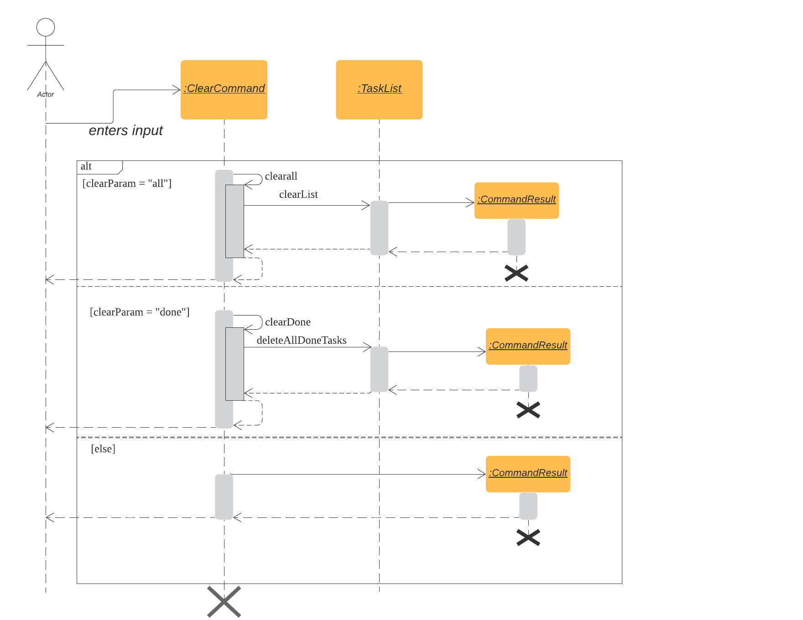

#### 3.3.2. Design Considerations

-   Creating another `clear done` command instead of just 1 `clear` command

    -   Rationale:  
        Considering that our target audience are students, we feel that it might be inconvenient for the students to delete each completed one by one, just to reduce the number of tasks that is being displayed during `list` command.

    -   Alternative Considered:  

        1.  Delete the task once it has been marked as completed

            -   Pros: Easier to implement and improved code readability

            -   Cons: User may want to refer back to completed tasks for reference in the future and may not want to delete the completed task

        2.  Instead of deleting the completed tasks, we can choose to only list commands that have been completed

            -   Pros: Easier to implement and improved code readability

            -   Cons: `ArrayList` will be filled up with unnecessary tasks that could have been removed. This might affect the time complexity of future addition or searching operations on the `ArrayList`.

### 3.4. Repeat event feature
This feature allow users to repeat their events, removing the need to insert the same event multiple times with different dates.

#### 3.4.1. Current Implementation

The `RepeatCommand` class extends the `Command` class and either allows the stated event to repeat or to stop repeating. To allow an event to repeat, it will replace the current `Event` object with a `RepeatEvent` object (`RepeatEvent` inherits from `Event`). Likewise, to stop repeating, it replaces the current `RepeatEvent` with a `Event` object. A detailed explanation and the difference between the 2 classes will be elaborated later.

Given below is an example usage of the `repeat id/2 p/1w` command given by a user.

**Step 1**  
`Parser#parseCommand()` will be called to parse the command provided. Through this method, we will be able to
 obtain information to get integers `eventID`, `numOfPeriod` and string `typeOfPeriod`.  
- `eventID` identifies the task that the user wishes to repeat.  
- `numOfPeriod` and `typeOfPeriod` specifies how often the user wants to repeat the event.

> **Note:**
> Available `typeOfPeriod`: Day `d`, Week `w`, Month `m`, Year `y`  

**Step 2**  
After parsing, a new instance of RepeatCommand with `eventID`, `numOfPeriod` and `typeOfPeriod` initialized will be created. `RepeatCommand#execute()` will then be called.

**Step 3**  
The `execute()` method will check 3 things after it calls `getTask()` method from `TaskList` class to get the user input task.

-   It will check if the `eventID` provided refers to a valid `Event` task.

-   It will then check if `numOfPeriod` equals to 0. In which case, it will be setting the event to not repeat by calling `RepeatCommand#unsetRepeat()`.

    -   `unsetRepeat()` method will check if the given task is indeed a `RepeatEvent` object and then create a new `Event` object using
     the variables from `RepeatEvent` and replace it in the `TaskList` with no changes to any variables in `Event` object.

-   If it is not 0, it will set the event to repeating by calling `RepeatCommand#setRepeat()`.

    -   `setRepeat()` method will use 2 of the variables (`numOfPeriod`, `typeOfPeriod`) to create a new `RepeatEvent` object, update its
        date to the next upcoming date if the current date is in the past by calling `RepeatEvent#updateDate()` and replace the
        current `Event` object at the `eventID` in`TaskList`. 
     
**Step 4**  
After the `execute()` method completes, a new `CommandResult` class with a string containing the result of the execution. This string will 
be printed by calling `showToUser()` method in the `Ui` class. Then the event will be saved into local file by calling
`Atas#trySaveTaskList()`.

The following sequence diagram summarizes how repeat command operation works, from the parser creating an `RepeatCommand` to the end of
 `execute()` method called by `Atas`:

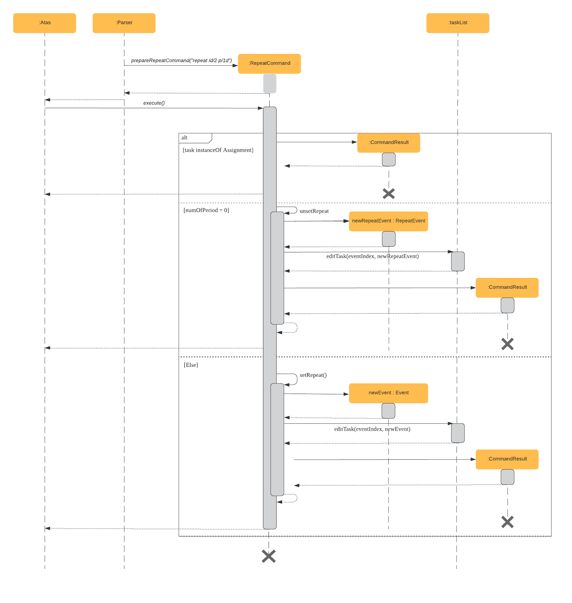

#### 3.4.2. `Event` and `RepeatEvent` Differences and their Impact

-   There are 4 main variables that differentiate a `RepeatEvent` object from an `Event` object, and keep track of Date and Time for an event to repeat accurately.

    1.  `int numOfPeriod`: Set to the given value that states the frequency which `typeOfPeriod` will repeat at.

    2.  `String typeOfPeriod`: Set to `d` (days), `w` (weeks), `m` (months) or `y` (years) to indicate how often it will repeat.

    3.  `LocalDateTime originalDateAndTime`: Set to be the event’s current Date and Time and will not change so that we can keep track of 
        the original Date and Time for other usages later.

    4.  `int periodCounter`: Set to 0 at the start, but increases periodically. It will keep track of how many times `numOfPeriods` with 
        type `typeOfPeriod` has passed.  
        For example, if `numofPeriod` is `2` and `typeOfPeriod` is `d`, and 6 days has passed since `originalDateAndTime`, then 
        `periodCounter` will be 3.

-   With this implementation in mind, every time the app is launched, after `load()` method in `Storage` class is called, the app will
    call a method `updateEventDate()` which will iterate through every task in the list and calls `RepeatEvent#updateDate()` if the task is
    of class `RepeatEvent` and its date is in the past. The method will update the dates of the tasks using `originalDateAndTime` and also 
    `periodCounter` to accurately update the starting date and time of the `RepeatEvent` so that it reflects the closest possible future
    date if today is not possible.

-   To users, apart from minor differences such as the icon and listing of `RepeatEvent` shows how often it is being repeated, there will be
 no other noticeable difference between an `Event` and a `RepeatEvent`. The implementation of `RepeatEvent` is transparent to the users and 
they can only add or edit `Event` or `Assignment` and would appear as if there are only 2 type of tasks.

#### 3.4.3. Design Considerations

-   Allowing only tasks that are `Event` to be repeated.

    -   Rationale:  
        We feel that given the context of university students, it makes little sense for most assignments to repeat. However, it 
        makes sense for events to repeat since many events actually occur on a regular basis.

    -   Alternative Considered:  

        1.  Allowing all tasks to be repeatable.

            -   Pros: Allow more flexibility for the user to set which tasks they want to repeat, regardless of task type.

            -   Cons: Memory wastage as additional variables are set for repeating tasks. In the case of minimal assignments being repeated, the space is wasted.

-   Allowing an `Event` to repeat for any period by using `numOfPeriod` and `typeOfPeriod`.

    -   Rationale:  
        It provides great flexibility in allowing an event to repeat for any desired amount of time. For example, some classes occur every 2 weeks. Some events may happen every 10 days or any x period.

    -   Alternative Considered:  

        1.  Removing `numOfPeriod` and fixing it to just 4 types of recurrence.

            -   Pros: It would simplify usability and implementation since there will only be 4 options to choose from.

            -   Cons: It would reduce the usability for the 2 examples provided above as users would not be able to make events repeat every 2 weeks or 10 days, forcing them to have to manually type in the same event for as many times as it will occur if they wish to still keep track of that event.

-   Keeping `RepeatEvent` as a single entity within the list and not repeatedly adding new tasks with progressive dates when `RepeatCommand` is used.

    -   Rationale:  
        It allows the repeated events to be easily removed or un-repeated as a there will only be a single `RepeatEvent` present in the list.
        However, this means that past instances of that event will not be kept and we feel that it is acceptable as the past events are not 
        nearly as important as future events.

    -   Alternative considered:  

        1.  Repeatedly add new events with changes in dates for a fixed amount when repeat command is used.

            -   Pros: It will be simpler to implement and test if repeating events can be treated like any other events as coupling will be
             lower compared to current implementation.

            -   Cons: Deleting a repeating event would be difficult as there would be multiple entries to delete. It will also flood 
            the user’s list and increase the size of the local file that stores the `TaskList`.
            
#### 3.4.4 Future Enhancements
A list of possible future enhancements and implementations are provided below as ways to further enhance the user's experience with ATAS.

- Allow users to add `RepeatEvent` directly instead of getting an event to repeat.
    - Possible Implementation: 
        1. Create new `RepeatEventCommand` class similar to `AssignmentCommand` and `EventCommand`. Then edit `Parser` class
           to allow user to create an `RepeatEvent` from command line itself.  
           > **Note**: It is possible to reuse `EventCommand` and `RepeatCommand` current implementations for the new class but will 
           increase coupling as it reuses code from the 2 classes.
      
- Allow users to keep track of past instances of repeated events for users to be able to reflect on how much time was spent on past
 instances of the repeated event.
    - Possible Implementation:
        1. Store past events in current/another local file that could be retrieved later on by the calendar or the app.
    
- Allow users to find repeated events on `searchd` commands.
    - Possible Implementation: 
        1. Keep an array of future dates so that that array could be utilized by `searchd` commands if the task is an instance of
         `RepeatEvent`.
         
         
### 3.5. Edit Task Feature
#### 3.5.1. Implementation

The `EditCommand` class extends the `Command` class by providing functions to edit specific tasks in the list of **ATAS**.

Given below is an example usage scenario of the `edit` command.

**Step 1**  
The user types in `edit 1`. The `parseCommand()` method of the `Parser` class is called to obtain `edit` which is the type of command the user is entering.

> **Warning**
>
> An `IncorrectCommand` class will be returned and an `UNKNOWN_COMMAND_ERROR` string from the `Messages` class will be passed into the constructor of that class if the command supplied was invalid.

**Step 2**  
The `parseCommand()` method subsequently calls the `prepareEditCommand()` method inside the same `Parser` class. This method splits the `fullCommand` string parameters into 2 tokens. The integer `1` will be obtained as the **Index** of the task specified in the list. This method returns a new instance of the `EditCommand` class, passing the integer `1` as the parameter.

> **Warning**
>
> An `IncorrectCommand` class will be returned and a `NUM_FORMAT_ERROR` string from the `Messages` class will be passed into the constructor of that class if the number supplied was not an **integer**.  
> An `IncorrectCommand` class will be returned and a `INCORRECT_ARGUMENT_ERROR` string from the `Messages` class will be passed into the constructor of that class if there are no task index supplied by the user.  

**Step 3**  
A new instance of the `EditCommand` class is returned to the main method of **ATAS** with parameter `1` as described above. The `execute()` method of the `EditCommand` class is now called.

**Step 4**  
The `execute()` method in the `EditCommand` class first gets an input from the user on the details of the edited task.

> **Tip**
>
> Assignment Command Format: `assignment n/[NAME] m/[MODULE] d/DD/MM/YY HHmm c/[COMMENTS]`  
> Event Command Format: `event n/[NAME] l/[LOCATION] d/DD/MM/YY HHmm - HHmm c/[COMMENTS]`

**Step 5**  
If the user supplies an `assignment` command, the `editAssignment()` method will be invoked. This method extracts the `assignmentName`, `moduleName`, `dateTime` and `comments` string to return a new instance of the `Assignment` class.  

If the user supplies an `event` command, the `editEvent()` method will be invoked. This method extracts the `eventName`, `location`, `startDateTime`, `endDateTime` and `comments` string to return a new instance of the `Event` class.

**Step 6**  
This newly instanced class (either `Assignment` or `Event`) will be passed into the method `editTask()` of the `TaskList` class. The `editTask()` method of the `TaskList` class uses Java’s `ArrayList` `set()` method to replace the task.

**Step 7**  
Finally, a `CommandResult` class is returned with `EDIT_SUCCESS_MESSAGE` passed as the parameter to the constructor of that class.

The following sequence diagram summarises what happens when the `EditCommand` class is executed.

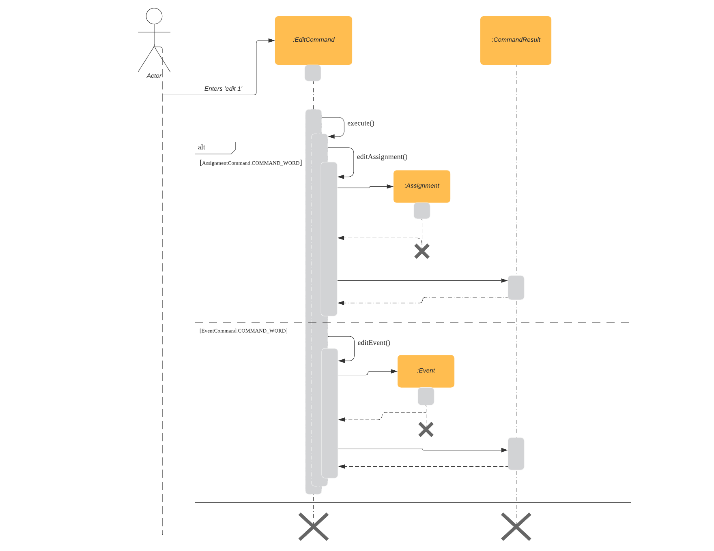

#### 3.5.2. Design Considerations

-   Placing invocation of new `Assignment` and `Event` class in `EditCommand` class

    -   Rationale:  
        The `execute()` method of `EditCommand` class has to use the `Ui` class parsed as one of the parameters to get input from user on new details of the task. The new input captured will be then passed to the `editAssignment()` or `editEvent()` method in the `EditCommand` class.

    -   Alternatives Considered:  
        The `editAssignment()` and `editEvent()` methods can be placed in the `Parser` class and called in the `prepareEditCommand` method of that class.

-   Using Java’s `ArrayList#set()` method

    -   Rationale:  
        When a task is selected to be edited, it is logical for the index of the task to not change as the task is being edited. Therefore, the `set()` method of `ArrayList` is used to replace the edited task with the old task.

    -   Alternatives Considered:  
        Use the available `add` and `delete` methods, the new task is added into the list and the old task is deleted. However, this is not chosen as it is not intuitive for the user’s task index to shift after editing the task.

### 3.6. View Calendar feature

#### 3.6.1. Implementation

The `CalendarCommand` class extends the `Command` class with methods to implement the necessary pre-processing to display an overview of tasks in the given date. The following sequence diagram outlines an example execution of `CalendarCommand` when it is called and the interaction it has with the relevant components.

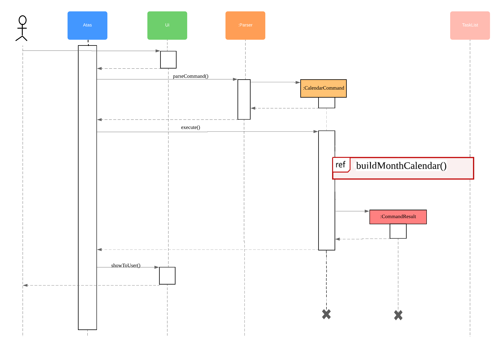

In particular, the diagram below shows the explicit execution flow that `buildMonthCalendar()` method of the `CalendarCommand` takes.

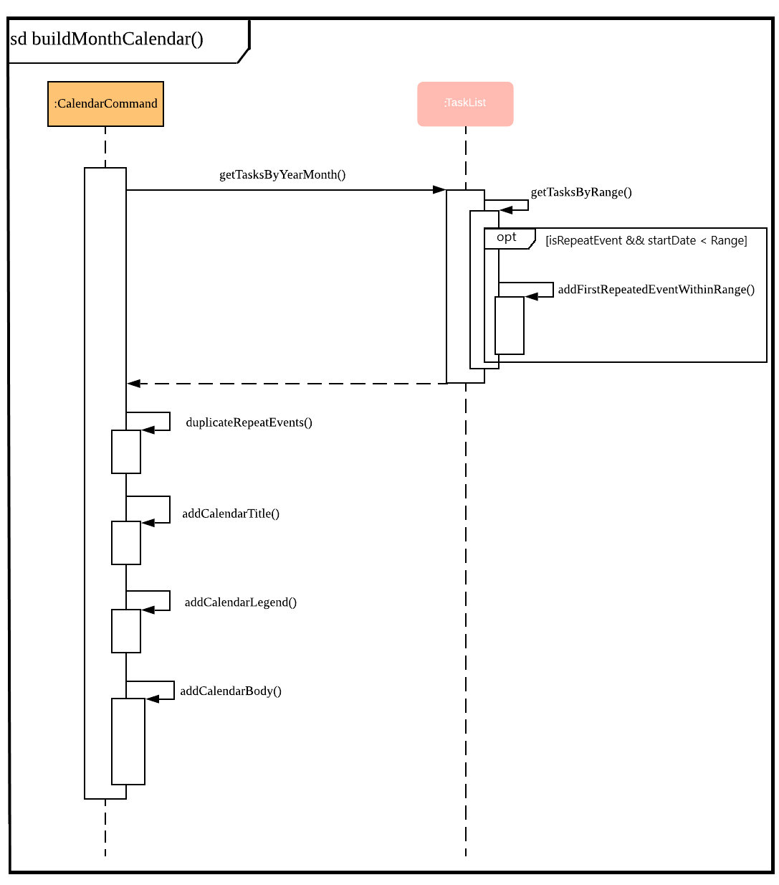

Given below is an example usage of the `calendar` command. The step by step execution is shown in the sequence diagram above.

**Step 1**  
The users enters the command `calendar d/05/20`. This is captured by the `Ui` component and is subsequently parsed by the `Parser` component that the main component calls.

**Step 2**  
The `Parser` will construct a `CalendarCommand` object with the `LocalDate` provided by the user input.

> **Note**
>
> An `IncorrectCommand` object will be constructed with its specific error message instead according to the error encountered. This can be in the form of no arguments provided or parser fails to parse the date provided.

**Step 3**  
The `execute()` method in the `CalendarCommand` is then called by the `Atas` class.

The method manages all pre-processing to get the details needed to formulate the calendar. Details include details of tasks that fall within the given month, and the details of the month itself. **The pre-processing work is listed in sequential order below:**  

-   Calibrates an instance of `Calendar` of the `Java.util` class with the provided `LocalDate` and obtain all necessary information about the `Calendar` month.

-   Obtains all `Task` details that falls within the range of the month. This is performed through calling the `getTasksByRange()` method of the `TaskList` class.

-   Duplicates all `RepeatEvent` that is returned from the method above to obtain an `ArrayList` of all `Task` objects that exist within the month.

-   Appends the `Calendar` title and legend to the resultant string that contains the calendar view.

    -   This is done through separate method calls to `addCalendarTitle()` and `addCalendarLegend()` respectively.

-   Appends the main body of the `Calendar` according to the `ArrayList` of `Task` obtained earlier through a method call to `addCalendarBody()`.

-   Constructs a `CommandResult` object with the resultant string that contains the calendar view and returns this object.

> **Note**
>
> Since an `Event` can be set to repeat, but is stored within the `TaskList` as a single `Task` object, duplicating a repeat `Event` allows us to obtain the full list of `Tasks` that might occur within the month as separate Task. The decision is further explained in the [design considerations](#362-design-considerations) subsection.

**Step 4**  
The `CommandResult` object is subsequently passed to `Ui` component which obtains and prints the `Calendar` view by calling `showToUser()` method of the `Ui` component.

#### 3.6.2. Design Considerations

-   Duplicating `Task` objects instead of keeping the `RepeatEvent` as a single entity like how it is stored in the `TaskList`.

    -   Rationale:  
        By duplicating the `RepeatEvent`, it allows better abstraction by removing the need to constantly differentiate between a normal `Task` and a repeating `Task` during the construction of the final Calendar View. The current implementation allows the `addCalendarBody()` method to obtain all possible `Task` objects, with each `RepeatEvent` being stored as a separate `Task` within the `ArrayList` of `Task` objects. Each `Task` can be removed from the `ArrayList` after it has been printed which makes the task simpler. 

    -   Alternatives considered:  
        Allowing `TaskList` to accept `Task` with duplicated details. However, this will in turn further complicate design when performing other features that deal with a singular `Task` such as `delete`, `search`, `done`. (See [Section 3.4.3, RepeatEvent design considerations](#343-design-considerations))

-   Truncation of `Task` details instead of extending column size

    -   Rationale:  
        This keeps the calendar compact such that the command line application can be viewed as a smaller window as opposed to the taking up the entire screen. Since row size is also extendable, extending column size independently from row size will destroy the integrity of a traditional calendar box view.

    -   Also, there are other features that can be used in conjunction with the `Calendar` to allow users to obtain more information of the `Task` such as `SearchCommand` and `ListCommand`.

    -   Alternative Considered:  
        Wrapping of `Task` details to display its full details. This is not feasible as this further increases the need for number of rows. As mentioned, we would like to keep the integrity and view of a traditional calendar and this does the opposite of that.

-   Limiting the number of `Task` objects that can be displayed for a particular calendar date

    -   Rationale:  
        Limiting the number of task might misrepresent the list of `Task` a user has for any particular date if there are more tasks than available slots on the calendar date. To solve the issue of misrepresentation, we decided to replace the last `Task` slot of each `Calendar` date with an indicator to indicate there are tasks not shown if there are indeed tasks left out due to the constraints that is the lack of `Calendar` rows.

    -   Alternative Considered:  
        Expanding number of `Calendar` rows. This will require the need to increase the number of `Calendar` columns to preserve the integrity of a traditional calendar view. However, this also is infeasible as our goal is to keep the calendar compact such that it does not need to fill the screen.
        
#### 3.6.3. Future Enhancements

- Future enhancement to the Calendar feature of **ATAS** is inclusive but not limited to the following:

    - Allowing users the ability to dictate their dimensions of the calendar view so that they are able to customise the size to their preference. Current implementation involves hardcoded dimensions that might not meet every users' requirements. 

### 3.7. Storage
#### 3.7.1. Implementation

The `Storage` class uses the `encode()` and `decode()` method of each Task subclass to save and load Task data in a file on the user’s computer.  
Every time a `Command` is executed, the `Storage#save()` method is run to update the save file.

#### 3.7.2. Saving the current state of **ATAS** with `Storage#save()`:  

**Step 1**  
For each `Task` in the `TaskList`, `Task#encode()` is called, and the result is appended to a save string. Each encoded `Task` is separated by a newline.

**Step 2**  
The save string is written into the specified save file, which will be created if it does not already exist.

#### 3.7.3. Loading previously saved `TaskList` data into **ATAS** with `Storage#load()`:  

**Step 1**  
Read each line from the save file one by one. Each line corresponds to an encoded `Task`.

**Step 2**  
For each line, determine its `Task` type, and call the static `decode()` method from the corresponding class.

**Step 3**  
Add each decoded `Task` into a `TaskList`.

**Step 4**  
When all lines in the save file have been decoded, return the `TaskList`.

#### 3.7.4. Design Considerations

-   Saving the `TaskList` after every `Command` executed  

    -   Rationale  
        There will be reduced coupling as `Storage#save()` is always called regardless of what `Command` is executed. However, unnecessary saves will be made as not all `Command` executions modify the `TaskList`.

    -   Alternatives Considered  
        `Storage#save()` could be called only after `Command` executions that modify the `TaskList`, so that no unnecessary saves are made. However, this method increases coupling as either `Storage` will have to know what `Command` was executed, or `Storage#save()` has to be called in `Command#execute()`.

    -   Conclusion  
        As the `TaskList` is expected to be small for most users, the drop in performance due to unnecessary saves is negligible. The first method is chosen to make the code easier to maintain.

## 4. Testing
Testing is required to ensure that the code written is accurate, bug free (at least in the tests designed) and do not cause any existing
 feature to fail. For ATAS, there are 2 ways to run automated testing.
 
### 4.1. Using IntelliJ JUnit Tests

-   To run all test, right-click on `src/test/java` folder and choose `Run 'All Tests'`

-   To run all test using Gradle: Open a console and run the command `gradlew clean test`

-   For individual test, navigate to folder `src/test/java`. From there, you can right-click any of the test **package**, **class** or a
    single test and choose `Run 'TEST'` to run the corresponding test.

### 4.2. Using Input-Output Tests
-   Open a console, navigate to the `text-ui-test` folder and run the `runtest.bat` (Windows) or `runtest.sh` (Mac / Linux) script.  
    This will run ATAS with the commands written in `input.txt` and compare its output with the text file `EXPECTED.txt`. 

## 5. DevOps
### 5.1 Build Automation
We use Gradle for tasks related to build automation, such as running tests, and checking code for style compliance.  
To run all build-related tasks: 
1. Open a terminal in the project's root directory
2. Run the command:
    * Windows: `gradlew build`
    * Mac/Linux: `./gradlew build`
3. A message stating `BUILD SUCCESSFUL` will be shown in the terminal if all tasks were run successfully.
4. Otherwise, use the error report provided to resolve the issue before trying again.

### 5.2 Continuous Integration
We use Github Actions for continuous integration. No setup will be required for users who fork from the main **ATAS** repository.
* Whenever you create a pull request to the main repository for **ATAS**, various checks will automatically be executed on your pull request.
* If any checks fail, click on it to view the cause of the error, and fix it in your branch before pushing it again.
* Ensure that all checks pass before merging your pull request.

### 5.3 Coverage Reporting
We use the IntelliJ IDEA's coverage analysis tool for coverage reporting.
A tutorial on how to install and use this tool can be found [here](https://www.youtube.com/watch?v=yNYzZvyA2ik).

### 5.4 Making a Release
To make a new release:
1. Update the shadowJar `archiveVersion` in the build.gradle file
2. Generate the JAR file using Gradle by opening a terminal in the project's root directory, and run the command:
    * Windows: `gradlew clean shadowJar`
    * Mac/Linux: `./gradlew clean shadowJar`
3. Find the JAR file in the `build/libs` directory.
4. Tag the repository with the new version number (e.g. `v2.1`).
5. Create a new release using Github and upload the JAR file found in step 3.

## 6. Appendices
### 6.1. Appendix A: Product Scope
Target user profile:  

-   manages many university assignments or events

-   understands how to use a command line interface application

-   prefers desktop applications over other types of applications

-   prefers using a command line interface over a graphical user interface

-   types fast

**Value proposition:** manage assignments and events more efficiently than a typical task manager application with a GUI

### 6.2. Appendix B: User Stories
<table>
<colgroup>
<col width="20%" />
<col width="20%" />
<col width="20%" />
<col width="20%" />
<col width="20%" />
</colgroup>
<tbody>
<tr class="odd">
<td>
S/N
</td>
<td>
Version
</td>
<td>
As a …
</td>
<td>
I can…
</td>
<td>
So that I …
</td>
</tr>
<tr class="even">
<td>
01
</td>
<td>
V1.0
</td>
<td>
User
</td>
<td>
Add assignments, including assignment details
</td>
<td>
Can keep track of assignment details
</td>
</tr>
<tr class="odd">
<td>
02
</td>
<td>
V1.0
</td>
<td>
User
</td>
<td>
Add events, including event details
</td>
<td>
Can keep track of event details
</td>
</tr>
<tr class="even">
<td>
03
</td>
<td>
V1.0
</td>
<td>
User
</td>
<td>
Have a daily view of tasks
</td>
<td>
Can see what is important for today only
</td>
</tr>
<tr class="odd">
<td>
04
</td>
<td>
V1.0
</td>
<td>
User
</td>
<td>
Have a weekly view of tasks
</td>
<td>
Can better plan my time to meet deadlines
</td>
</tr>
<tr class="even">
<td>
05
</td>
<td>
V1.0
</td>
<td>
User
</td>
<td>
List all the tasks
</td>
<td>
Can have an overview of tasks and mark individual tasks as done or delete specific tasks
</td>
</tr>
<tr class="odd">
<td>
06
</td>
<td>
V1.0
</td>
<td>
User
</td>
<td>
View all incomplete assignments
</td>
<td>
Can know the progress of my work
</td>
</tr>
<tr class="even">
<td>
07
</td>
<td>
V1.0
</td>
<td>
User
</td>
<td>
View all upcoming events
</td>
<td>
Can see which period of time I will be busy and plan my time accordingly
</td>
</tr>
<tr class="odd">
<td>
08
</td>
<td>
V1.0
</td>
<td>
User
</td>
<td>
Mark an assignment as completed
</td>
<td>
Can easily view which assignments I have yet to complete
</td>
</tr>
<tr class="even">
<td>
09
</td>
<td>
V1.0
</td>
<td>
User
</td>
<td>
Delete tasks
</td>
<td>
Do not clog up the calendar
</td>
</tr>
<tr class="odd">
<td>
10
</td>
<td>
V1.0
</td>
<td>
User
</td>
<td>
Clear all tasks
</td>
<td>
Can clear all tasks with a single command
</td>
</tr>
<tr class="even">
<td>
11
</td>
<td>
V1.0
</td>
<td>
User
</td>
<td>
Clear all completed tasks
</td>
<td>
Can remove all completed tasks from the app in a single command
</td>
</tr>
<tr class="odd">
<td>
12
</td>
<td>
V2.0
</td>
<td>
User
</td>
<td>
Edit details of assignment
</td>
<td>
Do not have to delete and create a new assignment instead
</td>
</tr>
<tr class="even">
<td>
13
</td>
<td>
V2.0
</td>
<td>
User
</td>
<td>
Edit details of event
</td>
<td>
Do not have to delete and create a new event instead
</td>
</tr>
<tr class="odd">
<td>
14
</td>
<td>
V2.0
</td>
<td>
Long-term User
</td>
<td>
Have my data persist between sessions
</td>
<td>
Do not need to close the application when I am not using it
</td>
</tr>
<tr class="even">
<td>
15
</td>
<td>
V2.0
</td>
<td>
Frequent User
</td>
<td>
See the tasks I have for the day when the app starts up
</td>
<td>
Can quickly check my schedule for the day
</td>
</tr>
<tr class="odd">
<td>
16
</td>
<td>
V2.0
</td>
<td>
User with many tasks
</td>
<td>
Search for an event by name
</td>
<td>
Do not have to scroll through a long list to find its details
</td>
</tr>
<tr class="even">
<td>
17
</td>
<td>
V2.0
</td>
<td>
User with many tasks
</td>
<td>
Search for an assignment by name or module
</td>
<td>
Do not have to scroll through a long list to find its details
</td>
</tr>
<tr class="odd">
<td>
18
</td>
<td>
V2.0
</td>
<td>
User with fixed schedule
</td>
<td>
Set my events as repeated events
</td>
<td>
Do not have to manually create many events with the same details
</td>
</tr>
<tr class="even">
<td>
19
</td>
<td>
V2.0
</td>
<td>
Busy user
</td>
<td>
Set an ending time for my events
</td>
<td>
Can see clearly when I am free in my schedule
</td>
</tr>
<tr class="odd">
<td>
20
</td>
<td>
V2.0
</td>
<td>
User
</td>
<td>
Set my tasks in calendar view
</td>
<td>
Can have an easy-to-read, sorted overview of my upcoming tasks
</td>
</tr>
</tbody>
</table>

### 6.3. Appendix C: Use Cases
### 6.4. Appendix D: Non-Functional Requirements
1.  App should work on Windows, Linux, Unix, OS-X operating systems if Java `11` has been installed.

2.  User with above average typing speed for English text (not coding) should be able to utilize the app to manage tasks more efficiently compared to using a mouse.

3. App should run without any noticeable loss in performance when about 100 tasks are present in the user's list.

### 6.5 Appendix E: Documentation
Refer to [here](https://ay1920s2-cs2113t-m16-1.github.io/tp/Documentation.html)

[Back to Top](#)
