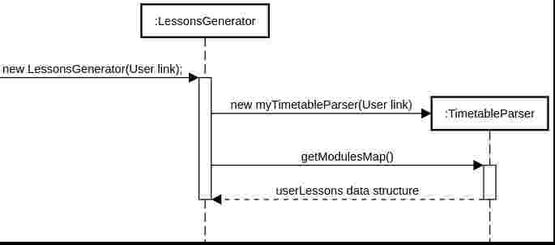
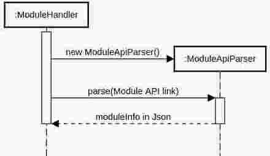
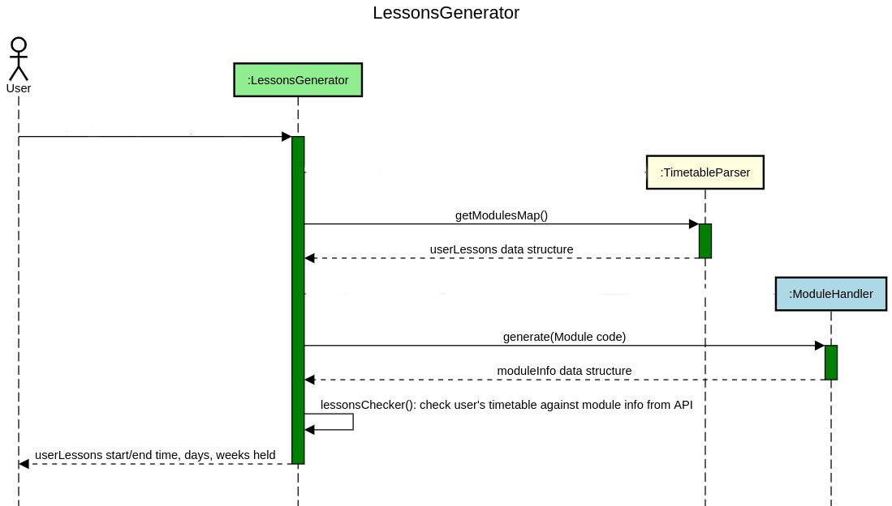

# MeetingOrganizer - Developer Guide
By: `AY1920S2-CS2113T-T12-1`

## Table of Contents
* [1. Setting up](#1-setting-up)
* [2. Design](#2-design)
	* [2.1. Architecture](#21-architecture)
	* [2.2. UI component](#22-ui-component)
	* [2.3. Module parsing logic component](#23-module-parsing-logic-component)
	* [2.4. Member component](#24-member-component)
	* [2.5. Meeting component](#25-meeting-component)
	* [2.6. Exception classes](#26-exception-classes)
	* [2.7. Common classes](#27-common-classes)
* [3. Implementation](#3-implementation)
	* [3.1. Detailed implementation of modulelogic component](#31-detailed-implementation-of-modulelogic-component)
	* [3.2. Design Considerations](#32-design-considerations)
* [4. Documentation](#4-documentation)
* [5. Testing](#5-testing)
* [6. Dev Ops](#6-dev-ops)
* [Appendix A: Product Scope](#appendix-a-product-scope)
	* [A.1. Target user profile](#a1-target-user-profile)
	* [A.2. Value proposition](#a2-value-proposition)
* [Appendix B: User Stories](#appendix-b-user-stories)
* [Appendix C: Use Cases](#appendix-c-use-cases)
* [Appendix D: Non-Functional Requirements](#appendix-d-non-functional-requirements)
* [Appendix E: Glossary](#appendix-e-glossary)
* [Appendix F: Product Survey](#appendix-f-product-survey)
* [Appendix G: Instructions for Manual Testing](#appendix-g-instructions-for-manual-testing)
	* [G.1. Launch and Shutdown](#g1-launch-and-shutdown)
	* [G.2. Saving data](#g2-saving-data)

## 1. Setting up

## 2. Design

### 2.1. Architecture

### 2.2. UI component

### 2.3. Module parsing logic component
The Module parsing logic component retrieves module information from NUSMODS API.

**Structure of the module logic component:**
<br>
The module parsing logic of our application consists of 4 classes: ```TimetableParser ModuleApiParser ModuleHandler LessonsGenerator```.
A detailed implementation would be explained in the implementation section.
<br>
 API: ```modulelogic.LessonsGenerator```
<br>
1. ```LessonsGenerator``` uses the ```TimetableParser``` class to acquire the modules a user is taking, including the timeslots of those modules.
2. ```LessonsGenerator``` also uses ```Modulehandler``` to retrieve a set of information related to a specific module.
3. With both information, ```LessonsGenerator``` is able to dynamically generate the user's time-slots stored in ```ArrayList<String[]>``` via a series of Key-Value pair hashing.
4. ```Arraylist<String[]> ``` contains the start/end time, days and weeks of all modules the user is taking.
<br>

### 2.4. Schedule component
The Schedule component finds common free slots from team members’ schedules.

**Structure of the Schedule component:**

The Schedule component of our application consists of 3 classes ```TeamMember```, ```TeamMemberList``` and ```ScheduleHandler```. 

1. ```TeamMember``` consists of information of a member's schedule.
2. ```TeamMemberList``` is a ```Arraylist<TeamMember> ``` which new ```TeamMember``` can be added to.
3. ```ScheduleHandler``` retrieves the schedule of selected ```TeamMember``` in the ```TeamMemberList```, to generate a combined schedule.
### 2.5. Meeting component
The Meeting component of our application consists of 2 classes: ```Meeting MeetingList```
<br>

### 2.6. Exception classes

### 2.7. Common classes


## 3. Implementation
This section describes some noteworthy details of how our application works in the backend.
### 3.1. Detailed implementation of modulelogic component
<br>
The above figure shows```TimetableParser```, a private class called exclusively by ```LessonsGenerator```. It makes use of regex to sift through timetable link provided by user in the form of ```String``` object and stores
the semester and the user's module information according to the timetable link provided. It depends on the ```common.Messages``` class to provide the exception message when an incorrect link is being parsed.<br>
<br>
 From the figure above, ```ModuleApiParser``` instantiates a HTTP GET request object to fetch a Json object from the open-sourced NUSMOD API server, and is called by ```ModuleHandler``` every time a particular module information is requested.
 <br>
```ModuleHandler``` cleans the data provided by ```ModuleApiParser``` and stores an easy to use data structure to be used by ```LessonsGenerator```.
<br>
 Finally, ```LessonsGenerator``` collates the returned data structure from both ```ModuleHandler```(looped for as many modules the user takes) and ```TimetableParser```, calling```.lessonsChecker()``` simultaneously to create a set of information containing the start-time, end-time, day, weeks of the modules that a user is taking.
 <br>
 The information from ```LessonsGenerator``` would then be included in the schedule of a particular ```TeamMember```.
### 3.2. Design Considerations
#### 3.2.1. Aspect: Fetching of module information
* Alternative 1(current choice): Instantiate a ```ModuleHandler``` every time there's a request for a module information.
Pros: The classes are intuitively separated and data structures returned is understandable.
Cons: Program runs slower for every extra timetable or extra modules taken since its a new instantiation of a ```ModuleHandler```.
* Alternative 2: Instantiate ```ModuleHandler``` once for every user. 
Pros: Takes up less memory and setup time for every timetable provided compared to alternative 1.
Cons: The data structure returned by ```ModuleHandler``` would be complicated and confusing for new developers.

## 4. Documentation

## 5. Testing

## 6. Dev Ops

## Appendix A: Product Scope
### A.1. Target user profile

{Describe the target user profile}

### A.2. Value proposition

{Describe the value proposition: what problem does it solve?}

## Appendix B: User Stories

|Version| As a ... | I want to ... | So that I can ...|
|--------|----------|---------------|------------------|
|v1.0|new user|see usage instructions|refer to them when I forget how to use the application|
|v2.0|user|find a to-do item by name|locate a to-do without having to go through the entire list|

## Appendix C: Use Cases

## Appendix D: Non-Functional Requirements

{Give non-functional requirements}

## Appendix E: Glossary

* *glossary item* - Definition

## Appendix F: Product Survey

## Appendix G: Instructions for Manual Testing

Given below are instructions to test the app manually.

> :information_source: These instructions only provide a starting point for testers to work on; testers are expected to do more _exploratory_ testing. 

### G.1. Launch and Shutdown

### G.2. Saving data
