# Developer Guide
* [1. Introduction](#1-introduction)
 * [2. Implementation](#2-implementation)
    + [2.1 Add feature](#21-add-feature)
    + [2.2 Edit feature](#22-edit-feature)
    + [2.3 Delete feature](#23-delete-feature)
    + [2.4 Mark and Unmark feature](#24-mark-and-unmark-feature)
    + [2.5 Display feature](#25-display-feature)
    + [2.6 Clear list feature](#26-clear-list-feature)
    + [2.7 Set budget feature](#27-set-budget-feature)
    + [2.8 Reset budget feature](#28-reset-budget-feature)
    + [2.9 View help feature](#29-view-help-feature)
    + [2.10 Exit program feature](#210-exit-program-feature)
 * [Appendix A: Product Scope](#appendix-a-product-scope)
 * [Appendix B: User Stories](#appendix-b-user-stories)
 * [Appendix C: Non-Functional Requirements](#appendix-c-non-functional-requirements)
 * [Appendix D: Glossary](#appendix-d-glossary)
 * [Appendix E: Instructions for Manual Testing](#appendix-e-instructions-for-manual-testing)
 

## 1. Introduction 

### Purpose
This document describes the software architecture and design of the SHOCO application. \
This document will evolve throughout the design and implementation of each SHOCO release. 
Currently, this documentation is for the first public release of the application, SHOCO v1.0.

### Scope
This document describes the software architecture and design for the implementation
of SHOCO and is tailored for the developers, designers, and software testers of SHOCO.

## 2. Implementation
This section will describe how the main features of the application are implemented.

### 2.1 Add feature
 #### 2.1.1 Current implementation
 
 The add feature is implemented using an <code>AddCommand</code> class. This class extends from the main
 <code>Command</code> class. The user input **must contain at least a description** out of these parameters: 
 *description*, *price*, *quantity*. User can choose not to input price or quantity as the price will set to 
 default which is 0.0 if the user did not input any value for price. On the other hand, quantity will set to 
 default which is 1 if the user did not input any value for quantity. 
 
 Process of object creation:
 1. First, <code>Duke</code> class receives user input from the <code>Ui</code> class. 
 2. Next, a <code>Parser</code> object is created to call its <code>parseCommand</code> method.
     * The <code>Parser</code> object instantiates an <code>AddCommand</code> object based on the user input.
 3. Then, the <code>Duke</code> class calls the <code>execute</code> method of the <code>AddCommand</code> object.
 4. In the <code>execute</code> function, the <code>item</code> to be add is called from the <code>ShoppingList</code> object, using items.add().
 5. In the SD, the AddCommand will add <code>item</code> if the description is provided and one / both price and quantity is provided. 
 6. Finally, the <code>item</code> object with its' values is stored into the <code>ShoppingList</code> object.
 
 The following sequence diagram below shows how the add feature works. The details of the adding item's values
 are shown in a separate sequence diagram below:
 
 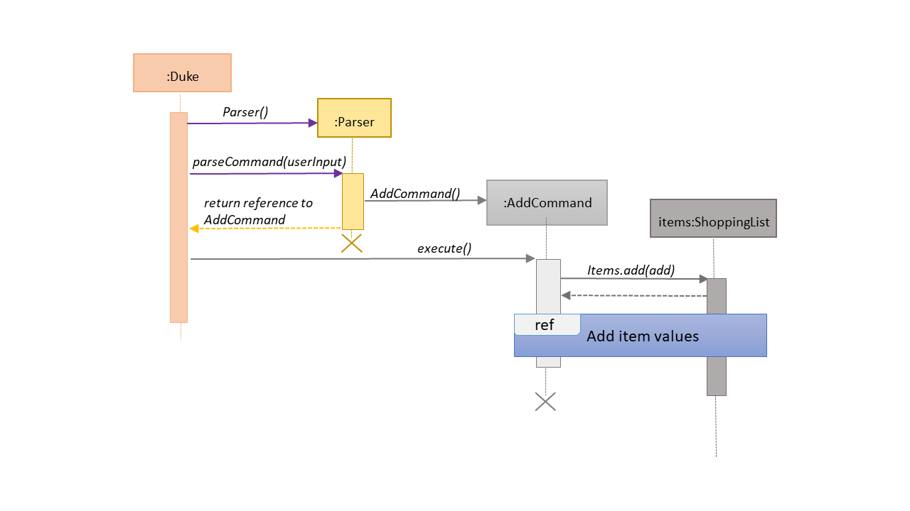
 
 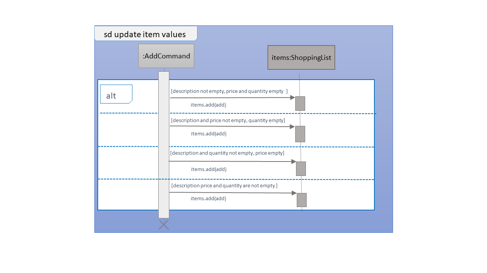
 
#### 2.1.2 Design considerations

##### Aspect: Data structure to support the add feature

- Alternative 1 (current choice): User must provided at least a description for item, Duplicates are
                                  not allowed in the list
  - Pros: User has minimal potential to see unreasonable list in the Shopping List. For 
  example, having a item that has only price and quantity but without description and also
  a list that one item is recorded multiple times in the list.
  
  - Cons: Will significantly increase the code base as there is a need to check for the 
  presence of the variable in user input to avoid duplication, not human friendly in certain 
  scenario (eg: user wants to have duplicates because the item is for different occasion and 
  the user wants to record down twice without any elaboration).

- Alternative 2: Require user to provide all three values to successfully add the item into 
                 the list.

  - Pros: User will have a neat and unity Shopping list, less deal with parameter (because users are
  forced to give all three variables).
  
  - Cons: Less user flexibility, user must input all parameters even if he/she does not want to provide certain
  variables such as price and quantity, which will result unsuccessful adding items into the list. 
 

&nbsp;
<b><a href="#developer-guide">&#129053; back to top</a></b>

&nbsp;

### 2.2 Edit feature
#### 2.2.1 Current implementation

The edit feature is implemented using an <code>EditCommand</code> class. This class extends from the main
<code>Command</code> class. The <code>item</code> object to be edited is identified by the index number provided 
in the user input. In addition to the index no. , the user input **must also contain at least one** of these parameters: 
*description*, *price*, *quantity*. 

The process of object creation:
1. First, <code>Duke</code> class receives user input from the <code>Ui</code> class. 
2. Next, a <code>Parser</code> object is created to call its <code>parseCommand</code> method.
* The <code>Parser</code> object instantiates an <code>EditCommand</code> object based on the user input.
3. Then, the <code>Duke</code> class calls the <code>execute</code> method of the <code>EditCommand</code> object.
4. In the <code>execute</code> function, the <code>item</code> to be edited (based on the specified index of the 
user input) is called from the <code>ShoppingList</code> object.The original description/price/quantity of the item is overwritten 
with the new values from the user input.
5. Finally, the <code>item</code> object with its' new values is stored back to the <code>ShoppingList</code> object.

The following sequence diagram below shows how the edit feature works. The details of updating the items' values
have been omitted from the diagram. Those details are shown in a separate sequence diagram below:

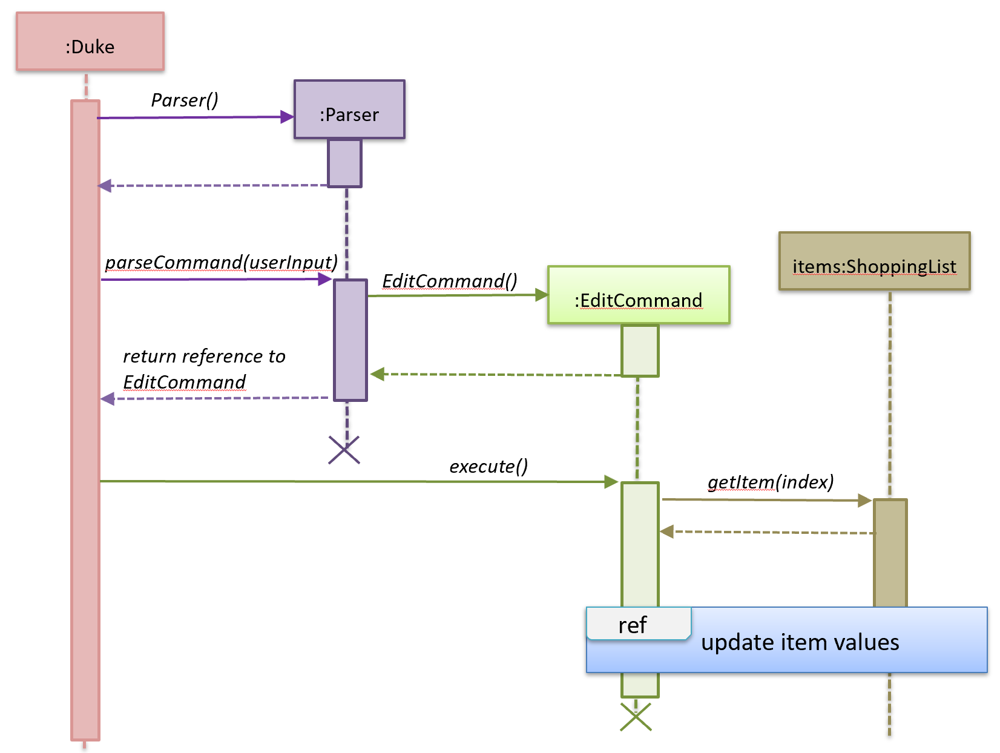

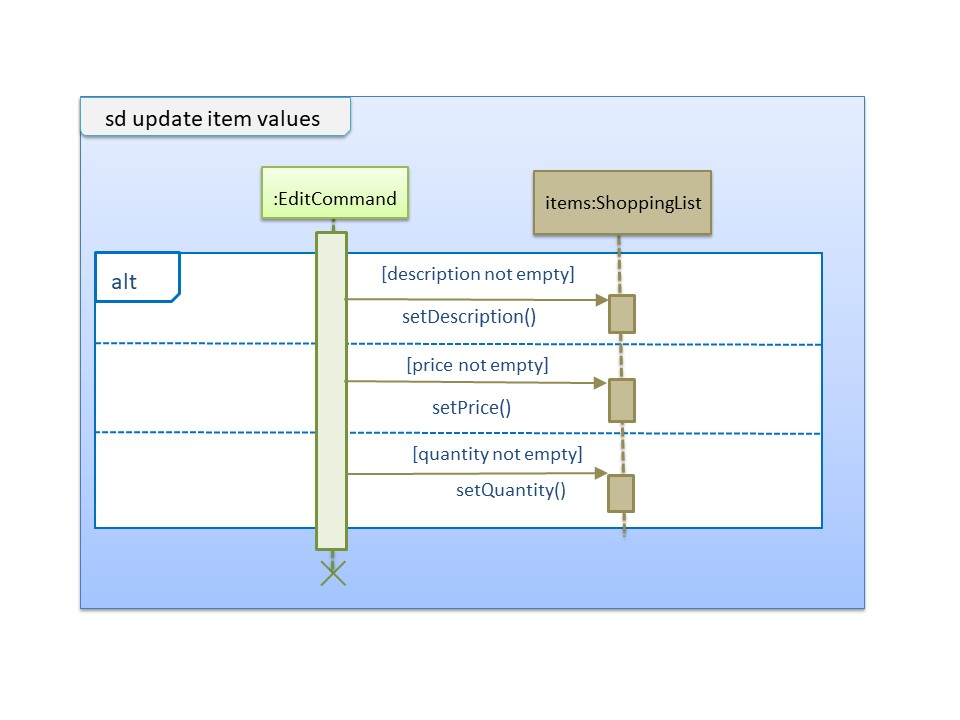

#### 2.2.2 Design considerations

##### Aspect: Data structure to support the edit feature

- Alternative 1 (current choice): Only parameters present in user input are treated as values to update.
  
  - Pros: User has the flexibility to choose which variables he/she wishes to update.
  
  - Cons: Might significantly increase the code base as there is a need to check for the 
    presence of the variable in user input.
 
 
- Alternative 2: Require all values of an <code>item</code> object to be updated
  - Pros: Will have less code to deal with having no additional parsing of input string needed.
  
  - Cons: Less user flexibility; user must input all parameters even if he/she does not want to update certain
  variables.

&nbsp;
<b><a href="#developer-guide">&#129053; back to top</a></b>

&nbsp;
      
### 2.3 Delete feature
#### 2.3.1 Current implementation

The delete feature is implemented using a <code>DeleteCommand</code> class which extends the main
<code>Command</code> class with an index representing that of the item to be deleted from the shopping
list. 
 
The <code>Duke</code> class first receives user input from the <code>Ui</code> class before it creates a 
<code>Parser</code> object and calls its <code>parseCommand</code> function to instantiate a 
<code>DeleteCommand</code> object based on that user input.

The <code>Duke</code> class then calls the <code>execute</code> method of the <code>DeleteCommand</code> object
which makes another call to the <code>deleteItem</code> function of the <code>ShoppingList</code> object 
with the specified index.

The following sequence diagram below shows how the delete feature works. Note the <code>Ui</code> class is
omitted in the sequence diagram to emphasise on the other classes:

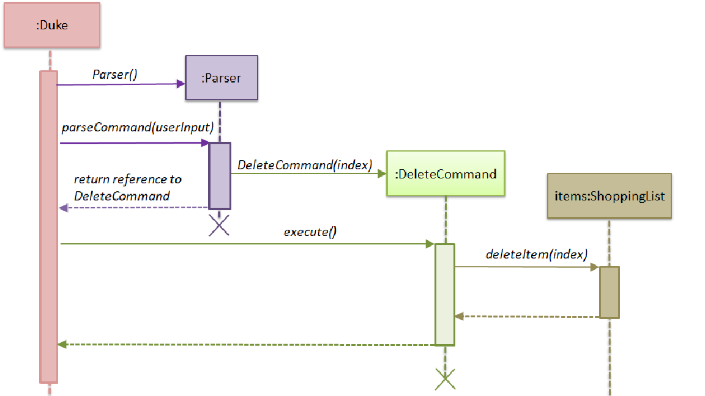

#### 2.3.2 Design considerations

##### Aspect: Data structure to support the delete feature

- Alternative 1 (current choice): Object-oriented style with a separate class for <code>DeleteCommand</code>
 
  - Pros: Easy to add the delete feature without having to change the logic of the code much as each command object
  is treated as a black box
  
  - Cons: Might significantly increase the code base with another class being added

- Alternative 2: Implement delete feature in the <code>Duke</code> class

  - Pros: Will have less code to deal with as a new function is simply created in the <code>Duke</code> class
  
  - Cons: Code becomes less organised since for every other command that we have implemented, <code>Duke</code> class
    simply executes those commands as black boxes, without worrying about their internal details
  
  
&nbsp;
<b><a href="#developer-guide">&#129053; back to top</a></b>

&nbsp;

### 2.4 Mark and Unmark feature
#### 2.4.1 Current Implementation
  
 The mark and unmark feature is implemented using the <code>MarkCommand</code> and <code>UnmarkCommand</code> class
 which extends the main <code>Command</code> class with an index representing that of the item to be marked or
 unmarked as bought in the list.
 
 The process of object creation:
 1. The <code>Duke</code> class first receives user input from the <code>Ui</code>
 2. The <code>Duke</code> class then creates a <code>Parser</code> object and calls its <code>parseCommand</code> method
 to instantiate a <code>MarkCommand</code> or <code>UnmarkCommand</code> object based on the user input
 3. The <code>Duke</code> class then calls the <code>execute</code> method of the <code>MarkCommand</code> or 
 <code>UnmarkCommand</code> command object. This calls the <code>markAsBought</code> or <code>unmarkAsBought</code>
 method of the <code>shoppingList</code> object with the specified index.

 The following sequence diagram below shows how the Mark feature (Diagram 1) and Unmark feature (Diagram 2) works.
 Note the <code>Ui</code> class is omitted in the sequence diagram to emphasise on the other classes:
  
 Diagram 1:
 
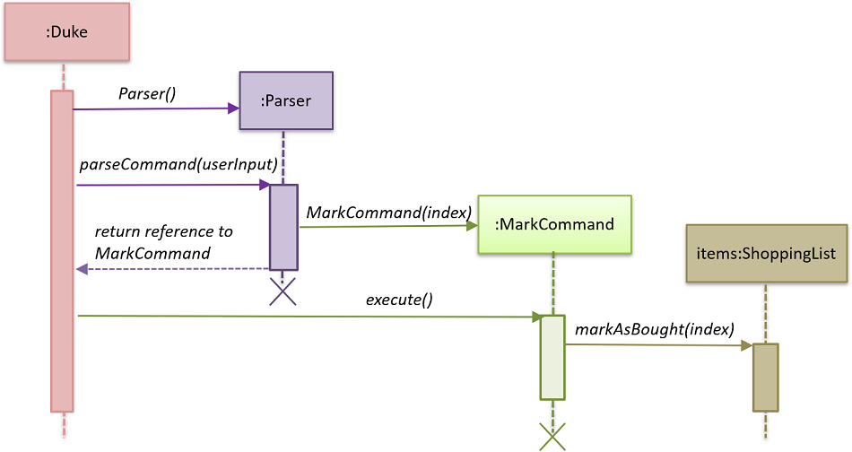
  
Diagram 2:

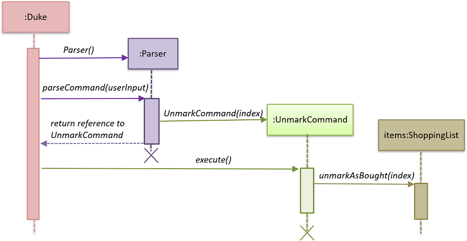
  
#### 2.4.2 Design Considerations
  
##### Aspect: Data structure to support the Mark and Unmark Feature
  
 - Alternative 1 (current choice): Object-oriented style with a separate class for <code>MarkCommand</code>
  and <code>UnmarkCommand</code>

   - Pros: Easy to edit and add the mark and unmark feature without having to change the logic of the code in
    multiple files
    
   - Cons: Might significantly increase the code base with another class being added
    
- Alternative 2: Implement the mark and unmark feature in either the <code>Duke</code> or <code>Parser</code> class

    - Pros: Will have less code and classes to deal with, without having to create a whole new object to execute
      the command.
    
    - Cons: Code becomes harder to navigate and understand since the command is all handled under one class, thus makes
having to edit the mark and unmark feature difficult.
    
&nbsp;
<b><a href="#developer-guide">&#129053; back to top</a></b>

&nbsp;

### 2.5 Display feature
#### 2.5.1 Current implementation

The display feature is implemented using a <code>ListCommand</code> class which extends the <code>Command</code> class. 
 
The <code>Duke</code> class first receives user input from the <code>Ui</code> object before it creates a 
<code>Parser</code> object and calls its <code>parseCommand</code> function to instantiate a 
<code>ListCommand</code> object based on that user input.

The <code>Duke</code> class then calls the <code>execute</code> method of the <code>ListCommand</code> object.
This method makes a call to the <code>getTotalCost</code> method of the <code>ShoppingList</code> object to find the 
cost of the items. It then calls the <code>getAmount</code> and <code>getRemainingBudget</code> methods of the 
<code>Budget</code> object to find the current budget and the remaining budget. The results are then printed to console.

The following sequence diagrams below show how the display feature works. Note the <code>Ui</code> class is
omitted to emphasise the other classes:

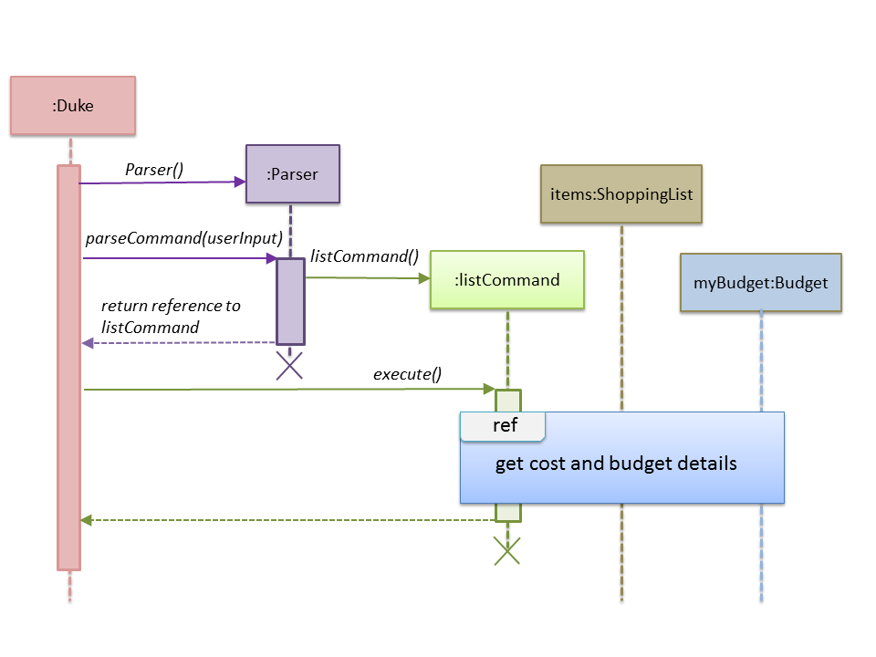

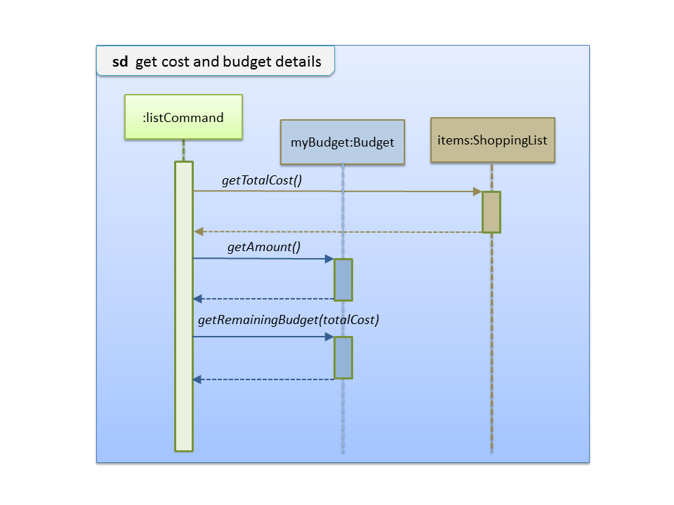

#### 2.5.2 Design considerations
##### Aspect: Data structure to support the display feature

- Alternative 1 (current choice): Object-oriented style with a separate class for <code>ListCommand</code>
 
  - Pros: Easy to add the display feature without having to change the logic of the code much as each command object
  is treated as a black box
  
  - Cons: Might significantly increase the code base with another class being added

- Alternative 2: Implement display feature in the <code>Duke</code> class

  - Pros: Will have less code to deal with as a new function is simply created in the <code>Duke</code> class
  
  - Cons: Handling the command under the <code>Duke</code> class results in longer methods. Thus, the code becomes 
  harder to navigate and understand. 

&nbsp;
<b><a href="#developer-guide">&#129053; back to top</a></b>

&nbsp;

### 2.6 Clear list feature
#### 2.6.1 Current implementation
The clear list feature is implemented using a <code>ClearCommand</code> class which extends the <code>Command</code> 
class. 

The <code>Duke</code> class first receives user input from the <code>Ui</code> object before it creates a 
<code>Parser</code> object and calls its <code>parseCommand</code> function to instantiate a 
<code>ClearCommand</code> object based on that user input.

The <code>Duke</code> class then calls the <code>execute</code> method of the <code>ClearCommand</code> object which 
makes another call to the <code>clearList</code> method of the <code>ShoppingList</code> object.

The following sequence diagram below shows how the clear list feature works. Note the <code>Ui</code> class is
omitted to emphasise the other classes:
  
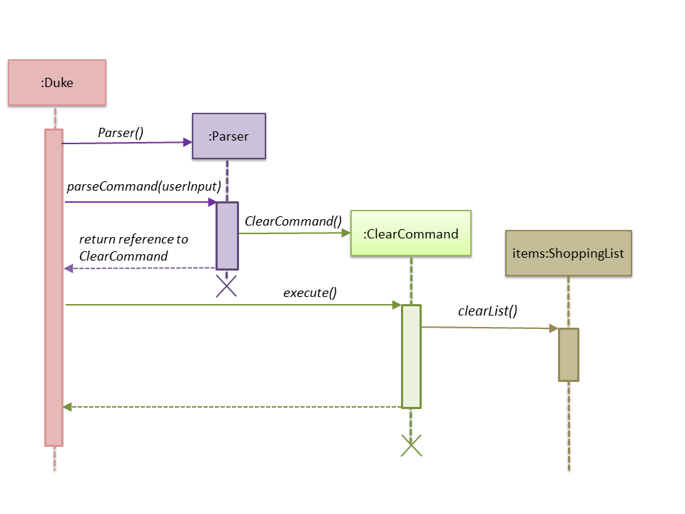
  
#### 2.6.2 Design considerations
  
##### Aspect: Data structure to support the clear list feature
  
- Alternative 1 (current choice): Object-oriented style with a separate class for <code>ClearCommand</code>
 
  - Pros: Easy to add the clear list feature without having to change the logic of the code much as each command object
  is treated as a black box
  
  - Cons: Might significantly increase the code base with another class being added

- Alternative 2: Implement clear list feature in the <code>Duke</code> class

  - Pros: Will have less code to deal with as a new function is simply created in the <code>Duke</code> class
  
  - Cons: Handling the command under the <code>Duke</code> class results in longer methods. Thus, the code becomes 
  harder to navigate and understand. 
  
&nbsp;
<b><a href="#developer-guide">&#129053; back to top</a></b>

&nbsp;

### 2.7 Set budget feature
#### 2.7.1 Current implementation

The set budget feature is implemented using a <code>SetBudgetCommand</code> class which extends the main
<code>Command</code> class with a variable representing the budget amount.

The <code>Duke</code> class first receives user input from the <code>Ui</code> class before it creates a 
<code>Parser</code> object and calls its <code>parseCommand</code> function to instantiate a 
<code>SetBudgetCommand</code> object based on that user input.

The <code>Duke</code> class then calls the <code>execute</code> method of the <code>SetBudgetCommand</code> object
which makes another call to the <code>setBudget</code> function of the <code>Budget</code> object 
with the amount specified by the user for the budget.

The following sequence diagram below shows how the set budget feature works. Note the <code>Ui</code> class is
omitted in the sequence diagram to emphasise on the other classes:

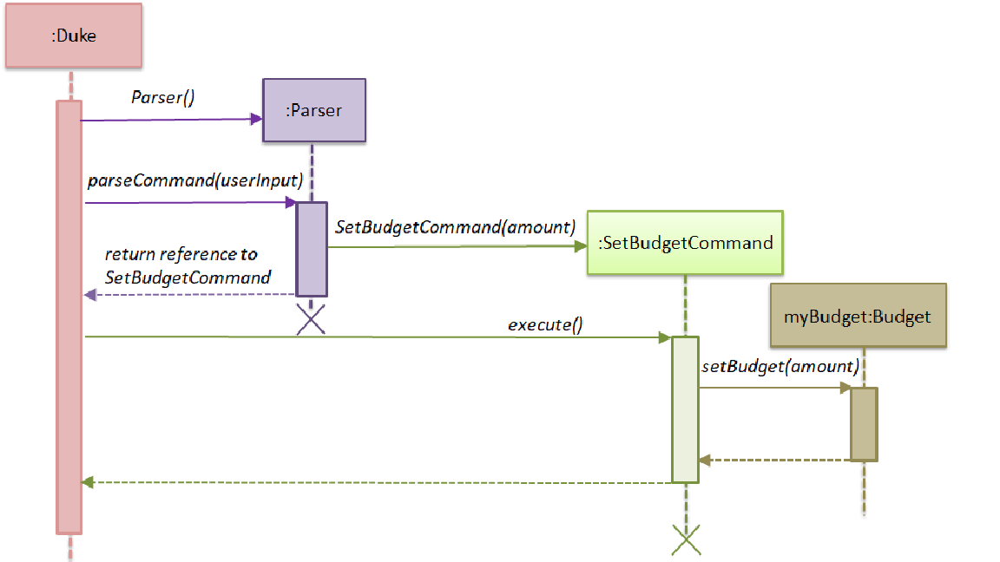

#### 2.7.2 Design considerations

##### Aspect: Data structure to support the set budget feature

- Alternative 1 (current choice): Object-oriented style with a separate class for <code>SetBudgetCommand</code>
 
  - Pros: Easy to add the set budget feature without having to change the logic of the code much as each command object
  is treated as a black box
  
  - Cons: Might significantly increase the code base with another class being added

- Alternative 2: Implement set budget feature in the <code>Duke</code> class

  - Pros: Will have less code to deal with as a new function is simply created in the <code>Duke</code> class
  
  - Cons: Code becomes less organised since for every other command that we have implemented, <code>Duke</code> class
  simply executes those commands as black boxes, without worrying about their internal details

 
&nbsp;
<b><a href="#developer-guide">&#129053; back to top</a></b>

&nbsp;

### 2.8 Reset budget feature
#### 2.8.1 Current implementation

The reset budget feature is implemented using a <code>ResetBudgetCommand</code> class which extends the main
<code>Command</code> class with a variable representing the budget amount.

The <code>Duke</code> class first receives user input from the <code>Ui</code> class before it creates a 
<code>Parser</code> object and calls its <code>parseCommand</code> function to instantiate a 
<code>ResetBudgetCommand</code> object based on that user input.

The <code>Duke</code> class then calls the <code>execute</code> method of the <code>ResetBudgetCommand</code> object
which makes another call to the <code>resetBudget</code> function of the <code>Budget</code> object.

The following sequence diagram below shows how the reset budget feature works. Note the <code>Ui</code> class is
omitted in the sequence diagram to emphasise on the other classes:

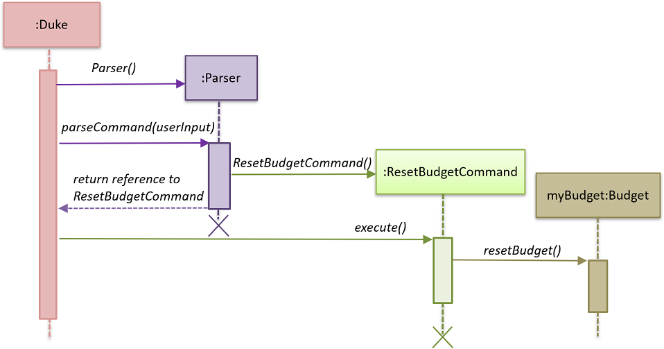

#### 2.8.2 Design considerations

##### Aspect: Data structure to support the reset budget feature

- Alternative 1 (current choice): Object-oriented style with a separate class for <code>ResetBudgetCommand</code>
 
  - Pros: Easy to add the reset budget feature without having to change the logic of the code much as each command
  object is treated as a black box
  
  - Cons: Might significantly increase the code base with another class being added

- Alternative 2: Implement reset budget feature in the <code>Duke</code> or <code>Parser</code> class

  - Pros: Will have less code to deal with as a new function is simply created in the <code>Duke</code> class
  
  - Cons: Code becomes less organised since for every other command that we have implemented, <code>Duke</code> class
  simply executes those commands as black boxes, without worrying about their internal details
  
&nbsp;
<b><a href="#developer-guide">&#129053; back to top</a></b>

&nbsp;      
 
### 2.9 View help feature
#### 2.9.1 Current implementation

The help feature is implemented using a <code>HelpCommand</code> class which extends the main
<code>Command</code> class. The <code>HelpCommand</code> class shows the program usage instructions to the user.

The <code>Duke</code> class first receives user input from the <code>Ui</code> class before it creates a 
<code>Parser</code> object and calls its <code>parseCommand</code> function. If the user input fails to match any
of the correct command keywords (<code>ADD</code>, <code>EDIT</code>, <code>DEL</code> etc.), a 
<code>HelpCommand</code> object will be instantiated.

Once instantiated, the <code>Duke</code> then class calls the <code>execute</code> method of the 
<code>HelpCommand</code> object. In this method, accepted command formats are displayed to the user.

The following sequence diagram below shows how the help feature works. Note the <code>Ui</code> class is
omitted in the sequence diagram to emphasise on the other classes:

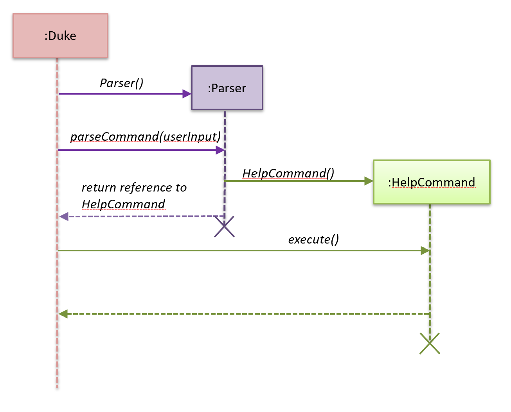

#### 2.9.2 Design considerations

##### Aspect: Data structure to support the help feature

- Alternative 1 (current choice): Object-oriented style with a separate class for <code>HelpCommand</code>
 
  - Pros: Easy to add the help feature without having to change the logic of the code much as each command
  object is treated as a black box
  
  - Cons: Might significantly increase the code base with another class being added

- Alternative 2: Implement help feature in the <code>Duke</code> or <code>Parser</code> class

  - Pros: Will have less code to deal with as a new function is simply created in the <code>Duke</code> class
  
  - Cons: Code becomes less organised since for every other command that we have implemented, <code>Duke</code> class
  simply executes those commands as black boxes, without worrying about their internal details
  
&nbsp;
<b><a href="#developer-guide">&#129053; back to top</a></b>

&nbsp;

### 2.10 Exit program feature
#### 2.10.1 Current implementation

The program termination feature is implemented using a <code>ExitCommand</code> class which extends the main
<code>Command</code> class. The <code>ExitCommand</code> class terminates the program when instantiated.

The <code>Duke</code> class first receives user input from the <code>Ui</code> class before it creates a 
<code>Parser</code> object and calls its <code>parseCommand</code> function. If the user input matches the exit command
keyword: <code>"BYE"</code>, a <code>HelpCommand</code> object will be instantiated.

Once instantiated, the <code>Duke</code> then class calls the <code>execute</code> method of the 
<code>Exit Command</code> object. In this method, the program is terminated.

The following sequence diagram below shows how the help feature works. Note the <code>Ui</code> class is
omitted in the sequence diagram to emphasise on the other classes:

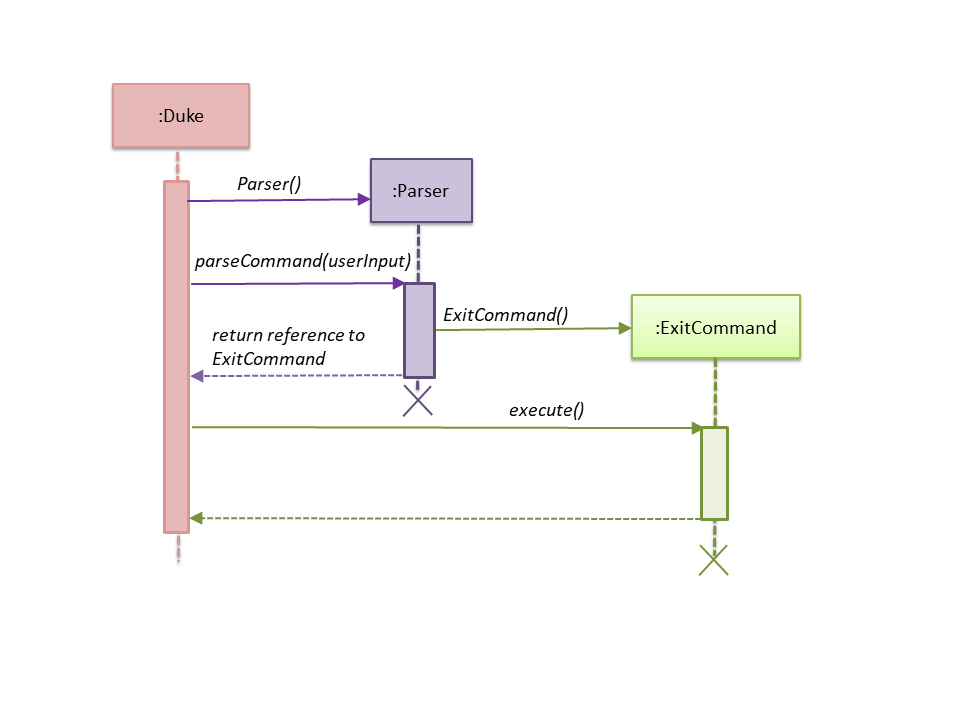

#### 2.10.2 Design considerations

##### Aspect: Data structure to support the exit feature

- Alternative 1 (current choice): Object-oriented style with a separate class for <code>ExitCommand</code>
 
  - Pros: Easy to add the exit feature without having to change the logic of the code much as each command
  object is treated as a black box
  
  - Cons: Might significantly increase the code base with another class being added

- Alternative 2: Implement exit feature in the <code>Duke</code> or <code>Parser</code> class

  - Pros: Will have less code to deal with as a new function is simply created in the <code>Duke</code> class
  
  - Cons: Code becomes less organised since for every other command that we have implemented, <code>Duke</code> class
  simply executes those commands as black boxes, without worrying about their internal details
  
&nbsp;
<b><a href="#developer-guide">&#129053; back to top</a></b>

&nbsp;
  
## Appendix A: Product Scope
### Target user profile

- Likes to cook at home and requires help keeping track of complex grocery shopping lists and
staying within budget
- Prefers to use command line interface applications as opposed to other kinds of applications or
paper
- Can type fast

### Value proposition

- Make grocery shopping a breeze by offering greater flexibility in managing
shopping lists and also providing helpful features like budget tracking

&nbsp;
<b><a href="#developer-guide">&#129053; back to top</a></b>

&nbsp;

## Appendix B: User Stories

|Version| As a ... | I want to ... | So that I can ...|
|--------|----------|---------------|------------------|
|v1.0|organised home cook|be able to edit my budget|change my budget when I need to|
|v1.0|organised home cook|delete items from the list|manage my list|
|v1.0|organised home cook|have a useful "help" list that I can refer to|find instructions for various commands|
|v1.0|frugal home cook|add a budget|so that I know how much I have to spend| 
|v1.0|organised home cook|mark things as bought|keep track of my grocery progress|
|v1.0|frugal home cook|be able to clear my budget|set a new budget|
|v1.0|frugal home cook|be able to see the total value of the items in my shopping list|know that I am within budget|
|v1.0|frugal home cook|see the remaining budget that I have left|avoid exceeding my budget|
|v1.0|practical home cook|be able to clear all items from the list with one command|easily start off with a clean slate|
|v1.0|practical home cook|see all items on my list|see at a glance what I have planned to buy|
|v1.0|frugal home cook|see my budget|know if I'm within or out of my budget|
|v1.0|frugal home cook|calculate my remaining budget|see how much I have left to spend|
|v2.0|frugal home cook|be notified when I cross my budget|remove some items from my list|
|v2.0|practical home cook|be able to search for items on my list|find things easily in a long list|
|v2.0|practical home cook|be able to edit the items in my lists|update the items on my list accordingly|
|v2.0|organised home cook|save my list|have a local copy of my list|
|v2.0|organised home cook|load my saved list|add on to my existing list|
|v2.0|frugal home cook|see the remaining budget update based on the quantity of items|see how much I spend based on how much I buy|

&nbsp;
<b><a href="#developer-guide">&#129053; back to top</a></b>

&nbsp;

## Appendix C: Non-Functional Requirements

1. Should work on any OS that has Java 11 or later installed.
2. Should respond to any user commands within 2 seconds.
3. Should be easy to use for even for people who have never used a command line interface before.

&nbsp;
<b><a href="#developer-guide">&#129053; back to top</a></b>

&nbsp;

## Appendix D: Glossary

* *glossary item* - Definition

&nbsp;
<b><a href="#developer-guide">&#129053; back to top</a></b>

&nbsp;

## Appendix E: Instructions for Manual Testing

{Give instructions on how to do a manual product testing e.g., how to load sample data to be used for testing}

&nbsp;
<b><a href="#developer-guide">&#129053; back to top</a></b>

&nbsp;

