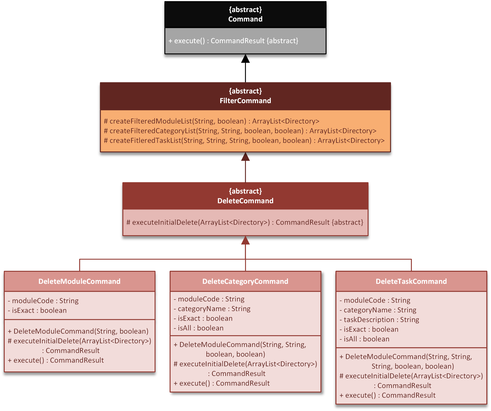
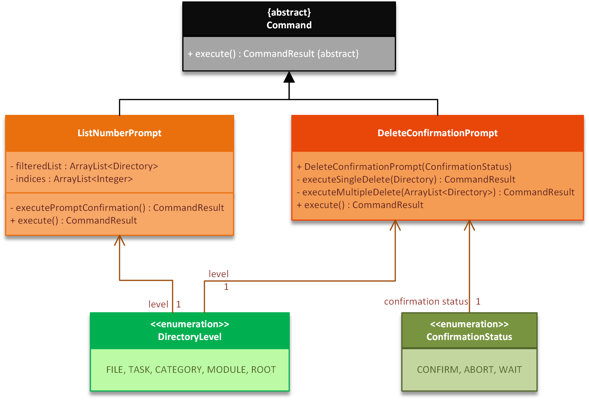

# **Nuke Developer Guide** <small>v1.5</small>  

By: `CS2113T-T13-2`      Since: `Feb 2020`    
[Go to Webpage](https://ay1920s2-cs2113t-t13-2.github.io/tp/DeveloperGuide.html)


## **Table of Contents**  

<big style="color: green">**Introduction** [&#10149;](#introduction)  </big>  
&nbsp; &nbsp; &nbsp; &nbsp; &#8226; Purpose [&#10149;](#purpose)   
&nbsp; &nbsp; &nbsp; &nbsp; &#8226; Scope [&#10149;](#scope)   
&nbsp; &nbsp; &nbsp; &nbsp; &#8226; Design Goals [&#10149;](#design-goals)   
&nbsp; &nbsp; &nbsp; &nbsp; &#8226; Definitions [&#10149;](#definitions)   
<big style="color: green"> **Setting Up** [&#10149;](#setting-up)  </big>  
<big style="color: green">  **Design** [&#10149;](#design)  </big>  
<big style="color: green"> **Implementation** [&#10149;](#implementation)  </big>  
&nbsp; &nbsp; &nbsp; &nbsp; 1. Add Feature [&#10149;](#1-add-feature)   
&nbsp; &nbsp; &nbsp; &nbsp; 2. Delete Feature [&#10149;](#2-delete-feature)   
<big style="color: green"> **Appendix** [&#10149;](#appendix)  </big>  
&nbsp; &nbsp; &nbsp; &nbsp; &#8226; User Stories [&#10149;](#user-stories)   
&nbsp; &nbsp; &nbsp; &nbsp; &#8226; Non-Functional Requirements [&#10149;](#non-functional-requirements)   
&nbsp; &nbsp; &nbsp; &nbsp; &#8226; Glossary [&#10149;](#glossary)   
&nbsp; &nbsp; &nbsp; &nbsp; &#8226; Manual Testing [&#10149;](#manual-testing)    

<br>  

## **Introduction**  

### **Purpose**  
<span style="text-align: justify">
This document describes the structure and software design decisions for the <b>Nuke</b> application. The <b>Nuke</b> application is a simple yet powerful task management application that is dedicated to providing <b>NUS students</b> efficient organisation of <i>modules</i> and <i>tasks</i>.  
</span>
    

### **Scope**  
<span style="text-align: justify">
This document will cover the structure and software design decisions for the implementation of <b>Nuke</b>. The intended audience for this document are developers, designers and software testers of <b>Nuke</b> <i>or</i> other similar task management application.
</span>  

### **Design Goals**  

```
	// To be done.
```

### **Definitions**  
```
	// To be done.
```

<br>

## **Setting Up**  
Refer to the guide [here](#) to set up.  

<br>

## **Design**  

<br>

## **Implementation**  
This section will describe the significant details on how certain features in <b>Nuke</b> are being implemented.  

### 1. Add Feature
#### Overview
The **add** feature adds modules, categories, tasks and tags into the Module, Category and Task List respectively.

#### 1.1. Add module feature

The add module feature enable the user to add modules into the Module List.

When the user first requests to execute the `addm` command(*assuming the command format given is valid*) to add a module by providing its name, the application will parse the input after `addm`  command word as the module code. From here, there are **three** possible outcomes:

1. The module specified by the user is not provided by NUS -- No module will added.
2. The module specified by the user is already added -- No module will be added.
3. The module specified by the user is provided by NUS and have not been added -- Module will be added.

#### Feature Implementation

This feature is facilitated by the `AddModuleCommand` class which add the modules specified by the user. It overrides the `execute()` method which extends from the abstract `AddCommand` class which extends from the abstract `Command` class.   The `execute()` method's role is to execute the adding module operation and do necessary checks .

The `AddCommand` will first try to call the static method `add` in `ModuleManager`  class, which will try to add the module specified by the user, exception will thrown according the following rules:

1. `DuplicateModuleException` will be thrown if the module specified by the user is contained in the `ArrayList` named `moduleList` in `ModuleManager` class.
2. `ModuleNotProvidedException` will be thrown if the module code specified by the user is not contained in the `HashMap` named `modulesMap` in `ModuleManager` class.

Below are the class-diagram for the involved classes:


<span style="color: green"><small><i>Figure <b>Add Module Command Class Diagram</b></i></small></span>

#### Example Usage

The addition of modules will be illustrated as follows.

James is a user and wants to add the module with the module code of "CS3235". Assume that he has the current modules:

```
+--------------------------------------------------------------------------------------------------+
 NO |  MODULE CODE   |                                 MODULE TITLE
+--------------------------------------------------------------------------------------------------+
 1  |     CS1231     |                             Discrete Structures
 2  |     CS2100     |                            Computer Organisation
 3  |     CS2113     |              Software Engineering & Object-Oriented Programming
+--------------------------------------------------------------------------------------------------+
Total modules: 3
+--------------------------------------------------------------------------------------------------+
```

1. James will simply enter the command `addm cs3235`

   After the input is parsed as an **add module task** and executed, the `AddModuleCommand#execute()` will call `ModuleManager#add()` to add the module cs3235. In the `ModuleManager#add()` method, it will call `ModuleManager#contains()` to check if the module cs3235 exists in the `ArrayList` named `moduleList` , then it will check if the module code "cs3235" is a key in the `HashMap` named `modulesMap`, after all, it will instantiate an `Module` object with the module code "CS3235" and respective title "Computer Security", then add the object into the `moduleList`.

2. James receive the following feedback:

   ```
   root :
   addm cs3235
   SUCCESS!! Module CS3235 Computer Security has been added.
   
   root :
   lsm
   Here are what you are looking for...
   
   +--------------------------------------------------------------------------------------------------+
    NO |  MODULE CODE   |                                 MODULE TITLE
   +--------------------------------------------------------------------------------------------------+
    1  |     CS1231     |                             Discrete Structures
    2  |     CS2100     |                            Computer Organisation
    3  |     CS2113     |              Software Engineering & Object-Oriented Programming
    4  |     CS3235     |                              Computer Security
   +--------------------------------------------------------------------------------------------------+
   Total modules: 4
   +--------------------------------------------------------------------------------------------------+
   ```


Below is a *sequence diagram* to illustrate the above example scenario.  

```
	// To do Sequence diagram here
```


#### 1.2. Add category/task feature

Since add category and add task feature are implemented in a similar pattern, they can be explained together.

The add category/task enable the user to add category/task/tag into Category/Task/Tag List.(One to one correspondence, which means the user can only add category to Category List, task to Task List).

When the user first request to execute the **add** command*(assuming the command format given is valid)* to add a category/task by providing its name, the application will parse the input after `addm` /`addc` command word as the name for category/task. From here, there are **three** possible outcomes:

1. The specified upper parent directory does not exist. -- No category/task will be added.
2. The name of the specified category/task already exist. -- No category/task will be added.
3. The specified upper parent directory exist and the name of the specified category/task does not exist. -- The specified category/task will be added.

#### Feature Implementation

This feature is facilitated by the `AddCategoryCommand` and `AddTaskCommand` class which add the corresponding category or task respectively.

The above-stated two classes overrides the `execute()` method which extends from the abstract `AddCommand` class which extends from the abstract `Command` class. The `execute()` method's role is to execute the adding category/task operation and do necessary checks.

The `AddCategoryCommand` and `AddTaskCommand` will first call the `getParentDirectory()` method to get the parent directory, then it will instantiate a `Category`/`Task` object and try to call `add` method in their respective parent directory class to add the new object, exception will be thrown according to the following rules:

1. `ModuleNotFoundException` will be thrown if the specified module code does not exists in the `ArrayList` of Module when adding a new category or task.
2. `CategoryNotFoundException` will be thrown if the specified category name does not exists in the `ArrayList` of Category in `CategoryManager` in `Module` when adding a new task.
3. `IncorrectDirectoryLevelException` will be thrown if the user is performing the`addc`/`addt` command in the wrong directory without specifying their full parent directories.(For example, when user trying to execute `addc` in a `Root`/`Task` directory, or trying to execute `addt`  in a `Root`/`Module` directory)
4. `DuplicateTaskException`/`DuplicateCategoryException` will be thrown if the name of the category/task already exist in the current directory.

Below are the class-diagram for the involved classes:

```
to-do: add the class-diagram
```

#### Example Usage

The addition process for *category* and *task* are similar. In this example, the addition process for *category* will be illustrated as a series of steps.

James is a user and wants to add a *category* named  "misc" under the *module* cs3235. Assume that he has the current Module List and current Category List in the module cs3235:

```
root :
lsm
Here are what you are looking for...

+--------------------------------------------------------------------------------------------------+
 NO |  MODULE CODE   |                                 MODULE TITLE                       
+--------------------------------------------------------------------------------------------------+
 1  |     CS1231     |                             Discrete Structures                    
 2  |     CS2100     |                            Computer Organisation                   
 3  |     CS2113     |              Software Engineering & Object-Oriented Programming    
 4  |     CS3235     |                              Computer Security                     
+--------------------------------------------------------------------------------------------------+
Total modules: 4
+--------------------------------------------------------------------------------------------------+

root :
lsc -m cs3235
Here are what you are looking for...

+--------------------------------------------------------------------------------------------------+
 NO |     MODULE     |                                CATEGORY                                | PTY
+--------------------------------------------------------------------------------------------------+
 1  |     CS3235     |                               Assignment                               |  4
 2  |     CS3235     |                                  Lab                                   |  3
 3  |     CS3235     |                                Lecture                                 |  1
 4  |     CS3235     |                                Tutorial                                |  2
+--------------------------------------------------------------------------------------------------+
Total categories: 5
+--------------------------------------------------------------------------------------------------+
```

1. James has two choices:

   1. enter `cd cs3235` to enter the module directory then enter `addc misc` to add the category.
   2. enter `addc misc -m cs3235` to add the category at the root directory.

   Suppose James use the first method, after the second input, the input is parsed as an **add task** command and executed, the `AddCategoryCommand#execute()` will call ``AddCategoryCommand#getParentDirectory()` to get the current parent directory, then it will instantiate an `Category` object with the name "misc". After which `CategoryManager#add()` will be called to add the new object. In the `CategoryManager#add()` method, it will call `CategoryManager#contains()` method to check if the current parent directory contains the category with name "misc", finally add the object into the `ArrayList` of `categoryList`.

2. James receive the following feedback:

   ```
   root :
   addc misc
   SUCCESS!! Category misc is created.
   ```


Below is a *sequence diagram* to illustrate the above example scenario.  

```
to-do: add the sequence diagram
```


### 2. Delete Feature  
#### Overview  
The **delete** feature deletes *modules*, *categories* and *tasks* from the Module, Category and Task List respectively.   
When the user first requests to execute the **delete** command *(assuming the command format given is valid)* to delete a directory by providing its name, the application will first filter for matching directory names. From here, there are **three** possible outcomes:  

1. There are **no** matches --  Nothing is deleted.
2. There is **one** match -- A prompt will be given to the user to confirm the deletion.
3. There are **multiple** matches -- The list of matches will be shown to the user, and the user chooses which ones to delete. A further prompt will be given to confirm the deletion(s).

#### Feature Implementation  

This feature is facilitated by the `DeleteModuleCommand`, `DeleteCategoryCommand` and `DeleteTaskCommand`, classes which deletes the corresponding *modules*, *categories* and *tasks* respectively. <br>  

The above-stated three classes [overrides](#) the `executeInitialDelete()` method which extends from the abstract `DeleteCommand` class. The `executeInitialDelete()` method's role is to prepare the necessary messages or prompts for the user depending on the number of filtered matches. <br>  

The `DeleteCommand` class in turn extends the `FilterCommand` abstract class. The `FilterCommandClass` contains the following vital methods for filtering:  
- `createFilteredModuleList()` -- Creates an `ArrayList` of the filtered *modules*.  
- `createFilteredCategoryist()` -- Creates an `ArrayList` of the filtered *categories*.  
- `createFilteredTaskList()` -- Creates an `ArrayList`of the filtered *tasks*.  

Lastly, the `FilterCommand` class extends the abstract `Command` class that contains the `execute()` method to execute the actual **delete** command.  
<br>  
Other than the commands, two prompts are involved.   
The prompt to request for the list number(s) of the item(s) to delete from the filtered list is managed by the `ListNumberPrompt` class. The prompt to request to confirm the deletion is managed by the `DeleteConfirmationPrompt` class.  
<br>
Below are the class-diagrams for the involved classes:  


<span style="color: green"><small><i>Figure <b>Delete Command Class Diagram</b></i></small></span>

<br>  


<span style="color: green"><small><i>Figure <b>Prompt Command Class Diagram</b></i></small></span>


#### Example Usage  
The deletion process for *modules*, *categories* and *tasks* are similar. In this example, the deletion process for *tasks* will be illustrated as a series of steps.  <br>
James is a user and wants to delete some of his *tasks* with *description* "work". Assume that he has the current Task List:  

```
+--------------------------------------------------------------------------------------------------+
 NO |  MODULE  |       CATEGORY       |          TASK          |           DEADLINE           | PTY 
+--------------------------------------------------------------------------------------------------+
 1  |  CS1231  |      Assignment      |       group work       |      28/03/2020 06:00PM      | 20  
 2  |  CS1231  |       Tutorial       |       Tutorial 6       | 24/03/2020 11:59PM [OVER!!]  |  6  
 3  |  CS2100  |       Lecture        |     watch webcast      |            -NIL-             |  1  
 4  |  CS2113  |      Bigger Lab      |      Big Lab Work      |        today 06:00PM         |  7  
 5  |  CS2113  |       Tutorial       | tutorial worksheet 10  |        today 12:00PM         |  5  
+--------------------------------------------------------------------------------------------------+
Total tasks: 5
+--------------------------------------------------------------------------------------------------+

```

1. James will first enter the command to delete *tasks*:  
	`delt work -a`  
	After the input is parsed as a **delete task** command and executed, the `DeleteTaskCommand#execute()` will call `FilterCommand#createFilteredTaskList()` to create the filtered list of *tasks* containing the *description* "work". `DeleteTaskCommand#execute()` will then call its own method `DeleteTaskCommand#executeInitialDelete(filteredList)` to prepare the prompt to request James to enter the list number of the *tasks* he would like to delete.  

2. James receives the following prompt:
	```  
	Multiple matching tasks found.
	+--------------------------------------------------------------------------------------------------+
	 NO |  MODULE  |       CATEGORY       |          TASK          |           DEADLINE           | PTY 
	+--------------------------------------------------------------------------------------------------+
	 1  |  CS1231  |      Assignment      |       group work       |      28/03/2020 06:00PM      | 20  
	 2  |  CS2113  |      Bigger Lab      |      Big Lab Work      |        today 06:00PM         |  7  
	 3  |  CS2113  |       Tutorial       | tutorial worksheet 10  |        today 12:00PM         |  5  
	+--------------------------------------------------------------------------------------------------+
	Total tasks: 3
	+--------------------------------------------------------------------------------------------------+

	Enter the list number(s) of the tasks to delete.
	```
	He proceeds to enter list numbers `2 3` as he has already completed both *tasks*.  
	After the list numbers are parsed, it will call `ListNumberPrompt#execute()`, which will prepare the prompt for the delete confirmation, and then calls `ListNumberPrompt#executePromptConfirmation()`.

3. James receives another prompt:  
	```  
	Confirm delete these tasks?
	tutorial worksheet 10
	Big Lab Work
	```
	He enters `y` to confirm the deletion.
	`DeleteConfirmationPrompt#execute()` will be called, which then calls `DeleteConfirmationPrompt#executeMultipleDelete(filteredList)` to delete James' selected *tasks* from his Task List.

4. James receives the final message:
	```
	SUCCESS!! Task(s) have been deleted.
	```
	Deletion process ends.  

<br>

Below is a *sequence diagram* to illustrate the above example scenario.  
```
	// To do Sequence diagram here
```

<br><br>

### 3. ...
```
	// To do implementaitons for other features
```


<br>

## **Appendix**  

### **User Stories**  

Priorities: High (must have) - `* * *`, Medium (nice to have) - `* *`, Low (unlikely to have) - `*`

|Priority |As a ... |I want to ... |So that I can...|
|---|---|---|---|
|`* * *` |new user |see usage instructions |learn about existing features and how can I use them |
|`* * *` |student |add modules\tasks |I can have track on tasks of different modules |
|`* * *` |student |delete modules\tasks |remove modules and tasks I do not need to keep on track anymore |
|`* * *` |student |edit modules\tasks |I can correct or change some attributes
|`* * *` |student |constansly check the deadline of tasks in ascending order |I can get tasks done on time |
|`* * *` |student |receive a reminder of urgent tasks |I know which tasks should be done first |
|`* * *` |student |sort my tasks in terms of certain criteria |I can view my tasks of highest priorites |
|`* * *` |student |add tags to tasks |I can filter and view tasks with respect to certain tags|
|`* *` |student |receive a reminder of expired tasks |I know I passed the deadline |

_{More to be added}_


### **Non-Functional Requirements**  
```
	// To be done.
```

### **Glossary**  
```
	// To be done.
```

### **Manual Testing**  
```
	// To be done.
```
