# Developer Guide
By: `Team SHOCOTech`
Since: `Feb 2020`

<!-- @@author trishaangelica -->
### Table of Contents
* **[1. Introduction](#1-introduction)**
* **[2. Overview of the SHOCO application](#2-overview-of-the-shoco-application)**
* **[3. Implementation](#3-implementation)**
    + [3.1 Add feature](#31-add-feature)
    + [3.2 Edit feature](#32-edit-feature)
    + [3.3 Delete feature](#33-delete-feature)
    + [3.4 Find feature](#34-find-feature)
    + [3.5 Mark and Unmark feature](#35-mark-and-unmark-feature)
    + [3.6 Display feature](#36-display-feature)
    + [3.7 Set budget feature](#37-set-budget-feature)
    + [3.8 Reset budget feature](#38-reset-budget-feature)
    + [3.9 Clear list feature](#39-clear-list-feature)
    + [3.10 View help feature](#310-view-help-feature)
    + [3.11 Exit program feature](#311-exit-program-feature)
 * **[Appendix A: Product Scope](#appendix-a-product-scope)**
 * **[Appendix B: User Stories](#appendix-b-user-stories)**
 * **[Appendix C: Non-Functional Requirements](#appendix-c-non-functional-requirements)**
 * **[Appendix D: Instructions for Manual Testing](#appendix-d-instructions-for-manual-testing)**
    + [D.1. Launch and ShutDown](#d1-launch-and-shutdown)
    + [D.2. Set and Reset a budget](#d2-set-and-reset-a-budget)
    + [D.3. Add and Edit an item](#d3-add-and-edit-an-item)
    + [D.4. Mark and Un-Mark an item](#d4-mark-and-un-mark-an-item)
    + [D.5. Find and Delete an item](#d5-find-and-delete-an-item)
    + [D.6. Display and Clear the shopping list](#d6-display-and-clear-the-shopping-list)
  
    
 <!-- @@author -->

## 1. Introduction

### Purpose of this guide
This guide describes the software architecture and design of the SHOCO application.
It will evolve throughout the design and implementation of each SHOCO release. 
Currently, this document is for the third public release of the application, SHOCO v2.1.

### Scope of this guide
This document describes the software architecture and design for the implementation
of SHOCO and is tailored for the developers, designers, and software testers of SHOCO.

&nbsp;

<b><a href="#developer-guide">&#129053; back to top</a></b>
&nbsp;

 <!-- @@author -->

## 2. Overview of the SHOCO application
<!-- @@author Shannonwje -->
The overview of the main classes in the application are shown in the class diagram below.
Omitted are the classes for the features implemented, the <code>LoadData</code>
class, <code>WriteData</code> class, <code>FileUtil</code> class and
<code>CommandLineTable</code> class.
<!-- @@author -->
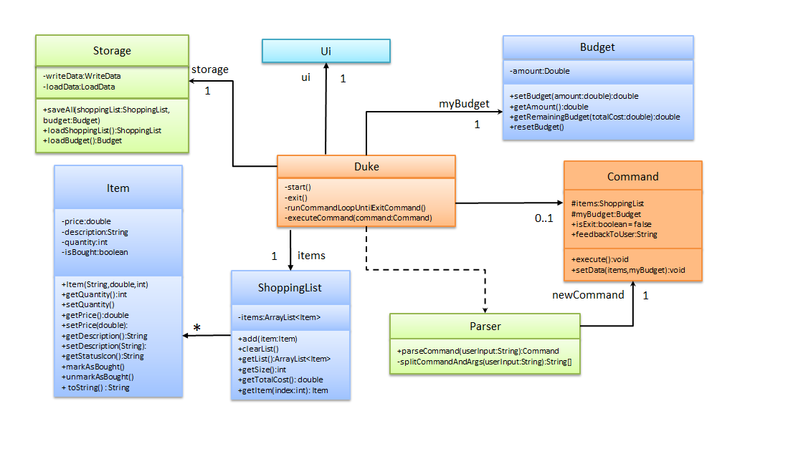

<!-- @@author kokjoon97 -->
The <code>Duke</code> class manages all required resources in the execution of the application. These include
a <code>ShoppingList</code> object to keep track of the <code>Item</code> objects the user has added to his list and
a <code>Budget</code> object to store the user's budget.

<code>Duke</code> also has a <code>Storage</code> object for saving and loading data from memory - this data includes
the latest saved <code>ShoppingList</code> and <code>Budget</code>.

There is a dependency from <code>Duke</code> to <code>Parser</code> as it only creates an instance of the <code>Parser</code>
every time user input is received by the <code>Ui</code> and does not keep track of the <code>Parser</code> which is deleted
after it is done parsing the current user input. The <code>Parser</code> determines what command is being invoked by the
user before creating a new <code>Command</code> object. It then returns the reference to the new <code>Command</code> object 
to <code>Duke</code>. 

At any point in time, <code>Duke</code> only stores up to one <code>Command</code> and no more. This
<code>Command</code> has to be executed before <code>Duke</code> can receive more user input.
<!-- @@author -->
&nbsp;

<b><a href="#developer-guide">&#129053; back to top</a></b>
&nbsp;

## 3. Implementation
This section will describe how the main features of the application are implemented.

<!-- @@author jiajuinphoon -->
### 3.1 Add feature
#### 3.1.1 Current implementation
 
 The add feature is implemented using an <code>AddCommand</code> class. This class extends from the main
 <code>Command</code> class. The user input **must contain at least a description** out of these parameters: 
 *description*, *price*, *quantity*. User can choose not to input price or quantity as the price will set to 
 default which is 0.0 if the user did not input any value for price. On the other hand, quantity will set to 
 default which is 1 if the user did not input any value for quantity. 
 
 The process is as follows:
 1. <code>Duke</code> class receives user input from the <code>Ui</code> class. 
 2. A <code>Parser</code> object is created to call its <code>parseCommand</code> method.
     * The <code>Parser</code> object instantiates an <code>AddCommand</code> object based on the user input.
 3. The <code>Duke</code> class calls the <code>AddCommand#execute()</code> method of the <code>AddCommand</code> object.
 4. In the <code>AddCommand#execute()</code> function, the <code>item</code> to be added is stored in the <code>ShoppingList</code> 
    object, using items.add().
 5. In the sequence diagram, the AddCommand will add <code>item</code> if the description is provided and one / both price and 
    quantity is provided. 
 6. The <code>item</code> object with its' values is stored into the <code>ShoppingList</code> object.
 
 The following sequence diagram below shows how the add feature works. The details of adding item's values
 are shown in a separate sequence diagram below:
 
 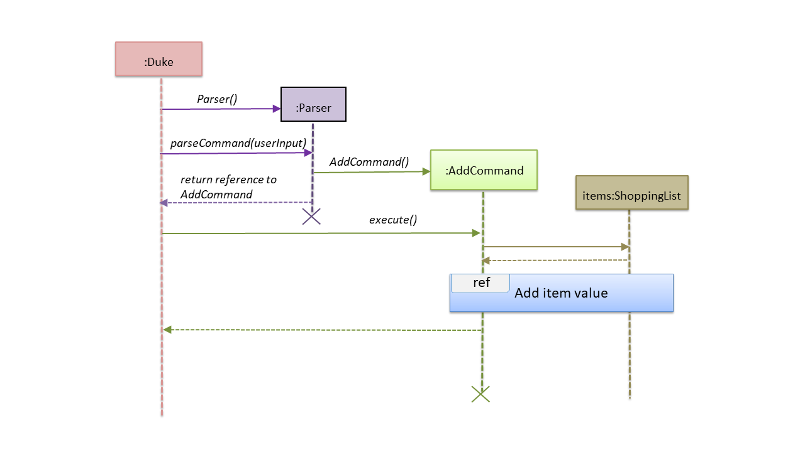
 
 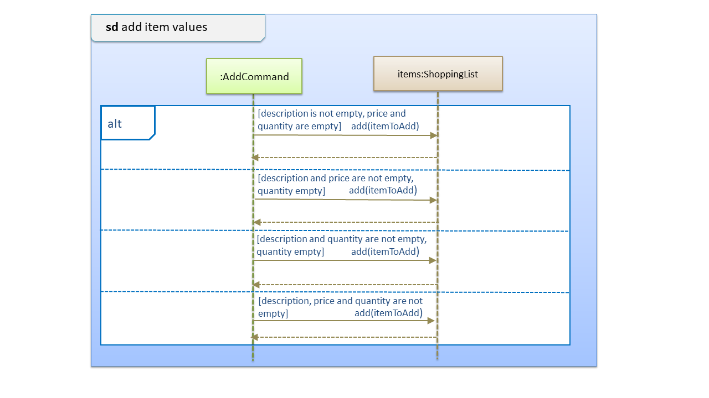
 
#### 3.1.2 Design considerations

##### Aspect: Data structure to support the add feature

- Alternative 1 (current choice): User must provided a description for item, duplicates are
                                  not allowed in the list. 
  - Pros: User has minimal potential to see unreasonable list in the Shopping List. For 
  example, having a item that has only price and quantity but without description and also
  a list that one item is recorded multiple times in the list.
  
  - Cons: Will significantly increase the code base as there is a need to check for the 
  presence of the variable in user input to avoid duplication, not user-friendly in certain 
  scenario (eg: user wants to have duplicates because the item is for different occasion and 
  the user wants to record down twice without any elaboration).

- Alternative 2: Require user to provide all three values to successfully add the item into 
                 the list. Duplicates are allowed

  - Pros: User will have a neat and unity Shopping list, dealing less with parameter (because users are
  forced to give all three variables). The duplicates item are useful in certain specific condition.
  
  - Cons: User flexibility will decrease, because user must input all parameters even if he/she does not want to 
  provide certain variables such as price and quantity, which will result unsuccessful adding items into the list. 
  Also, duplicate items may confuse the user, even though in some specific scenario, duplicate item may be useful to 
  the user.  
 
 Reasons for choosing Alternative 1 over alternative 2: By allowing user to just add the item without price,
 we can increase the flexibility. For instance, the user wants to buy milk but not sure how much does the milk
 cost and not sure how many milk they want to buy. So they can just add it into the list,
 and edit the price and quantity later when they knew the price and have decided the quantity. 

&nbsp;
<b><a href="#developer-guide">&#129053; back to top</a></b>
<!-- @@author -->

&nbsp;

<!-- @@author trishaangelica --> 
### 3.2 Edit feature
#### 3.2.1 Current implementation

The edit feature is implemented using an <code>EditCommand</code> class. This class extends from the main
<code>Command</code> class. The <code>item</code> object to be edited is identified by the index number provided 
in the user input. In addition to the index number, the user input **must also contain at least one** of these parameters: 
*description*, *price*, *quantity*. 

The process is as follows:

1. <code>Duke</code> class receives user input from the <code>Ui</code> class. 
2. A <code>Parser</code> object is created.
3. <code>Duke</code> calls <code>Parser#parseCommand()</code> method to instantiate an <code>EditCommand</code> object based on the user input.
4. <code>Duke</code> class then calls the <code>EditCommand#execute()</code> method.
5. In the <code>EditCommand#execute()</code> method, it first gets the <code>item</code> object through the
<code>ShoppingList#getItem()</code>. The original description / price / quantity of the item is overwritten 
with the new values from the user input. This is done through the use of the <code>Item</code> class setter methods.
6. The <code>item</code> object with its' new values is stored back to the <code>ShoppingList</code> object.

The following sequence diagram below shows how the edit feature works. The details of updating the items' values
have been omitted from the diagram. Those details are shown in a separate sequence diagram below:

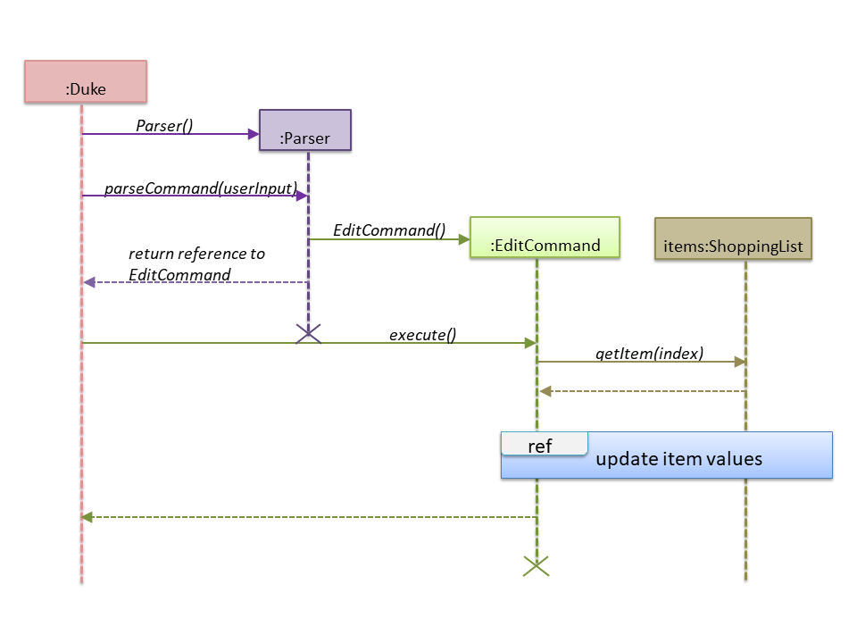

 The separate sequence diagram below shows how the item is updated with new values.

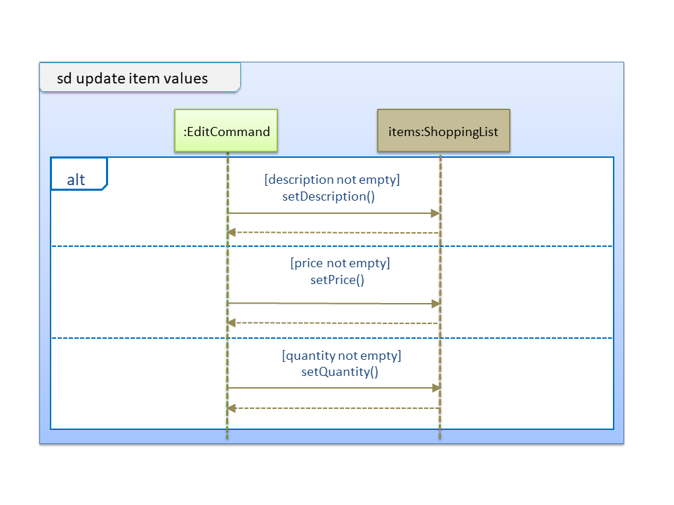

#### 3.2.2 Design considerations

##### Aspect: Data structure to support the edit feature

- Alternative 1 (current choice): Only parameters present in user input are treated as values to update.
  
  - Pros: User has the flexibility to choose which variables he/she wishes to update.
  
  - Cons: Might significantly increase the code base as there is a need to check for the 
    presence of the variable in user input.
 
 
- Alternative 2: Require all values of an <code>item</code> object to be updated and parameters must be in alphabetical
order.
  - Pros: Will have less code to deal with having no additional parsing of the input string.
  
  - Cons: Less user flexibility; user must input all parameters even if he/she does not wish to update certain
  variables.

 - Reason for choosing alternative 1: By allowing users to update any values they want, it provides them with greater convenience and freedom as they do not need to follow strict command "rules/order". Furthermore, having greater freedom on input values makes it a hassle-free process for the users.

&nbsp;
<b><a href="#developer-guide">&#129053; back to top</a></b>
<!-- @@author -->

&nbsp;

<!-- @@author kokjoon97 --> 
### 3.3 Delete feature
#### 3.3.1 Current implementation

The delete feature is implemented using a <code>DeleteCommand</code> class which extends the main
<code>Command</code> class with an index representing that of the item to be deleted from the shopping
list. 

The process is as follows:
1. <code>Duke</code> receives user input from <code>Ui</code>.
2. <code>Duke</code> calls <code>Parser#parseCommand()</code> to instantiate a <code>DeleteCommand</code> object based
on that user input.
3. <code>Duke</code> then calls <code>DeleteCommand#execute()</code>.
4. <code>DeleteCommand#execute()</code> makes another call to <code>ShoppingList#deleteItem()</code>.
5. The <code>Item</code> at the specified index is then removed from the <code>ShoppingList</code> object.

The following sequence diagram below shows how the delete feature works. Note the <code>Ui</code> class is
omitted in the sequence diagram to emphasise on the other classes:

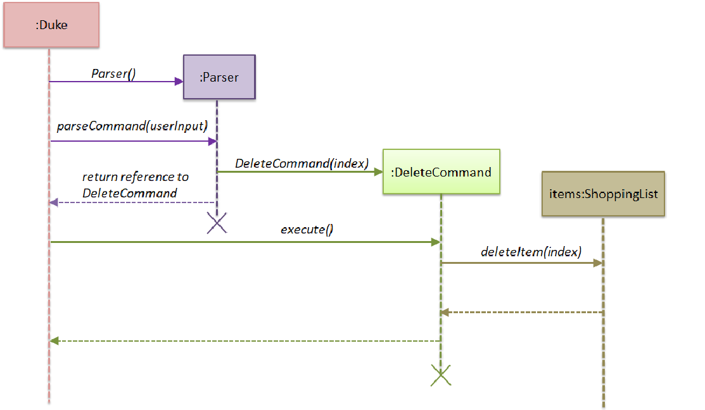

#### 3.3.2 Design considerations

##### Aspect: Data structure to support the delete feature

- Alternative 1 (current choice): Object-oriented style with a separate class for <code>DeleteCommand</code>
 
  - Pros: Easy to add the delete feature without having to change the logic of the code much as each command object
  is treated as a black box
  
  - Cons: Might significantly increase the code base with another class being added

- Alternative 2: Implement delete feature in the <code>Duke</code> class

  - Pros: Will have less code to deal with as a new function is simply created in the <code>Duke</code> class
  
  - Cons: Code becomes less organised since for every other command that we have implemented, <code>Duke</code> class
    simply executes those commands as black boxes, without worrying about their internal details

- Reason for choosing alternative 1: By abstracting out different command types as separate classes, this allowed us
to work better in parallel and also be able to spot bugs more easily as each class deals with a different functionality.

&nbsp;
<b><a href="#developer-guide">&#129053; back to top</a></b>

&nbsp;

### 3.4 Find feature
#### 3.4.1 Current implementation

The find feature is implemented using a <code>FindCommand</code> class which extends the main
<code>Command</code> class with a String representing the keyword specified by the user.

The process is as follows:
1. <code>Duke</code> receives user input from <code>Ui</code>.
2. <code>Duke</code> calls <code>Parser#parseCommand()</code> to instantiate a <code>FindCommand</code> object based on
that user input.
3. <code>Duke</code> then calls <code>FindCommand#execute()</code>.
4. <code>FindCommand#execute()</code> makes various calls to <code>ShoppingList#getItem()</code>
to check whether the <code>Item</code> at each specified index contains the given keyword.
5. Each <code>Item</code> that contains the keyword is then added to a new <code>ArrayList</code> named
 <code>filteredItems</code> that is maintained by the <code>FindCommand</code> object.
6. This list of matching results is then printed to standard output.

The following sequence diagram below shows how the <code>Duke</code> object creates the <code>FindCommand</code> object.
Note the <code>Ui</code> class isomitted in the sequence diagram to emphasise on the other classes:

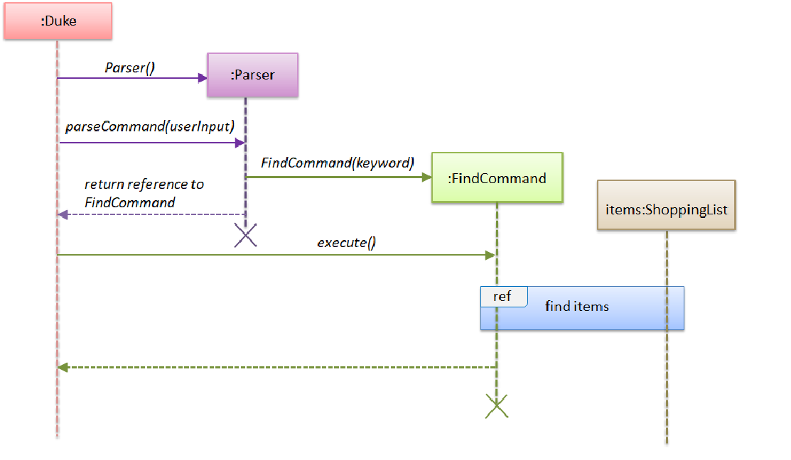

This next sequence diagram will show how the <code>FindCommand</code> creates the <code>filteredItems</code> list:

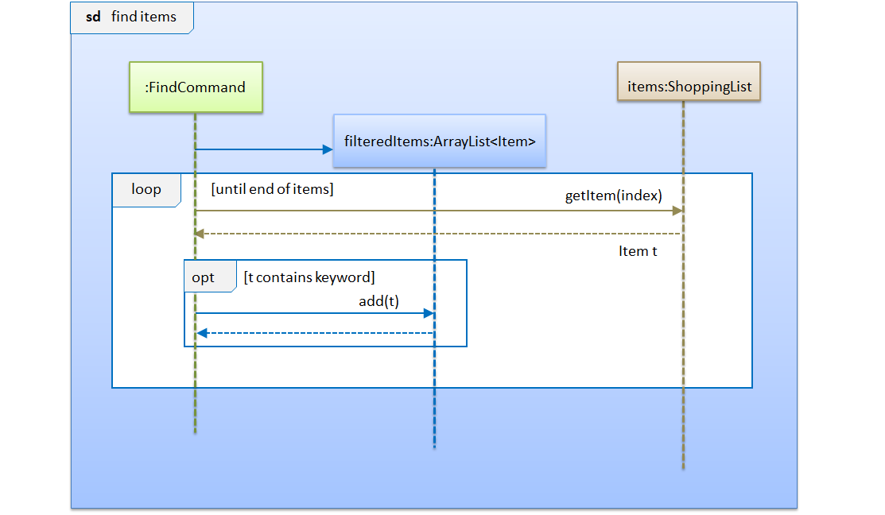

#### 3.4.2 Design considerations

##### Aspect: Data structure to support the find feature

- Alternative 1 (current choice): Object-oriented style with a separate class for <code>FindCommand</code>
 
  - Pros: Easy to add the find feature without having to change the logic of the code much as each command object
  is treated as a black box
  
  - Cons: Might significantly increase the code base with another class being added

- Alternative 2: Implement find feature in the <code>Duke</code> class

  - Pros: Will have less code to deal with as a new function is simply created in the <code>Duke</code> class
  
  - Cons: Code becomes less organised since for every other command that we have implemented, <code>Duke</code> class
    simply executes those commands as black boxes, without worrying about their internal details
    
- Reason for choosing alternative 1: With each command type having its own class, we could work better in parallel and
also be able to trace functionality bugs more easily if each command class deals with a different functionality.
<!-- @@author -->
  
&nbsp;
<b><a href="#developer-guide">&#129053; back to top</a></b>

&nbsp;

<!-- @@author Shannonwje --> 
### 3.5 Mark and Unmark feature
#### 3.5.1 Current Implementation
  
 The mark and unmark feature is implemented using the <code>MarkCommand</code> and <code>UnmarkCommand</code> class
 which extends the main <code>Command</code> class with an index representing that of the item to be marked or
 unmarked as bought in the list.
 
 The process of object creation:
 1. The <code>Duke</code> class first receives user input from the <code>Ui</code>
 2. The <code>Duke</code> class then creates a <code>Parser</code> object and calls its <code>parseCommand</code> method
 to instantiate a <code>MarkCommand</code> or <code>UnmarkCommand</code> object based on the user input
 3. The <code>Duke</code> class then calls the <code>execute</code> method of the <code>MarkCommand</code> or 
 <code>UnmarkCommand</code> command object. This calls the <code>markAsBought</code> or <code>unmarkAsBought</code>
 method of the <code>shoppingList</code> object with the specified index.

 The following sequence diagram below shows how the Mark feature (Diagram 1) and Unmark feature (Diagram 2) works.
 Note the <code>Ui</code> class is omitted in the sequence diagram to emphasise on the other classes:
  
 Diagram 1:
 
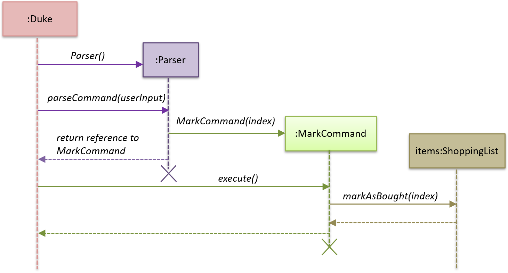
  
Diagram 2:

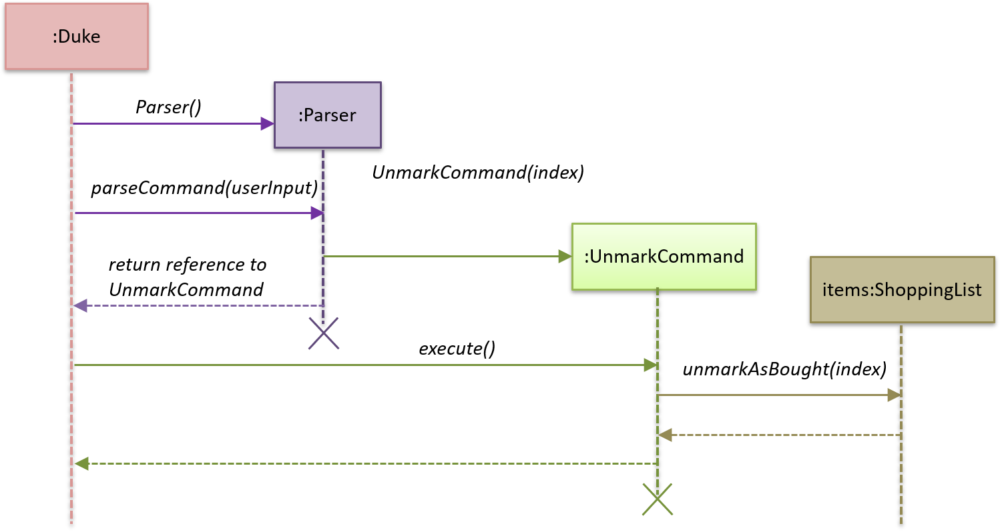

  
#### 3.5.2 Design Considerations
  
##### Aspect: Data structure to support the Mark and Unmark Feature
  
 - Alternative 1 (current choice): Object-oriented style with a separate class for <code>MarkCommand</code>
  and <code>UnmarkCommand</code>

   - Pros: Easy to edit and add the mark and unmark feature without having to change the logic of the code in
    multiple files
    
   - Cons: Might significantly increase the code base with another class being added
    
- Alternative 2: Implement the mark and unmark feature in either the <code>Duke</code> or <code>Parser</code> class

    - Pros: Will have less code and classes to deal with, without having to create a whole new object to execute
      the command.
    
    - Cons: Code becomes harder to navigate and understand since the command is all handled under one class, thus makes
    having to edit the mark and unmark feature difficult.
    
- Reasons for choosing alternative 1: By having an individual class on it's own, any bugs found in the mark and unmark
feature can be found easier and therefore helps to resolve the issue more efficiently. Also, with the feature being
implemented in an object-oriented style, reading and tracing the application code would be easier, thus making adding
future features to the mark and unmark feature easier as well.
<!-- @@author -->
    
&nbsp;
<b><a href="#developer-guide">&#129053; back to top</a></b>

&nbsp;

<!-- @@author JLoh579 -->
### 3.6 Display feature
This feature involves displaying the shopping list and budget details to the user.
#### 3.6.1 Current implementation

The display feature is implemented using a <code>DisplayCommand</code> class which extends the <code>Command</code> 
class. 
 
 The process is as follows:
1. <code>Duke</code> receives user input from <code>Ui</code>.
2. <code>Duke</code> calls <code>Parser#parseCommand()</code> to instantiate a <code>DisplayCommand</code> object based
on that user input.
3. <code>Duke</code> then calls <code>DisplayCommand#execute()</code>.
4. <code>DisplayCommand#execute()</code> makes a call to <code>ShoppingList#getTotalCost()</code> to find the cost of
the items.
5. <code>DisplayCommand#execute()</code> then calls  <code>Budget#getAmount()</code> and
<code>Budget#getRemainingBudget()</code>  to find the current budget and the remaining budget. 
6. The results are then printed to console.

The following sequence diagrams below show how the display feature works. Note the <code>Ui</code> class is
omitted to emphasise the other classes:

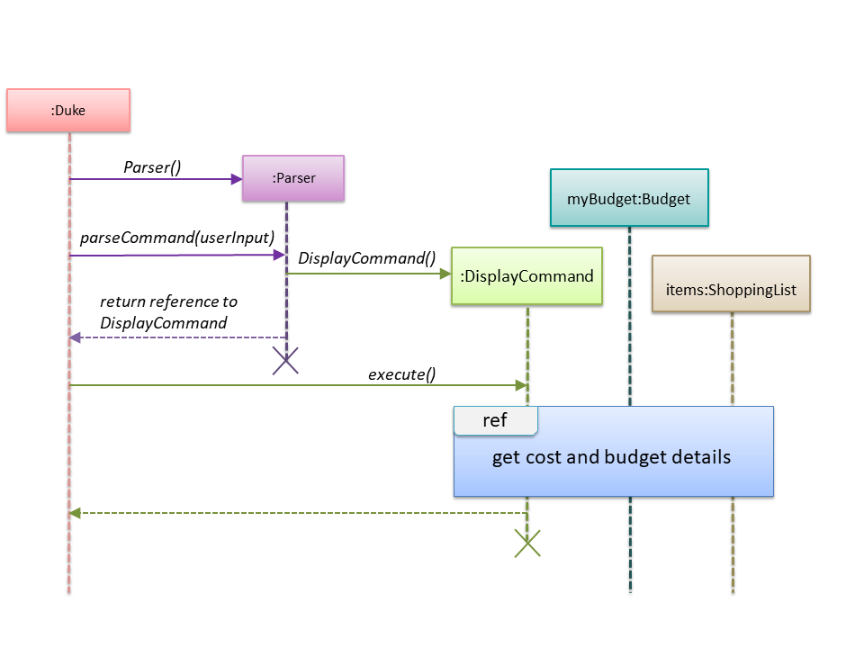

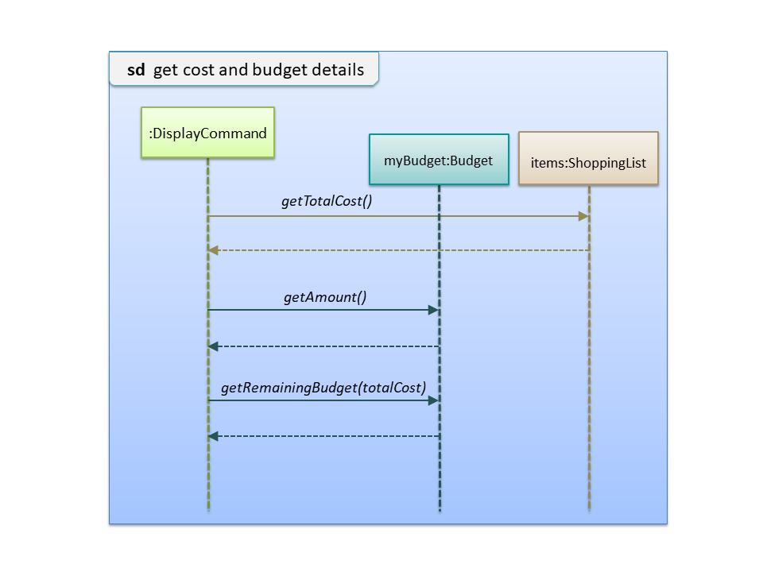

#### 3.6.2 Design considerations
##### Aspect: Data structure to support the display feature

- Alternative 1 (current choice): Object-oriented style with a separate class for <code>DisplayCommand</code>
 
  - Pros: Easy to add the display feature without having to change the logic of the code much as each command object
  is treated as a black box
  
  - Cons: Might significantly increase the code base with another class being added

- Alternative 2: Implement display feature in the <code>Duke</code> class

  - Pros: Will have less code to deal with as a new function is simply created in the <code>Duke</code> class
  
  - Cons: Handling the command under the <code>Duke</code> class results in longer methods. Thus, the code becomes 
  harder to navigate and understand. 
    
- Reason for choosing alternative 1: With each command type having its own class, we could work better in parallel and
also be able to trace functionality bugs more easily if each command class deals with its own functionality.

&nbsp;
<b><a href="#developer-guide">&#129053; back to top</a></b>

&nbsp;

<!-- @@author kokjoon97 -->
### 3.7 Set budget feature
#### 3.7.1 Current implementation

The set budget feature is implemented using a <code>SetBudgetCommand</code> class which extends the main
<code>Command</code> class with a variable representing the budget amount.

The process is as follows:
1. <code>Duke</code> receives user input from <code>Ui</code>.
2. <code>Duke</code> calls <code>Parser#parseCommand()</code> to instantiate a <code>SetBudgetCommand</code> object based on that user input.
3. <code>Duke</code> then calls <code>SetBudgetCommand#execute()</code>.
4. <code>SetBudgetCommand#execute()</code> makes another call to <code>Budget#setBudget()</code>.
5. The amount in the <code>Budget</code> object is set to the amount specified by the user.

The following sequence diagram below shows how the set budget feature works. Note the <code>Ui</code> class is
omitted in the sequence diagram to emphasise on the other classes:

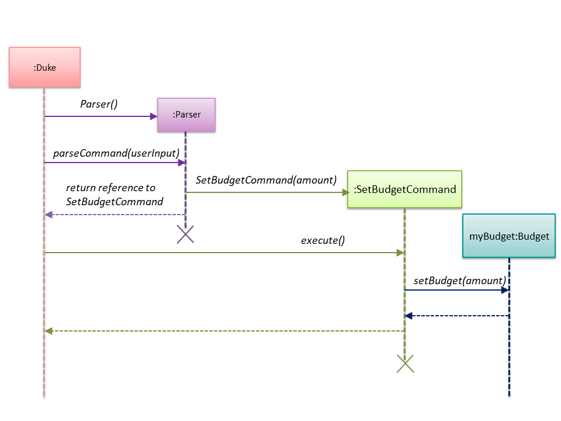

#### 3.7.2 Design considerations

##### Aspect: Data structure to support the set budget feature

- Alternative 1 (current choice): Object-oriented style with a separate class for <code>SetBudgetCommand</code>
 
  - Pros: Easy to add the set budget feature without having to change the logic of the code much as each command object
  is treated as a black box
  
  - Cons: Might significantly increase the code base with another class being added

- Alternative 2: Implement set budget feature in the <code>Duke</code> class

  - Pros: Will have less code to deal with as a new function is simply created in the <code>Duke</code> class
  
  - Cons: Code becomes less organised since for every other command that we have implemented, <code>Duke</code> class
  simply executes those commands as black boxes, without worrying about their internal details
  
- Reason for choosing alternative 1: By implementing each command type in a separate class, any bugs associated with a
particular functionality will not affect other functionalities that significantly. It would also make it easier for us to 
work in parallel.
<!-- @@author -->
 
&nbsp;
<b><a href="#developer-guide">&#129053; back to top</a></b>

&nbsp;

<!-- @@author Shannonwje --> 
### 3.8 Reset budget feature
#### 3.8.1 Current implementation

The reset budget feature is implemented using a <code>ResetBudgetCommand</code> class which extends the main
<code>Command</code> class with a variable representing the budget amount.

The <code>Duke</code> class first receives user input from the <code>Ui</code> class before it creates a 
<code>Parser</code> object and calls its <code>parseCommand</code> function to instantiate a 
<code>ResetBudgetCommand</code> object based on that user input.

The <code>Duke</code> class then calls the <code>execute</code> method of the <code>ResetBudgetCommand</code> object
which makes another call to the <code>resetBudget</code> function of the <code>Budget</code> object.

The following sequence diagram below shows how the reset budget feature works. Note the <code>Ui</code> class is
omitted in the sequence diagram to emphasise on the other classes:

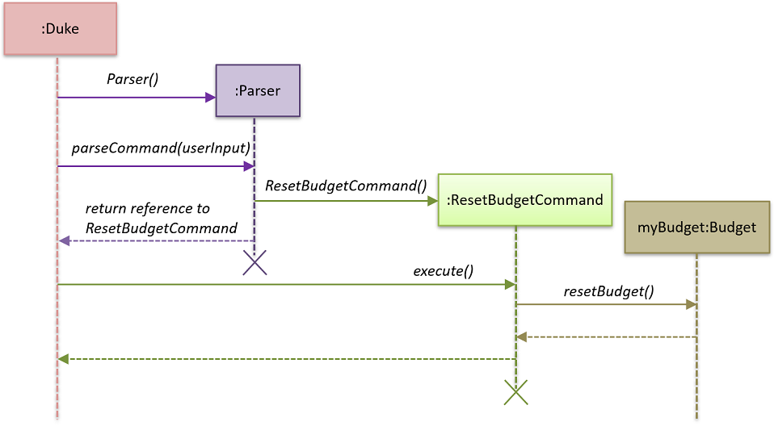

#### 3.8.2 Design considerations

##### Aspect: Data structure to support the reset budget feature

- Alternative 1 (current choice): Object-oriented style with a separate class for <code>ResetBudgetCommand</code>
 
  - Pros: Easy to add the reset budget feature without having to change the logic of the code much as each command
  object is treated as a black box
  
  - Cons: Might significantly increase the code base with another class being added

- Alternative 2: Implement reset budget feature in the <code>Duke</code> or <code>Parser</code> class

  - Pros: Will have less code to deal with as a new function is simply created in the <code>Duke</code> class
  
  - Cons: Code becomes less organised since for every other command that we have implemented, <code>Duke</code> class
  simply executes those commands as black boxes, without worrying about their internal details
  
  
- Reason for choosing alternative 1: By implementing each command type in a separate class, any bugs associated with a 
particular functionality will not affect other functionalities that significantly. It would also make it easier for us
to work in parallel.
  <!-- @@author -->
  
&nbsp;
<b><a href="#developer-guide">&#129053; back to top</a></b>

&nbsp;      
 
<!-- @@author JLoh579 -->
### 3.9 Clear list feature
 This feature involves clearing all items in the shopping list. Remaining budget is also set to the user’s set budget.
 
 #### 3.9.1 Current implementation
 The clear list feature is implemented using a <code>ClearCommand</code> class which extends the <code>Command</code> 
 class. 
 
  The process is as follows:
 1. <code>Duke</code> receives user input from <code>Ui</code>.
 2. <code>Duke</code> calls <code>Parser#parseCommand()</code> to instantiate a <code>ClearCommand</code> object based on that user input.
 3. <code>Duke</code> then calls <code>ClearCommand#execute()</code>.
 4. <code>ClearCommand#execute()</code> makes a call to <code>ShoppingList#clearList()</code>.
 
 The following sequence diagram below shows how the clear list feature works. Note the <code>Ui</code> class is
 omitted to emphasise the other classes:
   
 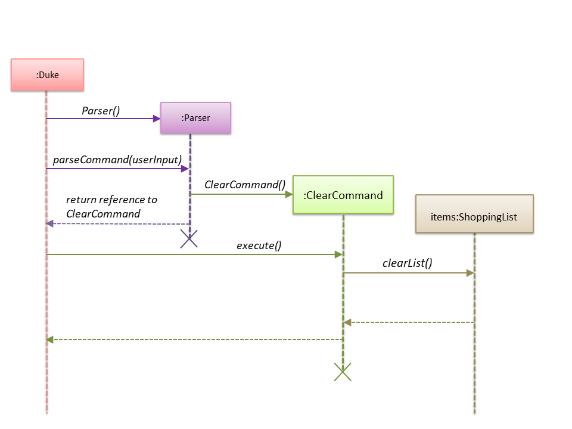
   
 #### 3.9.2 Design considerations
   
 ##### Aspect: Data structure to support the clear list feature
   
 - Alternative 1 (current choice): Object-oriented style with a separate class for <code>ClearCommand</code>
  
   - Pros: Easy to add the clear list feature without having to change the logic of the code much as each command object
   is treated as a black box
   
   - Cons: Might significantly increase the code base with another class being added
 
 
 - Alternative 2: Implement clear list feature in the <code>Duke</code> class
 
   - Pros: Will have less code to deal with as a new function is simply created in the <code>Duke</code> class
   
   - Cons: Handling the command under the <code>Duke</code> class results in longer methods. Thus, the code becomes 
   harder to navigate and understand. 
   
 - Reason for choosing alternative 1: With each command type having its own class, we could work better in parallel and
 also be able to trace functionality bugs more easily if each command class deals with a different functionality.
 
 &nbsp;
 <b><a href="#developer-guide">&#129053; back to top</a></b>
 
 &nbsp;
 <!-- @@author -->
 
<!-- @@author trishaangelica -->
### 3.10 View help feature
#### 3.10.1 Current implementation

The help feature is implemented using a <code>HelpCommand</code> class which extends the main
<code>Command</code> class. The <code>HelpCommand</code> class shows the program usage instructions to the user.

The <code>Duke</code> class first receives user input from the <code>Ui</code> class before it creates a 
<code>Parser</code> object and calls its <code>parseCommand</code> function. If the user input fails to match any
of the correct command keywords (<code>ADD</code>, <code>EDIT</code>, <code>DEL</code> etc.), a 
<code>HelpCommand</code> object will be instantiated.

Once instantiated, the <code>Duke</code> then class calls the <code>execute</code> method of the 
<code>HelpCommand</code> object. In this method, accepted command formats are displayed to the user.

The following sequence diagram below shows how the help feature works. Note the <code>Ui</code> class is
omitted in the sequence diagram to emphasise on the other classes:

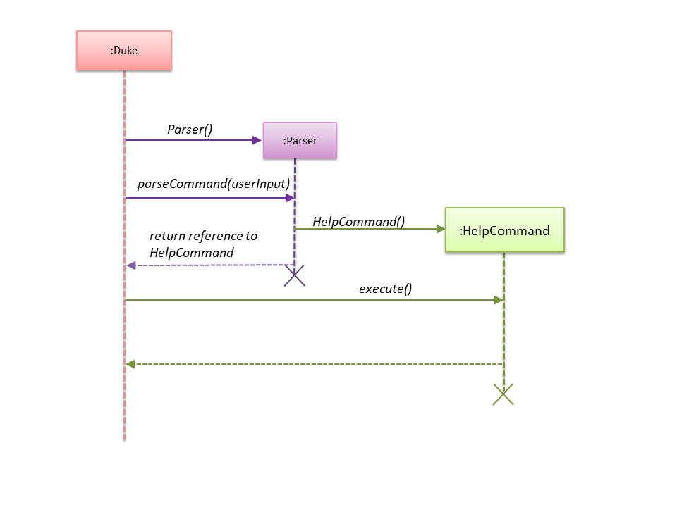

#### 3.10.2 Design considerations

##### Aspect: Data structure to support the help feature

- Alternative 1 (current choice): Object-oriented style with a separate class for <code>HelpCommand</code>
 
  - Pros: Easy to add the help feature without having to change the logic of the code much as each command
  object is treated as a black box
  
  - Cons: Might significantly increase the code base with another class being added

- Alternative 2: Implement help feature in the <code>Duke</code> or <code>Parser</code> class

  - Pros: Will have less code to deal with as a new function is simply created in the <code>Duke</code> class
  
  - Cons: Code becomes less organised since for every other command that we have implemented, <code>Duke</code> class
  simply executes those commands as black boxes, without worrying about their internal details

- Reason for choosing alternative 1: By abstracting out different command types as separate classes, we could work better in parallel and also be able to spot bugs more easily as each class deals with a different functionality
 
&nbsp;
<b><a href="#developer-guide">&#129053; back to top</a></b>

&nbsp;

### 3.11 Exit program feature
#### 3.11.1 Current implementation

The program termination feature is implemented using an <code>ExitCommand</code> class which extends the main
<code>Command</code> class. The <code>ExitCommand</code> class terminates the program when instantiated.

1. <code>Duke</code> class receives user input from the <code>Ui</code> class.
2. <code>Duke</code> calls <code>Parser#parseCommand()</code> to instantiate a <code>ExitCommand</code> object based on that user input. 
3. <code>Duke</code> then calls the <code>ExitCommand#execute()</code> method of the 
4. The program is terminated.

The following sequence diagram below shows how the exit feature works. Note the <code>Ui</code> class is
omitted in the sequence diagram to emphasise on the other classes:

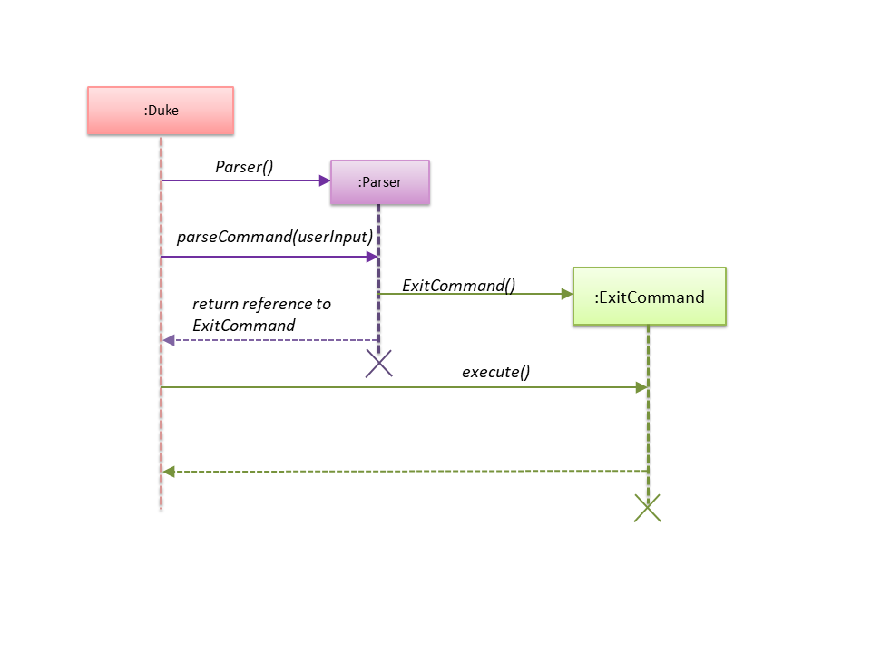

#### 3.11.2 Design considerations

##### Aspect: Data structure to support the exit feature

- Alternative 1 (current choice): Object-oriented style with a separate class for <code>ExitCommand</code>
 
  - Pros: Easy to add the exit feature without having to change much of the code logic as each command
  object is treated as a black box
  
  - Cons: Might significantly increase the code base with another class being added

- Alternative 2: Implement exit feature in the <code>Duke</code> or <code>Parser</code> class

  - Pros: Will have less code to deal with as a new function is simply created in the <code>Duke</code> class
  
  - Cons: Code becomes less organised since for every other command that we have implemented, <code>Duke</code> class
  simply executes those commands as black boxes, without worrying about their internal details

- Reason for choosing alternative 1: By abstracting out different command types as separate classes, we could work better in parallel and also be able to spot bugs more easily as each class deals with a different functionality

&nbsp;
<b><a href="#developer-guide">&#129053; back to top</a></b>
<!-- @@author -->

&nbsp;
<!-- @@author kokjoon97 -->
## Appendix A: Product Scope
This section talks about who this product is specially designed for and what it aims to achieve.

### Target user profile

- Likes to cook at home and requires help keeping track of complex grocery shopping lists and
staying within budget
- Prefers to use command line interface applications as opposed to other kinds of applications or
paper
- Can type fast

### Value proposition

- Make grocery shopping a breeze by offering greater flexibility in managing
shopping lists and also providing helpful features like budget tracking
<!-- @@author -->
&nbsp;
<b><a href="#developer-guide">&#129053; back to top</a></b>

&nbsp;

## Appendix B: User Stories
This section contains the user stories for the different versions of our product.

|Version| As a ... | I want to ... | So that I can ...|
|--------|----------|---------------|------------------|
|v1.0|organised home cook|be able to edit my budget|change my budget when I need to|
|v1.0|organised home cook|delete items from the list|manage my list|
|v1.0|organised home cook|have a useful "help" list that I can refer to|find instructions for various commands|
|v1.0|frugal home cook|add a budget|so that I know how much I have to spend| 
|v1.0|organised home cook|mark things as bought|keep track of my grocery progress|
|v1.0|frugal home cook|be able to clear my budget|set a new budget|
|v1.0|frugal home cook|be able to see the total value of the items in my shopping list|know that I am within budget|
|v1.0|frugal home cook|see the remaining budget that I have left|avoid exceeding my budget|
|v1.0|practical home cook|be able to clear all items from the list with one command|easily start off with a clean slate|
|v1.0|practical home cook|see all items on my list|see at a glance what I have planned to buy|
|v1.0|frugal home cook|see my budget|know if I'm within or out of my budget|
|v1.0|frugal home cook|calculate my remaining budget|see how much I have left to spend|
|v2.0|frugal home cook|be notified when I cross my budget|remove some items from my list|
|v2.0|practical home cook|be able to search for items on my list|find things easily in a long list|
|v2.0|practical home cook|be able to edit the items in my lists|update the items on my list accordingly|
|v2.0|organised home cook|save my list|have a local copy of my list|
|v2.0|organised home cook|load my saved list|add on to my existing list|
|v2.0|frugal home cook|see the remaining budget update based on the quantity of items|see how much I spend based on how much I buy|

&nbsp;
<b><a href="#developer-guide">&#129053; back to top</a></b>

&nbsp;
<!-- @@author kokjoon97 -->
## Appendix C: Non-Functional Requirements

1. Should work on any OS that has Java 11 or later installed.
2. Should respond to any user commands within 2 seconds.
3. Should be easy to use even for people who have never used a command line interface before.
<!-- @@author -->

&nbsp;
<b><a href="#developer-guide">&#129053; back to top</a></b>

&nbsp;

## Appendix D: Instructions for Manual Testing
> :information_source: These instructions only provide a starting point for testers to work on; testers are expected to do more _exploratory_ testing. 

### D.1. Launch and ShutDown
1. Initial launch 
    
      i.    Download the [latest jar file](https://github.com/AY1920S2-CS2113T-T13-1/tp/releases).
        
      ii.   Copy it into an empty folder on your desktop and rename the folder to "SHOCO.
        
      iii.  Open a command prompt window by typing <code>cmd</code> in the start menu.
        
      iv.   Change your directory to where the jar file is located by running the command <code>cd desktop/SHOCO</code>
        
      v.    Run the command <code>java -jar SHOCO.jar</code>
            
        Expected: Shows a welcome message from SHOCO.

    &nbsp;

2. Shut down
        
      i.    Enter the command <code>BYE</code> to exit the SHOCO application.
                
      ii.   Close the command terminal.
        
        Expected: Data is stored to shoppinglist.json and budget.json, the program is terminated.
  

   &nbsp;

    
<b><a href="#developer-guide">&#129053; back to top</a></b>
     
&nbsp;

### D.2. Set and Reset a budget

1. Set a budget
       
    i. Test case: <code>SET b/500.00</code>

       Expected: Budget is set to $500.00
    
     &nbsp;

    ii. Test case: <code>SET b/10000</code>
       
        Expected: Budget is set to $5000.00, which is the maximum budget SHOCO allows.
     
     &nbsp;

    iii. Test case: <code>SET b/-100</code>
     
        Expected: Budget is reset to $0.00, which is the minimum budget SHOCO allows.
        
     &nbsp;

    iv. Other incorrect set budget commands to try: <code>SET b/xxx</code> (where xxx is not a number).
            
        Expected: An error message and the correct usage of the SET command is shown.
     
     &nbsp;
     
2. Reset the budget
       
    i. Test case: <code>RES</code> 

        Expected: Budget has been reset to $0.00
    
     &nbsp;
     
    ii. Other incorrect reset budget commands to try: <code>RES xxx</code> (where xxx is not a number).
                     
        Expected: An error message and the correct usage of the RES command is shown.
     
     &nbsp;
     
<b><a href="#developer-guide">&#129053; back to top</a></b>
     
&nbsp;        
    
### D.3. Add and Edit an item

1. Add an item 
        
    *Optional:  List all items currently in the shopping list to prevent entering a duplicate item description : <code> DISPLAY </code>*
       
    i. Test case: <code> ADD i/apple p/3.00 q/2 </code>
       
       Expected: An item with the description - "apple", price - "$3.00" and quantity - "2"  is added.
         
     > :bulb: You can run the <code>DISPLAY</code> command to check the newly added item.
                                                           
    &nbsp;

    ii. Test case: <code>ADD p/3.00</code>
     
        Expected: No item is added. Error message and a correct usage of the ADD command is shown.
         
     &nbsp;
       
    iii. Other incorrect ADD commands to try: <code>ADD</code>, <code>ADD p/xxx</code>, <code>ADD q/xxx</code> (where xxx is not a number).
        
        Expected: Similar to previous. 
    
    &nbsp;

2. Edit an item
     
    > :bulb: You can run the <code>DISPLAY</code> command to check if the item has been correctly updated.
           
    i. Test case: <code>EDIT 1 i/banana</code>
    
    *Assumption: Valid index and description is provided. (No duplicate description allowed)*
    
        Expected: The description of the first item is updated to "banana". 
        
     &nbsp;
    
    ii. Test case: <code>EDIT 1 p/5.60</code>
           
        Expected: The price of the first item is updated to "$5.60". 
         
     &nbsp;
    
    iii. Test case: <code>EDIT 1 q/3</code>
         
        Expected: The quantity of the first item is updated to "3". 
            
     &nbsp;
    
    iv. Other incorrect edit commands to try: <code>EDIT p/xxx</code> , <code>EDIT q/xxx</code>. (where xxx is not a number).
                
        Expected: An error message and the correct usage of the EDIT command is shown.
         
     &nbsp;
    
 
<b><a href="#developer-guide">&#129053; back to top</a></b>
     
&nbsp;    

<!-- @@author Shannonwje -->    
### D.4. Mark and Un-mark an item

1. Marking an item
      
   i. Test case: <code>MARK 5</code>    
      *Assumption: there are 5 or more items in the list. The 5th item has a description of 'lemons', price of '$4.00' and quantity of '6'.*

        Expected: The fifth item in the list is mark as bought, denoted as [B].
    
    &nbsp;

   ii. Test case: <code>MARK -10</code> 
        
        Expected: An error message stating that the item does not exist in the list is shown.
    
    &nbsp;

   iii. Test case: <code>MARK 100</code> 

        Expected: An error message stating that the item does not exist in the list is shown.
    
   &nbsp;
     
   iv. Other incorrect MARK commands to try: <code>MARK xxx</code> (where xxx is not a number).
     
         Expected: An error message stating to provide a single numerical index number is shown.
     
   &nbsp;
     
2. Un-marking an item

   *Assumption: there are 5 or more items in the list. The 5th item has a description of 'lemons', price of '$4.00' and quantity of '6'*
       
   i. Test case: <code>UNMARK 5</code> 

         Expected: The fifth item in the list is unmarked as bought, denoted as [0].
    
    &nbsp;

   ii. Test case: <code>UNMARK -10</code> 

       Expected: Oh No! This item does not exist in the list
    
     &nbsp;

   iii. Test case: <code>UNMARK 100</code> 

       Expected: Oh No! This item does not exist in the list
    
     &nbsp;
     
   iv. Other incorrect UNMARK commands to try: <code>UNMARK xxx</code> (where xxx is not a number).
     
        Expected: An error message stating to provide a single numerical index number is shown.
         
     &nbsp;
     
     
<b><a href="#developer-guide">&#129053; back to top</a></b>
     
&nbsp;
     
<!-- @@author -->
    
  
### D.5. Find and Delete an item

1. Find an item based on keyword
       
    i. Test case: <code>FIND apple</code> 

       Expected: A list of items that contains "apple" in their description is displayed.
    
     &nbsp;

    ii. Test case: <code>FIND xxx</code> (where xxx is a keyword that is unmatched)
       
        Expected: A message that says "Sorry, no results could be found" is shown.
     
     &nbsp;
 
2. Delete an item

     > :bulb: You can run the <code>DISPLAY</code> command to check the index of the items.
         
    i. Test case: <code>DEL 1</code> 

       Expected: The first item (if it exists), is deleted.
    
     &nbsp;

    ii. Test case: <code>DEL xxx</code> (where xxx is a not a number / the item does not exist yet)
       
        Expected: An error message is shown. 
     
     &nbsp;

<b><a href="#developer-guide">&#129053; back to top</a></b>

&nbsp;

### D.6. Display and Clear the shopping list

1. List all items in the shopping list
            
     i. Test case: <code>DISPLAY</code>
           
        Expected: A list containing all the items is displayed in a table.The current amount of the budget is also shown.
                                                                            
      &nbsp;

2. Clear all items in the shopping list
            
     i. Test case: <code>CLEAR</code>
           
        Expected: The shopping list is cleared.
                                                                            
      &nbsp;
  
<b><a href="#developer-guide">&#129053; back to top</a></b>
  
&nbsp;            
    