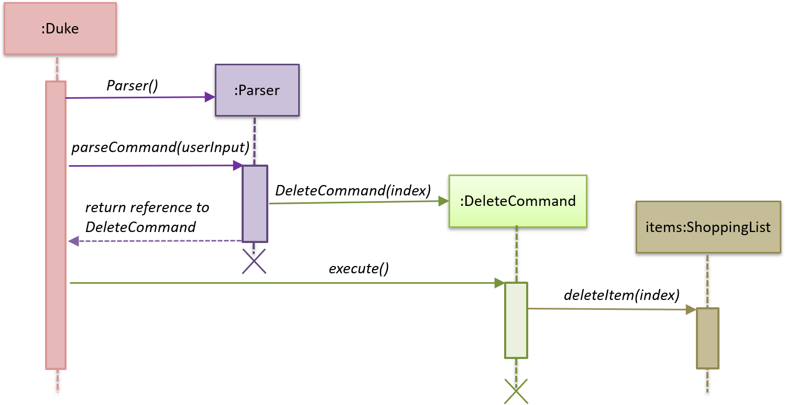
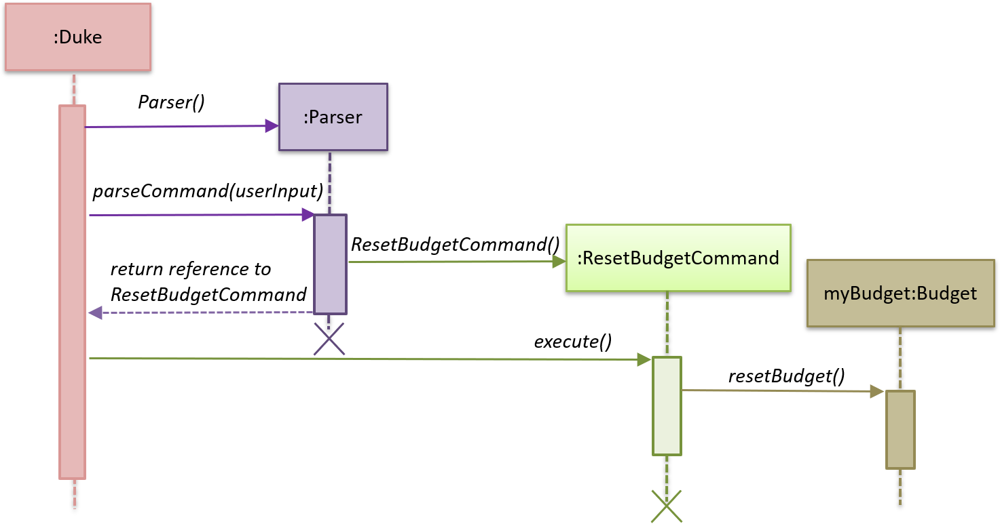

# Developer Guide

## 1. Design 
{Describe the design and implementation of the product. Use UML diagrams and short code snippets where applicable.}

## 2. Implementation
This section will describe how the main features of the application are implemented.

  
  
### 2.1 Delete feature
#### 2.1.1 Current implementation

The delete feature is implemented using a <code>DeleteCommand</code> class which extends the main
<code>Command</code> class with an index representing that of the item to be deleted from the shopping
list. 

The <code>Duke</code> class first receives user input from the <code>Ui</code> class before it creates a 
<code>Parser</code> object and calls its <code>parseCommand</code> function to instantiate a 
<code>DeleteCommand</code> object based on that user input.

The <code>Duke</code> class then calls the <code>execute</code> method of the <code>DeleteCommand</code> object
which makes another call to the <code>deleteItem</code> function of the <code>ShoppingList</code> object 
with the specified index.

The following sequence diagram below shows how the delete feature works. Note the <code>Ui</code> class is
omitted in the sequence diagram to emphasise on the other classes:

#### 2.1.2 Design considerations

##### Aspect: Data structure to support the delete feature

- Alternative 1 (current choice): Object-oriented style with a separate class for <code>DeleteCommand</code>
 
  - Pros: Easy to add the delete feature without having to change the logic of the code much as each command object
  is treated as a black box
  
  - Cons: Might significantly increase the code base with another class being added

- Alternative 2: Implement delete feature in the <code>Duke</code> class

  - Pros: Will have lesser code to deal with as a new function is simply created in the <code>Duke</code> class
  
  - Cons: Code becomes less organised since for every other command that we have implemented, <code>Duke</code> class
  simply executes those commands as black boxes, without worrying about their internal details

### 2.2 Set budget feature
#### 2.2.1 Current implementation

The set budget feature is implemented using a <code>SetBudgetCommand</code> class which extends the main
<code>Command</code> class with a variable representing the budget amount.

The <code>Duke</code> class first receives user input from the <code>Ui</code> class before it creates a 
<code>Parser</code> object and calls its <code>parseCommand</code> function to instantiate a 
<code>SetBudgetCommand</code> object based on that user input.

The <code>Duke</code> class then calls the <code>execute</code> method of the <code>SetBudgetCommand</code> object
which makes another call to the <code>setBudget</code> function of the <code>Budget</code> object 
with the amount specified by the user for the budget.

The following sequence diagram below shows how the set budget feature works. Note the <code>Ui</code> class is
omitted in the sequence diagram to emphasise on the other classes:

#### 2.2.2 Design considerations

##### Aspect: Data structure to support the set budget feature

- Alternative 1 (current choice): Object-oriented style with a separate class for <code>SetBudgetCommand</code>
 
  - Pros: Easy to add the set budget feature without having to change the logic of the code much as each command object
  is treated as a black box
  
  - Cons: Might significantly increase the code base with another class being added

- Alternative 2: Implement set budget feature in the <code>Duke</code> class

  - Pros: Will have lesser code to deal with as a new function is simply created in the <code>Duke</code> class
  
  - Cons: Code becomes less organised since for every other command that we have implemented, <code>Duke</code> class
  simply executes those commands as black boxes, without worrying about their internal details

### 2.3 Edit feature
#### 2.3.1 Current implementation

The edit feature is implemented using an <code>EditCommand</code> class. This class extends from the main
<code>Command</code> class. The <code>item</code> object to be edited is identified by the index number provided 
in the user input. In addition to the index no. , the user input **must also contain at least one** of these parameters: 
*description*, *price*, *quantity*.

Process of object creation:
1. First, <code>Duke</code> class receives user input from the <code>Ui</code> class. 
2. Next, a <code>Parser</code> object is created to call its <code>parseCommand</code> method.
    * The <code>Parser</code> object instantiates an <code>EditCommand</code> object based on the user input.
3. Then, the <code>Duke</code> class calls the <code>execute</code> method of the <code>EditCommand</code> object.
4. In the <code>execute</code> function, the <code>item</code> to be edited (based on the specified index of the 
user input) 
is called from the <code>ShoppingList</code> object.The original description/price/quantity of the item is overwritten 
with the new values from the user input.
5. Finally, the <code>item</code> object with its' new values is stored back to the <code>ShoppingList</code> object.

The following sequence diagram below shows how the edit feature works. The details of the updating of the item's values
have been omitted from the diagram. Those details are shown in a separate sequence diagram below:

#### 2.3.2 Design considerations

##### Aspect: Data structure to support the edit feature

- Alternative 1 (current choice): Only parameters present in user input are treated as values to update.
  - Pros: User has the flexibility to choose which item variables he/she wishes to update.
  
  - Cons: Might significantly increase the code base as there is a need to check for the 
  presence of the variable in user input.

- Alternative 2: Require all values to be updated

  - Pros: Will have lesser code to deal with having no additional parsing of input string needed.
  
  - Cons: Less user flexibility, user must input all parameters even if he/she does not want to update certain
  variables.
  
  
### 2.4 Mark and Unmark feature
#### 2.4.1 Current Implementation

The mark and unmark feature is implemented using the <code>MarkCommand</code> and <code>UnmarkCommand</code> class
which extends the main <code>Command</code> class with an index representing that of the item to be marked or
unmarked as bought in the list.

The process of object creation:
1. The <code>Duke</code> class first receives user input from the <code>Ui</code>
2. The <code>Duke</code> class then creates a <code>Parser</code> object and calls its <code>parseCommand</code> method
to instantiate a <code>MarkCommand</code> or <code>UnmarkCommand</code> object based on the user input
3. The <code>Duke</code> class then calls the <code>execute</code> method of the <code>MarkCommand</code> or 
<code>UnmarkCommand</code> command object. This calls the <code>markAsBought</code> or <code>unmarkAsBought</code>
method of the <code>shoppingList</code> object with the specified index.

The following sequence diagram below shows how the Mark feature (Diagram 1) and Unmark feature (Diagram 2) works.
Note the <code>Ui</code> class is omitted in the sequence diagram to emphasise on the other classes:

######Diagram 1:

######Diagram 2:

#### 2.4.2 Design Considerations

##### Aspect: Data structure to support the Mark and Unmark Feature

- Alternative 1 (current choice): Object-oriented style with a separate class for <code>MarkCommand</code>
and <code>UnmarkCommand</code>
  - Pros: Easy to edit and add the mark and unmark feature without having to change the logic of the code in
  multiple files
  
  - Cons: Might significantly increase the code base with another class being added
  
- Alternative 2: Implement the mark and unmark feature in either the <code>Duke</code> or <code>Parser</code> class
  - Pros: Will have lesser code and classes to deal with, without having to create a whole new object to execute
  the command.
  
  - Cons: Code becomes harder to navigate and understand since the command is all handled under one class, thus makes
  having to edit the mark and unmark feature difficult.
  
### 2.5 Reset budget feature
#### 2.5.1 Current implementation

The reset budget feature is implemented using a <code>ResetBudgetCommand</code> class which extends the main
<code>Command</code> class with a variable representing the budget amount.

The <code>Duke</code> class first receives user input from the <code>Ui</code> class before it creates a 
<code>Parser</code> object and calls its <code>parseCommand</code> function to instantiate a 
<code>ResetBudgetCommand</code> object based on that user input.

The <code>Duke</code> class then calls the <code>execute</code> method of the <code>ResetBudgetCommand</code> object
which makes another call to the <code>resetBudget</code> function of the <code>Budget</code> object 
with the amount specified by the user for the budget.

The following sequence diagram below shows how the set budget feature works. Note the <code>Ui</code> class is
omitted in the sequence diagram to emphasise on the other classes:

#### 2.2.2 Design considerations

##### Aspect: Data structure to support the set budget feature

- Alternative 1 (current choice): Object-oriented style with a separate class for <code>ResetBudgetCommand</code>
 
  - Pros: Easy to add the reset budget feature without having to change the logic of the code much as each command
  object is treated as a black box
  
  - Cons: Might significantly increase the code base with another class being added

- Alternative 2: Implement reset budget feature in the <code>Duke</code> or <code>Parser</code> class

  - Pros: Will have lesser code to deal with as a new function is simply created in the <code>Duke</code> class
  
  - Cons: Code becomes less organised since for every other command that we have implemented, <code>Duke</code> class
  simply executes those commands as black boxes, without worrying about their internal details
  
## Appendix A: Product Scope
### Target user profile

- Likes to cook at home and requires help keeping track of complex grocery shopping lists and
staying within budget
- Prefers to use command line interface applications as opposed to other kinds of applications or
paper
- Can type fast

### Value proposition

- Make grocery shopping a breeze by offering greater flexibility in managing
shopping lists and also providing helpful features like budget tracking

## Appendix B: User Stories

|Version| As a ... | I want to ... | So that I can ...|
|--------|----------|---------------|------------------|
|v1.0|organised home cook|be able to edit my budget|change my budget when I need to|
|v1.0|organised home cook|delete items from the list|manage my list|
|v1.0|organised home cook|have a useful "help" list that I can refer to|find instructions for various commands|
|v1.0|frugal home cook|add a budget|so that I know how much I have to spend|
|v2.0|frugal home cook|be notified when I cross my budget|remove some items from my list|
|v2.0|practical home cook|be able to search for items on my list|find things easily in a long list|
|v2.0|practical home cook|be able to edit the items in my lists|update the items on my list accordingly|

## Appendix C: Non-Functional Requirements

1. Should work on any OS that has Java 11 or later installed.
2. Should respond to any user commands within 2 seconds.
3. Should be easy to use for people who have never used a command line interface before.

## Appendix D: Glossary

* *glossary item* - Definition

## Appendix E: Instructions for Manual Testing

{Give instructions on how to do a manual product testing e.g., how to load sample data to be used for testing}
