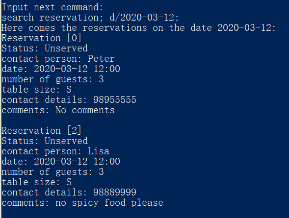
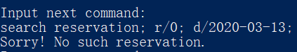
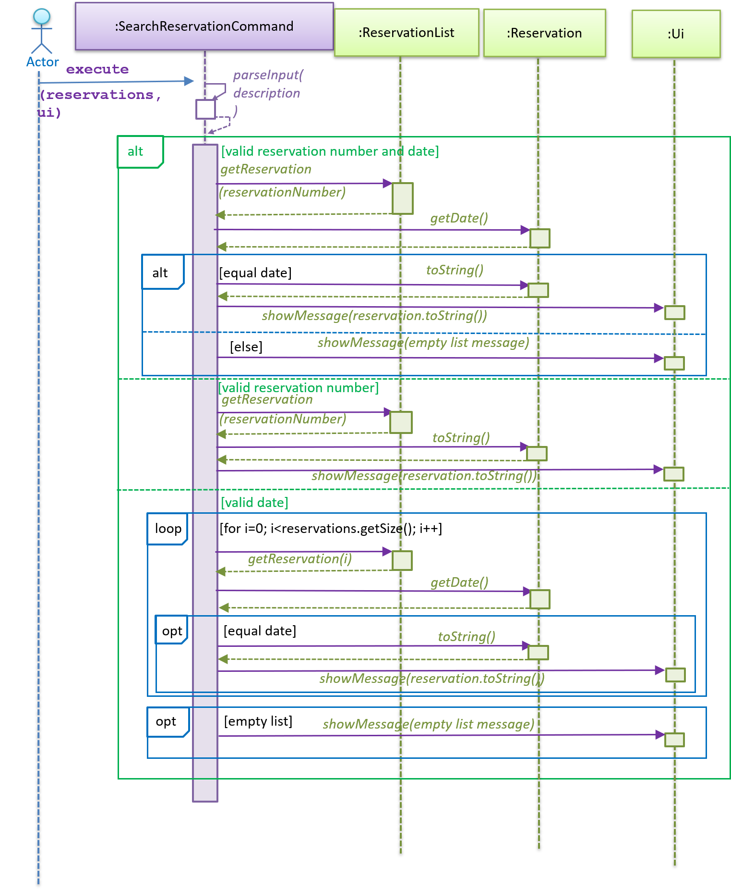

# Developer Guide
**By:** Team T14-4 
**Since:** May 2020

* [1. Design & Implementation](#design-implementation)
    + [1.1. [Proposed] Search stock feature](#search-stock)
    + [1.2. [Proposed] List stock in descending quantities](#list-stock)
    + [1.3. [Proposed] Generate profit for the day](#generate-profit)
    + [1.4. [Proposed] Search reservation](#search-reservation)
    + [1.5. [Proposed] Search dish](#search-dish)
* [2. Product Scope](#product-scope)
* [3. User Stories](#user-stories)
* [4. Non-Functional Requirements](#nonfunctional-requirement)
* [5. Glossary](#glossary)

## 1. Design & Implementation

{Describe the design and implementation of the product. Use UML diagrams and short code snippets where applicable.}

### 1.1 [Proposed] Search stock feature
#### 1.1.1 Proposed implementation

In the restaurant daily report, users can search against the stock category by supplying a keyword.

Given below is an example usage scenario and how the search mechanism behaves at each step.

Step 1. The user launches the application for the first time. An empty `stock` will be initialized.

Step 2. The user executes `add stock; i/tomato; q/10; p/$0.40;` command to add a tomato ingredient into the `stock`. Further, the user may add more ingredients into the current `stock`. Suppose the user executes `add stock; i/potato; q/5; p/$0.40;` and `add stock; i/rice; q/3; p/$0.40;` as well.

Step 3. The user can now search against the current `stock` to see if an ingredient is stored in the `stock`. The user now executes `search stock; k/tomato;`, which will display the following result in the image. 

  

The following sequence diagram shows how the search operation works:

  

#### 1.1.2 Design Considerations
##### Aspect: How search stock executes
* **Alternative 1 (current choice)**: List all ingredients that contains the keyword supplied.
  + Pros: Easy to implement.
  + Cons: All ingredients containing the keyword will be listed. This means that even if the keyword doesn't make sense, such as supplying "to", both potato and tomato will be listed since it contains "to".

* **Alternative 2**: The user supplies the exact ingredient name.
  + Pros: The ingredient that matches exactly with the keyword supplied will be listed.
  + Cons: The user have to input the ingredient name correctly each time he/she uses the search stock feature.

##### Aspect: Data structure to support the search stock feature.
* **Alternative 1 (current choice)**: Use a `List` to store all possible ingredient names that contain the keyword supplied.
  + Pros: Easy to understand.
  + Cons: The `List` is derived by converting the existing stock (which is a `HashMap`) into an ArrayList. In order to print out the ingredient's name, quantity and price, methods such as `getKey()` and `getValue()` have to be used.

* **Alternative 2**: Use the existing `HashMap` data structure employed by the `stock` object.
  + Pros: We do not need to create a new `List` to display the relevant results.
  + Cons: Iterating a HashMap can be done by converting it to an EntrySet or by using an iterator. These, compared to `List`, is much less straightforward.

### 1.2 [Proposed] List stock ingredients in descending quantity
#### 1.2.1 Proposed implementation

In the restaurant daily report, users can view all the ingredients presently in the stock by supplying the input `list stock`. The ingredients will be ordered in descending quantities, that is, the ingredient that has the highest quantity will be listed first and vice versa.

Given below is an example usage scenario and how the listing mechanism behaves at each step.

Step 1. The user launches the application for the first time. An empty `stock` will be initialized.

Step 2. The user executes `add stock; i/tomato; q/10; p/$0.40;` command to add a tomato ingredient into the `stock`. Further, the user may add more ingredients into the current `stock`. Suppose the user executes `add stock; i/potato; q/0; p/$0.40;` and `add stock; i/rice; q/55; p/$0.40;` as well.

Step 3. The user can now view the current `stock` to see what ingredients are there in the stock. The user now executes `list stock`, which will display the following result in the image. In this case, `rice` has the highest quantity of `55`, which is listed first as compared to `potato`, which has the lowest quantity of `0`. This can be seen from the image below.

  

The following class diagram shows how the listing operation works:

  

1. When the user first runs the application, the Main object is initialized. The Main object then initializes the ui and the stock object in its `start()` method. 
2. Through its `runCommandUntilExit()` method, it then instructs the ui object to scan and read for user input. A CommandParser object is then initialized to parse this user input into a command.
3. The CommandParser object detects `list stock` as the user input, in which it will then create a ListStockCommand object.
4. The ListStockCommand object is then executed via its `execute(stock)` method, which takes in the stock object initialized previously and instruct it to list all ingredients through its `listIngredient()` method.
5. Within  the `listIngredient()` method, a temporary `List` data structure is used to convert from the `HashMap` in the stock object. The list is then sorted by supplying a `new Comparator` that compares the ingredient's quantity. Afterwards, the sorted list is then printed to be displayed to the user.

#### 1.2.2 Design Considerations

##### Aspect: How listing stock executes
* **Alternative 1 (current choice)**: List all ingredients in the stock in descending quantities.
  + Pros: The user is able to tell which ingredients are the least/most quickly. This can help to facilitate quicker decision making in terms of what ingredients to re-stock.
  + Cons: The current ingredients are listed in a specific ordering. A change in the ordering requirement would mean that a change in the implementation of the `comparator`.

* **Alternative 2**: List all ingredients in the stock without any ordering.
  + Pros: Easy to implement.
  + Cons: Hard to identity which ingredients that require re-stocking quickly.

##### Aspect: Data structure to support the search stock feature.
* **Alternative 1 (current choice)**: Use a `List` to store all possible ingredient names.
  + Pros: Easy to understand.
  + Cons: The `List` is derived by converting the existing stock (which is a `HashMap`) into an ArrayList. In order to print out the ingredient's name, quantity and price, methods such as `getKey()` and `getValue()` have to be used.

* **Alternative 2**: Use the existing `HashMap` data structure employed by the `stock` object.
  + Pros: We do not need to create a new `List` to display the relevant results.
  + Cons: Iterating a HashMap can be done by converting it to an EntrySet or by using an iterator. Sorting it, however, as compared to `List`, is much less straightforward.

### 1.3 [Proposed] Generate profit for the day
#### 1.3.1 Proposed Implementation
In the restaurant daily report, the user can input the amount of items sold each day and a total profit will be generated, when the user inputs `profit`.

Below is an example usage scenario for the user.

Step 1. The user opens the program and an empty `sales` is initialized.

Step 2. The user can add sold items by inputting `sell dish; d/DISH; q/QUANTITY`. An example would be `sell dish; d/pasta; q/15;`.
The user can input as many sales as they like as long as the dish exists in the menu.

Step 3. The user can generate the profit by inputting `profit`.

### 1.3.2 Design Considerations
#### Aspect: Using a separate class to perform sale commands
**Current Implementation**: Methods are stored in the sales class
* Pros: Easy to understand and implement.
* Cons: May make the sales class long and convoluted and may become difficult to find certain features or methods

**Alternative**: Commands are stored in separate classes
* Pros: Easier for a person who hasn't worked on the project to understand the structure
* Cons: Takes longer to implement
=======

### 1.4 [Proposed] Search reservation
#### 1.4.1. Propose Implementation

In the restaurant daily report, users can search against the reservation category by supplying either a reservation number or a date.

The feature implements the following operations:
* `SearchReservationCommand#parseInput()` - parse the user input for either reservation number or a date.
* `SearchReservationCommand#execute()` - search along the reservation list for the target reservation(s).

The following class diagram shows the structures relevant to the "search reservation" feature:

    

Given below is an example usage scenario and how the search mechanism behaves at each step.

Step 1. The user launches the application for the first time. An empty `reservation` will be initialized.

Step 2. The user executes `add reservation; p/Peter; d/2020-03-12 12:00; n/3; c/98955555;` command to add a reservation into the `reservation` list.  
Further, the user may add more reservations into the current `reservation` list.  
Suppose the user executes `add reservation; p/Mary; d/2020-03-11 12:00; n/8; c/99998888;`  
and `add reservation; p/Lisa; m/no spicy food please; d/2020-03-12 12:00; n/3; c/98889999;` as well.

Step 3. The user can now search against the current `reservation` list to see if an reservation is stored in the `reservation` list.  
If the user executes `search reservation; r/0;`, the following result will be displayed in the image.

    

If the user executes `search reservation; d/2020-03-12;`, the following result will be displayed in the image.

    

If the user executes `search reservation; r/0; d/2020-03-13;`, the following result will be displayed in the image.

    

The following sequence diagram shows the relevant interactions behind `search reservation`:

    

#### 1.4.2 Design Considerations
##### Aspect: How search reservation executes
* **Alternative 1 (current choice)**: Access reservation by `ReservationList#getReservation(reservationNumber)` if reservation number is provided,
or do linear search along the reservation list for reservations with date matched.
  + Pros: Easy to implement and understand.
  + Cons: May have performance issues in terms of time usage when searching along the reservation list.

* **Alternative 2**: Create a `HashMap` with date as the key and all Reservation objects in that date as the value.
Once a new Reservation object is created, it will be added into the `HashMap` according to its date.
  + Pros: Easier for searching in terms of date.
  + Cons: Extra memory space is needed.

**The reason to make the current choice:**  
There is a trade-off between time and space.
So far the reservation list size is not very large, so it is acceptable to do linear search along the list.
Creating `HashMap` for each date will lead to many `HashMap`s, which is space-wasting in current stage.
Utilization of `HashMap` will be considered if the restaurant becomes more popular and the reservation list gets longer and longer.

##### Aspect: Data structure to support the search reservation feature.
* **Alternative 1 (current choice)**: Display all all `Reservation` objects that contain the reservation number or date provided to the screen directly.
  + Pros: Easy to implement and understand.
  + Cons: The target objects are not really "contained" in a data structure.

* **Alternative 2**: Use a `List` to store all `Reservation` objects that contain the reservation number or date provided.
  + Pros: Objects are stored in a data structure, which is easier to do operation on that specific collections of objects.
  + Cons: Extra memory space is needed.

**The reason to make the current choice:**  
There is no need for objects to be stored separately given current user stories and functionality required.

### 1.5 [Proposed] Search dish feature
#### 1.5.1 Proposed implementation

In restaurant daily report, a user can search from available menu items using the search dish commmand.

The search dish command takes in a keyword denoted by k/, and searches all dish names for dishes containing the keyword.

An example of the usage of search dish can be found below.

Step 1. User launches application. An empty `Menu` is initialized.

Step 2. User adds a menu item to the empty menu with `add dish; n/bacon pizza; i/cheese, bacon; p/7.00;`. Bacon pizza is now on the menu.

Step 3. User adds more menu items to the menu. For example, they can `add dish; n/chicken rice; i/chicken, rice; p/4.00;` and `add dish; n/pasta with bacon; i/pasta, bacon; p/6.00;`

Step 4. User searches the menu for any dish names containing a keyword. Let the user execute `search dish; k/bacon;`, the expected behavior can be found in the screenshot below.

  

#### 1.5.2 Design Considerations
##### Aspect: Execution of search dish
* **Alternative 1 (current choice)**: Search dish names for keyword
  + Pros: Intuitive use of search, easy to implement
  + Cons: If dishes are not named intuitively, such as `pasta with bacon`, feature becomes less useful

* **Alternative 2**: Search dish ingredients for keyword
  + Pros: Can find all dishes with a certain ingredient, which is useful if you really like something like `bacon` or are allergic to something like `cilantro`
  + Cons: Cannot easily find if the menu contains your favorite dish by name, like `ratatouille`

##### Aspect: Data structure in search dish
* **Alternative 1 (current choice)**: Create a new temporary `HashMap<String, Dish>` that contains all dishes that match the search
  + Pros: Flexible to use later on, easy to implement
  + Cons: Potentially duplicate work as similar functionality could be accomplished without creating a new HashMap

* **Alternative 2**: Use original dish HashMap to identify dishes matching search
  + Pros: No duplicate work and we're always using the same HashMap
  + Cons: If we choose to further develop this feature later on, we'll have to do the search again because we did not save the matching items any way

## 2. Product Scope
### Target user profile

{Describe the target user profile}

### Value proposition

{Describe the value proposition: what problem does it solve?}

## 3. User Stories

|Version| As a ... | I want to ... | So that I can ...|
|--------|----------|---------------|------------------|
|v1.0|new user|see usage instructions|refer to them when I forget how to use the application|
|v2.0|user|find a to-do item by name|locate a to-do without having to go through the entire list|

## 4. Non-Functional Requirements

{Give non-functional requirements}

## Glossary

* *glossary item* - Definition

## 5. Instructions for Manual Testing

{Give instructions on how to do a manual product testing e.g., how to load sample data to be used for testing}
