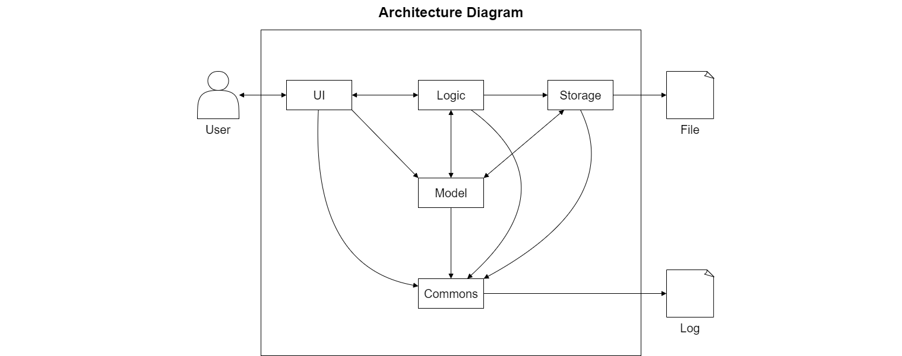
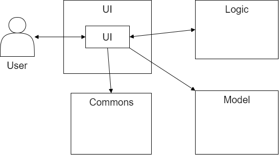
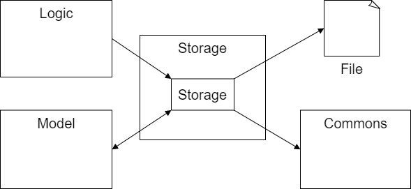
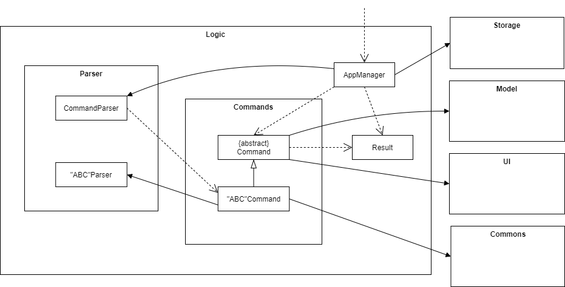
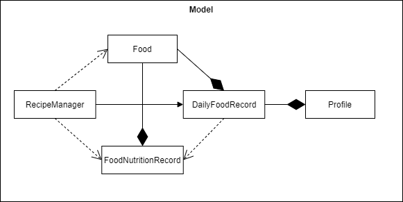
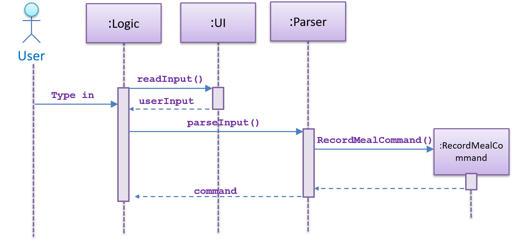
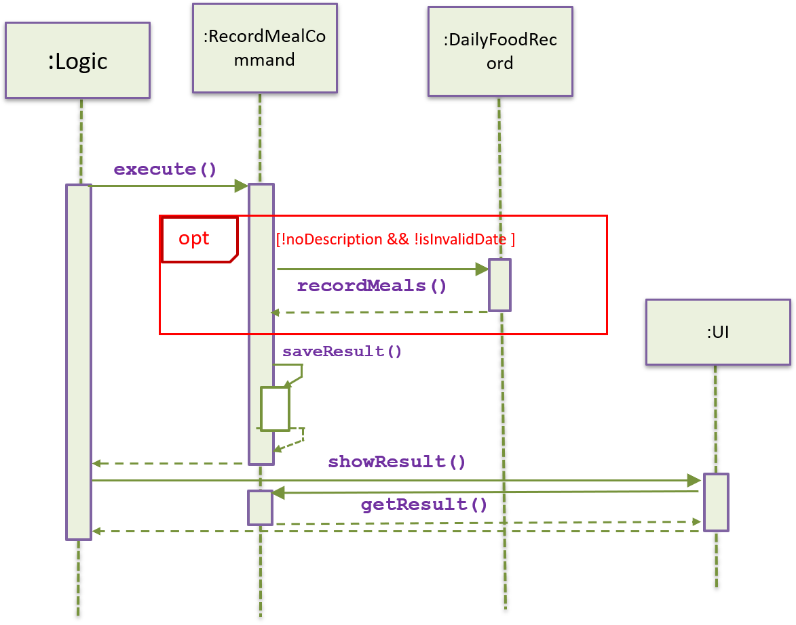

# Developer Guide - Diet Manager

## Content
1. [Design](#design)
    1. [Architecture](#architecture)
    2. [UI component](#ui-component)
    3. [Storage component](#storage-component)
    4. [Logic component](#logic-component)
    5. [Model component](#model-component)
    6. [Commons component](#commons-component)
2. [Implementation](#implementation)
    1. [Record Meal Feature](#1-record-meal-feature)
        1. [Proposed implementation](#11-proposed-implementation)
        2. [Step1. Generate command](#step1-generate-command)
        3. [Step2. Execute and Save Result](#step2-execute-and-save-result)
        4. [Design Considerations](#12-design-considerations)
        5. [Aspect: How RecordMealCommand executes and save results](#aspect-how-recordmealcommand-executes-and-save-results)
        6. [Aspect: Data structure to support the command](#aspect-data-structure-to-support-the-command)
3. [Product Scope](#product-scope)
    1. [Target user profile](#target-user-profile)
    2. [Value proposition](#value-proposition)
4. [User Stories](#user-stories)
5. [Non-Functional Requirements](#non-functional-requirements)
6. [Glossary](#glossary)
7. [Instructions for Manual Testing](#instructions-for-manual-testing)

## Design

### Architecture

The Architecture Diagram given above explains the high-level design of the Diet Manager Application.

The components involved are given below:

* `UI`: The Component responsible for reading user input and displaying command results.

* `Storage`: The Component responsible for reading, writing and saving of external data files.

* `Logic`: The Component responsible for managing the logic flow of the application and executing commands.

* `Model`: The Component responsible for storing information required by the application in-memory.

* `Commons`: A collection of classes used by multiple other components.

### UI component

The `UI` component is responsible for:
* Receiving all command line inputs from the user
* Displaying all system outputs to the user

The UI consists of the following classes: 
* `UI` - Reads user input and displays system output

The `UI` component
1. Reads user input and passes it to `Logic` for parsing and execution of the command.
2. Receives command results from `Logic` and listens 
for changes in `Model` to display updated information to the user.
3. Draws on `Commons` to obtain the relevant messages to be displayed to the user.

### Storage component

The `Storage` component is responsible for:
* Reading and loading data files to update the information in local memory during program start up.
* Writing and saving all data into the relevant data files.

The Storage consists of the following classes: 
* `Storage` - Stores all user profile information in respective data files

The `Storage` component
1. Reads data files (if present) using `Logic` and updates `Model` with the relevant information during start up.
2. Receives instructions from `logic` to save and write in-memory information from
`Model` into the relevant data files.

### Logic component

The `Logic` component is responsible for:
* Establishing the logic flow.
* Deciding how functional components interact with each other.

The Logic consists of the following classes:
* `AppManager` - Arranges the main workflow of the program.
* `Result` - Stores the command result in-memory.
* `CommandParser` - Parses the user input and generates a specific command.
* `"ABC"Parser` - A collection of parser classes which parses a specific input to generate a specific value.
    * `AgeParser` - Parses the user input and generates the user's age as an integer value between 0 to 150 years old.
    * `CaloriesParser` - Parses the user input and generates the calories value as a non-negative double.
    * `CommandParser` - Parse the user input and generates the equivalent Command Object to be processed.
    * `DescriptionParser` - Parse the user input and generates the String description required by Command.
    * `FoodNameParser` - Parse the user input and generates the name of the food in lower case for Food Object to process.
    * `GenderParser` - Parse the user input and generates the profile's gender as "male" or "female" regardless of upper or lower case input.
    * `HeightParser` - Parse the user input and generates the profile's height as a double value between 0 and 300 centimeters.
    * `NameParser` - Parse the user input and generates the profile's name as a String.
    * `StorageParser` - Parse the stored inputs from various data file to generate the user profile, Recipe, Food Record, Time, Weight List and Food Nutrition Record.
    * `WeightParser` - Parse the user input and generates the profile's weight as a double between 0 and 500 kilograms.
* `Command` - An abstract class which other command classes inherits from.
* `"ABC"Command` - A collection of command classes inherited from `Command` which perform specific functions.
    * `AddFoodCommand`
    * `BuildNewRecipeCommand`
    * `CalculateCaloriesCommand`
    * `CheckBmiCommand`
    * `CheckRecordCommand`
    * `CheckRequiredCaloriesCommand`
    * `CheckWeightRecordCommand`
    * `ClearFoodRecordCommand`
    * `DeleteFoodCommand`
    * `DeleteWeightCommand`
    * `ExitCommand`
    * `HelpCommand`
    * `ListFoodDatabaseCommand`
    * `ProfileCommand`
    * `RecordMealCommand`
    * `SetAgeCommand`
    * `SetGenderCommand`
    * `SetHeightCommand`
    * `SetNameCommand`
    * `SetProfileCommand`
    * `SetWeightCommand`
    * `SetWeightGoalCommand`
    * `ShowRecipeCommand`

The `Logic` component
1. Receives the user input and parses it to generate a specific command.
2. Executes the command to generate a specific result.
3. Passes results to `UI` to display system output to the user.
4. Updates `Storage` to save any changes made to in-memory information to the respective data files.

### Model component

The `Model` component is responsible for:
* Storing all relevant information in-memory for the application to access.

The Model consists of the following classes: 
* `Profile` - Stores the personal information of a person including the name, age, gender, height, weight, weight goal, list of food consumed and list of weight changes
* `DailyFoodRecord` - Keeps a record of the food consumed in a day, comprising morning, afternoon and night
* `Food` - A food object which contains the relevant food information
* `FoodNutritionRecord` - Provides a data bank of food items with the food name and calories value
* `RecipeManager` - Generates and stores recipes depending on user information

The `Model` component
1. Receives instructions from `Logic` to update in-memory information.
2. Is not dependent on any of the other components.
3. Contains all the classes that are responsible for database and records of food and user

### Commons component

The `Commons` component is responsible for:
* Consisting of multiple useful classes which are utilised by other components in the application.

The Commons consists of the following classes: 
* `LogsCentre` - Tracks system through log records and saves them into a log file
* `MessageBank` - Consists of multiple standard system output messages for UI to print
* `Weekday` - Enumeration class for classifying all 7 possible days in a week
* `"ABC"Exception` - A collection of exceptions to aid in running of the application
    * `InvalidAgeException`
    * `InvalidCaloriesException`
    * `InvalidCommandException`
    * `InvalidFoodNameException`
    * `InvalidFormatException`
    * `InvalidGenderException`
    * `InvalidHeightException`
    * `InvalidNameException`
    * `InvalidWeightException`
    * `NegativeNumberException`

## Implementation

{Describe the design and implementation of the product. Use UML diagrams and short code snippets where applicable.}
### 1. Record Meal Feature
#### 1.1 Proposed implementation
The record feature is facilitated by `RecordMealCommand`. It extends `Command` and overrides `execute()` and `saveResults()`

Given below is an example usage scenario and how the record mechanism behaves at each step.

Step 1.  The `ui` object gets user input and sends it to the `parser`. The `parser` then parses the original input into a standard `command`
and returns it. The command type is decided by the `commandPrompt`. The `RecordMealCommand` has `record-meal` as its commandPrompt. 
During the process a new`RecordMealCommand` object will be generated and returned to the `Logic` component.

### Step1. Generate command

Step 2.  The `Logic` composition calls the `execute()` method of the `RecordMealCommand` object. 

During the process of execution, the command object will generate a `ArrayList<Food> foodList`, which maintains all `Food` items listed in the user input. 
If a certain kind of `Food` can be found in the database of `FoodNuritionInfo`, then this food item will be fetched from the database. 
Else a new `Food` object will be generated simply with `foodName` without all the nutrition info.

During execution, the command object will try to get a `record` object of the class `DailyFoodRecord`. The date of record is specified by the user. 
If no record of that day is found in profile, it will automatically generate a new record of the day. Then with `foodList` and `record`, can call 
the method `record.recordMeals()`.

### Step2. Execute and Save Result

#### 1.2 Design Considerations
#### Aspect: How `RecordMealCommand` executes and save results
* Alternative 1 (current choice): Directly operate on the `Profile` object, more specifically, the `DailyFoodRecord` attribute in `Profile` object.
And save execution `results` in the `RecordMealCommand` object.
    * Pros: Logic is clear and easy to implement.
    * Cons: `Command` object has full access to `Profile` object, which is not safe. 
* Alternative 2: `RecordMealCommand` can only operate on `DailyFoodRecord` of the `Profile`.
    * Pros: Reduce dependency and potential risks. 
    * Cons: Different types of `Command` need different declarations/interface for `command.execute()` method. 

#### Aspect: Data structure to support the command
* Alternative 1 (current choice): Use a list to store daily food record for a profile.
    * Pros: Easy to implement and understand
    * Cons: The list is maintained by a `Profile` object. Can lead to more duties for a `Profile` object.
* Alternative 2: Use a `FoodHistoryManager` to keep record of daily meals.
    * Pros: More OOP.
    * Cons: Makes the execution procedure more complex.
    
## Product Scope
### Target user profile

Students that :
1. are too busy with schoolwork to carefully monitor their eating habits
2. are concerned about their health
3. likes to keep track of their meals/weight habit digitally
4. want to keep track of their weight

### Value proposition

Diet Manager aims to achieve the following:
1. Streamline the diet recording and monitoring process
2. Allow users to track food calories intake and monitor their eating habits
3. Enable users to monitor weight changes over time and work towards their ideal weight goal
4. Provide personalised health information and dietary recommendations for the user
5. Monitor and track user's weight changes to achieve weight goal
6. Check their BMI as well against the BMI table regardless of user

## User Stories

|Version| As a ... | I want to ... | So that I ...|
|--------|----------|---------------|------------------|
|v1.0| student|set a profile with personal information|receive personalised information regarding my diet|
|v1.0| student|record my calories intake|can keep track of my total calorie intake for the week effectively|
|v1.0| student|record my food intake|see what I ate today|
|v1.0| student|see my diet history|can track my diet and maintain a balanced and healthy diet lifestyle|
|v1.0| student|set a weight-goal|received feedback on progress regarding my weight goal|
|v1.1| student|record my weight changes|can see if i am doing well towards my expectation|
|v1.1| student|check nutritional values of certain foods|can check how much calories i am consuming|
|v1.1| student|check if I am keeping to my recommended caloric intake|do not over or under eat and maintain my diet|
|v1.1| student|add food items to the database|do not have to constantly check food nutritional value for common foods|
|v1.2| student|save my diet history|have a record of my daily food intake|
|v1.2| student|save my profile|do not have to constantly set a new profile|
|v1.2| student|import my diet history|have access to previous records and be able to progress from there|
|v1.2| student|receive dietary advice based on my excess calorie intake for the day|can maintain my calories for the day|
|v1.2| student|export my diet history|can view my previous records on other devices and never ever lose my progress|
|v2.0| student|generate a recommended food plan|know what to eat to meet recommended caloric intake|
|v2.0| student|save and export my food plan|print it out or bring it with me|

## Non-Functional Requirements

Device Environment:
* Must have Java 11 or higher installed in OS
* 32-bit or 64-bit environment
* Command Line Interface or Terminal for Mac

Performance:
* Function offline, without the need for internet access
* Quick to launch and use
* No noticeable lag or delay in performance when running
* Intuitive and seamless for new users.
* Ability to export the data into a txt file to load on another OS

Reliability:
* Data files should be updated constantly and accurately, with no data loss
* Data records should be retrievable and readable
* Text inputs should produce similar results if utilised multiple times.
* Program should run without any forced-close error due to bugs

## Glossary

* *NAME* - Standard form for name is a String value with no spaces
* *FOOD-NAME* - Standard form for food name is a String value with no spaces
* *AGE* - Standard form for age is an int value more than 0 and less than 150
* *GENDER* - Standard form for gender is a String value of "male" or "female"
* *HEIGHT* - Standard form for height is a double value more than 0 and less than 300, standard unit kilograms
* *WEIGHT* - Standard form for weight is a double value more than 0 and less than 500, standard unit centimetres
* *WEIGHT-GOAL* - Standard form for weight goal is a double value more than 0 and less than 500, standard unit centimetres
* *CALORIES* - Standard form for calories is a double value more than 0, standard unit kilocalories
* *INDEX* - Standard form for index is an int value, depending on the size of the corresponding list
* *DATE* - Standard form for date is restricted to the range of MONDAY to SUNDAY
* *TIME-PERIOD* - Standard form for time period is MORNING, AFTERNOON, NIGHT
* *ACTIVITY-LEVEL* - Standard form for activity level is LOW, MODERATE, HIGH
* *profile.txt* - Data file containing user profile information
* *daily-food-record.txt* - Data file containing user daily food record information
* *food-nutrition-record.txt* - Data file containing food nutrition record database
* *recipe.txt* - Data file containing user generated recipe list

## Instructions for Manual Testing

For manual testing, developers can follow the instructions listed out in the [UserGuide](UserGuide.md)
* Detailed input and output examples are displayed for cross checking.

Alternatively, they can also follow the following steps to test out the respective commands, 
upon downloading the jar file, while adhering to the specified restrictions in Glossary:

1. `set-profile NAME AGE GENDER HEIGHT WEIGHT WEIGHTGOAL`
    * Creates a new profile
2. `profile`
    * View user profile details
3. `set-name NAME`
    * Update name in profile.
4. `set-age AGE`
    * Update age in profile.
5. `set-age GENDER`
    * Update gender in profile.
6. `set-height HEIGHT`
    * Update height in profile.
7. `set-weight-goal WEIGHT-GOAL`
    * Update weight-goal in profile.
8. `set-weight WEIGHT`
    * Update weight in profile.
9. `delete-weight INDEX`
    * Delete a specific weight record.
10. `check-weight-progress`
    * Check user weight record progression.
11. `check-bmi`
    * Check user BMI and BMI classification.
12. `record-meal DATE TIMEPERIOD /FOOD1 {-- 10.0} /FOOD2 {-- 6.00} /...`
    * Record a meal
13. `check-meal DATE TIMEPERIOD`
    * Check a meal 
14. `clear-records`
    * Clear all food records
15. `check-required-cal DATE ACTIVITYLEVEL` 
    * Check calories required based on user's activity level
16. `calculate {DATE1}->{DATE2}` 
    * Calculates calories intake on a day or during a time period
17. `list-food` 
    * List all foods recorded in the database 
18. `addf FOODNAME --CALORIES` 
    * Add a new food into database
19. `delf FOODNAME` 
    * Delete a food from the database
20. `new-recipe MAXIMUM_FODD_TYPES ACTIVITY_LEVEL` 
    * Create a recommended recipe for user
21. `show-recipe` 
    * Show the recipe recommended for user
22. `help`
    * Show the help function table with supported commands.
23. `exit`
    * Terminates and exits the application.

Click [here](README.md) to go back to the main page.