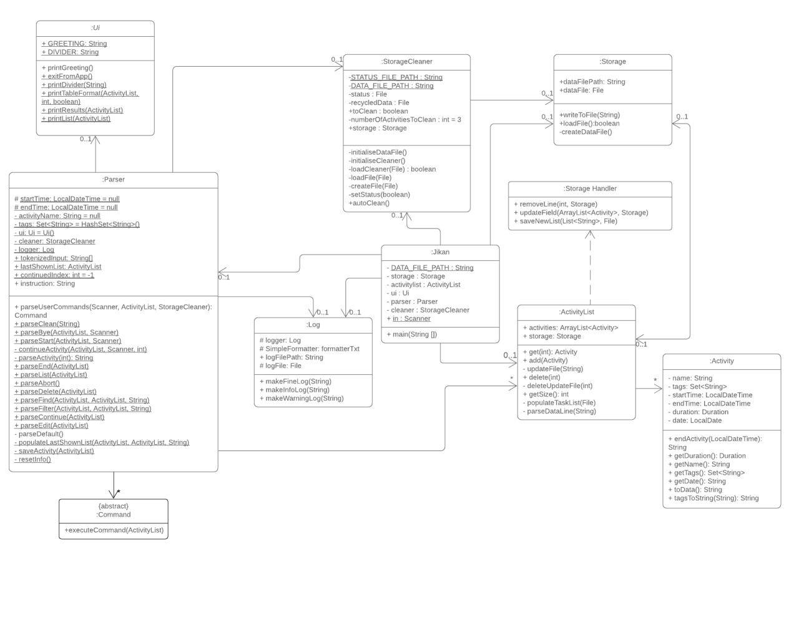
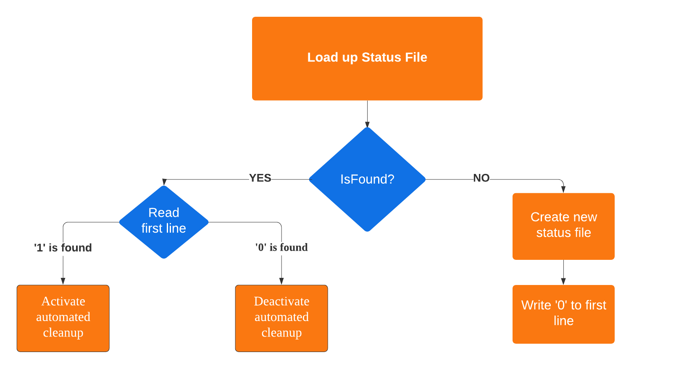
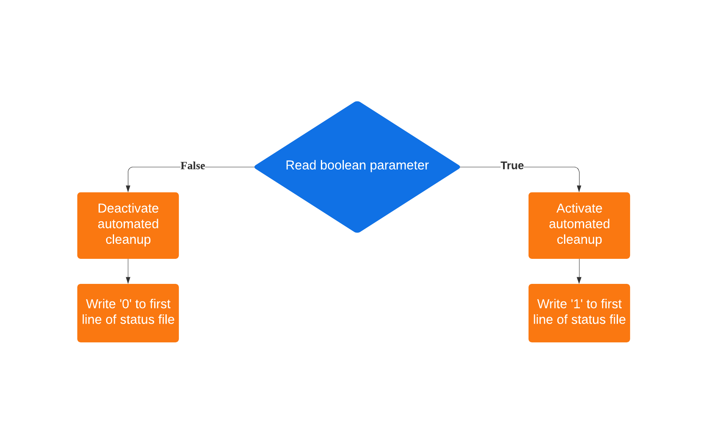
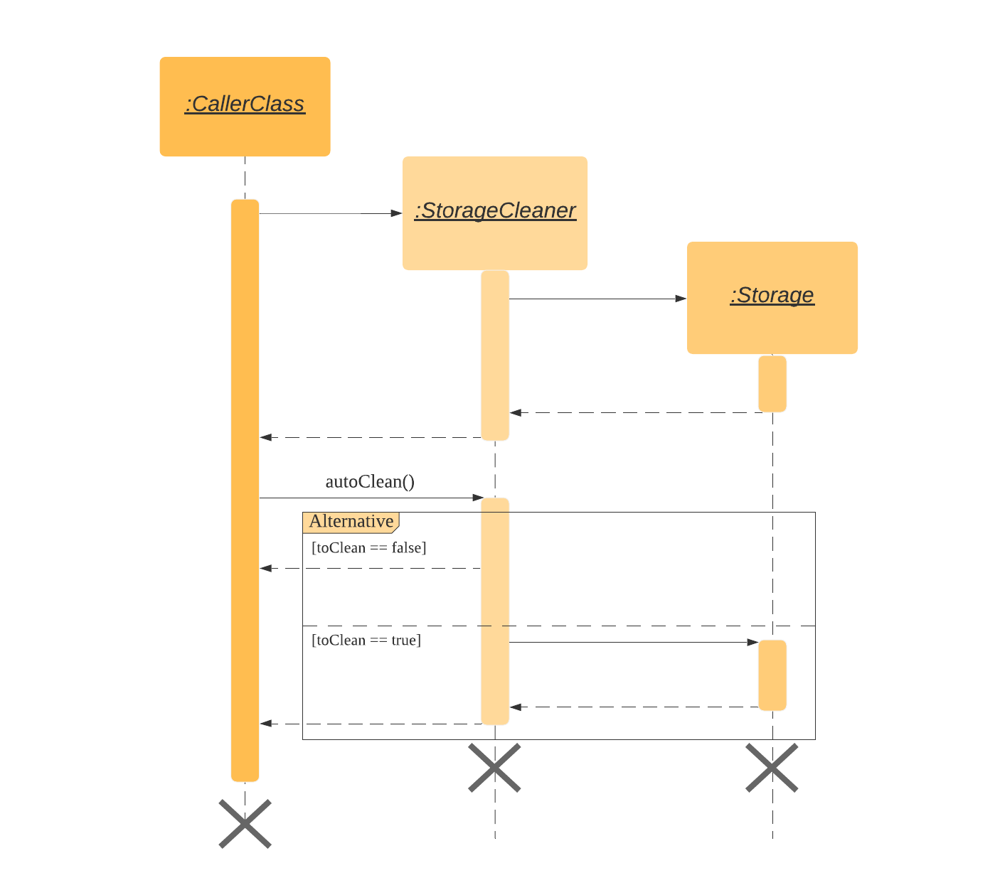
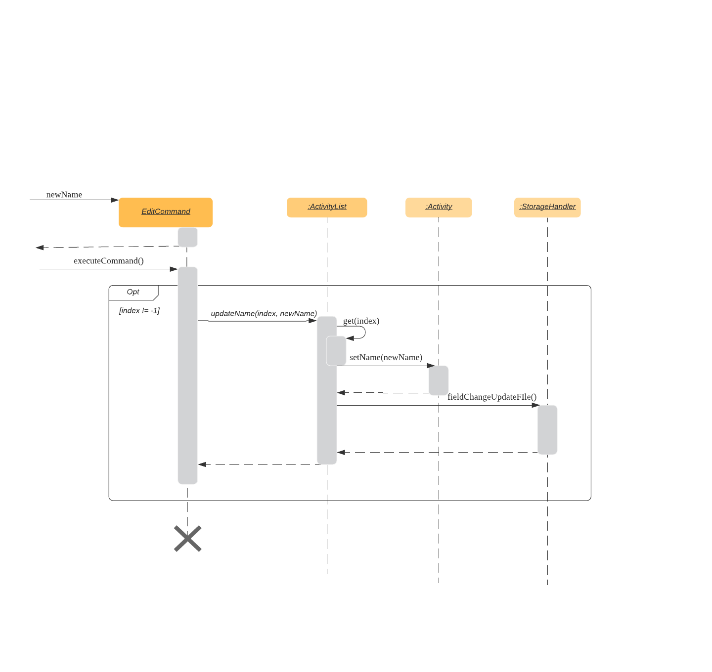

# Developer Guide

## 1. Setting Up
   * Prerequisites
     * JDK 11 or above
     * IntelliJ IDE
   * Setting up the project in your computer
     * Fork this repo, and clone the fork to your computer
     * Open IntelliJ (if you are not in the welcome screen, click File > Close Project to close the existing project dialog first)
     * Set up the correct JDK version for Gradle
     * Click Configure > Project Defaults > Project Structure
     * Click New…​ and find the directory of the JDK
     * Click Import Project
     * Locate the build.gradle file and select it. Click OK
     * Click Open as Project
     * Click OK to accept the default settings.
   * Verifying the setup
     * Run the jikan.jikan and try a few commands
     * Run the tests and ensure they all pass.

## 2. Design

_Fig 2.1. Class diagram of the Jikan program_

## 3. Implementation

This section describes some noteworthy details on how certain features are implemented.

### 3.1 Automated Storage Cleanup feature

#### 3.1.1 Current Implementation

The storage cleanup mechanism is stored internally as a StorageCleaner java class. The StorageCleaner class has an association with the Storage class and thus it is able to access and edit the datafile which contains the list of activities. 

Additionally, when the StorageCleaner class is first initialised, it will create two files namely a status file and a data file in the “recycled” folder under the “data” folder. The status file keeps track of the activation status of the storage cleaner while the data file serves as a recycle bin for deleted data. 

Moreover, the class also implements the following operations:

`StorageCleaner#initialiseCleaner - Loads up the status file to decide whether to activate/deactivate the automated cleaner.`

`StorageCleaner#setStatus - Gives the user the freedom to activate/de-activate the cleaner using commands during application runtime.`

`StorageCleaner#autoClean - This operation is called whenever the application is executed. Storage cleaning will only be done if the cleaner is activated.`

Given below is the example scenario of how the operations work.

##### initialiseCleaner

Step 1. Loads up the status file for reading. If the status file is not found, create a new status file and write the character ‘0’ to the first line of the status file.

Step 2. Read the first line of the status file, if a character ‘0’ is found, deactivate the automated cleanup. Else if a character ‘1’ is found, activate the automated cleanup.

##### setStatus

Step 1. Read the boolean parameter ‘status’.

Step 2a. If ‘status’ is equal to true, activate the automated cleanup and write the character ‘1’ to the first line of the status file. (overwrite any existing value at the first line).

Step 2b. If ‘status’ is equal to false, deactivate the automated cleanup and write the character ‘0’ to the first line of the status file.

##### autoClean

Step 1. Check activation status of StorageCleaner through the class level attribute boolean toClean.

Step 2a. If the attribute toClean is equal to false, return the operation and give control back to the caller.

Step 2b. If the attribute toClean is equal to true, access the storage data file and remove some of the activities starting from the oldest. Put these deleted activities into the data file under the ‘recycled’ folder.

#### 3.1.2 Additional Implementation (proposed)

`StorageCleaner#setDeleteQuota - Allows the user to manipulate how much activity is deleted when auto cleanup is activated. Currently only delete the oldest 3 activities.`

`StorageCleaner#setTimeFrame - Set a particular time frame for auto cleanup to activate. (i.e auto cleanup after every 2 weeks etc).`

`StorageCleaner#initialiseLogCleaner - Gives the storage cleaner an added functionality of being able to clear log files too.`

### 3.2 Storage feature
The Storage class represents the back-end of Jikan, handling the creation, saving and loading of data. 
Jikan uses a `.csv` file to store its data, formatted in the following way:

`entry-name, start-time, end-time, tags`

All tags are saved in the same cell, separated by a white space; this design decision was taken to make sure that each entry occupies the same number of cells regardless of each entry’s number of tags. The tags are then separately parsed when the data is loaded.

Each Storage objects contains the path to the data file (`Storage.dataFilePath`), the File object representing the data file (`Storage.dataFile`), and an activityList populated with the data from the data file (`Storage.activityList`). Storage optionally supports multiple data files at the same time, allowing implementation of features like multiple sessions and multiple user profiles. 

Storage provides the following functions:
- Constructing a Storage object via `Storage(String dataFilePath)`, which takes in the path to the desired data file (or the path where the user wants to create the data file) as a String object.
- Creating a data file via `createDataFile`.
- Writing to a data file via `writeToFile`. This function takes a single string as parameter and writes it to the data file. It is recommended to only pass single-line strings to keep the file nicely formatted. 
Loading a pre-existing data file via `loadFile`. If a data file already exists for the provided data file path, the function will return `true`; if the specified data file did not previously exist, this function will call the `createDataFile` method and returns `false`. The return value is useful so that the application knows whether or not this is the first session with a specific data file or if data already exists.
- Creating an ActivityList via `createActivityList`. This function calls `loadFile()` to check whether the file already existed or not; if the data file previously existed, it will construct an ActivityList object by passing the data from the data file to it, and return this populated ActivityList object; if the data file did not previously exist, it will return an empty activityList object.

### 3.3 Storage handler
The StorageHandler class functions as a support to the main Storage class, allowing the Jikan application to manipulate the stored data file. Its main provided functions are:
- Removing an entry from the data file via `removeLine`. This function takes in the number of the line to remove.
- Replacing an entry in the data file via `replaceLine`. This function takes in the number of the line to replace, along with the String object that needs to be written to the data file in place of the replaced line.

### 3.4 Edit feature
The edit feature allows the user to make changes to activities that have been saved in the activity list. This is to allow the user to rectify any mistakes that may have been made during the initial recording of the activity. 

#### 3.4.1 Current Implementation
The following sequence diagram shows how the edit feature works.

The current implementation of the edit feature allows the user to edit only the name parameter of the activity. When the user wants to edit an activity using the edit command, the Parser creates a new EditCommand object. The executeCommand() method of the EditCommand object is called and the specified parameters are updated accordingly.

The order of method calls to edit the activity details is as follows if the specified activity exists (meaning index != -1) else an exception is thrown:
1. The updateName() method of the ActivityList class is called, with the user-specified parameters of the activity index and new activity name
2. The get() method is self-invoked by the ActivityList class to obtain the activity at the given index 
3. The setName() method of the Activity class is called to edit the activity name to the user-specified name
4. The activity with the updated name is returned to the activityList  

#### 3.4.2 Additional Implementations
The current implementation of the edit feature only allows the user to edit the activity name. Hence, additional implementations of the edit feature should allow the user to edit other parameters of the activity such as the tags and the start and end dates. 

This will require the implementation of more update methods in the ActivityList class to allow for the changes to be updated in the activityList after it has been edited. 

#### 3.4.3 Design Considerations
By letting the user edit the name and tags of the activity, it will allow them to correct any mistakes made during the data entry. This ensures that there is an accurate record of activities such as in cases where the user may be trying to record the same activity but has misspelled it, resulting in the program regarding it as a different activity where there would be multiple unnecessary new entries in the activity list, making the analysis of the time spent more tedious and inaccurate.

However, by allowing the user to edit the start date and time, there may be potential inaccuracies in the actual activity recording. This is due to the fact that the time recorded in the program is based on the LocalDateTime. By introducing user input, the dates and time may be recorded incorrectly, defeating the purpose of the time tracking program. 

### 3.5 Continue Feature
The continue feature allows the user to continue a previously ended activity.

#### 3.5.1 Current Implementation

**Continuing an activity:**

When the user enters the command to continue an activity, a *ContinueCommand* object is created in *Parser*. The method *executeCommand()* of the *ContinueCommand* object is then called and does the following:

 1. Checks if the given activity name exists in the activityList by calling *findActivity()* (if it doesn’t an exception is thrown, omitted in the sequence diagram above)
 2. Gets the *name* and *tags* of the activity to be continued and saves it to a public static variable of *Parser* object
 3. Gets the current time and saves it to a public static variable of *Parser* object
 
 

 **Ending a continued activity:**
 
When the user wants to end the continued activity, an *EndCommand* object is created in *Parser.* The method *executeCommand()* of the *ContinueCommand* object is then called and it in turn executes the *saveActivity()* method of the *ActivityList* class. The continued activity is then saved by executing the following:

 1. Gets the current time and saves it to a public static variable of *Parser* object
2.  Calculates the elapsed time using *between()* method of *Duration* class
3.  Adds the elapsed time with the previous duration of the activity to get the *newDuration* using *plus()* method of Duration class
4.  Calls the *updateDuration()* method, which updates the *duration* attribute of the continued activity in the *activityList* as well as the data.csv file

#### 3.5.2 Design Considerations

**Execution:**
 - Continue by activity name (current implementation)
 **Cons:** Activity names have to be unique.
 **Pros:** More versatile, resistant to changes in the activity list
 - Continue by activity index
 **Cons:** need to add an additional index field to the Activity class, 
 index is not fixed, changes when an activity is deleted
 **Pros:** Can reuse activity names.
 
Although the current implementation of the continue feature disallows users to have multiple activities with the same name, we felt that the versatility of this choice outweighed the cons. Firstly because if the activityList got too big, it would be hard for the user to get the index of the task he/she wanted to continue. Also, the index would constantly be changing when changes are made to the list.

#### 3.5.3 Additional Features
As users can only have activities with unique names, when a user wants to start an activity which already exists in the activityList, he/she will be given the option to continue the stated activity.

### 3.6 Find Feature
This command accepts a keyword and searches the activity list for activities with names that contain the keyword.

#### 3.6.1 Current Implementation
* This feature is called by the user when the “find” command is entered into the command line. The string following the command is the keyword to match activity names to.
* The Parser will create a FindCommand object.
* The FindCommand will invoke its own executeCommand() method.
    * The Parser's lastShownList will be cleared.
    * Then it will loop through activityList to find activities with names that contain the keyword.
    * If one is found, it will be added to lastShownList.
    * printResults() of the Ui will be called:
        * If lastShownList is not empty, it will print the matching activities.
        * Else, it will respond to the user that there are no tasks which match the given keyword.

### 3.7 Filter Feature
This feature accepts multiple space-separated keywords to search for activities with tags matching each keyword.

#### 3.7.1 Current Implementation
* This feature is called by the user when the “filter” command is entered into the command line. The space separated strings following the command are the keywords to match activity tags with.
* The Parser will create a FilterCommand object.
* The FindCommand will invoke its own executeCommand() method.
* The Parser's lastShownList will be cleared.
* For each keyword:
    * Then it will loop through activityList to find activities with tags that contain the keyword.
    * If one is found, it will be added to lastShownList.
    * printResults() method of the Ui will be called
        * If lastShownList is not empty, it will print the matching activities.
        * Else, it will respond to the user that there are no tasks which match the given keyword.

## 4. Appendix
### Product Scope
#### Target user profile

* Students with time management issues/poor time management skills.
* Users who are reasonably comfortable using CLI apps.

#### Value proposition

Allow users to record their daily activities and track their time usage in a user-friendly manner. 

### User Stories

|Version| As a ... | I want to ... | So that I can ...|
|--------|----------|---------------|------------------|
|v1.0|user|start a new activity|track the time spent on the activity|
|v1.0|user|end an activity|track the total time i spent on the activity|
|v1.0|user|abort an activity|record a different activity|
|v1.0|user|store the completed activities in a list|analyse how I spent my time|
|v2.0|user|delete an activity|remove activities that I do not want to track|
|v2.0|user|search by activity name|view similar activities|
|v2.0|user|filter activities by tags|view activities of the same category|
|v2.0|user|view the activities by date|see how much time I have spent on different activities|
|v2.0|user|continue my activities at another time|do other things between activities|
|v2.0|user|edit past activities|keep a more accurate record of activities|
|v2.0|user|automate the deletion of old activities|keep a more concise log of activities|

### Non-Functional Requirements

{Give non-functional requirements}

### Glossary

* *glossary item* - Definition

### Instructions for Manual Testing

{Give instructions on how to do a manual product testing e.g., how to load sample data to be used for testing}
