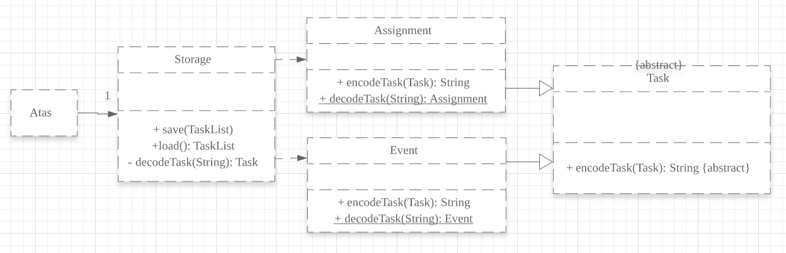
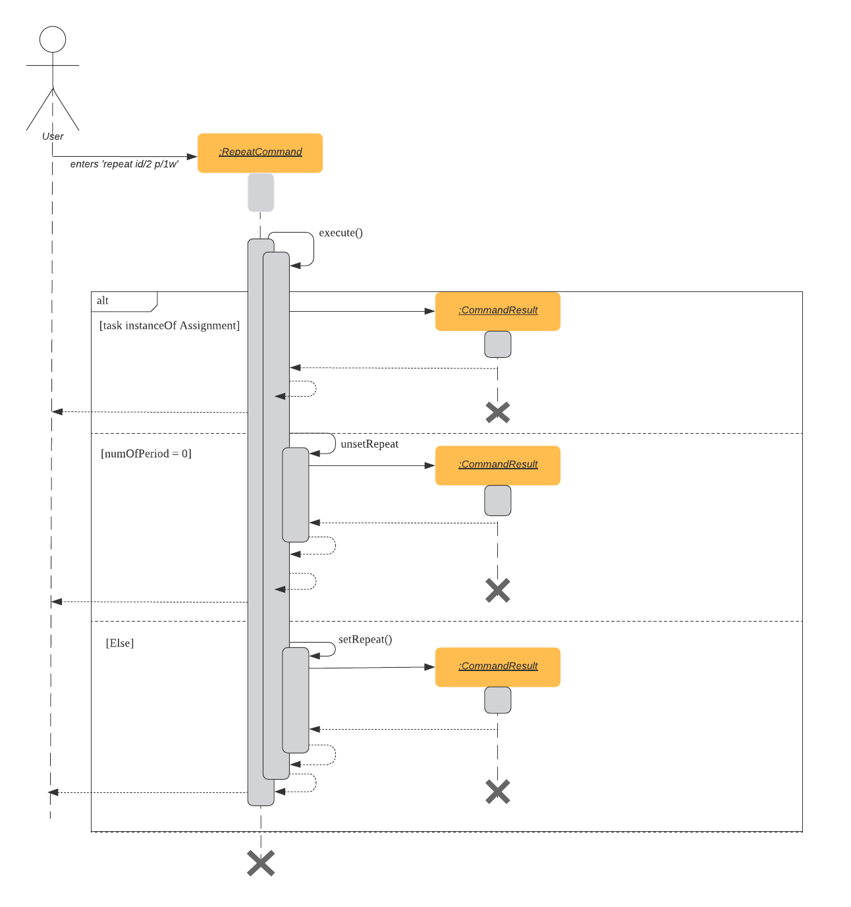
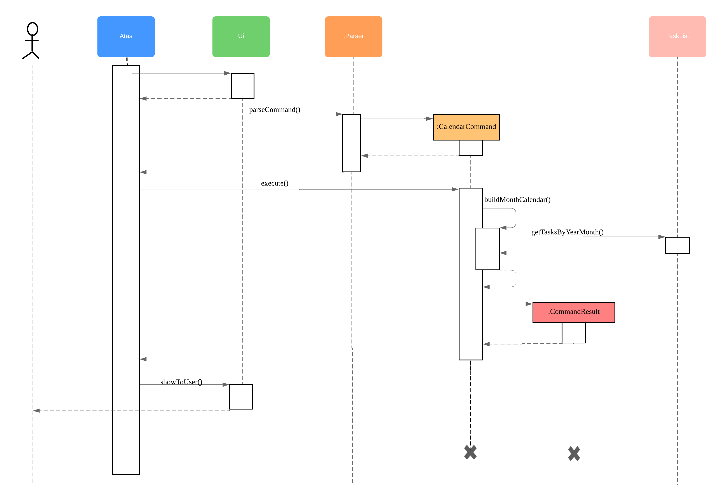
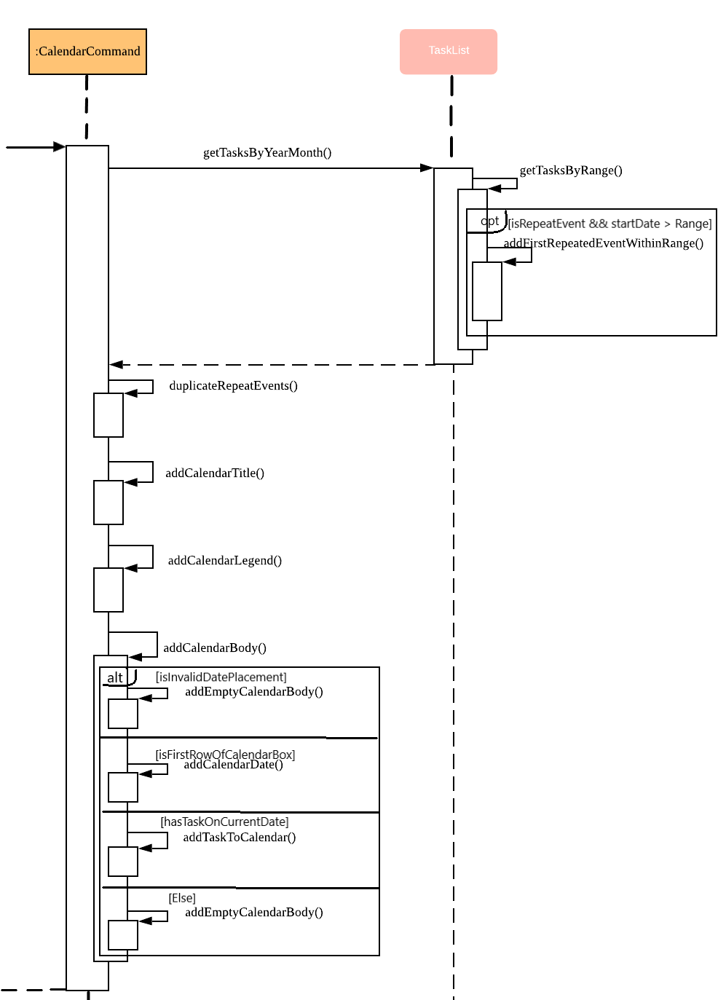

# ATAS (Amazing Task and Assignment System) Developer Guide
By: `Team M16-1` Since: `Jan 2020` License: `MIT`

Table of Contents
1. [Setting up](#1-setting-up)
	- [Prerequisites](#11-prerequisites)
	- [Setting up the project](#12-setting-up-the-project)
	- [Verifying the Setup](#13-verifying-the-setup)
2. [Design](#2-design)
	- [Architecture](#21-architecture)
	- [UI Component](#22-ui-component)
	- [Logic Component](#23-logic-component)
	- [Model Component](#24-model-component)
	- [Storage Component](#25-storage-component)
	- [Atas Component](#26-atas-component)
3. [Implementation](#3-implementation)
	- [Delete Task Feature](#31-delete-task-feature)
		- [Current Implementation](#311-current-implementation)
		- [Design Considerations](#312-design-considerations)
	- [Search task feature](#32-search-task-feature)
		- [Current Implementation](#321-current-implementation)
		- [Design Considerations](#322-design-considerations)
	- [Clear Task feature](#33-clear-task-feature)
		- [Current Implementation](#331-current-implementation)
		- [Design Considerations](#332-design-considerations)
	- [Repeat event feature](#34-repeat-event-feature)
		- [Current Implementation](#341-current-implementation)
		- [`Event` and `RepeatEvent` Differences and Impact](#342-event-and-repeatevent-differences-and-their-impact)
		- [How date and time is updated](#343-how-date-and-time-is-updated-in-repeateventupdateevent)
		- [Design Considerations](#344-design-considerations)
		- [Future Enhancement](#344-future-enhancements)
	- [Edit Task Feature](#35-edit-task-feature)
		- [Implementation](#351-implementation)
		- [Design Considerations](#352-design-considerations)
		- [Future Enhancements](#353-future-enhancements)
	- [View Calendar feature](#36-view-calendar-feature)
		- [Implementation](#361-implementation)
		- [Design Considerations](#362-design-considerations)
		- [Future Enhancements](#363-future-enhancements)
	- [Storage](#37-storage)
		- [Implementation](#371-implementation)
			- [Saving the current state of **ATAS** with `Storage#save()`:](#372-saving-the-current-state-of-atas-with-storagesave)
			- [Loading previously saved `TaskList` data into **ATAS** with `Storage#load()`:](#373-loading-previously-saved-tasklist-data-into-atas-with-storageload)
		- [Design Considerations](#374-design-considerations)
4. [Testing](#4-testing)
	- [Using IntelliJ JUnit Tests](#41-using-intellij-junit-tests)
	- [Using Input-Output Tests](#42-using-input-output-tests)
5. [DevOps](#5-devops)
    - [Build Automation](#51-build-automation)
    - [Continuous Integration](#52-continuous-integration)
    - [Coverage Reporting](#53-coverage-reporting)
    - [Making a Release](#54-making-a-release)
6. [Appendices](#6-appendices)
    - [Product Scope](#61-appendix-a-product-scope)
    - [User Stories](#62-appendix-b-user-stories)
    - [Non-Functional Requirements](#63-appendix-c-non-functional-requirements)
    - [Documentation](#64-appendix-d-documentation)
    - [Instructions for Manual Testing](#65-appendix-e-instructions-for-manual-testing)

## 1. Setting up
This section will guide you on how to set up this project on your own computer.

### 1.1. Prerequisites

1.  JDK 11 or above

2.  IntelliJ IDE

### 1.2. Setting up the project
1.  Fork this repository, and clone the fork to your computer

2.  Open the IntelliJ IDE. If you are not in the welcome screen, click `File` &gt; `Close Project` to close the existing project.

3.  Set up the correct JDK version for Gradle

    1.  Click `Configure` &gt; `Project Defaults` &gt; `Project Structure`

    2.  Click `New...` and find the directory of the JDK

4.  Click on `Import Project`

5.  Locate and select the `build.gradle` file, then click `OK`

6.  Click `Open as Project`

7.  Click `OK` to use the default settings provided

### 1.3. Verifying the Setup
1.  In an IntelliJ terminal, run `gradlew build`

2.  Move to the folder `build` &gt; `libs` and run: `java -jar atas-2.0.0.jar`

    1.  To use **ATAS**, type a valid command into the terminal and press the enter key to run the command.  
        e.g. Typing `help` and pressing the enter key will show the available commands

    2.  Some example commands you can try to get familiar with **ATAS**:

        -   `help`: Lists the commands that **ATAS** supports.

        -   `assignment n/Assignment One m/CS2113T d/01/02/20 1600 c/Important Assignment`: Adds an assignment called **Assignment One** for the module **CS2113T**. This assignment is due on **1st February 2020 4pm** and the comments for this assignment is that it is an **Important Assignment**.

        -   `exit`: Exits **ATAS**.

## 2. Design
This section will give a high-level overview of how various components in **ATAS** function and interact with each other.

### 2.1. Architecture

The architecture diagram above illustrates the high-level design of the **ATAS** application.  

The `Atas` component contains all the other components in the application.  

-   `Ui`: Reads user input, and shows the results of commands to the user

-   `Logic`: Handles execution of user input commands

-   `Model`: Stores the runtime data of the application

-   `Storage`: Reads and stores data from a file stored on the user’s computer

The following sections will explain each component in greater detail.

### 2.2. UI Component
1.  The `Ui` component reads user input which represents a command.

2.  The `Ui` component shows the result of the command to the user.

### 2.3. Logic Component

The Logic component comprises the `Parser`, `Command`, and `CommandResult` classes:  

1.  `Parser` will interpret the user command and return the corresponding `Command` object.  

2.  `Command#execute()` is called to run the command, returning a `CommandResult` object.  

3.  The `CommandResult` object will contain the output to be shown to the user.

### 2.4. Model Component
The Model component contains the `Task` and `TaskList` classes, which store the user’s schedule.

### 2.5. Storage Component

1.  A `Storage` object is created by the `Atas` class to handle the loading and saving of `Task` data.

2.  The `load()` method is used to read saved data from a local file into the current session of **ATAS**.

3.  The `save()` method writes the current state of **ATAS** into the local save file using the `Task#encodeTask()` method.

### 2.6. Atas Component
The `Atas` component integrates all the aforementioned components to run the overall application logic.  
The sequence diagram below shows how various components, broken down into the various classes, interact when the user enters a `help` command  

1.  The `Ui` class is used to read user input.  

2.  The `Parser` class is used to parse the user input string, returning a `Command` object.  

3.  The `Command#execute()` method is run, returning a `CommandResult` object.  

4.  The `Ui` class is used to show the `CommandResult` message to the user.  

5.  The `Storage` object is used to save the new state of the application.

## 3. Implementation
This section will detail how some noteworthy features are implemented.

> **Note:**  
> You will need to create tasks to use the features mentioned below.  
> Create an `assignment`: `assignment n/[NAME] m/[MODULE] d/[DATE] [TIME] c/[COMMENTS]`  
> Create an `event`     : `event n/[NAME] l/[LOCATION] d/[DATE] [START_TIME] - [END_TIME] c/[COMMENTS]`  
> Dates follow the `DD/MM/YY` format, and times follow the `HHmm` format.  
> For more information, please refer to the user guide.

### 3.1. Delete Task Feature
#### 3.1.1 Current Implementation  
The `DeleteCommand` extends the `Command` class and initializes the `delete index` in its constructor. The `delete index` specifies the index of task that the user wants to delete.

Given below is an example usage and how the `DeleteCommand` mechanism behaves at each step:

**Step 1**  
The user launches the app and retrieves the tasks which are saved under a local file using `Storage`.

**Step 2**  
The user enters `delete 1` into the command line. Method `Parser#parseCommand()` will be called to parse the command provided. It will obtain information to get `delete index`.

> **Warning:**  
> If `IndexOutOfBoundsException` or `NumberFormatException` is caught, a new instance of `IncorrectCommand` class will be called to print the respective error messages

**Step 3**  
A new instance of `DeleteCommand` with `delete index` initialized will be created. The `DeleteCommand#execute()` will be called.

**Step 4**  
The `DeleteCommand#execute()` method will do 2 things:

-   If there are no tasks in the existing task list, it will create a new instance of `CommandResult` that prints out an error message indicating an empty task list

-   If there are tasks in the existing task list, the `DeleteCommand` class will call the `TaskList#deleteTask()` method to delete the task, based on the index. At the end of the execution, 
the `DeleteCommand` class will create a new instance of `CommandResult` class that prints out the success message for task deletion.

The following sequence diagram summarizes how delete command operation works:  

#### 3.1.2. Design Considerations

-   Calling `remove()` method in `TaskList#deleteTask()` instead of calling `remove()` method in `DeleteCommand#execute()`

    -   Pros: Easier implementation for other classes that requires the same use. 

    -   Cons: Additional functional call to `TaskList#deleteTask` is needed to delete a task from the task list, which may increase time complexity of delete operation.

    -   Rationale: We decided to implement it in such a way because we feel that the increase is time complexity is not 
    going to have a big impact on our code as this app is developed to be used as a CLI. Furthermore, such 
    implementation also allows us to keep all the related commands to the list of tasks within a class which keeps our 
    code cleaner.

### 3.2. Search task feature
#### 3.2.1 Current Implementation

The search task feature is currently implemented in `SearchCommand` class that inherits from the `Command` class.
-   `SearchCommand` initializes the `taskType`, `searchParam` and `date` in its constructor.
    -   `taskType` refers to the type of task the user wants to search through.
    -   `searchParam` refers to the search query that the user wants to find.
    -   `date` refers to the date of the task that the user wants to find. It is set as a default value of `NULL` if it is a `search` command.
    -   `SearchCommand` class contains `CURRENT_COMMAND_WORD` to store the command word used by the user(i.e. `search` or `searchd`)
    -   `SearchCommand` class also contains `CURRENT_COMMAND_USAGE` to store the error messages for the respective commands.

Given below is an example usage of the `search` command:  

**Step 1**  
The user launches the app and retrieves the tasks that are saved under a local file using `Storage`.

**Step 2**  
The user enters the input into the command line. Method `Parser#parseCommand()` will be called to parse the command 
provided to obtain the `taskType`, `searchParam` and `date` .

**Step 3**  
A new instance of `SearchCommand` with the `taskType`, `searchParam` and `date` will be created.
-   `SearchCommand` contains an ArrayList `storeIndex` to store the original index of the task containing the search query.

-   Depending on the input that the user puts in, the `CURRENT_COMMAND_WORD` in the `SearchCommand` class will be updated to the user's input command word and the 
`CURRENT_COMMAND_USAGE` in the `SearchCommand` class will be updated accordingly.

    -   If there are no tasks in the existing task list, it will initialize a new `CommandResult` class that prints out an error message, indicating an empty task list

    -   Otherwise, If the `taskType` is an `assignment` or `event` , `SearchCommand#getSearchQueryAssignments()` or `SearchCommand#getSearchQueryEvents()`will be called respectively.
        
        -   In the method,  `TaskList#getEventsHashMap()` and `TaskList#getAssignmentsHashMap()` will be called respectively, to obtain the original task list and the corresponding index.
        
        -   `getEventOrAssignmentResults` will be called to obtain the results of the search query.
        
            -   `SearchCommand#loopArrayNoDateEventsAssignments()` or `SearchCommand#loopArrayWithDateEventsAssignments()` will be called to loop through the Linked HashMap to find the tasks
            matching the search query and date(if applicable) and add the original index to the `storeIndex` and return an ArrayList containing the results.
        
    -   Lastly, If `taskType` is "all", `SearchCommand#getSearchQueryAllTasks()` will be called.
        
        -   In the method, an ArrayList will be used to store the updated task list from `TaskList#getTaskArray()`
        
        -   We will iterate through the ArrayList to find the tasks matching the search query and date(if applicable) and add the original index
        to the `storeIndex` and return an ArrayList containing the results.

**Step 4**  
The ArrayList containing the results from Step 3 will be parsed into `SearchCommand#SearchList()` to format the results into a String suitable 
for printing out to the users.

**Step 5**  
The String results from Step 5 will be parsed into `SearchCommand#resultsList()` to print out the results.

-   If there are no matching search query, a new instance of `CommandResult` class will be created to print out the error message, indicating no matching search query,

-   Otherwise, a new `CommandResult` class will be created to print out the search results.
        
The following sequence diagram summarizes how the *search* and *searchd* command works :

#### 3.2.2. Design Considerations:

-   Using Linked HashMap to store key-value pairs for `events` and `assignments`

    -   Rationale:
        To maintain an ordering among the events and assignments that we iterate through so that there is no need to sort through the list again to restore the original ordering
        
    -   Alternatives Considered:
    
        1.  Use a HashMap to store the key-value pairs
        
            -   Pros: HashMap does not maintain a doubly-linked list running though all entries so there is less overhead as compared to a Linked HashMap, leading to better performance in terms of memory usage
            
            -   Cons: HashMap does not maintain an iteration order so more sorting has to be done to restore the original order, which will incur additional time complexities

-   Creating a single class that implements both `Search` and `Searchd` functionalities.

    -   Rationale:  
        To create 2 separate commands so that users can filter their search query more easily and efficiently.

    -   Alternatives Considered:  

        1.  Use 2 seperate classes for `Search` and `Searchd` seperately.

            -   Pros: Easier to implement as the implementation for the 2 commands can be implemented in 2 different classes.

            -   Cons: There may be increased coupling as there is a need for the `Parser` class to reference both classes for the 2 `Search` and `Searchd` commands respectively.
	    
        2.  Create another method that implements `Searchd` and `Search` functionalities within the `Parser` class.

            -   Pros: Easier to implement.

            -   Cons: Makes the code for `Parser` unnecessarily long and less OOP, affecting the overall code quality

### 3.3. Clear Task feature
#### 3.3.1. Current Implementation

The `ClearCommand` inherits from the `Command` class and initializes the `clearParam` to check which clear function has to be executed

Example 1: Given below is an example usage of the `clear all` command:

**Step 1**  
The user launches the app and retrieves the tasks which are saved under a local file using `Storage`.

**Step 2**  
The user enters `clear all` into the command line. Method `Parser#parseCommand()` will be called to parse the command provided.

**Step 3**  
A new instance of `ClearCommand` with `clearParam` initialized will be created. The `execute()` method of `DeleteCommand` will then be called.

**Step 4**  
The `execute()` method will then call the `ClearCommand#clearAll()`.

-   If there are no tasks in the existing task list, it will create a new instance of `CommandResult` class that prints out an error message indicating an empty task list

-   If there are tasks in the existing task list, it will call the `TaskList#clearList()` method to clear the existing taskList

Example 2: Given below is an example usage of `clear done` command:

**Step 1**  
The user launches the app and retrieves the tasks which are saved under a local file using `Storage`.

**Step 2**  
The user enters `clear done` into the command line. Method `Parser#parseCommand()` will be called to parse the command provided.

**Step 3**  
A new instance of `ClearCommand` with `clearParam` initialized will be created. The `DeleteCommand#execute()` will then be called.

**Step 4**  
The `execute()` method will then call the `ClearCommand#clearDone()` :

-   If there are no tasks in the existing task list, it will initialize a new instance of `CommandResult` that prints out an error message indicating an empty task list

-   If there are no completed tasks in the existing task list, it will initialize a new instance of `CommandResult` that prints out an error message indicating that there 
are no completed tasks

-   Otherwise, it will call the `clearDone()` method that will call the `TaskList#deleteAllDone()` method to delete all the completed tasks, excluding repeat events.

The following sequence diagram summarizes how the `ClearCommand` operation works:  

#### 3.3.2. Design Considerations

-   Creating another `clear done` command instead of just 1 `clear` command

    -   Rationale:  
        Considering that our target audience are students, we feel that it might be inconvenient for the students to delete each completed one by one, just to reduce the number of tasks that is being displayed during `list` command.

    -   Alternative Considered:  

        1.  Delete the task once it has been marked as completed

            -   Pros: Easier to implement and improved code readability

            -   Cons: User may want to refer back to completed tasks for reference in the future and may not want to delete the completed task

        2.  Instead of deleting the completed tasks, we can choose to only list commands that have been completed

            -   Pros: Easier to implement and improved code readability

            -   Cons: `ArrayList` will be filled up with unnecessary tasks that could have been removed. This might affect the time complexity of future addition or searching operations on the `ArrayList`.

### 3.4. Repeat event feature
This feature allow users to repeat their events at a specified frequency forever, removing the need to insert the
same event multiple times with different dates.

#### 3.4.1. Current Implementation

The `RepeatCommand` class extends the `Command` class and either allows the stated event to repeat or to stop repeating. To allow an event to repeat, it will replace the current `Event` object with a `RepeatEvent` object (`RepeatEvent` inherits from `Event`). Likewise, to stop repeating, it replaces the current `RepeatEvent` with a `Event` object. A detailed explanation and the difference between the 2 classes will be elaborated later.

Given below is an example usage of the `repeat id/2 p/1w` command given by a user.

**Step 1**  
`Parser#parseCommand()` will be called to parse the command provided. Through this method, we will be able to
 obtain information to get integers `eventID`, `numOfPeriod` and string `typeOfPeriod`.  
- `eventID` identifies the task that the user wishes to repeat.  
- `numOfPeriod` and `typeOfPeriod` specifies how often the user wants to repeat the event.

> **Note:**
> Available `typeOfPeriod`: Day `d`, Week `w`, Month `m`, Year `y`  

**Step 2**  
After parsing, a new instance of RepeatCommand with `eventID`, `numOfPeriod` and `typeOfPeriod` initialized will be created. `RepeatCommand#execute()` will then be called.

**Step 3**  
The `execute()` method will check 3 things after it calls `getTask()` method from `TaskList` class to get the user input task.

-   It will check if the `eventID` provided refers to a valid `Event` task.

-   It will then check if `numOfPeriod` equals to 0. In which case, it will be setting the event to not repeat by calling `RepeatCommand#unsetRepeat()`.

    -   `unsetRepeat()` method will check if the given task is indeed a `RepeatEvent` object and then create a new `Event` object using
     the variables from `RepeatEvent` and replace it in the `TaskList` with no changes to any variables in `Event` object.

-   If it is not 0, it will set the event to repeating by calling `RepeatCommand#setRepeat()`.

    -   `setRepeat()` method will use 2 of the variables (`numOfPeriod`, `typeOfPeriod`) to create a new `RepeatEvent` object, update its
        date to the next upcoming date if the current date is in the past by calling `RepeatEvent#updateDate()` and replace the
        current `Event` object at the `eventID` in`TaskList`. 
     
**Step 4**  
After the `execute()` method completes, a new `CommandResult` class with a string containing the result of the execution. This string will 
be printed by calling `Ui#showToUser()` Then the event will be saved into local file by calling `Atas#trySaveTaskList()`.

The following sequence diagram summarizes how repeat command operation works, from the parser creating an `RepeatCommand` till when
 `execute()` method called by `Atas` is returned:

#### 3.4.2. `Event` and `RepeatEvent` Differences and their Impact

-   There are 5 main variables that differentiate a `RepeatEvent` object from an `Event` object, and keep track of Date and Time for an
 event to repeat accurately.

    1.  `int numOfPeriod`: Set to the user input value that states the frequency which `typeOfPeriod` will repeat at.

    2.  `String typeOfPeriod`: Set to `d` (days), `w` (weeks), `m` (months) or `y` (years) to indicate how often it will repeat.

    3.  `LocalDateTime originalDateAndTime`: Set to be the event’s current Date and Time and will not change so that we can keep track of 
        the original Date and Time for other usages later.

    4.  `int periodCounter`: Set to 0 at the start, but increases periodically. It will keep track of how many times `numOfPeriods` with 
        type `typeOfPeriod` has passed.  
        For example, if `numofPeriod` is `2`, `typeOfPeriod` is `d` and 6 days has passed since `originalDateAndTime`, then 
        `periodCounter` will be 3.
        
    5. `LocalDateTime nextDateAndTime`: Not initialized initially, but gets updated every time `updateDate()` is called. This is used to
     keep track of the event's next date and time so that it could be utilized in other areas, such as `list upcoming events` for corner
     cases. For example, a repeating event that occurs today but we have past its time (thus will not appear in `list upcoming events` as
      the event has past and its date will not be updated yet since it is still today) but should appear as it will repeat into the future.

-   With this implementation in mind, every time the app is launched, after `load()` method in `Storage` class is called, the app will
    call a method `updateEventDate()` which will iterate through every task in the list and calls `RepeatEvent#updateDate()` if the task is
    of class `RepeatEvent` and its date is in the past. The method will update the dates of the tasks using `originalDateAndTime` and also 
    `periodCounter` to accurately update the starting date and time of the `RepeatEvent` so that it reflects the closest possible future
    date if today is not possible. (More information on how date and time is updated is given below)
    
 > **Note**:  
 > Using `originalDateAndTime` instead of the recorded date and time of the task helps to circumvent a potential bug concerning
   the last few dates of a month. For example, given 31st Jan 2020, if we add 1 month to it using the LocalDateTime Java API,
   we will get 29 Feb 2020. Then adding another month, we will get 29 Mar 2020 instead of 31 Mar 2020.
 >
 > However by using `originalDateAndTime`, and using `periodCounter` to keep track of how much time has passed (how many `numOfPeriod` with type `typeOfPeriod` has passed), we can accurately and quickly obtain the correct
   next date and time. In this case, we will obtain 31 Mar 2020 instead of 29 Mar 2020. 

-   To users, apart from minor differences such as the icon and listing of `RepeatEvent` shows how often it is being repeated, there will be
 no other noticeable difference between an `Event` and a `RepeatEvent`. The implementation of `RepeatEvent` is transparent to the users and 
they can only add or edit `Event` or `Assignment` and would appear as if there are only 2 type of tasks.

#### 3.4.3 How date and time is updated in `RepeatEvent#updateEvent()`
There are 2 ways an event's date and time is updated. 
1. When a `RepeatCommand` is created to convert an `Event` object to `RepeatEvent` object in `setRepeat()` method under Step 3 of
 `RepeatCommand`.
2. When a user starts up ATAS with `RepeatEvent` object in its `TaskList`, `Atas#updateEventDate()` will be called. It will then
 call `updateEvent()` for each `RepeatEvent` objects and its date will be updated if it is in the past.
 
-  `updateEvent()` solely compares dates. 
- It will loop until `startDate` (which is the `RepeatEvent` object's stated `startDateAndTime.toLocalDate()`) is equal to or
  greater than the current date. With each loop, it will simply add `numOfPeriod` of days, months or years using the methods
   provided by Java `LocalDateTime` API to `startDate`. `periodCounter` will also increase by one per iteration. 
- At the end of the loop, we add `numOfPeriod` * `periodCounter` of days, months or years to `originalDateAndTime` to get our
 `startDateAndTime`. Similarly, we add the same amount to the `endDateAndTime`.   
  Then we add 1 more `numOfPeriod` of days, months or years to `startDateAndTime` to get our `nextDateAndTime`.

#### 3.4.4. Design Considerations

-   Allowing only tasks that are `Event` to be repeated. As stated in our UG, an event is a task that you plan to do at a particular date
    and time with an end time in mind.

    -   Rationale:  
        We feel that given the context of university students, it makes little sense for most assignments to repeat. However, it 
        makes sense for events to repeat since many events actually occur on a regular basis.

    -   Alternative Considered:  

        1.  Allowing all tasks to be repeatable.

            -   Pros: Allow more flexibility for the user to set which tasks they want to repeat, regardless of task type.

            -   Cons: Memory wastage as additional variables are set for repeating tasks. In the case of minimal assignments being repeated, the space is wasted.

-   Allowing an `Event` to repeat for any period by using `numOfPeriod` and `typeOfPeriod`.

    -   Rationale:  
        It provides great flexibility in allowing an event to repeat for any desired amount of time. For example, some classes occur every 2 weeks. Some events may happen every 10 days or any x period.

    -   Alternative Considered:  

        1.  Removing `numOfPeriod` and fixing it to just 4 types of recurrence.

            -   Pros: It would simplify usability and implementation since there will only be 4 options to choose from.

            -   Cons: It would reduce the usability for the 2 examples provided above as users would not be able to make events repeat every 2 weeks or 10 days, forcing them to have to manually type in the same event for as many times as it will occur if they wish to still keep track of that event.

-   Keeping `RepeatEvent` as a single entity within the list and not repeatedly adding new tasks with progressive dates when `RepeatCommand` is used.

    -   Rationale:  
        It allows the repeated events to be easily removed or un-repeated as a there will only be a single `RepeatEvent` present in the list.
        However, this means that past instances of that event will not be kept and we feel that it is acceptable as the past events are not 
        nearly as important as future events for a time management app.

    -   Alternative considered:  

        1.  Repeatedly add new events with changes in dates for a fixed amount when repeat command is used.

            -   Pros: It will be simpler to implement and test if repeating events can be treated like any other events as coupling will be
             lower compared to current implementation.

            -   Cons: Deleting a repeating event would be difficult as there would be multiple entries to delete. It will also flood 
            the user’s list and increase the size of the local file that stores the `TaskList`.
            
#### 3.4.5 Future Enhancements
A list of possible future enhancements and implementations are provided below as ways to further enhance the user's experience with **ATAS**.

- Allow users to add `RepeatEvent` directly instead of getting an event to repeat.
    - Possible Implementation: 
        1. Create new `RepeatEventCommand` class similar to `AssignmentCommand` and `EventCommand`. Then edit `Parser` class
           to allow user to create an `RepeatEvent` from command line itself.  
           > **Note**:                                                                                                                                                                                                          
           It is possible to reuse `EventCommand` and `RepeatCommand` current implementations for the new class but will 
           increase coupling as it reuses code from the 2 classes.
      
- Allow users to keep track of past instances of repeated events for users to be able to reflect on how much time was spent on past
 instances of the repeated event.
    - Possible Implementation:
        1. Store past events in current/another local file that could be retrieved later on by the calendar or the app.
    
- Allow users to find repeated events on `searchd` commands.
    - Possible Implementation: 
        1. Keep an array of future dates so that that array could be utilized by `searchd` commands if the task is an instance of
         `RepeatEvent`.
         
         
### 3.5. Edit Task Feature
#### 3.5.1. Implementation

The `EditCommand` class extends the `Command` class by providing functions to edit specific tasks in the list of **ATAS**.

Given below is an example usage scenario of the `edit` command.

**Step 1**  
The user types in `edit 1`. The `parseCommand()` method of the `Parser` class is called to obtain `edit` which is the type of command the user is entering.

> **Warning**:
> An `IncorrectCommand` class will be returned and an `UNKNOWN_COMMAND_ERROR` string from the `Messages` class will be passed into the constructor of that class if the command supplied was invalid.

**Step 2**  
The `parseCommand()` method subsequently calls the `prepareEditCommand()` method inside the same `Parser` class. This method splits the `fullCommand` string parameters into 2 tokens. The integer `1` will be obtained as the **Index** of the task specified in the list. This method returns a new instance of the `EditCommand` class, passing the integer `1` as the parameter.

> **Warning**:  
> An `IncorrectCommand` class will be returned and a `NUM_FORMAT_ERROR` string from the `Messages` class will be passed into the constructor of that class if the number supplied was not an **integer**.   
> An `IncorrectCommand` class will be returned and a `INCORRECT_ARGUMENT_ERROR` string from the `Messages` class will be passed into the constructor of that class if there are no task index supplied by the user.  

**Step 3**  
A new instance of the `EditCommand` class is returned to the main method of **ATAS** with parameter `1` as described above. The `execute()` method of the `EditCommand` class is now called.

**Step 4**  
The `execute()` method in the `EditCommand` class first gets an input from the user on the details of the edited task.

> **Tip**:  
> Assignment Command Format: `assignment n/[NAME] m/[MODULE] d/DD/MM/YY HHmm c/[COMMENTS]`   
> Event Command Format: `event n/[NAME] l/[LOCATION] d/DD/MM/YY HHmm - HHmm c/[COMMENTS]`

**Step 5**  
If the user supplies an `assignment` command, the `editAssignment()` method will be invoked. This method extracts the `assignmentName`, `moduleName`, `dateTime` and `comments` string to return a new instance of the `Assignment` class.  

If the user supplies an `event` command, the `editEvent()` method will be invoked. This method extracts the `eventName`, `location`, `startDateTime`, `endDateTime` and `comments` string to return a new instance of the `Event` class.

Afterwards, the task will be checked to see whether it is a `RepeatEvent` task type. If it is not, it will proceed to **Step 6**.

If it is a `RepeatEvent` task, the edited task as well as the task to be edited is passed to a `editRepeatEvent` method to edit the repeated task. 
In the `editRepeatEvent` method, the `numOfPeriod`, `typeOfPeriod`, `originalDateAndTime` and `periodCounter` will be extracted to be passed into creating a new `RepeatEvent` task. 

**Step 6**  
This newly instanced class (either `Assignment` or `Event`) will be passed into the method `editTask()` of the `TaskList` class. The `editTask()` method of the `TaskList` class uses Java’s `ArrayList#set()` method to replace the task.

**Step 7**  
Finally, a `CommandResult` class is returned with `EDIT_SUCCESS_MESSAGE` passed as the parameter to the constructor of that class.

The following sequence diagram summarises what happens when the `EditCommand` class is executed.

The following sequence diagram shows the checking of `RepeatEvent` task type.

#### 3.5.2. Design Considerations

-   Placing invocation of new `Assignment` and `Event` class in `EditCommand` class

    -   **Rationale**:  
        The `execute()` method of `EditCommand` class has to use the `Ui` class parsed as one of the parameters to get input from user on new details of the task. The new input captured will be then passed to the `editAssignment()` or `editEvent()` method in the `EditCommand` class.

    -   **Alternatives Considered**:  
        The `editAssignment()` and `editEvent()` methods can be placed in the `Parser` class and called in the `prepareEditCommand()` method of that class.

-   Using Java’s `ArrayList#set()` method

    -   **Rationale**:  
        When a task is selected to be edited, it is logical for the index of the task to not change as the task is being edited. Therefore, the `set()` method of `ArrayList` is used to replace the edited task with the old task.

    -   **Alternatives Considered**:  
        Use the available `add()` and `delete()` methods, the new task is added into the list and the old task is deleted. However, this is not chosen as it is not intuitive for the user’s task index to shift after editing the task.
        
- Editing of `RepeatEvent` task types will retain `RepeatEvent` task type

    - **Rationale**:  
    When a `RepeatEvent` task is edited, the `RepeatEvent` task retains the `RepeatEvent` task type. It is only logical in editing that when 
    a user edits an event, only the details of the event is changed. The task type of the original task should not change. 
    
    - **Alternatives Considered**:  
    Any editing of `RepeatEvent` task will revert task back to `event` task and user will have to issue `repeat` command to 
    set `event` task to `repeat`. However, this will affect the usability of `editCommand` thus this alternative is not selected. 
    
#### 3.5.3 Future Enhancements
- Allow users to edit `RepeatEvent` directly from edit task prompt
    - Possible Implementation:  
    Call `RepeatEventCommand` if a `RepeatEvent` task is to be edited to prompt user if they want to edit the `repeat` details
    of a `RepeatEvent` task. 
    
- Notify users if users of edits during exit of **ATAS**. This helps user keep track of what edits he/she made to existing tasks.
    - Possible Implementaion:  
    Keep an ArrayList of tasks which are edited and when user is exiting **ATAS**, notify the user by printing ArrayList.  

### 3.6. View Calendar feature

#### 3.6.1. Implementation

The `CalendarCommand` class extends the `Command` class with methods to implement the necessary pre-processing to display an overview of tasks in the given date. The following sequence diagram outlines an example execution of `CalendarCommand` when it is called and the interaction it has with the relevant components.

In particular, the diagram below shows the explicit execution flow that `buildMonthCalendar()` method of the `CalendarCommand` takes.

Given below is an example usage of the `calendar` command. The step by step execution is shown in the sequence diagram above.

**Step 1**  
The users enters the command `calendar d/05/20`. This is captured by the `Ui` component and is subsequently parsed by the `Parser` component that the main component calls.

> **Note:**  
> The arguments specified after the command word `calendar` represents the month and year of the calendar view returned. `d/05/20` refers to May 2020.

**Step 2**  
The `Parser` will construct a `CalendarCommand` object with the `LocalDate` provided by the user input.

> **Note:**  
> An `IncorrectCommand` object will be constructed with its specific error message instead according to the error encountered. This can be in the form of no arguments provided or parser fails to parse the date provided.

**Step 3**  
The `execute()` method in the `CalendarCommand` is then called by the `Atas` class.

The method manages all pre-processing to get the details needed to formulate the calendar. Details include details of tasks that fall within the given month, and the details of the month itself. **The pre-processing work is listed in sequential order below:**  

-   Calibrates an instance of `Calendar` of the `Java.util` class with the provided `LocalDate` and obtain all necessary information about the `Calendar` month.

-   Obtains all `Task` details that falls within the range of the month. This is performed through calling the `getTasksByRange()` method of the `TaskList` class.

-   Duplicates all `RepeatEvent` that is returned from the method above to obtain an `ArrayList` of all `Task` objects that exist within the month.

-   Appends the `Calendar` title and legend to the resultant string that contains the calendar view.

    -   This is done through separate method calls to `addCalendarTitle()` and `addCalendarLegend()` respectively.

-   Appends the main body of the `Calendar` according to the `ArrayList` of `Task` obtained earlier through a method call to `addCalendarBody()`.

-   Constructs a `CommandResult` object with the resultant string that contains the calendar view and returns this object.

> **Note:**  
> Since an `Event` can be set to repeat, but is stored within the `TaskList` as a single `Task` object, duplicating a repeat `Event` allows us to obtain the full list of `Tasks` that might occur within the month as separate Task. The decision is further explained in the [design considerations](#362-design-considerations) subsection.

**Step 4**  
The `CommandResult` object is subsequently passed to `Ui` component which obtains and prints the `Calendar` view by calling `showToUser()` method of the `Ui` component.

#### 3.6.2. Design Considerations

-   Duplicating `Task` objects instead of keeping the `RepeatEvent` as a single entity like how it is stored in the `TaskList`.

    -   Rationale:  
        By duplicating the `RepeatEvent`, it allows better abstraction by removing the need to constantly differentiate between a normal `Task` and a repeating `Task` during the construction of the final Calendar View. The current implementation allows the `addCalendarBody()` method to obtain all possible `Task` objects within the given month, with each possible `RepeatEvent` being stored as a separate `Task`. Each `Task` can subsequently be removed from the `ArrayList` after it has been printed which makes the task simpler and reduces coupling. 

    -   Alternatives considered:  
        Allowing `TaskList` to accept `Task` with duplicated details. However, this will in turn further complicate design when performing other features that deal with a singular `Task` such as `delete`, `search`, `done`. (See [Section 3.4.4, RepeatEvent design considerations](#344-design-considerations))

-   Truncation of `Task` details instead of extending column size

    -   Rationale:  
        This keeps the calendar compact such that the command line application can be viewed as a smaller window as opposed to the taking up the entire screen. Since row size is also extendable, extending column size independently from row size will destroy the integrity of a traditional calendar box view.

    -   Also, there are other features that can be used in conjunction with the `Calendar` to allow users to obtain more information of the `Task` such as `SearchCommand` and `ListCommand`.

    -   Alternative Considered:  
        Wrapping of `Task` details to display its full details. This is not feasible as this further increases the need for number of rows. As mentioned, we would like to keep the integrity and view of a traditional calendar and this does the opposite of that.

-   Limiting the number of `Task` objects that can be displayed for a particular calendar date

    -   Rationale:  
        Limiting the number of task might misrepresent the list of `Task` a user has for any particular date if there are more tasks than available slots on the calendar date. To solve the issue of misrepresentation, we decided to replace the last `Task` slot of each `Calendar` date with an indicator to indicate there are tasks not shown if there are indeed tasks left out due to the constraints that is the lack of `Calendar` rows.

    -   Alternative Considered:  
        Expanding number of `Calendar` rows. This will require the need to increase the number of `Calendar` columns to preserve the integrity of a traditional calendar view. However, this also is infeasible as our goal is to keep the calendar compact such that it does not need to fill the screen.
        
#### 3.6.3. Future Enhancements

- Future enhancement to the Calendar feature of **ATAS** is inclusive but not limited to the following:

    - Allowing users the ability to dictate their dimensions of the calendar view so that they are able to customise the size to their preference. Current implementation involves hardcoded dimensions that might not meet every users' requirements. 

### 3.7. Storage
#### 3.7.1. Implementation

The `Storage` class uses the `encode()` and `decode()` method of each `Task` subclass to save and load `Task` data in a file on the user’s computer.  
Every time a `Command` is executed, the `Storage#save()` method is run to update the save file.

#### 3.7.2. Saving the current state of **ATAS** with `Storage#save()`:  

**Step 1**  
For each `Task` in the `TaskList`, `Task#encode()` is called, and the result is appended to a save string. Each encoded `Task` is separated by a newline.

**Step 2**  
The save string is written into the specified save file, which will be created if it does not already exist.

#### 3.7.3. Loading previously saved `TaskList` data into **ATAS** with `Storage#load()`:  

**Step 1**  
Read each line from the save file one by one. Each line corresponds to an encoded `Task`.

**Step 2**  
For each line, determine its `Task` type, and call the static `decode()` method from the corresponding class.

**Step 3**  
Add each decoded `Task` into a `TaskList`.

**Step 4**  
When all lines in the save file have been decoded, return the `TaskList`.

#### 3.7.4. Design Considerations

-   Saving the `TaskList` after every `Command` executed  

    -   Rationale  
        There will be reduced coupling as `Storage#save()` is always called regardless of what `Command` is executed. However, unnecessary saves will be made as not all `Command` executions modify the `TaskList`.

    -   Alternatives Considered  
        `Storage#save()` could be called only after `Command` executions that modify the `TaskList`, so that no unnecessary saves are made. However, this method increases coupling as either `Storage` will have to know what `Command` was executed, or `Storage#save()` has to be called in `Command#execute()`.

    -   Conclusion  
        As the `TaskList` is expected to be small for most users, the drop in performance due to unnecessary saves is negligible. The first method is chosen to make the code easier to maintain.

## 4. Testing
Testing is required to ensure that the code written is accurate, bug free (at least in the tests designed) and do not cause any existing
 feature to fail. For **ATAS**, there are 2 ways to run automated testing.
 
### 4.1. Using IntelliJ JUnit Tests

-   To run all test, right-click on `src/test/java` folder and choose `Run 'All Tests'`

-   To run all test using Gradle: Open a console and run the command `gradlew clean test`
    > **Note**:  
    For more tips on how to use gradle commands, look at 
    [Gradle Tutorial](https://github.com/AY1920S2-CS2113T-M16-1/tp/blob/master/tutorials/gradleTutorial.md)

-   For individual test, navigate to folder `src/test/java`. From there, you can right-click any of the test **package**, **class** or a
    single test and choose `Run 'TEST'` to run the corresponding test.

### 4.2. Using Input-Output Tests
-   Open a console, navigate to the `text-ui-test` folder and run the `runtest.bat` (Windows) or `runtest.sh` (Mac / Linux) script.  
    This will run ATAS with the commands written in `input.txt` and compare its output with the text file `EXPECTED.txt`. 

## 5. DevOps
### 5.1 Build Automation
We use Gradle for tasks related to build automation, such as running tests, and checking code for style compliance.  
To run all build-related tasks: 
1. Open a terminal in the project's root directory
2. Run the command:
    * Windows: `gradlew build`
    * Mac/Linux: `./gradlew build`
3. A message stating `BUILD SUCCESSFUL` will be shown in the terminal if all tasks were run successfully.
4. Otherwise, use the error report provided to resolve the issue before trying again.

### 5.2 Continuous Integration
We use Github Actions for continuous integration. No setup will be required for users who fork from the main **ATAS** repository.
* Whenever you create a pull request to the main repository for **ATAS**, various checks will automatically be executed on your pull request.
* If any checks fail, click on it to view the cause of the error, and fix it in your branch before pushing it again.
* Ensure that all checks pass before merging your pull request.

### 5.3 Coverage Reporting
We use the IntelliJ IDEA's coverage analysis tool for coverage reporting.
A tutorial on how to install and use this tool can be found [here](https://www.youtube.com/watch?v=yNYzZvyA2ik).

### 5.4 Making a Release
To make a new release:
1. Update the shadowJar `archiveVersion` in the build.gradle file
2. Generate the JAR file using Gradle by opening a terminal in the project's root directory, and run the command:
    * Windows: `gradlew clean shadowJar`
    * Mac/Linux: `./gradlew clean shadowJar`
3. Find the JAR file in the `build/libs` directory.
4. Tag the repository with the new version number (e.g. `v2.1`).
5. Create a new release using Github and upload the JAR file found in step 3.

## 6. Appendices
### 6.1. Appendix A: Product Scope
Target user profile:  

-   university students who use a computer often, and are reasonably comfortable with the command line interface

-   desire to efficiently organise, manage, view and record their day to day events and tasks through an application 

-   has a need to manage a number of university assignments and university / personal events that might occur on a regular basis

-   prefers desktop applications over other types of applications

-   prefers using a command line interface over a graphical user interface

-   able to type fast and prefers typing over mouse input

-   prefer one-line commands over multi-step commands

**Value proposition:** manage tasks faster and with greater efficiency than a typical GUI based task manager application

### 6.2. Appendix B: User Stories
<table>
<colgroup>
<col width="20%" />
<col width="20%" />
<col width="20%" />
<col width="20%" />
<col width="20%" />
</colgroup>
<tbody>
<tr class="odd">
<td>
S/N
</td>
<td>
Version
</td>
<td>
As a …
</td>
<td>
I can…
</td>
<td>
So that I …
</td>
</tr>
<tr class="even">
<td>
01
</td>
<td>
V1.0
</td>
<td>
User
</td>
<td>
Add assignments, including assignment details
</td>
<td>
Can keep track of assignment details
</td>
</tr>
<tr class="odd">
<td>
02
</td>
<td>
V1.0
</td>
<td>
User
</td>
<td>
Add events, including event details
</td>
<td>
Can keep track of event details
</td>
</tr>
<tr class="even">
<td>
03
</td>
<td>
V1.0
</td>
<td>
User
</td>
<td>
Have a daily view of tasks
</td>
<td>
Can see what is important for today only
</td>
</tr>
<tr class="odd">
<td>
04
</td>
<td>
V1.0
</td>
<td>
User
</td>
<td>
Have a weekly view of tasks
</td>
<td>
Can better plan my time to meet deadlines
</td>
</tr>
<tr class="even">
<td>
05
</td>
<td>
V1.0
</td>
<td>
User
</td>
<td>
List all the tasks
</td>
<td>
Can have an overview of tasks and mark individual tasks as done or delete specific tasks
</td>
</tr>
<tr class="odd">
<td>
06
</td>
<td>
V1.0
</td>
<td>
User
</td>
<td>
View all incomplete assignments
</td>
<td>
Can know the progress of my work
</td>
</tr>
<tr class="even">
<td>
07
</td>
<td>
V1.0
</td>
<td>
User
</td>
<td>
View all upcoming events
</td>
<td>
Can see which period of time I will be busy and plan my time accordingly
</td>
</tr>
<tr class="odd">
<td>
08
</td>
<td>
V1.0
</td>
<td>
User
</td>
<td>
Mark an assignment as completed
</td>
<td>
Can easily view which assignments I have yet to complete
</td>
</tr>
<tr class="even">
<td>
09
</td>
<td>
V1.0
</td>
<td>
User
</td>
<td>
Delete tasks
</td>
<td>
Do not clog up the calendar
</td>
</tr>
<tr class="odd">
<td>
10
</td>
<td>
V1.0
</td>
<td>
User
</td>
<td>
Clear all tasks
</td>
<td>
Can clear all tasks with a single command
</td>
</tr>
<tr class="even">
<td>
11
</td>
<td>
V1.0
</td>
<td>
User
</td>
<td>
Clear all completed tasks
</td>
<td>
Can remove all completed tasks from the app in a single command
</td>
</tr>
<tr class="odd">
<td>
12
</td>
<td>
V2.0
</td>
<td>
User
</td>
<td>
Edit details of assignment
</td>
<td>
Do not have to delete and create a new assignment instead
</td>
</tr>
<tr class="even">
<td>
13
</td>
<td>
V2.0
</td>
<td>
User
</td>
<td>
Edit details of event
</td>
<td>
Do not have to delete and create a new event instead
</td>
</tr>
<tr class="odd">
<td>
14
</td>
<td>
V2.0
</td>
<td>
Long-term User
</td>
<td>
Have my data persist between sessions
</td>
<td>
Do not need to close the application when I am not using it
</td>
</tr>
<tr class="even">
<td>
15
</td>
<td>
V2.0
</td>
<td>
Frequent User
</td>
<td>
See the tasks I have for the day when the app starts up
</td>
<td>
Can quickly check my schedule for the day
</td>
</tr>
<tr class="odd">
<td>
16
</td>
<td>
V2.0
</td>
<td>
User with many tasks
</td>
<td>
Search for an event by name
</td>
<td>
Do not have to scroll through a long list to find its details
</td>
</tr>
<tr class="even">
<td>
17
</td>
<td>
V2.0
</td>
<td>
User with many tasks
</td>
<td>
Search for an assignment by name or module
</td>
<td>
Do not have to scroll through a long list to find its details
</td>
</tr>
<tr class="odd">
<td>
18
</td>
<td>
V2.0
</td>
<td>
User with fixed schedule
</td>
<td>
Set my events as repeated events
</td>
<td>
Do not have to manually create many events with the same details
</td>
</tr>
<tr class="even">
<td>
19
</td>
<td>
V2.0
</td>
<td>
Busy user
</td>
<td>
Set an ending time for my events
</td>
<td>
Can see clearly when I am free in my schedule
</td>
</tr>
<tr class="odd">
<td>
20
</td>
<td>
V2.0
</td>
<td>
User
</td>
<td>
Set my tasks in calendar view
</td>
<td>
Can have an easy-to-read, sorted overview of my upcoming tasks
</td>
</tr>
</tbody>
</table>

### 6.3. Appendix C: Non-Functional Requirements
1.  App should work on Windows, Linux, Unix, OS-X operating systems if Java `11` has been installed.

2.  User with above average typing speed for English text (not coding) should be able to utilize the app to manage tasks more efficiently compared to using a mouse.

3.  App should run without any noticeable loss in performance when about 100 tasks are present in the user's list.

4.  The user interface should be intuitive enough for users who are not IT-savvy but understands the basics of a task managing application.

5.  Data saved in a session should be persistent and carry forward to the next session of use. 

6.  Saved data files should be portable across different instance of application on different devices, meaning one can resume a saved session on another device if he so chooses to. Moving from one OS to another does not create any issues either.

7.  Application should not crash, application should always recover from error gracefully with an error message. 

8.  Response in the form of command line output should be intuitive, quick and respond specifically to the user's intent or instructions

9.  Documentation in the form of User Guide and Developer Guide should be clear, concise and understandable to their respective target audience. 

11. Source code are to remain open source such that anyone can make editions to create their own rendition of the application. 

12. Saved data files should not be tampered with by the user unless they understand the methods to make changes. Application should recover from unreadable tampered data files by overwriting the entire file with new session data while old session data is lost.  

13. Application should be scalable to handle increased functionality at any instance. 

### 6.4 Appendix D: Documentation
#### 6.4.1 Introduction

We use MarkDown for writing documentation.

> **Note**:  
> We choose Markdown over asciidoc, although asciidoc provides more flexibility in formatting because Markdown is easier 
>to master for new developers, and also because it is easier to be deployed on GitHub Pages 

#### 6.4.2 Editing documentation

See [here](https://www.markdownguide.org/getting-started/) to learn the basic syntax for Markdown.
To preview your changes to your Markdown documents, you could download the Markdown plugin for IntelliJ, that allows 
you to preview your changes real-time. Alternatively, you could push the changes to GitHub and view the changes from 
your commits. 

#### 6.4.3 Editing diagrams

See [here](https://www.lucidchart.com/blog/getting-started-in-lucidchart) to learn how to use LucidCharts to draw your 
own diagrams.

#### 6.4.4. Publishing Documentation

1.  Push the new documents to your own repository on github

2.  Make a pull request to [here](https://github.com/AY1920S2-CS2113T-M16-1/tp/pulls) to request for changes to be made to the 
documentation. (Click [here](https://help.github.com/en/github/collaborating-with-issues-and-pull-requests/creating-a-pull-request))
to learn how to make a pull request.

3. The moderators will review your change and make a decision if they want to use your changes

### 6.4.5. Converting Documentation to PDF format
1.  Click [here](https://ay1920s2-cs2113t-m16-1.github.io/tp/) to find the desired guides that you wish to convert to PDF format.

2.  For Google Chrome users:
    -   Go the `settings` icon and click on `print`
    
        
    
    -   In the print screen, choose the option `save as pdf` and click `save`
        
        
    
3.  For Windows users:
    -   Go the `settings` icon and click on `print`
    
        
    
    -   In the print screen, choose the option `Microsoft Print to PDF` and click `print`
        
        
    
### 6.5 Appendix E: Instructions for Manual Testing 
#### 6.5.1 Launch and Shutdown 
Launch **ATAS**
* Download the latest release of **ATAS** [here](https://github.com/AY1920S2-CS2113T-M16-1/tp/releases)
* Using Terminal, navigate to folder containing **ATAS**
* Maximise the screen size of terminal

**Test Case**: `java -jar atas-2.0.0.jar`

Expected Output: **ATAS** startup screen is displayed

Exit **ATAS** 

**Test Case**: `exit`

Expected Output: **ATAS** program terminates

#### 6.5.2 Adding `assignment` task type

**Prerequisites**: Issue `list` command, there are no tasks in the list

**Test Case 1**: `assignment n/assignment one m/cs2113 d/01/05/20 1200 c/No comments`

Expected Output: A success message of adding the `assignment` task will be shown. Entering a `list` command will show 1 
task in the list. 

**Test Case 2**: `assignment n/assignment one m/cs2113 d/01/05/20 1200 c/No comments` after running the `assignment` command as stated above

Expected Output: An error message indicating that task already exist will be shown. Issuing a `list` command will only
show 1 `assignment` task in the list.

**Test Case 3**: `assignment n/assignment two`

Expected Output: An error message indicating that a wrong format of `assignment` command is issued. `list` command will 
not show `assignment two` on the list. 

**Test Case 4**: `assignment n/assignment three m/cs2113 d/01/05/20 12:00 c/No comment`

Expected Output: An error message indicating a wrong format of `assignment` command is issued. This is due to `:` in the
time entered. 

**Test Case 5**: `assignment n/assignment four m/cs2113 d/40/40/20 1200 c/No comment`

Expected Output: An error message indicating a wrong format of date or invalid date is issued. `list` command will not
show `assignment four` on the list. 

**Prerequisites**: Prepare **today's** date in `DD/MM/YY` format to enter into `d/`

**Test Case 6**: 
1. `assignment n/assignment three m/cs2113 d/DD/MM/YY 1200 c/No comment` 
2. `exit`
3. `java -jar atas-2.0.0.jar`

Expected Output: `assignment three` will be displayed when **ATAS** is started.

#### 6.5.3 Adding `event` task type

**Test Case 1**: `event n/meeting one l/com2 d/01/05/20 1200 - 1400 c/No comment`

Expected Output: A success message of adding the `event` task will be shown. Entering a `list` command will show the 
`meeting one` on the list. 

**Test Case 2**: `event n/meeting one l/com2 d/01/05/20 1200 - 1400 c/No comment` after running the `event` command as stated above

Expected Output: An error message indicating that task already exist will be shown. Issuing a `list` command will not show
another `meeting one` on the list. 

**Test Case 3**: `event n/meeting two`

Expected Output: An error message indicating that a wrong format of `event` command is issued. `list` command will 
not show `meeting two` on the list.

**Test Case 4**: `event n/meeting three l/com2 d/01/05/20 12:00-1300 c/none`

Expected Output: An error message indicating a wrong format of `event` command is issued. This is due to `:` in the
time entered.

**Test Case 5**: `event n/meeting three l/com2 d/40/40/20 1200-1300 c/none`

Expected Output: An error message indicating a wrong format of date or invalid date is issued. `list` command will not
show `meeting three` on the list.

**Test Case 6**: `event n/meeting four l/com2 d/01/05/20 1300-1200 c/none`

Expected Output: An error message indicating that the end time should come after the start time. `list` command will not
show `meeting four` on the list. 

**Prerequisites**: Prepare **today's** date in `DD/MM/YY` format to enter into `d/`

**Test Case 7**: 
1. `event n/meeting four l/com2 d/DD/MM/YY 1200-1300 c/None` 
2. `exit`
3. `java -jar atas-2.0.0.jar`

Expected Output: `meeting four` will be displayed when **ATAS** is started.

#### 6.5.4 Setting an `event` task to `repeat`

**Prerequisite**: 
1. List of tasks contain both `assignment` and `event` tasks 
2. In this test case, `event` task is listed in index `1` in the list
3. In this test case, `assignment` task is listed in index `2` in the list

> **Note**:
> Index of tasks may vary depending on order of adding task.  
> [A] represents an `assignment` task type.  
> [E] represents an `event` task type.

**Test Case 1**: `repeat id/1 p/3d`

Expected Output: Success message indicating that `event` message will repeat every `3 days`. Issuing a `list` command will
show that event changed to a `repeat event` task type with `[R]` to indicate repeat and `[3d]` to indicate `3 days`.

**Test Case 2**: `repeat id/1 p/0`

Expected Output: Success message indicating that `repeat event` will no longer repeat. Issuing a `list` command will 
show that `repeat event` is changed to `event` task type. 

**Test Case 3**: `repeat id/1 p/3a`

Expected Output: An error message indicating wrong format of `repeat` command is entered. 

**Test Case 4**: `repeat id/2 p/3d`

Expected Output: An error message indicating that chosen task index is an `assignment` task. `repeat` command only works
for `event` task types. 

**Prerequisite**: List of task is not more than 10

**Test Case 5**: `repeat id/20 p/3d`

Expected Output: An error message indicating the valid range of task index to enter will be displayed. 

#### 6.5.5 Listing Tasks
**Prerequisite**: List is empty

**Test Case 1**: `list`

**Test Case 2**: `list incomplete assignments`

**Test Case 3**: `list upcoming events`

**Test Case 4**: `list today`

**Test Case 5**: `list week`

Expected Output: A message indicating that no tasks were found on the list. 

**Prerequisite**: 
1. List should contain several `assignment`, `event` and `repeat event` task types
2. List should contain several `assignment`, `event` and `repeat event` task types occurring on the current date 
3. List should contain several `event` and `repeat event` task types that are occurring in the next week
4. List should contain several `assignment` task type that are incomplete

**Test Case 6**: `list`

Expected Output: All tasks that are entered into **ATAS** will be shown in the order in which they are entered. 

> **Note**:
> This command lists all tasks on the list

**Test Case 7**: `list today`

Expected Output: All tasks that are occurring on current date will be displayed.

**Test Case 8**: `list week`

Expected Output: All tasks that are occurring within the current date and one week from current date will be displayed.

**Test Case 9**: `list upcoming events`

Expected Output: All `event` and `repeat event` task types that are occurring from the current date and time will be displayed.

**Test Case 10**: `list incomplete assignments`

Expected Output: All `assignment` task types that are incomplete will be displayed.

#### 6.5.6 Editing Tasks 

**Prerequisite**: 
1. List should contain several `assignment`, `event` and `repeat event` task types
2. In this test case, it is assumed that task list has no more than 100 tasks
3. It is assumed that index `1` contains an `assignment` task type
4. It is assumed that index `2` contains an `event` task type
5. It is assumed that index `3` contains a `repeat event` task type

**Test Case 1**: 
1. `edit 1`
2. `assignment n/edited assignment one m/cs2113 d/01/05/20 1202 c/No comments` 

Expected Output: Success message indicating that `assignment` task is successfully edited is displayed. `list` command
shows the newly edited `assignment` task.

**Test Case 2**:
1. `edit 2`
2. `event n/edited meeting l/com2 d/01/05/20 1202 - 1402 c/No comment`

Expected Output: Success message indicating that `event` task is successfully edited is displayed. `list` command shows
the newly edited `event` task. 

> **Note**:
> Any error in entering `assignment` and `event` types will result in same error as adding `assignment` or `event` task type.

**Test Case 3**: 
1. `edit 3`
2. `event n/edited repeat meeting l/com2 d/01/05/20 1200 - 1400 c/No comment`

Expected Output: Success message indicating that `repeat event` task is successfully edited is displayed. `list` command shows
the newly edited `repeat event` task. Task will retain `[R]` to indicate that it is still a `repeat event` task.

**Test Case 4**: `edit 200`

Expected Output: An error message indicating the range of valid task numbers. 

**Test Case 5**:
1. `edit 1`
2. `event n/editing event as assignment l/com2 d/01/05/20 1200 - 1400 c/No comment`

Expected Output: An error message indicating that newly edited task should have the same task type as task selected to be
edited. 

**Test Case 6**:
1. `edit 2`
2. `assignment n/editing assignment as event one m/cs2113 d/01/05/20 1202 c/No comments`

Expected Output: An error message indicating that newly edited task should have the same task type as task selected to be
edited. 

#### 6.5.7 Marking Task as Done

**Prerequisite**: 
1. List should contain several `assignment`, `event` and `repeat event` task types
2. In this test case, it is assumed that task list has no more than 100 tasks

**Test Case 1**: `done 1`

Expected Output: A success message indicating the name of task that is marked done will be displayed. Issuing a `list` 
command shows that the task marked done will be indicated with `[/]`.

**Test Case 2**: `done 200`

Expected Output: An error message indicating the range of valid task numbers. 

#### 6.5.8 Deleting Task

**Prerequisite**: 
1. List should contain several `assignment`, `event` and `repeat event` task types
2. In this test case, it is assumed that task list has no more than 100 tasks

**Test Case 1**: `delete 1`

Expected Output: A success message indicating the name of task that is deleted will be displayed. Issuing a `list` 
command shows that the task is deleted. 

**Test Case 2**: `delete 200`

Expected Output: An error message indicating the range of valid task numbers.

#### 6.5.9 Clearing Task

**Prerequisite**: 
1. List should contain several `assignment`, `event` and `repeat event` task types
2. In this test case, it is assumed that task list has no more than 100 tasks
3. List should contain several `assignment`, `event` and `repeat event` task types that are marked as done

**Test Case 1**: `clear done`

Expected Output: A success message indicating that all done tasks are cleared will be displayed. Issuing a `list` command
shows that there are no done tasks in the list. All tasks should have a `[x]` indicator. 

**Test Case 2**: 
1. Issued after above command
2. `clear done`

Expected Output: An error message indicating that there are no done tasks at the moment is displayed. 

**Test Case 3**: `clear all`

Expected Output: A success message indicating that all tasks are cleared will be displayed. Issuing a `list` command 
gives a no task is found error because there are no tasks on the list. 

**Test Case 4**:
1. Issued after above command
2. `clear all`

Expected Output: An error message indicating there are no tasks at the moment is displayed. 

#### 6.5.10 Searching for Tasks

**Prerequisite**: 
1. List should contain several `assignment`, `event` and `repeat event` task types
2. It is assumed that there is an `assignment` task type named `assignment one` in the list
3. It is assumed that there is an `assignment` task type scheduled on the `01/05/20` in the list
4. It is assumed that there is an `event` task type named `meeting one` in the list
5. It is assumed that there is an `event` task type scheduled on the `01/05/20` in the list

**Test Case 1**: `search t/assignment n/one`

Expected Output: Success message showing the searched `assignment` task type will be displayed. 

**Test Case 2**: `search t/event n/one`

Expected Output: Success message showing the searched `event` task type will be displayed. 

> **Note**:
> Search for tasks is case-insensitive.  
> `search t/event n/One` is a valid search

**Test Case 3**: `search t/anything n/one`

Expected Output: Error message displaying invalid search command format will be displayed. 

**Test Case 4**: `search t/assignment n/two`

Expected Output: An error message showing that there is no matching task for the search query is shown.

**Test Case 4**: `searchd t/assignment n/one d/01/05/20`

Expected Output: Success message showing the searched `assignment` task type will be displayed.

**Test Case 5**: `searchd t/event n/one d/01/05/20`

Expected Output: Success message showing the searched `event` task type will be displayed.

**Test Case 6** : `search t/all n/one`

Expected Output: Success message showing *all* the tasks matching the search query will be displayed

**Test Case 7** : `searchd t/all n/one d/01/05/20`

Expected Output: Success message showing *all* the tasks matching the search query and date will be displayed

**Test Case 8**: `search t/assignment n/one d/02/05/20`

Expected Output: An error message showing that there is no matching task for the search query is shown.

#### 6.5.11 Calendar View

**Prerequisites**:
1. List should contain several `assignment`, `event` and `repeat event` task types
2. Assume that list is populated with the above task types in the month of May

**Test Case 1**: `calendar d/05/20`

Expected Output: Calendar view of all tasks scheduled in May 2020 will be displayed. 

**Test Case 2**: `calendar 05/20`

Expected Output: Error message indicating that incorrect `calendar` command is entered will be displayed.

[Back to Top](#)
