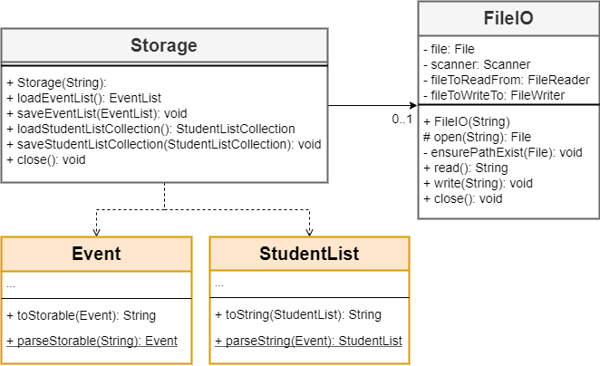
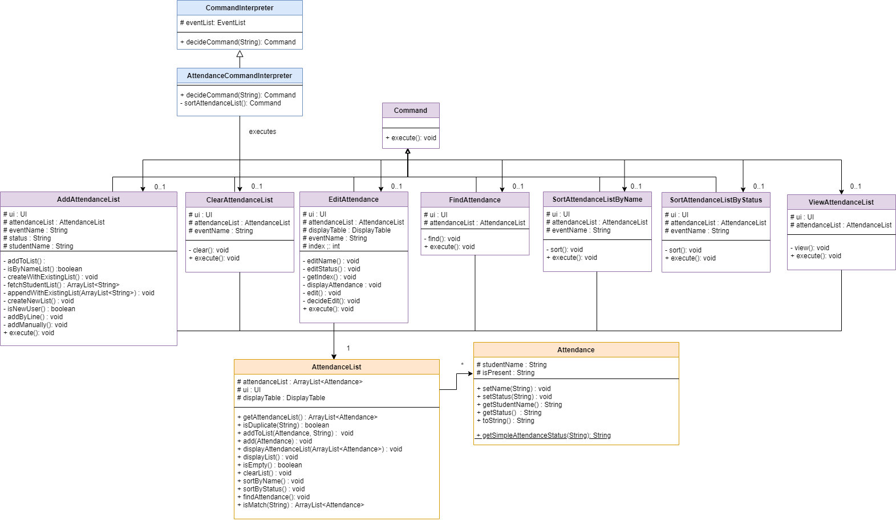
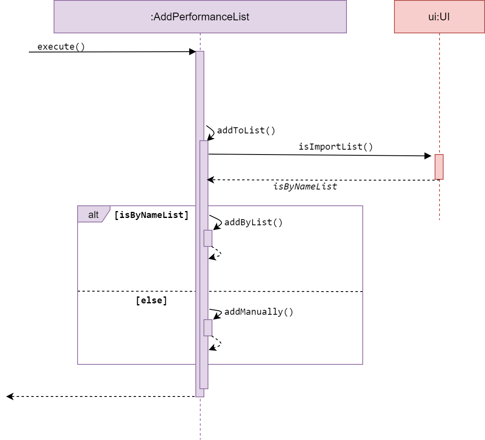
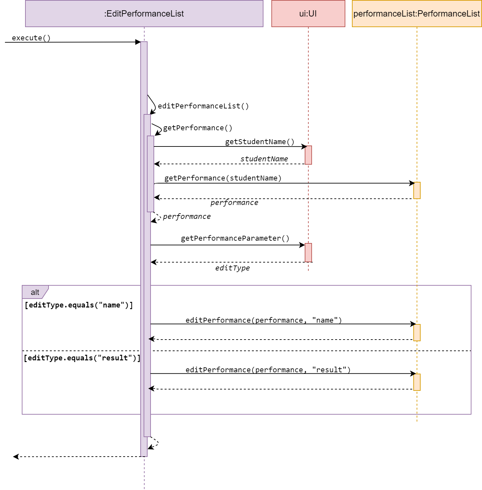

# Developer Guide
The design documentation is in general for anyone who wants to understand the system architecture and design of 
Pac. The following groups are in particular the intended audience of the document.

- PAC project managers
- PAC developers
- PAC software testers

## Table of Contents
1. [Setting Up](#1-setting-up)  
    1.1 [Requirements](#11-requirements)  
    1.2 [Startup using Command Line](#12-startup-using-command-line)  
    1.3 [Startup using Jar](#13-startup-using-jar)  
2. [Design](#2-design)  
    2.1 [Architecture](#21-overall-architecture)  
    2.2 [UI component](#22-ui-component)  
    2.3 [Command component](#23-command-component)  
    2.4 [Parse component](#24-parser-component)  
    2.5 [Storage component](#25-storage-component)  
3. [Implementation of Features](#3-implementation-of-features)  
    3.1 [Event](#31-event)  
    3.2 [Calendar](#32-calendar)    
    3.3 [Attendance](#33-attendance)   
    3.4 [Performance](#34-performance)  
    3.5 [Student List Collection](#35-student-list-collection)  
    3.6 [Help](#36-help)  

[Appendix A: Target User Profile](#appendix-a-target-user-profile)   
[Appendix B: Value Proposition](#appendix-b-value-proposition)  
[Appendix C: Non-functional requirements](#appendix-c-non-functional-requirements)  
[Appendix D: User Stories](#appendix-d-user-stories)    
[Appendix E: Instructions for Manual Testing](#appendix-e-instructions-for-manual-testing)  
[Glossary](#glossary)  

## 1. Setting Up

### 1.1 Requirements 
1.  Ensure you have [Java 11](https://www.oracle.com/java/technologies/javase-jdk11-downloads.html) 
or above installed in your Computer.
1.  Download the latest PAC.jar from [here](https://github.com/AY1920S2-CS2113T-T12-4/tp/releases).
1.  Copy the file to the folder you want to use as the home folder for this application.
1.  Type `java -jar PAC-2.1.jar` to start the application.
1.  You should see this screen if everything is successful.

### 1.2 Startup using Command Line
1.  Open your terminal.
1.  Navigate to the home folder containing PAC.
1.  cd followed by the file path into the terminal as shown below
    <INSERT IMAGE> 
1.  Type `java -jar` followed by the name of the jar file and press **Enter**.

### 1.3 Startup using JAR
1.  Open home folder containing PAC.
1.  Run the packaged JAR file by double clicking it 
    and a window should appear in a few seconds.
    <INSERT IMAGE>
1. Once opened, type in the command when prompted and press **Enter**.

## 2. Design

### 2.1 Overall Architecture
This section presents the architecture of PAC. It explains the architecture of main components of PAC.

              
*Overall architecture design of Pac*

The `Pac` component contains all other components in the application.

- `UI`: reads user input, and prints output in pre-defined format.
- `Storage`: loads/stores all events (in EventList) and all student lists (in StudentListCollection).
- `CommandInterpreter`: Determines category and type of command from user input.
- Various `Parser`: Breaks down user input to obtain command parameters.
- Various `Features`: stores their respective objects during runtime.
    - `EventList`: stores all events during runtime.
    - `StudentListCollection`: stores all student lists during runtime.
    - `AttendanceList`: stores all attendances related to an `Event`.
    - `PerformanceList`: stores all performances related to an `Event`.
    - `Calendar`: shows all events in calendar form.

### 2.2 UI component
                
*Class diagram of the UI component*   

UI is the main class handles user display, which includes reading user input and printing information 
back to the user on command-line.  
Besides the normal command line messages, there are three subclasses of UI: 
- DisplayList and DisplayTable: to specifically print the list and table interface to user.  
- HelpUI: to print the summary of command format to user.  

### 2.3 Command component
         
*Class diagram of the Command component*  

The diagram above shows all commands in this program, which are grouped under 
their own categories (i.e. *StudentList-related*, *Event-related*, 
*Attendance-related*, *Performance-related*). All these commands inherit the 
base `Command` abstract class and utilize its abstract `execute()` method. 
They are created and executed when the user inputs a corresponding command.
 
### 2.4 Parser component

There are total of four Parser classes as shown below. Each Parser class correspond to a feature 
of Pac. 

| Parser                    | Created by                                                    |
|---------------------------|---------------------------------------------------------------|
| EventParser               | EventCommandInterpreter                                       | 
| CalenderParser            | CalendarCommandInterpreter                                       | 
| PerformanceParser         | Step-by-step command at performance-related command classes   |  
| AttendanceParser          | Step-by-step command at attendance-related command classes    |  

A Parser class is created when a user input contains data to be stored or used in certain features.    

### 2.5 Storage component
            
*Class diagram of the Storage component*

On startup, `Pac` instantiates two `Storage` objects (`eventStorage` and 
`studentListStorage`) to load and save `Event` and `StudentList` objects 
respectively. Each event requires other Attendance-related and Performance-related 
methods to load and save it, but these methods are not shown in the diagram above. 

All `Event` and `StudentList` objects are saved after receiving `Bye` command. 
If the program crashes (due to unhandled Exception or Interrupt), they *will not* 
be saved.

## 3. Implementation of Features  
### 3.1 Event
           
*Class diagram of the Event component*  

The Event features allow users to update and keep track of their schedules.

#### Program flow
1. When a user enters an event-related command, the command is analysed by `EventCommandInterpreter`. 
1. The first word is extracted by `getFirstWord` to determine the `commandType`.
1. If this `commandType` requires further arguments, subsequent words are 
extracted, and parsed by `EventParser` to retrieve the relevant information 
(e.g. index, name, time, date, venue).
1. Alternate paths are chosen based on `commandType`, where a corresponding 
`Command` class is created, with the information extracted from the previous 
step passed into it. 
    - e.g. Command `event delete i/1` will create a `DeleteEvent` object, with 
    `index=1` as its argument.
1. This command is returned to `CommandInterpreter#decideCommand()` which returns to `Pac#run()` to call `Command#execute()`. 

The diagram below illustrates the program flow stated above, with the command 
`event delete i/1`.
  

In this diagram:
* Other alternative paths are not shown (e.g. [add], [editEvent], [list], etc.).
* The details after `Command#execute()` is not shown.

Note that:
* `datetime` is stored as a single attribute in `Event` class, but it is exposed to user as `date` 
and `time`, which corresponds to `d/` and `t/` flag respectively.
* `editDate` or `editTime` commands are not available. Only `editDateTime` is available to change the 
`date` and/or `time` of an `Event` object.
* `delete(Event)` method is currently not in use, but can be used to implement delete by event name, 
either by complete match, or fuzzy match.
* Any classes (e.g. `Seminar`) that inherit from `Event` class will have similar program flow. 

### 3.2 Calendar
  
*Class diagram of the Calendar component*  
 
The calendar feature allows users to view their schedule by semester and academic year. Since our target
user is professor, this feature allows the professor to manage their events in accordance to their work schedule.
 
#### Calendar Command Interpreter
Below shows the sequence diagram of `CalendarCommandInterpreter`:
  
*Diagram of CalendarCommandInterpreter*  

1. When a user enters a calendar-related command, the command is analysed by `CalendarCommandInterpreter`.
1. Once determined, the relevant information (eg. semester, academic year) are extracted by `CalendarParser`.
1. Then, only if semester equals 1 or 2 (i.e. valid number), an `EventsSeperator` object which extends `Command` is created.  
1. This command is then returned `CalendarCommandInterpreter#decideCommand` which returns to `Pac#run` to call `Command#execute`.
1. If the command is invalid, the interpreter throws PacException to inform the user. 

#### Program flow
1. When the user enters the calendar-related command, the command is analysed by CalendarCommandInterpreter and 
executed as shows in the section above.
1. `command#execute` will execute the command and create a `calendar` object. 
1. `ui` object and  `displaytable` object is created in the constructor of the Calendar class. 
1. `separateEvents()` method in `Calendar` executes getSemesterEvents(), getAcademicYearEvents(),
and getMonthEvents() to sieve the events that fall under a specific time-frame mentioned by the user.
1. displayCalendar() method in separateEvents(), displays all the components of the calendar by interacting with 
the UI and DisplayTable classes.  

The diagram below illustrates the program flow stated above:  
  
*Program flow of calendar execution*  
 
Below is an example usage of how the user can interact with the calendar manager:  
Step 1: The user wants to `add` an event to their calendar. They do so by inputting `event add n/football d/2020-05-04 t/1700`.
Assuming that it is currently semester 2 of the academic year 19-20, this event falls in that timeline and is added to the calendar.
   
Step 2: The user realises that the name of the event is wrong and decides to `edit` the name of the event. First, they input
`event list` to find the index of the event. Assuming the index of the event is 4, the user then inputs `event editname i/4 n/frisbee`
to edit the name of the event.  
 
Step 3: The user wants to display the events that fall under semester 2 of academic year 19-20. To do this, the user inputs
`calendar s/2 ay/19-20`. A sample view of the calendar is shown below:

      ___________________________________________________________________________________________________________________________________ 
                                                              SEMESTER 2 AY 19/20 
      ___________________________________________________________________________________________________________________________________ 
     | JAN                 | FEB                 | MAR                 | APR                 | MAY                 | JUN                 |
     |_____________________|_____________________|_____________________|_____________________|_____________________|_____________________|
     |                     |                     |                     |                     | 4th [E]: frisbee    |                     |
     |_____________________|_____________________|_____________________|_____________________|_____________________|_____________________|
 
 
#### Design considerations
*Aspect: Data Structure used to implement calendar*
- Alternative 1: Save the events using both 1D ArrayList and 2D ArrayList.
  - Pros: Allows flexibility as to what information a calendar can store. For example, the 1D ArrayList is used to store 
  the event descriptions as Strings whereas the 2D ArrayList stores events which corresponds to each month.
  - Cons: Poor performance when retrieving events which fall within a certain time-frame as program needs to iterate through multiple
  ArrayLists.

- Alternative 2: Save the events as a sorted tree map 
  - Pros: Able to utilise existing java interface to implement calendar instead of creating new object. 
  - Cons: Poor performance when user makes changes to event list to calendar as tree map needs to perform sorting for 
  every new addition, deletion or editing.  
 
*Aspect: How addition, deletion and editing of events affects calendar execution*  
- Alternative 1(current choice): Implement a class specifically to interact with the calendar
  - Pros: Calendar class can support different interactions to modify calendar content
  - Cons: Many new methods to be implemented, which affects code readability.

- Alternative 2: Modify calendar directly using methods belonging to a class where it can be stored in 
  - Pros: Does not require instantiation of new object to modify the calendar contents.
  - Cons: Many new methods to be implemented, which affects code readability.

**Note that**:
* Event list should contain existing events with date and time to view the calendar. 
* Input of the both academic years should be double digit, e.g ay/07-08, ay/19-20. 
* `acadamic year` is parsed in `CalendarParser` and only one year is returned to `CalendarCommandInterpreter` according 
to the semester input by the user, i.e s/1 ay/19-20 would return year = 19, s/2 ay/19-20 would return year = 20.
* Calendar view of the whole year is not available. Only semester 1 or 2 of an academic year can be viewed at a time. This is due to 
the optimization of calendar view in accordance to the professor's schedule.
* Event name size must be less than 10 characters to be displayed neatly (current implementation), however
it can be implemented in the future to truncate longer names to fit nicely in the calendar. 
* Addition, deletion and editing of events from the calendar are automatically attempted whenever a user enters a 
command to modify an event from the event list.  
This is illustrated in the flowchart below:  
  
*Calendar management activity diagram*  

### 3.3 Attendance
        
*Class diagram of the Attendance component*   
 
The Attendance features allow users to update and keep track of their students' attendance for a Event.

#### Attendance Command Interpreter
Attendance Command Interpreter interprets the user input when it belongs to the attendance category.
When user input is passed to Attendance Command Interpreter, it extracts the second word in the user
input and decides whether the string can be interpreted as a valid Command. If valid, the interpreter
returns its corresponding Command. Else, the interpreter will throw PacException to inform the user 
that the string is interpreted as an invalid Command.
Below shows the flow chart and sequence diagram of Attendance Command Interpreter.  

  
*Flow Chart of Attendance Command Interpreter*  

  
*Sequence diagram of Attendance Command Interpreter*  

#### Program flow
1. When a user enters an attendance-related command, the command is analysed by `AttendanceCommandInterpreter`. 
1. Once determined, the relevant class that corresponds to the type of command is created.
1. Then, the class will execute base on its function. It modifies `AttendanceList`.
1. These commands are then returned to `Pac.run()` to `execute()`. 

Note that:
* `attendance add` command provides to use an existing list stored under `StudentListCollection` or to create 
a new list. If you choose to use an existing list, you need to ensure that there are existing `StudentList` in
the `StudentListCollection`. If you choose to create a new list, you will be given an option of a multi-line or 
single line interaction. If you are a new user, you will be assigned to use the multi-line entering of student
attendance data. If you are not a new user, you will assigned to use the single line entering of student
attendance data. `n/` and `p/` flags are used to insert new attendance.

#### Features under Attendance
There are 6 features for attendance in total, as shown below. 
The features will be presented in the order of sequence diagram, followed by description.  

#### Add attendanceList  
    
*Sequence diagram of AddAttendanceList*
     
`AddAttendanceList` is a subclass of Command. It allows the user to add a new existing `attendanceList` under an Event.
The method addToList() accesses the `attendanceList` of a given event, and checks whether the list is empty. If there is
an existing `attendanceList` in the given event, it calls display() in UI and inform the user that the list currently
exist and needs to be cleared before adding a new attendanceList. Else, it will prompt the user to ask whether the 
user intends to use an existing `studentList` found in `studentListCollection` or create a new list which will be added
to `studentListCollection` upon creation with the name of the event as the list name. 
 
#### Clear attendanceList    
    
*Sequence diagram of ClearAttendanceList*  

`ClearAttendanceList` is a subclass of Command. It allows the user to clear an existing `attendanceList` under an Event.  
The method clear() accesses the desired `attendanceList` of a given event, and checks whether the list is empty.
If empty, it calls display() in UI and inform the user list is empty. Else, it will clear the existing `attendanceList` 
stored under the given event.

#### View attendanceList  
     
*Sequence diagram of ViewAttendanceList*    

`ViewAttendanceList` is a subclass of Command. It allows the user to view a self generated table based on the data 
in a desired `attendanceList`.  
The method view() accesses the desired `attendanceList` of given event, and checks whether the list is empty.  
If empty, it calls display() in UI and inform the user list is empty. Else, it will iterate through the `attendanceList` 
and print Attendance data in a table format.  

#### Sort attendanceList 

-
     
*Sequence diagram of SortAttendanceListByName*    

- 
      
*Sequence diagram of SortAttendanceListByStatus*  
    
`SortAttendanceListByName` and `SortAttendanceListByStatus` are subclasses of Command. 
They both allow the user to sort a attendance list by either the student's name or status.
The two Commands will be discussed together in this section as they have similar behaviour.  
The methods `SortAttendanceListByName` and `SortAttendanceListByStatus` access a desired `attendanceList` and check 
whether it is empty. If empty, it calls display() in UI and inform the user list is empty.  
Else, it will sort the `attendanceList` by the type mentioned in its method name.  

#### Edit attendance  
    
*Sequence diagram of EditAttendance*  

`EditAttendance` is a subclass of Command. It allows the user to edit an `attendance`,
either the student's name or status, from a desired `attendanceList` under an Event.  
The method edit() accesses the desired `attendanceList` of given event, and checks whether the list is empty.
If empty, it calls display() in UI and inform the user list is empty. Else, it will call decideEdit() from itself.
The method decideEdit() will call getUserInput() in UI to get the user input and decide whether to call editName() or 
editStatus() base on the user input.

#### Find attendance  
  
*Sequence diagram of FindAttendance*  

`FindAttendance` is a subclass of Command. It allows the user to find an `attendance`.
The method find() accesses the desired `attendanceList` of given event, and checks whether the list is empty.
If empty, it calls display() in UI and inform the user list is empty. Else, it will call findAttendance() from 
`attendanceList`. findAttendance() will search for attendance with the same name entered and display for the user.

#### Design consideration for Attendance  

##### AddAttendance
* Alternative 1 : Use single line for adding of attendance to an event
    * **Pros:** Prompts the user what to type
    * **Cons:** Slow for experience users
* Alternative 2 : Use multi-line for adding of attendance to an event
Using single line or multi-line for adding of attendance to an event
    * **Pros:** Fast for experience users
    * **Cons:** New users will have difficulty in adding new attendance
    
* Final Decision : Using both single line and multi-line by giving the user the option    

##### ClearAttendance VS DeleteAttendance
* Alternative 1 : Allow the deletion of a single attendance in an attendance list in an event
    * **Pros** User can specifically remove a single student
    * **Cons** Complicated feature to use as user will need to search for the attendance in the list before deletion
    
* Alternative 2 : Only allow the attendance list to be cleared
    * **Pros** User can easily remove the attendance list and add a new attendance list
    * **Cons** A single mistake in the attendance list will mean that user has to clear and add again.
    
* Final Decision: Introduce a feature to `editAttendance` to amend mistake and have `clearAttendance` instead of 
`deleteAttendance`. `deleteAttendance` can be inserted in future releases.

### 3.4 Performance

*Class diagram of the Performance component*  

The Performance features allow users to update and keep track of their students' 
result for a Event.  
    
#### Performance Command Interpreter
Performance Command Interpreter interprets the user input when it belongs to the
performance category.  
When user input is passed to Performance Command Interpreter, it extracts the 
second word in the user input and decides whether that string can be interpreted to a
valid Command.  
If valid, the interpreter returns its corresponding Command.  
If invalid, the interpreter throws PacException to inform the user.  

Below shows the flow chart and sequence diagram of Performance Command Interpreter.  
  
*Flow Chart of Performance Command Interpreter*  

 
*Sequence diagram of Performance Command Interpreter*  

#### Program flow
1. When a user enters a performance-related command, the command is analysed by 
[PerformanceCommandInterpreter](#performance-command-interpreter).  
1. Once determined, the relevant class that corresponds to the command is created (e.g. AddPerformance, 
DeletePerformance...), and ask for relevant information (e.g. event name, student name, student result) from the user. 
1. Then, with the information extracted from the previous step passed into it. It modifies PerformanceList` under
the event class correspond to the input event name.
1. These commands are then returned to `Pac.run()` to `execute()`. 
 
Note that:
* All PerformanceList class are created under an Event. A PerformanceList cannot exist 
by its own. 
* All Performance commands are step-by-step commands. This aims to provide convenience to the user by 
prompting instructions and correct command format.  
* All Performance discussed in Pac are constructed with student's name and result.

#### Features under Performance
There are 5 features for Performance in total, as shown below. 
The features will be presented in the order of sequence diagram, followed by description.  
 
#### Add performanceList
  
*Sequence diagram of AddPerformanceList*  

AddPerformanceList is a subclass of Command. It allows the user to add performances
by importing a student list, or add manually, to a desired performance list under an Event.  
    
The method execute() calls addToList() from the same class, which then calls 
isImportList() from UI to get a user input. This user input decides whether 
the user will add performances by list or manually.  
The method addByList() or addManually() will then get user input for Performance parameters, 
which will be parsed by the PerformanceParser and return a Performance.  
The Performance attained from the parser will be added to a desired performanceList. 

#### Delete performanceList
  
*Sequence diagram of AddPerformance*  

DeletePerformanceList is a subclass of Command. It allows the user to delete a performance
from a desired performance list under an Event.  

The method execute() calls deletePerformance() from the same class, which then calls 
getPerformance() from itself to get the user input, Performance parameters 
of the Performance to be deleted, and return a Performance.  
The Performance attained from getPerformance() will be deleted from a desired performanceList. 

#### Edit performanceList
  
*Sequence diagram of EditPerformance*  

EditPerformanceList is a subclass of Command. It allows the user to edit a performance,
either the student's name or result, from a desired performance list under an Event.  

The method execute() calls editPerformanceList() from the same class, which then calls 
getPerformance() from itself, to get the user input, student's name of the 
Performance to be edited, and return a Performance.  
The method editPerformanceList() then calls getPerformanceParameter() from UI 
to get a user input. This user input decides whether the user will edit the 
student's name or result.  
The new parameter will be attained from the user in method editPerformance(performance, editType) 
in PerformanceList.  

#### Sort performanceList  

- 
    
*Sequence diagram of SortPerformanceListByName*  
    
- 
    
*Sequence diagram of SortPerformanceListByResult*  
    
SortPerformanceListByName and SortPerformanceListByResult are subclasses of Command. 
They both allow the user to sort a performance list, by student's name or result as their
name suggest. 
The two Commands are discussed together in this section as they have similar behaviour.  
The method execute() calls sortPerformanceByName() or sortPerformanceByResult, 
according to its class name.   
The methods sortPerformanceBy...() access a desired performanceList and check whether 
the list is empty. 
If empty, it calls display() in UI and inform the user.  
Else, it will sort the performanceList by the type mentioned in its method name.  

#### View performanceList  
  
*Sequence diagram of ViewPerformanceList*  

ViewPerformanceList is a subclass of Command. It allows the user to view a self
generated table based on the data in a desired performance list.  

The method execute() calls viewList() from the same class, which accesses a 
desired performanceList of given event and checks whether that list is empty.  
If empty, viewList() calls display() in UI and inform the user.  
Else, it will iterate through the performanceList and print Performance 
data in a table format.  

### 3.5 Student List Collection
     
*Class diagram of the Student component* 

The Student list features allow users to store a list of student names, which could be used
when updating students' attendance and performance data conveniently.  

#### Program Flow   
1. When a user enters an studentList-related command, the command is analysed by `StudentCommandInterpreter`. 
1. Once determined, the relevant class that corresponds to the type of command is created.
1. Then, the class will execute base on its function. It modifies `StudentList`.
1. These commands are then returned to `Pac.run()` to `execute()`. 

Note that:
* studentList-related commands can be executed without the existence of events.

#### Student Command Interpreter
Student Command Interpreter interprets the user input when it belongs to the
student category.  
When user input is passed to Student Command Interpreter, it extracts the second word in the user input 
and decides whether that string can be interpreted to a valid Command.  
If valid, the interpreter returns its corresponding Command.  
If invalid, the interpreter throws PacException to inform the user.  

Below shows the flow chart and sequence diagram of Student Command Interpreter.    
   
*Flow Chart of Student Command Interpreter*    

   
*Sequence diagram of Student Command Interpreter*    

#### Features under Student List Collection
There are 6 features for Student in total, as shown below. 
The features will be presented in the order of sequence diagram, followed by description.  

#### Add student list
  
 *Sequence diagram of AddStudentList*   
 
`AddStudentList` is a subclass of Command. It allows the user to add a student list
to the `studentListCollection`.    

The method execute() calls addToList() from the same class, which then calls 
getListName() from UI to get a user input for listName.  
The list name of student list is restricted to one word only, hence the parameter listName 
is trimmed.  
StudentList, a new student list is created with list name listName.  
The method addToList() calls addStudent(studentList) from UI to get user input 
for student names to be added. The names are added to studentList
in addStudent(studentList).  
After user has done input, `studentList` will be printed, and this new list is
added to `studentListCollection`.
 
#### Delete student list  
  
 *Sequence diagram of DeleteStudentList*  
 
`DeleteStudentList` is a subclass of Command. It allows the user to delete a student list
from the studentListCollection.    

If the `studentListCollection` is empty, execute() calls displayStudentListCollectionEmpty()
form UI, to inform the user.  
Else, it calls deleteFromExisting() from the same class and get user input for index, the
list number to be deleted.  
The (index-1)th list in `studentListCollection` is deleted.  

#### Clear student list  
   
 *Sequence diagram of ClearStudentList*  
 
`ClearStudentList` is a subclass of Command. It allows the user to clear the 
`studentListCollection`.  

The method execute() calls clear() from the same class. 
If the `studentListCollection` is empty, clear() calls displayStudentListCollectionEmpty()
from UI, to inform the user.  
Else, it calls clear() from `StudentListCollection` to clear the collection.  
The user will get informed when a success clear has been performed.  

#### View student list  
  
 *Sequence diagram of ViewStudentList*   
 
`ViewStudentList` is a subclass of Command. It allows the user to view a self 
generated table based on the data in `studentListCollection`.  

The method execute() calls displayStudentList() from the same class.  
If the `studentListCollection` is empty, displayStudentList() calls 
displayStudentListCollectionEmpty() from UI, to inform the user.  
Else, it calls printStudentListCollection() from UI to print the table. 

#### Find student list   
   
 *Sequence diagram of FindStudentList*   
 
`FindStudentList` is a subclass of Command. It allows the user to find a certain `studentList`
in `studentListCollection`.  

The method execute() calls find() from the same class.  
If the `studentListCollection` is empty, displayStudentList() calls 
displayStudentListCollectionEmpty() from UI, to inform the user.  
Else, it calls displayStudentListCollection() from the same class to print the table.  
Next, it will prompt the user for a keyword. Using the keyword, it will iterate through 
the `studentListCollection` to find a `studentListCollection` listName that equals to the keyword.  
Last, it will call printSearchResults from displayList to display the searchResults found.  
The user will get informed when a success sort has been performed.  
 
#### Sort student list   

-    
      
*Sequence diagram of SortStudentListByName*    

- 
    
*Sequence diagram of SortStudentListByList*    
    
`SortStudentListByName` and `SortStudentListByList` are subclasses of Command. 
They both allow the user to sort a student list by either the student's name within a list or 
the list name of `studentList` stored within the `studentListCollection`.  

The two Commands will be discussed together in this section as they have similar behaviour.  
The methods `SortStudentListByName` and `SortStudentListByList` access a desired `studentListCollection` and 
check whether the collection is empty.  
If empty, it calls display() in UI and inform the user list is empty.  
Else, it will sort the `studentListCollection` or `studentList` by the type mentioned in its method name.    

### 3.6 Help
  
*Sequence diagram for Help*  

Help function provides a summary of command format for the user.  

When help command is executed, a menu page is shown at the console.  
It then calls getStringInput() from UI, to get user input, typeOfHelp, and prints
corresponding help information to user.  

## Appendix

### Appendix A: Target user profile
Our target audiences are professors who need help organizing their personal work schedule and need more time.
The professors are pressed for time and they require a simple software to organize their monthly events
and keep track of their students' attendance and performance. 

### Appendix B: Value proposition
Our application will reduce the stress of the professor by allowing them to easily enter and store
their work schedule as well as their students' records. After storing the data, the Professor can have
quick access to the information in either a list or a calendar view. 

### Appendix C: Non-Functional Requirements

1. Should work on any mainstream OS as long as it has 
[Java 11](https://www.oracle.com/java/technologies/javase-jdk11-downloads.html) or above installed.
1. Should be able to hold up to 1000 events without a noticeable sluggishness in performance for 
typical usage.
1. A user with above average typing speed for regular English text (i.e. not code, not 
system admin commands) should be able to accomplish most of the tasks faster using commands 
than using the mouse.

{More to be added in future revisions}

### Appendix D: User Stories

|Version| As a ... | I want to ... | So that I can ...|
|--------|----------|---------------|------------------|
|v1.0|professor|add new events|creating new events|
|v1.0|professor|delete existing events|delete unnecessary events|
|v1.0|professor|add new attendance list|create new attendance list to be added to events|
|v1.0|professor|delete existing attendance list|delete unnecessary attendance list|
|v1.0|professor|add new performance list|create new performance list to be added to events|
|v1.0|professor|delete existing performance list|delete unnecessary performance list|
|v1.0|professor|add date and time to my events|organize my events|
|v1.0|professor|add venue to my events|locate events|
|v1.0|professor|edit my events|update my existing events|
|v2.0|professor|create a student list|link existing student list to performance list or attendance list|
|v2.0|professor|Create repeatable events without having the need to manually add in|easily create occurring events|
|v2.0|professor|find an event by name|locate an event without having to go through the entire list|
|v2.0|professor|view calendar of all my events|to see a overview of them|
|v2.1|professor|edit my student's attendance|update my existing student's attendance|
|v2.1|professor|find my student's attendance|locate an existing student's attendance|

### Appendix E: Instructions for Manual Testing
#### Set up
1. Download the jar file and copy it into an empty folder.
1. Run the jar file by typing java -jar Pac-2.1.jar after going into the file's home directory 
folder in command terminal.  

#### Adding an event

- Prerequisite: None
- Test case: `event add n/1 v/2 d/2000-01-01 t/0000`    
  Expected: An event is added with name, venue and datetime.
- Test case: `event add n/1 v/2`    
  Expected: An event is added without datetime. A warning message about unknown 
  datetime is shown.
- Test case: `event add n/1 d/2000-01-01 t/0000`    
  Expected: An event is added without venue.
- Test case: `event add n/1`    
  Expected: An event is added with only name. A warning message about unknown 
  datetime is shown.
- Test case: `event add v/2`    
  Expected: An event is added with default name and no datetime. A warning message 
  about unknown datetime is shown.
- Test case: `event add d/2000-01-01 t/0000` (no name and venue)    
  Expected: No event is added. Error details shown.
- Test case: `event add n/` (only flag, no parameter)     
  Expected: No event is added. Error details shown.
- Other incorrect commands to try:  
    - either date or time, but not both, is given
    - adding something before flag

#### Deleting an event

- Prerequisites: At least one event must be added beforehand.
- Test case: `event delete i/1`     
  Expected: First event is deleted from the list. The name of the deleted 
  event is shown.
- Test case: `event delete i/0` (or other index that is less than 1)   
  Expected: No event is deleted. Error details shown.
- Test case: `event delete i/10` (out of bound)     
  Expected: No event is deleted. Error details shown.
- Test case: `event delete i/apple` (not an integer)    
  Expected: No event is deleted. Error details shown.
- Test case: `event delete 1` (too short to look for flag)  
  Expected: No event is deleted. Error details shown.
- Test case: `event delete apple` (no flag)  
    Expected: No event is deleted. Error details shown.

#### Saving and loading corrupted data
1. Make sure you have some events and/or student lists to load.  
    - You can use `event add`, and `studentlist add` to add some.
1. Close the application using `bye` command.   
    - `All events are saved.` is shown if there are events to save.
    - `All student lists are saved.` is shown if there are student lists to save.
    - They are saved under `data/`.
1. Delete all commas and pipes under `eventlist.txt` to simulate data corruption.   
1. Run the application again.
1. You will see `...Corrupted event found. Only previous events are loaded.`
1. If you have unmodifed events before the corrupted event, they will be loaded 
and saved.

#### Follow **all-in-one** command for following commands:  
**Event**
1. Add an event by typing  
`event add n/NAME`
1. View the populated events by typing  
`event list`
1. View the populated seminars by typing  
`seminar list`
1. Delete an event by typing  
`delete i/INDEX`
1. Edit an existing event's name by typing  
`event editname i/INDEX n/NAME`
1. Edit an existing event's date and time by typing  
`event editdatetime i/INDEX d/DATE t/TIME`
1. Edit an existing event's venue by typing   
`event editvenue i/INDEX v/VENUE`  

**Calender**
1. Add an event with date and time 
`event add n/work d/2020-04-05 t/1230`
1. Display calendar by entering  
`calendar s/2 ay/19-20`  

#### Follow **step-by-step** command in console for following commands:  

**Attendance**
1. Add attendance to attendance list by typing  
`attendance add`
1. Clear attendance list by typing  
`attendance clear`
1. View generated table for attendance list by typing  
`attendance view`  
1. Sort attendance list by typing  
`attendance sort`  
1. Find attendance by typing  
`attendance find`  
1. Edit attendance by typing  
`attendance edit`  
 
**Performance**
1. Add performance to performance list by typing  
`performance add`
1. Delete a performance from performance list by typing  
`performance delete`
1. View generated table for performance list by typing  
`performance view` 
1. Edit performance list by typing  
`performance edit`
1. Sort performance list by typing  
`performance sort`  

**Student name list**
1. Add name to student name list by typing  
`studentlist add`
1. Delete name from student name list by typing  
`studentlist delete`
1. View generated table for student name list by typing  
`studentlist view` 
1. Find a student name in student name list by typing  
`studentlist find`
1. Sort student list by typing  
`studentlist sort`

## Glossary

* *mainstream OS* - Windows, Linux, Unix, OS-X
* *flag* - anything that takes the form of  `?/`, e.g. `n/`, `i/`
* *student list* - a list of students' name
* *student list collection* - a collection of list of students' name
* *attendance* - a combination of student's name and attendance status
* *attendance list* - a list of students' name and attendance status
* *performance* - a combination of students' name and result
* *performance list* - a list of students' name and result
* *Calendar* - Display columns of event in a chosen semester, each column represents a month 
in the chosen semester 