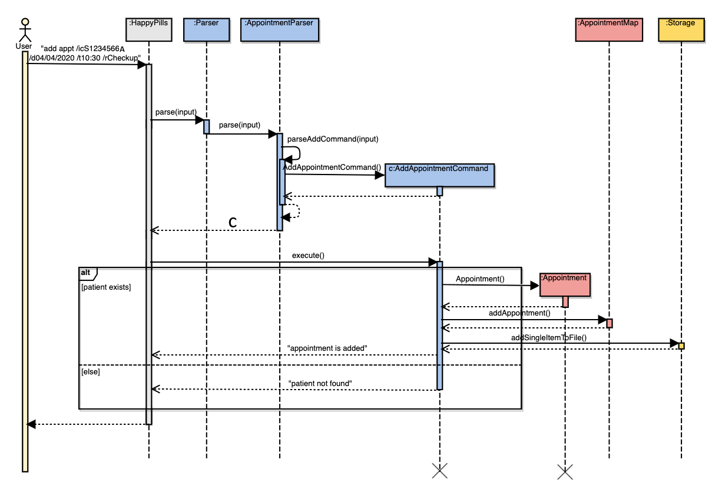
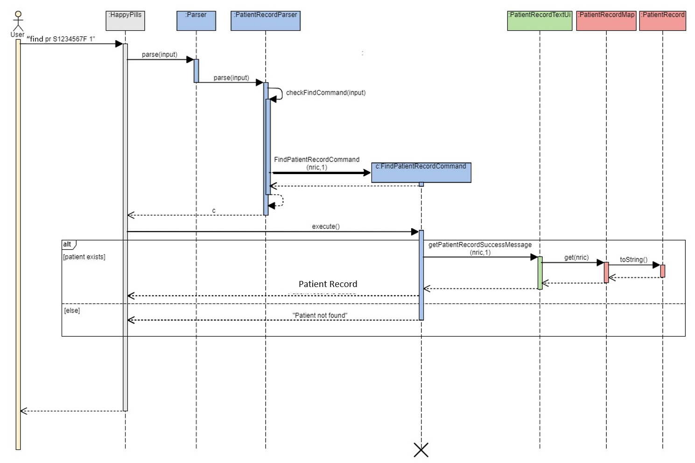
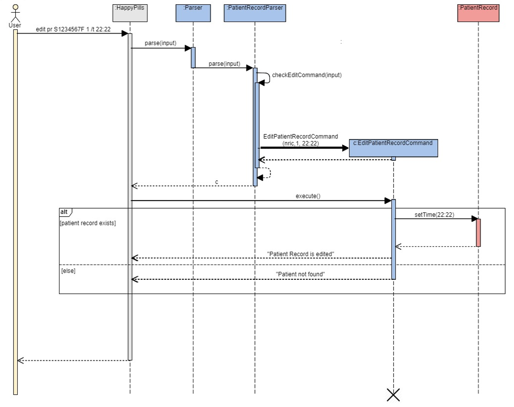
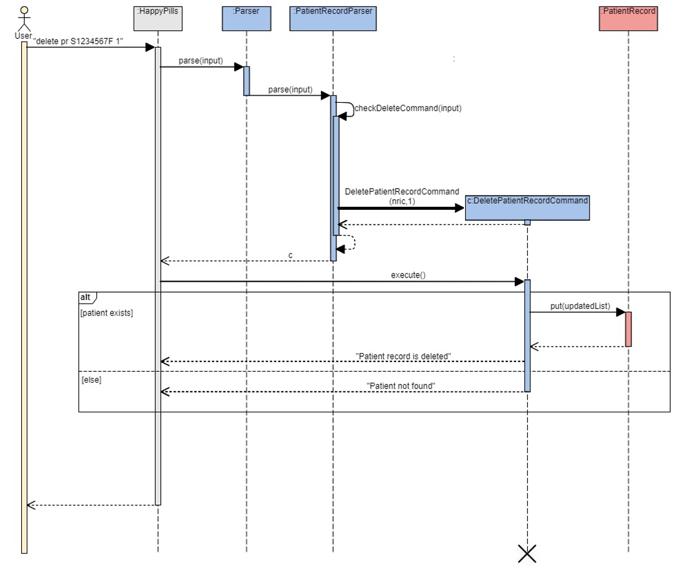
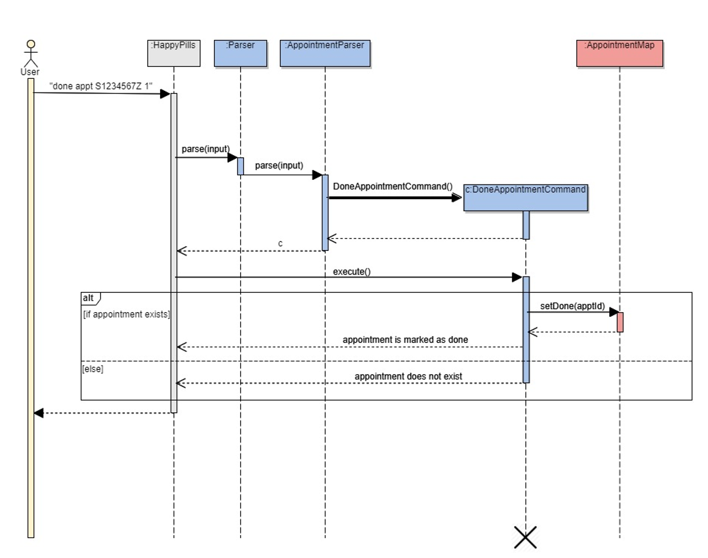
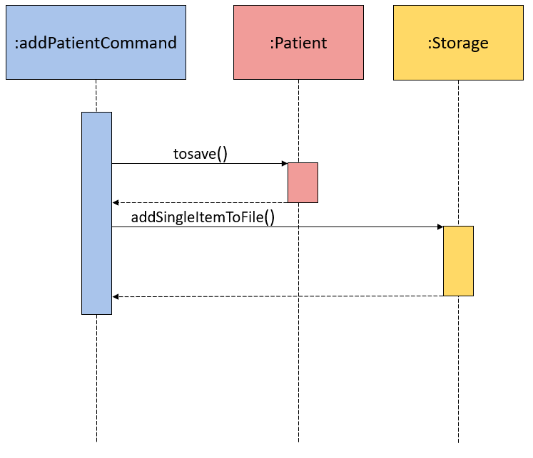
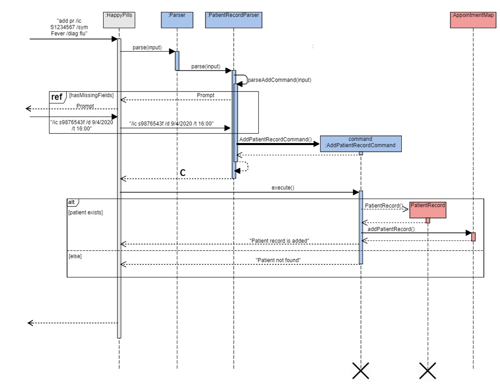

# Developer Guide

By: `CS2113T-T12-2` Since: `March 2020`

 
 

## Table of Contents

- [1. Introduction](#1-introduction)
    * [1.1. Purpose](#11-purpose)
    * [1.2. Scope](#12-scope)
    * [1.3.](#13-)
- [2. Setting up](#2-setting-up)
- [3. Design](#3-design)
    * [3.1. Architecture](#31-architecture)
    * [3.2. TextUi Component](#32-textui-component)
    * [3.3. Logic Component](#33-logic-component)
    * [3.4. Model Component](#34-model-component)
    * [3.5. Storage Component](#35-storage-component)
- [4. Implementation](#4-implementation)
    * [4.1. Patient Details Feature](#41-patient-details-feature)
        + [4.1.1. Add Patient Details](#411-add-patient-details)
        + [4.1.2. Edit Patient Details](#412-edit-patient-details)
        + [4.1.3. Delete Patient Details](#413-delete-patient-details)
        + [4.1.4. List Patients](#414-list-patients)
        + [4.1.5. Retrieve Patient Details](#415-retrieve-patient-details)
    * [4.2. Patient Medical Records Feature](#42-patient-medical-records-feature)
    * [4.3. Appointment Scheduling Feature](#43-appointment-scheduling-feature)
        + [4.3.1. Add Appointment](#431-add-appointment)
        + [4.3.2. Edit Appointment](#432-edit-appointment)
        + [4.3.3. Delete Appointment](#433-delete-appointment)
        + [4.3.4. Mark Appointment as Done](#434-mark-appointment-as-done)
        + [4.3.5. List Appointments](#435-list-appointments)
        + [4.3.6. Find Appointments of Patient](#436-find-appointments-of-patient)
    * [4.4 Storage](#44-storage)
    * [4.5 User Prompting](#45-user-prompting)
- [5. Documentation](#5-documentation)
- [6. Testing](#6-testing)
- [7. Useful Links](#7-useful-links)
- [Appendices](#appendices)
    * [Appendix A: Product Scope](#qppendix-a-product-scope)
    * [Appendix B: User Stories](#appendix-b-user-stories)
    * [Appendix C: Non-functional Requirements](#appendix-c-non-functional-requirements)
    * [Appendix D: Glossary](#appendix-d-glossary)
    * [Appendix E: Instructions for Manual Testing](#appendix-e-instructions-for-manual-testing)

## 1. Introduction

### 1.1. Purpose

This document contains the architecture and software design specifications for the application HappyPills.

### 1.2. Scope

This guide is mainly for developers, designers and software engineers that are working on and using HappyPills.

### 1.3.
`PatientParser` - A mark-up in PascalCase indicates the class used.

`PatientParser#parse()` - The camelCase text after the '#' indicates the method called in the class

## 2. Setting Up

Refer to the guide [here](SettingUp.md).

## 3. Design 

This section provides a high-level overview of HappyPills.

### 3.1. Architecture

The **Architecture diagram** above explains the high-level design of HappyPills. 
Given below is a quick overview of each component.

Main has one class called `HappyPills`.  
It is responsible for:  
- At app launch: Initializes the components in the correct sequence, and connects them up with each other.

The rest of the application consists of four other components.

- `UI`: The user interface of the application.

- `Logic`: The command executor.

- `Model`: Holds the data of the App in-memory.

- `Storage`: Reads data from and writes data to the text file stored on the user's computer.

**How the architecture components interact with each other**  

The Sequence Diagram below shows how the components interact with each other for 
the scenario where the user issues the command `delete patient NRIC`.  

The sections below give more details of each component.

----- shift down ---

The architecture of HappyPills is broken down into seven main classes:
* `Ui`: This class handles the User Interface of the application.
* `Parser`: This class handles the parsing and handling of user commands.
* `Command`: This class handles all the commands the application has.
* `Storage`: This class reads and writes data to and from text files for future use.
* `Patient`: This class manages the data of data type Patient in memory. 
* `Appointment`: This class manages the data of data type Appointment in memory.
* `MedicalRecords`: This class manages the data of data type MedicalRecord in memory.

### 3.2. Ui Component

The `Ui` component: 
* Executes user commands using the command component.
* Listens for changes and outputs messages accordingly from the Command component.
* Store or generate formatted messages used by the other components, for display to the user.
* Consist of 6 classes:
    - PatientTextUi
    - AppointmentTextUi
    - PatientRecordTextUi
    - StorageTextUi
    - HelpTextUi
    - Messages

The first three TextUi sub classes are categorized based on object type. Results and error messages for 
commands executed on the relevant object are located here.

StorageTextUi contains only strings used for logging of storage activities and format strings saved to
the text files, so as to recover objects on next startup.

HelpTextUi contains only the messages used in the help command, so as to provide guidance to the user on
the usage of the commands.

### 3.3. Logic Component

The diagram above shows the logic flow of HappyPills.

1. `HappyPills` uses the `Parser` to parse the commands given by the user.
2. This results in a `Command` object being returned which is then executed by `HappyPills`.
3. The command executed will cause a change in the program (e.g. Patient added into program). 
4. The result of the command is then passed back to the `TextUi` to display the message. 

### 3.4. Model Component

### 3.5. Storage Component

The `Storage` class is called by the `HappyPills` class to handle the loading and saving of patient general details, 
patient medical details and appointment schedule. 

The `loadPatientsFromFile()`, `loadPatientRecordFromFile()` and `loadAppointmentsFromFile()` methods are used 
to read saved data from local files into the current session of HappyPills. 

These data are parsed into corresponding
objects, and added to a map which will be returned to the main program, using `parsePatientFileContent()`,
`parsePatientRecordFileContent` and `parseAppointmentFileContent` respectively.

The `writeAllToFile()` method will write the current list of object into the corresponding text file by stating
the predefined filepath. This method is called on every delete, done and edit command for the corresponding objects, 
as well as by the `ExitCommand` class to confirm the storage of the current state of HappyPills.

The `addSingleItemToFile` appends an object as a new line the corresponding text file. This method is called only
for add commands executed on the various objects. 

## 4. Implementation

This section describes some of the details on how the features of the program has been implemented. This section has been broken 
down into nine main features: `Data Structure`, `Add Details Feature`, `List Feature`, `Find/Get Feature`, `Edit Detail Feature`, `Delete Feature`, `Done Appointment Feature`, `Storage`, `Prompting Feature`.

### 4.1. Data Structure

The `Patient Details`, `Patient Medical Records`, `Appointment Scheduling` is facilitated by HashMap which implements the following operations: 

- `PatientMap #add(Patient patient)` — This command adds the patient object into the patient list using the patient’s nric as key.  
- `PatientMap #remove(String nric)` — This command removes the patient object from the existing patient list.  
- `PatientMap #get(String nric)` — This command get the patient object resides in the existing patient list. 
- `PatientRecordMap #add(Patient patient)` — This command adds the patient's record object into the patient's record list using the patient’s nric as key.  
- `PatientRecordMap #remove(String nric)` — This command removes the patient's record object from the existing patient's record list.  
- `PatientRecordMap #get(String nric)` — This command get the patient's record object resides in the existing patient's record list.
- `AppointmentMap #add(Patient patient)` — This command adds the appointment object into the appointment list using the patient’s nric as key.  
- `AppointmentMap #remove(String nric)` — This command removes the appointment object from the existing appointment list.  
- `AppointmentMap #get(String nric)` — This command get the appointment object resides in the existing appointment list.  
    
**Design Considerations** 

*Aspect: Data Structure of the Patient List* 

- Alternative 1 (current choice): Hash Map
  * Pros: Allow faster lookup of patients’ information using the unique identifier (nric)
  * Cons: Implementation is harder and may result in bugs if not implemented accurately.
            
 - Alternative 2: Array List
   * Pros: This would be easier to implement and retrieve the information.
   * Cons: When a patient is deleted, all the patients in the patient list need to be checked. 
           This would cause the deletion to be very slow when there is a large number of patients in the list.

### 4.2. Add Feature

The user is able to add patient details, patient's record and appointment details into the program to keep track of the patient. 

**Implementation** 

The `AddAppointmentCommand` extends the `AppointmentCommand` which implements the `Command` class and initialises the 
`nric`, `date`, `time`, and `reason` in its constructor. 

The following steps below is an example of how the `AddAppointmentCommand` class behaves: 

1. The user enters `add appt /ic S1234567A /d 04/04/2020 /t 10:30 /r Checkup` into the application. The `HappyPills` 
class then calls `Parser#parse()` to parse the user input. Upon checking that it is an Appointment-related command, 
`Parser` then calls the `AppointmentParser#parse()` method. 

2. `AppointmentParser#parse()` will then call the `parseAddCommand` in the same class to parse all the arguments of the user input. 

3. A new instance of `AddAppointmentCommand` with the given arguments initialised will be created. `HappyPills` will 
subsequently call the `AddAppointmentCommand#execute()` method. 

4. The `AddAppointmentCommand#execute()` method will do 2 things: 

	+ If there is no patients in the `PatientMap` with the given nric, the method returns a string to notify the user 
	that the patient does not exist. 
	
	+ If the patient with the given nric exists in `PatientMap`, a new Appointment object with the given arguments 
	(nric, date, time and reason) are created and added into the `AppointmentMap` and into the ArrayList of Appointment 
	objects in the Patient object mapped with the nric given. The `Appointment` object is stored in the storage by calling `Storage#writeAllToFile()`. 
	Subsequently, the method returns a string to notify the user that the patient has been added into the `AppointmentMap` 
	and displays the `AppointmentID` associated to the `Appointment` object created. 

The following sequence diagram summarises how the `AddAppointmentCommand` operation works: 

#### 4.2.1 Add Patient Details

**Design Considerations**

##### Aspect: Prompt handling method

        Alternative 1 (current choice):
          Pros: 
          Cons: 
            
        Alternative 2: 
          Pros: 
          
        Alternative 1 was chosen as it decrease coupling between components. And reduces major failure during v1.
        P.S subject to change in v2.

#### 4.2.2 Add Patient Record Details

**Design Considerations**

##### Aspect: Prompt handling method

        Alternative 1 (current choice):
          Pros: 
          Cons: 
            
        Alternative 2: 
          Pros: 
          
        Alternative 1 was chosen as it decrease coupling between components. And reduces major failure during v1.
        P.S subject to change in v2.

#### 4.2.3. Add Appointment Details 

**Design Considerations**

##### Aspect: Prompt handling method

        Alternative 1 (current choice):
          Pros: 
          Cons: 
            
        Alternative 2: 
          Pros: 
          
        Alternative 1 was chosen as it decrease coupling between components. And reduces major failure during v1.
        P.S subject to change in v2.

### 4.3 List Features 

The user is able to get a list of all the appointments currently in the program.
The command: 
    
    list appt
    
will list all the appointments in the `AppointmentMap`. 

**Implementation** 

The `ListAppointmentCommand` extends the `AppointmentCommand` which implements the `Command` class.

The following steps below is an example of how the `ListAppointmentCommand` class behaves: 

1. The user enters `list appt` into the application. The `HappyPills` class then calls the `Parser#parse()` to parse the 
user input. Upon checking that it is an Appointment-related command, `Parser` then calls the `AppointmentParser#parse()` method. 

2. `AppointmentParser#parse()` will then split the user input and calls the `ListAppointmentCommand` class. 

3. `HappyPills` will then call the `ListAppointmentCommand#execute()` method. 

4. The `ListAppointmentCommand#execute()` method will check if there are any appointments in the program. 

5. If there are appointments in the program, it gets the list of appointments by calling `PatientMap.getAppointments()` 
and displays all the appointments. Otherwise, the user will receive a message saying that the there is no appointments in the list. 

The following sequence diagram summarises how the `ListAppointmentCommand` operation works: 

#### 4.3.1. List Patients

**Design Considerations**

##### Aspect: Prompt handling method

        Alternative 1 (current choice):
          Pros: 
          Cons: 
            
        Alternative 2: 
          Pros: 
          
        Alternative 1 was chosen as it decrease coupling between components. And reduces major failure during v1.
        P.S subject to change in v2.

#### 4.3.2 List Patient's Records

**Design Considerations**

##### Aspect: Prompt handling method

        Alternative 1 (current choice):
          Pros: 
          Cons: 
            
        Alternative 2: 
          Pros: 
          
        Alternative 1 was chosen as it decrease coupling between components. And reduces major failure during v1.
        P.S subject to change in v2.

#### 4.3.3 List Appointments 

**Design Considerations**

##### Aspect: Prompt handling method

        Alternative 1 (current choice):
          Pros: 
          Cons: 
            
        Alternative 2: 
          Pros: 
          
        Alternative 1 was chosen as it decrease coupling between components. And reduces major failure during v1.
        P.S subject to change in v2.

### 4.4. Find/Get Feature

The user is able to find all the appointments a specific patient has.
The command: 
    
    find appt S7777777Z
    
will list all the appointments that the patient with NRIC S7777777Z has. 

**Implementation**

The `FindAppointmentCommand` extends the `AppointmentCommand` which implements the `Command` class and initialises the 
`patientNric` in its constructor. 

The following steps below is an example of how the `FindAppointmentCommand` class behaves: 

1. The user enters `find appt S1234567Z` into the application. The `HappyPills` class then calls the `Parser#parse()` 
to parse the user input. Upon checking that it is an Appointment-related command, `Parser` then calls the `AppointmentParser#parse()` 
method. 

2. `AppointmentParser#parse()` will then split the user input and calls the `EditAppointmentCommand` class. 

3. `HappyPills` will then call the `FindAppointmentCommand#execute()` method. 

4. `FindAppointmentCommand#execute()` first checks the validity of the nric given. It then checks if a patient exists in the 
`PatientMap`. 

5. If it exists, it gets the list of appointments by calling `PatientMap.getAppointments()` and displays all the appointments 
belonging to the patient, otherwise it displays that there is no patient with the given nric that exists. 

The following sequence diagram summarises how the `FindAppointmentCommand` operation works: 

#### 4.4.1. Get Patient Detail

**Design Considerations**

##### Aspect: Prompt handling method

        Alternative 1 (current choice):
          Pros: 
          Cons: 
            
        Alternative 2: 
          Pros: 
          
        Alternative 1 was chosen as it decrease coupling between components. And reduces major failure during v1.
        P.S subject to change in v2.

#### 4.4.2. Find Patient Record Detail

**Design Considerations**

##### Aspect: Prompt handling method

        Alternative 1 (current choice):
          Pros: 
          Cons: 
            
        Alternative 2: 
          Pros: 
          
        Alternative 1 was chosen as it decrease coupling between components. And reduces major failure during v1.
        P.S subject to change in v2.

#### 4.4.3. Find Appointment Detail

**Design Considerations**

##### Aspect: Prompt handling method

        Alternative 1 (current choice):
          Pros: 
          Cons: 
            
        Alternative 2: 
          Pros: 
          
        Alternative 1 was chosen as it decrease coupling between components. And reduces major failure during v1.
        P.S subject to change in v2.

### 4.5. Edit Feature

The user can edit an appointment from the list of appointments currently in the program. The command:

    edit appt S1234567Z 1 /d 04/04/2020

will edit the date of the appointment with appointment id `1`, to `04/04/2020`, if found. 

**Implementation**

The `EditAppointmentCommand` extends the `AppointmentCommand` which implements the `Command` class and initialises the 
`nric`, `apptId` and `newContent` in its constructor. 

The following steps below is an example of how the `EditAppointmentCommand` class behaves: 

1. The user enters `edit appt S1234567Z 1 /d 04/04/2020` into the application. The `HappyPills` class then calls the 
`Parser#parse()` to parse the user input. Upon checking that it is an Appointment-related command, `Parser` then calls 
the `AppointmentParser#parse()` method. 

2. `AppointmentParser#parse()` will then split the user input and calls the `EditAppointmentCommand` class. 

    **Warning**: If the number of arguments given is not equal to 3, the `HappyPillsException()` will be thrown.

3. `HappyPills` will then call the `EditAppointmentCommand#execute()` method. 

4. In `EditAppointmentCommand#execute()`, does two things: 

	+ If the patient and/or appointment does not exist, the `HappyPillsException()` will be thrown.

	+ `EditAppointmentCommand#execute()` checks for which parameter is to be edited, `date`, `time` or `reason`. 
	Afterwards, the method calls both `AppointmentMap` and `PatientMap` to edit the appropriate details. `Storage#writeAllToFile()` 
	will then be called to update the storage of the newly edited appointment. 

5. A display message will be shown to the user to indicate whether or not the edit was successful. 

The following sequence diagram summarises how the `EditAppointmentCommand` operation works: 

#### 4.5.1. Edit Patient Detail

**Design Considerations**

##### Aspect: Prompt handling method

        Alternative 1 (current choice):
          Pros: 
          Cons: 
            
        Alternative 2: 
          Pros: 
          
        Alternative 1 was chosen as it decrease coupling between components. And reduces major failure during v1.
        P.S subject to change in v2.

#### 4.5.2. Edit Patient Record Detail

**Design Considerations**

##### Aspect: Prompt handling method

        Alternative 1 (current choice):
          Pros: 
          Cons: 
            
        Alternative 2: 
          Pros: 
          
        Alternative 1 was chosen as it decrease coupling between components. And reduces major failure during v1.
        P.S subject to change in v2.

#### 4.5.3. Edit Appointment Detail

**Design Considerations**

##### Aspect: Prompt handling method

        Alternative 1 (current choice):
          Pros: 
          Cons: 
            
        Alternative 2: 
          Pros: 
          
        Alternative 1 was chosen as it decrease coupling between components. And reduces major failure during v1.
        P.S subject to change in v2.

### 4.6. Delete Feature

The user can delete an appointment from the list of appointments currently in the program. The command: 

    delete appt S1234567Z 1 
    
will delete the appointment with appointment ID `1`, if found. 

**Implementation** 

The `DeleteAppointmentCommand` extends the `AppointmentCommand` which implements the `Command` class and initialises 
the `nric` and `apptId` in its constructor. 

The following steps below is an example of how the `DeleteAppointmentCommand` class behaves: 

1. The user enters `delete appt S1234567Z 1` into the application. The `HappyPills` class then calls the `Parser#parse()` 
to parse the user input. Upon checking that it is an Appointment-related command, `Parser` then calls the 
`AppointmentParser#parse()` method. 

2. `AppointmentParser#parse()` will then split the user input and calls the `DeleteAppointmentCommand` class. 

	**Warning**: If the number of arguments given is not equal to 2, the `HappyPillsException()` will be thrown.
	
3. `HappyPills` will then call the `DeleteAppointmentCommand#execute()` method.  

4. In `DeleteAppointmentCommand#execute()`, if the patient and/or appointment does not exist, the `HappyPillsException()` 
will be thrown. Otherwise, `DeleteAppointmentCommand#execute()` will call `Storage#writeAllToFile()` and remove the 
appointment from the program. A display message will be shown to the user to indicate that the deletion have been successful. 

The following sequence diagram summarises how the `DeleteAppointmentCommand` operation works: 

#### 4.6.1. Delete Patient Detail
**Design Considerations**

##### Aspect: Prompt handling method

        Alternative 1 (current choice):
          Pros: 
          Cons: 
            
        Alternative 2: 
          Pros: 
          
        Alternative 1 was chosen as it decrease coupling between components. And reduces major failure during v1.
        P.S subject to change in v2.

#### 4.6.2. Delete Patient Record Detail

**Design Considerations**

##### Aspect: Prompt handling method

        Alternative 1 (current choice):
          Pros: 
          Cons: 
            
        Alternative 2: 
          Pros: 
          
        Alternative 1 was chosen as it decrease coupling between components. And reduces major failure during v1.
        P.S subject to change in v2.

#### 4.6.3. Delete Appointment Detail

**Design Considerations**

##### Aspect: Prompt handling method

        Alternative 1 (current choice):
          Pros: 
          Cons: 
            
        Alternative 2: 
          Pros: 
          
        Alternative 1 was chosen as it decrease coupling between components. And reduces major failure during v1.
        P.S subject to change in v2.

### 4.7. Done Appoint Feature
The user can mark an appointment as done from the list of appointments currently in the program. The command: 

    done appt S1234567Z 1
    
will mark the appointment with appointment ID `1` as done, if found. 

**Implementation** 

The `DoneAppointmentCommand` extends the `AppointmentCommand` which implements the `Command` class and initialises the 
`nric` and `apptId` in its constructor. 

The following steps below is an example of how the `DoneAppointmentCommand` class behaves:

1. The user enters `done appt S1234567Z 1` into the application. The `HappyPills` class then calls `Parser#parse()` to 
parse the user input. Upon checking that it is an Appointment-related command, `Parser` then calls the `AppointmentParser#parse()` 
method. 

2. `AppointmentParser#parse()` will then split the user input and calls the `DoneAppointmentCommand` class. 

    **Warning**: If the number of arguments given is not equal to 2, the `HappyPillsException()` will be thrown.
    
3. A new instance of `DoneAppointmentCommand` with the given arguments will be created. `HappyPills` will subsequently call 
the `DoneAppointmentCommand#execute()` method.

4. The `DoneAppointmentCommand#execute()` method will then check that the nric given is valid and that a patient with that 
nric and appointment exists. If all the checks are successful, it calls `Storage#writeAllToFile()` and displays a success 
message to the user. Otherwise the `HappyPillsException()` will be thrown according to what is invalid. 

The following sequence diagram summarises how the `DoneAppointmentCommand` operation works: 

### 4.8. Storage

This is an internal feature of the program, implemented to allow users to recover information even after HappyPills is 
closed in the terminal. This is achieved by storing all relevant information in a text file using a structured format.

 The current methods implemented in this class and a brief description of each method:
 - `writeAllToFile` — writes the entire list of object to the specified text file.
 - `addSingleItemToFile` — appends a new object as a single string to the specified text file.
 - `loadPatientFromFile` — access the patient file and retrieve all information in the file as strings.
 - `parsePatientFileContent` — process line-by-line to create a patient object and add to the shared patient map.
 - `loadAppointmentFromFile` — access the patient file and retrieve all information in the file as strings.
 - `parseAppointmentFileContent` — process line-by-line to create an appointment object and add to the 
                                   shared appointment map.
 - `loadPatientRecordFromFile` — access the patient record file and retrieve all information in the file as strings.
 - `parsePatientRecordFileContent` — process line-by-line to create a patient record object and 
                                    add to the shared patient map.

**Implementation** 

 The following diagram shows how each command interacts with the other classes.
 
 *writeAllToFile*
 
 For illustration purposes, assume the editPatientCommand has called this method.
   
  1. editPatientCommand first gets a single formatted string from StorageTextUi.
  2. StorageTextUi then access the patients in the patientMap one by one to retrieve the a string of the object by the
     toSave() method. This is a private method that formats a string that contains all the values of the variables.
     It is constructed with '|' as a divider, and a newline to indicate the end of the object.
  3. The formatted string is a concatenation of all the toSave() strings of the objects in the list.
  4. `writeAllToFile` is then called from the editPatientCommand and writes the string into the text file, 
  overwriting any pre-existing strings in the file.
  
  This is implemented for edit and delete command of the various object. The process is identical regardless of
  the object. It is also implemented in the exitCommand for all the objects, to ensure a final save of the current state
  of the program.
  
  
 
 *addSingleItemToFile*
 
 For illustration purposes, assume addPatientCommand has called this method.
 
 1. The toSave() method formats a string that contains all the values of the variables. 
 It is constructed with '|' as a divider, and a newline to indicate the end of the object.
  2. `addSingleItemToFile` is called by addPatientCommand and appends the string to the back of the text file. 
 
 This is implemented for all add command of the various object, and process is identical. 
 This provides improved performance for add commands as compared to using writeAllToFile(), as less strings need 
 to be retrieved and formatted.
 
 
 
 *loading and parsing file content to HappyPills*
 
Loading and parsing methods are separated by class types. Each text file in HappyPills represent a single class.

For illustration purposes, only the load and parse for patient is called. The process is similar for all object.
1.  `loadPatientsFromFile` retrieves the entire content of the patient file, if any. 
2. `loadPatientsFromFile` then passes it line by line to `parsePatientFileContent`
3. `parsePatientFileContent` creates a patient object and adds the details from the single line string into the object.
4. `parsePatientFileContent` then adds the patient object into the patient map and returns. 
5. Step 2 - 4  is repeated if there is a next line in the content of the file.
4. `loadPatient` then returns the whole patientMap to `HappyPills`.

 
 
**Design Considerations**

##### Aspect: Saving method
Alternative 1 was chosen as fewer checks means that the program is less prone to exception, especially
so if the checks are confusing to implement. This would put lesser risk on the user experience for now.

        Alternative 1 (current choice): Save the objects by object type.
          Pros: Fewer checks required to identify class of the string, parsing is easier.
          Cons: Delete and update operation may take a long time if there are alot of objects.

        Alternative 2: Store each patient as an individual text file, along with all its associated objects. 
                       A list with all the patient’s NRIC will also be stored for referencing.
          Pros: Delete and edit operation on a patient will only affect the patient's file, and the referencing list.
          Cons: More checks are requires to identify class of the string in the file.

*Aspect: Updating deletion/edit* 

Alternative 1 was chosen for now as the program is relatively new, and is more likely to be subjected to unexpected exceptions.

        Alternative 1 (current choice): Upon every delete/edit operation, update the relevant text file
          Pros: All deletions are updated in the relevant text files immediately and will not be affected by any 
          unexpected termination of the program.
          Cons: In the event that there is a large amount of deletion, it could be time-consuming for the user 
          and memory-intensive on the machine.

        Alternative 2: Saving the delete/edit operation to a list, then process it before the exit of the program
          Pros: Delay deletion time cost so that the use of the program is faster and smoother during time of use.
          Cons: If the program was to terminate unexpectedly, the deletion may not be reflected in the respective files.

### 4.9. User Prompting 
    
#### 4.9.1. Description

When the user adds a patient’s details, the input could be missing a few compulsory fields. Instead of prompting the user to re-enter the entire input, HappyPills will only ask the user for the missing details.

The user may choose to abort the command because of a lack of knowledge of the compulsory field or provide the requested details. The add command will only be executed when all the compulsory fields are provided. 

**Implementation**
 
*Representing a prompt*

The prompting mechanism uses tag such as `/ic[NRIC]` to represent individual field in patient's information. A list of tags is use to pass to the `Parser` which contains:

        - Parser #addCommandParser(String input) — This method break down user input base on tags such as (/ic, /p)

*Passing the prompts*

Given below is an example scenario where the user command has missing compulsory fields

Step 1: The `HappyPills` pass the user's command to `Parser`, which finds one or more missing compulsory fields.

Step 2: The `Parser` call `Parser#parseAddCommand`, which prompt the corresponding missing field back to the user. And wait for user response

Step 3: The new user input was than check again by `Parser#parseAddCommand` and repeat the process until all the compulsory fields is added correctly.

Step 4: `Parser#parseAddCommand` will ask for conformation before passing the correct input into `AddCommand`.

Step 5: `HappyPills` will execute the command.

**Design Considerations**

##### Aspect: Prompt handling method

        Alternative 1 (current choice): The `HappyPill` functions is unaware of prompting. The `Parser` keeps track of the incomplete command and sends back as `addCommand` objects.
          Pros: Decrease coupling between `HappyPill` and `Parser` components
          Cons: `HappyPill` has no way to know if it is currently handling prompting, so it cannot abort prompts, `Parser` return IncorrectCommand to act as abort.
            
        Alternative 2: The `Parser` componetnt keeps track of the incomplete command and throws an exception containing promts to the `HappyPills`.
          Pros: Greater flexibility for `HappyPill` to handle prompt, e.g. aborting
          Cons: A new class is required to keep track of the command entered, rather than simply acting as a bridge between the `Command` and `Parser` sub-component. Increase number of pontential points of failure and decrease maintainability.
          
        Alternative 1 was chosen as it decrease coupling between components. And reduces major failure during v1.
        P.S subject to change in v2.

## 5. Documentation 

## 6. Testing

Refer to the guide [here](Testing.md).

## 7. Useful links

* [User Guide](UserGuide.md)
* [About Us](AboutUs.md)

## Appendices 

### Appendix A: Product Scope 

Our product is targeted at users who:
  
   - has a need to record significant number of patients' information
   
   - want to keep patients' information organised
   
   - prefer desktop apps over other types
   
   - can type fast
   
   - prefer typing over mouse input
   
   - prefer CLI apps over GUI apps
  
Value proposition: Note taking application built for doctors to manage notes faster than a typical mouse/GUI driven app

### Appendix B: User Stories 

|Version| As a ... | I want to ... | So that I can ...|
|--------|----------|---------------|------------------|
|v1.0|Doctor|add Patient's details|view their information in their subsequent visits|
|v1.0|Doctor|have a quick overview of a list of all patients|check for their detailed information|
|v1.0|Doctor|add Patient's details|view their information in their subsequent patientRecords.|
|v1.0|Doctor|have a quick overview of a list of all patients|check for their detailed information.|
|v1.0|Doctor|retrieve my patient's detailed information|check for his/her allergies and provide a more accurate diagnosis|
|v1.0|Doctor|edit a particular patient's information|the most up-to-date details in our patient records|
|v2.0|Doctor|ensure that Patient's details are accurate before I add into the patient list|so that I can rectify mistakes earlier|
|v2.0|Doctor|schedule appointments with my patients|ensure that I will prescribe enough medicine until the next appointment|
|v2.0|Doctor|note down the prescription that I gave my patients|know what side effects are to be expected (based on the patient's current condition)|
|v2.0|Doctor|record down the symptoms of my patients|check for any persistent health condition|
|v2.0|Doctor|add Patient's medical records|view the previous reasons for doctor's visits|
|v2.1|Doctor|reduce the number of typing errors|ensure all information recorded are accurate|

### Appendix C: Non-functional Requirements

1. Should work on any mainstream OS as long as it has `Java 11` installed.

2. A user with above average typing speed should be able to accomplish most of the tasks faster using commands than using the mouse.

3. Should be able to hold up to 1000 patients' information without a noticeable sluggishness in performance for typical usage.

4. Should be able to display large amount of information quickly.

### Appendix D: Glossary 

- *Mainstream OS* - Windows, Linux, Unix, OS-X
- *dob* - date of birth
- *ic* - 

### Appendix E: Instructions for Manual Testing

Given below are instructions to test the application manually.

<table>
  <col width="20">
  <col width="200">
 <tr>
   <td> &#8505; </td>
   <td>These instructions only provide a starting point for tests to work on; testers are expected to do more exploratory testing.</td>
 </tr>
</table>

#### E.1. Launch and Shutdown

1. Initial launch 
    1. Download the latest jar file [here](https://github.com/AY1920S2-CS2113T-T12-2/tp/releases)
     and copy into an empty folder
    1. Open the terminal and run the JAR file using `java -jar HappyPills.jar` command
    1. Expected output: **HappyPills** startup screen is displayed
1. Shut down of application
    1. Enters `exit`
    1. Expected output: **HappyPills** programs terminates
    
#### E.2. General Patient Information Commands

1. Add patient to the list (User Prompting)

    1. **Test case:** `add patient /ic S9876543F /n Mallory /p 91265432 /dob 22/05/1999 /b O-`   
    Expected: The program will prompt the user for confirmation before saving the inputs.  
    Continuation: `y`  
    Expected: A new patient named `Mallory` will be added to the list.  
 
    1. **Test case:** `add patient /ic S1234567G /p 91234567 /dob 10/03/1998 /b B+ /n Bob`  
    Expected: The program will prompt the user for confirmation before saving the inputs.  
    Continuation: `n`  
    Expected: The patient named `Bob` will not be added to the list.  
    
    1. **Test case:** `add patient /ic S6699999N /p 81234567 /b AB+ /n Alice /rm High Blood Pressure`  
    Expected: The program will prompt the user for missing DOB.  
    Continuation: `20/20/2020` (or any invalid date)  
    Expected: An error message will be shown indicating that the input is invalid. 
    The program will continue to prompt the user for missing DOB.  

    1. **Test case:** `add patient /ic S6699999N /p 81234567 /b AB+ /n Alice /rm High Blood Pressure`  
    Expected: The program will prompt the user for missing DOB  
    Continuation: `20/2/2020`  
    Expected: The program will prompt the user for confirmation before saving the inputs.  
    Continuation: `y`  
    Expected: A new patient named `Alice` will be added to the list.  
        
    1. **Test case:** `add patient /ic S9888888G /n Eve`  
    Expected: The program will prompt the user for missing necessary information.    
    Continuation: `clear`  
    Expected: A message will be shown indicating that the command has been aborted.  
    
    <table>
      <col width="20">
      <col width="200">
     <tr>
       <td> &#8505; </td>
       <td>Testers can conduct tests with invalid phone number, NRIC and blood type. Output is expected to be similar 
       to <code>Test case iii</code> </td>
     </tr>
    </table>
      
2. Edit patient

    ###### *Prerequisite: There is no patient in the list.*
    
    1. **Test case:** `edit patient S9876543F /p 99112233`  
    Expected: An error message will be shown indicating that the patient does not exists in the list.  
    
    ###### *Prerequisite: There is a patient in the list with NRIC number S1234567F.*
    
    1. **Test case:** `edit patient S1234567F /rm Referred to National Centre for Infectious Diseases`  
    Expected: The remarks for patient with NRIC `S1234567F` will be edited.
    
    1. **Test case:** `edit patient S1234567F /p 911`  
    Expected: An error message will be shown indicating that the phone number is invalid. 
     
    1. **Test case:** `edit patient S1234567F /ic S9876543F`  
    Expected: An error message will be shown, telling the user to read more about the edit patient command.  
    
    1. **Test case:** `edit patient S123F /a Peanuts`  
    Expected: An error message will be shown indicating that the NRIC is invalid.  
    
    1. **Test case:** `edit patient S1234567F`  
    Expected: An error message will be shown indicating that the command is incomplete.  
    
    1. **Test case:** `edit patient`  
    Expected: An error message will be shown indicating that the necessary fields are missing.     
    
    1. **Test case:** `edit patient S1234567G /p 91857432`  
    Expected: An error message will be shown indicating that the patient does not exists in list.  
    
    <table>
      <col width="20">
      <col width="200">
     <tr>
       <td> &#8505; </td>
       <td>Testers can conduct tests with invalid DOB and blood type. Output is expected to be similar 
       to <code>Test case ii</code> </td>
     </tr>
    </table>
    
3. Delete Patient
 
    ###### *Prerequisite: There is no patient in the list.*
    
    1. **Test case:** `delete patient S9876543A`  
    Expected: An error message will be shown indicating that the patient does not exists in the list.  
    
    ###### *Prerequisite: There is a patient in the list with NRIC number S9876543A.*
    
    1. **Test case:** `delete patient S9876543A`  
    Expected: The program will prompt the user for confirmation.  
    Continuation: `y`  
    Expected: The patient with NRIC `S9876543A` will be deleted from the list.  
    
    1. **Test case:** `delete patient S9876543A`  
    Expected: The program will prompt the user for confirmation.  
    Continuation: `n`  
    Expected: The patient with NRIC `S9876543A` will **not** be deleted from the list.     
    
    1. **Test case:** `delete patient S983A`  
    Expected: An error message will be shown indicating that the NRIC is invalid.  
    
    1. **Test case:** `delete patient`  
    Expected: An error message will be shown indicating that the input format is incorrect.  
 
4. List patient

    ###### *Prerequisite: There is no patient in the list.*
    
    1. **Test case:** `list patient`  
    Expected: An message will appear indicating that there is no patient in the list.
    
    ###### *Prerequisite: There are patients in the list.*  
    
    1. **Test case:** `list patient`  
    Expected: The patients' Name and NRIC will be listed down.  
    
    1. **Test case:** `list patient 123`  
    Expected: An error message will be shown indicating that the input format is incorrect.  
   
5. Get Patient
 
    ###### *Prerequisite: There is a patient in the list with NRIC number S1234567F.*  
  
   1. **Test case:** `get patient`  
  Expected: An error message will be shown indicating that the command is incomplete.  
  
    1. **Test case:** `get patient S1234567F`  
  Expected: The detailed information of the patient `S1234567F` will be displayed.  

    1. **Test case:** `get patient S9876543G`  
  Expected: An error message will be shown indicating that the patient does not exists in the list.  
  
    1. **Test case:** `get patient S987G`  
  Expected: An error message will be shown indicating that the NRIC is invalid.  
  
#### E.3. Patient Medical Records Commands

1. Add patient record (User Prompting)

    ###### *Prerequisite: There is no patient in the list.*
    
    1. **Test case:** `add pr /ic S9876543F /sym Cough /diag Fever /d 22/02/1992 /t 22:22`   
    Expected: The program will prompt the user for confirmation before saving the inputs.  
    Continuation: `y`  
    Expected: An error message will be shown indicating that the patient does not exists in the list.   
    
    ###### *Prerequisite: There is a patient with NRIC number S9876543F in the list.*
    
    1. **Test case:** `add pr /ic S9876543F /sym Cough /diag Fever /d 22/02/1992 /t 22:22`   
    Expected: The program will prompt the user for confirmation before saving the inputs.  
    Continuation: `y`  
    Expected: A new patient record for the patient with `S9876543F` will be added.  
    
    1. **Test case:** `add pr /ic S9876543F /sym Cough /diag Cough Syrup /d 22/4/2020 /t 22:22`   
    Expected: The program will prompt the user for confirmation before saving the inputs.  
    Continuation: `n`  
    Expected: The patient record will not be added.

    1. **Test case:** `add pr /ic S983F /sym Cough /diag Cough Syrup /d 22/4/2020 /t 22:22`   
    Expected: The program will prompt the user for valid NRIC.  
    Continuation: `S9876543F` (valid NRIC of a patient existing in the patient list)
    Expected: A new patient record for the patient with `S9876543F` will be added.  

    1. **Test case:** `add pr`.   
    Expected: An error message will be shown indicating that the command is incomplete.  
    
    <table>
      <col width="20">
      <col width="200">
     <tr>
       <td> &#8505; </td>
       <td>Testers can conduct tests with invalid date and time. Output is expected to be similar 
       to <code>Test case iii</code> </td>
     </tr>
    </table>    
    
1. List patient record

    ###### *Prerequisite: There is no patient in the list.*
    
    1. **Test case:** `list pr S1234567F`  
    Expected: An error message will be shown indicating that the patient record is not found.  
    
    1. **Test case:** `list pr`  
    Expected: An error message will be shown indicating that the command is incomplete.      
    
    ###### Prerequisite: There is a patient with NRIC S9876543F in the list and the patient have existing patient records.  
    
    1. **Test case:** `list pr S9876543F`  
    Expected: The patient's record summary will be listed down with the ID, Date and Time.  
    
    1. **Test case:** `list pr S9999999Z`  
    Expected: An error message will be shown indicating that the patient does not exist.  
    
    1. **Test case:** `list pr S98G`  
    Expected: An error message will be shown indicating that format of the NRIC is invalid.  
        
    ###### *Prerequisite: There is a patient with NRIC S9876543F in the list and the patient have NO existing patient records.*  
    
    1. **Test case:** `list pr S9876543F`  
    Expected: An error message will be shown indicating that the patient record is not found.  

1. Find patient record

    ###### *Prerequisite: There is no patient in the list. There is a patient with NRIC S9876543F but the patient has no existing records.*  
    
    1. **Test case:** `find pr S9876543F 2`  
    Expected: An error message will be shown indicating that the patient record is not found.  
    
    ###### *Prerequisite: There is a patient in the list with NRIC S9876543F and the patient have 3 existing patient records.*  
      
    1. **Test case:** `find pr S9876543F 5`  
    Expected: An error message will be shown indicating that there is no patient record found with the given index.      

    1. **Test case:** `find pr S9876543F 2`  
    Expected: A detailed patient record will be listed down.  
    
    1. **Test case:** `find pr S9876543F abc`  
    Expected: An error message will be shown indicating that the index is invalid. 
    
    1. **Test case:** `find pr S98F 1`  
    Expected: An error message will be shown indicating that the format of the NRIC is invalid.  
    
    1. **Test case:** `find pr S9876543F`  
    Expected: An error message will be shown indicating that the command is incomplete.  
    
    1. **Test case:** `find pr`  
    Expected: An error message will be shown indicating that the command is incomplete.  

1. Edit Patient Record  

    ###### *Prerequisite: There is no patient in the list. There is a patient with NRIC S9876543F but the patient has no existing records.*  
    
    1. **Test case:** `edit pr S9876543F 1 /sym Fever`  
    Expected: An error message will be shown indicating that the patient record is not found.
    
    ###### *Prerequisite: There is a patient in the list with NRIC S9876543F and the patient has 3 existing patient records.*  
    1.  **Test case:** `edit pr S9876543F 1 /sym Fever`  
    Expected: The `symptom` of patient record with index `1` is edited for the patient with NRIC `S9876543F`.   
    
    1. **Test case:** `edit pr S9876543F 1 /d 44/0/2020`
    Expected: An error message will be shown indicating that the date is invalid.  
    
    1. **Test case:** `edit pr S9876543F 5 /d 11/04/2020`  
    Expected: An error message will be shown indicating that the patient record is not found.  
    
    1. **Test case:** `edit pr S9876543F -1 /time 12:00`  
    Expected: An error message will be shown indicating that the index is invalid.  
    
    1. **Test case:** `edit pr S9873F 1 /time 12:00`  
    Expected: An error message will be shown indicating that the format of the NRIC is invalid.  
    
    1. **Test case:** `edit pr S9876543F 1`  
    Expected: An error message will be shown indicating that the command is incomplete.
    
    <table>
      <col width="20">
      <col width="200">
     <tr>
       <td> &#8505; </td>
       <td>Testers can conduct tests with invalid time. Output is expected to be similar 
       to <code>Test case ii</code> </td>
     </tr>
    </table>        
    
 1. Delete Patient Record  
 
     ###### *Prerequisite: There is no patient in the list. There is a patient with NRIC S9876543F but the patient has no existing records.*  
     
     1. **Test case:** `delete pr S9876543F 1`    
     Expected:  An error message will be shown indicating that the patient record is not found.  
     
     1. **Test case:** `delete pr S9876543F`  
     Expected: An error message will be shown indicating that the command is incomplete.  
     
     ###### *Prerequisite: There is a patient in the list with NRIC S9876543F and the patient has 3 existing patient records.*  
     
     1. **Test case:** `delete pr S9876543F 1`   
     Expected: The `first` patient record will be deleted for patient `S9876543F`.
     
     1. **Test case:** `delete pr S9876543F 5`  
     Expected: An error message will be shown indicating that no patient record is found with the given index.  
     
     1. **Test case:** `delete pr S9876543F abc`  
     Expected: An error message will be shown indicating that the index is invalid.  
     
     1. **Test case:** `delete pr S9876F 1`  
     Expected: An error message will be shown indicating that the format of the NRIC is invalid.  
     
     1. **Test case:** `delete pr 1`  
     Expected: An error message will be shown indicating that the command is incomplete.  
     
#### E.4. Appointment Scheduling Commands

1. Add appointment to the list (User Prompting)
    
    ###### *Prerequisite: There is a patient with NRIC S1234567G in the list.*
    
    1. **Test case:** `add appt /ic S1234567G /d 02/02/2020`   
    Expected: The program will prompt the user for missing information.  
    Continuation: `/t 02/02/2020 /r sick`  
    Expected: The program will prompt the user for confirmation before saving the inputs.
    Continuation:`y`
    Expected: A new appointment will be added to the list.  
 
    ###### *Prerequisite: There is a patient with NRIC S1234567G in the list.*
    
    2. **Test case:** `add appt /ic S1234567G /d 02/02/2020 /t 13:00 /r ill`    
    Expected: The program will prompt the user for confirmation before saving the inputs.  
    Continuation: `n`  
    Expected: The patient named `Bob` will not be added to the list.  
    
    3. **Test case:** `add appt /ic S1234567G /d 20/20/2020 /t 13:00 /r ill`   
    Expected: An error message will be shown indicating that the date is invalid.  

    4. **Test case:** `add appt /ic S1234567G /d 02/02/2020 /t 23:60 /r ill`   
    Expected: An error message will be shown indicating that the time is invalid.
        
    5. **Test case:** `add appt /ic S1234567G /d 02/02/2020 /t 13:00`  
    Expected: The program will prompt the user for missing information.    
    Continuation: `clear`  
    Expected: A message will be shown indicating that the command has been aborted.  
    
    <table>
      <col width="20">
      <col width="200">
     <tr>
       <td> &#8505; </td>
       <td>Testers can conduct tests with other forms of invalid date time. Program is expected to
       capture and return error message.</td>
     </tr>
    </table>
      
2. Edit appointment

    ###### *Prerequisite: Patient with stated NRIC not in the patient list.*
    
    1. **Test case:** `edit appt S7654321A 1 /d 15/12/2020`  
    Expected: An error message will be shown indicating that the patient does not exists.  
    
    ###### *Prerequisite: There is no appointment with the stated appointment ID in the list.*
    
    2. **Test case:** `edit appt S1234567G 100 /d 15/12/2020`  
    Expected: An error message will be shown indicating that the appointment does not exist.
    
    ###### *Prerequisite: There is a patient in the list with NRIC number S1234567G and appointment id is valid.*
    
    3. **Test case:** `edit appt S1234567G 1 /d 15/12/2020`  
    Expected: The program will prompt the user for confirmation before saving the inputs.  
    Continuation: `n`  
    Expected: The appointment will *not* be edited.
    
    ###### *Prerequisite: There is a patient in the list with NRIC number S1234567G and appointment id is valid.*
    
    4. **Test case:** `edit appt S1234567G 1 /d 15/12/2020`  
    Expected: The program will prompt the user for confirmation before saving the inputs.  
    Continuation: `y`  
    Expected: The appointment will be edited.
    
    ###### *Prerequisite: There is a patient in the list with NRIC number S1234567G and appointment id is valid.*

    5. **Test case:** `edit appt S1234567G 1 /d 20/20/2020`  
    Expected: An error message will be shown indicating that the date is invalid. 
     
    ###### *Prerequisite: There is a patient in the list with NRIC number S1234567G and appointment id is valid.*
     
    6 . **Test case:** `edit appt S1234567G 1 /t 24:00`  
    Expected: An error message will be shown indicating that the time is invalid.
     
    7. **Test case:** `edit appt S1234567G 1 xxx`  
    Expected: An error message will be shown, telling the user to read more about the edit appt command.    
    
    8. **Test case:** `edit appt S1234567G`  
    Expected: An error message will be shown, telling the user to read more about the edit appt command.   
    
    9. **Test case:** `edit patient`  
    Expected: An error message will be shown indicating that the command is incomplete.
    
    10. **Test case:** `edit appt xxx 1 /d 20/20/2020`
    Expected: An error message will be shown indicating that the NRIC is invalid.    
  
    <table>
      <col width="20">
      <col width="200">
     <tr>
       <td> &#8505; </td>
       <td>Testers can conduct tests with invalid date and time. Program is expected to 
       capture and return error message.</td>
     </tr>
    </table>
    
3. Delete appointment
     
    ###### *Prerequisite: Patient with stated NRIC not in the patient list.*
       
    1. **Test case:** `delete appt S7654321A 1`  
    Expected: An error message will be shown indicating that the patient does not exists.  
    
    ###### *Prerequisite: There is no appointment with the stated appointment ID in the list.*
    
    2. **Test case:** `delete appt S1234567G 100`  
    Expected: An error message will be shown indicating that the appointment does not exist.
    
    ###### *Prerequisite: There is a patient in the list with NRIC number S1234567G and appointment id is valid.*
    
    3. **Test case:** `delete appt S1234567G 1`  
    Expected: The appointment will be deleted.
    
    4. **Test case:** `delete appt S983A 1`  
    Expected: An error message will be shown indicating that the NRIC is invalid.  
    
    5. **Test case:** `delete patient`  
    Expected: An error message will be shown indicating that the input format is incorrect.  
       
    6. **Test case:** `delete appt S1234567G xxx`  
    Expected: An error message will be shown indicating appointment does not exist.    
    
    7. **Test case:** `delete appt S1234567G`  
    Expected: An error message will be shown, telling the user to read more about the delete appt command.   

4. List appointment

    ###### *Prerequisite: There is no appointment in the list.*
    
    1. **Test case:** `list appt`  
    Expected: A message will appear indicating that there is no patient in the list.
    
    ###### *Prerequisite: There are appointment(s) in the list.*  
    
    2. **Test case:** `list appt`  
    Expected: The patients' Name and NRIC will be listed down.  
    
3. Mark appointment as Done
     
    ###### *Prerequisite: Patient with stated NRIC does not exist in the patient list.*
       
    1. **Test case:** `done appt S7654321A 1`  
    Expected: An error message will be shown indicating that the patient does not exists.  
    
    ###### *Prerequisite: There is no appointment with the stated appointment ID in the list.*
    
    2. **Test case:** `done appt S1234567G 100`  
    Expected: An error message will be shown indicating that the appointment does not exist.
    
    ###### *Prerequisite: There is a patient in the list with NRIC number S1234567G and appointment id is valid.*
    
    3. **Test case:** `done appt S1234567G 1`  
    Expected: The appointment will be marked done.

    4. **Test case:** `done appt S983A 1`  
    Expected: An error message will be shown indicating that the NRIC is invalid.  
    
    6. **Test case:** `done patient`  
    Expected: An error message will be shown indicating that the input format is incomplete.  
       
    7. **Test case:** `delete appt S1234567G xxx`  
    Expected: An error message will be shown indicating appointment cannot be found.    
    
    8. **Test case:** `delete appt S1234567G`  
    Expected: An error message will be shown, telling the user to read more about the edit appt command.   

5. Find appointment
 
    ###### *Prerequisite: There is no patient in the list with NRIC number S1234567B.*  
   
   1. **Test case:** `find appt S1234567B`  
   Expected: An error message will be shown indicating that the patient cannot be found.  
   
   ###### *Prerequisite: There is a patient in the list with NRIC number S1234567G.*  
    
    1. **Test case:** `find appt`  
    Expected: An error message will be shown indicating that the command is incomplete.  
    
  ###### *Prerequisite: There is a patient with stated NRIC number and there is no appointment for the patient.*

  1. **Test case:** `find patient S1234567F`  
  Expected: TA message will appear indicating that patient has no appointment in the list.  

  ###### *Prerequisite: There is a patient with stated NRIC number and there is an appointment for the patient.*
  1. **Test case:** `find patient S9876543G`  
  Expected: Appointment for the patient will be displayed  
  
  1. **Test case:** `find patient S987G`
  Expected: An error message will be shown indicating invalid NRIC.  
  

## Useful links:
* [User Guide](UserGuide.md)
* [About Us](AboutUs.md)
