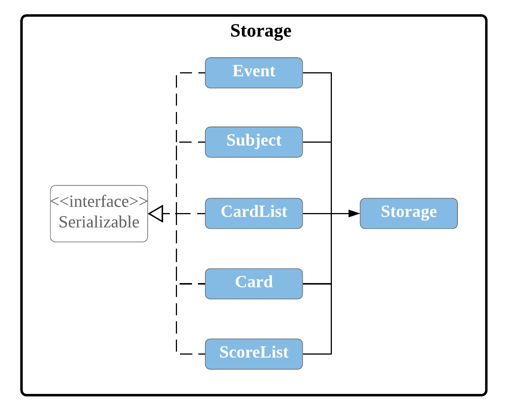
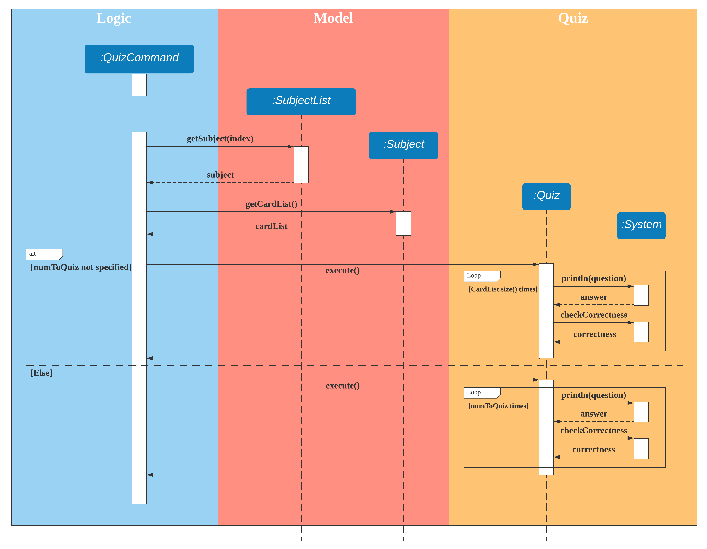
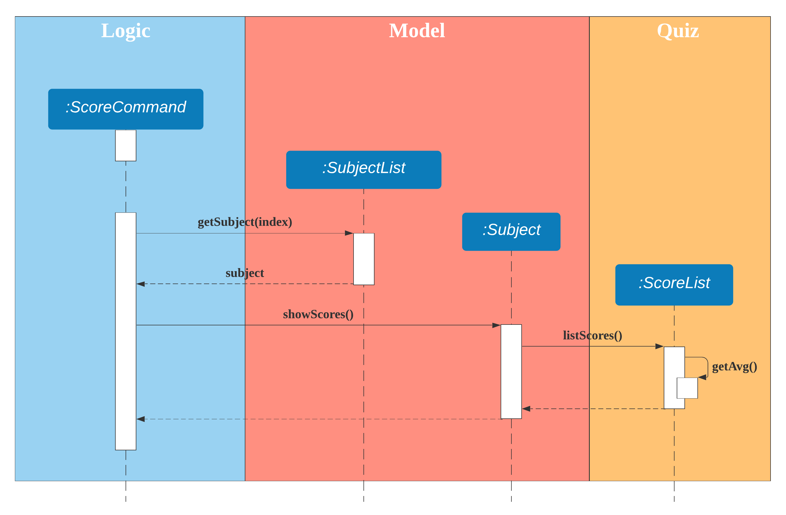
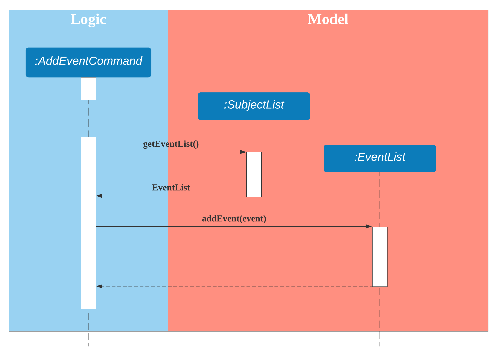
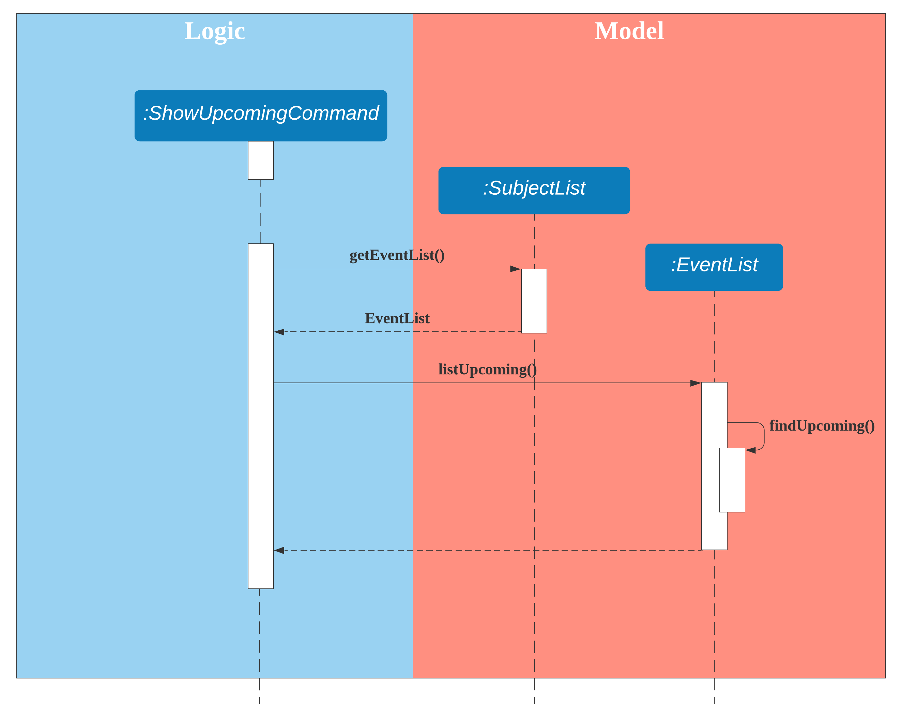
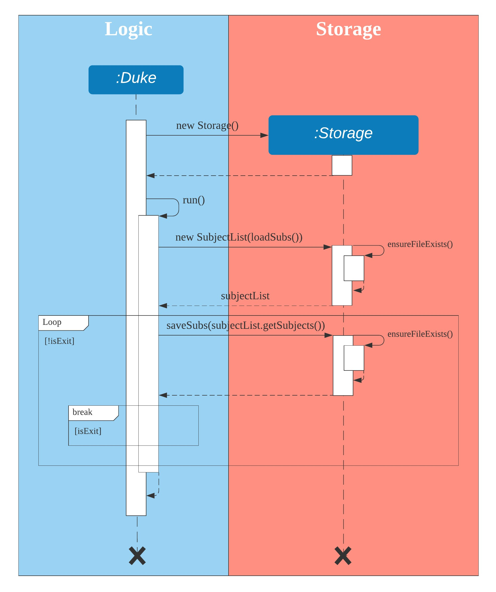

# Developer Guide
1.  [Design](#1-design)
2. [Implementation](#2-implementation)
 2.1. [Subject Feature](#21-subject-feature)
 2.2. [Quiz Feature](#22-quiz-feature)
 2.3. [Score Feature](#23-score-feature)
 2.4. [Event Management Feature](#24-event-management-feature)
 2.5. [Save/Load Feature](#25-saveload-feature)
3.  [Appendices](#3-appendices)
- [Appendix A: Product Scope](#appendix-a-product-scope)
- [Appendix B: User Stories](#appendix-b-user-stories)
- [Appendix C: Non-Functional Requirements](#appendix-c-non-functional-requirements)
- [Appendix D: Instructions for Manual Testing](#appendix-d-instructions-for-manual-testing)

## 1. Design
### Architecture
 

  
   Figure 1. Architecture Diagram  

The Duke class is the main class of the product. It is responsible for:
* At app launch: Initializes the components in the correct sequence, and connects them up with each other.
* At shut down: Shuts down the components.	

The product also contains the following components:
* Model
  * Cards: Holds the data in the type of Card and relative operations.
  * Subjects: Holds the data in the type of Subject and relative operations.
  * Score: Holds the data in the type of Score and relative operations.
  * Event: Holds the data in the type of Event and relative operations.
* Logic
  * Commands: Deals with user input and communicate CLI to relative methods.
  * Parser: Convert CLI inputs into command keywords.
* Storage
  * Deals with data management of the data entered by the user.
* UI
  * Deals with the input from the user and the output to the user.
* Quiz
  * Deals with selection of quiz questions and update of scores.  
* Exceptions
  * Deals with illegal inputs.

In these components, cards, subjects and events have similar structure. All of them contain a Card/Subject/Event class and CardList/SubjectList/EventList class.
Duke, along with all command classes and Parser, form the Logic box of the product.
 

  
   Figure 2. Class diagram of Logic component  

The flow of the Logic component is as follows:
1) Duke uses the Parser class to parse the command.
2) The corresponding Command object is created and passed to Duke.
3) The Command object is then executed by Duke.
 

  
   Figure 3. Sequence diagram of Logic component  

 The Logic box interacts with Model box, i.e. Card, CardList, Subject, SubjectList, Event, EventList, ScoreList.

- The SubjectList class contains an array the subjects and an eventList
- The Subject class contains details such as the subject name, a scoreList and a cardList.
- The EventList class contains an array of events.
- The Event class contains information about upcoming events.
- The ScoreList class contains an array of past scores of the quizzes which the user have completed.
- The CardList class contains an array of cards.
- The Card class contains both a question and an answer to the question.  
 

  
   Figure 4. Class diagram of Model component  

 Finally, the Storage box, i.e. Storage class will handle reading and writing of the contents to a file.
 The Storage component saves and loads the SubjectList objects using the Serializable interface.
 

  
   Figure 5. Class diagram of Storage component  

## 2. Implementation
### 2.1. Subject Feature
#### 2.1.1. Proposed Implementation
The subject feature is an extension to the existing flashcard feature, which allows users to categorise their
flashcards. This helps users to search for their flashcards more efficiently and also users to quiz by subject. The list of user's subjects are stored inside the SubjectList. It implements the following operations:

- ``SubjectList#addSubject()`` - Adds a new subject to the subject list.
- ``SubjectList#removeSubject()`` - Removes an existing subject from the subject list.
- ``SubjectList#listSubjects()`` - List the subjects in the subject list.

Step 1. Before the user decides to add a flashcard, he/she must first create a subject to store the flashcard, using
the command ``addsubject s/SUBJECTNAME``.
The following diagram describes how the add subject operation works:

 

  
   Figure 6. Sequence diagram for 'addsubject' command  

Step 2. The user executes the command ``listsubject`` to view the subjects currently stored in the application.

Step 3. Once the user has decided on a subject, he/she can execute the command ``addcard s/SUBJECTINDEX q/QUESTION a/ANSWER``
to add a flashcard into the subject. 

The following diagram describes how the add card operation works:
 

  
   Figure 7. Sequence diagram of 'addcard' command.  

#### 2.1.2. Design Considerations
##### Aspect: How a user can add a flashcard into a subject
- **Alternative 1 (current choice)**: Include the subject index in the command.
  - Pros: 
    - Simple implementation without involving states.
  - Cons: 
    - The user will have to list the subjects first to determine the subject index.
  
- **Alternative 2**: Select the subject first, then add a flashcard.
  - Pros:
    - The command for adding a card will be shorter.
  - Cons:
    - Multiple states will be involved.
    - The application will become more complex as different states use different commands.
    - The application can also become more difficult to use as users may be unclear about the states.

### 2.2. Quiz Feature
#### 2.2.1. Implementation
The quiz feature incorporates random testing, and builds upon the subject feature to allow users to set how many questions to quiz for a selected subject. 
This allows users to quiz by subject, and get a score at the end of each quiz. 

As of the current version, the quiz feature does not support automatic marking, and the user will have to mark their 
own answers for each question. Automatic marking may be added in future versions.

The quiz feature implements the following operations:

- ``Quiz#quizQuestion()`` - Outputs a random question to the user that has not been tested before in this quiz session.
- ``Quiz#quizNext()`` - Retrieves a random question from the available questions for that subject.
- ``Quiz#markCorrectness()`` - Marks the user's answer as correct or wrong based on user's judgement.

Given below is an example usage scenario and how the quiz mechanism behaves at each step.

Step 1. Before the user decides to start a quiz, he/she has to create a subject using the command
 ``addsubject s/SUBJECTNAME``, and add flashcards to that subject using the command ``addcard s/SUBJECTINDEX q/QUESTION a/ANSWER``.

Step 2. The user can start a quiz by indicating a subject and the number of questions to quiz using the command
``quiz s/SUBJECTINDEX n/NUMBERTOQUIZ``. If the number of questions to quiz is not specified (e.g. if ``quiz s/SUBJECTINDEX`` is entered)
, all the questions stored in that subject will be quizzed.

The following diagram describes how the quiz operation works:

 

  
   Figure 8. Sequence diagram of 'quiz' command.  

Step 3: The quiz will end upon completion of the specified number of questions, or by stopping the quiz using the
command ``exitquiz``.

#### 2.2.2. Design Considerations
##### Aspect: How the answers are marked for correctness
- **Alternative 1 (current choice)**: Display the correct answer after the user has submitted his answer, and prompt
the user to indicate if his answer is correct or wrong.
  - Pros: 
    - Allows the user to input open-ended questions with open-ended answers.
    - Ensures that all answers will be marked accurately.
  - Cons: 
    - The quiz will be slower for the user as they will have to input an extra input every answer.
  
- **Alternative 2**: Automatically mark answers submitted by the user by matching it with the correct stored answer.
  - Pros:
    - The user will not need to type any extra inputs, and the quiz process will be shorter.
  - Cons:
    - The user will be restricted to adding short-answer questions without open-ended answers.
    - There will be a high probability of inaccurate marking due to factors such as typographical errors or difference in phrasing answers.

##### Aspect: How the user can control how many questions to be quizzed
- **Alternative 1**: Always quiz all stored questions for that subject, but allow users to stop the quiz whenever they want.
  - Pros: 
    - Simple implementation.
  - Cons: 
    - The user will have to keep track of how many questions he has already done.
  
- **Alternative 2 (current choice)**: Allow the user to both set the number of questions to quiz and to stop the quiz halfway.
  - Pros:
    - More flexibility for the user.
  - Cons:
    - More complex implementation.
    - The user has to type in a longer command to start a quiz, or they will be quizzed with all questions by default.
    
### 2.3. Score Feature
#### 2.3.1. Implementation
The score feature builds on the quiz feature, storing the score for each quiz session in a ScoreList. 
This allows users to see all past scores and track any improvements. It implements the following operations:

- ``Subject#showScores()`` - Shows all scores and the average score from all quiz sessions for that subject, in chronological order.
- ``ScoreList#getAvg()`` - Calculates the average score for all scores in the ScoreList.
- ``ScoreList#listScores()`` - Lists out all scores in the ScoreList.

Given below is an example usage scenario and how the score mechanism behaves at each step.

Step 1. Before the user can view his scores for a particular subject, he first needs to have done at least one quiz
session for that subject using the command ``quiz s/SUBJECTINDEX n/NUMBERTOQUIZ``.

Step 2. The user can view the score history and average score of a selected subject, if he has done at least one
quiz session for that subject, using the command ``score s/SUBJECTINDEX``.

The following diagram describes how the score operation works:

 

  
   Figure 9. Sequence diagram of 'score' command  

#### 2.3.2. Design Considerations
##### Aspect: How to format the score history shown to the user
- **Alternative 1 (current choice)**: Show all scores in chronological order, and in the percentage of number of correct answers divided by the number of
 questions asked (i.e. mathematically: Correct answers/Asked questions). Also show the average percentage score of all the scores.
  - Pros: 
    - Users can easily keep track of their progress and see if they have been improving.
    - A percentage score allows users to compare quiz results even if a different amount of questions were chosen to be quizzed in the quiz sessions.
  - Cons: 
    - More complex implementation.
    - If the user attempts the quiz many times, showing every quiz score may clutter the UI, and might be too much
    information for the user to take in.
  
- **Alternative 2**: Show just the average score, and number of attempts taken.
  - Pros:
    - Clean UI, no clutter.
    - Simple implementation.
  - Cons:
    - User will be unable to track his progress.
    
### 2.4. Event Management Feature
#### 2.4.1 Implementation
The event feature builds on the program feature by aiding the user when preparing for an exam or keeping track of events.
This feature allows the user to add and keep track of upcoming events, such as exams/tests. It implements the following operations:

- ``SubjectList#addEvent()`` - Adds a new event.
- ``SubjectList#removeEvent()`` - Removes an existing event.
- ``SubjectList#listEvents()`` - List all events in the order they were added.
- ``SubjectList#showUpcoming()`` - Shows upcoming events in chronological order.

Given below is an example usage scenario and how the event mechanism behaves at each step.

Step 1. Before the user can manage his/her events, he/she needs to first add events using the
 command ``addevent e/DESCRIPTION d/DATE``.
 
The following diagram describes how the add event operation works:

 

  
   Figure 10. Sequence diagram of 'addevent' command  

Step 2. The user executes the command ``listevent`` to view the events currently stored in the application.

Step 3. The user can then execute the command ``showupcoming d/DAYS`` to show events that are upcoming within ``DAYS``
number of days.

The following diagram describes how the show upcoming operation works:

 

  
    Figure 11. Sequence diagram of 'showupcoming' command  

#### 2.4.2. Design Considerations
##### Aspect: How to implement addition and management of events
- **Alternative 1 (current choice)**: Allow the user to store any type of event (does not have to be a test/exam, and
does not have to be tied to a pre-existing subject).
  - Pros: 
    - More flexibility for the user to add any upcoming events that he needs to keep track of.
    - The user can keep track of any upcoming exams that do not belong to any of the subjects stored in the app.
  - Cons: 
    - The user is unable to sort his exam/event by subjects.
  
- **Alternative 2**: Only allow the user to add exams, and only to pre-existing subjects already in the app.
  - Pros:
    - The user is able to sort his exam/event by subjects.
  - Cons:
    - The user does not have the flexibility to add anything other than exams for subjects that have been created.
    
### 2.5. Save/Load Feature
#### 2.5.1 Implementation
The save/load process is facilitated with the `java.io.Serializable` interface, which converts the given object to a byte stream and back.
Writing and reading from the file uses the `java.io.FileOutputStream` and `java.io.FileInputStream` classes respectively.

The choice of the `java.io.Serializable` interface as a save/load function is because it maintains the object structure. 
In addition, the implementation of the interface is easy and simple to understand as does not require much code, and does not require manipulation of raw data. 
This ensures that it is easy to modify the Storage methods if other elements/objects are added to the structure.

To serialize the object to be written to file via `java.io.FileOutputStream`, it makes use of the `java.io.ObjectOutputStream#writeObject` method.
To deserialize the object after being read from file via `java.io.FileInputStream`, it uses the `java.io.ObjectInputStream#readObject()` method.

The Storage feature implements the following operations:
* `Storage#loadSubs()` - Reads the preexisting session from file.
* `Storage#saveSubs()` - Writes and saves the current session to file.
These operations are executed automatically by the program and do not require user interaction.

`Storage#loadSubs()` is run on initialisation of the program. 
It first checks if there is a preexisting saved file:
* If there is a save file, the previous session is loaded into the program.
* If there is no save file, a new save file is created and the default structure is initialised.

`Storage#saveSubs()` is run after every command execution. 
This ensures that if the program is force-exited or suddenly crashes, the last instruction has been saved.
Once run, it will first check if the save file exists, in the event that the file has been deleted during the program. 
If so, it will create the file, then the method will continue on to save the latest SubjectList structure into the save file. 

 

  
    Figure 12. Sequence diagram of Storage class  

## 3. Appendices
## Appendix A: Product Scope
### Target User Profile
The product is intended for students preparing for exams. Students can store practice question and model answers in the product.
Also, the product offers students to quiz themselves to practice for exams.

### Value Proposition
The product aims to provide students with more convenient way of doing revision. 
By using the product students can categorize questions into different subjects and practice more effectively.
As such, in release v2.1, after adding the cards the user is unable to view the answers when listing cards.
This feature may be improved on in later releases. 

## Appendix B: User Stories

|Version| As a ... | I want to ... | So that I can ...|
|--------|----------|---------------|------------------|
|v1.0|user|add new cards|view cards and answers to revise|
|v1.0|user|delete cards|organize cards better|
|v1.0|user|quiz myself|practice the questions|
|v1.0|user|list cards|organize the cards|
|v1.0|user|save my cards|access them in the future|
|v2.0|user|add cards with subjects|categorize the cards better|
|v2.0|user|list cards by subjects|organize the cards|
|v2.0|user|delete subjects|organize subjects better|
|v2.0|user|view my score|see how I performed|
|v2.0|user|view my test history|see how I performed|
|v2.1|user|add upcoming event dates|know what to prepare|
|v2.1|user|delete upcoming event dates|no longer have reminders of the events|
|v2.1|user|edit the cards|change the mistakes done when adding|

## Appendix C: Non-Functional Requirements
1. The product should be able to run on any platform that has JDK11
2. The product should be able to hold up to 1000 cards
3. The product should be able to store up to 1000 events

## Appendix D: Instructions for Manual Testing
### Running Tests

Method : Using IntelliJ JUnit test runner
* To run all tests, right-click on the src/test/java/seedu folder to select the part to be tested and run as JUnit in IDE.

Method : Using the text-ui-test runtest.bat or runtest.sh script
* Before running the script, ensure that the data folder found in tp/build/libs is deleted. This is in the event that the user intends to run the script multiple times for checking. 
* Failure to do so will result in the test to fail due to change in behaviour when duplicates are added.

### Types of Tests
There have two types of tests:

Unit tests targeting the lowest level methods/classes.
* e.g. seedu.cards.CardTest

Integration tests that are checking the integration of multiple code units (those code units are assumed to be working).
* e.g. seedu.cards.CardListTest
