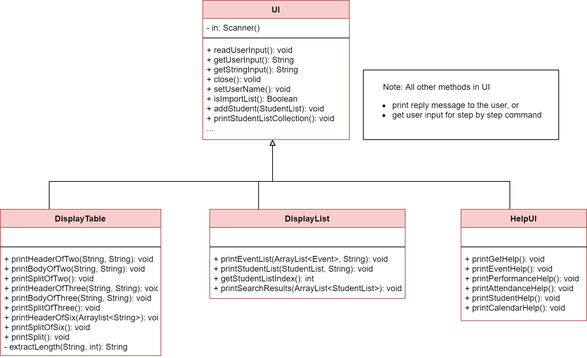

# Developer Guide
## Table of Contents
### Target user profile
Our target audiences are professors who need help organizing their personal work schedule and need more time.
The professors are pressed for time and they require a simple software to organize their monthly events
and keep track of their students' attendance and performance. 

### Value proposition
Our application will reduce the stress of the professor by allowing them to easily enter and store
their work schedule as well as their students' records. After storing the data, the Professor can have
quick access to the information in either a list or a calendar view. 

### Audience 
The design documentation is in general for anyone who wants to understand the system architecture and design of 
PAC. The following groups are in particular the intended audience of the document.
- PAC project managers
- PAC developers
- PAC software testers

## Architecture
This section presents the architecture of PAC. It explains the architecture of main components of PAC.

### Overall Architecture
*Overall Class diagram*
{To be added in future revisions}

### Command
         
*Class diagram of the Command component*  

Commands are the main classes to be executed in PAC. All of the specific Command classes inherit the 
base Command abstract class, and utilize its abstract execute() method.  
A subclass of Command is created and executed when the professor input a corresponding command.
 
### Parser
*Class diagram of the Parser component*  
There are total of four Parser classes as shown below. Each Parser class correspond to a feature 
of PAC. 

| Parser                    | Created in                                                    |
|---------------------------|---------------------------------------------------------------|
| EventParser               | EventCommandInterpreter                                       | 
| CalenderParser            | EventCommandInterpreter                                       | 
| AttendanceParser          | Step-by-step command at Attendance-related command classes    |
| PerformanceParser         | Step-by-step command at performance-related command classes   |  

A Parser class is created when a user input contains data to be stored or used in certain features.    

### UI
                
*Class diagram of the UI component*   

UI is the main class handles user display, which includes reading user input and printing information 
back to the user on command-line.  
Besides the normal command line messages, there are two subclasses of UI: 
DisplayList and DisplayTable, to specifically print the list and table interface to professor. 

## Feature Design and Implementation 
### Event
           
*Class diagram of the Event component*

1. When a user enters an event-related command, the command is analysed by `EventCommandInterpreter`. 
1. Once determined, the relevant information (e.g. index, name, time, date, venue) are extracted by 
`EventParser`.
1. Then, the relevant class that corresponds to the command is created, with the information extracted 
from the previous step passed into it. It modifies `Event` or `EventList`.
1. These commands are then returned to `Duke.run()` to `execute()`. 

Note that:
* `datetime` is stored as a single attribute in `Event` class, but it is exposed to user as `date` 
and `time`, which corresponds to `d/` and `t/` flag respectively.
* `editDate` or `editTime` commands are not available. Only `editDateTime` is available to change the 
`date` and/or `time` of an `Event` object.
* `delete(Event)` method is currently not in use, but can be used to implement delete by event name, 
either by complete match, or fuzzy match.
* Any classes (e.g. `Seminar`) that inherit from `Event` class will have similar control flow. 

### Attendance
        
*Class diagram of the Attendance component*
1. When a user enters an attendance-related command, the command is analysed by `AttendanceCommandInterpreter`. 
1. Once determined, the relevant class that corresponds to the type of command is created.
1. Then, the class will execute base on its function. It modifies `AttendanceList`.
1. These commands are then returned to `Duke.run()` to `execute()`. 

Note that:
* `attendance add` command requires a line-by-line insertion of the student attendance data. 
The user is given an option to either use an existing list stored under StudentListCollection or
create a new attendance list. `n/` and `p/` flags are used to insert new attendance.

### Performance
     
*Class diagram of the Performance component*  
1. When a user enters a performance-related command, the command is analysed by `PerformanceCommandInterpreter`. 
1. Once determined, the relevant class that corresponds to the command is created (e.g. AddPerformance, 
DeletePerformance...), and ask for relevant information (e.g. event name, student name, student result) from the user. 
1. Then, with the information extracted from the previous step passed into it. It modifies PerformanceList` under
the event class correspond to the input event name.
1. These commands are then returned to `Duke.run()` to `execute()`. 

Note that:
* All PerformanceList class should be created under an Event class. A PerformanceList class cannot exist 
by its own. 
* All Performance commands are line-by-line commands. This aims to assist the user with correct command format and
prevent time wasted on key in wrong commands. 

### Student List Collection
     
*Class diagram of the Student component*  
1. When a user enters an studentList-related command, the command is analysed by `StudentCommandInterpreter`. 
1. Once determined, the relevant class that corresponds to the type of command is created.
1. Then, the class will execute base on its function. It modifies `AttendanceList`.
1. These commands are then returned to `Duke.run()` to `execute()`. 

Note that:
* studentList-related commands can be executed without the existence of events.

## User Stories

|Version| As a ... | I want to ... | So that I can ...|
|--------|----------|---------------|------------------|
|v1.0|professor|add new events|creating new events|
|v1.0|professor|delete existing events|delete unnecessary events|
|v1.0|professor|add new attendance list|create new attendance list to be added to events|
|v1.0|professor|delete existing attendance list|delete unnecessary attendance list|
|v1.0|professor|add new performance list|create new performance list to be added to events|
|v1.0|professor|delete existing performance list|delete unnecessary performance list|
|v1.0|professor|add date and time to my events|organize my events|
|v1.0|professor|edit my events|update my existing events|
|v2.0|professor|create a student list|link existing student list to performance list or attendance list|
|v2.0|professor|Create repeatable events without having the need to manually add in|easily create occurring events|
|v2.0|professor|find an event by name|locate an event without having to go through the entire list|

## Non-Functional Requirements

{Give non-functional requirements}
{To be added in future revisions}

## Glossary

* *flag* - anything that takes the form of  `?/`, e.g. `n/`, `i/`

## Instructions for Manual Testing

{Give instructions on how to do a manual product testing e.g., how to load sample data to be used for testing}
{To be added in future revisions}
