# WhenFree - Developer Guide
By: `AY1920S2-CS2113T-T12-1`

## Table of Contents
* [1. Setting up](#1-setting-up)
    * [1.1. Prerequites](#11-Prerequisites)
    * [1.2. Setting up project](#12-Setting-up-project)
    * [1.3. Verifying setup](#13-Verifying-setup)
* [2. Design](#2-design)
	* [2.1. Architecture](#21-architecture)
	* [2.2. UI component](#22-ui-component)
	* [2.3. Logic component](#23-logic-component)
	* [2.4. Model component](#24-model-component)
	* [2.5. Storage component](#25-storage-component)
	* [2.6. Common component](#26-common-component)
* [3. Implementation](#3-implementation)
	* [3.1. Add new contact](#31-add-new-contact)
	* [3.2. List all contacts](#32-list-all-contacts)
	* [3.3. Display timetable of selected contacts](#33-display-timetable-of-selected-contacts)
	* [3.4. Schedule a new meeting](#34-schedule-a-new-meeting)
	* [3.5. Edit a contact's timetable](#35-edit-a-contacts-timetable)
	* [3.6. Delete a scheduled meeting](#36-delete-a-scheduled-meeting)
	* [3.7. Delete a contact](#37-delete-a-contact)
	* [3.8. List all scheduled meetings](#38-list-all-scheduled-meetings)
* [Appendix A: Product Scope](#appendix-a-product-scope)
	* [A.1. Target user profile](#a1-target-user-profile)
	* [A.2. Value proposition](#a2-value-proposition)
* [Appendix B: User Stories](#appendix-b-user-stories)
* [Appendix C: Use Cases](#appendix-c-use-cases)
* [Appendix D: Non-Functional Requirements](#appendix-d-non-functional-requirements)
* [Appendix E: Glossary](#appendix-e-glossary)
* [Appendix F: Instructions for Manual Testing](#appendix-f-instructions-for-manual-testing)
	* [F.1. Launch and Shutdown](#f1-launch-and-shutdown)
	* [F.2. Setting up profile](#f2-setting-up-profile)
	* [F.3. Scheduling a meeting](#f3-scheduling-a-meeting)
	* [F.4. Deleting a meeting](#f4-deleting-a-meeting)
	* [F.5. Deleting a contact](#f5-deleting-a-contact)
	* [F.6. Editing a schedule](#f6-editing-a-schedule)
	* [F.7. Saving data](#f7-saving-data)

## 1. Setting up
### 1.1 Prerequisites<br>
1. Ensure Java Development Kit(JDK) is 11 or above.
2. IDE of your choice. <br>
    > :bulb: We recommend IntelliJ IDE since this project is built upon the features of IntelliJ
3. The setting up of this project would assume that Intellij IDE is your preferred choice of IDE.

### 1.2 Setting up project<br>
1. Fork this repository and ```git clone``` it onto your computer.
2. Open Intellij (if you are not in the welcome screen, click File > Close Project to close the existing project dialog first)
3. Set up the correct JDK version
    1. Click Configure > Structure for New Projects and then Project Settings > Project > Project SDK
    2. If JDK 11 is listed in the drop down, select it. If it is not, click New... and select the directory where you installed JDK 11
    3. Click OK
    4. Click Import Project
    > :information_source:  IMPORTANT: Locate the build.gradle file in the project directory, select it, and click OK

### 1.3 Verifying Setup
1. Open ```Gradle``` from the vertical right tabs and type ```gradle run``` to build the project.
2. Try out a few commands as shown on the CLI menu.

[&#8593; Return to Table of Contents](#table-of-contents)

<br/>

## 2. Design

### 2.1. Architecture
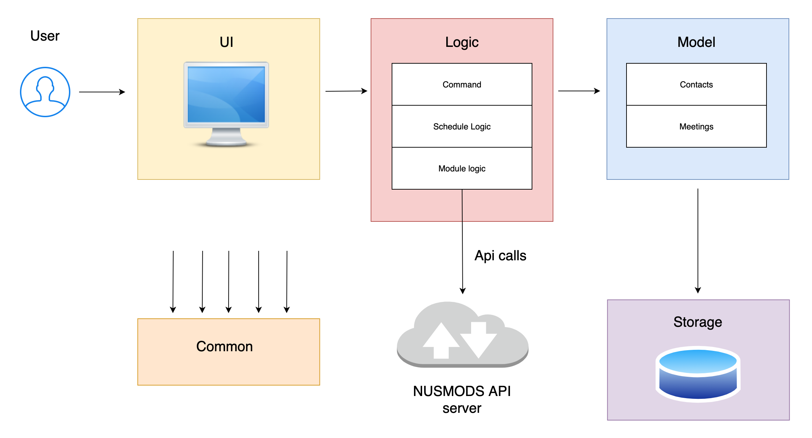<br>
*Fig 1. Architecture diagram of the WhenFree application*

Fig 1. shows the high-level design of the WhenFree application. WhenFree
adopts an n-tier style architecture where higher layers make use of the services provided by the lower layers.
Here is a quick overview of each layer/component and the sub-components residing in it.
* UI: The Command Line user interface of the application.
* Commons: A collection of classes containing constants such as messages for ```common.exception```, modules that cannot be formatted, etc.
* Logic: The main control unit of the application which handles the business logic of the application.
* Model: Holds the data of the application in memory to be easily accessed by methods that requires it.
* Storage: Writes data from Model component to hard disk, and reads previously saved data from hard disk into Model component.

### 2.2. UI component
The UI component represents the Command Line user interface of the application. It serves the purpose of facilitating the 
usage of the application and providing information requested by the user.

The UI component consists of the `TextUI` class. `TextUI` is called by 2 classes, `WhenFree` and `CommandHandler` to print
messages in the user's console. 

`TextUI` is called by the main class `WhenFree` which runs the application, to display the welcome message, menu message and exit message. 
These messages enhances the usability rather than the functionality of the application.

`TextUI` is also called by the `CommandHandler` class which interprets user input and initializes the execution of commands. 
`TextUI` displays messages that indicate the successful execution of a command. Importantly, these messages include requested information by commands such as [List all contacts](#32-list-all-contacts), [List all scheduled meetings](#38-list-all-scheduled-meetings) and [Display timetable of selected commands](#33-display-timetable-of-selected-contacts),
which are key to the functionality of the application. The implementation of these 3 features whose functionality involves the `TextUI` class are described in Section 3 below.

Additionally, `TextUI` is called by both `WhenFree` and `CommandHandler` classes to display error messages when exceptions are caught.

### 2.3. Logic component


*Fig 2. Overview of Logic component*

Fig 2. shows an overview of the Logic component. The ```LogicManager``` class is the brain and backbone of the logic component. It depends on 3 sub-components: ```schedulelogic``` ```modulelogic``` ```command```.

First, ```command``` sub-component interprets and initializes user commands. 
Afterwards, LogicManager instantiates```schedulelogic``` and ```modulelogic``` sub-components via ```CommandHandler``` to enable the generation of common time slots from NUSMODS links.
LogicManager forms a whole-part relationship with the classes in the Model component, mainly ```ContactList``` and ```MeetingList``` where all the data generated from user commands would be stored. Besides, ```LogicManager``` also stores a ```mainUser:Contact``` containing the user's timetable
which is used to store scheduled meetings.


#### 2.3.1. logic.commands component
The ```commands``` component interprets the user command and call the ```modulelogic``` and ```schedulelogic``` components to execute the commands.
The ```commands``` consists of the class ```CommandHandler```.


#### 2.3.2. logic.modulelogic component

The modulelogic component retrives modules and module information from NUSMODS links.
The modulelogic component consists of 4 classes: ```TimetableParser``` ```ModuleApiParser``` ```ModuleHandler``` ```LessonsGenerator```.

1. ```LessonsGenerator``` uses the ```TimetableParser``` class to acquire the modules a user is taking, including the timeslots of those modules.
2. ```LessonsGenerator``` also uses ```Modulehandler``` to retrieve a set of information related to a specific module.
3. With both information, ```LessonsGenerator``` is able to dynamically generate the user's time-slots stored in ```ArrayList<String[]>``` via a series of Key-Value pair hashing.
4. ```Arraylist<String[]> ``` contains the start/end time, days and weeks of all modules the user is taking.
<br>

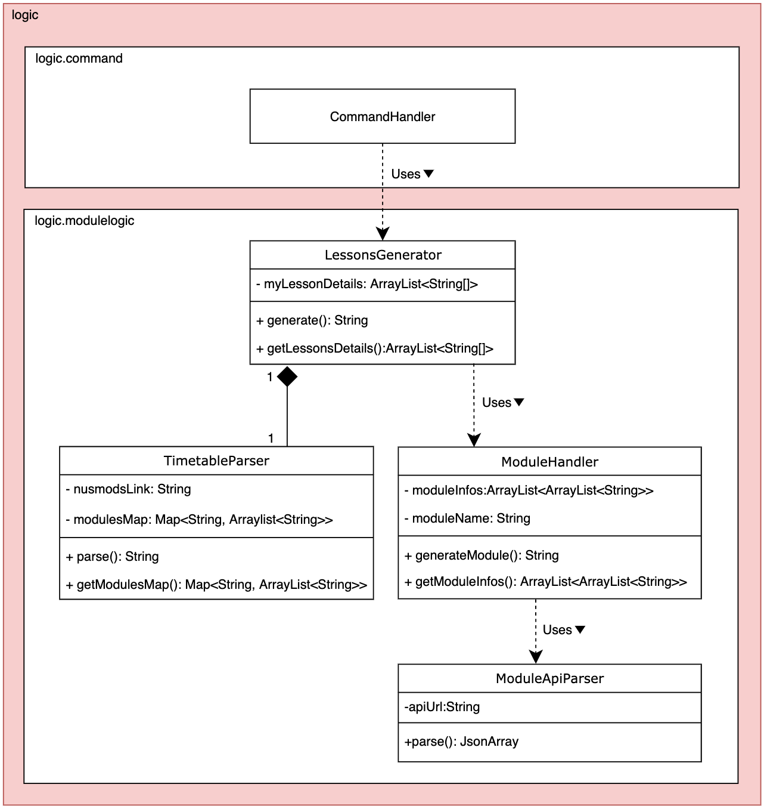

*Fig 3. Class diagram of the logic.modulelogic component*

Fig 3. shows the interaction between the 4 classes in ```logic.modulelogic``` sub-component whenever a new user keys in his/her NUSMODS link.
1. ```ModuleApiParser``` controls the API fetching logic and instantiates a HTTP GET request object to fetch a Json object from the open-sourced NUSMOD API server via ```parse()```
2. ```ModuleApiParser ``` is called by ```ModuleHandler``` every time a new module is requested.
4. Subsequently, ```ModuleHandler``` would clean the data and filter out any blacklisted modules provided by ```ModuleApiParser```, and stores the information into an ```ArrayList<ArrayList<String>>``` data structure to be used by ```LessonsGenerator```.
   Blacklisted modules are filtered out based on the data from ```common.BlacklistedModule```. 
3. Next, ```TimetableParser``` fetches the module information a user is currently taking from his/her timetable link via ```parse()```. ```parse()``` and ```parseModule()```  makes use of regex to sift through timetable link provided by user in the form of ```String``` object and stores
the information in a ```Map<String, ArrayList<String>>``` data structure as seen from the figure. 
4. This sub-component also depends on the ```common.Messages``` class to provide the exception message when an incorrect link is being parsed.<br>


*Fig 4. Sequence diagram of the logic.modulelogic component*

Fig 4. shows an overview of the UML sequence of the entire logic.modulelogic component.<br>

```LessonsGenerator``` collates the returned data structure from both ```ModuleHandler``` and ```TimetableParser```, calling```.lessonsChecker()``` simultaneously to create a set of information containing the start-time, end-time, day, weeks of the modules that a user is taking.
 
The information returned from ```LessonsGenerator``` would then be used in ```Command``` component.
 
#### 2.3.3. logic.schedulelogic component

The purpose of the ```schedulelogic``` component is to put together several ```Contact```s' schedules into a combined schedule. 
The ```schedulelogic``` component is used by the [`Display timetable of selected contacts`](#33-Display-timetable-of-selected-contacts) 
feature to obtain a combined schedule of selected ```Contact```s.

The ```schedulelogic``` component consists of the class ```ScheduleHandler```. The key interactions of `ScheduleHandler ` 
with 2 classes, ```CommandHandler``` and ```Contact```, are explained in the class 
diagram and description below.


*Fig 5. Class diagram of the logic.schedulelogic component*

A `ScheduleHandler` object can be created by the `CommandHandler` class with the `ScheduleHandler()` constructor, and is passed an ArrayList of `Contact`s.

The `ScheduleHandler` object retrieves the schedule of each `Contact` using `Contact#getMySchedule()`, and uses the retrieved 
schedule to fill up its private class variable, combinedSchedule. `CommandHandler` can retrieve the combined schedule generated 
by the `ScheduleHandler` object by calling `ScheduleHandler#getCombinedSchedule()`.

[Section 3.3](#3-implementation) below explains in detail how the ```schedulelogic``` component is used in the 
implementation of the [`Display timetable of selected contacts`](#33-display-timetable-of-selected-contacts) feature.
<br>

### 2.4. Model component


*Fig 6. Overview diagram of the Model component*

The ```model``` component holds data generated in the application in memory. The data can be accessed by methods that require
it when the application is running. The model component contains 2 sub-components: ```meetings``` and ```contacts```.

#### 2.4.1. model.meetings component
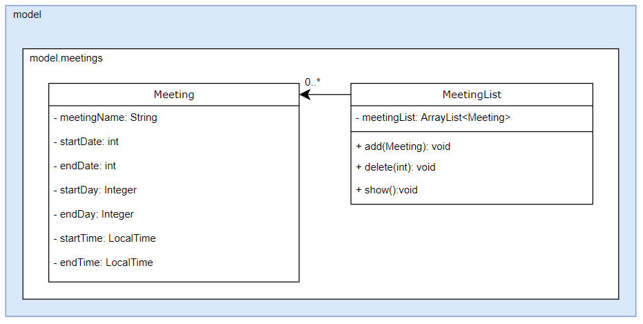

*Fig 7. Class diagram of the model.meetings component*

The ```meetings``` component of our application consists of 2 classes: ```Meeting``` and ```MeetingList```.

1. ```Meeting``` is used to represent a meeting that the user has scheduled. It contains the name, start and end date, day and time of the meeting. It also contains getter methods, not shown in the diagram, which are used to access its attributes.
2. ```MeetingList``` is used to store a list of all meetings. It contains a ```ArrayList<Meeting>``` which is updated every time the user adds or deletes a meeting. There are also getter methods not shown in the diagram.
<br>

#### 2.4.2. model.contacts component


*Fig 8. Class diagram of the model.contacts component*

The ```contacts``` component of our application consists of 2 classes: ```Contact``` and ```ContactList```.

1. ```Contact``` consists of information of a member's name and schedule.
    * The information of a contact's schedule is stored in blocks of 30 minutes interval for 13 weeks and 7 days a week.
    * By default, the first ```Contact``` added will be the main user of the application.
    * It contains logic to convert time into 30-minute blocks for easy processing and check if a slot is valid for scheduling a meeting or editing.
    * It also contains a private class ```Slot```, not shown in the diagram, used exclusively by ```Contact```. ```Slot``` contains information about a time slot and contains logic to convert its attributes.
2. ```ContactList``` is a ```ArrayList<Contact>``` which new ```Contact``` are added to. It also contains getter methods not shown in the diagram.

### 2.5. Storage component

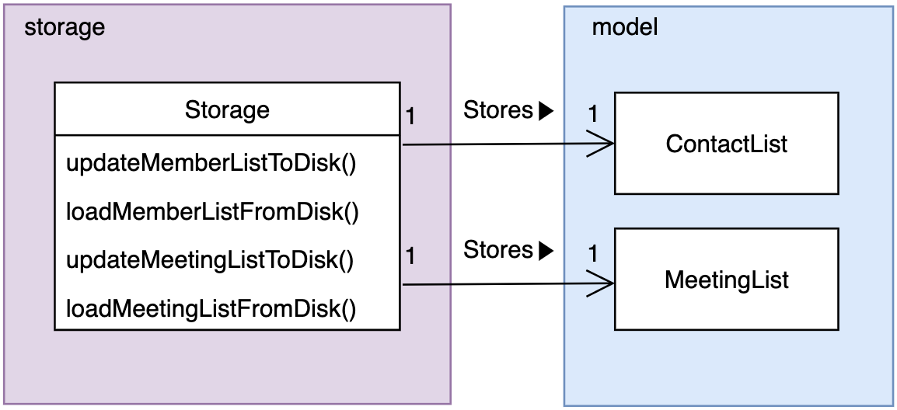

*Fig 9. Class diagram of the storage component*

Fig 9. shows the structure of Storage. It is created by WhenFree class to handle the loading and saving of scheduled meetings and member schedules.

The `Storage` component,
- can save `Contact` objects in .txt format and read it back.
- can save scheduled meetings in .txt format and read it back.

### 2.6. Common component
Classes used by multiple components are in the ```commons``` package. These includes exception classes, information of 
blacklisted modules as well as output messages to be shown to users when exception occurs.

[&#8593; Return to Table of Contents](#table-of-contents)

<br/>

## 3. Implementation
This section describes how the main features of our application are implemented.

There are 6 main features: [Add new contact](#31-add-new-contact), [List all contacts](#32-list-all-contacts), [Display timetable of selected contacts](#33-display-timetable-of-selected-contacts), [Schedule a new meeting](#34-schedule-a-new-meeting), [Edit a contact's timetable](#35-edit-a-contacts-timetable), [Delete a scheduled meeting](#36-delete-a-scheduled-meeting), [Delete a contact](#37-delete-a-contact) and [List all scheduled meetings](#38-list-all-scheduled-meetings).

### 3.1 Add new contact
<br>
*Fig 10. Sequence diagram of the implementation of the `Add new contact` feature*

Fig 10. shows the sequence diagram of how a new contact is added.

Given below is an example usage scenario of the `Add new contact` feature.

1. The user running the application invokes the ```LogicManager``` by typing ```name nusmodslink```, followed by kbd:[enter] key.
2. ```LogicManager```would then request for a new contact by calling ```CommandHandler```.
3. ```CommandHandler``` would call ```generate()``` on ```LessonsGenerator``` to retrieve the lesson's start/end time, start/end day, and the number of weeks the lesson is held.
4. ```CommandHandler``` would also instantiate a new ```Contact``` and append the busy slots that were previously generated by ```generate()```.
5. Subsequently, control would be shifted back to ```LogicManager``` where the new ```Contact``` would be returned by ```CommandHandler```.
6. ```LogicManager``` checks if the ```Contact``` is a main user and calls ```setMainUser()``` accordingly.
7. The final procedure is to append the new ```Contact``` into ```ContactList``` found in the ```model``` component.

#### 3.1.1 Design Considerations
**Aspect 1: Optimizing fetching of module information**
* Alternative 1(current choice): Instantiate a ```ModuleHandler``` every time there's a request for a module information. <br>
Pros: The classes are intuitively separated and data structures returned is understandable. <br>
Cons: Program runs slower for every extra timetable or extra modules taken since its a new instantiation of a ```ModuleHandler```. <br>
* Alternative 2: Instantiate ```ModuleHandler``` once for every user.  <br>
Pros: Takes up less memory and setup time for every timetable provided compared to alternative 1. <br>
Cons: The data structure returned by ```ModuleHandler``` would be complicated and confusing for new developers. <br>

**Aspect 2: Ways of storing blacklisted module**
* Alternative 1(current choice): Create a ```common.BlacklistedModule``` and hash every hard-coded blacklisted module as a constant ```HashSet```.
    1. **Pros**: There is no need for user to download the blacklisted module, and only the JAR file is required to run this entire application. <br>
Also, user do not need to have a one time set-up where they would wait several minutes for the application to dynamically pull the blacklisted modules from Nusmods API server. <br>
    2. **Cons**: If the blacklisted modules from Nusmods API gets updated to the conventional 13 weeks programme, developers would have to manually delete the information of those modules from
        the blacklist, resulting in time wasted everytime there's an update to module information. <br>
* Alternative 2: Dynamically pull the data from Nusmods API server once when user starts the application to retrieve the blacklisted modules, and then periodically update the 
blacklisted modules every semester. <br>
    1. **Pros**: The blacklisted modules would be up to date and there is no need for developers to manually edit the ```common.BlacklistedModule``` class. <br>
    2. **Cons**: The one-time set up of pulling the data is very time consuming(~2 minutes waiting time), resulting is bad user experience. <br>
* Alternative 3: Requires user to download the list of blacklisted modules in addition to the JAR file. <br>
    1. **Pros**: User do not have to wait for the one-time set up and the file would be up to date as long as the application is not deprecated.
    2. **Cons**: Developers would still have to run the method to dynamically pull the blacklisted modules, although it would be less prone to mistake caused by editing the hard-coded blacklist as mentioned in
       Alternative 1. Furthermore, users are required to download the blacklisted file published by the developers every semester in order for the list to be up-to-date.
* Ultimately we decided to go with **Alternative 1** since it is the most user-friendly as our targeted users do not have to download another file and just downloading the jar would do. On the developer side, updates would still be required every semester, but our focus is to make the application as user-centric as possible.

### 3.2 List all contacts
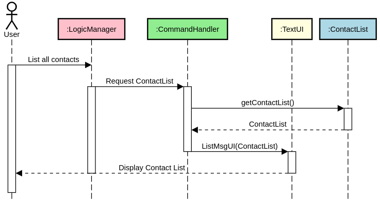<br>
*Fig 11. Sequence diagram of the implementation of the `List all contacts` feature*

Fig 11. shows the sequence diagram of listing all contacts saved in the application. 
It consists of 4 classes:```LogicManager Commandhandler TextUI ContactList``` .

Given below is an example usage scenario of the ```List all contacts``` feature.

1. The user invokes the LogicManager by typing ```contacts```, followed by kbd:[enter] key.
2. The ```LogicManager``` would then request to list all contacts via ```CommandHandler```.
3. The ```CommandHandler``` would call ```getContactList()``` on ```ContactList``` from storage and then using the ContactList retrieved, it then calls ```ListMsgUI()``` from ```TextUI``` class.
4. The result is that ```TextUI``` would return a ```System.out.println``` of all the contacts the user have.


### 3.3 Display timetable of selected contacts
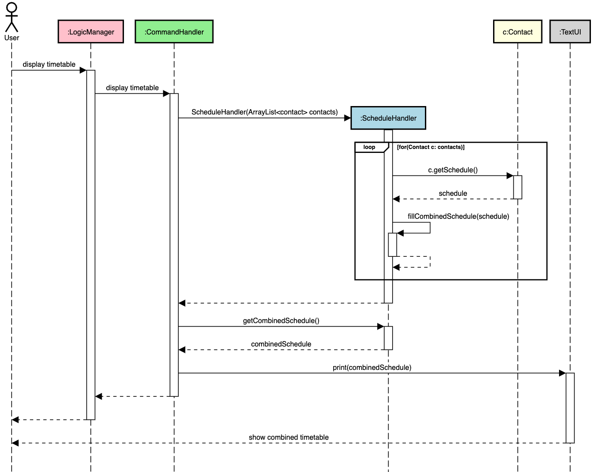<br>
*Fig 12. Sequence diagram of the implementation of the `Display timetable of selected contacts` feature*

Fig 12. shows the sequence diagram of displaying a combined timetable of selected contacts. 
It consists of 5 classes:```LogicManager``` ```Commandhandler``` ```ScheduleHandler``` ```Contact``` ```TextUI``` .

Given below is an example usage scenario of the ```Display timetable of selected contacts``` feature.

1. The user invokes the LogicManager by entering ```timetable <contact index A> <contact index B>```.

    >:information_source: ```<contact index A>``` and ```<contact index B>``` represent the ```Contact```s whose combined timetable is 
    to be displayed.
2. The ```LogicManager``` requests to display the combined timetable via ```CommandHandler```.
3. The ```CommandHandler``` retrieves ```Contact```s from ```ContactList``` using the contacts' index passed into the 
command, to generate ```ArrayList<Contact>```.

    >:information_source: This step is omitted in the sequence diagram to keep it concise.
3. The ```CommandHandler``` calls the ScheduleHandler constructor ```ScheduleHandler(ArrayList<Contacts>)```.
4. For each ```Contact```, ```ScheduleHandler``` retrieves its schedule by calling ```Contact#getSchedule()```. ```ScheduleHandler``` 
then uses the retrieved schedule to fill a combined schedule, adding all "busy" time blocks of the retrieved schedule into the
combined schedule.
5. ```CommandHandler``` retrieves the final combined schedule by calling ```ScheduleHandler#getCombinedSchedule```.
6. ```CommandHandler``` calls ```TextUI``` to print the combined schedule.
7. ```TextUI``` returns a ```System.out.println``` of the combined schedule in an ASCII timetable diagram. 

### 3.4 Schedule a new meeting
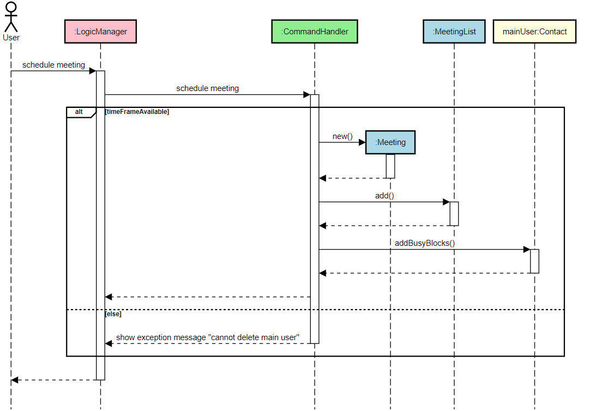
*Fig 13. Sequence diagram of the implementation of the `Schedule a new meeting` feature*

Fig 13 shows the sequence diagram of scheduling a new meeting at a given time slot.
It consists of 5 classes:```LogicManager``` ```Commandhandler``` ```Contact``` `Meeting` `MeetingList`.

Given below is an example usage scenario of the ```Schedule a new meeting``` feature.

1. The user invokes the LogicManager by entering `schedule <meeting name> <start date> <start time> <end date> <end time>`.
2. The `LogicManager` requests to schedule a new meeting via `CommandHandler`.
3. If the indicated timeframe is available, 
	1. a new `Meeting` is instantiated with the meeting name, start date, start time, end date and end time.
	2. This new `Meeting` object is then added into `MeetingList`.
	3. Lastly, `CommandHandler` calls `addBusyBlocks()` on `mainUser:Contacts` to mark the indicated timeframe as "busy".
4. If the indicated timeframe is not available, an exception will be thrown to inform user.

#### 3.4.1 Design Considerations
**Aspect 1: **


### 3.5 Edit a contact's timetable
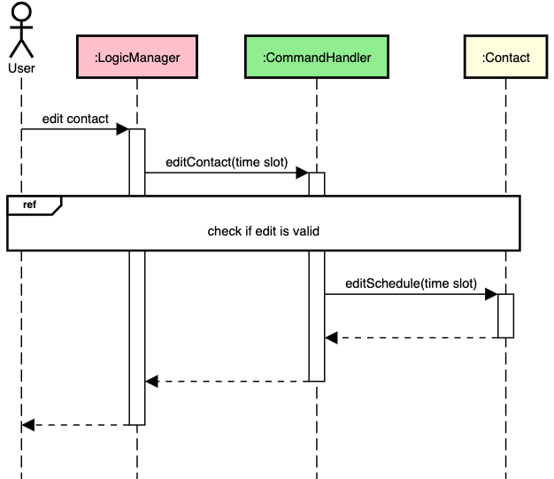<br>
*Fig 14. Sequence diagram of the implementation of the `Edit a contact's timetable` feature*

Fig 14. shows the sequence diagram of editing the schedule (timetable) of a selected contact at a given time slot. 
It consists of 3 classes:```LogicManager``` ```Commandhandler``` ```Contact```.

Given below is an example usage scenario of the ```Edit a contact's timetable``` feature.

1. The user invokes the LogicManager by entering ```edit <contact index> <time slot>```.

    >:information_source: The original user input formats for ```EditCommand``` are: 
    <br>```edit busy <contact index> <start day> <start time> <end day> <end time>``` and 
    <br>```edit free <contact index> <start day> <start time> <end day> <end time>```, 
    <br>for editing the ```Contact```'s schedule to "busy" and "free" at the given time slot respectively. 
    We generalise ```edit busy``` and ```edit free``` as ```edit``` in the sequence diagram as their execution are similar. 
    We also represent ```<start day> <start time> <end day> <end time>``` as ```<time slot>``` in the sequence diagram to
    keep it concise.
    
2. The ```LogicManager``` requests to edit a contact's schedule via ```CommandHandler```.
3. The ```CommandHandler``` retrieves ```Contact``` from ```ContactList``` using the contact's index passed into the 
command.

    >:information_source: This step is omitted in the sequence diagram to keep it concise.
4. The ```CommandHandler``` calls ```editSchedule(time slot)``` of ```Contact```.
If ```edit busy```, the schedule of `Contact` will be marked as "busy" for the given time slot. If ```edit free```, the 
schedule of `Contact` will be marked as "free" for the given time slot.

The schedule of the `Contact` is edited and saved in the application.

#### 3.5.1 Design Considerations
**Aspect 1: Clash of ```Meeting```'s time slot and ```EditContact```'s time slot when editing main user's schedule**

The implementation described above would allow the overwrite of any time blocks in the ```Contact```'s schedule. This  
would be problematic when editing the main user's schedule, which contains ```Meeting```s' time slots. A possible problematic 
scenario is if we edit over a ```Meeting```'s time slot and set the time slot to "free", we would subsequently be able to schedule 
another meeting at the same time slot. This results in multiple ```Meeting```s occupying the same time slot.

* Alternative 1(current choice): Disallow the overwrite of ```Meeting```'s time slot. If ```EditContact```'s time slot 
clashes with any ```Meeting```'s time slot, throw error to discontinue edit of that time slot.
* Alternative 2: Allow the overwrite of ```Meeting```'s time slot. If ```EditContact```'s time slot clashes with any 
```Meeting```'s time slot, remove the ```Meeting``` from ```MeetingList```. 

We chose Alternative 1 for these reasons:
1. The intended purpose of the edit function is to make amendments to schedules pulled
 from NUSMODS so that additional "busy" slots or "free" slots can be visualized in the timetable, not to edit over meetings. 
2. Editing of a ```Meeting```'s time slot to be "free" will be equivalent to deleting the ```Meeting```, for 
which there is a dedicated feature implemented. This causes unnecessary overhead in functionality.
3. Alternative 1 is easier to implement. When a clash is detected, Alternative 1 requires only the throwing of exception, 
whereas Alternative 2 requires the removal of ```Meeting``` from ```MeetingList```.<br><br>

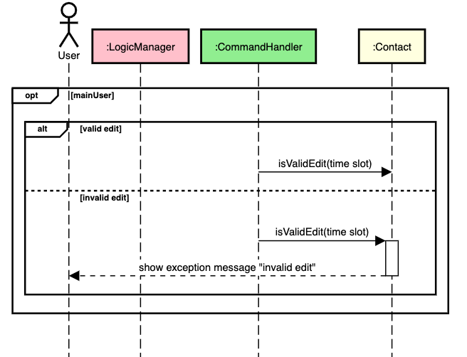<br>
*Fig 15. Sequence diagram of checking if an edit is valid in the `Edit a contact's timetable` feature*

Fig 15. shows the sequence diagram illustrating the implementation of Alternative 1. Checking validity of 
edit is done before editSchedule() of `Contact` is called, as shown in Fig 14. 
1. This path is optional, and is only implemented if `Contact` the main user.
2. `CommandHandler` calls isValidEdit(time slot) of the `Contact` class.

3. isValidEdit(time slot) uses the `Contact`'s schedule to check if any of the time blocks within the time slot is a
    "meeting" time block. 
4. If no  "meeting" time block is detected within the time slot, the edit is valid. The program continues running and 
    editSchedule() will be called.
5. If a "meeting" time block is detected within the time slot, the edit is invalid. An invalid exception is thrown by 
    `Contact`, and the user will be informed that the edit is invalid.
    
    >:information_source: `TextUI` and `Exception` classes which are involved in generating the exception, and displaying the exception message
    to the user are omitted to keep the sequence diagram concise.
    
### 3.6 Delete a scheduled meeting
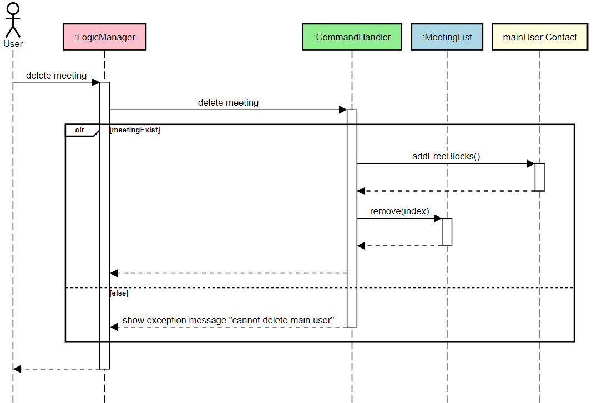
*Fig 16. Sequence diagram of the implementation of the `Delete a scheduled meeting` feature*

Fig 16. shows the sequence diagram of the ```DeleteMeeting``` command.
It consists of 3 classes:```LogicManager``` ```CommandHandler``` ```MeetingList``` `Contact`.

Given below is an example usage scenario of the ```Delete a scheduled meeting``` feature.

1. The user running the application invokes the ```LogicManager``` by typing ```delete <meeting index>```.
2. ```LogicManager```would then request ```CommandHandler``` for deletion.
3. ```CommandHandler``` will check if target meeting index exists. If it exists, a method call ```addFreeBlocks()``` will be made on the `mainUser:Contact` which will make the indicated timeframe back to "free" again. In addition, `CommandHandler` will also make a method call, `delete()`, on `MeetingList` which will find and remove the meeting at the given index. If it does not exist, an exception will be thrown.
4. Subsequently, the updated list of meetings and schedule of the mainUser will be saved in the application.

### 3.7 Delete a contact
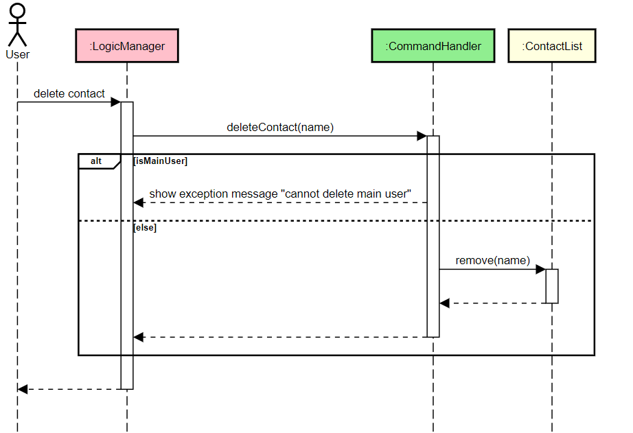
*Fig 17. Sequence diagram of the implementation of the `Delete a contact` feature*

Fig 17. shows the sequence diagram of the ```DeleteContact``` command.
It consists of 3 classes:```LogicManager``` ```CommandHandler``` ```ContactList```.

Given below is an example usage scenario of the ```Delete a contact``` feature*

1. The user running the application invokes the ```LogicManager``` by typing ```delete <contact name>```.
2. ```LogicManager```would then request ```CommandHandler``` for deletion.
3. ```CommandHandler``` will check if target contact is the main user. If it is the main user, no contact will be removed and an exception will be thrown to inform user. If it is not the main user, a method call ```remove()``` will be requested on ```ContactList``` which will find and remove the contact with the matching name.
5. Subsequently, the new list of contacts will be saved in the application.


### 3.8 List all scheduled meetings


*Fig 18. Sequence diagram of the implementation of the `List all scheduled meetings` feature*

Fig 18. shows the sequence diagram of the ```List all scheduled meetings``` feature.
It consists of 3 classes:```LogicManager``` ```CommandHandler``` ```MeetingList```.

Given below is an example usage scenario of how the ```ListMeetings``` command behaves.

1. The user running the application invokes the ```LogicManager``` by typing ```meetings```.
2. ```LogicManager```would then request ```CommandHandler``` for the list.
3. ```CommandHandler``` will call ```listMeetings()``` on ```MeetingList```, which will display every scheduled meetings that has been created.

[&#8593; Return to Table of Contents](#table-of-contents)

<br/>

## Appendix A: Product Scope
### A.1. Target user profile
Our application, WhenFree, is for NUS students and teaching assistants looking to save time finding
free-slots for their project meetings, consultations etc. It allow users to add their team members and tutees respectively, and
finding a time-slot where everyone would be free.
Target user profile:
* Our application if for users that are comfortable using CLI apps and prefer desktop applications rather than phone apps.
* Our application targets users in NUS that wish to easily find free-slots amongst their peers studying in NUS as well.
* Our application tracks the meetings the user have and shows them on a timetable generated dynamically in CLI.


### A.2. Value proposition
* By using this application, NUS students/staff are able to save time planning schedule for their group meetings by simply providing
the application with their respective NUSMODS website link instead of manually keying in their timetable individually.
* Our application allows NUS students/staff to save their scheduled meeting into their timetable. Our application would take the user's
meetings into account when scheduling a common timeslot timetable.
* Our application provides NUS students/staff with a friendly CLI-based timetable interface when scheduling common-timeslots.

## Appendix B: User Stories

|Version| As a ... | I want to ... | So that I can ...|
|--------|----------|---------------|------------------|
|v1.0| As a student | I want to delete the meetings in the calendar| so that I can afford to make mistakes while planning for the meeting. |
|v1.0| student with many friends | I want to schedule lunch dates with my friends | so that i can maintain my social circle.  |
|v1.0| As a TA | I want to organize my timetable and consult sessions | so that it can all be in one place.  |
|v1.0| As a student who uses various calendars | I want to schedule everything in one place | so that i can access all my events from one medium.  |
|v1.0| As a forgetful student | I tend to forget which project meetings I have planned for the week and hence| so the application allows me to save the schedule and look through it for reference.  |
|v1.0| As a busy student | I want to have more family outings without sacrificing my lecture/tutorial timings |  so that I can score good grades and have a life both at the same time. |
|v2.0| As an impatient student | I want to directly copy/paste timetable links | so that i can instantly generate suitable time slots for our project meetings. |
|v2.0| As a student | I want to use this to be organized in terms of what meetings i have for the coming week | so that I would be a responsible team member who shows up at every meeting. |
|v2.0| As a busy student | I want to use this application to manage my schedule  | so that i can plan my time wisely. |
|v2.0| As a TA | I want to use this to schedule consults and marking sessions without sacrificing my tutorial/lecture slots | so that I can get the best TA award and maintain my grades at the same time. |
|v2.0| As a lazy student | I want to use this application to automatically sync my previous meeting onto a new schedule profile | so that I can automatically block out dates instead of typing it manually. |
|v2.0| As a student | I want to see the list of upcoming meeting dates  | so that i can remind myself which meetings i have to go for in the coming week. |
|v2.1| As a  | a | a |

[&#8593; Return to Table of Contents](#table-of-contents)

<br/>

## Appendix C: Use Cases
(For all use cases below, the **System** is WhenFree and the **Actor** is the ```user```, unless otherwise stated.)
```$xslt
Use case: Add contacts
MSS:
1) User has a group of team mates for a certain project.
2) User wants to add the timetable of his/her teammates to schedule a common time-slot.
3) User keys in the member's name and timetables into application .
4) System adds the nusmods timetable of team members.
Use case ends.

Extensions:
* System detects invalid name containing all numbers - System catches it and use case resumes from step 3.
* System detects invalid nusmods URL - System catches it and use case resumes from step 3.
```
```$xslt
Use case: Delete contacts
MSS: 
1) User wants to delete the members of a particular project since the project has finished.
2) User keys in the command together with the name of the contact.
3) System deletes the contact from the user's storage.
Use case ends.

Extensions:
* System detects an invalid name - System catches it and use case resumes from step 2.
```
```$xslt
Use case: List contacts
MSS:
1) User wants to see the current list of saved contacts he/she has previously keyed.
2) User keys in the command without any additional paramters.
3) System lists the contact from the user's storage.
Use case ends
```
```$xslt
Use case: Schedule meetings
MSS:
1) User has a common time-slot chosen via our application and wants to schedule it into his/her timetable.
2) User keys in the command together with the start and end date, start and end time.
3) System stores the scheduled meeting.
4) System blocks out the scheduled meeting in his/her timetable.
Use case ends.

Extensions:
* System detects start date later than end date - System catches it and use case resumes from step 2.
* System detects start/end date not within this week or next week - System catches it and use case resumes from step 2.
* System detects start/end time is not in blocks of 30minutes - System catches it and use case resumes from step 2.
```
```$xslt
Use case: Edit timetable slots
MSS:
1) User realised lecturer has cancelled a particular lecture time-slot and is free during that time.
2) User keys in the command, with the start/end date, start/end time that he/she is free.
3) System free up the timetable slots.
Use case ends.

Extensions:
* System detects start date later than end date - System catches it and use case resumes from step 2.
* System detects start/end date not within this week or next week - System catches it and use case resumes from step 2.
* System detects start/end time is not in blocks of 30minutes - System catches it and use case resumes from step 2.
* System detects that user did not specify if he/she wants to free or block the slot/s - System catches it and use case resume from step 2.
```
```$xslt
Use case: List meetings
MSS:
1) User wants to see the current list of saved meetings he/she has previously keyed.
2) User keys in the command without any additional paramters.
3) System lists the meetings from the user's storage.
Use case ends
```
```$xslt
Use case: Delete meetings
MSS:
1) User has an urgent stuff on a particular scheduled meeting slot and wish to delete the scheduled meeting in application.
2) User keys in the command together with the index of the meeting. Index is gotten by listing the meetings.
3) System deletes the meeting and reflects it in user's timetable.
Use case ends.

Extensions:
* System detects an invalid index - System catches it and use case resumes from step 2.
```
```$xslt
Use case: Show(more) timetable/s
MSS:
1) User wants to see the common timeslots together with 3 of his/her contacts to schedule a common meeting timeslot.
2) User keys in the command together with the index of the contacts.
3) System generates a dynamic timetable for this week.
4) User wants to see next weeks timetable with all the common timeslots among his contacts as well.
5) User types in the command "more".
6) System generates two timetable side by side, each representing this week and next week's timetable.
Use case ends.

Extension:
* System detects that "more" is keyed in without "timetable" command preceding it- System catches it and use case resumes from step 2.
* System detects that index of the contacts is invalid - System catches it and use case resumes from step 2.
```

[&#8593; Return to Table of Contents](#table-of-contents)

<br/>

## Appendix D: Non-Functional Requirements

1. Should work on any mainstream OS as long as it has Java 11 SDK or above installed.
2. Should be able to hold up to hundreds of meetings and timetables without a noticeable increase in application's performance and latency.
3. A fast typist user preferring CLI applications, with above average typing speed(>65wpm) for regular English text should be able to accomplish most tasks faster than a GUI application using mouse.
4. Should come with automated unit tests in case you encounter any bugs while developing new feature, and it should be open sourced for the anyone.
5. Should work on both 32-bit and 64-bit environments.
6. Should not exceed 100MB in size given normal usage.

[&#8593; Return to Table of Contents](#table-of-contents)

<br/>

## Appendix E: Glossary

* **Blacklisted modules** - Blacklisted modules are modules that doesn't follow the conventional 13 weeks programme and as such, the JSON pulled from NUSMODS api is unable to be processed by ```Logic.modulelogic``` component.
* **Mainstream OS** -Windows, LinuxOS, OS-X(MacOS)

[&#8593; Return to Table of Contents](#table-of-contents)

<br/>

## Appendix F: Instructions for Manual Testing

Given below are instructions to test the app manually.

> :information_source: These instructions only provide a starting point for testers to work on; testers are expected to do more _exploratory_ testing.  <br>

> :information_source: We also recommend testers to have a stable internet connection throughout the tests to successfully pull the data from nusmods API.

### F.1. Launch and Shutdown
1. Initial launch
    1. Download the jar file and copy into an empty folder.
    2. Double click the jar file
   
    Expected: The CLI application would be running with our logo: WhenFree.
    
    > :bulb: You can also open the cmd terminal from windows or bash terminal from linux/mac os and key in ```java -jar WhenFree-2.1.jar``` to access the application.
    
2. Shutting down
    1. Type ```exit``` followed by kbd:[enter] key to exit.
    
    Expected: Application should shut down with an exit message, intermediate contacts and meetings would be saved.

    > :information_source: The test cases below are provided such that it should be executable without showing any errors if followed sequentially from F.2 onwards.

### F.2. Setting up profile
1. Set up your contacts profile
    1.Test case: ```Tommy https://nusmods.com/timetable/sem-2/share?CFG1002=LEC:06&CG2023=PLEC:02,LAB:03,PTUT:02&CG2027=LEC:01,TUT:01&CG2028=LAB:02,TUT:01,LEC:01&CS2101=&CS2113T=LEC:C01&GES1020=TUT:2,LEC:1&SPH2101=LEC:1,TUT:6``` <br>
    
    Expected: A new main contact will be added. Name: Tommy, with his respective modules.
    
    > :bulb: Note that the first user added to the contact will be the main user of the application. Meeting schedule will be stored into main user's timetable.
     
    2. Test case: ```Patricia https://nusmods.com/timetable/sem-2/share?CG2023=PLEC:03,PTUT:03,LAB:06&CG2027=LEC:01,TUT:01&CG2028=LAB:01,TUT:01,LEC:01&CS2101=&CS2113T=LEC:C01&LAT1201=LEC:1``` <br>
       Test case: ```Agnus https://nusmods.com/timetable/sem-2/share?CG2023=LAB:03,PLEC:03,PTUT:03&CG2027=LEC:01,TUT:01&CG2028=LAB:02,TUT:01,LEC:01&CS2101=&CS2107=TUT:09,LEC:1&CS2113T=LEC:C01``` <br>
       Test case: ```Jerry https://nusmods.com/timetable/sem-2/share?CG2023=LAB:04,PLEC:02,PTUT:01&CS3235=TUT:3,LEC:1``` <br>
       
    Expected: 3 new contacts will be added, with their respective modules.
    
    3. Test case: ```Timmy https://nusmods.com/timetable/sem-2/brokenlink``` <br>
    
    Expected: Contact is not updated into contact list as nusmods URL is invalid <br>
    
    > :information_source: Names must not contain purely integers. It should either be entirely alphabetical or alphanumerical.
    
### F.3. Scheduling a meeting
1. Setting up a meeting among all contacts.
    1. Prerequisites: Type ```timetable 0 1 2 3``` to show the combined timetable of all members.
    2. Check to see if there are any empty slots. Slots marked with ```X``` means the slot is taken up.
    3. Scheduling of meeting is allowed as long as ```X``` is not marked in the main user's timetable.
    4. Test case: ```schedule test_meeting startDate startTime endDate endTime``` <br>
    
    
    > :bulb: startDate/endDate is found in the ```timetable``` command. For eg, scheduling 16th April 11:30am to 16th April 3pm would be ```schedule testMeeting 16 11:30 16 15:00```. 
                                                                                                                                                                                                                                                                                                                                                                                                                                                            
    > :bulb:Type ```schedule``` to see the required format.
    
    > :information_source: startTime and endTime should strictly be in 30minutes blocks, startDay and endDay should strictly follow the date given in ```timetable```  command.
                       
### F.4. Deleting a meeting 
1. Deleting a scheduled meeting.
    1. Prerequisites: Type ```meetings``` to list down all meetings in the main user's timetable.
    2. Test case: ```delete 1```. <br>
    
    Expected: The meeting scheduled previously in F.3 is deleted. If no meeting is scheduled at all, an error would be shown to user. <br>
    
    3. Test case: ```delete 0``` <br>
    
    Expected: No meeting would be deleted since the index starts from 1 <br>
    
    > :bulb: Type ```delete``` to see the required format.
                                                                                                                                                                                                                                                                                                                                                                                
### F.5. Deleting a contact
1. Deleting a contact.
    1. Prerequisites: Type ```contacts``` to list down all the contacts currently stored.
    2. Test case: ```delete name```. <br>
    
    Expected: The desired contact would be deleted<br>
    
    > :information_source: You cannot delete main user contact.
                                                                                                                                                                                                                                    
    > :bulb: Type ```delete``` to see the required format.

### F.6. Editing a schedule 
1. Editing main user's timetable
    1. Prerequisites: Type ```timetable``` to check which slots from the main user timetable to free up or block out.
    2. Test case: ```edit free 0 startDate startTime endDate endTime``` <br>
    
    Expected: The date and time given would be free up <br>
    
    3. Test case: ```edit busy 0 startDate startTime endDate endTime``` <br>
    
    Expected: The date and time given would be blocked out <br>
    
    4. Other incorrect edit commands to try: not stating whether it is ```free``` or ```busy```, ```startTime endTime``` doesn't follow 30minutes blocks.
    
    
    > :bulb: Type ```edit``` to see the required format.
  

### F.7. Saving data
1. Data is saved automatically in the ```/data``` directory where the jar file is located in.
2. Loading previously scheduled meetings.
    1. Prerequisites: ```/data/meeting_list.txt``` is not empty.
    2. The text file stores every meeting in each line, and it contains information of the meeting name, start/end date, start/end time.
    3. Expected: The stored meetings would be shown in the application via ```meetings``` command and is also reflected in the ```timetable``` command.
    
    
    > :information_source: Note that you can't manually add meeting simply by editing ```/data/meeting_list.txt``` since the meetings generated would also be reflected in the main user's timetable. Editing it manually would corrupt the timetable schedule.
    
3. Loading previously stored contacts.
    1. Prequisites: ```/data``` directory contains at least one contact file in the form of ```name_schedule.txt```.
    2. The text file stores all 13 weeks schedule of a particular contact. The weeks are line separated and each word represents a block of 30minutes time.
    3. Expected: The stored contacts would be shown in application via ```contacts```.
    
    
    > :information_source: It is suggested not to manually edit the contacts file directly since it could potentially corrupt your data. We highly recommend scheduling meetings directly via the application instead.

[&#8593; Return to Table of Contents](#table-of-contents)

<br/>
