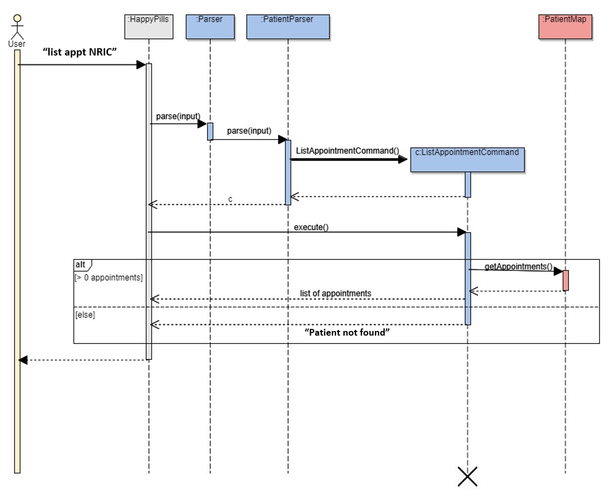
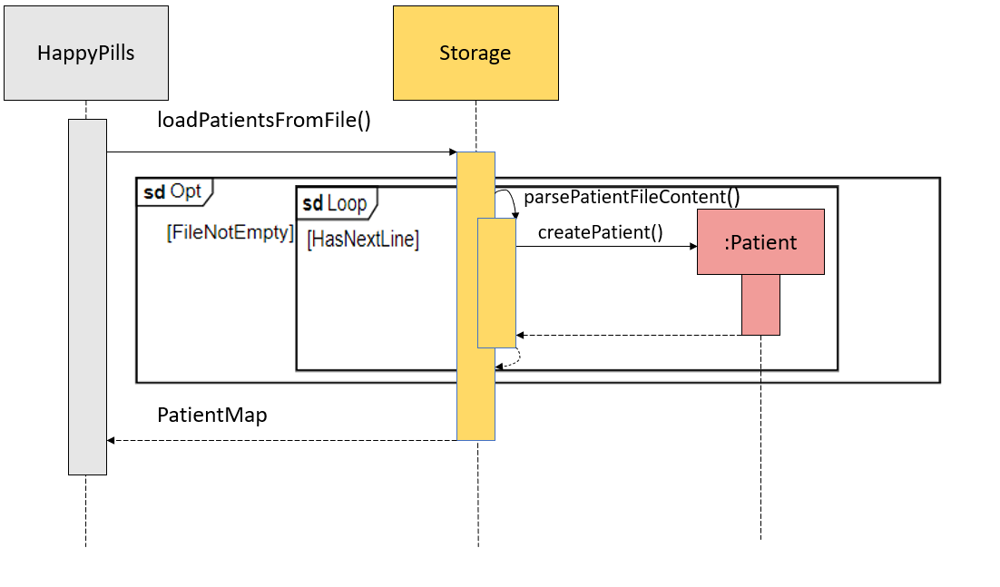

# Developer Guide

By: `CS2113T-T12-2` Since: `March 2020`

 
 

## Table of Contents

- [1. Introduction](#1-introduction)
    * [1.1. Purpose](#11-purpose)
    * [1.2. Scope](#12-scope)
- [2. Setting up](#2-setting-up)
- [3. Design](#3-design)
    * [3.1. Architecture](#31-architecture)
    * [3.2. TextUi Component](#32-ui-component)
    * [3.3. Logic Component](#33-logic-component)
    * [3.4. Model Component](#34-model-component)
    * [3.5. Storage Component](#35-storage-component)
- [4. Implementation](#4-implementation)
    * [4.1. Data Structure](#41-data-structure)
    * [4.2. Add Feature](#42-add-features)
    * [4.3. List Feature](#43-list-features)
    * [4.4. Find/Get Feature](#44-findget-feature)
    * [4.5. Edit Features](#45-edit-features)
    * [4.6. Delete Features](#46-delete-features)
    * [4.7. Done Appointment Feature](#47-done-appointment-feature)
    * [4.8 Storage](#48-storage)
    * [4.9 User Prompting](#49-user-prompting)
- [5. Testing](#5-testing)
- [6. Useful Links](#6-useful-links)
- [Appendices](#appendices)
    * [Appendix A: Product Scope](#appendix-a-product-scope)
    * [Appendix B: User Stories](#appendix-b-user-stories)
    * [Appendix C: Non-functional Requirements](#appendix-c-non-functional-requirements)
    * [Appendix D: Glossary](#appendix-d-glossary)
    * [Appendix E: Instructions for Manual Testing](#appendix-e-instructions-for-manual-testing)

## 1. Introduction

### 1.1. Purpose

This document contains the architecture and software design specifications for the application HappyPills.

### 1.2. Scope

This guide is mainly for developers, designers and software engineers that are working on and using HappyPills.

## 2. Setting Up

### Prerequisites
 
1.  JDK 11 or above
 
2.  IntelliJ IDE
 <table>
   <col width="20">
   <col width="200">
  <tr>
    <td> &#8505; </td>
    <td>IntelliJ by default has Gradle and JavaFx plugins installed. Do not disable them. 
    If you have disabled them, go to <code>File</code> > <code>Settings</code> > 
    <code>Plugins</code> to re-enable them.</td>
  </tr>
 </table>
 
### Setting up the project on your computer
1.  Fork this repository, and clone the fork to your computer
 
2.  Open the IntelliJ IDE. If you are not in the welcome screen, click `File` &gt; `Close Project` to close the existing project.
 
3.  Set up the correct JDK version for Gradle
 
    1.  Click `Configure` &gt; `Project Defaults` &gt; `Project Structure`
 
    2.  Click `New...` and find the directory of the JDK
 
4.  Click on `Import Project`
 
5.  Locate and select the `build.gradle` file, then click `OK`
 
6.  Click `Open as Project`
 
7.  Click `OK` to use the default settings provided
 
### Verifying the Setup
1.  In Intellij, run `seedu.happypills.HappyPills` and try a few commands.
    * Commands that you can try to get familiar with HappyPills:
        - `help`: list all the available commands in HappyPills
        - `add patient /ic S9876543F /n Eve /p 91265432 /dob 22/05/1999 /b O- /a School /rm Best Friend with Mallory`:
        Add patient's information in HappyPills.
        - `list patient`: list all the patients stored in HappyPills.

## 3. Design 

This section provides a high-level overview of HappyPills.

### 3.1. Architecture

The **Architecture diagram** above explains the high-level design of HappyPills. 
Given below is a quick overview of each component.

Main has one class called `HappyPills`.  
It is responsible for:  
- At app launch: Initializes the components in the correct sequence, and connects them up with each other.

The rest of the application consists of four other components.

- `UI`: The user interface of the application.

- `Logic`: The command executor.

- `Model`: Holds the data of the App in-memory.

- `Storage`: Reads data from and writes data to the text file stored on the user's computer.

**How the architecture components interact with each other**  

The Sequence Diagram below shows how the components interact with each other for 
the scenario where the user issues the command `delete patient NRIC`.  

The architecture of HappyPills is broken down into seven main classes:
* `Ui`: This class handles the User Interface of the application.
* `Parser`: This class handles the parsing and handling of user commands.
* `Command`: This class handles all the commands the application has.
* `Storage`: This class reads and writes data to and from text files for future use.
* `Patient`: This class manages the data of data type Patient in memory. 
* `Appointment`: This class manages the data of data type Appointment in memory.
* `MedicalRecords`: This class manages the data of data type MedicalRecord in memory.

### 3.2. Ui Component

The `Ui` component: 
* Executes user commands using the command component.
* Listens for changes and outputs messages accordingly from the Command component.
* Store or generate formatted messages used by the other components, for display to the user.
* Consist of 6 classes:
    - PatientTextUi
    - AppointmentTextUi
    - PatientRecordTextUi 
    - StorageTextUi
    - HelpTextUi
    - Messages

The first three TextUi sub classes are categorized based on object type. Results and error messages for 
commands executed on the relevant object are located here.

StorageTextUi contains only strings used for logging of storage activities and format strings saved to
the text files, so as to recover objects on next startup.

HelpTextUi contains only the messages used in the help command, so as to provide guidance to the user on
the usage of the commands.

### 3.3. Logic Component

The diagram above shows the logic flow of HappyPills.

1. `HappyPills` uses the `Parser` to parse the commands given by the user.
2. This results in a `Command` object being returned which is then executed by `HappyPills`.
3. The command executed will cause a change in the program (e.g. Patient added into program). 
4. The result of the command is then passed back to the `TextUi` to display the message. 

### 3.4. Model Component

The Model component consists of `Patient`, `PatientMap`, `PatientRecord`, `PatientRecordMap`, `Appointment` and
`AppointmentMap`, which stores the user's data according to their input. 

+ `Patient`: Stores information about a patient
+ `PatientMap`: Stores all patient information
+ `PatientRecord`: Stores all medical-related information about a patient
+ `PatientRecordMap`: Stores all patient records
+ `Appointment`: Stores information about an appointment
+ `AppointmentMap`: Stores all scheduled appointments

### 3.5. Storage Component

The `Storage` class is called by the `HappyPills` class to handle the loading and saving of patient general details, 
patient medical details and appointment schedule. 

The `loadPatientsFromFile()`, `loadPatientRecordFromFile()` and `loadAppointmentsFromFile()` methods are used 
to read saved data from local files into the current session of HappyPills. 

These data are parsed into corresponding
objects, and added to a map which will be returned to the main program, using `parsePatientFileContent()`,
`parsePatientRecordFileContent` and `parseAppointmentFileContent` respectively.

The `writeAllToFile()` method will write the current list of object into the corresponding text file by stating
the predefined filepath. This method is called on every delete, done and edit command for the corresponding objects, 
as well as by the `ExitCommand` class to confirm the storage of the current state of HappyPills.

The `addSingleItemToFile` appends an object as a new line the corresponding text file. This method is called only
for add commands executed on the various objects. 

## 4. Implementation

This section describes some of the details on how the features of the program has been implemented. This section has been broken 
down into nine main features: `Data Structure`, `Add Details Feature`, `List Feature`, `Find/Get Feature`, `Edit Detail Feature`, `Delete Feature`, `Done Appointment Feature`, `Storage`, `Prompting Feature`.

<table>
  <col width="20">
  <col width="200">
 <tr>
   <td> &#8505; </td>
   <td> 
<code>PatientParser</code> - A mark-up in PascalCase indicates the class used.

   <code>PatientParser#parse()</code> - The camelCase text after the '#' indicates the method called in the class.
   </td>
 </tr>
</table>

### 4.1. Data Structure

The `Patient Details`, `Patient Medical Records`, `Appointment Scheduling` is facilitated by HashMap which implements the following operations: 

- `PatientMap#add(Patient patient)` — Adds the patient object into the patient list using the patient’s Nric as key.  
- `PatientMap#remove(String nric)` — Removes the patient object from the existing patient list.  
- `PatientMap#get(String nric)` — Get the patient object resides in the existing patient list. 
- `PatientRecordMap#add(Patient patient)` — Adds the patient's record object into the patient's record list using the patient’s Nric as key.  
- `PatientRecordMap#remove(String nric)` — Removes the patient's record object from the existing patient's record list.  
- `PatientRecordMap#get(String nric)` — Get the patient's record object resides in the existing patient's record list.
- `AppointmentMap#add(Patient patient)` — Adds the appointment object into the appointment list using the patient’s Nric as key.  
- `AppointmentMap#remove(String nric)` — Removes the appointment object from the existing appointment list.  
- `AppointmentMap#get(String nric)` — Get the appointment object resides in the existing appointment list.  

#### Design Considerations 

*Aspect: Data Structure of the Patient List* 

- **Alternative 1 (current choice): Hash Map**
  * Pros: Allow faster lookup of patients’ information using the unique identifier (NRIC)
  * Cons: Implementation is harder and may result in bugs if not implemented accurately  
          May have performance issues in terms of memory usage.
            
- Alternative 2: Array List
  * Pros: This would be easier to implement and retrieve the information
  * Cons: When a patient is deleted, all the patients in the patient list need to be checked  
          This would cause the deletion to be very slow when there is a large number of patients in the list  
          This will requires a linear search, therefore, the search may be slower with large amount of data    

Alternative 1 was chosen because our target audience are general practitioners operating small clinics. There might be
large amount of information that the users will want to store in HappyPills. Hence, the use of HashMap will ensure that 
the application will provide the user with fast lookup of saved information.  

### 4.2. Add Features

The add features implemented in HappyPills allow users to add **_patient details_, _patient's record_** 
and **_appointment details_** into the program.

The add commands used in HappyPills are listed as follows: 
    
    1. add patient /ic NRIC /n NAME /p PHONE_NUMBER /dob DOB /b BLOOD_TYPE /a [ALLERGIES] /rm [REMARKS]
    2. add pr /ic NRIC /sym SYMPTOMS /diag DIAGNOSIS /d DATE /t TIME
    3. add appt /ic NRIC /d DATE /t TIME /r REASON

The `add patient` will add the patient general information into the patient list.  
The `add pr` will add the patient's medical records into the patient record list.   
The `add appt` will add the appointments into the appointment list.  

**Implementation** 

<table>
  <col width="20">
  <col width="200">
 <tr>
   <td> &#8505; </td>
   <td>
The implementation of all the add commands in HappyPills utilises <b>similar implementation</b> 
   with minor difference in the usage of tags when parsing the command.

   The following section will elaborate more on the <code>add appt</code> command behaves which can be generalise to other 
   add commands.
   </td>
 </tr>
</table>

The `AddAppointmentCommand` extends the `AppointmentCommand` which implements the `Command` class and initialises the 
`nric`, `date`, `time`, and `reason` in its constructor. 

The following steps below is an example of how the `AddAppointmentCommand` class behaves: 

1. The user enters `add appt /ic S1234566A /d 04/04/2020 /t 10:30 /r Checkup` into the application. The `HappyPills` 
class then calls `Parser#parse()` to parse the user input. Upon checking that it is an Appointment-related command, 
`Parser` then calls the `AppointmentParser#parse()` method. 

2. `AppointmentParser#parse()` will then call the `parseAddCommand` in the same class to parse all the arguments of 
the user input and prompt the user if there are any missing fields 
[[User Prompting]](#49-user-prompting). 

3. A new instance of `AddAppointmentCommand` with the given arguments initialised will be created. `HappyPills` will 
subsequently call the `AddAppointmentCommand#execute()` method. 

4. The `AddAppointmentCommand#execute()` method will do 2 things: 

	+ If there is no patients in the `PatientMap` with the given NRIC, the method returns a string to notify the user 
	that the patient does not exist. 
	
	+ If the patient with the given NRIC exists in `PatientMap`, a new Appointment object with the given arguments 
	(NRIC, date, time and reason) are created and added into the `AppointmentMap` and into the ArrayList of Appointment 
	objects in the Patient object mapped with the NRIC given. The `Appointment` object is stored in the storage by 
	calling `Storage#writeAllToFile()`.   
	Subsequently, the method returns a string to notify the user that the patient has been added into the `AppointmentMap` 
	and displays the `AppointmentID` associated to the `Appointment` object created. 

5. A appointment for patient with NRIC `S1234566A` will be added to the appointment list with the following details 
`date: 04/04/2020`, `time: 10:30` and `reason: Checkup`. 

#### Design Considerations 

*Aspect: Key-value pair* 

- **Alternative 1 (current choice): Use NRIC as key**
  * Pros: 
    - All stored information can be uniquely identified by NRIC 
    - Reduce coupling in model components
  * Cons: 
    - NRIC is lengthy in comparison to index
            
- Alternative 2: Use Index as key
  * Pros:
    - Shorter user input required from the user, more suitable for fast typing users
  * Cons: Hard to remember unique index for each patient, therefore more checks are required which will increase 
  coupling between model components 

- Alternative 2: Different index as key
  * Pros:
    - Reduce coupling between model components
  * Cons:
    - No standardisation between the each model components  

Alternative 1 was chosen as NRIC is unique for each patient and it decrease coupling between model components 
(e.g. PatientMap, PatientRecordMap, AppointmentMap).  

### 4.3 List Features 

The list features implemented in HappyPills allow users to view a list of **_patients_, _patient's records_** and 
**_appointments_**. 

The list commands used in HappyPills are listed as follows: 
    
    1. list patient
    2. list pr NRIC
    3. list appt

The `list patient` will list all the existing patients in the patient list.  
The `list pr` will list all the existing patient records for a particular searched patient (identified by the NRIC).    
The `list appt` will list all the existing appointments in the appointment list.  
        
**Implementation** 

<table>
  <col width="20">
  <col width="200">
 <tr>
   <td> &#8505; </td>
   <td>The implementation of all the list commands in HappyPills utilises <b>similar method</b>. 
   The following section will elaborate more on the <code>list appt</code> command which can be generalise to other 
   list commands.
   </td>
 </tr>
</table>

The `ListAppointmentCommand` extends the `AppointmentCommand` which implements the `Command` class.

The following sequence diagram summarises how the `ListAppointmentCommand` operation works: 

The following steps below is an example of how the `ListAppointmentCommand` class behaves: 

1. The user enters `list appt` into the application. The `HappyPills` class then calls the `Parser#parse()` to parse the 
user input. Upon checking that it is an Appointment-related command, `Parser` then calls the `AppointmentParser#parse()` method. 

2. `AppointmentParser#parse()` will then split the user input and calls the `ListAppointmentCommand` class. 

3. `HappyPills` will then call the `ListAppointmentCommand#execute()` method. 

4. The `ListAppointmentCommand#execute()` method will check if there are any appointments in the program. 

5. If there are appointments in the program, it gets the list of appointments by calling `PatientMap#getAppointments()` 
and displays all the appointments. Otherwise, the user will receive a message saying that the there is no appointments in the list. 

### Design Considerations

_Aspect: Information needed to be displayed_

- **Alternative 1 (current choice)**: Display only certain details  
    `List patient` will only display name and NRIC  
    `List pr` will only display index, date and time  
    `List appt` will only display apptID, date, time and NRIC  
  * Pros: Display only necessary information for quick lookup
  * Cons: Not all details are shown, users will need to use another command to view detailed information  
            
- Alternative 2: Display all information  
  * Pros: User will only need one command to view all the information stored in HappyPills  
  * Cons: The window screen will be filled with a lot of information and user might have a difficult time to 
  search for the information of a particular patient  
  
Alternative 1 was chosen for our current implementation because we prioritise user experience over the ease of coding. 
For alternative 1, all the information is also displayed in ascending order which user can quickly find information 
they are searching for.  

### 4.4. Find/Get Feature

The find/get features implemented in HappyPills allow users to view detailed information of **_patient's particulars_, 
_a specified patient record_** and **_appointment for a particular patient_**. 

The find/get commands used in HappyPills are listed as follows: 
    
    1. get patient NRIC
    2. find pr NRIC INDEX
    3. find appt NRIC

The `get patient` will retrieve all basic information related to the searched patient.  
The `find pr` will display detailed information of a particular patient record identified by the NRIC and INDEX.  
The `find appt` will find all the appointments that the patient with the specified NRIC has.

**Implementation**

<table>
  <col width="20">
  <col width="200">
 <tr>
   <td> &#8505; </td>
   <td>The implementation of all the find/get commands in HappyPills utilises <b>similar method</b>. 
   The following section will elaborate more on the <code>find pr NRIC INDEX</code> command which can be generalise 
   to other find/get commands.
   </td>
 </tr>
</table>

The `FindPatientRecordCommand` extends the `PatientRecordCommand` which implements the `Command` class and 
initialises the `nric` and `index` in its constructor. 

The following sequence diagram summarises how the `FindPatientRecordCommand` operation works: 

The following steps below is an example of how the `FindPatientRecordCommand` class behaves: 

1. The user enters `find pr S1234567F 1` into the application. The `HappyPills` class then calls the `Parser#parse()` 
to parse the user input. Upon checking that it is an Patient record related command, `Parser` then calls the 
`PatientRecordParser#parse()` method. 

2. `PatientRecordParser#parse()` will then split the user input and calls the `FindPatientRecordCommand` class. 

3. `HappyPills` will then call the `FindPatientRecordCommand#execute(S1234567F, 1)` method. 

4. `FindPatientRecordCommand#execute()` first checks the validity of the NRIC and index given. 
It then checks if a patient exists in the `PatientRecordMap`. 

5. If it exists, it gets the list of patient record by calling `PatientRecordMap#get(S1234567F)` and displays a 
particular patient record with index `1` belonging to the patient with NRIC `S1234567F`, 
otherwise it displays that there is no patient record found. 

### 4.5. Edit Features

The edit features implemented in HappyPills allow users to view detailed information of **_patient's particulars_, 
_a specified patient record_** and **_appointment for a particular patient_**. 

The edit commands used in HappyPills are listed as follows: 
    
    1. edit patient NRIC /n<NAME> or /p<PHONE_NUMBER> or /dob<DOB> or /b<BLOOD_TYPE> or /a<ALLERGIES> or /rm<REMARKS>
    2. edit pr NRIC INDEX /sym<SYMPTOMS> or /diag<DIAGNOSIS> or /d<DATE> or /t<TIME>
    3. edit appt NRIC APPT_ID /d<DATE> /t<TIME> /r<REASON>

<table>
  <col width="20">
  <col width="200">
 <tr>
   <td> &#9888; </td>
   <td> Users can only edit <b>one</b> field at a time. Those fields that can be edited are in <code><></code>.</td>
 </tr>
</table>

The `edit patient` will edit a single field in the Patient object with the given NRIC.  
The `edit pr` will edit a single field in the PatientRecord object with the given NRIC and index.  
The `edit appt` will edit a single field in the Appointment object with the given NRIC and apptId.

**Implementation**

<table>
  <col width="20">
  <col width="200">
 <tr>
   <td> &#8505; </td>
   <td>The implementation of all the edit commands in HappyPills utilises <b>similar method</b>. 
   The following section will elaborate more on the <code>edit pr NRIC INDEX</code> command which can be generalise 
   to other edit commands.
   </td>
 </tr>
</table>

The `EditPatientRecordCommand` extends the `PatientRecordCommand` which implements the `Command` class and initialises the 
`nric`, `index` and `newContent` in its constructor. 

The following sequence diagram summarises how the `EditPatientRecordCommand` operation works: 

The following steps below is an example of how the `EditAppointmentCommand` class behaves: 

1. The user enters `edit pr S1234567F 1 /t 22:22` into the application. The `HappyPills` class then calls the 
`Parser#parse()` to parse the user input. Upon checking that it is an patient record related command, `Parser` then calls 
the `PatientRecordParser#parse()` method. 

2. `PatientRecordParser` will calls its own method `PatientRecordParser#checkEditCommand()` to check the validity of NRIC
and index. 

3. `PatientRecordParser#parse()` will then split the user input and calls the `EditPatientRecordCommand` class. 

<table>
  <col width="20">
  <col width="200">
 <tr>
   <td> &#8505; </td>
   <td> If the number of arguments given is not equal to 3, the <code>HappyPillsException()</code> will be thrown.</td>
 </tr>
</table>

4. `HappyPills` will then call the `EditPatientRecordCommand#execute(S1234567F,1,22:22)` method. 

5. In `EditPatientRecordCommand#execute(S1234567F,1,22:22)`, it does two things: 

	+ `EditPatientRecordCommand#execute(S1234567F,1,22:22)` checks for which parameter is to be edited, 
	`date`, `time`, `symptom` or `diagnosis`. The method will edit the time with the relevant information.
	Afterwards, the method calls `PatientRecord#setTime` to edit the relevant field.
	
	+ If the patient and/or patient record does not exist, the `HappyPillsException()` will be thrown.

6. A display message will be shown to the user to indicate whether or not the edit was successful. 

7. The patient record for patient with NRIC `S1234567F` and indexed `1` will be edited with a new time `22:22`.

##### Design Considerations 

_Aspect: The number of field to be edited in the one command_

- **Alternative 1 (current choice)**: Edit only one field per command
  * Pros: Shorter command is required from the user, less mistakes are likely to occur
  * Cons: Not able to quickly edit all fields at once
            
- Alternative 2: Edit all fields per command
  * Pros: User will only need one command to edit all the information stored in HappyPills in one command
  * Cons: User might not need to edit all the fields  
          There is a higher chance of making mistakes when the user input is lengthy  

Alternative 1 was chosen for our current implementation because we believe that it is tedious for the user to edit all 
the fields at once. 

_Aspect: The type of fields that can be edited_

- **Alternative 1 (current choice)**: Do not allow NRIC to be edited
  * Pros: 
    - The maintenance of the HashMap will be relatively easier.
    - NRIC uniquely identifies the patient, hence no editing of NRIC reduces any possible duplication   
  * Cons:
    - If the user entered incorrect NRIC into the system, the user will have to delete the previously added patient's details
            
- Alternative 2: Allow NRIC to be edited
  * Pros: User need not delete any existing patient record is incorrect NRIC is entered
  * Cons: It might increase coupling between the model components to maintain the logic of the system
  
Alternative 1 was chosen to maintain low coupling between model components. To prevent the user from having to delete the 
patient details when incorrect NRIC is added, HappyPills will prompt the user when it violates the usual NRIC format and 
also display a confirmation page before saving the patient's NRIC and details.

### 4.6. Delete Features

The delete features implemented in HappyPills allow users to delete **_patient's particulars_, 
_a specified patient record_** and **_appointment for a particular patient_**. 

The delete commands used in HappyPills are listed as follows: 
    
    1. delete patient NRIC
    2. delete pr NRIC INDEX
    3. delete appt NRIC APPT_ID

The `delete patient` will delete a Patient object with the given NRIC.  
The `delete pr` will delete a PatientRecord object with the given NRIC and index.  
The `delete appt` will delete a Appointment object with the given NRIC and apptId.

**Implementation**

<table>
  <col width="20">
  <col width="200">
 <tr>
   <td> &#8505; </td>
   <td>The implementation of all the delete commands in HappyPills utilises <b>similar method</b>. 
   The following section will elaborate more on the <code>delete pr NRIC INDEX</code> command which can be generalise 
   to other delete commands.
   </td>
 </tr>
</table>

The `DeletePatientRecordCommand` extends the `PatientRecordCommand` which implements the `Command` class and initialises 
the `nric` and `index` in its constructor. 

The following sequence diagram summarises how the `DeletePatientRecordCommand` operation works: 

The following steps below is an example of how the `DeleteAppointmentCommand` class behaves: 

1. The user enters `delete pr S1234567F 1` into the application. The `HappyPills` class then calls the `Parser#parse()` 
to parse the user input. Upon checking that it is an patient record related command, `Parser` then calls the 
`PatientRecordParser#parse()` method. 

2. `PatientRecordParser` will calls its own method `PatientRecordParser#checkDeleteCommand()` to check the validity of 
NRIC and index. 

3. `PatientRecordParser#parse()` will then split the user input and calls the `DeletePatientRecordCommand` class. 

<table>
  <col width="20">
  <col width="200">
 <tr>
   <td> &#8505; </td>
   <td> If the number of arguments given is not equal to 2, the <code>HappyPillsException()</code> will be thrown.</td>
 </tr>
</table>
	
4. `HappyPills` will then call the `DeletePatientRecordCommand#execute(S1234567F,1)` method.  

5. In `DeletePatientRecordCommand#execute(S1234567F,1)`, if the patient and/or appointment does not exist, the 
`HappyPillsException()` will be thrown. 
Otherwise, `DeletePatientRecordCommand#execute()` will remove the patient record from the program and update the list of 
patient records. 

6. A display message will be shown to the user to indicate that the deletion have been successful. 

7. The patient record for patient with NRIC `S1234567F` and indexed `1` will be deleted from the list of patient records.

### 4.7. Done Appointment Feature
The user can mark an appointment as done from the list of appointments currently in the program. The command: 

    done appt S1234567Z 1
    
will mark the appointment with appointment ID `1` as done, if found. 

**Implementation** 

The `DoneAppointmentCommand` extends the `AppointmentCommand` which implements the `Command` class and initialises the 
`nric` and `apptId` in its constructor. 

The following sequence diagram summarises how the `DoneAppointmentCommand` operation works: 

The following steps below is an example of how the `DoneAppointmentCommand` class behaves:

1. The user enters `done appt S1234567Z 1` into the application. The `HappyPills` class then calls `Parser#parse()` to 
parse the user input. Upon checking that it is an Appointment-related command, `Parser` then calls the `AppointmentParser#parse()` 
method. 

2. `AppointmentParser#parse()` will then split the user input and calls the `DoneAppointmentCommand` class. 

<table>
  <col width="20">
  <col width="200">
 <tr>
   <td> &#8505; </td>
   <td> If the number of arguments given is not equal to 2, the <code>HappyPillsException()</code> will be thrown.</td>
 </tr>
</table>
    
3. A new instance of `DoneAppointmentCommand` with the given arguments will be created. `HappyPills` will subsequently call 
the `DoneAppointmentCommand#execute()` method.

4. The `DoneAppointmentCommand#execute()` method will then check that the nric given is valid and that a patient with that 
NRIC and appointment exists. If all the checks are successful, it calls `Storage#writeAllToFile()` and displays a success 
message to the user. Otherwise the `HappyPillsException()` will be thrown according to what is invalid. 

### 4.8. Storage

This is an internal feature of the program, implemented to allow users to recover information even after HappyPills is 
closed in the terminal. This is achieved by storing all relevant information in a text file using a structured format.

 The current methods implemented in this class and a brief description of each method:
 - `writeAllToFile` — writes the entire list of object to the specified text file.
 - `addSingleItemToFile` — appends a new object as a single string to the specified text file.
 - `loadPatientFromFile` — access the patient file and retrieve all information in the file as strings.
 - `parsePatientFileContent` — process line-by-line to create a patient object and add to the shared patient map.
 - `loadAppointmentFromFile` — access the patient file and retrieve all information in the file as strings.
 - `parseAppointmentFileContent` — process line-by-line to create an appointment object and add to the 
                                   shared appointment map.
 - `loadPatientRecordFromFile` — access the patient record file and retrieve all information in the file as strings.
 - `parsePatientRecordFileContent` — process line-by-line to create a patient record object and 
                                    add to the shared patient map.

**Implementation** 

 The following diagram shows how each command interacts with the other classes.
 
 *writeAllToFile*
 
 For illustration purposes, assume the editPatientCommand has called this method.
   
  1. editPatientCommand first gets a single formatted string from StorageTextUi.
  2. StorageTextUi then access the patients in the patientMap one by one to retrieve the a string of the object by the
     toSave() method. This is a private method that formats a string that contains all the values of the variables.
     It is constructed with '|' as a divider, and a newline to indicate the end of the object.
  3. The formatted string is a concatenation of all the toSave() strings of the objects in the list.
  4. `writeAllToFile` is then called from the editPatientCommand and writes the string into the text file, 
  overwriting any pre-existing strings in the file.
  
  This is implemented for edit and delete command of the various object. The process is identical regardless of
  the object. It is also implemented in the exitCommand for all the objects, to ensure a final save of the current state
  of the program.
  
  
 
 *addSingleItemToFile*
 
 For illustration purposes, assume addPatientCommand has called this method.
 
 1. The toSave() method formats a string that contains all the values of the variables. 
 It is constructed with '|' as a divider, and a newline to indicate the end of the object.
  2. `addSingleItemToFile` is called by addPatientCommand and appends the string to the back of the text file. 
 
 This is implemented for all add command of the various object, and process is identical. 
 This provides improved performance for add commands as compared to using writeAllToFile(), as less strings need 
 to be retrieved and formatted.
 
 
 
 *loading and parsing file content to HappyPills*
 
Loading and parsing methods are separated by class types. Each text file in HappyPills represent a single class.

For illustration purposes, only the load and parse for patient is called. The process is similar for all object.
1.  `loadPatientsFromFile` retrieves the entire content of the patient file, if any. 
2. `loadPatientsFromFile` then passes it line by line to `parsePatientFileContent`
3. `parsePatientFileContent` creates a patient object and adds the details from the single line string into the object.
4. `parsePatientFileContent` then adds the patient object into the patient map and returns. 
5. Step 2 - 4  is repeated if there is a next line in the content of the file.
4. `loadPatient` then returns the whole patientMap to `HappyPills`.

 
 
#### Design Considerations

_Aspect: Saving method_

Alternative 1 was chosen as fewer checks means that the program is less prone to exception, especially
so if the checks are confusing to implement. This would put lesser risk on the user experience for now.

        Alternative 1 (current choice): Save the objects by object type.
          Pros: Fewer checks required to identify class of the string, parsing is easier.
          Cons: Delete and update operation may take a long time if there are alot of objects.

        Alternative 2: Store each patient as an individual text file, along with all its associated objects. 
                       A list with all the patient’s NRIC will also be stored for referencing.
          Pros: Delete and edit operation on a patient will only affect the patient's file, and the referencing list.
          Cons: More checks are requires to identify class of the string in the file.

_Aspect: Updating deletion/edit_

Alternative 1 was chosen for now as the program is relatively new, and is more likely to be subjected to unexpected exceptions.

        Alternative 1 (current choice): Upon every delete/edit operation, update the relevant text file
          Pros: All deletions are updated in the relevant text files immediately and will not be affected by any 
          unexpected termination of the program.
          Cons: In the event that there is a large amount of deletion, it could be time-consuming for the user 
          and memory-intensive on the machine.

        Alternative 2: Saving the delete/edit operation to a list, then process it before the exit of the program
          Pros: Delay deletion time cost so that the use of the program is faster and smoother during time of use.
          Cons: If the program was to terminate unexpectedly, the deletion may not be reflected in the respective files.

### 4.9. User Prompting 
    
#### 4.9.1. Description

When the user adds a patient’s details, the input could be missing a few compulsory fields.  
Instead of prompting the user to re-enter the entire input, HappyPills will only ask the user for the missing details.  
The user may choose to abort the command because of a lack of knowledge of the compulsory field or provide the requested details.  
The add command will only be executed when all the compulsory fields are provided.  

**Implementation**
 
*Representing a prompt*

The prompting mechanism uses tag such as `/ic[NRIC]` to represent individual field in patient's information. A list of tags is use to pass to the `Parser` which contains:

  - `Parser#addCommandParser(input)` — This method break down user input based on given tags (e.g. /ic)

*Passing the prompts*

 

Given below is an example scenario where the user command has missing compulsory fields

Step 1: The `HappyPills` pass the user's command to `Parser`, which finds one or more missing compulsory fields.

Step 2: The `Parser` call `Parser#parseAddCommand`, which prompt the corresponding missing field back to the user. And wait for user response

Step 3: The new user input was than check again by `Parser#parseAddCommand` and repeat the process until all the compulsory fields is added correctly.

Step 4: `Parser#parseAddCommand` will ask for conformation before passing the correct input into `AddCommand`.

Step 5: `HappyPills` will execute the command.

#### Design Considerations

_Aspect: Prompt handling method_

- **Alternative 1 (current choice)**: The `HappyPill` functions is unaware of prompting. The `Parser` keeps track of the 
incomplete command and sends back as `addCommand` objects.
    * Pros: Decrease coupling between `HappyPill` and `Parser` components
    * Cons: `HappyPill` has no way to know if it is currently handling prompting, so it cannot abort prompts, `Parser` 
    return IncorrectCommand to act as abort.
            
- Alternative 2: The `Parser` component keeps track of the incomplete command and throws an exception containing prompts
 to the `HappyPills`.
    * Pros: Greater flexibility for `HappyPill` to handle the prompt (e.g. aborting the command)
    * Cons: A new class is required to keep track of the command entered, rather than simply acting as a bridge between 
    the `Command` and `Parser` sub-component. Increase number of potential points of failure and decrease maintainability.
          
Alternative 1 was chosen for our current implementation because it decrease coupling between components. 

## 5. Testing

### Running Tests
There are two ways to run tests.

#### Method 1 : Using IntelliJ JUnit Tests
- To run all test, right-click on `src/test/java` folder and choose `Run 'Tests in HappyPills'`
- To run a subset of tests, you can right-click on a test package, test class, or a test and choose `Run 'TEST'`.
 
#### Method 2 : Using Gradle
- To run all test using Gradle: Open a terminal and run the command `gradlew clean test` 
(Mac/Linux: `./gradlew clean test`)  
  <table>
    <col width="20">
    <col width="200">
   <tr>
     <td> &#8505; </td>  
     <td> See <a href="https://github.com/AY1920S2-CS2113T-T12-2/tp/blob/master/tutorials/gradleTutorial.md">Gradle Tutorial</a> 
     for more info on how to run tests using Gradle. </td>
     </td>
   </tr>
  </table>
  
### Using Input-Output Tests
- Right-click on `text-ui-test` folder and choose `Open in terminal` 
- Enters `runtest.bat` (Windows) or `runtest.sh` (Mac / Linux) in the terminal to run the script.
- This will run HappyPills with the commands given in the `input.txt` and compare its output in the `ACTUAL.txt` 
with the `EXPECTED.txt`.

## 6. Useful links

* [User Guide](UserGuide-Main.md)
* [About Us](AboutUs.md)

## Appendices 

### Appendix A: Product Scope 

Our product is targeted at users who:
  
   - has a need to record significant number of patients' information
   
   - want to keep patients' information organised
   
   - prefer desktop apps over other types
   
   - can type fast
   
   - prefer typing over mouse input
   
   - prefer CLI apps over GUI apps
  
Value proposition: Note taking application built for doctors to manage notes faster than a typical mouse/GUI driven app

### Appendix B: User Stories 

|Version| As a ... | I want to ... | So that I can ...|
|--------|----------|---------------|------------------|
|v1.0|Doctor|add Patient's details|view their information in their subsequent visits|
|v1.0|Doctor|have a quick overview of a list of all patients|check for their detailed information|
|v1.0|Doctor|add Patient's details|view their information in their subsequent patientRecords.|
|v1.0|Doctor|have a quick overview of a list of all patients|check for their detailed information.|
|v1.0|Doctor|retrieve my patient's detailed information|check for his/her allergies and provide a more accurate diagnosis|
|v1.0|Doctor|edit a particular patient's information|the most up-to-date details in our patient records|
|v2.0|Doctor|ensure that Patient's details are accurate before I add into the patient list|so that I can rectify mistakes earlier|
|v2.0|Doctor|schedule appointments with my patients|ensure that I will prescribe enough medicine until the next appointment|
|v2.0|Doctor|note down the prescription that I gave my patients|know what side effects are to be expected (based on the patient's current condition)|
|v2.0|Doctor|record down the symptoms of my patients|check for any persistent health condition|
|v2.0|Doctor|add Patient's medical records|view the previous reasons for doctor's visits|
|v2.1|Doctor|reduce the number of typing errors|ensure all information recorded are accurate|

### Appendix C: Non-functional Requirements

1. Should work on any mainstream OS as long as it has `Java 11` installed.

2. A user with above average typing speed should be able to accomplish most of the tasks faster using commands than using the mouse.

3. Should be able to hold up to 1000 patients' information without a noticeable sluggishness in performance for typical usage.

4. Should be able to display large amount of information quickly.

### Appendix D: Glossary 

- *Mainstream OS* - Windows, Linux, Unix, OS-X
- *dob* - date of birth
- *ic* - 

### Appendix E: Instructions for Manual Testing

Given below are instructions to test the application manually.

<table>
  <col width="20">
  <col width="200">
 <tr>
   <td> &#8505; </td>
   <td>These instructions only provide a starting point for tests to work on; testers are expected to do more exploratory testing.</td>
 </tr>
</table>

#### E.1. Launch and Shutdown

1. Initial launch 
    1. Download the latest jar file [here](https://github.com/AY1920S2-CS2113T-T12-2/tp/releases)
     and copy into an empty folder
    1. Open the terminal and run the JAR file using `java -jar HappyPills.jar` command
    1. Expected output: **HappyPills** startup screen is displayed
1. Shut down of application
    1. Enters `exit`
    1. Expected output: **HappyPills** programs terminates
    
#### E.2. General Patient Information Commands

1. Add patient to the list (User Prompting)

    - **Test case 1:** `add patient /ic S9876543F /n Mallory /p 91265432 /dob 22/05/1999 /b O-`   
    Expected: The program will prompt the user for confirmation before saving the inputs.  
    Continuation: `y`  
    Expected: A new patient named `Mallory` will be added to the list.  
 
    -  **Test case 2:** `add patient /ic S1234567G /p 91234567 /dob 10/03/1998 /b B+ /n Bob`  
    Expected: The program will prompt the user for confirmation before saving the inputs.  
    Continuation: `n`  
    Expected: The patient named `Bob` will not be added to the list.  
    
    - **Test case 3:** `add patient /ic S6699999N /p 81234567 /b AB+ /n Alice /rm High Blood Pressure`  
    Expected: The program will prompt the user for missing DOB.  
    Continuation: `20/20/2020` (or any invalid date)  
    Expected: An error message will be shown indicating that the input is invalid. 
    The program will continue to prompt the user for missing DOB.  

    - **Test case 4:** `add patient /ic S6699999N /p 81234567 /b AB+ /n Alice /rm High Blood Pressure`  
    Expected: The program will prompt the user for missing DOB  
    Continuation: `20/2/2020`  
    Expected: The program will prompt the user for confirmation before saving the inputs.  
    Continuation: `y`  
    Expected: A new patient named `Alice` will be added to the list.  
        
    - **Test case 5:** `add patient /ic S9888888G /n Eve`  
    Expected: The program will prompt the user for missing necessary information.    
    Continuation: `clear`  
    Expected: A message will be shown indicating that the command has been aborted.  
    
    <table>
      <col width="20">
      <col width="200">
     <tr>
       <td> &#8505; </td>
       <td>Testers can conduct tests with invalid phone number, NRIC and blood type. Output is expected to be similar 
       to <code>Test case 3</code> </td>
     </tr>
    </table>
      
2. Edit patient

    **_Prerequisite: There is no patient in the list._**
    
    - **Test case 1:** `edit patient S9876543F /p 99112233`  
    Expected: An error message will be shown indicating that the patient does not exists in the list.  
    
    **_Prerequisite: There is a patient in the list with NRIC number S1234567F._**
    
    - **Test case 2:** `edit patient S1234567F /rm Referred to National Centre for Infectious Diseases`  
    Expected: The remarks for patient with NRIC `S1234567F` will be edited.
    
    - **Test case 3:** `edit patient S1234567F /p 911`  
    Expected: An error message will be shown indicating that the phone number is invalid. 
     
    - **Test case 4:** `edit patient S1234567F /ic S9876543F`  
    Expected: An error message will be shown, telling the user to read more about the edit patient command.  
    
    - **Test case 5:** `edit patient S123F /a Peanuts`  
    Expected: An error message will be shown indicating that the NRIC is invalid.  
    
    - **Test case 6:** `edit patient S1234567F`  
    Expected: An error message will be shown indicating that the command is incomplete.  
    
    - **Test case 7:** `edit patient`  
    Expected: An error message will be shown indicating that the necessary fields are missing.     
    
    - **Test case 8:** `edit patient S1234567G /p 91857432`  
    Expected: An error message will be shown indicating that the patient does not exists in list.  
    
    <table>
      <col width="20">
      <col width="200">
     <tr>
       <td> &#8505; </td>
       <td>Testers can conduct tests with invalid DOB and blood type. Output is expected to be similar 
       to <code>Test case 3</code> </td>
     </tr>
    </table>
    
3. Delete Patient
 
    **_Prerequisite: There is no patient in the list._**
    
    - **Test case 1:** `delete patient S9876543A`  
    Expected: An error message will be shown indicating that the patient does not exists in the list.  
    
    **_Prerequisite: There is a patient in the list with NRIC number S9876543A._**
    
    - **Test case 2:** `delete patient S9876543A`  
    Expected: The program will prompt the user for confirmation.  
    Continuation: `y`  
    Expected: The patient with NRIC `S9876543A` will be deleted from the list.  
    
    - **Test case 3:** `delete patient S9876543A`  
    Expected: The program will prompt the user for confirmation.  
    Continuation: `n`  
    Expected: The patient with NRIC `S9876543A` will **not** be deleted from the list.     
    
    - **Test case 4:** `delete patient S983A`  
    Expected: An error message will be shown indicating that the NRIC is invalid.  
    
    - **Test case 5:** `delete patient`  
    Expected: An error message will be shown indicating that the input format is incorrect.  
 
4. List patient

    **_Prerequisite: There is no patient in the list._**
    
    - **Test case 1:** `list patient`  
    Expected: An message will appear indicating that there is no patient in the list.
    
    **_Prerequisite: There are patients in the list._**
    
    - **Test case 2:** `list patient`  
    Expected: The patients' Name and NRIC will be listed down.  
    
    - **Test case 3:** `list patient 123`  
    Expected: An error message will be shown indicating that the input format is incorrect.  
   
5. Get Patient
 
    **_Prerequisite: There is a patient in the list with NRIC number S1234567F._**
  
   - **Test case 1:** `get patient`  
  Expected: An error message will be shown indicating that the command is incomplete.  
  
   - **Test case 2:** `get patient S1234567F`  
  Expected: The detailed information of the patient `S1234567F` will be displayed.  

   - **Test case 3:** `get patient S9876543G`  
  Expected: An error message will be shown indicating that the patient does not exists in the list.  
  
   - **Test case 4:** `get patient S987G`  
  Expected: An error message will be shown indicating that the NRIC is invalid.  
  
#### E.3. Patient Medical Records Commands

1. Add patient record (User Prompting)

    **_Prerequisite: There is no patient in the list._**
    
    - **Test case 1:** `add pr /ic S9876543F /sym Cough /diag Fever /d 22/02/1992 /t 22:22`   
    Expected: The program will prompt the user for confirmation before saving the inputs.  
    Continuation: `y`  
    Expected: An error message will be shown indicating that the patient does not exists in the list.   
    
    **_Prerequisite: There is a patient with NRIC number S9876543F in the list._**
    
    - **Test case 2:** `add pr /ic S9876543F /sym Cough /diag Fever /d 22/02/1992 /t 22:22`   
    Expected: The program will prompt the user for confirmation before saving the inputs.  
    Continuation: `y`  
    Expected: A new patient record for the patient with `S9876543F` will be added.  
    
    - **Test case 3:** `add pr /ic S9876543F /sym Cough /diag Cough Syrup /d 22/4/2020 /t 22:22`   
    Expected: The program will prompt the user for confirmation before saving the inputs.  
    Continuation: `n`  
    Expected: The patient record will not be added.

    - **Test case 4:** `add pr /ic S983F /sym Cough /diag Cough Syrup /d 22/4/2020 /t 22:22`   
    Expected: The program will prompt the user for valid NRIC.  
    Continuation: `S9876543F` (valid NRIC of a patient existing in the patient list)
    Expected: A new patient record for the patient with `S9876543F` will be added.  

    - **Test case 5:** `add pr`.   
    Expected: An error message will be shown indicating that the command is incomplete.  
    
    <table>
      <col width="20">
      <col width="200">
     <tr>
       <td> &#8505; </td>
       <td>Testers can conduct tests with invalid date and time. Output is expected to be similar 
       to <code>Test case 4</code> </td>
     </tr>
    </table>    
    
1. List patient record

    **_Prerequisite: There is no patient in the list._**
    
    - **Test case 1:** `list pr S1234567F`  
    Expected: An error message will be shown indicating that the patient record is not found.  
    
    - **Test case 2:** `list pr`  
    Expected: An error message will be shown indicating that the command is incomplete.      
    
    **_Prerequisite: There is a patient with NRIC S9876543F in the list and the patient have existing patient records._**  
    
    - **Test case 3:** `list pr S9876543F`  
    Expected: The patient's record summary will be listed down with the ID, Date and Time.  
    
    - **Test case 4:** `list pr S9999999Z`  
    Expected: An error message will be shown indicating that the patient does not exist.  
    
    - **Test case 5:** `list pr S98G`  
    Expected: An error message will be shown indicating that format of the NRIC is invalid.  
        
    **_Prerequisite: There is a patient with NRIC S9876543F in the list and the patient have NO existing patient records._**
    
    - **Test case 6:** `list pr S9876543F`  
    Expected: An error message will be shown indicating that the patient record is not found.  

1. Find patient record

    **_Prerequisite: There is no patient in the list. There is a patient with NRIC S9876543F but the patient has no existing records._**
    
    - **Test case 1:** `find pr S9876543F 2`  
    Expected: An error message will be shown indicating that the patient record is not found.  
    
    **_Prerequisite: There is a patient in the list with NRIC S9876543F and the patient have 3 existing patient records._**
      
    - **Test case 2:** `find pr S9876543F 5`  
    Expected: An error message will be shown indicating that there is no patient record found with the given index.      

    - **Test case 3:** `find pr S9876543F 2`  
    Expected: A detailed patient record will be listed down.  
    
    - **Test case 4:** `find pr S9876543F abc`  
    Expected: An error message will be shown indicating that the index is invalid. 
    
    - **Test case 5:** `find pr S98F 1`  
    Expected: An error message will be shown indicating that the format of the NRIC is invalid.  
    
    - **Test case 6:** `find pr S9876543F`  
    Expected: An error message will be shown indicating that the command is incomplete.  
    
    - **Test case 7:** `find pr`  
    Expected: An error message will be shown indicating that the command is incomplete.  

1. Edit Patient Record  

    **_Prerequisite: There is no patient in the list. There is a patient with NRIC S9876543F but the patient has no existing records._**
    
    - **Test case 1:** `edit pr S9876543F 1 /sym Fever`  
    Expected: An error message will be shown indicating that the patient record is not found.
    
    **_Prerequisite: There is a patient in the list with NRIC S9876543F and the patient has 3 existing patient records._**
    -  **Test case 2:** `edit pr S9876543F 1 /sym Fever`  
    Expected: The `symptom` of patient record with index `1` is edited for the patient with NRIC `S9876543F`.   
    
    - **Test case 3:** `edit pr S9876543F 1 /d 44/0/2020`
    Expected: An error message will be shown indicating that the date is invalid.  
    
    - **Test case 4:** `edit pr S9876543F 5 /d 11/04/2020`  
    Expected: An error message will be shown indicating that the patient record is not found.  
    
    - **Test case 5:** `edit pr S9876543F -1 /time 12:00`  
    Expected: An error message will be shown indicating that the index is invalid.  
    
    - **Test case 6:** `edit pr S9873F 1 /time 12:00`  
    Expected: An error message will be shown indicating that the format of the NRIC is invalid.  
    
    - **Test case 7:** `edit pr S9876543F 1`  
    Expected: An error message will be shown indicating that the command is incomplete.
    
    <table>
      <col width="20">
      <col width="200">
     <tr>
       <td> &#8505; </td>
       <td>Testers can conduct tests with invalid time. Output is expected to be similar 
       to <code>Test case 3</code> </td>
     </tr>
    </table>        
    
 1. Delete Patient Record  
 
     **_Prerequisite: There is no patient in the list. There is a patient with NRIC S9876543F but the patient has no existing records._**  
     
     - **Test case 1:** `delete pr S9876543F 1`    
     Expected:  An error message will be shown indicating that the patient record is not found.  
     
     - **Test case 2:** `delete pr S9876543F`  
     Expected: An error message will be shown indicating that the command is incomplete.  
     
     **_Prerequisite: There is a patient in the list with NRIC S9876543F and the patient has 3 existing patient records._**  
     
     - **Test case 3:** `delete pr S9876543F 1`   
     Expected: The `first` patient record will be deleted for patient `S9876543F`.
     
     - **Test case 4:** `delete pr S9876543F 5`  
     Expected: An error message will be shown indicating that no patient record is found with the given index.  
     
     - **Test case 5:** `delete pr S9876543F abc`  
     Expected: An error message will be shown indicating that the index is invalid.  
     
     - **Test case 6:** `delete pr S9876F 1`  
     Expected: An error message will be shown indicating that the format of the NRIC is invalid.  
     
     - **Test case 7:** `delete pr 1`  
     Expected: An error message will be shown indicating that the command is incomplete.  
     
#### E.4. Appointment Scheduling Commands

1. Add appointment to the list (User Prompting)
    
    *Prerequisite: There is a patient with NRIC S1234567G in the list.*
    
    - **Test case:** `add appt /ic S1234567G /d 02/02/2020`   
    Expected: The program will prompt the user for missing information.  
    Continuation: `/t 12:00 /r sick`  
    Expected: The program will prompt the user for confirmation before saving the inputs.
    Continuation:`y`
    Expected: A new appointment will be added to the list.  
 
    *Prerequisite: There is a patient with NRIC S1234567G in the list.*
    
    - **Test case:** `add appt /ic S1234567G /d 02/02/2020 /t 13:00 /r ill`    
    Expected: The program will prompt the user for confirmation before saving the inputs.  
    Continuation: `n`  
    Expected: The appointment will not be added to the list.  
    
    - **Test case:** `add appt /ic S1234567G /d 20/20/2020 /t 13:00 /r ill`   
    Expected: An error message will be shown indicating that the date is incorrect or missing.
    Continuation: `clear` 
    Expected: The program will prompt that command is aborted.
    
    - **Test case:** `add appt /ic S1234567G /d 20/20/2020 /t 13:00 /r ill`   
    Expected: An error message will be shown indicating that the date is incorrect or missing.
    Continuation: `/d 21/12/2020` 
    Expected: The program will prompt the user for confirmation before saving the inputs.
    Continuation: `n`
    Expected: The appointment is *not* added to the list. 
    
    <table>
      <col width="20">
      <col width="200">
     <tr>
       <td> &#8505; </td>
       <td>Testers can conduct tests with other forms of missing/invalid date, time or reason. Program is expected to
       capture and return error message.</td>
     </tr>
    </table>
      
2. Edit appointment

    *Prerequisite: Patient with stated NRIC not in the patient list.*
    
    - **Test case:** `edit appt S7654321A 1 /d 15/12/2020`  
    Expected: An error message will be shown indicating that the patient does not exists.  
    
    *Prerequisite: There is no appointment with the stated appointment ID in the list.*
    
    - **Test case:** `edit appt S1234567G 100 /d 15/12/2020`  
    Expected: An error message will be shown indicating that the appointment does not exist.
    
    *Prerequisite: There is a patient in the list with NRIC number S1234567G and appointment id is valid.*
    
    - **Test case:** `edit appt S1234567G 1 /d 15/12/2020`  
    Expected: The appointment will be edited.
    
    *Prerequisite: There is a patient in the list with NRIC number S1234567G and appointment id is valid.*

    - **Test case:** `edit appt S1234567G 1 /d 20/20/2020`  
    Expected: An error message will be shown indicating that the date is invalid.
     
    - **Test case:** `edit appt S1234567G 1 xxx`  
    Expected: An error message will be shown, telling the user to read more about the edit appt command.    
    
    - **Test case:** `edit appt S1234567G`  
    Expected: An error message will be shown, telling the user to read more about the edit appt command.   
    
    - **Test case:** `edit appt`  
    Expected: An error message will be shown indicating that the command is incomplete.
    
    - **Test case:** `edit appt xxx 1 /d 20/20/2020`
    Expected: An error message will be shown indicating that the NRIC is invalid.    
  
    <table>
      <col width="20">
      <col width="200">
     <tr>
       <td> &#8505; </td>
       <td>Testers can conduct tests with missing/invalid date, time or reason. Program is expected to 
       capture and return error message.</td>
     </tr>
    </table>
    
3. Delete appointment
     
    *Prerequisite: Patient with stated NRIC not in the patient list.*
       
    - **Test case:** `delete appt S7654321A 1`  
    Expected: An error message will be shown indicating that the patient does not exists.  
    
    *Prerequisite: There is no appointment with the stated appointment ID in the list.*
    
    - **Test case:** `delete appt S1234567G 100`  
    Expected: An error message will be shown indicating that the appointment does not exist.
    
    *Prerequisite: There is a patient in the list with NRIC number S1234567G and appointment id is valid.*
    
    - **Test case:** `delete appt S1234567G 1`  
    Expected: The appointment will be deleted.
    
    - **Test case:** `delete appt S983A 1`  
    Expected: An error message will be shown indicating that the NRIC is invalid.  
    
    - **Test case:** `delete patient`  
    Expected: An error message will be shown indicating that the input format is incorrect.  
       
    - **Test case:** `delete appt S1234567G xxx`  
    Expected: An error message will be shown indicating appointment does not exist.    
    
    - **Test case:** `delete appt S1234567G`  
    Expected: An error message will be shown, telling the user to read more about the delete appt command.   

4. List appointment

    *Prerequisite: There is no appointment in the list.*
    
    - **Test case:** `list appt`  
    Expected: A message will appear indicating that there is no patient in the list.
    
    *Prerequisite: There are appointment(s) in the list.*  
    
    - **Test case:** `list appt`  
    Expected: The patients' Name and NRIC will be listed down.  
    
3. Mark appointment as Done
     
    *Prerequisite: Patient with stated NRIC does not exist in the patient list.*
       
    - **Test case:** `done appt S7654321A 2`  
    Expected: An error message will be shown indicating that the patient does not exists.  
    
    *Prerequisite: There is no appointment with the stated appointment ID in the list.*
    
    - **Test case:** `done appt S1234567G 100`  
    Expected: An error message will be shown indicating that the appointment does not exist.
    
    *Prerequisite: There is a patient in the list with NRIC number S1234567G and appointment id is valid.*
    
    - **Test case:** `done appt S1234567G 2`  
    Expected: The appointment will be marked done.

    - **Test case:** `done appt S983A 2`  
    Expected: An error message will be shown indicating that the NRIC is invalid.  
    
    - **Test case:** `done appt`  
    Expected: An error message will be shown indicating that the input format is incomplete.  
       
    - **Test case:** `delete appt S1234567G xxx`  
    Expected: An error message will be shown indicating appointment cannot be found.    
    
    - **Test case:** `delete appt S1234567G`  
    Expected: An error message will be shown, telling the user to read more about the edit appt command.   

5. Find appointment
 
    *Prerequisite: There is no patient in the list with NRIC number S1234567B.*  
    
    - **Test case:** `find appt S1234567B`  
    Expected: An error message will be shown indicating that the patient cannot be found.  
    
    *Prerequisite: There is a patient in the list with NRIC number S1234567G.*  
    
    - **Test case:** `find appt`  
    Expected: An error message will be shown indicating that the command is incomplete.  
    
    *Prerequisite: There is a patient with stated NRIC number and there is no appointment for the patient.*
    
    - **Test case:** `find appt S1234567G`  
    Expected: TA message will appear indicating that patient has no appointment in the list.  
    
    *Prerequisite: There is a patient with stated NRIC number and there is an appointment for the patient.*
    - **Test case:** `find patient S9876543G`  
    Expected: Appointment for the patient will be displayed  
    
    - **Test case:** `find patient S987G`
    Expected: An error message will be shown indicating invalid NRIC.  

## Useful links:
* [User Guide](UserGuide.md)
* [About Us](AboutUs.md)
