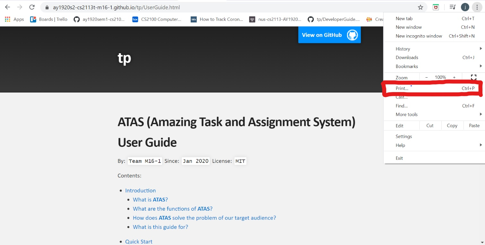
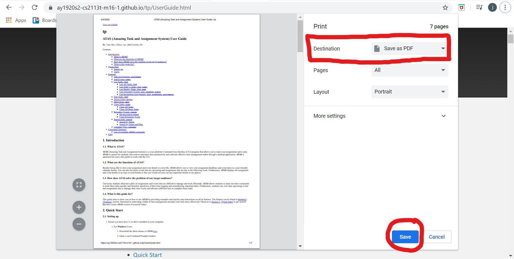
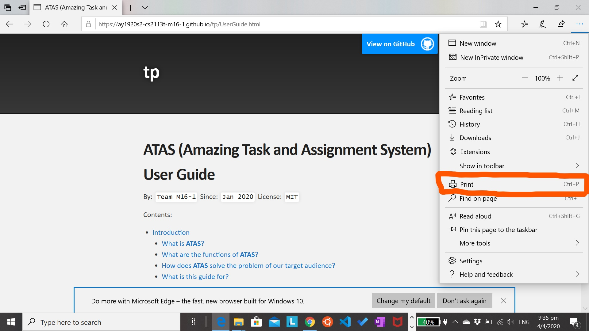
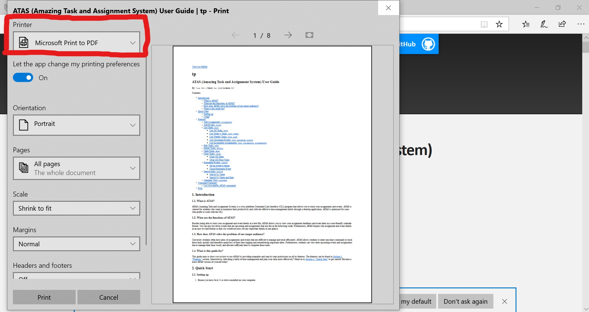

## ATAS - Documentation

### 1. Introduction
We use Markdown for writing documentation.

> **Note**:  
> We choose Markdown over asciidoc, although asciidoc provides more flexibility in formatting because Markdown is easier 
>to master for new developers, and also because it is easier to be deployed on GitHub Pages 

### 2. Editing documentation
See [here](https://www.markdownguide.org/getting-started/) to learn the basic syntax for Markdown.
To preview your changes to your Markdown documents, you could download the Markdown plugin for IntelliJ, that allows 
you to preview your changes real-time. Alternatively, you could push the changes to `GitHub` and view the changes from 
your commits. 

### 3. Editing diagrams
See [here](https://www.lucidchart.com/blog/getting-started-in-lucidchart) to learn how to use LucidCharts to draw your 
own diagrams.

### 4. Publishing Documentation
1.  Push the new documents to your own repository on github

2.  Make a pull request to [here](https://github.com/AY1920S2-CS2113T-M16-1/tp/pulls) to request for changes to be made to the 
documentation. (Click [here](https://help.github.com/en/github/collaborating-with-issues-and-pull-requests/creating-a-pull-request))
to learn how to make a pull request.

3. The moderators will review your change and make a decision if they want to use your changes

### 5. Converting Documentation to PDF format
1.  Click [here](https://ay1920s2-cs2113t-m16-1.github.io/tp/) to find the desired guides that you wish to convert to PDF format.
2.  For Google Chrome users:
    -   Go the `settings` icon and click on `print`
    
    -   In the print screen, choose the option `save as pdf` and click `save`
    
3.  For Windows users:
    -   Go the `settings` icon and click on `print`
    
    -   In the print screen, choose the option `Microsoft Print to PDF` and click `print`
    
    
