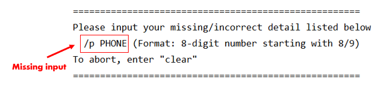
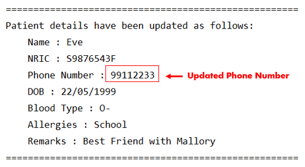

# HappyPills - User Guide
By: `Team CS2113T-T12-2` Since `March 2020` License: `MIT`

## Table of Content
* [3.2. General Patient Information Commands](#32-general-patient-information)
    + [3.2.1. Add Patient: `add patient`](#321-add-patient-add-patient)
    + [3.2.2. Edit Patient: `edit patient`](#322-edit-patient-edit-patient)
    + [3.2.3. Delete Patient: `delete patient`](#323-delete-patient-delete-patient)
    + [3.2.4. List All Patients: `list patient`](#324-list-all-patients-list-patient)
    + [3.2.5. Retrieve a Patient's Information: `get patient`](#325-retrieve-a-patients-information-get-patient)

<a href="https://ay1920s2-cs2113t-t12-2.github.io/tp/UserGuide.html"> &#8592; Back to Main </a>

<a href="https://ay1920s2-cs2113t-t12-2.github.io/tp/UserGuide-Records.html"> &#8594; Go to Medical Records </a>

### 3.2. General Patient Information

HappyPills can help users to manage their patients' information easily. 

#### 3.2.1. Add Patient: `add patient`

This feature allows you to add more patients into the existing patients' list.
 
HappyPills will prompt you if there are any missing fields and ask for confirmation before adding the patient's information into the patients's list.  
You can also add a new patient with the specified parameters in any order.

###### Usage Example:   

    add patient /ic NRIC /n NAME /p PHONE_NUMBER /dob DOB /b BLOOD_TYPE /a[ALLERGIES] /rm[REMARKS]
    
**Example:**

    add patient /ic S9876543F /n Eve /dob 22/05/1999 /b O-
    
>***Expected output:***
>
>
>
> Enter `/p 91265432` to add missing field.

<table>
  <col width="20">
  <col width="200">
 <tr>
   <td> &#8505; </td>
   <td>HappyPills will prompt you for missing details that are important.</td>
 </tr>
</table>

> ***Expected output:***
>
>   
>
> Enter `y` to confirm.

<table>
  <col width="20">
  <col width="200">
 <tr>
   <td> &#8505; </td>
   <td> Entering <code>n</code> will not save the patients' information when HappyPills prompt you for confirmation.</td>
    <!--This is a comment. Patient's information will be discarded if <code>n</code> is entered.-->
 </tr>
</table>

> ***Expected output:***
>    
>  

 [&#8593; Return to Top](#table-of-content)
 
#### 3.2.2. Edit Patient: `edit patient`

Edit information of the patient with the specified NRIC. 

##### Usage example: 
 
    edit patient NRIC /n<NAME> 
                      /p<PHONE_NUMBER> 
                      /dob<DOB> 
                      /b<BLOOD_TYPE> 
                      /a<ALLERGIES> 
                      /rm<REMARKS>

<table>
  <col width="20">
  <col width="200">
 <tr>
   <td> &#9888; </td>
   <td> You can only edit <code>one</code> field at a time. Those fields that can be edited are in <code><></code>. 
   There should <code>no spaces</code> between the tag and the edited information.</td>
 </tr>
</table>

**Example:**

    edit patient S9876543F /p99112233

> ***Expected output:***
>
> 

<table>
  <col width="20">
  <col width="200">
 <tr>
   <td> &#8505; </td>
   <td> NRIC <code>cannot</code> be edited because it is used to uniquely identify the patient.</td>
 </tr>
</table>

 [&#8593; Return to Top](#table-of-content)
 
#### 3.2.3. Delete Patient: `delete patient`

Delete a patient as specified by the NRIC. 

##### Usage example: 

    delete patient NRIC
    
**Example:**

    delete patient S1234567F

> ***Expected output:***
>
> 
>
> Enter `y` to confirm.

<table>
  <col width="20">
  <col width="200">
 <tr>
   <td> &#8505; </td>
   <td> HappyPills will <code>prompt for confirmation</code> before deleting patient in the patient list. </td>
 </tr>
</table>

> ***Expected output:***
>    
>  

<table>
  <col width="20">
  <col width="200">
 <tr>
   <td> &#9888; </td>
   <td> Upon <code>successful deletion</code>, patient's information will not be able to be retrieved again. </td>
 </tr>
</table>

 [&#8593; Return to Top](#table-of-content)

#### 3.2.4. List All Patients: `list patient`

Displays all the patients in the patient list. 

##### Usage example: 

    list patient
    
> ***Expected output:***
>
>   

 [&#8593; Return to Top](#table-of-content)

#### 3.2.5. Retrieve a Patient's Information: `get patient`

Retrieve details of the patient with the specified NRIC.

##### Usage example: 

    get patient NRIC
    
**Example:**

    get patient T9999999N
    
> ***Expected output:***
>
> 

 [&#8593; Return to Top](#table-of-content)
