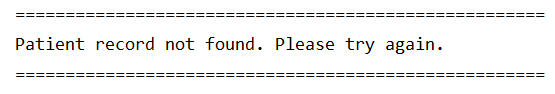
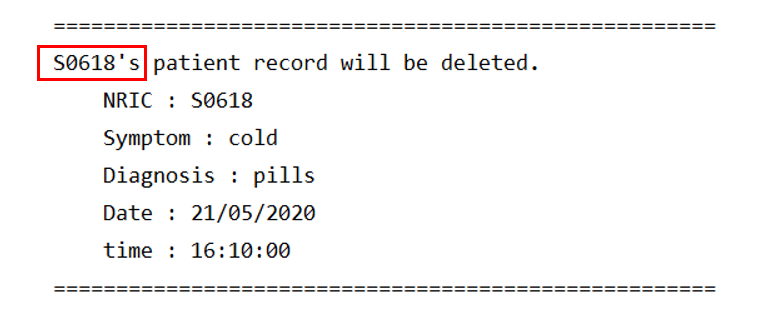

# HappyPills - User Guide
By: `Team CS2113T-T12-2` Since `March 2020` License: `MIT`

## Table of Content
* [3.3. Patient Medical Records Commands](#33-patient-medical-information-commands)
    + [3.3.1. Add Patient Records : `add pr`](#331-add-patient-records-add-pr)
    + [3.3.2. List Patient Records : `list pr`](#332-list-patient-records-list-pr)
    + [3.3.3. Find Patient Records : `find pr`](#333-find-patient-records-find-pr)    
    + [3.3.4. Edit Patient Records : `edit pr`](#334-edit-patient-records-edit-pr)
    + [3.3.5. Delete Patient Records : `delete pr`](#335-delete-patient-records-delete-pr)
    

<a href="https://ay1920s2-cs2113t-t12-2.github.io/tp/UserGuide-Main.html"> &#8592; Back to Main </a>

<a href="https://ay1920s2-cs2113t-t12-2.github.io/tp/UserGuide-Appointment.html"> &#8594; Go to Appointments </a>

### 3.3. Patient Medical Records 

#### 3.3.1. Add Patient Records: `add pr`

Add patient's medical records to the database, to support the diagnosis and to justify the treatment.

##### Usage example:

    add pr /ic NRIC /sym SYMPTOMS /diag DIAGNOSIS /d Date /t Time
    
**Example:**
    
    add pr /ic S0618 /sym ddd /diag dsfs /d 22/02/1992 /t 22:22:22

> ***Expected output:***
>
> 
>

> Enter `y` to confirm.

> ***Expected output:***
>
> 
>

 [&#8593; Return to Top](#Table-of-Content)

#### 3.3.2. List Patient Records: `list pr`

Displays all the patients record for a particular patient. 

##### Usage example:

    list pr NRIC

**Example:**
    
    list pr S0618
    
> ***Expected output:***
>
> 
>

<table>
  <col width="20">
  <col width="200">
 <tr>
   <td> &#8505; </td>
   <td>If the patient have no past record command. The message below will be printed instead.</td>
 </tr>
</table>

> ***Expected output:***
>
> 
>

 [&#8593; Return to Top](#Table-of-Content)
 
  
#### 3.3.5. Find Patient Records: `find pr`

Check all patient reports that the patient with the specified NRIC has. This can be used
to check for the index used for the other commands.

##### Usage example:

    find pr NRIC INDEX

**Example:**

    find pr s0618 1

> ***Expected output:***
>
>
>

<table>
  <col width="20">
  <col width="200">
 <tr>
   <td> &#8505; </td>
   <td>If the record is not found with the given input. The message below will be printed instead.</td>
 </tr>
</table>

> ***Expected output:***
>
>
>

 [&#8593; Return to Top](#Table-of-Content)
 
#### 3.3.2. Edit Patient Records: `edit pr`

Edit patient's medical records when there is any error in previous inputs.

##### Usage example:

    edit pr NRIC INDEX /sym [SYMPTOMS] /diag [DIAGNOSIS] /d [DATE] /t [TIME]
    
**Example:**

    edit pr s0618 1 /sym fever

> ***Expected output:***
>
> 

<table>
  <col width="20">
  <col width="200">
 <tr>
   <td> &#8505; </td>
   <td>If the record is not found with the given input. The message below will be printed instead.</td>
 </tr>
</table>

> ***Expected output:***
>
>
>

 [&#8593; Return to Top](#Table-of-Content)
 
#### 3.3.3. Delete Patient Records: `delete pr`

Delete patient's medical records based on the given NRIC and the index of records  . 

##### Usage example: 

    delete pr NRIC INDEX

**Example:**

> ***Expected output:***
>
> 

<table>
  <col width="20">
  <col width="200">
 <tr>
   <td> &#8505; </td>
   <td>If the record is not found with the given input. The message below will be printed instead.</td>
 </tr>
</table>

> ***Expected output:***
>
>
>

 [&#8593; Return to Top](#Table-of-Content)
