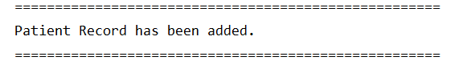
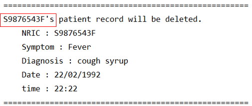

# HappyPills - User Guide
By: `Team CS2113T-T12-2` Since `March 2020` License: `MIT`

## Table of Content
* [3.3. Patient Medical Records Commands](#33-patient-medical-information-commands)
    + [3.3.1. Add Patient Records : `add pr`](#331-add-patient-records-add-pr)
    + [3.3.2. List Patient Records : `list pr`](#332-list-patient-records-list-pr)
    + [3.3.3. Find Patient Records : `find pr`](#333-find-patient-records-find-pr)    
    + [3.3.4. Edit Patient Records : `edit pr`](#334-edit-patient-records-edit-pr)
    + [3.3.5. Delete Patient Records : `delete pr`](#335-delete-patient-records-delete-pr)
    

<a href="https://ay1920s2-cs2113t-t12-2.github.io/tp/UserGuide.html"> &#8592; Back to Main </a>

<a href="https://ay1920s2-cs2113t-t12-2.github.io/tp/UserGuide-Appointment.html"> &#8594; Go to Appointments </a>

### 3.3. Patient Medical Records 

#### 3.3.1. Add Patient Records: `add pr`

Add patient's medical records to the database, to support the diagnosis and to justify the treatment.

<table>
  <col width="20">
  <col width="200">
 <tr>
   <td> &#9888; </td>
   <td> Patient's records can only be added if the patient information exists in the database. </td>
 </tr>
</table>

##### Format:

    add pr /ic NRIC /sym SYMPTOMS /diag DIAGNOSIS /d DATE /t TIME
    
**Example:**
    
    add pr /ic S9876543F /sym Cough /diag Fever /d 22/02/1992 /t 22:22

> ***Expected output:***
>
> 
>

> Enter `y` to confirm.

> ***Expected output:***
>
> 
>

 [&#8593; Return to Top](#table-of-content)

#### 3.3.2. List Patient Records: `list pr`

Displays all  patient records for the patient using his/her NRIC. Patient's records will be listed with their respective 
index which is needed for [find pr](#333-find-patient-records-find-pr), 
[edit pr](#334-edit-patient-records-edit-pr) and [delete pr](#335-delete-patient-records-delete-pr) commands.

##### Format:

    list pr NRIC

**Example:**
    
    list pr S9876543F
    
> ***Expected output:***
>
> 
>

<table>
  <col width="20">
  <col width="200">
 <tr>
   <td> &#8505; </td>
   <td>If the patient have no past medical records. The message below will be printed instead.</td>
 </tr>
</table>

> ***Expected output:***
>
> 
>

 [&#8593; Return to Top](#table-of-content)
 
  
#### 3.3.3. Find Patient Records: `find pr`

Display detailed information for that particular patient's visit using the NRIC and index of the patient's records 
which can obtained from the [list pr](#332-list-patient-records-list-pr) command. 

##### Format:

    find pr NRIC INDEX

**Example:**

    find pr S9876543F 2

> ***Expected output:***
>
>
>

<table>
  <col width="20">
  <col width="200">
 <tr>
   <td> &#8505; </td>
   <td>If no record is found with the given NRIC, the message below will be printed instead.</td>
 </tr>
</table>

> ***Expected output:***
>
>
>

 [&#8593; Return to Top](#table-of-content)
 
#### 3.3.4. Edit Patient Records: `edit pr`

Edit patient's past medical record using the index of the patient's records 
which can obtained from the [list pr](#332-list-patient-records-list-pr) command.

##### Format:

    edit pr NRIC INDEX /sym<SYMPTOMS> 
                       /diag<DIAGNOSIS> 
                       /d<DATE> 
                       /t<TIME>
                       
<table>
  <col width="20">
  <col width="200">
 <tr>
   <td> &#9888; </td>
   <td> You can only edit <code>one</code> field at a time. Those fields that can be edited are in <code><></code>. 
   There should <code>no spaces</code> between the tag and the edited information.</td>
 </tr>
</table>
    
**Example:**

    edit pr S9876543F 2 /t12:00

> ***Expected output:***
>
> 

<table>
  <col width="20">
  <col width="200">
 <tr>
   <td> &#8505; </td>
   <td>If the record is not found with the given input. The message below will be printed instead.</td>
 </tr>
</table>

> ***Expected output:***
>
>
>

 [&#8593; Return to Top](#table-of-content)
 
#### 3.3.5. Delete Patient Records: `delete pr`

Delete patient's medical records based on the given NRIC and the index of the patient's records 
which can obtained from the [list pr](#332-list-patient-records-list-pr) command.

##### Format:

    delete pr NRIC INDEX

**Example:**

    delete pr S9876543F 1

> ***Expected output:***
>
> 

<table>
  <col width="20">
  <col width="200">
 <tr>
   <td> &#8505; </td>
   <td>If the record is not found with the given input. The message below will be printed instead.</td>
 </tr>
</table>

> ***Expected output:***
>
>

 [&#8593; Return to Top](#table-of-content)
