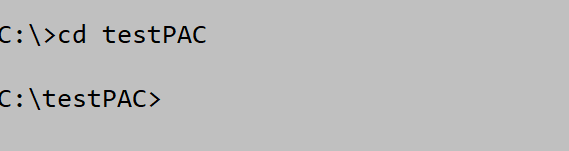

# User Guide

## Professor Assistant Console (Pac)

  

## Content Page  
1. [Introduction](#1-introduction)  
    1.1. [What is Pac?](#11-what-is-pac)  
    1.2. [Who are our audience?](#12-who-is-this-app-for)
2. [Setting Up](#2-setting-up)  
    2.1. [Requirements](#21-requirements)   
    2.2. [Startup using Command Line](#22-startup-using-command-line)  
3. [Quick Start](#3-quick-start)  
    3.1. [Using Pac](#31-using-pac)
4. [Features](#4-features)  
4.1. [Student List](#41-student)  
4.1.1. [Add New Student List](#411-add-new-student-list)        
4.1.2. [View Student List](#412-view-all-existing-student-lists-from-the-student-list-collection-student-list)  
4.1.3. [Clear Student List](#413-clear-all-existing-student-lists-from-the-student-list-collection-student-clear)   
4.1.4. [Delete Student List](#414-clear-all-existing-student-lists-from-the-student-list-collection-student-delete)  
4.1.5. [Find Student List](#415-find-existing-student-lists-from-the-student-list-collection-student-find)  
4.4.6. [Sort Student List by Name](#416-sort-all-names-within-the-existing-student-lists-from-the-student-list-collection-student-sort)  
4.4.7. [Sort Student List by List](#417-sort-all-existing-student-lists-from-the-student-list-collection-by-name-student-sort)  
4.2. [Event](#42-event)  
4.2.1. [Add New Event](#421-add-new-event)  
4.2.2. [View Event List](#422-list-events)  
4.2.3. [Delete Existing Event](#423-delete-event)      
4.2.4. [Edit Event -name](#424-edit-event-name)      
4.2.5. [Edit Event -datetime](#425-edit-event-datetime)      
4.2.6. [Edit Event -venue](#426-edit-event-venue)  
4.2.7. [Edit Event](#427-edit-event)    
4.3. [Calendar](#43-calendar)  
4.3.1 [View events in calendar format](#431-view-events-under-a-particular-time--calendar-s2-ay19-20)
4.4 [Attendance](#44-attendance)
4.4.1. [Add New Attendance](#441-add-students-attendance-to-event-attendance-attendance-add)    
4.4.2. [View Attendance List](#442-view-attendance-list-attendance-list)   
4.4.3. [Clear Attendance](#443-clear-attendance-list-attendance-clear)  
4.4.4. [Sort Attendance by name](#444-sort-attendance-list-by-name-attendance-sort)  
4.4.5. [Sort Attendance by status](#445-sort-attendance-list-by-status-attendance-sort)  
4.5. [Performance](#45-performance)     
4.5.1. [Add New Performance List](#451-add-performance-list)  
4.5.2. [Delete Current Performance List](#452-delete-performance-list)   
4.5.3. [View Performance List](#453-view-performance-list)   
4.5.4. [Edit Performance List](#454-edit-performance-list)
4.5.5. [Sort Performance List](#455-sort-performance-list)    
5. [Possible Console Messages and Reasons](#5-possible-console-messages-and-reasons)           
6. [FAQ](#6-faq)  
7. [Command Summary](#7-command-summary)  
8. [Contact Us](#8-contact-us)
  
## 1. Introduction

### 1.1. What is Pac?

Pac is a professor assistant console which helps you keep track of your 
upcoming events. Pac also allows you to add in attendance to keep track 
of your students and their grades. Being a simple Command Line Interface 
(CLI) application, Pac ensures its usability and suitability regardless 
of your expertise level.

### 1.2. Who is this app for?

Pac is well suited for professors, teachers or anyone in a teaching profession who  
prefers to use a CLI for managing events and students' data. If you can type fast,  
Pac can get your event management tasks done faster than traditional GUI apps. Interested?  
Jump to [Section 2](#2-setting-up) to get started. Enjoy! 

## 2. Setting Up

### 2.1. Requirements 
1.  Ensure you have [Java 11](https://www.oracle.com/java/technologies/javase-jdk11-downloads.html) 
or above installed in your Computer.
1.  Download the latest Pac-2.1.jar from [here](https://github.com/AY1920S2-CS2113T-T12-4/tp/releases).
1.  Copy the file to the folder you want to use as the home folder for this application.

### 2.2 Startup using Command Line
1.  Open your terminal.
1.  Navigate to the home folder containing Pac.
1.  cd followed by the file path into the terminal as shown below:  
    
1.  Type `java -jar Pac-2.1.jar` and press **Enter**.
1.  You should see this screen if everything is successful:    
    

##
## 3. Quick Start

### 3.1. Using Pac
You can type any command, then press **Enter** to execute it.
	
e.g. typing help then pressing **Enter** will open the help window.

Some example commands to try:
* `event list`			List all events
* `event add n/CS1010` 	Add an event named “CS1010”
* `student add`         Create a new student list
* `bye`				    Exits the app

Refer to [“Features”](#Features) for details of each command.

## 4. Features 

### 4.1. Student
This section for student related commands is done in chronological order. Please follow the numbering to get
a clearer understanding on how you can use the commands.

#### 4.1.1. Add New Student List `student.list add`

Creates a student list and adds it to the collection of student list that can be used for adding attendance and 
performance. Please note that you are allowed to add in duplicated names and that all names are CASE-SENSITIVE. 

Command: 

    >>> student.list add
    
Examples: 

    >>> student.list add
    What is the name of your list?
    >>> CS2113T Tut
    Please enter a student Name. If you are finished, enter done
    >>> John
    Please enter a student Name. If you are finished, enter done
    >>> Jodi
    Please enter a student Name. If you are finished, enter done
    >>> done
    Student List created, named : CS2113T Tut
    
#### 4.1.2 View all existing student lists from the student list collection `student view`
View all existing students lists from student list collection.
    
Command: 
    
    >>> student.list view
        
Examples: 
    
    >>> student.list view
    _________________________________________________________________________________________________
    | List #1   |  CS2113T Tut                                                                       |
    |___________|____________________________________________________________________________________|
    | 1         |  John                                                                              |
    |___________|____________________________________________________________________________________|
    | 2         |  Jodi                                                                              |
    |___________|____________________________________________________________________________________|
    _________________________________________________________________________________________________
    | List #2   |  CS2040C                                                                           |
    |___________|____________________________________________________________________________________|
    | 1         |  Alice                                                                             |
    |___________|____________________________________________________________________________________|
    | 2         |  Carl                                                                              |
    |___________|____________________________________________________________________________________|
    | 3         |  Bobby                                                                             |
    |___________|____________________________________________________________________________________|
    _________________________________________________________________________________________________
    | List #3   |  CG2028                                                                            |
    |___________|____________________________________________________________________________________|
    | 1         |  Ben                                                                               |
    |___________|____________________________________________________________________________________|
    | 2         |  Robert                                                                            |
    |___________|____________________________________________________________________________________|
    | 3         |  Sam                                                                               |
    |___________|____________________________________________________________________________________|
    | 4         |  Fiona                                                                             |
    |___________|____________________________________________________________________________________|
                
#### 4.1.3 Clear all existing student lists from the student list collection `student.list clear`
Clear all existing student lists from the student list collection. This is a clear all command. If you wish to delete 
a specific student list, please use the `student.list delete` instead.

Command: 
    
    >>> student.list clear
        
Examples: 
    
    >>> student.list clear
    The Student List Collection is cleared
    
#### 4.1.4 Clear all existing student lists from the student list collection `student.list delete`
Delete a specific student list from the student list collection base on its index. If you wish to delete all student 
lists in the student list collection, please use `student.list clear` instead.

Command: 

    >>> student.list delete
        
Examples: 
    
    >>> student.list delete
    Please state the index of the list you want to delete
    >>> 1
    Here is the updated Student List Collection
    _________________________________________________________________________________________________
    | List #1   |  CS2040C                                                                           |
    |___________|____________________________________________________________________________________|
    | 1         |  Alice                                                                             |
    |___________|____________________________________________________________________________________|
    | 2         |  Carl                                                                              |
    |___________|____________________________________________________________________________________|
    
    _________________________________________________________________________________________________
    | List #2   |  CG2028                                                                            |
    |___________|____________________________________________________________________________________|
    | 1         |  Ben                                                                               |
    |___________|____________________________________________________________________________________|
    | 2         |  Robert                                                                            |
    |___________|____________________________________________________________________________________|
    | 3         |  Sam                                                                               |
    |___________|____________________________________________________________________________________|
                
    
#### 4.1.5 Find existing student list(s) from the student list collection `student.list find`
Find existing student list(s) from student list collection base on keyword.
    
Command: 
    
    >>> student.list find
        
Examples: 
    
    >>> student.list find
    Please state the list name you are searching for
    >>> CS
    You have 2 matched:
    Here's the Search Result(s)
    
    [1]
    _________________________________________________________________________________________________
    | List      |  CS2113T Tut                                                                       |
    |___________|____________________________________________________________________________________|
    | 1         |  John                                                                              |
    |___________|____________________________________________________________________________________|
    | 2         |  Jodi                                                                              |
    |___________|____________________________________________________________________________________|
    
    [2]
    _________________________________________________________________________________________________
    | List      |  CS2040C                                                                           |
    |___________|____________________________________________________________________________________|
    | 1         |  Alice                                                                             |
    |___________|____________________________________________________________________________________|
    | 2         |  Carl                                                                              |
    |___________|____________________________________________________________________________________|
    | 3         |  Bobby                                                                             |
    |___________|____________________________________________________________________________________|

    
    >>> student.list find
    Please state the list name you are searching for
    >>> CG
    You have 1 matched:
    Here's the Search Result(s)
    
    [1]
    _________________________________________________________________________________________________
    | List      |  CG2028                                                                            |
    |___________|____________________________________________________________________________________|
    | 1         |  Ben                                                                               |
    |___________|____________________________________________________________________________________|
    | 2         |  Robert                                                                            |
    |___________|____________________________________________________________________________________|
    | 3         |  Sam                                                                               |
    |___________|____________________________________________________________________________________|
    | 4         |  Fiona                                                                             |
    |___________|____________________________________________________________________________________|
                
    >>> student.list find
    Please state the list name you are searching for
    >>> EG
    Nothing match you description : EG

#### 4.1.6 Sort all names within the existing student lists from the student list collection `student sort`
Sort all existing student lists from the student list collection by name. Regardless whether the lists are 
in order, this command will force all existing lists to be sorted by their list name within the student list collection.

Command: 
    
    >>> student.list sort
        
Examples:     

    >>> student.list view
    _________________________________________________________________________________________________
    | List #1   |  CS2113T Tut                                                                       |
    |___________|____________________________________________________________________________________|
    | 1         |  John                                                                              |
    |___________|____________________________________________________________________________________|
    | 2         |  Jodi                                                                              |
    |___________|____________________________________________________________________________________|
    _________________________________________________________________________________________________
    | List #2   |  CS2040C                                                                           |
    |___________|____________________________________________________________________________________|
    | 1         |  Alice                                                                             |
    |___________|____________________________________________________________________________________|
    | 2         |  Carl                                                                              |
    |___________|____________________________________________________________________________________|
    | 3         |  Bobby                                                                             |
    |___________|____________________________________________________________________________________|
    _________________________________________________________________________________________________
    | List #3   |  CG2028                                                                            |
    |___________|____________________________________________________________________________________|
    | 1         |  Ben                                                                               |
    |___________|____________________________________________________________________________________|
    | 2         |  Robert                                                                            |
    |___________|____________________________________________________________________________________|
    | 3         |  Sam                                                                               |
    |___________|____________________________________________________________________________________|
    | 4         |  Fiona                                                                             |
    |___________|____________________________________________________________________________________|
    
    >>> student.list sort
    Please Key in either 'name' or 'list'.
    >>> name
    Student List is sorted by name within the Student List Collection
    >>> student.list view
    _________________________________________________________________________________________________
    | List #1   |  CG2028                                                                            |
    |___________|____________________________________________________________________________________|
    | 1         |  Ben                                                                               |
    |___________|____________________________________________________________________________________|
    | 2         |  Robert                                                                            |
    |___________|____________________________________________________________________________________|
    | 3         |  Sam                                                                               |
    |___________|____________________________________________________________________________________|
    | 4         |  Fiona                                                                             |
    |___________|____________________________________________________________________________________|
    _________________________________________________________________________________________________
    | List #2   |  CS2040C                                                                           |
    |___________|____________________________________________________________________________________|
    | 1         |  Alice                                                                             |
    |___________|____________________________________________________________________________________|
    | 2         |  Carl                                                                              |
    |___________|____________________________________________________________________________________|
    | 3         |  Bobby                                                                             |
    |___________|____________________________________________________________________________________|
    _________________________________________________________________________________________________
    | List #3   |  CS2113T Tut                                                                       |
    |___________|____________________________________________________________________________________|
    | 1         |  John                                                                              |
    |___________|____________________________________________________________________________________|
    | 2         |  Jodi                                                                              |
    |___________|____________________________________________________________________________________|
    
    
#### 4.1.7 Sort all existing student lists from the student list collection by name `student sort`
Sort all existing student lists from the student list collection by name. Regardless whether the lists are 
in order, this command will force all existing lists to be sorted by their name.
    
    >>> student.list sort
    _________________________________________________________________________________________________
    | List #1   |  CG2028                                                                            |
    |___________|____________________________________________________________________________________|
    | 1         |  Ben                                                                               |
    |___________|____________________________________________________________________________________|
    | 2         |  Robert                                                                            |
    |___________|____________________________________________________________________________________|
    | 3         |  Sam                                                                               |
    |___________|____________________________________________________________________________________|
    | 4         |  Fiona                                                                             |
    |___________|____________________________________________________________________________________|
    _________________________________________________________________________________________________
    | List #2   |  CS2040C                                                                           |
    |___________|____________________________________________________________________________________|
    | 1         |  Alice                                                                             |
    |___________|____________________________________________________________________________________|
    | 2         |  Carl                                                                              |
    |___________|____________________________________________________________________________________|
    | 3         |  Bobby                                                                             |
    |___________|____________________________________________________________________________________|
    _________________________________________________________________________________________________
    | List #3   |  CS2113T Tut                                                                       |
    |___________|____________________________________________________________________________________|
    | 1         |  John                                                                              |
    |___________|____________________________________________________________________________________|
    | 2         |  Jodi                                                                              |
    |___________|____________________________________________________________________________________|
    
    >>> student.list sort
    Please Key in either 'name' or 'list'.
    >>> list
    StudentList sorted by name within the lists
    >>> student.list list
    _________________________________________________________________________________________________
    | List #1   |  CG2028                                                                            |
    |___________|____________________________________________________________________________________|
    | 1         |  Ben                                                                               |
    |___________|____________________________________________________________________________________|
    | 2         |  Fiona                                                                             |
    |___________|____________________________________________________________________________________|
    | 3         |  Robert                                                                            |
    |___________|____________________________________________________________________________________|
    | 4         |  Sam                                                                               |
    |___________|____________________________________________________________________________________|
    _________________________________________________________________________________________________
    | List #2   |  CS2040C                                                                           |
    |___________|____________________________________________________________________________________|
    | 1         |  Alice                                                                             |
    |___________|____________________________________________________________________________________|
    | 2         |  Bobby                                                                             |
    |___________|____________________________________________________________________________________|
    | 3         |  Carl                                                                              |
    |___________|____________________________________________________________________________________|
    _________________________________________________________________________________________________
    | List #3   |  CS2113T Tut                                                                       |
    |___________|____________________________________________________________________________________|
    | 1         |  Jodi                                                                              |
    |___________|____________________________________________________________________________________|
    | 2         |  John                                                                              |
    |___________|____________________________________________________________________________________|
    
     
### 4.2. Event
#### 4.2.1. Add New Event
Add a new event to the event list. 

Format: `event add n/NAME [d/DATE t/TIME] [v/VENUE]`

* Name and Venue accepts input with spaces.
* Date and Time must either be provided together, or not provided at all. 
* The Date should be in the format: yyyy-mm-dd.  
* The Time should be in the 24-hour format: HHmm.
* Flags can be arranged in any order.
 
Examples: 

    >>> event add n/dinner with collegue
    >>> event add n/World Cup d/2022-11-21 t/0000
    >>> event add n/soccer match v/Kallang d/2020-01-23 t/1900
    
Expected outcome:

    New Event: dinner with collegue was added successfully to your Event list.
    New Event: World Cup was added successfully to your Event list.
    New Event: soccer match was added successfully to your Event list.

#### 4.2.2. List Events
List all events.

Format: `event list`

Expected outcome:

    Here are all the events in your list.
    1. Event: dinner with collegue
    2. Event: World Cup, time: Nov 21 2022 0000
    3. Event: soccer match, time: Jan 23 2020 1900, venue: Kallang

#### 4.2.3. Delete Event
Delete an existing event from the event list.

Format: `event delete i/INDEX`

Examples:

    >>> event delete i/3
    >>> event delete i/4
    
Expected outcome:

    Event: soccer match was deleted successfully from your Event list.
    Index not found
    
#### 4.2.4. Edit Event Name
Change the name of an existing event.

Format: `event editname i/INDEX n/NEW_NAME`
* alphabet cases for the command is not important

Examples:

    >>> event editname i/1 n/lunch with colleague
    
Expected outcome:

    Your Event name was changed from |dinner with collegue| to |lunch with colleague|.
    
#### 4.2.5. Edit Event Datetime
Change the date and time of an existing event. 
   
Format: `event editdatetime i/INDEX d/NEW_DATE t/NEW_TIME`
* alphabet cases for the command is not important.    
* The date should be in the format: yyyy-mm-dd.  
* The time should be in the 24-hour format: HHmm.

Examples:

    >>> event editdatetime i/1 d/2020-03-23 t/1200
    
Expected outcome:

    Your Event date and time was changed from || to |2020-03-23 1200|.
    Event: lunch with colleague, time: Mar 23 2020 1200
    
#### 4.2.6. Edit Event Venue
Change the venue of an existing event.

Format: `event editvenue i/INDEX v/NEW_VENUE`
* alphabet cases for the command is not important

Examples:

    >>> event editvenue i/1 v/Marina Bay Sands
    
Expected outcome:

    Your Event venue was changed from || to |Marina Bay Sands|.
    Event: lunch with colleague, time: Mar 23 2020 1200, venue: Marina Bay Sands

#### 4.2.7. Edit Event
Change an existing event.

Format: `event editevent i/INDEX n/NEW_NAME [t/NEW_TIME d/NEW_DATE] [v/NEW_VENUE]`
* alphabet cases for the command is not important

Examples:

    >>> event editevent i/1 n/lunch by myself v/home
    
Expected outcome:

    Your Event was edited from |Event: lunch with colleague, time: Mar 23 2020 1800, venue: Marina Bay Sands| to |Event: lunch by myself, venue: home|.

### 4.3 Calendar 
#### 4.3.1 View events under a particular time : `calendar s/2 ay/19-20`  
View existing events under a particular semester and academic year in a calendar format.
Semester refers to a numerical number, i.e. 1 or 2, while academic year refers 
to any 2 consecutive years with a hyphen separating them. Each year should be entered in a 2 digit format,
i.e. ay/07-08.

Format: `calendar s/SEMESTER ay/YY_ONE-YY_TWO `
* Both the semester and academic year should be provided.
* Order of the flags *matters*.

Command: 
    
    >>> calendar s/2 ay/19-20
    
Example: 

     ___________________________________________________________________________________________________________________________________ 
                                                             SEMESTER 2 AY 19/20 
     ___________________________________________________________________________________________________________________________________ 
    | JAN                 | FEB                 | MAR                 | APR                 | MAY                 | JUN                 |
    |_____________________|_____________________|_____________________|_____________________|_____________________|_____________________|
    | 13th [E]: orient... | 1st [E]: present... | 13th [E]: midterms  | 4th [S]: covid19    | 4th [E]: finals     |                     |
    |_____________________|_____________________|_____________________|_____________________|_____________________|_____________________|
    |                     |                     |                     | 5th [E]: birthday   |                     |                     |
    |_____________________|_____________________|_____________________|_____________________|_____________________|_____________________|
     

### 4.4 Attendance
This section for attendance related commands is done in chronological order. Please follow the numbering to get
a clearer understanding on how you can use the commands.

#### 4.4.1 Add students’ attendance to event: attendance `attendance add`

Add a student’s attendance to the attendance list.  
This is a step by step command and you may follow the instructions given by the console. 
You may wish to use an existing list found in StudentListCollection.

Please note that if there are existing students in the attendance list of the chosen event, it will add to the existing
students list. If you wish to start a new attendance list of the chosen event, please use `attendance clear` to clear 
the attendance list first.

Command:  `attendance add`
    
Example:

    >>> attendance add
    Please key in the name of event.
    >>> CS1010 Tutorial
    
If the event is found, you can choose to add the student's attendance by manually key in each student, or you may choose
the alternative provided by Pac: record using an existing name list located under StudentListCollection. 
Do note that you need to have an existing name list before you are using this shortcut.  
The following will show a success example of *using an existing name list to add attendance*. 

    Would you like to import an existing student list? If yes, input 'yes'. Else, input anything.
    >>> yes
    Please choose the name list you wish to use by its index.
    >>> 1    
    Please key in the attendance status for student Jodi Doe [Y/N].
    >>>  N
    Attendance of Jodi Doe (Absent) has been taken successfully under event Event1
    ...

The following will show a success example of *creating a new attendance list*.

    Would you like to import an existing student list? If yes, input 'yes'. Else, input anything.
    >>> no
    Please key in student name.
    >>> John Doe
    Please key in the student's attendance status [Y/N].
    >>> Y
    Attendance of John Doe (Present) has been taken successfully under event Event1
    ...
    
#### 4.4.2 View attendance list: `attendance list`

View the attendance list under a certain event.  

Command:  `attendance list`
    
Example:

    >>> attendance list
    Please key in the name of event.
    >>> CS1010 Tutorial
    _________________________________________________________________________________________________
    | index     |  Name of Student                    |  Attendance Status                          |
    |___________|_____________________________________|_____________________________________________|
    | 1         |  John Doe                           |  Present                                    |
    |___________|_____________________________________|_____________________________________________|
    | 2         |  Jodi Doe                           |  Absent                                     |
    |___________|_____________________________________|_____________________________________________|
    
#### 4.4.3 Clear attendance list: `attendance clear`

Clear the attendance list under a certain event.  Attendance list is cleared regardless whether 
the attendance list under the event is empty.

Command:  `attendance clear`
    
Example:

    >>> attendance list
    Please key in the name of event.
    >>> CS1010 Tutorial
    Attendance List cleared for Event: event1
            
#### 4.4.4 Sort attendance list by name: `attendance sort`

Sort the attendance list by name in alphabetical order under a certain event.  

Command:  `attendance sort`
    
Example:

    >>> attendance sort
    Please Key in either 'name' or 'status'.
    >>> name
    Please key in the name of event.
    >>> CS1010 Tutorial
    Attendance List is sorted by name for Event: event1
    
#### 4.4.5 Sort attendance list by status: `attendance sort`

Sort the attendance list by attendance status under a certain event with student that are absent on the top.  

Command:  `attendance sort`
    
Example:

    >>> attendance sort
    Please Key in either 'name' or 'status'.
    >>> name
    Please key in the name of event.
    >>> CS1010 Tutorial
    Attendance List is sorted by attendance status for Event: event1
    
### 4.5. Performance
#### 4.5.1. Add Performance List
Add a student’s result to the performance list.  
This is a step by step command and you may follow the instructions given by the console. 

Format: `performance add`
    
Step by step guide: 

    >>> performance add
    Please key in the name of event that you wish to access to its student's performance. 
    >>> event
    
If the event is found, you can choose to add the student's result by manually key in each student, or you may choose
the alternative provided by Pac: record using a current name list. Do note that you have to have an existing name list 
before you are using this short cut.  
The following will show a success example of using a current name list to add performance. 

    Would you like to import an existing student list? If yes, input 'yes'. Else, input anything.
    >>> yes
    Please choose the name list you wish to use. (shows a list of list names)
    >>> 1
    Please key in the result for student (student1 name)
    >>> A
    The result of student (student name) has been added successfully under event (event name)
    Please key in the result for student (student2 name)
    ...
*Note: All commands above are not case sensitive.*

#### 4.5.2. Delete Performance List
Delete a student’s result to the performance list.  
This is a step by step command and you may follow the instructions given by the console.  

Format: `performance delete`
    
Step by step guide: 

    >>> performance delete
    Please key in the name of event that you wish to access to its student's performance. 
    >>> event
    Please key in the name of student that you wish to delete his/her performance 
    >>> name
    The result of student (name) has been deleted successfully under event event.
*Note: All commands above are not case sensitive.*

#### 4.5.3. View Performance List
View the list of students' result under a certain event.  
This is a step by step command and you may follow the instructions given by the console. 

Format: `performance view`
    
Step by step guide: 

    >>> performance view
    Please key in the name of event that you wish to access to its student's performance.
    >>> event
    (example of Table format list is shown below)
    _________________________________________________________________________________________________
    | index     |  Name of Student                    |  Result                                     |
    |___________|_____________________________________|_____________________________________________|
    | 1         |  XX                                 |  A                                          |
    |___________|_____________________________________|_____________________________________________|
*Note: All commands above are not case sensitive.*

#### 4.5.4. Edit Performance List
Edit the list of students' result under a certain event.  
This is a step by step command and you may follow the instructions given by the console. 
During the process, you can choose to edit either student's name or result.

Format: `performance edit`
    
Step by step guide to edit name: 

    >>> performance edit
    Please key in the name of event that you wish to access to its student's performance.
    >>> event
    Please key in the name of student that you wish to edit his/her performance 
    >>> Alice
    Please key in the type of performance parameter you want to edit: name / result
    >>> name ***
    Please key in the student's new name
    >>> Carl
    The student name has been changed to Carl successfully.
You can follow the same procedure to edit result, but change your input from
`name` to `result` at the `***` line.

*Note: All commands above are not case sensitive.*

#### 4.5.5. Sort Performance List
Sort the list of students' result under a certain event.  
This is a step by step command and you may follow the instructions given by the console. 
During the process, you can choose to sort by either student's name or result.

Format: `performance sort`
    
Step by step guide to edit name: 

    >>> performance sort
    Please key in the name of event that you wish to access to its student's performance.
    >>> event
    Please key in the name of student that you wish to edit his/her performance 
    >>> Alice
    Do you want to sort by students' name or result?
    >>> name ***
    Performance List is sorted by Performance name for Event:  event
    
You can follow the same procedure to sort by result, but change your input from
`name` to `result` at the `***` line.  

*Note: All commands above are not case sensitive.*

## FAQ

## 5. Possible Console Messages and Reasons:  
1. If you entered a wrong command type, ie. not specifying 
which category your command belongs to

       Please provide a valid command category. Refer to 'help' for more info.

1. If you entered two flags, i.e. n/work n/presentation:

       EventParser: Duplicate name flag 

1. If you did not enter any flag, ie. event add: 

       Argument is required for command 'add'

1. If there are no events in the list:    
        
       The event list is empty
    
1. If event cannot be found in the list:
           
       Event is not found in the list.
       
1. If there is no students' data in the student list:
       
       There is no existing student list.
    
1. If there are no events under a calendar for a particular semester in its academic year:

       Unable to find any events for this time period.
       
1. If there is no performance' data under a event:

       No performance list under this event
       _________________________________________________________________________________________________
       | index     |  Name of Student                                   |  Result                      |
       |___________|____________________________________________________|______________________________|
           
## 6. FAQ

**Q**: How do I transfer my data to another computer? 

**A**: It is not possible to save data locally and transfer another computer at this version. 
Future patches will allow users to save their data and use it on another computer.

---

**Q**: How do i get a calendar view of the whole year? 

**A**: It is not possible to view all the 12 months as this application is geared towards a professors schedule. Therefore,
you can only view events under a particular semester and academic year. 

---

**Q**: Why is there only one type of event, ie. seminar in this application? 

**A**: We wanted to only distinguish between seminar and events in this version. Future patches will 
allow users to add more types of events in this application. 

---

**Q**: Why does pac use different types of command for different features, i.e.
step-by-step command for performance and all-in-one command for event?

**A**: We want to enhance user experience when using pac, and believe that 
 implementing step-by-step command will do so by reducing the number of flags
 and command format a user has to remember, making it easier for using pac.  
 Currently, features in performance, attendance and student list are using
 step-by-step command, and we will synchronise the command type according to 
 future feedback to fit user needs.    

---

## 7. Command Summary

{Give a 'cheat sheet' of commands here}

* Add student list `student.list add`
* View student list `student.list view`
* Clear student list `student.list clear`
* Delete student list `student.list delete`
* Find student list `student list.find`
* Sort student list `student list.sort`
* Add event `event add n/NAME d/DATE t/TIME v/VENUE`
* list events `event list`
* Edit name of existing event `event editname i/INDEX n/NAME`
* Edit date and time of existing event `event editdatetime i/INDEX d/DATE t/TIME`
* Edit venue of existing event `event editvenue i/INDEX v/VENUE`
* Delete event `event delete i/INDEX`
* View calendar `calendar s/SEMESTER ay/YEAR_ONE-YEAR_TWO`
* Add attendance `attendance add`
* View attendance list `attendance list`
* Clear attendance list `attendance clear`
* Sort attendance list `attendance sort`
* Add performance `performance add`
* View performance list `performance list`
* Delete performance of a student `performance delete`
* Edit performance of a student `performance edit`
* Sort performance of a student `performance sort`

## 8. Contact Us
If you have further queries or feedback on Pac, please contact us at [contact_us@pac.com](contact_us@Pac.com)