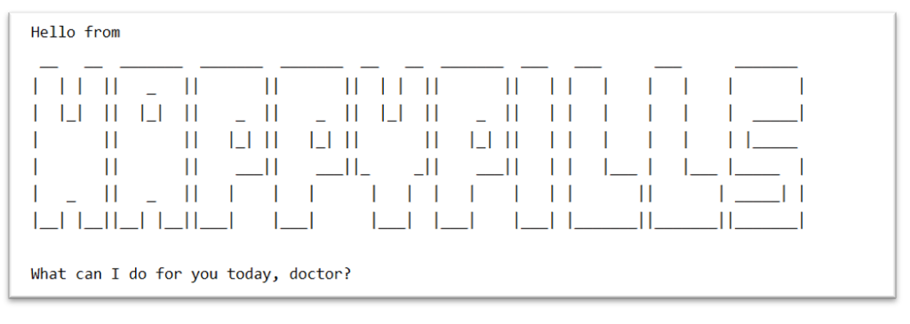

# HappyPills - User Guide
By: `Team CS2113T-T12-2` Since `March 2020` License: `MIT`

## Table of Content
- [1. Introduction](#1-introduction)
- [2. Quick Start](#2-quick-start)
- [3. Features](#3-features)
    * [3.1. General Commands](#31-general-commands)
        + [3.1.1. View help: `help`](#311-view-help-help)
        + [3.1.2. Exit program: `exit`](#312-exit-program-exit)        
    * [3.2. General Patient Information Commands](UserGuide-Patient.md) 
    * [3.3. Patient Medical Records Commands](UserGuide-Records.md)    
    * [3.4. Appointment Scheduling Commands](UserGuide-Appointment.md)
- [4. Command Summary](#4-command-summary)
- [5. Useful Links](#5-useful-links)

## 1. Introduction 

HappyPills is a note-taking application that allows doctors to take down notes using Command Line Interface (CLI).
  
The application replaces all physical papers and is highly optimised for fast typing users.    
If you can type fast, HappyPills can help you to manage patients’ records **faster** than traditional Graphical 
User Interface (GUI) applications.    
All notes are **neatly organised** in HappyPills so that all your important information are **safely stored**.  
Say **HELLO** to neater desks and time-saving electronic notes with HappyPills! &#128522;

## 2. Quick Start
**Installation**
1. Ensure that you have `Java 11` or above installed in your computer. 
2. Click [here](https://github.com/AY1920S2-CS2113T-T12-2/tp/releases) to download the HappyPills JAR File.
3. Copy the file to the folder you want to use as your home folder for HappyPills.

**For all users**
1. Open Command Prompt in the directory where the JAR file is located.
2. Run the command `java -jar happypills.jar`.

3. When you start the application for the first time, you can type `help` to check all the available commands.
4. Refer to [here](#3-features) for detailed instructions on how to use each command.

## 3. Features

HappyPills have three main features: `Patient Details`, `Patient Records` and `Appointment Scheduling`. 

`Patient Details` notes down the general details of the patient. (e.g. NRIC, name, phone number, date of birth, 
blood type and allergies).

`Patient Records` documents the patient's previous visits to the doctor and includes detailed information of those visits
(e.g. patient's symptoms, diagnosis and date/time of the medical treatment).

`Appointment Scheduling` helps the you schedule future appointments with your patients. 

These features come together to help you easily manage their patients' information. You can now provide their patients 
with better service by being able to retrieve their patients' information quickly and easily.  

This section will elaborate more on how to use these features in HappyPills. 

### Command Format
- Words in `UPPER_CASE` are the parameters to be supplied by you **e.g.** in `add patient /ic NRIC`, `NRIC` is the input required from you.
- In case a tag is used multiple times in a command then its last instance will be taken and the previous instances will be overwritten.
- Items in square brackets are optional fields **e.g.** `/ic NRIC /a [ALLERGIES]` can be used as `/ic S1234567F` or as `/ic S1234567F /a Dust`
- Items in angle brackets indicates that only one field can be supplied at each time **e.g.** `/n<NAME> /p<PHONE_NUMBER> /dob<DOB>` can be used as `/nYAP` or `/p91122334` or `/dob18/06/2020`
- Parameters can be in any order **e.g.** if the command requires `/n NAME /ic NRIC` or `/ic NRIC /n NAME `
- All commands are case insensitive **e.g.** `help` or `HELP` or `HeLp` will display all the commands and their usage.

### Legend For Tags
- `/n` → Patient's Name

- `/ic` → Patient's NRIC

- `/p` → Patient's Phone Number

- `/dob` → Patient's Date of birth

- `/b` → Patient's Blood type

- `/a` → Patient's Allergies

- `/rm` → Patient's Remarks

- `/t` → Time of the Patient's appointment

- `/d` → Date of the Patient's appointment

- `/r` → Reason for the Patient's appointment

- `/sym` → Patient's Symptoms

- `/diag` → Patient's Diagnosis

### 3.1. General Commands 

#### 3.1.1. View Help: `help`

Displays the list of commands and their syntax.

###### Usage example:

Format: `help`

>***Expected output:***
> 
> 
>

<table>
  <col width="20">
  <col width="200">
 <tr>
   <td> &#8505; </td>
   <td>The help command is split into four different sections <code>(highlighted by the boxes)</code>.</td>
 </tr>
</table>

 [&#8593; Return to Top](#table-of-content)

#### 3.1.2. Exit program: `exit`

Exits the program and ends the current session. 

##### Usage example:

Format: `exit`

>***Expected output:***
> 
> 

 [&#8593; Return to Top](#table-of-content)

### [3.2. General Patient Information Commands](UserGuide-Patient.md) 

### [3.3. Patient Medical Records Commands](UserGuide-Records.md)    

### [3.4. Appointment Scheduling Commands](UserGuide-Appointment.md)

## 4. Command Summary

#### General Patient Information

**Command** | **Format**
--------|----------
Add a patient's information | `add patient /ic NRIC /n NAME /p PHONE_NUMBER /dob DOB /b BLOOD_TYPE /a [ALLERGIES] /rm [REMARKS]`
Edit a patient's information |  `edit patient NRIC /n<NAME> or /p<PHONE_NUMBER> or /dob<DOB> or /b<BLOOD_TYPE> or /a<ALLERGIES> or /rm<REMARKS>`
list all patients | `list patient`
Retrieve a patient's information | `get patient NRIC`

#### Patient Medical Records

**Command** | **Format**
--------|----------
 Add a Patient Record |`add pr /ic NRIC /sym SYMPTOMS /diag DIAGNOSIS /d DATE /t TIME`
 List all Patient Records |`list pr NRIC`
 Find a Patient Record|`find pr NRIC INDEX`
 Edit a Patient Record |`edit pr NRIC INDEX /sym<SYMPTOMS> or /diag<DIAGNOSIS> or /d<DATE> or /t<TIME>`
 Delete a Patient Record | `delete pr NRIC INDEX`

#### Appointments

**Command** | **Format**
--------|----------
Add an appointment | `add appt /ic NRIC /d DATE /t TIME /r REASON`
Edit an appointment | `edit appt NRIC /d DATE /t TIME /r REASON`
Delete an appointment | `delete appt NRIC APPT_ID`
Mark an appointment as done | `done appt NRIC APPT_ID`
List all appointments | `list appt`
Find an appointment| `find appt NRIC`

 [&#8593; Return to Top](#table-of-content)

## 5. Useful links:
* [Developer Guide](DeveloperGuide.md)
* [About Us](AboutUs.md)

 [&#8593; Return to Top](#table-of-content)
