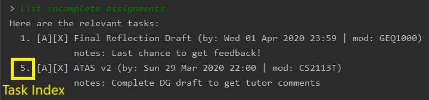
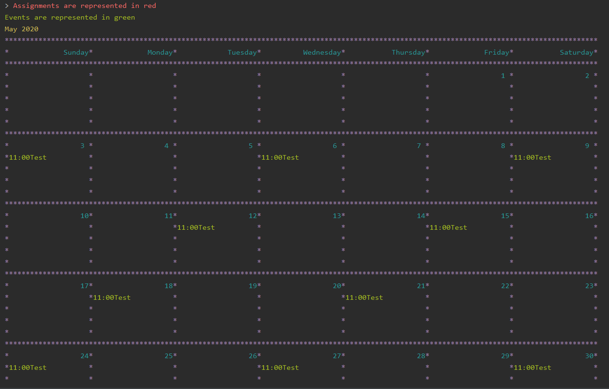

# ATAS (Amazing Task and Assignment System) User Guide
By: `Team M16-1` Since: `Jan 2020` License: `MIT`

Contents:
1. [Introduction](#1-introduction)
    * [What is **ATAS**?](#11-what-is-atas)
    * [What are the functions of **ATAS**?](#12-what-are-the-functions-of-atas)
    * [How does **ATAS** solve the problem of our target audience?](#13-how-does-atas-solve-the-problem-of-our-target-audience)
    * [What is this guide for?](#14-what-is-this-guide-for)
2. [Quick Start](#2-quick-start)
    * [Setting up](#21-setting-up)
    * [Usage](#22-usage)
3. [Features](#3-features)
    * [Add Assignments: **`assignment`**](#31-add-assignments-assignment)
    * [Add Events: **`event`**](#32-add-events-event)
    * [Repeating Events: **`repeat`**](#33-repeating-events-repeat)
        + [Set an event to repeat](#331-set-an-event-to-repeat)
        + [Unset Repeating Event](#332-unset-repeating-event)
    * [List Tasks: **`list`**](#34-list-tasks-list)
        + [List All Tasks: **`list`**](#341-list-all-tasks-list)
        + [List Today’s Tasks: **`list today`**](#342-list-todays-tasks-list-today)
        + [List Weekly Tasks: **`list week`**](#343-list-weekly-tasks-list-week)
        + [List Upcoming Events: **`list upcoming events`**](#344-list-upcoming-events-list-upcoming-events)
        + [List Incomplete Assignments: **`list incomplete assignments`**](#345-list-incomplete-assignments-list-incomplete-assignments)
    * [Edit Tasks: **`edit`**](#35-edit-tasks-edit)
    * [Delete Tasks: **`delete`**](#36-delete-tasks-delete)
    * [Mark Done: **`done`**](#37-mark-done-done)
    * [Clear Tasks: **`clear`**](#38-clear-tasks-clear)
        + [Clear All Tasks](#381-clear-all-tasks)
        + [Clear All Done Tasks](#382-clear-all-done-tasks)
    * [Search tasks: **`search`**](#39-search-tasks-search)
        + [Search by Name](#391-search-by-name)
        + [Search by Name and Date](#392-search-by-name-and-date)
    * [Calendar View: **`calendar`**](#310-calendar-view-calendar)
4. [Command Summary](#4-command-summary)
    * [List of available **ATAS** commands](#41-list-of-available-atas-commands)
5. [FAQ](#5-faq)

## 1. Introduction
### 1.1. What is **ATAS**?
**ATAS** (Amazing Task and Assignment System) is a cross platform Command Line Interface (CLI) programme that allows you to track your assignments and events. **ATAS** is catered for students who want to maximise their productivity and cultivate effective time management habits through a desktop application. **ATAS** is optimised for users who prefer to work with the CLI.
### 1.2. What are the functions of **ATAS**?
Besides being able to store your assignment and event details in a text file, **ATAS** allows you to view your assignment deadlines and event dates in a user-friendly calendar format. You can also list down events that are upcoming and assignments that are due in the following week. Furthermore, **ATAS** displays the assignment and event details in an easy-to-read format so that you will not miss out any important details at one glance.
### 1.3. How does **ATAS** solve the problem of our target audience?
University students often have piles of assignments and events that are difficult to manage and track efficiently. **ATAS** allows students to enter one-liner commands to track these tasks quickly and therefore spend less of their time logging and remembering important dates. Furthermore, students can view their upcoming events and assignments due, to manage their time wisely and allocate sufficient time to complete these tasks.
### 1.4. What is this guide for?
This guide aims to show you how to use **ATAS** by providing examples and step-by-step instructions on all its features. The features can be found in [Section 3. "Features"](#3-features) section.
Interested in cultivating a habit of time management and plan your time more effectively? Head on to [Section 2. "Quick Start"](#2-quick-start) to get started! Become a more **ATAS** version of yourself today!
## 2. Quick Start [Qi Ren]
### 2.1. Setting up
1.  Ensure you have Java 11 or above installed on your computer.

    1.  For **Windows** Users:

        1.  Download the **latest** release of **ATAS** [here](https://github.com/AY1920S2-CS2113T-M16-1/tp/releases).

        2.  Open a `cmd` (Command Prompt) window and maximise the window.

        3.  Navigate to the folder containing downloaded jar file.

        4.  Run the command `java -jar atas.jar`. You will be greeted with the welcome screen of **ATAS** in a few seconds.
        > **Note**: Replace `atas.jar` with the filename of the jar file. For example if the file name is `atas-2.0.0.jar`, run command 
        `java -jar atas-2.0.0.jar`.

    2.  For **Mac** Users:

        1.  Download the **latest** release of **ATAS** [here](https://github.com/AY1920S2-CS2113T-M16-1/tp/releases).

        2.  Open up `Terminal` and maximise the window.

        3.  Navigate to the directory containing downloaded jar file.

        4.  Run the command `java -jar atas.jar`. You will be greeted with the welcome screen of **ATAS** in a few seconds.
        > **Note**: Replace `atas.jar` with the filename of the jar file. For example if the file name is `atas-2.0.0.jar`, run command 
                `java -jar atas-2.0.0.jar`.                                                                                                                                                                                                                                                                                                                                                                                                                                                                                                                                                                                                                                                                                                                                                                                         
                                                                                                                                                                                                                                                                                                                                                                                                            
    3. For **Linux** Users:
        1. Download the **latest** release of **ATAS** [here](https://github.com/AY1920S2-CS2113T-M16-1/tp/releases).
         
        2. Open up `Terminal` and maximise the window.
        
        3. Navigate to the directory containing the downloaded jar file.
        
        4. Run the command `java -jar atas.jar`. You will be greeted with the welcome screen of **ATAS** in a few seconds. 
         > **Note**: Replace `atas.jar` with the filename of the jar file. For example if the file name is `atas-2.0.0.jar`, run command 
                        `java -jar atas-2.0.0.jar`. 
                                                                                                                                                                                                                                                                                                                                                                                                               
### 2.2. Usage
1.  To use **ATAS**, simply type a valid command into the terminal and press `[Enter]` key  run the command.  
    e.g. Typing `help` command and pressing `[Enter]` key will list the commands present

2.  Some example commands you can try to get familiar with **ATAS**:

    -   `help`: Lists the commands that **ATAS** supports.
    -   `assignment n/Assignment One m/CS2113T d/01/01/20 1600 c/Important Assignment`: Adds an assignment called **Assignment one** for the module **CS2113T**. This assignment is due on **01/01/2020 1600** and the comments for this assignment is that it is an **Important Assignment**.
    -   `exit`: Exits **ATAS**.

A summary of all the features available in **ATAS** can be found in [Section 4. Command Summary](#41-list-of-available-atas-commands).  
Refer to [Section 3. "Features"](#3-features) for the detailed instruction of the various commands of **ATAS**.

## 3. Features
**Command Format** []

-   Words in UPPER\_CASE and wrapped in \[square brackets\] are parameters to be supplied by the user.  
    Example: In `assignment n/[NAME]`, `NAME` is an input given by user that can be used such as `assignment n/user guide draft`.

-   The INDEX that is used for various commands is a number used to identify a task within the list. The INDEX of a task is shown on the left of each task whenever a `list` command is used. For more information about `list` commands, refer to [Section 3.4. "List Tasks: `list`"](#34-list-tasks-list).   
    Example index of list:  
    

-   Dates supplied by the user must follow the format `DD/MM/YY` unless specified otherwise.  
    Example: 01/03/20 represents the date 1 March 2020.
    > **Note**: If an invalid date like 34/03/20 (that is not too far off from a genuine date) is provided, **ATAS** will automatically round off 
    the date to the nearest genuine date. In this case, it will round off to 31/03/20.
    
-   Time supplied by the user must follow the 24h format `HHmm`. '`:`' is not needed.  
    Example: 0259 represents the time 2:59am, and 2300 represents the time 11:00pm.

-   The parameters of a command cannot be reordered.  
    Example: For the `assignment` command, typing `assignment n/Finals c/50% m/CS1231 d/30/10/20 1300` will result in an error as the COMMENTS parameter is in the wrong position.

-   Inputs for the various parameters are to be in the English Language. Symbols such as "@#$%^&*()" are not permitted. 
    In particular, the special characters `|` and `/` cannot be used, unless explicitly required by the command's format.

> **Note**: 
> Don’t worry if all of these seems overwhelming. <br/> 
> There are plenty of examples provided to aid your understanding and learning of **ATAS** commands.

### 3.1. Add Assignments: **`assignment`**

An assignment is a task that you have to complete by a certain deadline, for a particular module.  
You can add an assignment to **ATAS**, containing various details.

Format: `assignment n/[NAME] m/[MODULE] d/[DATE] [TIME] c/[COMMENTS]`

-   `NAME` is the name of your assignment.

-   `MODULE` is the module that your assignment is for.

-   `DATE` `TIME` is the deadline of your assignment.

-   `COMMENTS` will be any other notes relevant to your assignment.

> **Note**:
> The new `assignment` added cannot have both the same `NAME` and `MODULE` as another existing `assignment`.

Example: `assignment n/Final Reflection Draft m/GEQ1000 d/01/04/20 2359 c/Last chance to get feedback!`

Expected Outcome:
```
Added task:
     [A][X] Final Reflection Draft (by: Wed 01 Apr 2020 23:59 | mod: GEQ1000)
            notes: Last chance to get feedback!
Now you have 1 task in the list!
```

### 3.2. Add Events: **`event`**

An event is a task that you plan to do at a particular date and time with an end time in mind. Its end time is not supposed to go past
 midnight.  
 You can add an event to **ATAS**, containing various details.

Format: `event n/[NAME] l/[LOCATION] d/[DATE] [START_TIME] - [END_TIME] c/[COMMENTS]`

-   `NAME` is the name of your event.

-   `LOCATION` is where your event will take place.

-   `DATE` `START_TIME - END_TIME` is the date and time when your event will take place.  

-   `COMMENTS` will be any other notes relevant to your `event`.

> **Note**:
> The new `event` added cannot have the same `NAME` as another existing `event`.  
> The `event` cannot span multiple days. The ability to create an `event` that lasts over a few days will be coming in a later version of **ATAS**. 

Example: `event n/Lecture l/NUS LT19 d/25/03/20 0800 - 1000 c/Remember to bring a jacket`

Expected Outcome:
```
Added task:
     [E][X] Lecture (at: NUS LT19 | Wed 25 Mar 2020 08:00 - 10:00)
            notes: Remember to bring a jacket
Now you have 2 tasks in the list!
```

### 3.3. Repeating Events: **`repeat`**

#### 3.3.1. Set an event to repeat

Set an event or repeating event to repeat indefinitely by a period specified by user.

Format: `repeat id/[INDEX] p/[PERIOD_NUM][PERIOD_TYPE]`

> **Note**:
> Available `[PERIOD_TYPE]`: Day `d`, Week `w`, Month `m`, Year `y`. <br/>
> `INDEX` of task specified has to be an **event** task. 

Example: `repeat id/6 p/11m`  
This command will repeat task of index 6 every 11 months.

Expected outcome:
```
[Online Career Fair] will repeat every 11 months.
```

> **Note**:
> Repeating an event will cause the event to have the symbol `[R]` instead of `[E]` and its `PERIOD_NUM` and `PERIOD_TYPE` will also
> be shown in a square bracket beside `notes` section. More explanation on these symbol
> will be provided below, at [Section 3.4. List Tasks: `list`](#34-list-tasks-list). 
> Below is an example:
> ```
> Here are the search results:
>  1.[R][X] Online Career Fair (at: NUS TalentConnect | Tue 31 Mar 2020 09:00 - 18:00)
>      [11m]  notes: false
> ```

> **Note**:
> The date of reference for an event to repeat will be based on the **current date** of the event provided when you `list`.
> In the above example, it will repeat every 11 months from 31 Mar 2020. Setting it to repeat at another interval will also be based on
> 31 Mar 2020.

#### 3.3.2. Unset Repeating Event

Stop a repeating event from continuing to repeat.

Format: `repeat id/[INDEX] p/0`

> **Tip**: 
> You can think of this as repeating the task every 0 days and hence not repeating!

Example: `repeat id/6 p/0`  
This command will cause task of index 6 to stop repeating.

Expected outcome:
```
[Online Career Fair] will no longer repeat.
```
> **Note**:
> The symbol `[R]` will be replaced by `[E]` and there will not be any symbol beside `notes` section. More explanation on these symbol
> will be provided below, at [Section 3.4. List Tasks: `list`](#34-list-tasks-list).
> Below is an example: 
> ```
> Here are the relevant tasks: 
>  4. [E][X] UG DG peer review (at: Home | Fri 27 Mar 2020 10:00 - 11:35)
>            notes: false
> ```

> **Note**: It is perfectly acceptable to place a `[PERIOD TYPE]` value beside 0. For example `repeat id/6 p/0d`. The command will still
> be accepted. However, placing other valid characters (like English alphabet) will result in an invalid command.

### 3.4. List Tasks: **`list`**

You can view the tasks that you have stored in **ATAS**.  
Various keywords can be used to only show the tasks you are interested in.

#### 3.4.1 List All Tasks: **`list`**

You can view all tasks stored in **ATAS** at once.

Format: `list`

Expected Outcome:
```
Here are the relevant tasks:
  1. [A][X] Final Reflection Draft (by: Wed 01 Apr 2020 23:59 | mod: GEQ1000)
            notes: Last chance to get feedback!
  2. [E][X] Lecture (at: NUS LT19 | Wed 25 Mar 2020 08:00 - 10:00)
            notes: false
  3. [A][/] Assignment 2 (by: Fri 27 Mar 2020 23:59 | mod: CS3235)
            notes: Follow submission instructions
  4. [E][X] UG DG peer review (at: Home | Fri 27 Mar 2020 10:00 - 11:35)
            notes: false
  5. [A][X] ATAS v2 (by: Sun 29 Mar 2020 22:00 | mod: CS2113T)
            notes: Complete DG draft to get tutor comments
  6. [E][X] Online Career Fair (at: NUS TalentConnect | Tue 31 Mar 2020 09:00 - 18:00)
            notes: false
  7. [E][X] CS2113T Final Exam (at: TBD | Sat 02 May 2020 13:00 - 14:00)
            notes: false
```

> **Note**:
> The first symbol in the square bracket stands for: `[A]` assignment, `[E]` event or `[R]` repeating event. <br/>
> The second symbol in the square bracket stands for: `[X]` task is not done, `[/]` task is done.

#### 3.4.2. List Today’s Tasks: **`list today`**

You can view only the tasks you have today.

Format: `list today`

Expected Outcome (Assuming today’s date is 27 March 2020): 
```
Here are the relevant tasks: 
  3. [A][/] Assignment 2 (by: Fri 27 Mar 2020 23:59 | mod: CS3235)
            notes: Follow submission instructions
  4. [E][X] UG DG peer review (at: Home | Fri 27 Mar 2020 10:00 - 11:35)
            notes: false
```

#### 3.4.3. List Weekly Tasks: **`list week`**

You can view all the tasks for the next 7 days.

Format: `list week`

Expected Outcome (Assuming today’s date is 27 March 2020):
```
Here are the relevant tasks: 
  1. [A][X] Final Reflection Draft (by: Wed 01 Apr 2020 23:59 | mod: GEQ1000)
            notes: Last chance to get feedback!
  3. [A][/] Assignment 2 (by: Fri 27 Mar 2020 23:59 | mod: CS3235)
            notes: Follow submission instructions
  4. [E][X] UG DG peer review (at: Home | Fri 27 Mar 2020 10:00 - 11:35)
            notes: false
  5. [A][X] ATAS v2 (by: Sun 29 Mar 2020 22:00 | mod: CS2113T)
            notes: Complete DG draft to get tutor comments
  6. [E][X] Online Career Fair (at: NUS TalentConnect | Tue 31 Mar 2020 09:00 - 18:00)
            notes: false
```

#### 3.4.4. List Upcoming Events: **`list upcoming events`**

You can view **all** your **upcoming events** from the list of tasks regardless of how far it is from today.
The command will only show **events** that have not occurred and is time-sensitive.

Format: `list upcoming events`

Expected outcome:
```
Here are the relevant tasks: 
  4. [E][X] UG DG peer review (at: Home | Fri 27 Mar 2020 10:00 - 11:35)
            notes: false
  6. [E][X] Online Career Fair (at: NUS TalentConnect | Tue 31 Mar 2020 09:00 - 18:00)
            notes: false
  7. [E][X] CS2113T Final Exam (at: TBD | Sat 02 May 2020 13:00 - 14:00)
            notes: false
```
> **Note**: 
> If today is 27 March 2020 and it is after 10:00 am, event with index 4 shown above will not appear.

#### 3.4.5. List Incomplete Assignments: **`list incomplete assignments`**

You can view all your **incomplete assignments** from the list of tasks.

Format: `list incomplete assignments`

Expected outcome:
```
Here are the relevant tasks: 
  1. [A][X] Final Reflection Draft (by: Wed 01 Apr 2020 23:59 | mod: GEQ1000)
            notes: Last chance to get feedback
  5. [A][X] ATAS v2 (by: Sun 29 Mar 2020 22:00 | mod: CS2113T)
            notes: Complete DG draft to get tutor comments
```
> **Note**: 
> It will show all `assignments` that are not done, even if the deadline has passed.

### 3.5. Edit Tasks: **`edit`**

You can edit tasks in your existing list if there are any changes.

Format: `edit [INDEX]`

> **Tip**:
> Users can issue a `list` command to find the index of specific tasks. <br/>
> Refer to [Section 3.4. List Tasks: `list`](#34-list-tasks-list) for usage on the `list` commands.

Example: `edit 1`

After issuing the `edit` command, the next line of command should be changes you want to make by entering in the `assignment` or `events` 
command. 

Any other variations, including other valid commands, will be treated as an invalid command. You will have to enter the `edit` command again to
edit your specified task.

> **Note**:
> Refer to [Section 3.1. "Add Assignments: `assignment`](#31-add-assignments-assignment) for `assignment` command <br/>
> Refer to [Section 3.1. "Add Events: `event`"](#32-add-events-event) for `event` command

> **Tip**:
If you wish to change the repeating period of an event, refer to [Section 3.3. Repeating Events: `repeat`](#33-repeating-events-repeat)


### 3.6. Delete Tasks: **`delete`**

You can delete unwanted tasks in your existing list.

Format: `delete [INDEX]`

> **Tip**:
> Users can issue a `list` command to find the index of specific tasks. <br/>
> Refer to [Section 3.4. List Tasks: `list`](#34-list-tasks-list) for usage on the `list` commands.

Example: `delete 1`

### 3.7. Mark Done: **`done`**

You can mark a completed task as done in your existing list.

Format: `done [INDEX]`

> **Tip**:
> Users can issue a `list` command to find the index of specific tasks. <br/>
> Refer to [Section 3.4. List Tasks: `list`](#34-list-tasks-list) for usage on the `list` commands.

Example: `done 1`

Expected outcome:
```
[Final Reflection Draft] has been marked done!
```

> **Note**: 
> If a repeating event is marked done, it will automatically be marked undone if the date of the repeating event passes today and 
> is updated to the next one. This also applies when you call `repeat` on an event that is marked done. 

### 3.8. Clear Tasks: **`clear`**

#### 3.8.1. Clear All Tasks

You can clear **all** tasks in the list if you want to start from a fresh list. The stored list will also be cleared.

Format: `clear all`

#### 3.8.2. Clear All Done Tasks
You can clear all tasks which are marked `done` if you want to view only tasks that are not done in the list. This will also be reflected in the stored list.  

Format: `clear done`

> **Note**:
> `clear done` command only deletes completed events that is not set to repeat<br/>

### 3.9. Search tasks: **`search`**

#### 3.9.1. Search by Name 
You can search for tasks in the list by specifying the type and name of task you might be searching for.
The task types available for searching are `assignment`, `event` and `all`. (They are all case-insensitive.)

> **Tip**:
> You do not need to key in the full name of the task. **ATAS** recognises partial words and would try to match it to the actual name.

Format: `search t/[TASK TYPE] n/[TASK NAME]`

Example: `search t/event n/te`

Expected outcome:
```
Here are the search results:
  1.[E][X] Test (at: test | Fri 24 Apr 2020 11:00 - 12:00)
      notes: Test
  2.[E][X] Test2 (at: test2 | Wed 03 Jun 2020 13:00 - 14:00)
      notes: Test2
  3.[E][X] Test3 (at: test3 | Fri 01 May 2020 11:00 - 12:00)
      notes: Test3
  4.[E][X] Test4 (at: test4 | Wed 29 Apr 2020 11:00 - 12:00)
      notes: Test4
```

#### 3.9.2. Search by Name and Date

You can search for tasks in the list by specifying the type, name, and date of the task you might be searching for. However,
events classified as repeating events cannot be found using `searchd` command
The task types available for searching are `assignment`,`event`,`all` only. (case-insensitive)

> **Tip**: 
> You do not need to key in the full name of the task. **ATAS** recognises partial words and would try to match it to the actual name.

Format: `searchd t/[TASK TYPE] n/[TASK NAME] d/[DD/MM/YY]`

Example: `searchd t/event n/te d/01/05/20`

Expected outcome: 
```
Here are the search results: 
    1.[E][X] Test3 (at: test3 | Fri 01 May 2020 11:00 - 12:00)
        notes: Test3
```

### 3.10. Calendar View: **`calendar`**

You can obtain an calendar overview of all tasks you might have in the specified date. This feature also takes into consideration repeating events that you might have set. This allows for an intuitive way to plan your free time as you can see your free slots at a glance.

Format: `calendar d/[MM/YY]`

Example: `calendar d/05/20`

Expected outcome:



> **Note**: The calendar does not show past repeated event instances and will only show upcoming ones. 

### 3.11. Storage

Your schedule data will be automatically saved by **ATAS** whenever you run a command.
When you run **ATAS** again the next time, you will be able to see the tasks from your past sessions.

> **Warning**:
> Do not manually edit the contents of the storage file, as an incorrect storage format may 
> result in your data being lost.

## 4. Command Summary

### 4.1. List of available **ATAS** commands
This table serves as a summary of all the commands available to **ATAS**. To view more information of the commands,
refer to [Section 3. Features](#3-features). 
<table>
<colgroup>
<col width="10%" />
<col width="10%" />
<col width="40%" />
<col width="40%" />
</colgroup>
<tbody>
<tr class="odd">
<td><p>S/N</p></td>
<td><p>Function</p></td>
<td><p><code>Format</code></p></td>
<td><p><code>Example</code></p></td>
</tr>
<tr class="even">
<td><p>01</p></td>
<td><p>Help</p></td>
<td><p><code>help</code></p></td>
<td><p><code>-</code></p></td>
</tr>
<tr class="odd">
<td><p>02</p></td>
<td><p>Exit</p></td>
<td><p><code>exit</code></p></td>
<td><p><code>-</code></p></td>
</tr>
<tr class="even">
<td><p>03</p></td>
<td><p>Adding Assignments</p></td>
<td><p><code>assignment n/[ASSIGNMENT NAME] m/[MODULE] d/[DD/MM/YY HHmm] c/[COMMENTS]</code></p></td>
<td><p><code>assignment n/Assignment One m/CS2113T d/01/01/20 1200 c/None</code></p></td>
</tr>
<tr class="odd">
<td><p>04</p></td>
<td><p>Adding Events</p></td>
<td><p><code>event n/[EVENT NAME] l/[LOCATION] d/[DD/MM/YY HHmm - HHmm] c/[COMMENTS]</code></p></td>
<td><p><code>event n/Meeting l/Classroom d/01/01/20 1200 - 1400 c/None</code></p></td>
</tr>
<tr class="even">
<td><p>05</p></td>
<td><p>Set Tasks to Repeat</p></td>
<td><p><code>repeat id/[INDEX] p/[PERIOD_NUM] [PERIOD_TYPE]</code></p></td>
<td><p><code>repeat id/1 p/3d</code></p></td>
</tr>
<tr class="odd">
<td><p>06</p></td>
<td><p>Unset Repeating Tasks</p></td>
<td><p><code>repeat id/[INDEX] p/0</code></p></td>
<td><p><code>repeat id/1 p/0</code></p></td>
</tr>
<tr class="even">
<td><p>07</p></td>
<td><p>List All Tasks</p></td>
<td><p><code>list</code></p></td>
<td><p><code>-</code></p></td>
</tr>
<tr class="odd">
<td><p>08</p></td>
<td><p>List Today’s Tasks</p></td>
<td><p><code>list today</code></p></td>
<td><p><code>-</code></p></td>
</tr>
<tr class="even">
<td><p>09</p></td>
<td><p>List This Week’s Tasks</p></td>
<td><p><code>list week</code></p></td>
<td><p><code>-</code></p></td>
</tr>
<tr class="odd">
<td><p>10</p></td>
<td><p>List Upcoming Events</p></td>
<td><p><code>list upcoming events</code></p></td>
<td><p><code>-</code></p></td>
</tr>
<tr class="even">
<td><p>11</p></td>
<td><p>List Incomplete Assignments</p></td>
<td><p><code>list incomplete assignments</code></p></td>
<td><p><code>-</code></p></td>
</tr>
<tr class="odd">
<td><p>12</p></td>
<td><p>Mark a Task as Done</p></td>
<td><p><code>done [INDEX]</code></p></td>
<td><p><code>done 1</code></p></td>
</tr>
<tr class="even">
<td><p>13</p></td>
<td><p>Edit a Task</p></td>
<td><p><code>edit [INDEX]</code></p></td>
<td><p><code>edit 1</code></p></td>
</tr>
<tr class="odd">
<td><p>14</p></td>
<td><p>Clear All Tasks</p></td>
<td><p><code>clear all</code></p></td>
<td><p><code>-</code></p></td>
</tr>
<tr class="even">
<td><p>15</p></td>
<td><p>Clear All Completed Tasks</p></td>
<td><p><code>clear done</code></p></td>
<td><p><code>-</code></p></td>
</tr>
<tr class="odd">
<td><p>16</p></td>
<td><p>Search for Tasks</p></td>
<td><p><code>search t/[TASK TYPE] n/[TASK NAME]</code></p></td>
<td><p><code>search t/assignment n/Assignment one</code></p></td>
</tr>
<tr class="even">
<td><p>17</p></td>
<td><p>Search by Date</p></td>
<td><p><code>searchd t/[TASK TYPE] n/[TASK NAME] d/[DD/MM/YY]</code></p></td>
<td><p><code>searchd t/assignment n/Assignment one d/01/01/20</code></p></td>
</tr>
<tr class="odd">
<td><p>18</p></td>
<td><p>Calendar View</p></td>
<td><p><code>calendar d/[MM/YY]</code></p></td>
<td><p><code>calendar d/01/20</code></p></td>
</tr>
</tbody>
</table>

## 5. FAQ

Q: Can I transfer my saved data to a computer with a different operating system?  
A: Yes, you can! To do so, follow the instructions mentioned in the answer below.

Q: How do I transfer my saved data to another computer?  
A: In the folder where your **ATAS** jar file is located, look for a file named "atasData.txt". Place a copy of this file into the folder where the **ATAS** jar file is located in your new computer.

Q: If I set a Repeat Period of `3d`, does the event repeat for the next 3 days or the event repeats 3 days later?  
A: Setting a repeat period of `3d` will mean that the event repeats **3 days later**. The numeric representation of the repeat command indicates the number of days before the event is repeated.  
e.g. `repeat id/1 p/3d`  
Given that today’s date is `01/01/20`, the event at index `1` will be repeated again on the `04/01/20`.  
Refer to [Section 3.3. Repeating Events: `repeat`](#33-repeating-events-repeat).

Q: Can I edit my repeated event details using `edit` command? <br/>
A: The `edit` command is used to edit the details such as `date` or `comments` of `assignment`, `event` or `repeat event`. 
To change the repeat details for a `repeat event`, please refer to [Section 3.3. Repeating Events: `repeat`](#33-repeating-events-repeat).
