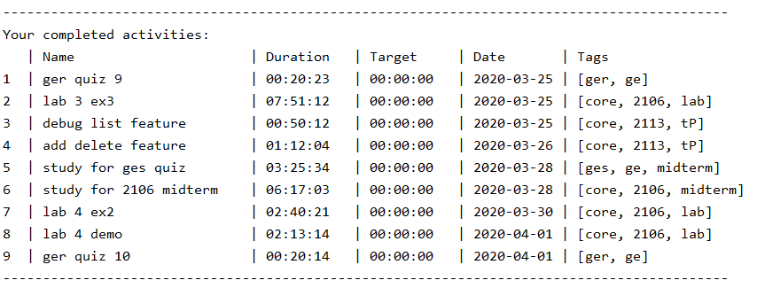
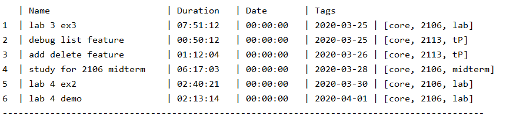
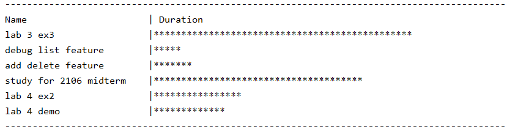
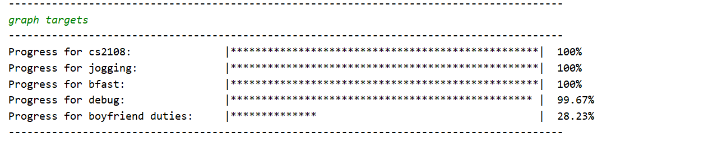

# User Guide

## Introduction

Jikan is a CLI time management tool that allows you to track the amount of time that you spend on different activities. This user guide will show you how to use the program effectively. 

## Quick Start
1. Ensure that you have Java 11 or above installed.
1. Download the latest version of `Jikan` from [here](https://github.com/AY1920S2-CS2113-T15-1/tp/releases).

Features 
=======
## Usage
Jikan lets you record how much time you spend on various activities so that you can easily see what took up the most time today / this week / this month.

To start, record your first activity using the `start ACTIVITY_NAME` command.

Add some tags to your activities to group similar activities together using `/t`.

Add allocated time to your activities using `/a`. Do note that the time allocated for an activity is represented by the target column in the diagram below. (These two words are used interchangeably).
 
When you are done with the activity, or want to move onto something else, tell Jikan to `end` and the Activity time will be recorded and saved to your list.

You can view all your activities using the `list` command. Activities will be shown in this format:

You can also view all your activities over a period of time by using `list` with extra parameters. For example `list week` will return a list of all activities this current week, as shown below.

Filter out the activities you want to see using the `find` or `filter` command. This is our list after filtering out all our activities tagged as `core`. 

To easily see what took up the most of your time, use the `graph` command to view a chart of your activities. 

Now it's clear that lab 3 ex3 took up the most of your time. 

Not done with an activity and want to continue it? Use the `continue` command to continue recording time for a previously started activity.

Finally, when you're done and want to close the app, simply say `bye` and Jikan will exit.

This is just a quick overview of what Jikan can do for you. For more details on each individual command, read the command guide below.

## Basic Commands  
### Starting an activity: `start` 
**Usage:** Starts recording the time for a new activity.  
  
**Format:** `start ACTIVITY_NAME /a ALLOCATED_TIME /t TAGS`    
 * `ACTIVITY_NAME` can contains spaces and must be less than 25 characters.     
* `ACTIVITY_NAME` must also be unique (should the user start an already existing activity, the option to `continue` will be given).  
* `ALLOCATED_TIME` should be of the format [HH/MM/SS].  
* `TAGS` are separated by spaces.  
* `ALLOCATED_TIME` and `TAGS` are optional.  
* `ALLOCATED_TIME` must always come before `TAGS` if both are used.
    
**Example:**  
`start CS1010 assignment /a 01/30/00 /t CS1010 core`   
`start GER1000 quiz /t GER GEmod`  
`start revision`  
  
### Continuing an activity: `continue`  
**Usage:** Continues recording the time of an activity that you have previously started.  
  
**Format:** `continue ACTIVITY_NAME`  
* `ACTIVITY_NAME` must be an existing activity in the activity list.  
  
**Example:**  
`continue CS1010 assignment`  
  
### Ending an activity: `end`  
**Usage:** Stops recording the time for an ongoing activity and stores it into the activity list.  
  
**Format:** `end` 
* An activity must be started or continued before it can be ended.  
  
### Aborting an activity: `abort`  
**Usage:** Aborts the current activity and does not save it to the activity list.  
  
**Format:** `abort`  
* An activity must be started or continued before it can be ended.  
  
### Delete an activity: `delete`  
**Usage:** Deletes an activity in the activity list.  
  
**Format:** `delete ACTIVITY_NAME`  
  
### Listing activities: `list`  
**Usage:** Displays a list of the completed activities.  
  
**Format:** `list TIME_PERIOD` 
* If no `TIME_PERIOD` is given, all activities will be listed.  
* `TIME_PERIOD` can be `day` or `week`
* To list activities in a specific month of the current year, use `list month MONTH_NAME` where `MONTH_NAME` must be spelled out in full (i.e. January and not Jan).
* Otherwise, `TIME_PERIOD` should be of the format [dd/MM/yyyy] or [yyyy-MM-dd]  
* `TIME_PERIOD` can either be a specific date or over a range.  
  
**Example:**  
`list` List all activities.    
`list month april` Lists all activities in April.  
`list week` or `list weekly` List all activities in the current week.  
`list day` or `list daily` List all activities in the current day.  
`list 01/01/2020` or `list 2020-01-01` List all activities on 1 Jan 2020.  
`list 01/01/2020 20/02/2020` List all activities than fall within 1 Jan 2020 and 20 Feb 2020.  
  
### Editing an activity: `edit`
**Usage:** Edits the name or allocated time of an activity in the activity list.

**Format** 
* `edit ACTIVITY_NAME /en NEW_NAME`
* `edit ACTIVITY_NAME /ea NEW_ALLOCATED_TIME`
    * `NEW_ALLOCATED_TIME` should be in the format [HH:MM:SS] 
    
**Example:**  
`edit CS1010 assignment /en CS1010 assignment 2` Activity name is edited to `CS1010 assignment 2`  
`edit CS1010 assignment /ea 10:00:00` Allocated time for activity is edited to `10:00:00` 
  
## Finding and Filtering
By using `find` and `filter` commands, users can reduce clutter and zoom-in to specific activities containing certain keywords or tags. The sub-query flag `-s` allows chaining any combination of `find` and `filter` commands to further reduce clutter. These features are particularly useful when the visualisation of time spent with minimal clutter is required.

### Finding Activities by Name: `find`
**Usage:** Users can request for a sub-list of activities that has names which contain any of the given keywords. If there are more than one keyword, each keyword should be separated with ` / `.

**Format:**
* `find KEYWORD`
* `find KEYWORD1 / KEYWORD2 / KEYWORD3`

### Filtering Activities by Tags: `filter`
**Usage:** Users can request for a sub-list of activities that has specific tags. Each tag should be space separated.

**Format:**
* `filter TAGNAME`
* `filter TAGNAME1 TAGNAME2`

### Chaining Finds & Filters: `-s`
Users can chain `find` and `filter` commands to generate an even smaller sub-list of activities based on their needs. This sublist is generated based on the previously shown list and also works after a list command.
This is can be particularly useful when the user wants to generate a graph.

This flag applies to `find` and `filter` commands only. 

**Format:** 
* `find -s KEYWORD`
* `filter -s TAGNAME`
* `filter -s TAGNAME1 TAGNAME2`
* `find -s KEYWORD1 / KEYWORD2 / KEYWORD3`

## Graphs
By using the following commands, users can get a visual representation of the time spent on each activity and their current progress. 
The 3 types of graphs are :
 * *Activity time graph* - Total time spent on each activity: `graph SCALE`
 * *Tags time graph* - Total time spent on each tag: `graph tags`
 * *Activity targets graph* - Progress of each activity in relation to its targeted time: `graph targets`

Tip: Use `find` and `filter` commands to reduce clutter before graphing as the graphs are based on the last shown list of activities. 

### Activity time graph: `graph`
**Usage:** View a comparison of the absolute time spent on each activity in the last shown list. 
The parameter `SCALE` refers to the number of minutes represented by each point on the graph.

**Format:** `graph SCALE`

**Example:**  `graph 10`  

### Tags time graph: `graph tag`  
**Usage:** View a comparison of the absolute time spent on each tag in the last shown list. 

**Format:** `graph tag`

### Activity targets graph: `graph targets`
**Usage:** View the progress of activities in relation to their 
targeted time. 

Note: Only activities with an `ALLOCATED_TIME` will be shown.

**Format:** `graph targets`

## Tag Goals

By using the `goal` command, users can set specific goals for how long they would like to spend on activities under a certain tags as well as view the amount of time they have spent in total for those activities as compared to their goal.

### Set goal: `goal TAG_NAME /g DURATION`
**Usage:** Sets a duration goal for a tag

**Format:** `goal TAG_NAME /g DURATION`  
* The duration should be in the format [HH:MM:SS]

**Example:** `goal core /g 24:00:00` a goal of `24:00:00` is added for the tag `core`  

### View goals: `goal`
**Usage:** Displays the tags with their goals, actual time spent on activities with these tags and the difference between the 2 timings.

**Format:** `goal`  
  

## Usage of Automated Cleaning

As Jikan is a time tracker application which works with various data files (data file for activities, log files for execution history
etc.), over time it can be a mess to deal with these data files especially when they get too big. Thus, Jikan provides automated cleaning
services for such situations.

### Activating the automated cleaning: `clean on | clean log on`
At runtime, users can switch on the automated cleaning services. Once the automated cleaning is activated, the application will
do an auto cleanup of files at the start of every execution until this services is switch off. Do note that the cleaning will only start from the next execution.
(i.e no cleaning will be done for the current execution which activated auto cleaning).

Note: \
`clean on` activates the cleaning of data files where activities are stored. \
`clean log on` activates the cleaning of log files where application execution history is stored.

### Deactivating the automated cleaning: `clean off | clean log off`
At runtime, users can switch off the automated cleaning services. Once deactivated, the application will
stop doing an auto cleanup of files at the start of every execution. Similarly, the changes only applies to the next execution.

Note:\
When the application is executed for the first time, the automated cleaning is deactivated by default and will remain so until it is activated by the user.

### Specifying how much data to clean: `clean /n NUMBER | clean log /n NUMBER`
At runtime, the user can manually set the amount of data to clean using these commands where `NUMBER` is an integer based on user input. 
Thus, `clean /n 5` will automatically clean the top 5 oldest activities from the activity list upon every startup (assuming automated cleaning
is activated).

Note:\
Default `NUMBER` value for data files : 3\
Default `NUMBER` value for log files : 10

## Command Guide

* Start an activity: `start ACTVITY_NAME` 
    * optional: `start ACTIVITY_NAME /a ALLOCATED_TIME /t TAGS`
* Abort an activity: `abort`
* Stop an activity: `end`
* Continue an activity: `continue ACTIVITY_NAME`
* List all activities: `list`
    * List today's activities: `list day` or `list daily`
    * List this week's activities: `list week` or `list weekly`
        * List a specific week's activities by day: `list week DATE` or `list weekly DATE`, 
        where `DATE` is in either `yyyy-MM-dd` or `dd/MM/yyyy` format
    * List this month's activities: `list month` or `list monthly`
        * List a specific month's activities by day: `list month DATE` or `list monthly DATE`, 
        where `DATE` is in either `yyyy-MM-dd` or `dd/MM/yyyy` format
    * List a specific day's activities: `list DATE`, where `DATE` is in either `yyyy-MM-dd` or `dd/MM/yyyy` format
    * List activities within a time frame: `list DATE1 DATE2`, where both `DATE1` and `DATE2` are 
    in either `yyyy-MM-dd` or `dd/MM/yyyy` format
* Edit an activity: `edit ACTIVITY_NAME [flag]`
    * Edit activity name: `edit ACTIVITY_NAME /en NEW_NAME`
    * Edit activity allocated time: `edit ACTIVITY_NAME /ea NEW_ALLOCATED_TIME`
* Delete an activity: `delete ACTIVITY_NAME`
* Find activities with keyword: `find KEYWORD`
    * optional: `find KEYWORD1 / KEYWORD2` for multiple keywords
    * optional: `find -s KEYWORD` for more specific find
* Filter activities by tags: `filter TAG_NAME`
    * optional: `filter TAG1 TAG2` for multiple tags
    * optional: `filter -s TAG_NAME` for more specific filter
* Set a goal for tags: `goal TAG_NAME /g DURATION`
* View goals for tags: `goal`
* Display graph by tags: `graph tags`
* Display graph by duration: `graph INTERVAL`
* Display graph by targets: `graph targets`
* Clean data files: `clean [command]`
    * Activate auto data cleaner: `clean on`
    * Activate auto log cleaner: `clean log on`
    * Deactivate auto data cleaner: `clean off`
    * Deactivate auto log cleaner: `clean log off`
    * Specify number of files to clean for data: `clean /n NUMBER`
    * Specify number of files to clean for logs: `clean log /n NUMBER`
* Terminate the program: `bye`
