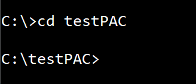
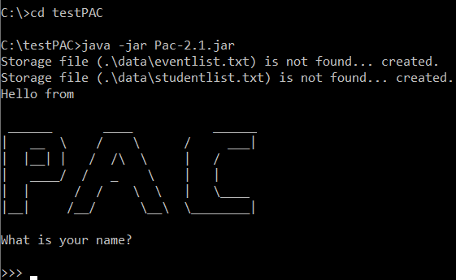

# User Guide

## Professor Assistant Console (Pac)

## Content Page  
1. [Introduction](#1-introduction)  
    1.1. [What is Pac?](#11-what-is-pac)  
    1.2. [Who are our audience?](#12-who-is-this-app-for)
2. [Setting Up](#2-setting-up)  
    2.1. [Requirements](#21-requirements)   
    2.2. [Startup using Command Line](#22-startup-using-command-line)  
3. [Quick Start](#3-quick-start)  
    3.1. [Using Pac](#31-using-pac)
4. [Features](#4-features)  
4.1. [Student List](#41-student-list-benjamin)  
4.1.1. [Add New Student List](#411-add-new-student-list)        
4.1.2. [View Student List](#412-view-all-existing-student-lists-from-the-student-list-collection)  
4.1.3. [Clear Student List Collection](#413-clear-all-existing-student-lists-from-the-student-list-collections)   
4.1.4. [Delete Student List](#414-clear-all-existing-student-lists-from-the-student-list-collection)  
4.1.5. [Find Student List](#415-find-existing-student-lists-from-the-student-list-collection)  
4.1.6. [Sort Student List by Name](#416-sort-all-existing-student-lists-from-the-student-list-collection-by-their-list-name)  
4.1.7. [Sort Student List by List](#417-sort-all-names-within-the-existing-student-lists-from-the-student-list-collection)  
4.2. [Event](#42-event-jiayee)  
4.2.1. [Add New Event](#421-add-new-event)  
4.2.2. [View Event List](#422-list-events)  
4.2.3. [Delete Existing Event](#423-delete-event)      
4.2.4. [Edit Event -name](#424-edit-event-name)      
4.2.5. [Edit Event -datetime](#425-edit-event-datetime)      
4.2.6. [Edit Event -venue](#426-edit-event-venue)  
4.2.7. [Edit Event](#427-edit-event)    
4.3. [Calendar](#43-calendar-haritha)  
4.3.1 [View events in calendar format](#431-view-events-under-a-particular-time)   
4.4 [Attendance List](#44-attendance-benjamin)    
4.4.1. [Add New Attendance](#441-add-students-attendance-to-event)    
4.4.2. [View Attendance List](#442-view-attendance-list)   
4.4.3. [Clear Attendance List](#443-clear-attendance-list)  
4.4.4. [Sort Attendance by name](#444-sort-attendance-list-by-name)  
4.4.5. [Sort Attendance by status](#445-sort-attendance-list-by-status)  
4.4.6. [Find Attendance](#446-find-attendance)  
4.4.7. [Edit Attendance](#447-edit-attendance)    
4.5. [Performance List](#45-performance-list-anqi)     
4.5.1. [Add New Performance List](#451-add-performance-list)  
4.5.2. [Delete Current Performance List](#452-delete-performance-list)   
4.5.3. [View Performance List](#453-view-performance-list)   
4.5.4. [Edit Performance List](#454-edit-performance-list)   
4.5.5. [Sort Performance List](#455-sort-performance-list)    
5. [Possible Console Messages and Reasons](#5-possible-console-messages-and-reasons)           
6. [FAQ](#6-faq)  
7. [Command Summary](#7-command-summary)  
8. [Contact Us](#8-contact-us)

## 1. Introduction

### 1.1. What is Pac?

Pac is a professor assistant console which helps you keep track of your 
upcoming events. Pac also allows you to add in attendance to keep track 
of your students and their grades. Being a simple Command Line Interface 
(CLI) application, Pac ensures its usability and suitability regardless 
of your expertise level.

### 1.2. Who is this app for?

Pac is well suited for professors, teachers or anyone in a teaching profession who  
prefers to use a CLI for managing events and students' data. If you can type fast,  
Pac can get your event management tasks done faster than traditional GUI apps. Interested?  
Jump to [Section 2](#2-setting-up) to get started. Enjoy! 

## 2. Setting Up

### 2.1. Requirements 
1.  Ensure you have [Java 11](https://www.oracle.com/java/technologies/javase-jdk11-downloads.html) 
or above installed in your Computer.
1.  Download the latest Pac-2.1.jar from [here](https://github.com/AY1920S2-CS2113T-T12-4/tp/releases).
1.  Copy the file to the folder you want to use as the home folder for this application.

### 2.2. Startup using Command Line
1.  Open your terminal.
1.  Navigate to the home folder containing Pac.
1.  cd followed by the file path into the terminal as shown below:  
    
1.  Type `java -jar Pac-2.1.jar` and press **Enter**.
1.  You should see this screen if everything is successful:    
    

## 3. Quick Start

### 3.1. Using Pac
You can type any command, then press **Enter** to execute it.
	
e.g. typing help then pressing **Enter** will open the help window.

Some example commands to try:
* `event list`			List all events
* `event add n/CS1010` 	Add an event named “CS1010”
* `student add`         Create a new student list
* `bye`				    Exits the application

Refer to [“Features”](#4-features) for details of each command.

## 4. Features 

### 4.1. Student List @Benjamin
This section for student related commands is done in chronological order. Please follow the numbering to get
a clearer understanding on how you can use the commands. Do note that the student lists created are stored under
a student list collection. Student list collection is a collection of student list created.

#### 4.1.1. Add New Student List

Creates a student list and adds it to the student list collection, that can be used for adding attendance and 
performance. 

Please note the following points when you are using this feature:
1. You will not be allowed to add in duplicated student names
    * For example, you will not be able to add in `John` as a student name if you added `John` previously into the list
1. You will not be allowed to add in duplicated student list names
    * For example, you will not be able to add in `cs2101` as a student list name if there is an existing `cs2101` student
    list stored in the student list collection
1. student names and student list names are CASE-INSENSITIVE
    * For example, you will not be able to add in `cs1010` if there is an existing `CS1010` found in the student
    list collection

Command: 

    >>> studentlist add
    
Examples: 

The following shows a successful case of adding a new student list `CS2113T Tut`.

    >>> studentlist add
    What is the name of your list?
    
    >>> CS2113T Tut
    Please enter a student Name. If you are finished, enter done.
    
    >>> John
    Please enter a student Name. If you are finished, enter done.
    
    >>> Jodi
    Please enter a student Name. If you are finished, enter done.
    
    >>> done
    Student List created, named : CS2113T Tut
    _________________________________________________________________________________________________
    | List      |  CS2113T Tut                                                                       |
    |___________|____________________________________________________________________________________|
    | 1         |  John                                                                              |
    |___________|____________________________________________________________________________________|
    | 2         |  Jodi                                                                              |
    |___________|____________________________________________________________________________________|
    
The following will occur if there is already an existing student list with the same name. 

    >>> studentlist add
    What is the name of your list?
    
    >>> CS2113T Tut
    There is already an existing list name!
    
The following will occur if there is already an existing student list with the same name. The student list will not be
created and if you wish to create another student list, you will need to retype the command `studentlist add`. 

    >>> studentlist add
    What is the name of your list?
    
    >>> CS2040C
    Please enter a student Name. If you are finished, enter done.
    
    >>> John Doe
    Please enter a student Name. If you are finished, enter done.
    
    >>> John Doe
    Duplicated Student Name found.
    Student List Add Command Failed.

    
#### 4.1.2. View all existing student lists from the student list collection
View all existing students lists from student list collection. Using this feature, you will be able to generate 
the entire student list collection. You will be able to make the future decision on whether to import an existing 
student list during the creation of new attendance list and/or performance list. 
    
Command: 
    
    >>> studentlist view
        
Examples: 

The following occurs when there is at least one existing student list in the student list collection. 

    >>> studentlist view
    _________________________________________________________________________________________________
    | List #1   |  CS2113T Tut                                                                       |
    |___________|____________________________________________________________________________________|
    | 1         |  John                                                                              |
    |___________|____________________________________________________________________________________|
    | 2         |  Jodi                                                                              |
    |___________|____________________________________________________________________________________|
    _________________________________________________________________________________________________
    | List #2   |  CS2040C                                                                           |
    |___________|____________________________________________________________________________________|
    | 1         |  Alice                                                                             |
    |___________|____________________________________________________________________________________|
    | 2         |  Carl                                                                              |
    |___________|____________________________________________________________________________________|
    | 3         |  Bobby                                                                             |
    |___________|____________________________________________________________________________________|
    _________________________________________________________________________________________________
    | List #3   |  CG2028                                                                            |
    |___________|____________________________________________________________________________________|
    | 1         |  Ben                                                                               |
    |___________|____________________________________________________________________________________|
    | 2         |  Robert                                                                            |
    |___________|____________________________________________________________________________________|
    | 3         |  Sam                                                                               |
    |___________|____________________________________________________________________________________|
    | 4         |  Fiona                                                                             |
    |___________|____________________________________________________________________________________|
                
The following occurs when there are no existing student lists in the student list collection.

    >>> studentlist view
    There is no existing student list.              
                
#### 4.1.3. Clear all existing student lists from the student list collections
Clear all existing student lists from the student list collection. This is a clear all command. If you wish to delete 
a specific student list, please use the `studentlist delete` instead.

Command: 
    
    >>> studentlist clear
        
Examples: 

The following occurs when there is at least one existing student list in the student list collection.

    >>> studentlist clear
    The Student List Collection is cleared
    
The following occurs when there are no existing student lists in the student list collection.

    >>> studentlist clear
    There is no existing student list.
        
#### 4.1.4. Clear all existing student lists from the student list collection
Delete a specific student list from the student list collection base on its index. If you wish to delete all student 
lists in the student list collection, please use `studentlist clear` instead.

Command: 

    >>> studentlist delete
        
Examples: 

The following occurs when there is at least one existing student list in the student list collection. 
    
    >>> studentlist delete
    Please state the index of the list you want to delete.
    
    >>> 1
    Here is the updated Student List Collection
    _________________________________________________________________________________________________
    | List #1   |  CS2040C                                                                           |
    |___________|____________________________________________________________________________________|
    | 1         |  Alice                                                                             |
    |___________|____________________________________________________________________________________|
    | 2         |  Carl                                                                              |
    |___________|____________________________________________________________________________________|
    | 3         |  Bobby                                                                             |
    |___________|____________________________________________________________________________________|
    
    _________________________________________________________________________________________________
    | List #2   |  CG2028                                                                            |
    |___________|____________________________________________________________________________________|
    | 1         |  Ben                                                                               |
    |___________|____________________________________________________________________________________|
    | 2         |  Robert                                                                            |
    |___________|____________________________________________________________________________________|
    | 3         |  Sam                                                                               |
    |___________|____________________________________________________________________________________|
                
                
The following occurs when there are no existing student lists in the student list collection.

    >>> studentlist delete
    There is no existing student list.               
    
#### 4.1.5. Find existing student list(s) from the student list collection
Find existing student list(s) from student list collection base on keyword.

In future releases, you will be able to customize your search to decide if you want to search for a particular student
or a student list.
    
Command: 
    
    >>> studentlist find
        
Examples: 

The following occurs when there are existing student list in the student list collection.
    
    >>> studentlist find
    Displaying all student list: 
    _________________________________________________________________________________________________
    | List #1   |  CS2113T Tut                                                                       |
    |___________|____________________________________________________________________________________|
    | 1         |  John                                                                              |
    |___________|____________________________________________________________________________________|
    | 2         |  Jodi                                                                              |
    |___________|____________________________________________________________________________________|
    _________________________________________________________________________________________________
    | List #2   |  CS2040C                                                                           |
    |___________|____________________________________________________________________________________|
    | 1         |  Alice                                                                             |
    |___________|____________________________________________________________________________________|
    | 2         |  Carl                                                                              |
    |___________|____________________________________________________________________________________|
    | 3         |  Bobby                                                                             |
    |___________|____________________________________________________________________________________|
    _________________________________________________________________________________________________
    | List #3   |  CG2028                                                                            |
    |___________|____________________________________________________________________________________|
    | 1         |  Ben                                                                               |
    |___________|____________________________________________________________________________________|
    | 2         |  Robert                                                                            |
    |___________|____________________________________________________________________________________|
    | 3         |  Sam                                                                               |
    |___________|____________________________________________________________________________________|
    | 4         |  Fiona                                                                             |
    |___________|____________________________________________________________________________________|
    
    Please state the list name you are searching for.
    
    >>> CS
    You have 2 matched:
    Here's the Search Result(s)
    
    [1]
    _________________________________________________________________________________________________
    | List      |  CS2113T Tut                                                                       |
    |___________|____________________________________________________________________________________|
    | 1         |  John                                                                              |
    |___________|____________________________________________________________________________________|
    | 2         |  Jodi                                                                              |
    |___________|____________________________________________________________________________________|
    
    [2]
    _________________________________________________________________________________________________
    | List      |  CS2040C                                                                           |
    |___________|____________________________________________________________________________________|
    | 1         |  Alice                                                                             |
    |___________|____________________________________________________________________________________|
    | 2         |  Carl                                                                              |
    |___________|____________________________________________________________________________________|
    | 3         |  Bobby                                                                             |
    |___________|____________________________________________________________________________________|

    
    >>> studentlist find
    Please state the list name you are searching for.
    
    >>> CG
    You have 1 matches:
    Here's the Search Result(s)
    
    [1]
    _________________________________________________________________________________________________
    | List      |  CG2028                                                                            |
    |___________|____________________________________________________________________________________|
    | 1         |  Ben                                                                               |
    |___________|____________________________________________________________________________________|
    | 2         |  Robert                                                                            |
    |___________|____________________________________________________________________________________|
    | 3         |  Sam                                                                               |
    |___________|____________________________________________________________________________________|
    | 4         |  Fiona                                                                             |
    |___________|____________________________________________________________________________________|
                
    >>> studentlist find
    Please state the list name you are searching for.
    
    >>> EG
    Nothing match your description : EG
    
The following occurs when there are no existing student lists in the student list collection.

    >>> studentlist find
    There is no existing student list.        

#### 4.1.6. Sort all existing student lists from the student list collection by their list name
Sort all existing student lists from the student list collection by their list name. Regardless whether the 
lists are in order, this command will force all existing lists to be sorted by their list name.

Command: 
    
    >>> studentlist sort
        
Examples:     

The following occurs when there is at least one existing student list in the student list collection.

    >>> studentlist view
    _________________________________________________________________________________________________
    | List #1   |  CS2113T Tut                                                                       |
    |___________|____________________________________________________________________________________|
    | 1         |  John                                                                              |
    |___________|____________________________________________________________________________________|
    | 2         |  Jodi                                                                              |
    |___________|____________________________________________________________________________________|
    _________________________________________________________________________________________________
    | List #2   |  CS2040C                                                                           |
    |___________|____________________________________________________________________________________|
    | 1         |  Alice                                                                             |
    |___________|____________________________________________________________________________________|
    | 2         |  Carl                                                                              |
    |___________|____________________________________________________________________________________|
    | 3         |  Bobby                                                                             |
    |___________|____________________________________________________________________________________|
    _________________________________________________________________________________________________
    | List #3   |  CG2028                                                                            |
    |___________|____________________________________________________________________________________|
    | 1         |  Ben                                                                               |
    |___________|____________________________________________________________________________________|
    | 2         |  Robert                                                                            |
    |___________|____________________________________________________________________________________|
    | 3         |  Sam                                                                               |
    |___________|____________________________________________________________________________________|
    | 4         |  Fiona                                                                             |
    |___________|____________________________________________________________________________________|
    
    >>> studentlist sort
    Please Key in either 'name' or 'list'.
    
    >>> name
    Student List is sorted by name within the Student List Collection
    
    >>> studentlist view
    _________________________________________________________________________________________________
    | List #1   |  CG2028                                                                            |
    |___________|____________________________________________________________________________________|
    | 1         |  Ben                                                                               |
    |___________|____________________________________________________________________________________|
    | 2         |  Robert                                                                            |
    |___________|____________________________________________________________________________________|
    | 3         |  Sam                                                                               |
    |___________|____________________________________________________________________________________|
    | 4         |  Fiona                                                                             |
    |___________|____________________________________________________________________________________|
    _________________________________________________________________________________________________
    | List #2   |  CS2040C                                                                           |
    |___________|____________________________________________________________________________________|
    | 1         |  Alice                                                                             |
    |___________|____________________________________________________________________________________|
    | 2         |  Carl                                                                              |
    |___________|____________________________________________________________________________________|
    | 3         |  Bobby                                                                             |
    |___________|____________________________________________________________________________________|
    _________________________________________________________________________________________________
    | List #3   |  CS2113T Tut                                                                       |
    |___________|____________________________________________________________________________________|
    | 1         |  John                                                                              |
    |___________|____________________________________________________________________________________|
    | 2         |  Jodi                                                                              |
    |___________|____________________________________________________________________________________|
       

#### 4.1.7. Sort all names within the existing student lists from the student list collection
Sort all names within the existing student lists. Regardless whether the names within the list are in order, 
this command will force all existing lists sort the names within the list.

Command: 
    
    >>> studentlist sort
        
Examples:     

The following occurs when there is at least one existing student list in the student list collection.
    
    >>> studentlist view
    _________________________________________________________________________________________________
    | List #1   |  CG2028                                                                            |
    |___________|____________________________________________________________________________________|
    | 1         |  Ben                                                                               |
    |___________|____________________________________________________________________________________|
    | 2         |  Robert                                                                            |
    |___________|____________________________________________________________________________________|
    | 3         |  Sam                                                                               |
    |___________|____________________________________________________________________________________|
    | 4         |  Fiona                                                                             |
    |___________|____________________________________________________________________________________|
    _________________________________________________________________________________________________
    | List #2   |  CS2040C                                                                           |
    |___________|____________________________________________________________________________________|
    | 1         |  Alice                                                                             |
    |___________|____________________________________________________________________________________|
    | 2         |  Carl                                                                              |
    |___________|____________________________________________________________________________________|
    | 3         |  Bobby                                                                             |
    |___________|____________________________________________________________________________________|
    _________________________________________________________________________________________________
    | List #3   |  CS2113T Tut                                                                       |
    |___________|____________________________________________________________________________________|
    | 1         |  John                                                                              |
    |___________|____________________________________________________________________________________|
    | 2         |  Jodi                                                                              |
    |___________|____________________________________________________________________________________|
    
    >>> studentlist sort
    Please Key in either 'name' or 'list'.
    
    >>> list
    StudentList sorted by name within the lists
    
    >>> studentlist view
    _________________________________________________________________________________________________
    | List #1   |  CG2028                                                                            |
    |___________|____________________________________________________________________________________|
    | 1         |  Ben                                                                               |
    |___________|____________________________________________________________________________________|
    | 2         |  Fiona                                                                             |
    |___________|____________________________________________________________________________________|
    | 3         |  Robert                                                                            |
    |___________|____________________________________________________________________________________|
    | 4         |  Sam                                                                               |
    |___________|____________________________________________________________________________________|
    _________________________________________________________________________________________________
    | List #2   |  CS2040C                                                                           |
    |___________|____________________________________________________________________________________|
    | 1         |  Alice                                                                             |
    |___________|____________________________________________________________________________________|
    | 2         |  Bobby                                                                             |
    |___________|____________________________________________________________________________________|
    | 3         |  Carl                                                                              |
    |___________|____________________________________________________________________________________|
    _________________________________________________________________________________________________
    | List #3   |  CS2113T Tut                                                                       |
    |___________|____________________________________________________________________________________|
    | 1         |  Jodi                                                                              |
    |___________|____________________________________________________________________________________|
    | 2         |  John                                                                              |
    |___________|____________________________________________________________________________________|
   
     
### 4.2. Event @JiaYee
#### 4.2.1. Add New Event
Add a new event to the event list. 

Format: `event add n/NAME [d/DATE t/TIME] [v/VENUE]`

* `Name` and `Venue` accepts input with spaces.
* `Date` and `Time` must either be provided together, or not provided at all. 
* The Date should be in the format: yyyy-mm-dd.  
* The Time should be in the 24-hour format: HHmm.
* Flags can be arranged in any order.
* If only `Venue` is provided, `Name` will be set to a default value based on 
current time (e.g. event_1586607776).
 
Examples: 

    >>> event add n/dinner with collegue
    
    >>> event add n/World Cup d/2022-11-21 t/0000
    
    >>> event add n/soccer match v/Kallang d/2020-01-23 t/1900
    
Expected outcome:

    Datetime is not set. If you wish to add datetime, please enter the correct format:yyyy-MM-dd HHmm
    New Event: dinner with collegue was added successfully to your Event list.
    
    New Event: World Cup was added successfully to your Event list.
    
    New Event: soccer match was added successfully to your Event list.

Examples of bad input:

    >>> event add n/NS [d/2020-02-01 t/0000] [v/Tekong]

Expected outcome of bad input:

    Datetime is not set. If you wish to add datetime, please enter the correct format:yyyy-MM-dd HHmm
    New Event: NS [d/2020-02-01 was added successfully to your Event list.

#### 4.2.2. List Events
List all events.

Format: `event list`

Expected outcome:

    Here are all the events in your list.
    1. Event: dinner with collegue
    2. Event: World Cup, time: Mon, Nov 21 2022 0000
    3. Event: soccer match, time: Thu, Jan 23 2020 1900, venue: Kallang

#### 4.2.3. Delete Event
Delete an existing event from the event list.

Format: `event delete i/INDEX`

Examples:

    >>> event delete i/3
    >>> event delete i/4
    
Expected outcome:

    Event: soccer match was deleted successfully from your Event list.
    Index cannot be found. Check your index from the list.
    
#### 4.2.4. Edit Event Name
Change the name of an existing event.

Format: `event editname i/INDEX n/NEW_NAME`
* alphabet cases for the command is not important

Examples:

    >>> event editname i/1 n/lunch with colleague
    
Expected outcome:

    Your Event name was changed from |dinner with collegue| to |lunch with colleague|.
    
#### 4.2.5. Edit Event Datetime
Change the date and time of an existing event. 
   
Format: `event editdatetime i/INDEX d/NEW_DATE t/NEW_TIME`
* alphabet cases for the command is not important.    
* The date should be in the format: yyyy-mm-dd.  
* The time should be in the 24-hour format: HHmm.

Examples:

    >>> event editdatetime i/1 d/2020-03-23 t/1200
    
Expected outcome:

    Your Event date and time was changed from || to |Tue, Mar 03 2020 1200|.
    Event: lunch with colleague, time: Mar 23 2020 1200
    
#### 4.2.6. Edit Event Venue
Change the venue of an existing event.

Format: `event editvenue i/INDEX v/NEW_VENUE`
* alphabet cases for the command is not important

Examples:

    >>> event editvenue i/1 v/Marina Bay Sands
    
Expected outcome:

    Your Event venue was changed from || to |Marina Bay Sands|.
    Event: lunch with colleague, time: Tue, Mar 23 2020 1200, venue: Marina Bay Sands

#### 4.2.7. Edit Event
Change an existing event.

Format: `event editevent i/INDEX n/NEW_NAME [t/NEW_TIME d/NEW_DATE] [v/NEW_VENUE]`
* alphabet cases for the command is not important

Examples:

    >>> event editevent i/1 n/lunch by myself v/home
    
Expected outcome:

    Your Event was edited from |Event: lunch with colleague, time: Tue, Mar 03 2020 1200, venue: Marina Bay Sands| to |Event: lunch by myself, venue: home|.
    Datetime is not set. If you wish to add datetime, please enter the correct format:yyyy-MM-dd HHmm

### 4.3. Calendar @Haritha
#### 4.3.1. View events under a particular time
View events under a particular semester and academic year in a calendar format. In the calendar view, it shows the date of the event, type 
of the event in brackets, and name of the event. 

Format: `calendar s/SEMESTER ay/YY_ONE-YY_TWO `
* Both the semester and academic year should be provided.
* Valid semester numbers can only be 1 or 2. 
* Valid academic year refers to any 2 *consecutive* years with a hyphen separating them. Each year should be entered in a 2 digit format,
  i.e. ay/07-08, ay/19-20.  
* Order of the flags *matters*.

Note that your event list **should** contain existing events to view calendar. The following *steps* will guide you to achieve this:

Step 1: Add events with date and time that corresponds to semester 2 of academic year 19/20, similar to the event list shown below. 
To view the events in a list, type the command below. 

Command: 

    >>> event list 
    
Example:

    >>> Here are all the Events in your list.
       1. Event: orientation, time: Mon, Jan 13 2020 0800
       2. Event: presentation, time: Sat, Feb 01 2020 1230
       3. Event: midterms, time: Fri, Mar 13 2020 1000
       4. Seminar: covid19, time: Sat, Apr 04 2020 1500
       5. Event: birthday, time: Sun, Apr 05 2020 1900
       6. Event: finals, time: Mon, May 04 2020 0930

Step 2: To view the events above in a calendar format, type the command below.

Command: 
    
    >>> calendar s/2 ay/19-20
    
Example: 

     ___________________________________________________________________________________________________________________________________ 
                                                             SEMESTER 2 AY 19/20 
     ___________________________________________________________________________________________________________________________________ 
    | JAN                 | FEB                 | MAR                 | APR                 | MAY                 | JUN                 |
    |_____________________|_____________________|_____________________|_____________________|_____________________|_____________________|
    | 13th [E]: orient... | 1st [E]: present... | 13th [E]: midterms  | 4th [S]: covid19    | 4th [E]: finals     |                     |
    |_____________________|_____________________|_____________________|_____________________|_____________________|_____________________|
    |                     |                     |                     | 5th [E]: birthday   |                     |                     |
    |_____________________|_____________________|_____________________|_____________________|_____________________|_____________________|
     

### 4.4. Attendance @Benjamin
This section for attendance related commands is done in chronological order. Please follow the numbering to get
a clearer understanding on how you can use the commands. 

#### 4.4.1. Add students’ attendance to event

Add a student’s attendance to the attendance list.  
This is a step by step command and you may follow the instructions given by the console. 
You may wish to use an existing list found in student list collection.

Please note that if there are existing students in the attendance list of the chosen event, it will add to the existing
students list. If you wish to start a new attendance list of the chosen event, please use `attendance clear` to clear 
the attendance list first. 

In future releases, we will allow adding of students to existing attendance list.

Command:  `attendance add`
    
Example:

The following will show success examples creating a new attendance list under event `CS1010 Tutorial`. 

    >>> attendance add
    Please key in the name of event.
    
    >>> CS1010 Tutorial
    
If the event is found, you can choose to add the student's attendance by manually key in each student, or you may choose
the alternative provided by Pac: record using an existing name list located under student list collection. 
Do note that you need to have an existing name list before you are using this shortcut.
If you choose to create a new attendance list, the new list will be added to the student list collection.
  
The following will show a success example of *using an existing name list to add attendance* . 

    Would you like to import an existing student list? If yes, input 'yes'. Else, input anything.
    
    >>> yes
    _________________________________________________________________________________________________
    | List #1   |  CS1010 Tutorial                                                                   |
    |___________|____________________________________________________________________________________|
    | 1         |  Jodi Doe                                                                          |
    |___________|____________________________________________________________________________________|
    | 2         |  Sam Roe                                                                           |
    |___________|____________________________________________________________________________________|
    Please choose the name list you wish to use by its index.
    
    >>> 1
    Please key in the attendance status for student Jodi Doe [Y/N]
    
    >>> N
    Attendance of Jodi Doe (Absent) has been taken successfully under event CS1010 Tutorial.
    Please key in the attendance status for student Sam Roe [Y/N]
    
    >>> Y
    Attendance of Sam Roe (Present) has been taken successfully under event CS1010 Tutorial.
    AttendanceList added

The following will show a success example of *creating a new attendance list using a multi-line interface*.

    Would you like to import an existing student list? If yes, input 'yes'. Else, input anything.
    
    >>> no
    Are you a new user? If so, please type 'yes' 
    
    >>> yes
    Please key in student name.
    
    >>> John Doe
    To mark the student as present, please use 'y' or 'Y'.
    By default the student will be marked as absent, if any other input is given.
    
    >>> Y
    Attendance of John Doe (Present) has been taken successfully under event CS1010 Tutorial.
    Please key in student name.
    
    >>> Sam Roe
    To mark the student as present, please use 'y' or 'Y'.
    By default the student will be marked as absent, if any other input is given.
    
    >>> N
    Attendance of Sam Roe (Absent) has been taken successfully under event CS1010 Tutorial.
    Please key in student name.
    
    >>> David Chang
    To mark the student as present, please use 'y' or 'Y'.
    By default the student will be marked as absent, if any other input is given.
    
    >>> Z
    Attendance of David Chang (Absent) has been taken successfully under event CS1010 Tutorial.
    Please key in student name.
    
    >>> done
    You have successfully added 3 to the attendance list.
    
The following will show a success example of *creating a new attendance list using a single line interface*.
Please note that the name provided must be connected. "John Doe" is not accepted. If you wish to add in name
with blank spaces, please use the other method. 

In the future releases, we will allow names like "John Doe" to be added. 

    Would you like to import an existing student list? If yes, input 'yes'. Else, input anything.
    
    >>> no
    Are you a new user? If so, please type 'yes' 
    
    >>> no
    Please key following format:
    n/Name p/Status [Y/N]
    Status will be take as absent if the format above is not followed.
    
    >>> n/JohnDoe p/Y
    Attendance of JohnDoe (Present) has been taken successfully under event CS1010 Tutorial.
    Please key following format:
    n/Name p/Status [Y/N]
    Status will be take as absent if the format above is not followed.
    
    >>> n/SamRoe p/N
    Attendance of SamRoe (Absent) has been taken successfully under event CS1010 Tutorial.
    Please key following format:
    n/Name p/Status [Y/N]
    Status will be take as absent if the format above is not followed.
    
    >>> n/DavidChang p/Z
    Attendance of DavidChang (Absent) has been taken successfully under event CS1010 Tutorial.
    Please key following format:
    n/Name p/Status [Y/N]
    Status will be take as absent if the format above is not followed.
    
    >>> done
    You have successfully added 3 to the attendance list.
    
#### 4.4.2. View attendance list

View the attendance list under a certain event. Using this feautre, you will be able to generate a table 
to show attendance list.

Command:  `attendance view`

Example:

The following occurs if there is an existing attendance list stored under event `CS1010 Tutorial`.

        >>> attendance view
        Please key in the name of event.
        
        >>> CS1010 Tutorial
        _________________________________________________________________________________________________
        | index     |  Name of Student                                   |  Status                      |
        |___________|____________________________________________________|______________________________|
        | 1         |  John Doe                                          |  Present                     |
        |___________|____________________________________________________|______________________________|
        | 2         |  Sam Roe                                           |  Present                     |
        |___________|____________________________________________________|______________________________|
        | 3         |  David Chang                                       |  Absent                      |
        |___________|____________________________________________________|______________________________|
               
        
The following occurs if there is no existing attendance list under event `CS1010 Tutorial`.

        >>> attendance view
        Please key in the name of event.

        >>> CS2113T Tutorial
        Attendance List is empty
    
#### 4.4.3. Clear attendance list

Clear the attendance list under a certain event.  Attendance list is cleared regardless whether 
the attendance list under the event is empty. You will only be allowed to clear the entire attendance list.

In future releases, we will offer `attendance delete` to specifically delete a particular attendance in the attendance
list. 

Command:  `attendance clear`

Example:

The following will show a successful clearing of the existing attendance list stored under event `CS1010 Tutorial`.

    >>> attendance view
    Please key in the name of event.
    
    >>> CS1010 Tutorial
    _________________________________________________________________________________________________
    | index     |  Name of Student                                   |  Status                      |
    |___________|____________________________________________________|______________________________|
    | 1         |  John Doe                                          |  Present                     |
    |___________|____________________________________________________|______________________________|
    | 2         |  Sam Roe                                           |  Absent                      |
    |___________|____________________________________________________|______________________________|
    | 3         |  David Chang                                       |  Absent                      |
    |___________|____________________________________________________|______________________________|
    
    >>> attendance clear
    Please key in the name of event.
    
    >>> CS1010 Tutorial
    Attendance List cleared for Event: CS1010 Tutorial
    
    >>> attendance view
    Please key in the name of event.
    
    >>> CS1010 Tutorial
    Attendance List is empty
    
The following will show the message shown when clearing of an empty attendance list.

    >>> attendance clear
    Please key in the name of event.
    
    >>> CS1010 Tutorial
    Attendance List is already empty
            
#### 4.4.4. Sort attendance list by name

Sort the attendance list by name in alphabetical order under a certain event. You will be able to quickly organize
the names in the attendance list so that you can easily find a student if you want to look through the list manually.

Command:  `attendance sort`
    
Example:

The following shows the existing attendance list under the event `CS1010 Tutorial`.

    >>> attendance view
    Please key in the name of event.
    
    >>> CS1010 Tutorial
    _________________________________________________________________________________________________
    | index     |  Name of Student                                   |  Status                      |
    |___________|____________________________________________________|______________________________|
    | 1         |  John Doe                                          |  Present                     |
    |___________|____________________________________________________|______________________________|
    | 2         |  Sam Roe                                           |  Absent                      |
    |___________|____________________________________________________|______________________________|
    | 3         |  David Chang                                       |  Absent                      |
    |___________|____________________________________________________|______________________________|

The following shows a successful sort the attendance list under event `CS1010 Tutorial` by name.

      >>> attendance sort
      Please key in the name of event.
      
      >>> CS1010 Tutorial
      Please key in either 'name' or 'status'.
      
      >>> name
      Attendance List is sorted by attendance name for Event:  CS1010 Tutorial
          
      >>> attendance view
      Please key in the name of event.
      
      >>> CS1010 Tutorial
      _________________________________________________________________________________________________
      | index     |  Name of Student                                   |  Status                      |
      |___________|____________________________________________________|______________________________|
      | 1         |  David Chang                                       |  Absent                      |
      |___________|____________________________________________________|______________________________|
      | 2         |  John Doe                                          |  Present                     |
      |___________|____________________________________________________|______________________________|
      | 3         |  Sam Roe                                           |  Absent                      |
      |___________|____________________________________________________|______________________________|
      
The following occurs if there is no existing attendance list found under event `CS1010 Tutorial`.
              
        >>> attendance sort         
        Please key in the name of event.
        
        >>> CS1010 Tutorial
        Please key in either 'name' or 'status'.
        
        >>> name
        An empty list cannot be sorted   
      
#### 4.4.5. Sort attendance list by status
Sort the attendance list by attendance status under a certain event with student that are absent on the top.
Using this feature, you can quickly find out the students who are absent under a specific event.   

Command:  `attendance sort`
    
Example:

The following shows the existing attendance list under the event `CS1010 Tutorial`.

    >>> attendance view
    Please key in the name of event.
    
    >>> CS1010 Tutorial
    _________________________________________________________________________________________________
    | index     |  Name of Student                                   |  Status                      |
    |___________|____________________________________________________|______________________________|
    | 1         |  John Doe                                          |  Present                     |
    |___________|____________________________________________________|______________________________|
    | 2         |  Sam Roe                                           |  Absent                      |
    |___________|____________________________________________________|______________________________|
    | 3         |  David Chang                                       |  Absent                      |
    |___________|____________________________________________________|______________________________|

The following shows a successful sort the attendance list under event `CS1010 Tutorial` by status.

    >>> attendance sort
    Please key in the name of event.
    
    >>> CS1010 Tutorial
    Please Key in either 'name' or 'status'.
    
    >>> status
    Attendance List is sorted by attendance status for Event:  CS1010 Tutorial
    
    >>> attendance view
    Please key in the name of event.
    
    >>> CS1010 Tutorial
    _________________________________________________________________________________________________
    | index     |  Name of Student                                   |  Status                      |
    |___________|____________________________________________________|______________________________|
    | 1         |  Sam Roe                                           |  Absent                      |
    |___________|____________________________________________________|______________________________|
    | 2         |  David Chang                                       |  Absent                      |
    |___________|____________________________________________________|______________________________|
    | 3         |  John Doe                                          |  Present                     |
    |___________|____________________________________________________|______________________________|
       

The following occurs if there is no existing attendance list found under event `CS1010 Tutorial`.

      >>> attendance sort
      Please key in the name of event.
      
      >>> CS1010 Tutorial
      Please Key in either 'name' or 'status'.
      
      >>> status
      An empty list cannot be sorted      

#### 4.4.6. Find attendance
Find a student's attendance under a certain event. Using this feature, you will be able to quickly find the attendance
of a specific student under an event. This feature will search through the attendance list to provide you with the 
possible matches.

Command: `attendance find`

Example:

The following shows a successful find for student `Mary` under the event `CS1010 Tutorial`.

    >>> attendance view
    Please key in the name of event.
    
    >>> CS1010 Tutorial
    _________________________________________________________________________________________________
    | index     |  Name of Student                                   |  Status                      |
    |___________|____________________________________________________|______________________________|
    | 1         |  Mary Poppins                                      |  Present                     |
    |___________|____________________________________________________|______________________________|
    | 2         |  David Chang                                       |  Absent                      |
    |___________|____________________________________________________|______________________________|
    | 3         |  John Doe                                          |  Present                     |
    |___________|____________________________________________________|______________________________|
    
    >>> attendance find
    Please key in the name of event.
    
    >>> CS1010 Tutorial
    Please type the name of the student you are looking for.
    
    >>> Mary
    Search Results
    _________________________________________________________________________________________________
    | index     |  Name of Student                                   |  Status                      |
    |___________|____________________________________________________|______________________________|
    | 1         |  Mary Poppins                                      |  Present                     |
    |___________|____________________________________________________|______________________________|
    
The following occurs when there is no names matching the name that the user inputs.

    >>> attendance find
    Please key in the name of event.
    
    >>> CS1010 Tutorial
    Please type the name of the student you are looking for.
    
    >>> Richard
    Search Results
    There is no student named: Richard
    
The following occurs when the attendance list is empty.

    >>> attendance find
    Please key in the name of event.
    
    >>> CS1010 Tutorial
    The attendance list is currently empty. Please add attendance instead.

#### 4.4.7. Edit attendance
Edit a student's attendance under a certain event. Using this feature, you will be able to edit an existing student's
attendance under a certain event.

Command: `attendance edit`

Example:

    >>> attendance view
    Please key in the name of event.

    >>> CS1010 Tutorial
    _________________________________________________________________________________________________
    | index     |  Name of Student                                   |  Status                      |
    |___________|____________________________________________________|______________________________|
    | 1         |  Sam Roe                                           |  Absent                      |
    |___________|____________________________________________________|______________________________|
    | 2         |  David Chang                                       |  Absent                      |
    |___________|____________________________________________________|______________________________|
    | 3         |  John Doe                                          |  Present                     |
    |___________|____________________________________________________|______________________________|
    
The following shows when you want to mark student `Sam Roe` as `Present`.

    >>> attendance edit
    Please key in the name of event.
    
    >>> CS1010 Tutorial
    _________________________________________________________________________________________________
    | index     |  Name of Student                                   |  Status                      |
    |___________|____________________________________________________|______________________________|
    | 1         |  Sam Roe                                           |  Absent                      |
    |___________|____________________________________________________|______________________________|
    | 2         |  David Chang                                       |  Absent                      |
    |___________|____________________________________________________|______________________________|
    | 3         |  John Doe                                          |  Present                     |
    |___________|____________________________________________________|______________________________|
    Please state the index of the student you wish to edit
    
    >>> 1
    _________________________________________________________________________________________________
    | index     |  Name of Student                                   |  Status                      |
    |___________|____________________________________________________|______________________________|
    | 1         |  Sam Roe                                           |  Absent                      |
    |___________|____________________________________________________|______________________________|
    Do you wish to change the `name` or change the `status`
    
    >>> status
    What do you want to change the status to? [Y/N]
    
    >>> Y
    _________________________________________________________________________________________________
    | index     |  Name of Student                                   |  Status                      |
    |___________|____________________________________________________|______________________________|
    | 1         |  Sam Roe                                           |  Present                     |
    |___________|____________________________________________________|______________________________|
    | 2         |  David Chang                                       |  Absent                      |
    |___________|____________________________________________________|______________________________|
    | 3         |  John Doe                                          |  Present                     |
    |___________|____________________________________________________|______________________________|

The following shows when you want to change student's name from `Sam Roe` to `Mary Poppins`.

    >>> attendance edit
    Please key in the name of event.
    
    >>> CS1010 Tutorial
    _________________________________________________________________________________________________
    | index     |  Name of Student                                   |  Status                      |
    |___________|____________________________________________________|______________________________|
    | 1         |  Sam Roe                                           |  Present                     |
    |___________|____________________________________________________|______________________________|
    | 2         |  David Chang                                       |  Absent                      |
    |___________|____________________________________________________|______________________________|
    | 3         |  John Doe                                          |  Present                     |
    |___________|____________________________________________________|______________________________|
    Please state the index of the student you wish to edit
    
    >>> 1
    _________________________________________________________________________________________________
    | index     |  Name of Student                                   |  Status                      |
    |___________|____________________________________________________|______________________________|
    | 1         |  Sam Roe                                           |  Absent                      |
    |___________|____________________________________________________|______________________________|
    Do you wish to change the `name` or change the `status`
    
    >>> name
    What do you want to change the name to?
    
    >>> Mary Poppins
    _________________________________________________________________________________________________
    | index     |  Name of Student                                   |  Status                      |
    |___________|____________________________________________________|______________________________|
    | 1         |  Mary Poppins                                      |  Absent                      |
    |___________|____________________________________________________|______________________________|
    | 2         |  David Chang                                       |  Absent                      |
    |___________|____________________________________________________|______________________________|
    | 3         |  John Doe                                          |  Present                     |
    |___________|____________________________________________________|______________________________|
    
The following occurs when there is no existing attendance list.

    >>> attendance edit
    Please key in the name of event.
    
    >>> CS1010 Tutorial
    The attendance list is currently empty. Please add attendance instead.
    
### 4.5. Performance List @Anqi
#### 4.5.1. Add Performance List
Add new students' result to an empty or existing performance list. Pac offers 
you the absolute freedom to add students' result in any form, i.e. mark or grade.  

You are allowed to add the student's result by importing a student list or manually key
in students' performance. This section will demonstrate two ways of adding a performance 
list.  
Do note that you have to have an existing name list before you are using the alternative method.  

This is a step by step command and you may follow the instructions given by the console. 

Format: `performance add`
    
Step by step guide: 

    >>> performance add
    Please key in the name of event that you wish to access to its student's performance. 
    
    >>> Event

The following will show a success example of using a current name list to add performance. 

    Would you like to import an existing student list? If yes, input 'yes'. Else, input anything.
    
    >>> yes
    Please choose the name list you wish to use. 
    (shows a list of list names)
    
    >>> 1
    Please key in the result for (student1 name) 
    
    >>> A
    The result of student (student name) has been added successfully under event Event.
    If you are adding student's result manually, record next student: (format: n/name r/result). When you are finished, input 'done'.
    
    Please key in the result for (student2 name)
    
    >>> A
    
    >>> The result of student (student2 name) has been added successfully under event Event.
    If you are adding student's result manually, record next student: (format: n/name r/result). When you are finished, input 'done'. 

    You have successfully added 2 result(s) to the performance list.
    
The following will show a success example of adding performance list manually. 
    
    Would you like to import an existing student list? If yes, input 'yes'. Else, input anything.
    
    >>> nooo
    Please key in the performance you want to add in this format: n/name r/result
    When you are finished, input 'done' 
    
    >>> n/Student1 r/A
    The result of student Student1 has been added successfully under event Event.
    If you are adding student's result manually, record next student: (format: n/name r/result). When you are finished, input 'done'. 
    
    >>> n/Student2 r/B
    The result of student Student2 has been added successfully under event Event.
    If you are adding student's result manually, record next student: (format: n/name r/result). When you are finished, input 'done'. 
    
    >>> done
    You have successfully added 2 result(s) to the performance list.
        
*Note:*  
*1. All commands above are not case sensitive.*  
*2. Student name is restricted to one word only for manual add, i.e. `n/Student Name r/A` is an invalid input.*  
*3. However, you may import an existing student list for multiple word names.* 

#### 4.5.2. Delete Performance List
Delete a student’s result to the performance list. You are able to select the performance
list under any existing Event and delete a student's data under that list.  

This is a step by step command and you may follow the instructions given by the console.  

Format: `performance delete`
    
Step by step guide: 

    >>> performance delete
    Please key in the name of event that you wish to access to its student's performance. 
    
    >>> event
    Please key in the name of student that you wish to delete his/her performance 
    
    >>> name
    The result of student (name) has been deleted successfully under event event.

If you are trying to delete a performance from an empty performance list, an error message
will be shown as below:

    >>> performance delete
    Please key in the name of event that you wish to access to its student's performance. 
        
    >>> event
    No performance list under this event.
        
*Note: All commands above are not case sensitive.*

#### 4.5.3. View Performance List
View the list of students' result under a certain event. Pac will generate a nice 
looking table containing the performance data you wish to view automatically.  

This is a step by step command and you may follow the instructions given by the console. 

Format: `performance view`
    
Step by step guide: 

    >>> performance view
    Please key in the name of event that you wish to access to its student's performance.
    
    >>> event
    (example of Table format list is shown below)
    _________________________________________________________________________________________________
    | index     |  Name of Student                    |  Result                                     |
    |___________|_____________________________________|_____________________________________________|
    | 1         |  XX                                 |  A                                          |
    |___________|_____________________________________|_____________________________________________|

If the performance list you wish to view is empty, you will see the following message:

     No performance list under this event
    _________________________________________________________________________________________________
    | index     |  Name of Student                                   |  Result                      |
    |___________|____________________________________________________|______________________________|

*Note: All commands above are not case sensitive.*

#### 4.5.4. Edit Performance List
Edit the list of students' result under a certain event. You are allowed to edit 
either student's name or result.  

This is a step by step command and you may follow the instructions given by the console. 

Format: `performance edit`
    
Step by step guide to edit name: 

    >>> performance edit
    Please key in the name of event that you wish to access to its student's performance.
    
    >>> event
    Please key in the name of student that you wish to edit his/her performance 
    
    >>> Alice
    Please key in the type of performance parameter you want to edit: name / result
    
    >>> name ***
    Please key in the student's new name
    
    >>> Carl
    The student name has been changed to Carl successfully.

Step by step guide to edit result: 

    >>> performance edit
    Please key in the name of event that you wish to access to its student's performance.
    
    >>> event
    Please key in the name of student that you wish to edit his/her performance 
    
    >>> Alice
    Please key in the type of performance parameter you want to edit: name / result
    
    >>> result
    Please key in the student's new result
    
    >>> A
    The student result has been changed to student successfully.

If you have selected a wrong performance parameter, i.e. anything but 'name' or 'result', 
an error message will be shown as below:
    
    Please key in the type of performance parameter you want to edit: name / result
        
    >>> type
    Wrong type of parameter chosen.

*Note: All commands above are not case sensitive.*

#### 4.5.5. Sort Performance List
Sort the list of students' result under a certain event by either student's name or result.  

This is a step by step command and you may follow the instructions given by the console. 

Format: `performance sort`
    
Step by step guide to sort performance list by name: 

    >>> performance sort
    Please key in the name of event that you wish to access to its student's performance.
    
    >>> event
    Please key in the name of student that you wish to edit his/her performance 
    
    >>> Alice
    Do you want to sort by students' name or result?
    
    >>> name ***
    Performance List is sorted by Performance name for Event:  event
    
You should follow the same procedure to sort by result, while changing your input from
`name` to `result` at the `***` line.  
- Result in grade will be sorted from highest to lowest.  
- Result in mark will be sorted from smallest to largest by its most significant digit.  
- If the students' result are of different form in the same list, ie some are in grades,
while some are in marks, result will be sorted in the order of mark, followed by grades.   

*Note: All commands above are not case sensitive.*

## 5. Possible Console Messages and Reasons:  
1. If you entered a wrong command type, ie. not specifying 
which category your command belongs to

       Please provide a valid command category. Refer to 'help' for more info.

1. If you entered two flags, i.e. n/work n/presentation:

       Please provide only 1 name flag.
       
1. If you entered two similar flag for a Performance command, e.g. adding performance list to event
named Event.  
When prompted to input student's name and result, given input: `n/Name1 n/Name2 r/A`, data after the latest 
detected flag will be used:

        The result of student name2 has been added successfully under event Event.

1. If you did not enter any flag, ie. event add: 

       Argument is required for command 'add'
    
1. If event cannot be found in the list:
           
       Event is not found in the list.
       
1. If you added an event with no date and time:

       Datetime is not set. If you wish to add datetime, please enter the correct format:yyyy-MM-dd HHmm
       
1. If there are no events in your event list under a particular semester and academic year:

       Unable to find any events for this time period.

1. If event list is empty:    
        
       The event list is empty.
       
1. If student list is empty:
       
       There is no existing student list.
       
1. If attendance list under an event is empty: *Message may be different*
      
       No attendance list under this event.
       
1. If performance list under an event is empty:

       No performance list under this event.
       _________________________________________________________________________________________________
       | index     |  Name of Student                                   |  Result                      |
       |___________|____________________________________________________|______________________________|
           
## 6. FAQ

**Q**: How do I transfer my data to another computer? 

**A**: You can look for your data at the folder "data", containing `eventlist.txt` 
and `studentlist.txt`. Running this application in the folder containing "data" 
folder will automatically load your previously saved data.

---

**Q**: How do i get a calendar view of the whole year? 

**A**: It is not possible to view all the 12 months as this application is geared towards a professors schedule. Therefore,
you can only view events under a particular semester and academic year. 

---

**Q**: Why is there a general event, and a specific event ie. seminar in this 
application? 

**A**: We wanted to only distinguish between seminar and events in this version. Future patches will 
allow users to add more types of events in this application. 

---

**Q**: Why does pac use different types of command for different features, i.e.
step-by-step command for performance and all-in-one command for event?

**A**: We want to enhance user experience when using pac, and believe that 
 implementing step-by-step command will do so by reducing the number of flags
 and command format a user has to remember, making it easier for using pac.  
 Currently, features in performance, attendance and student list are using
 step-by-step command, and we will synchronise the command type according to 
 future feedback to fit user needs.    

---

**Q**: Why do I see a bunch of events and/or student lists added when I launch 
the application?

**A**: The events and student lists that you entered during your previous usage 
were saved in your computer. Now, when you relaunch the application, those events and 
student lists are loaded up automatically.

---

## 7. Command Summary

**Student**
* Add student list `studentlist add`
* View student list `studentlist view`
* Clear student list collection `studentlist clear`
* Delete student list `studentlist delete`
* Find student list `studentlist find`
* Sort student list `studentlist sort`  

**Event**
* Add event `event add n/NAME d/DATE t/TIME v/VENUE`
* View event list `event list`
* Edit name of existing event `event editname i/INDEX n/NAME`
* Edit date and time of existing event `event editdatetime i/INDEX d/DATE t/TIME`
* Edit venue of existing event `event editvenue i/INDEX v/VENUE`
* Delete event `event delete i/INDEX`  

**Calender**
* View calendar `calendar s/SEMESTER ay/YEAR_ONE-YEAR_TWO`

**Attendance**  
* Add attendance `attendance add`
* View attendance list `attendance view`
* Clear attendance list `attendance clear`
* Sort attendance list `attendance sort`
* Edit attendance `attendance edit`
* Find attendance `attendance find`

**Performance**
* Add performance `performance add`
* View performance list `performance view`
* Delete performance of a student `performance delete`
* Edit performance of a student `performance edit`
* Sort performance list `performance sort`

## 8. Contact Us
If you have further queries or feedback on Pac, please contact us at [contact_us@pac.com](contact_us@Pac.com)