# User Guide

- [1. Target User Profile](#target-user-profile)
- [2. Introduction](#introduction)
- [3. Quick Start](#quick-start)
- [4. Features](#features)
    - [4.1 Usage](#usage)
    - [4.2 Basic Commands](#basic-commands)
        - [4.2.1. Start Activity](#starting-an-activity-start)
        - [4.2.2. Continue Activity](#continuing-an-activity-continue)
        - [4.2.3. End Activity](#ending-an-activity-end)
        - [4.2.4. Abort Activity](#aborting-an-activity-abort)
        - [4.2.5. Delete Activity](#delete-an-activity-delete)
        - [4.2.6. List Activities](#listing-activities-list)
        - [4.2.7. Edit Activity](#editing-an-activity-edit)
    - [4.3. Find and Filter Activity](#finding-and-filtering)
        - [4.3.1. Find Activity by Name](#finding-activities-by-name-find)
        - [4.3.2. Filter Activity by Tag](#filtering-activities-by-tags-filter)
        - [4.3.3. Chaining Lists, Find and Filter](#chaining-finds--filters--s)
    - [4.4. Graphs](#graphs)
        - [4.4.1. Activity Time Graph](#activity-time-graph-graph-activities)
        - [4.4.2. Tags Time Graph](#tags-time-graph-graph-tags)
        - [4.4.3. Activity Allocation Graph](#activity-allocation-graph-graph-allocations)
        - [4.4.4. Chaining List, Find, Filter with Graph](#chaining-list-find-and-filter-with-graph-command)
    - [4.5. Tag Goals](#tag-goals)
        - [4.5.1. Set Goal](#set-goal-goal-tag_name-g-duration)
        - [4.5.2. Delete Goal](#delete-goal-goal-tag_name-d)
        - [4.5.3. View Goal](#view-goals-goal)
    - [4.6. Automated Cleaning](#automated-cleaning)
        - [4.6.1. Activate Cleaning](#activate-cleaning-clean-on)
        - [4.6.2. Deactivate Cleaning](#deactivate-cleaning-clean-off)
        - [4.6.3. Set Number of Activities to Clean](#set-the-number-of-activities-to-clean-clean-n)
    - [4.7. Automated Cleaning for Logs](#automated-cleaning-for-logs)
        - [4.7.1. Activate Log Cleaning](#activate-log-cleaning-clean-log-on)
        - [4.7.2. Deactivate Log Cleaning](#deactivate-log-cleaning-clean-log-off)
        - [4.7.3. Set Number of Logs to Clean](#set-the-number-of-logs-to-clean-clean-log-n)
- [5. Command Guide](#command-guide)
  
## Target user profile

University students with poor time management skills who are struggling to allocate time efficiently for
the numerous deadlines/tasks.

## Introduction

Jikan is a CLI time management tool that allows you to track the amount of time that you spend on different activities so as to ensure
that time is allocated more efficiently to the different activities (i.e spending too much/too little time on an activity) . 
This user guide will show you how to use the program effectively. 

## Quick Start
1. Ensure that you have Java 11 or above installed.
2. Download the jar file of the latest version of `Jikan` from [here](https://github.com/AY1920S2-CS2113-T15-1/tp/releases).
3. Create an empty folder and put the Jikan.jar file inside.
4. Open command prompt and navigate to the folder. Run the jar file using `java -jar jikan.jar`

Features 
=======
## Usage
Jikan lets you record how much time you spend on various activities so that you can easily see what took up the most time today / this week / this month.
(In the example below, we use the example of a student tracking his/her schoolwork, but Jikan can be used for more than just that!)

To start, record your first activity using the `start ACTIVITY_NAME` command.

Add some tags to your activities to group similar activities together using `/t`. Tags help you group activities of the same type together, 
in this example, we use the tags feature to label activities according to their module code. 
**(Note that each activity can only store two tags at maximum.)**

Add allocated time to your activities using `/a`. This allows users to set aside how much time they would like to spend on an activity and
keep track on whether they are spending too much or too little time for that particular activity.

When you are done with the activity, or want to move onto something else, tell Jikan to `end` and the Activity time will be recorded and saved to your list.

You can view all your activities using the `list` command. Or view all your activities over a period of time by using `list` with extra parameters. For example `list week` will return a list of all activities this current week, as shown below.

The list still looks very cluttered, we can reduce it further! Want to find everything you did for CS2113 this week? Filter out the activities you want to see using the `find` or `filter` command. This is our list after filtering out all our activities tagged as `2113`. (the -s flag tells Jikan to search our last shown list, i.e. the list of activities this week in this case)

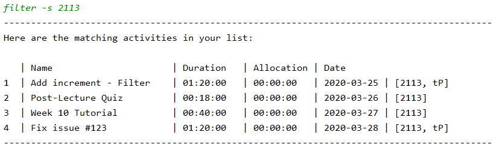

To easily see what took up the most of your time out of all the 2113 activities, use the `graph` command to view a chart of your activities. 

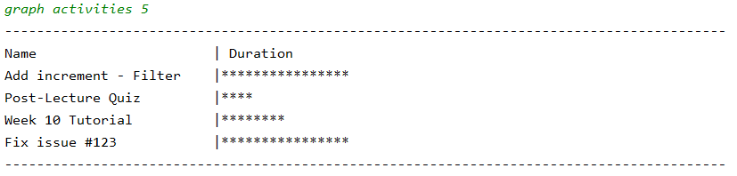

Curious about what module took up the most time this week? We can use the `graph tags` command on our weekly activity list to find out.

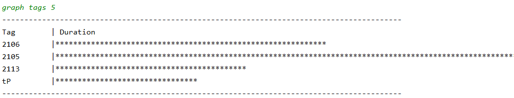

Evidently, it was CS2105.

Not done with an activity and want to continue on it? Use the `continue` command to continue recording time for a previously started activity.

Finally, when you're done and want to close the app, simply say `bye` and Jikan will exit.

This is just a quick overview of what Jikan can do for you. For more details on each individual command, read the command guide below.

## Basic Commands  
### Starting an activity: `start` 
**Usage:** Starts recording the time for a new activity.  
  
**Format:** `start ACTIVITY_NAME /a ALLOCATED_TIME /t TAGS`    
 * `ACTIVITY_NAME` can contains spaces and must be less than 25 characters.     
* `ACTIVITY_NAME` must also be unique (should the user start an already existing activity, the option to `continue` will be given).  
* `ALLOCATED_TIME` should be of the format [HH:MM:SS] and cannot exceed 23:59:59.
* `TAGS` must be single spaced separated and a maximum of 2 tags can be stored.
* `ALLOCATED_TIME` and `TAGS` are optional.  
    
**Example:**  
`start assignment /a 01:30:00 /t CS1010`   
`start GER1000 quiz /t GER GEmod`  
`start revision`  
 
**Discouraged Activity Names:**
 * The following strings are used as parameters for other commands, and hence should be avoided as it may interfere with Jikan running smoothly:
    *  `/`,`;`, `/a`, `/t`,`/a`,`-s`,`/en`,`/ea`
    
### Continuing an activity: `continue`  
**Usage:** Continues recording the time of an activity that you have previously started.  
  
**Format:** `continue ACTIVITY_NAME`  
* `ACTIVITY_NAME` must be an existing activity in the activity list.  
  
**Example:**  
`continue revision`  
  
### Ending an activity: `end`  
**Usage:** Stops recording the time for an ongoing activity and stores it into the activity list.  
  
**Format:** `end` 
* An activity must be started or continued before it can be ended.  
  
### Aborting an activity: `abort`  
**Usage:** Aborts the current activity and does not save it to the activity list.  
  
**Format:** `abort`  
* An activity must be started or continued before it can be ended.  
  
### Delete an activity: `delete`  
**Usage:** Deletes an activity in the activity list.  
  
**Format:** `delete ACTIVITY_NAME`  
  
### Listing activities: `list`  
**Usage:** Displays a list of the completed activities.  
  
**Format:** `list TIME_PERIOD` 
* If no `TIME_PERIOD` is given, all activities will be listed.  
* `TIME_PERIOD` can be `day` or `week`
* To list activities in a specific month of the current year, use `list month MONTH_NAME` where `MONTH_NAME` must be spelled out in full (i.e. January and not Jan).
* Otherwise, `TIME_PERIOD` should be of the format [dd/MM/yyyy] or [yyyy-MM-dd]  
* `TIME_PERIOD` can either be a specific date or over a range.  
  
**Example:**  
* `list` lists all activities.    
* `list month april` lists all activities in April.  
* `list week` or `list weekly` lists all activities in the current week.  
* `list week 01/01/2020` lists all activities in the week of 01/01/2020.  
* `list day` or `list daily` lists all activities in the current day.  
* `list yesterday` lists all activities completed the day before.
* `list 01/01/2020` or `list 2020-01-01` lists all activities completed on 1 Jan 2020.  
* `list 01/01/2020 20/02/2020` lists all activities than fall within 1 Jan 2020 and 20 Feb 2020.  
  
### Editing an activity: `edit`
**Usage:** Edits the name or allocated time of an activity in the activity list.

**Format** 
* `edit ACTIVITY_NAME /en NEW_NAME`
* `edit ACTIVITY_NAME /ea NEW_ALLOCATED_TIME`
    * `NEW_ALLOCATED_TIME` should be in the format [HH:MM:SS] 
    
**Example:**  
`edit CS1010 assignment /en CS1010 assignment 2` Activity name is edited to `CS1010 assignment 2`  
`edit CS1010 assignment /ea 10:00:00` Allocated time for activity is edited to `10:00:00` 
  
## Finding and Filtering
By using `find` and `filter` commands, the user can reduce clutter and zoom-in to specific activities containing certain keywords or tags. The sub-query flag `-s` allows chaining any combination of `find` and `filter` commands to further reduce clutter. These features are particularly useful when the visualisation of time spent with minimal clutter is required.

### Finding Activities by Name: `find`
**Usage:** Users can request for a sub-list of activities that has names which contain any of the given keywords. If there are more than one keyword, each keyword should be separated with ` / `.

**Format:**
* `find KEYWORD`
* `find KEYWORD1 / KEYWORD2 / KEYWORD3`

### Filtering Activities by Tags: `filter`
**Usage:** Users can request for a sub-list of activities that has specific tags. Each tag should be space separated.

**Format:**
* `filter TAGNAME`
* `filter TAGNAME1 TAGNAME2`

### Chaining Finds & Filters: `-s`
**Usage:** Users can provide the `find` and `filter` command on the last shown list (also compatible after a `list` 
command) by providing the `-s` flag after each `find` or `filter` command.

**Format:** 
* `find -s KEYWORD`
* `filter -s TAGNAME`
* `filter -s TAGNAME1 TAGNAME2`
* `find -s KEYWORD1 / KEYWORD2 / KEYWORD3`

**Example:**  
If we want to find all CS2106 tutorials, we can first use `filter 2106` to filter out all activities tagged `2106`, then use the find command with the flag, `find -s Tutorial` to get a list of all 2106 Tutorials.

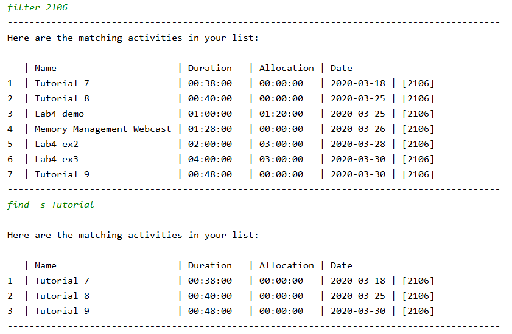

#### Single Input Chaining: `;`
**Usage:** Users can achieve the same outcome as multiple `-s` chaining with a single input. This is done by separating
`find` and `filter` commands with ` ; `.

**Examples:**
* `filter TAGNAME ; find KEYWORD1 ; find KEYWORD2`
* `filter -s TAGNAME ; find KEYWORD1 ; find KEYWORD2`

Note: `-s` is only relevant in the first command of the entire input string, as subsequent commands are automatically chained.

## Graphs
By using the following commands, users can get a visual representation of the time spent on each activity and their current progress. 
The 3 types of graphs are :
 * *Activity time graph* - Total time spent on each activity: `graph activities SCALE`
 * *Tags time graph* - Total time spent on each tag: `graph tags SCALE`
 * *Activity allocation graph* - Progress of each activity in relation to its allocated time: `graph allocations`

Tip: Use `find`, `filter` and `list` commands to reduce clutter before graphing as the graphs are based on the last shown list of activities. 

### Activity time graph: `graph activities`
**Usage:** View a comparison of the absolute time spent on each activity in the last shown list. 
The parameter `SCALE` refers to the number of minutes represented by each point on the graph.  

Note: As the units of `SCALE` is minutes, if your activity is less than a minute, graph function will not show anything.

**Format:**    `graph activities SCALE`

**Example:**    
`graph activities 10`    

### Tags time graph: `graph tags`  
**Usage:** View a comparison of the absolute time spent on each tag in the last shown list. 

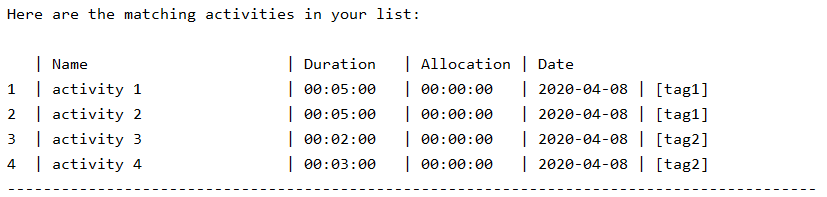

For example, if we `graph tags 1` for the activity list above, we will get the following graph:

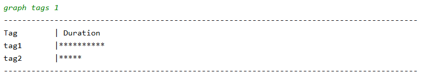

`activity 1` and `activity 2` are both tagged `tag1` and have a duration of 5 mins. 
`activity 3` and `activity 4` are both tagged `tag2` and have a duration of 2 and 3 mins respectively.   
Adding up the durations for each tag, we get 10 mins for `tag1` and 5 mins for `tag2`. As we chose the graph to have a scale of 1 min, there are (10 asterisk representing 1 min each) for `tag1` and 5 asterisks for `tag2` in the graph.  

As tags can be used to group activities of a similar nature together (i.e. same module), this feature can be used to easily see what type of activity took up the most time.

**Format:** `graph tags SCALE`

**Example:**    
`graph tags 1` 

### Activity allocation graph: `graph allocations`
**Usage:** View the progress of activities to see how much time was spent on the activity relative to the allocated time.

Note: Only activities with an `ALLOCATED_TIME` will be shown.

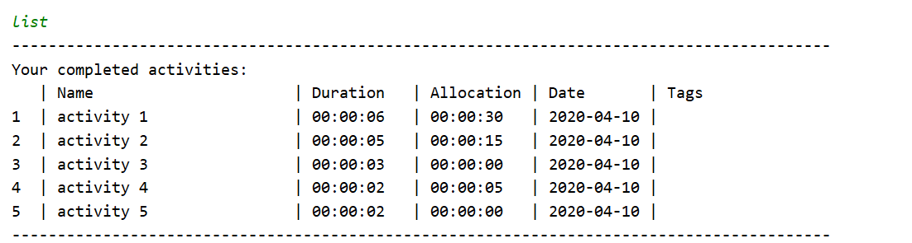

For example, if we `graph allocations` for the activity list above, we will get the following graph:

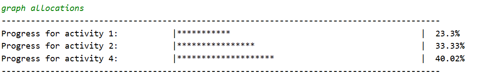

`activity 3` and `activity 5` does not have an allocated time, thus they do not appear in the graph. 
The percentage shown in the graph represents the activity's progress relative to their allocated time. (`activity 4` have a duration of 2 seconds while its allocated time was 5 seconds, 2/5 * 100% = 40%. Thus the progress of `activity 4` is 40%
as shown in the graph)

**Format:** `graph allocations`

### Chaining `list`, `find` and `filter` with `graph` command:
Using `list`, `find` and `filter` commands you can sieve out the information you wish to be graphed.

**Graph Activities Example:**  

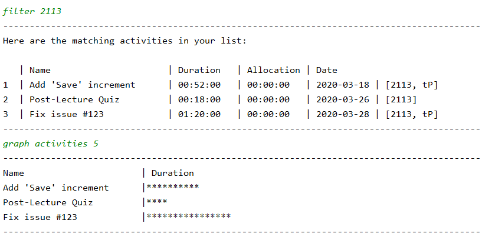

`filter 2113` gives all activities tagged `2113`, then we can use `graph activities 5` to view a graph of the duration for each activity.

**Graph Tags Example:**

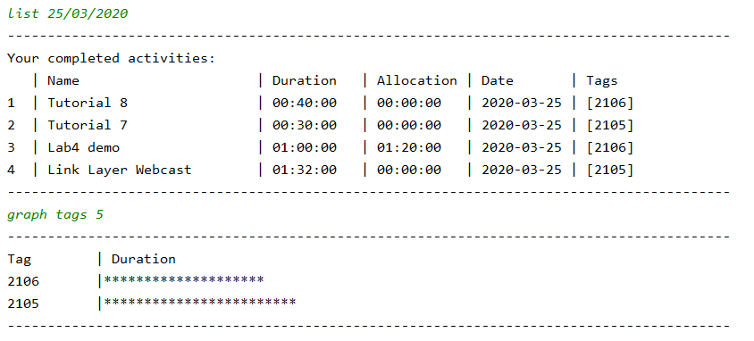 

`list 25/03/2020` gives all activities completed on 25th March 2020, then we can use `graph tags 5` to view the graph of the tags. Each asterisk represents 5 minutes, as indicated by the `SCALE` parameter of the graph command.

**Graph Allocations Example:**

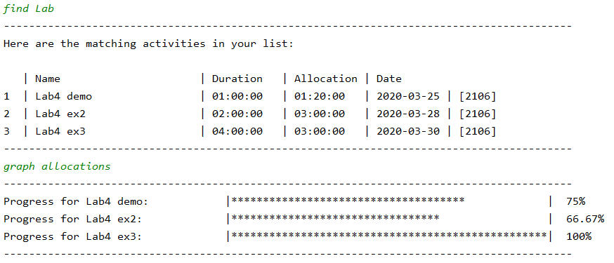 

`find Lab` gives us all `Lab` activities, then we can use `graph allocations` to view the progress bar of each of the activities to see how much time was spent on the activity relative to the time that was allocated. 

## Tag Goals

By using the `goal` command, users can set specific goals for how long they would like to spend on activities under a certain tags as well as view the amount of time they have spent in total for those activities as compared to their goal.

### Set goal: `goal TAG_NAME /g DURATION`
**Usage:** Sets a duration goal for a tag

**Format:** `goal TAG_NAME /g DURATION`  
* The duration should be in the format [HH:MM:SS]

**Example:** `goal core /g 24:00:00` a goal of `24:00:00` is added for the tag `core`  

### Delete goal: `goal TAG_NAME /d`
**Usage:** Deletes the duration goal set for the tag.

**Format:** `goal TAG_NAME /d`

### View goals: `goal`
**Usage:** Displays the tags with their goals, actual time spent on activities with these tags and the difference between the 2 timings.

**Format:** `goal`  

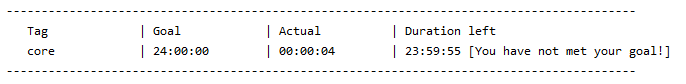  

## Automated Cleaning

Jikan provides a `clean` command where users can automate the cleaning of activities from the activity list at application startup.

### Activate cleaning: `clean on`
**Usage:** Switch on automated cleaning.

**Format:** `clean on`

### Deactivate cleaning: `clean off`
**Usage:** Switch off automated cleaning. 

**Format:** `clean off`

### Set the number of activities to clean: `clean /n`
**Usage:** Set a number of activities to clean.

**Format:** `clean /n NUMBER`

Note: Once cleaning is switched on, the automated cleaning persists (i.e cleaning will be done at every application startup) until it is switched off.

**Example:**

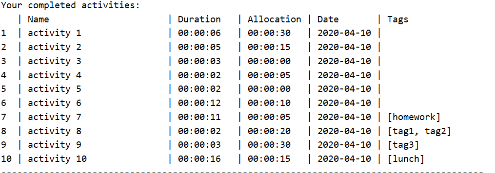

Taking a look at this cluttered activity list, we can see that there are some activities which are done (i.e duration > allocation).
Thus, to reduce clutter, we would like to get rid of these done activities. 

However, since the list is so huge, it would be troublesome to use the delete function as users will have to manually navigate through
the list to identify the done activities and delete them.

This is where the `clean` command would be useful. See that activity 6, 7 and 10 are done.

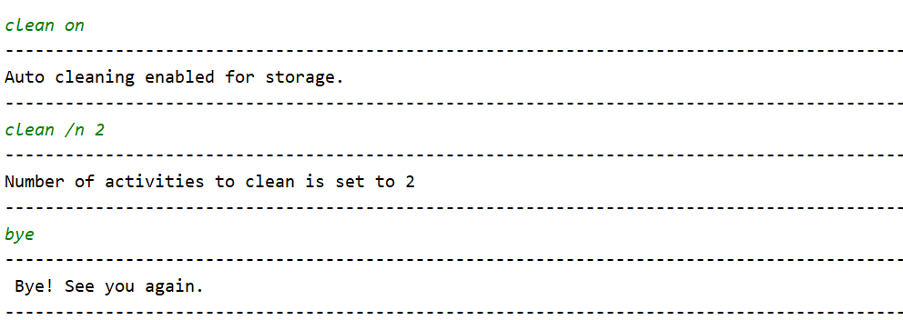

By using the `clean` command. Users can choose how much of these done activities to clean, for the example here, the number is set to 2.

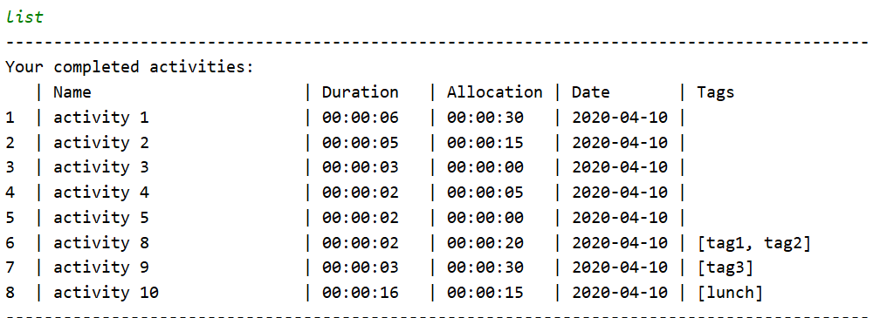

Upon the next startup, the automated cleaning will do its work and clean the 2 oldest done activities (i.e oldest here is based on date).

Note that since the user specified to clean only 2 activities, only activity 6 and 7 are cleaned and activity 10 remains in the activity list.

### Automated Cleaning for Logs:

Jikan also provides cleaning for log file which are used to record important information during program execution. This feature will be useful
to users who are running this application on systems with limited hardware (small storage space).

### Activate log cleaning: `clean log on`
**Usage:** Switch on automated cleaning.

**Format:** `clean log on`

### Deactivate log cleaning: `clean log off`
**Usage:** Switch off automated cleaning. 

**Format:** `clean log off`

### Set the number of logs to clean: `clean log /n`
**Usage:** Set number of lines of logs to clean.

**Format:** `clean log /n NUMBER`

## Command Guide

* Start an activity: `start ACTVITY_NAME` 
    * optional: `start ACTIVITY_NAME /a ALLOCATED_TIME /t TAGS`
* Abort an activity: `abort`
* Stop an activity: `end`
* Continue an activity: `continue ACTIVITY_NAME`
* List all activities: `list`
    * List today's activities: `list day` or `list daily` or `list today`
    * List yesterday's activities: `list yesterday`
    * List this week's activities: `list week` or `list weekly`
        * List a specific week's activities by day: `list week DATE` or `list weekly DATE`, 
        where `DATE` is in either `yyyy-MM-dd` or `dd/MM/yyyy` format
    * List this month's activities: `list month` or `list monthly`
        * List a specific month's activities by day: `list month MONTH_NAME` where `MONTH_NAME` must be spelled out in full
    * List a specific day's activities: `list DATE`, where `DATE` is in either `yyyy-MM-dd` or `dd/MM/yyyy` format
    * List activities within a time frame: `list DATE1 DATE2`, where both `DATE1` and `DATE2` are 
    in either `yyyy-MM-dd` or `dd/MM/yyyy` format
* Edit an activity: `edit ACTIVITY_NAME [flag]`
    * Edit activity name: `edit ACTIVITY_NAME /en NEW_NAME`
    * Edit activity allocated time: `edit ACTIVITY_NAME /ea NEW_ALLOCATED_TIME`
* Delete an activity: `delete ACTIVITY_NAME`
* Find activities with keyword: `find KEYWORD`
    * optional: `find KEYWORD1 / KEYWORD2` for multiple keywords
    * optional: `find -s KEYWORD` for more specific find
* Filter activities by tags: `filter TAG_NAME`
    * optional: `filter TAG1 TAG2` for multiple tags
    * optional: `filter -s TAG_NAME` for more specific filter
* Set a goal for tags: `goal TAG_NAME /g DURATION`
* Delete a goal for tags: `goal TAG_NAME /d`
* View goals for tags: `goal`
* Display graph by tags: `graph tags INTERVAL`
* Display graph by duration: `graph activities INTERVAL`
* Display graph by targets: `graph targets`
* Clean data files: `clean [command]`
    * Activate auto data cleaner: `clean on`
    * Activate auto log cleaner: `clean log on`
    * Deactivate auto data cleaner: `clean off`
    * Deactivate auto log cleaner: `clean log off`
    * Specify number of files to clean for data: `clean /n NUMBER`
    * Specify number of files to clean for logs: `clean log /n NUMBER`
* Terminate the program: `bye`
