<head>  
    <meta charset="UTF-8">  
    <title>Nuke User Guide v2.1</title>  
    <link href="//maxcdn.bootstrapcdn.com/font-awesome/4.2.0/css/font-awesome.min.css" rel="stylesheet"> 
</head>  

<style type="text/css">  
div {  
   text-align: justify;  
}  
.alert {  
  padding: 15px;  
  margin-bottom: 20px;  
  border: 1px solid transparent;  
  border-radius: 4px;  
}  
.alert-success {  
  background-color: #dff0d8;  
  border-color: #d6e9c6;  
  color: #3c763d;  
}  

.alert-info {  
  background-color: #d9edf7;  
  border-color: #bce8f1;  
  color: #31708f;  
}  

.alert-warning {  
  background-color: #fcf8e3;  
  border-color: #faebcc;  
  color: #8a6d3b;  
}  

.alert-error {  
  background-color: #f2dede;  
  border-color: #ebccd1;  
  color: #a94442;  
}  

</style>

# **Nuke User Guide** <small>v2.1</small>   
By: `CS2113T-T13-2` Since: `Feb 2020` <small>    
[Go to Webpage](https://ay1920s2-cs2113t-t13-2.github.io/tp/UserGuide.html)</small>     

<br>    


<hr>  

## **Table of Contents**   
<big style="color: green">**Introduction** [&#10149;](#introduction)  </big>     
<br> <big style="color: green"> **Setting Up** [&#10149;](#setting-up)  </big>     
<br> <big style="color: green"> **General Usage** [&#10149;](#general-usage)  </big>     
&nbsp; &nbsp; &nbsp; &nbsp; &#8226; **Nuke Structure** [&#10149;](#nuke-structure)     
&nbsp; &nbsp; &nbsp; &nbsp; &#8226; **Command Format** [&#10149;](#command-format)     
&nbsp; &nbsp; &nbsp; &nbsp; &#8226; **Command Prefixes** [&#10149;](#command-prefixes)     
<br> <big style="color: green">**Features** [&#10149;](#features)  </big>        
&nbsp; &nbsp; &nbsp; &nbsp;  **1. Add** [&#10149;](#1-add)    
&nbsp; &nbsp; &nbsp; &nbsp; &nbsp; &nbsp; &nbsp; &nbsp; a. Add a Module into your Module List [&#10149;](#a-add-a-module-into-your-module-list)      
&nbsp; &nbsp; &nbsp; &nbsp; &nbsp; &nbsp; &nbsp; &nbsp; b. Add a Category into your Category List [&#10149;](#b-add-a-category-into-your-category-list)      
&nbsp; &nbsp; &nbsp; &nbsp; &nbsp; &nbsp; &nbsp; &nbsp; c. Add a Task into your Task List [&#10149;](#c-add-a-task-into-your-task-list)  
&nbsp; &nbsp; &nbsp; &nbsp; &nbsp; &nbsp; &nbsp; &nbsp; d. Add a File into your File List [&#10149;](#d-add-a-file-into-your-file-list)  
&nbsp; &nbsp; &nbsp; &nbsp; &nbsp; &nbsp; &nbsp; &nbsp; e. Add a Tag to your Task  [&#10149;](#e-add-a-tag-to-your-task)    
&nbsp; &nbsp; &nbsp; &nbsp; **2. List** [&#10149;](#2-list)    
&nbsp; &nbsp; &nbsp; &nbsp; &nbsp; &nbsp; &nbsp; &nbsp; a. List your Modules [&#10149;](#a-list-your-modules)       
&nbsp; &nbsp; &nbsp; &nbsp; &nbsp; &nbsp; &nbsp; &nbsp; b. List your Categories [&#10149;](#b-list-your-categories)      
&nbsp; &nbsp; &nbsp; &nbsp; &nbsp; &nbsp; &nbsp; &nbsp; c. List your Tasks [&#10149;](#c-list-your-tasks)      
&nbsp; &nbsp; &nbsp; &nbsp; &nbsp; &nbsp; &nbsp; &nbsp; d. List your Tasks Sorted by Deadline or Priority [&#10149;](#d-list-your-tasks-sorted-by-deadline-or-priority)      
&nbsp; &nbsp; &nbsp; &nbsp; &nbsp; &nbsp; &nbsp; &nbsp; e. List your Tasks at Specified Time Period [&#10149;](#e-list-your-tasks-at-specified-time-period)      
&nbsp; &nbsp; &nbsp; &nbsp; &nbsp; &nbsp; &nbsp; &nbsp; f. List your Files [&#10149;](#f-list-your-files)      
&nbsp; &nbsp; &nbsp; &nbsp; &nbsp; &nbsp; &nbsp; &nbsp; g. List your Task's Tags [&#10149;](#g-list-your-tasks-tags)      
&nbsp; &nbsp; &nbsp; &nbsp; **3. Delete** [&#10149;](#3-delete)    
&nbsp; &nbsp; &nbsp; &nbsp; &nbsp; &nbsp; &nbsp; &nbsp; a. Delete Modules from your Module Lists [&#10149;](#a-delete-modules-from-your-module-lists)      
&nbsp; &nbsp; &nbsp; &nbsp; &nbsp; &nbsp; &nbsp; &nbsp; b. Delete Categories from your Category Lists [&#10149;](#b-delete-categories-from-your-category-lists)      
&nbsp; &nbsp; &nbsp; &nbsp; &nbsp; &nbsp; &nbsp; &nbsp; c. Delete Tasks from your Task Lists [&#10149;](#c-delete-tasks-from-your-task-lists)      
&nbsp; &nbsp; &nbsp; &nbsp; &nbsp; &nbsp; &nbsp; &nbsp; d. Delete Files from your File Lists [&#10149;](#d-delete-files-from-your-file-lists)      
&nbsp; &nbsp; &nbsp; &nbsp; &nbsp; &nbsp; &nbsp; &nbsp; e. Delete Tags from your Task [&#10149;](#e-delete-tags-from-your-task)      
&nbsp; &nbsp; &nbsp; &nbsp; **4. Edit** [&#10149;](#4-edit)    
&nbsp; &nbsp; &nbsp; &nbsp; &nbsp; &nbsp; &nbsp; &nbsp; a. Edit a Module in your Module List [&#10149;](#a-edit-a-module-in-your-module-list)      
&nbsp; &nbsp; &nbsp; &nbsp; &nbsp; &nbsp; &nbsp; &nbsp; b. Edit a Category in your Category List [&#10149;](#b-edit-a-category-in-your-category-list)      
&nbsp; &nbsp; &nbsp; &nbsp; &nbsp; &nbsp; &nbsp; &nbsp; c. Edit a Task in your Task List [&#10149;](#c-edit-a-task-in-your-task-list)      
&nbsp; &nbsp; &nbsp; &nbsp; &nbsp; &nbsp; &nbsp; &nbsp; d. Edit a File in your File List [&#10149;](#d-edit-a-file-in-your-file-list)      
&nbsp; &nbsp; &nbsp; &nbsp; &nbsp; &nbsp; &nbsp; &nbsp; e. Mark a Task as Done [&#10149;](#e-mark-a-task-as-done)      
&nbsp; &nbsp; &nbsp; &nbsp; **5. Change Directory** [&#10149;](#5-change-directory)      
&nbsp; &nbsp; &nbsp; &nbsp; **6. Open File** [&#10149;](#6-open-file)      
&nbsp; &nbsp; &nbsp; &nbsp; **7. Info** [&#10149;](#7-info)      
&nbsp; &nbsp; &nbsp; &nbsp; **8. Undo** [&#10149;](#8-undo)      
&nbsp; &nbsp; &nbsp; &nbsp; **9. Redo** [&#10149;](#9-redo)      
<br>  <big style="color: green"> **Miscellaneous Information** [&#10149;](#miscellaneous-information) </big>     
&nbsp; &nbsp; &nbsp; &nbsp; &#8226; **Help** [&#10149;](#help)    
&nbsp; &nbsp; &nbsp; &nbsp; &#8226; **Exiting the Nuke Program** [&#10149;](#exiting-the-nuke-program)    
&nbsp; &nbsp; &nbsp; &nbsp; &#8226; **Loading and Saving** [&#10149;](#loading-and-saving)    
&nbsp; &nbsp; &nbsp; &nbsp; &nbsp; &nbsp; &nbsp; &nbsp; -- Loading [&#10149;](#loading)      
&nbsp; &nbsp; &nbsp; &nbsp; &nbsp; &nbsp; &nbsp; &nbsp; -- Saving [&#10149;](#saving)      
&nbsp; &nbsp; &nbsp; &nbsp; &#8226; **Date Time Formats** [&#10149;](#date-time-formats)    
&nbsp; &nbsp; &nbsp; &nbsp; &nbsp; &nbsp; &nbsp; &nbsp; -- Date Formats [&#10149;](#date-formats)      
&nbsp; &nbsp; &nbsp; &nbsp; &nbsp; &nbsp; &nbsp; &nbsp; -- Time Formats [&#10149;](#time-formats)      
&nbsp; &nbsp; &nbsp; &nbsp; &nbsp; &nbsp; &nbsp; &nbsp; -- Time Specifier Formats [&#10149;](#time-specifier-formats)      
<br>  <big style="color: green"> **Command Summary** [&#10149;](#command-summary) </big>     
<br>  <big style="color: green"> **FAQ** [&#10149;](#faq) </big>     
&nbsp; &nbsp; &nbsp; &nbsp; &#8226; **Can I not enter the Full Path** [&#10149;](#can-i-not-enter-the-full-path)    
&nbsp; &nbsp; &nbsp; &nbsp; &#8226; **How does the Filtering Process works?** [&#10149;](#how-does-the-filtering-process-works)    
<br>  <big style="color: green"> **Contact Us** [&#10149;](#contact-us) </big>     
    
<br>    


<hr>  

## **Introduction**   
<div>  
This <b>Nuke</b> application is a simple yet powerful task management system that is dedicated to providing <b>NUS students</b> a more efficient way to organise their <i>modules</i> and <i>tasks</i>.<br>  <br>  
You will be interacting with the application via the command line. With the <b>Nuke</b> application, you will be able to perform various operations to manage your <i>modules</i> and <i>tasks</i> such as adding, deleting and listing your  <i>modules</i> and <i>tasks</i>. You may also add additional properties to your <i>tasks</i> such as <i>files</i>, <i>deadlines</i>, and <i>priorities</i>.<br>  <br>  
<b>Nuke</b> facilitates users by automatically sorting user-added <i>tasks</i> and displaying the most important and urgent ones to the users. In the long term, it strives to enhance the quality of NUS students’ lives by serving as the one-stop platform for efficient management of module tasks.<br>  <br>  
If you are an <b>NUS student</b> and have not tried out <b>Nuke</b> yet... <br>   
What are you waiting for? Give <b>Nuke</b> a shot, and you will see how amazing it is!     
</div>  

[Back To Top](#table-of-contents)  

<br>    


<hr>  

## **Setting Up**  

#### **1.1. Prerequisites**

1. JDK 11
2. IntelliJ IDE

#### **1.2. Setting up the project**
1.  Fork [this repository](https://github.com/AY1920S2-CS2113T-T13-2/tp), and clone the fork to your computer

2.  Open the IntelliJ IDE. If you are not in the welcome screen, click `File` &gt; `Close Project` to close the existing project.

3.  Set up the correct JDK version for Gradle

    1.  Click `Configure` &gt; `Project Defaults` &gt; `Project Structure`

    2.  Click `New...` and find the directory of the JDK

4.  Click on `Import Project`

5.  Locate and select the `build.gradle` file, then click `OK`

6.  Click `Open as Project`

7.  Click `OK` to use the default settings provided

#### **1.3. Verifying the Setup**
1.  In an IntelliJ terminal, run `gradlew build`

2.  Navigate to the folder `build` &gt; `libs` by executing  `cd build/libs/` and then run: `java -jar nuke-2.0.jar`

    1.  To use **Nuke**, type a valid command into the terminal and press the enter key to run the command. 
        e.g. Typing `help` and pressing the enter key will show the available commands and their respective command usage help messages.

    2.  Some example commands you can try to get familiar with **Nuke**:

        -   `help`: Lists the commands that **Nuke** supports.
-   `addm cs2113t`: Adds a module with module code cs2113t, **Nuke** will recognize it as the module  *Software Engineering & Object-Oriented Programming* and add it to your Module List.
        -   `addt assignment2 -m cs2113t -c Assignment -d tmr 23:59 -p 20` : Adds a task named `assignment2` which belongs to *module* `cs2113t` and *category* `Assignment` with a *deadline* `tomorrow 23:59` and *priority* of `20`
-   `bye`: Exits **Nuke**.


[Back To Top](#table-of-contents)  

<br>    


<hr>  

## **General Usage**   
This section will explain the fundamental structure of the **Nuke** application, and important guidelines to follow to ensure smooth usage of the application.    

### **Nuke Structure**  
**Nuke** follows the structure of a **Directory Tree** &#127795; _(i.e. folder sub-folder structure)_. This Directory Tree comprises various levels:  

<div style="text-align: center"><span style="color: green"><small>Table <b>Directory Levels</b></small></span></div>  

| Directory Level | Description                                                                      |
|:---------------:|----------------------------------------------------------------------------------|
| **Root** | The **base** of the Directory Tree. Only **one** root exists in the entire Tree.<br>Added _modules_ are in this level. |
| **Module** | The **second** level of the Directory Tree.<br>Added _categories_ are in this level.  |
| **Category** | The **third** level of the Directory Tree.<br>Added _tasks_ are in this level.      |
| **Task** | The **fourth** level of the Directory Tree.<br>Added _files_ are in this level.         |
| **File** | The **last** level of the Directory Tree.<br>Nothing else can be added.                 |

<br>  

Below is an illustration of a possible <b>Directory Tree</b> structure:      
<br>  
    
<span style="color: green"><small><i>Figure <b>Sample Directory Tree</b></i></small></span>  

<br>  

#### **Root**    
The **Root** Directory is the **base** of the entire Directory Tree. Only **one** root exists in the entire Tree. _Modules_ are added into this level into a **Module List**. A _module_ consists of both a *module code* and a _module title_.   

<div class="alert alert-warning">  
<i class="fa fa-exclamation"></i> <b>Note</b> <br>   
Only <b>NUS modules</b> are allowed to be added in <b>Nuke</b>.    
</div>  

#### **Module**   
The **Module** Directory is the **second** level of the Directory Tree.  Each _module_ has a **Category List** that has several _categories_ to categorise your _tasks_, such as Lecture, Tutorial and Assignment, so that you can further organise your _tasks_. A _category_ consists of a _name_ and a _priority_ to indicate the importance of the _tasks_ in that _category_.    
<div class="alert alert-info">  
<i class="fa fa-info"></i> <b>Info</b> <br>   
Upon adding a <i>module</i>, <b>Nuke</b> automatically adds four <i>categories</i> into the <i>module</i>. They are Lecture, Tutorial, Assignment and Lab. So, you don't have to add those <i>categories</i> yourself!  
</div>     

#### **Category**  
The **Category** Directory is the **third** level of the Directory Tree. Each _category_ has a **Task List** that can contain any number of _tasks_, which are ideally related to the _category_. A _task_ has several attributes, namely the _description_, _deadline_ of the _task_ if any, _priority_ and the _done status_ of the _task_.  

#### **Task**  
The **Task** Directory is the **fourth** level of the Directory Tree. Each _task_ can have _files_ attached to the it. _Files_ are stored in the **File List**. The _file_ must have a _file name_ and the _path_ to the _file_.     

#### **File**  
The **File** Directory is the **last** level of the Directory Tree. It contains no other directories.     

<div class="alert alert-warning">  
<i class="fa fa-exclamation"></i> <b>Note</b> <br>   
The <b>Nuke</b> application adheres to this Directory Tree structure strictly. It is important to note that you can only add a directory into a directory which is <b><i>exactly</i> one level lower</b>. <br>  
For example, you can only add a <i>task</i> into the <b>Category</b> directory, and not directly into the <b>Module</b> directory.  
</div>  

<div class="alert alert-info">  
<i class="fa fa-info"></i> <b>Tip</b> <br>   
You can shorten the commands you enter by first entering into a directory. Then you do <b>not</b> need to enter the full <i>directory path</i> in your command! <br><br>  
To learn how to traverse the various directories, see the <b><a href="#5-change-directory">Change Directory</a></b> command.  
</div>     
[Back To Top](#table-of-contents)  

<br>  

### **Command Format**   
In this <b>User Guide</b>, the format for each feature _(command)_ will usually be of this form:    
`CommandWord <attr0> -pfix1 <attr1> ... [ -pfix2 <attr2> ... ] { -pfix3 <attr3> -pfix4 <attr4> ... }`  

#### **Command Word**  
Each command you give to **Nuke** has to begin with its corresponding unique **command word**. This helps **Nuke** to know that you want it to execute a particular command.    

#### **Attribute**  
**Attributes** are information to be provided in the command. An **attribute** for the command will be wrapped in angular brackets `< >` to help you to recognise it.     

#### **Prefix**  
A **prefix** is used to provide additional supplementary information to the command. More information on the various **command prefixes** can be found [here](#command-prefixes).     

#### **Optional**   
Some **attributes** and **prefixes** are _optional_ and the command can still execute properly even when omitted. However, they may be useful if you want to provide a more specific information to the command. Optional **attributes** and **prefixes** will be wrapped in square brackets `[ ]` to help you to recognise them.     

#### **Any**    
There are times when you may have to include at least one from a set of **attributes** and **prefixes**. You may choose to include one <i>or</i> more from the set, but <b>not</b> none of them. Such **attributes** and **prefixes** will be wrapped in curly brackets `{ }` to help you to recognise them.     

[Back To Top](#table-of-contents)  

<br>  

### **Command Prefixes**  
On many occasions, you may be required to enter more information to describe the commands you give to **Nuke**. For example, when adding a _task_, you may need to specify the _module_ and _category_ to add the _task_ into. You may also want to include additional attributes such as the _deadline_ and _priority_. All these information can only be recognised by **Nuke** if they are preceded by the correct **prefix**.<br>      
All **command prefixes** in **Nuke** begins with a `-` and followed by a **letter**. Below is the exhaustive list of **command prefixes** and general information that should follow after.     

<div style="text-align: center"><span style="color: green"><small>Table <b>Command Prefixes</b></small></span></div>  

| Command Prefix | General Definition                                               |
|:--------------:|------------------------------------------------------------------|
| `-m`           | The _module code_ of the _**m**odule_ |
| `-c`           | The _name_ of the _**c**ategory_ |
| `-t`           | The _description_ of the _**t**ask_ |
| `-f`           | The _name_ or _path_ of the _**f**ile_ |
| `-d`           | The _**d**eadline_ of the _task_ |
| `-p`           | The _**p**riority_ of the _category_ or _task_ |
| `-e`           | To indicate whether filtering is done **e**xactly                |
| `-a`           | To indicate whether filtering is done across **a**ll directories |

<br>  

<div class="alert alert-warning">  
<i class="fa fa-exclamation"></i> <b>Note</b> <br>   
Because each <b>prefix</b> begins with a <code>-</code>, <b>Nuke</b> has to unfortunately restrict your choice of names for the directories. <br>  
Specifically, each word in the name of your directory has to begin with a alpha-numeric <i>(i.e. non-symbol)</i> or underscore character.  
</div>  

[Back To Top](#table-of-contents)    

<br>    


<hr>  

## **Features**  
### **1. Add**  
Adds a <i>module</i>, <i>category</i>,  <i>task</i> or <i>file</i> into their respective lists.<br>   

As mentioned previously, **Nuke** follows the structure of a [**Directory Tree**](#nuke-structure) _(i.e. folder sub-folder structure)_. **Nuke** complements the Linux shell command by offering a generic add command word for creating a directory: `mkdir` <br>   
Below sums up what `mkdir` does at each level of the Directory.   

<div style="text-align: center"><span style="color: green"><small>Table <b>Generic Add</b></small></span></div>  

| Current Level   | What Happens?                                                        |
|:---------------:|----------------------------------------------------------------------|
| <b>Root</b>     | `mkdir <module code>` adds a *module* into the current directory     |
| <b>Module</b>   | `mkdir <category name>` adds a *category* into the current directory |
| <b>Category</b> | `mkdir <task description>` adds a *task* into the current directory  |
| <b>Task</b>     | `mkdir <file name>` adds a *file* into the current directory         |
| <b>File</b>     | You cannot `mkdir` here! &#128532;                                   |


The above commands have to be done in their corresponding directories. Conversely, the commands below can be done in any directory, but may require you to enter <i>additional</i> information.     

<div class="alert alert-info">  
<i class="fa fa-info"></i> <b>Tip</b> <br>   
In many of the <b>Add</b> commands, you have to enter the <i>directory path</i> of the <i>directory</i> you wish to add the item into. You <b>can</b> shorten the commands you enter by first entering into a directory. Then you do <b>not</b> need to enter the full <i>directory path</i> in your command! &#128522; <br><br>  
To learn how to traverse the various directories, see the <b><a href="#5-change-directory">Change Directory</a></b> command.  <br><br>  
For more information on how and if you can <b>not</b> enter  the <i>full directory path</i>, see <a href="#can-i-not-enter-the-full-path">here</a>.  
</div>     


[Back To Top](#table-of-contents)  
<br>  


#### **a. Add a Module into your Module List**   
`addm` adds a _module_ into your **Module List**. The **Module List** contains all your added _modules_ and can be viewed via the <b>[List Module command](#a-list-your-modules)</b>.  

##### **Format**   
`addm <module code>` 

- `module code` -- The _module code_ of the   _module_    
  
<div class="alert alert-warning">  
<i class="fa fa-exclamation"></i> <b>Note</b> <br>   
The <i>module code</i> is case-<b>insensitive</b>. However, it must correspond to a valid <b>NUS module</b>. Only <b>NUS modules</b> can be added in this version of <b>Nuke</b>.  
</div>  

##### **Example Usage**   
```  
addm cs2113t  
```

##### **Expected Outcome**  
    

<small><b>Before</b></small>     
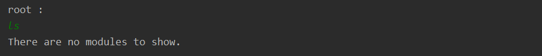    

<small><b>After</b></small>     
     

[Back To Top](#table-of-contents)     

<br>  

#### **b. Add a Category into your Category List**  
`addc` adds a _category_ into your **Category List**. The **Category List** contains all your added _categories_ in the _module_ and can be viewed via the <b>[List Category](#b-list-your-categories)</b> command.  

##### **Format**   
`addc <category name> -m <module code> [ -p <priority> ]`   

- `category name` -- The _name_ of the   _category_  
- `module code` -- The _module code_ of the _module_ to contain the _category_ to be added  
- `priority` -- A number indicating the  _priority_ of the _category_ <i>(optional)</i>    
  
<div clas s="alert alert-warning">  
<i class="fa fa-exclamation"></i> <b>Note</b> <br>   
The <code>category name</code> <b>cannot </b> exceed <b>15</b> characters. &#128534; <br>  The <code>priority</code> that you give must be a number between 0 and 20 inclusive. The bigger the number, the more important the category. If the <code>priority</code> is not given, then it will be set to <b>0</b>.    
</div>  

##### **Example Usage**  
```  
addc Project -m cs2113t -p 3  
```

##### **Expected Outcome**  
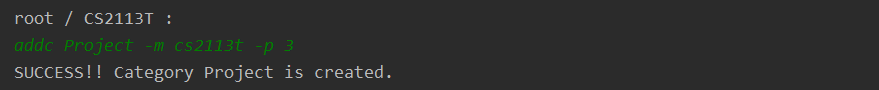     

<small><b>Before</b></small>     
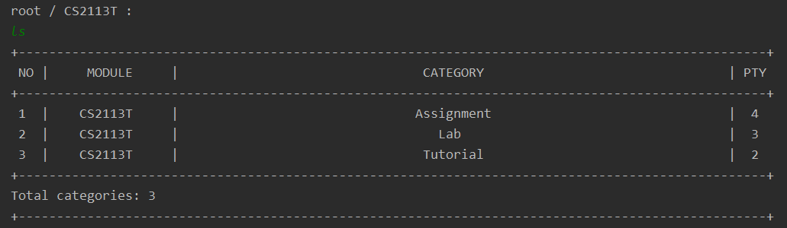     

<small><b>After</b></small>     
     

[Back To Top](#table-of-contents)  

<br>  

#### **c. Add a Task into your Task List**  
`addt` adds a _task_ into your **Task List**. The **Task List** contains all your added _tasks_ in the _category_ and can be viewed via the <b>[List Task](#c-list-your-tasks)</b> command.  

##### **Format**   
`addt <task description> -m <module code> -c <category name> [ -d <deadline> -p <priority> ]`    

- `task description` -- The _description_ of the _task_   
- `module code` -- The _module code_ of the _module_ to contain the _category_ to be added    
- `category name` -- The _name_ of the   _category_    
- `deadline` -- The _deadline_ of the _task_     
- `priority` -- A number indicating the  _priority_ of the _category_     

<div class="alert alert-warning">  
<i class="fa fa-exclamation"></i> <b>Note</b> <br>   
The <code>task description</code> <b>cannot </b> exceed <b>25</b> characters. &#128534; <br>  
The <code>priority</code> that you give must be a number between 0 and 20 inclusive. The bigger the number, the more important the category. If the <code>priority</code> is not given, then it will be set to the same <i>priority</i> as it's <i>category</i>.<br><br>  
The <code>deadline</code> provided consists of a <i>date</i>, followed by a <i>time</i>. If the <i>date</i> is omitted, <b>Nuke</b> will set it to the current date on your device. If <i>time</i> is omitted, <b>Nuke</b> will set it to be <b>11:59PM</b>. <br>  
The <code>deadline</code> provided must adhere to the set of accepted <b><a href = '#date-time-formats'>Date Time formats</a></b>. &#128529;  
</div>  

##### **Example Usage**    
```  
addt urgent assignment -m cs2113t -c Assignment -d tmr 2359 -p 15  
```

##### **Expected Outcome**    
    

<small><b>Before</b></small>     
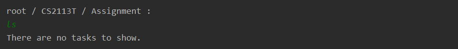    

<small><b>After</b></small>     
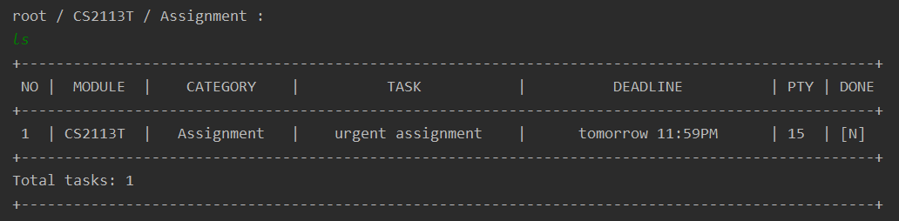     


[Back To Top](#table-of-contents)  
    
<br>  

#### **d. Add a File into your File List**     
`addf` adds a _file_ into your _task_'s **File List**. The **File List** contains all your added _files_ and can be viewed via the <b>[List File](#f-list-your-files)</b> command.    

##### **Format**    
`addf [ <file name> ] -m <module code> -c <category name> -t <task description> -f <file path>`   

- `file name` -- The _name_ of the _file_ <i>(optional)</i>   
- `module code` -- The _module code_ of the _module_ to contain the _category_ to be added     
- `category name` -- The _name_ of the   _category_      
- `task decription` -- The _description_ of the _task_     
- `file path` -- The **absolute** _path_ of the _file_    

<div class="alert alert-warning">   
<i class="fa fa-exclamation"></i> <b>Note</b> <br>   
The <code>file path</code> provided must exist. Otherwise, an error message will be displayed. &#128543; <br>  
Also, the <code>file name</code> <b>cannot</b> exceed <b>30</b> characters. &#128566;  
</div>  

<div class="alert alert-info">  
<i class="fa fa-info"></i> <b>Info</b> <br>   
The <code>file path</code> should be the <b>absolute</b> <i>path</i> of the <i>file</i>. For <b>Windows</b>, the <b>absolute</b> <i>path</i> will usually start as such: <code>C:\Users\...</code><br>  <br>  
The <code>file name</code> provided can be different from the real <i>file name</i> that is stored in the disk. <br>    
You can choose to leave the <code>file name</code> blank. In this case, <b>Nuke</b> will set your <code>file name</code> to be the <i>name</i> of your <i>file</i> without the extension at the back. For example, <code>sample_file.pdf</code> will become <code>sample_file</code>.  
</div>  

##### **Example Usage**  
```  
addf textbook -m CS2113t -c Assignment -t urgent assignment -f C:\Users\\Desktop\CS2113T_Textbook.pdf  
```
```  
addf textbook.pdf -t urgent assignment -f C:\Users\\Desktop\CS2113T_Textbook.pdf  
```
```  
addf textbook.pdf -f C:\Users\\Desktop\CS2113T_Textbook.pdf  
```

##### **Expected Outcome** 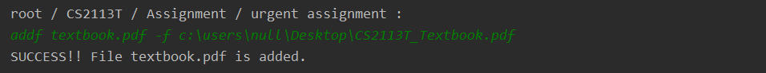    

<small><b>Before</b></small>     
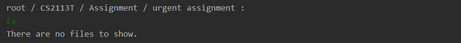    

<small><b>After</b></small>     
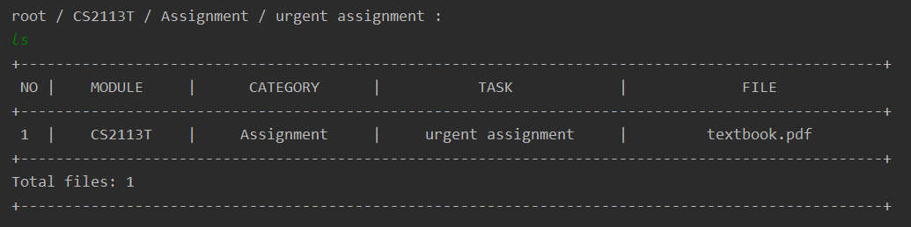     


[Back To Top](#table-of-contents)  
<br>  

#### **e. Add a Tag to your Task**   
Adds a _tag_ to your _task_'s **Tag List**. The **Tag List** contains all your added _tags_ to the _task_.   

##### **Format**  
`addg <tag name> -m <module code> -c <category name> -t <task description>`    

- `tag name` -- The <i>name</i> of the  _tag_ to be added     
- `module code` -- The _module code_ of the _module_ to contain the _category_ to be added     
- `category name` -- The _name_ of the   _category_ - `task decription` -- The _description_ of the _task_   

  
##### **Example Usage**     
```  
addg urgent -m CS2113t -c Lab -t tp  
```
```  
addg urgent -t tp  
```
```  
addg urgent  
```

##### **Expected Outcome**   
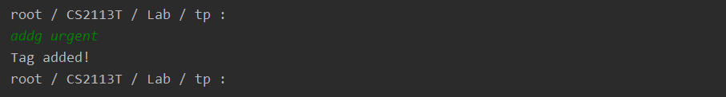    

<small><b>Before</b></small>     


<small><b>After</b></small>     


[Back To Top](#table-of-contents)  

<br><br>  

### **2. List**   
Lists filtered <i>modules</i>, <i>categories</i>, <i>tasks</i> or <i>files</i>. <br>    

Similar to a Linux shell, <b>Nuke</b> has a generic command word for listing <i>child directories</i>: `ls` <br>  
In the table below, you can find what `ls` does at each level of the Directory.    

<div style="text-align: center"><span style="color: green"><small>Table <b>Generic List Command</b></small></span></div>   

| Current Level   | What Happens?                                                           |
|:---------------:|-------------------------------------------------------------------------|
| <b>Root</b>     | `ls` shows all your <i>modules</i> in your <b>Module List</b><br>`ls <module code>` shows all the <i>categories</i> in the <b>Category List</b> of that <i>module</i>           |
| <b>Module</b>   | `ls` shows all your <i>categories</i> in the <i>module</i>'s <b>Category List</b><br>`ls <category name>` shows all the <i>tasks</i> in the <b>Task List</b> of that <i>category</i> |
| <b>Category</b> | `ls` shows all your <i>tasks</i> in the <i>category</i>'s <b>Task List</b><br>`ls <task description>` shows all the <i>files</i> in the <b>File List</b> of that <i>task</i>        |
| <b>Task</b>     | `ls` shows all your <i>files</i> in the <i>task</i>'s <b>File List</b>  |
| <b>File</b>     | You cannot `ls` here! &#128550;                                         |

The above commands have to be done in their corresponding directories. On the other hand, the commands below can be done in any directory, but may require you to enter <i>additional</i> information.       

<div class="alert alert-info">  
<i class="fa fa-info"></i> <b>Info</b> <br>   
Both <b>List</b> commands <i>(with the exception of <b><a href="#d-list-your-tasks-sorted-by-deadline-or-priority">List your Tasks Sorted by Deadline or Priority</a></b> and <b><a href="#e-list-your-tasks-at-specified-time-period">List your Tasks at Specified Time Period</a></b>)</i> and <b><a href="#3-delete">Delete</a></b> commands function by first filtering the relevant items from the <i>keywords</i> that you provide. You can further choose to enter <code>-e</code> to filter using the <b><i>exact</i></b> <i>keyword</i>, and <code>-a</code> to filter across <b><i>all</i></b> the directories. <br>    
For more information on how filtering is done, see <a href="#how-does-the-filtering-process-works">here</a>.  
</div>     

[Back To Top](#table-of-contents)  
<br>  

#### **a. List your Modules**    
`lsm` will show your filtered <i>module(s)</i> in your <b>Module List</b>.   

##### **Format**   
`lsm [ <module keyword> -e -a ]`     
- `module keyword` -- The <i>keyword</i> to filter the <i>modules'</i> <i>code</i> by        
  
<div class="alert alert-info">  
<i class="fa fa-info"></i> <b>Info</b> <br>   
If the <code>module keyword</code> is provided, <code>lsm</code> will list out all <i>modules</i> with <i>module code</i> containing the  <code>module keyword</code>. Otherwise, it will show <b>all</b> your <i>modules</i>.  
</div>     

##### **Example Usage**    
```  
lsm  
```

##### **Expected Outcome**    
  

[Back To Top](#table-of-contents)  
<br>  
    
#### **b. List your Categories**  
`lsc` will show your filtered <i>category(s)</i>.  

##### **Format**   
`lsc [ <category keyword> -m <module code> -e -a ]`    

- `category keyword` -- The <i>keyword</i> to filter the <i>categories'</i> <i>name</i> by      
- `module keyword` -- The <i>keyword</i> to filter the <i>modules'</i> <i>code</i> by       
  
##### **Example Usage**  
```  
lsc -m cs2113t  
```
```  
lsc  
```

##### **Expected Outcome**    
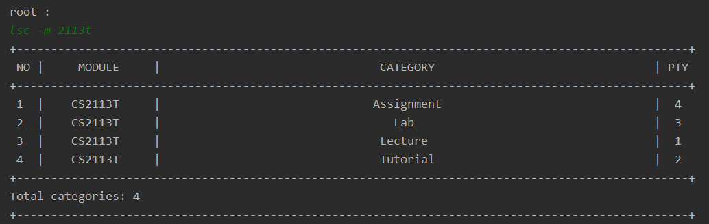  

[Back To Top](#table-of-contents)  
<br>  

#### **c. List your Tasks**     
`lst` will show your filtered <i>task(s)</i>.   

##### **Format**   
`lst [ <task keyword> -m <module keyword> -c <category keyword> -e -a ]`    

- `file keyword` -- The <i>keyword</i> to filter the <i>files'</i> <i>name</i> by         
- `module keyword` -- The <i>keyword</i> to filter the <i>modules'</i> <i>code</i> by       
- `category keyword` -- The <i>keyword</i> to filter the <i>categories'</i> <i>name</i> by       
- `task keyword` -- The <i>keyword</i> to filter the <i>tasks'</i> <i>description</i> by        
  
##### **Example Usage**   
```  
lst -m cs2113t -c Assignment  
```
```  
lst -c Assignment  
```
```  
lst  
```

##### **Expected Outcome**    
  

[Back To Top](#table-of-contents)  
<br>  


#### **d. List your Tasks Sorted by Deadline or Priority**    
`lsts` shows your <b>undone</b> <i>tasks</i>. By default, the <i>tasks</i> will be sorted by <i>deadline</i>, from the earliest to the latest <i>deadline</i>.  You may also specify in the command to sort your <i>tasks</i> by <i>priority</i> instead, in descending order of <i>priority</i>, by including the `-p` prefix. <br>  
Also, you can further choose to view the sorted <i>tasks</i> of a specific <i>module</i>. By default, this command will show you the sorted list of <b>all</b> your <i>tasks</i>. You can enter the `module code` to view the sorted list of the <i>tasks</i> in that <i>module</i> instead.   

##### **Format**    
`lsts [ <module code> -d -p (choose at most one; default -d) ]`  

 `module code` -- The <i>module code</i> of the <i>module</i> for which its sorted list of <i>tasks</i> is to be shown  

<div class="alert alert-warning">  
<i class="fa fa-exclamation"></i> <b>Note</b> <br>   
Since the command sorts by <i>deadline</i> by default, you need <b>not</b> include the <code>-d</code> prefix if you want to sort your <i>tasks</i> by <i>deadline</i> &#128521;. <br>  
However, you must choose between sorting by <i>deadline</i> <i><u>or</u></i> by <i>priority</i>. Entering both <code>-d</code> <i><u>and</u></i> <code>-p</code> will cause an error message to be shown &#128552;.   
</div>     

##### **Example Usage**    
```  
lsts  
```
```  
lsts -p  
```
```  
lsts cs2113 -p  
```

##### **Expected Outcome**    
<small><u><b>Sort by Deadline</b></u></small>    
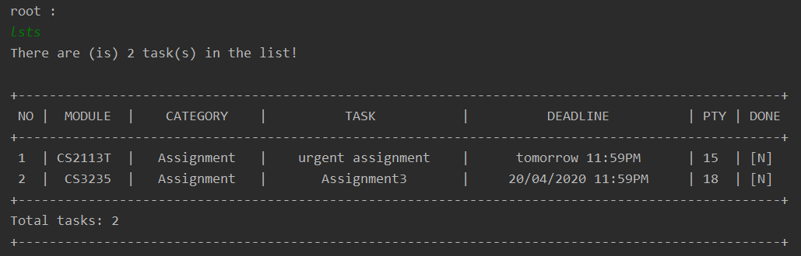    
<br>  
<small><u><b>Sort by Priority</b></u></small>     
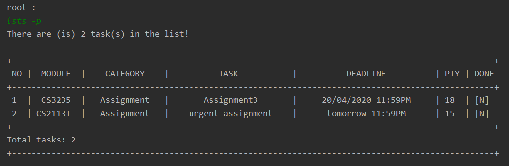    
<br>    
<small><u><b>Sort with Specified Module</b></u></small>     
      

[Back To Top](#table-of-contents)   
<br>  

#### **e. List your Tasks at Specified Time Period**    
`due` filters through <b>all</b> your tasks according to a specified <i>time period</i>. <br>  

A <i>time period</i> is defined by an <u>optional</u> <i>time specifier (e.g. on, before, after)</i> and a <i>date</i>. If the <i>time specifier</i> is left out, the <i>time period</i> is set to be <b>on</b> the <i>date</i> itself.  <br>  

The filtered <i>tasks</i> are then shown as a list.  

<div class="alert alert-info">  
<i class="fa fa-info"></i> <b>Info</b> <br>   
By default, only <b>undone</b> <i>tasks</i> will be shown. You can choose to include the <b>done</b> <i>tasks</i> as well by appending <code>-a</code> at the end of the command. <br>  
As a bonus, you can also filter for <b>overdue</b> <i>tasks</i>. Simply enter <code>due over</code> to do so! &#128521;  
</div>  

##### **Format**    
`due <time specifier> <date> [ -a ]`   

- `time specifier` -- The  <u>optional</u> <i>time specifier</i> to define the <i>time period</i> to filter the <i>tasks</i>     
- `date` -- The <i>date</i> to define the <i>time period</i> to filter the <i>tasks</i>     
  
<div class="alert alert-warning">  
<i class="fa fa-exclamation"></i> <b>Note</b> <br>   
The <code>time specifier</code> and <code>date</code> that you provide must adhere to the set of <b>Nuke</b>'s accepted <b><a href="#date-formats">Date formats</a></b>.  
</div>  

##### **Example Usage**  
```  
due after sun -a  
```
```  
due tdy  
```
```  
due over  
```

##### **Expected Outcome**   
<small><u><b>With Time Specifier</b></u></small>    
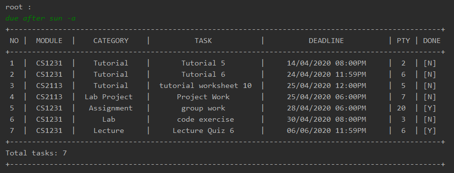      
<br>    
<small><u><b>Without Time Specifier</b></u></small>     
     
<br>    
<small><u><b>Overdue</b></u></small>     
     

[Back To Top](#table-of-contents)     
<br>    

#### **f. List your Files**  
`lsf` will show your filtered <i>files(s)</i>.   

##### **Format**   
`lsf [ <file keyword> -m <module keyword> -c <category keyword> -t <task keyword> -e -a ]`  

- `file keyword` -- The <i>keyword</i> to filter the <i>files'</i> <i>name</i> by         
- `module keyword` -- The <i>keyword</i> to filter the <i>modules'</i> <i>code</i> by       
- `category keyword` -- The <i>keyword</i> to filter the <i>categories'</i> <i>name</i> by       
- `task keyword` -- The <i>keyword</i> to filter the <i>tasks'</i> <i>description</i> by        
  
##### **Example Usage**     
```  
lsf -m cs2113t -c Assignment -t urgent assignment  
```
```  
lsf -c Assignment  
```
```  
lsf -t urgent assignment  
```
```  
lsf  
```

##### **Expected Outcome**     
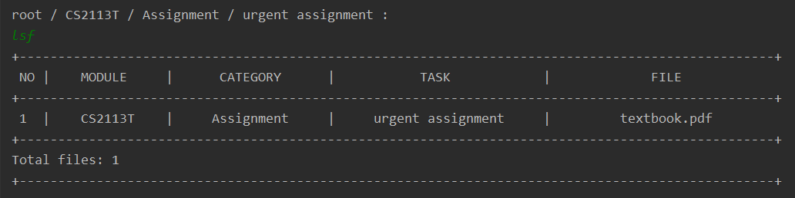  

[Back To Top](#table-of-contents)  
<br>  

#### **g. List your Task's Tags**   
`lsg` will show your filtered <i>tag(s)</i>.      
    
##### **Format**   
`lsg [ <tag keyword> -m <module keyword> -c <category keyword> -t <task keyword> -e -a ]`  

- `tag keyword` -- The <i>keyword</i> to filter the <i>tags'</i> <i>name</i> by         
- `module keyword` -- The <i>keyword</i> to filter the <i>modules'</i> <i>code</i> by       
- `category keyword` -- The <i>keyword</i> to filter the <i>categories'</i> <i>name</i> by       
- `task keyword` -- The <i>keyword</i> to filter the <i>tasks'</i> <i>description</i> by        
  
##### **Example Usage**     
```  
lsg 
```
```  
lsg urgent  
```
```  
lsg -m CS -c Lab  
```
```  
lsg -m cs2113t -c Assignment -t assignment1 
```

##### **Expected Outcome**     
  

[Back To Top](#table-of-contents)  

<br><br>  


### **3. Delete**   
Deletes <i>modules</i>, <i>categories</i>,  <i>tasks</i>, <i>files</i> or <i>tags</i> from their respective lists.     
You will be prompted to either enter `yes` to confirm the deletion <i>or</i> `no` to abort the deletion after entering the <b>Delete</b> command.     
<br>    
Like the [<b>Add</b>](#1-add) Command, **Nuke** also supports a generic command for deleting a directory: `rm` <br>     
The table below shows you `rm` does at each level of the Directory.   

<div style="text-align: center"><span style="color: green"><small>Table <b>Generic Delete Command</b></small></span></div>  

| Current Level   | What Happens?                                                        |
|:---------------:|----------------------------------------------------------------------|
| <b>Root</b>     | `rm <module code>` deletes a *module* from the current directory     |
| <b>Module</b>   | `rm <category name>` deletes a *category* from the current directory |
| <b>Category</b> | `rm <task description>` deletes a *task* from the current directory  |
| <b>Task</b>     | `rm <file name>` deletes a *file* from the current directory         |
| <b>File</b>     | You cannot `rm` here! &#128556;                                      |

The above commands have to be done in their corresponding directories. However, the commands below can be done in any directory, but may require you to enter <i>additional</i> information.      

<div class="alert alert-info">  
<i class="fa fa-info"></i> <b>Info</b> <br>   
Just like the <b><a href="#2-list">List</a></b> commands, the <b>Delete</b> command works by first filtering the relevant items from the <i>keywords</i> that you provide. You can further choose to enter <code>-e</code> to filter to the <b><i>exact</i></b> <i>keyword</i>, and <code>-a</code> to filter across <b><i>all</i></b> the directories. <br>    
For more information on how filtering is done, see <a href="#how-does-the-filtering-process-works">here</a>.  <br>  
<br>  
If there are <b>multiple</b> matches after filtering, you will receive a further prompt to let you choose which items you want to delete.  
</div>     

<div class="alert alert-warning">  
<i class="fa fa-exclamation"></i> <b>Note</b> <br>   
Please do <b>not</b> delete the <i>directory</i> you are in, <i>or</i> any of your current <i>directory</i>'s <i>parent directories</i>. Doing so will result in an error message to be shown &#128543;.   
</div>     
[Back To Top](#table-of-contents)  

#### **a. Delete Modules from your Module Lists**   

`delm` deletes <i>module(s)</i> from your <b>Module Lists</b>. The <b>Module List</b> contains all your added <i>modules</i> and can be viewed via the [<b>List Module</b>](#a-list-your-modules) command.   

##### **Format**   
`delm [ <module keyword> -e -a ]`   
- `module keyword` -- The <i>keyword</i> to filter the <i>modules'</i> <i>code</i> by      
  
##### **Example Usage**  
```  
delm cs2113t  
```
```  
delm cs  
```

##### **Expected Outcome**  
<small><u><b>Single Deletion</b></u></small>     
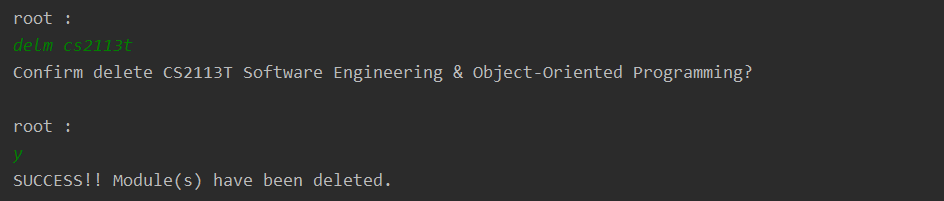  

<small><b>Before</b></small>     
  

<small><b>After</b></small>     
  

<br>    
<small><u><b>Multiple Deletion</b></u></small>     

     

[Back To Top](#table-of-contents)  
<br>  

#### **b. Delete Categories from your Category Lists**     
`delc` deletes <i>category(s)</i> from your <b>Category Lists</b>. The <b>Category List</b> contains all your added <i>categories</i> of a <i>module</i> and can be viewed via the [<b>List Category</b>](#b-list-your-categories) command.     

##### **Format**   
`delc [ <category name> -m <module code> -e -a ]`   

- `category keyword` -- The <i>keyword</i> to filter the <i>categories'</i> <i>name</i> by     
- `module keyword` -- The <i>keyword</i> to filter the <i>modules'</i> <i>code</i> by   
  
##### **Example Usage**    
```  
delc Tutorial  
```
```  
delc lec -a  
```

##### **Expected Outcome**    
<small><u><b>Single Deletion</b></u></small>    
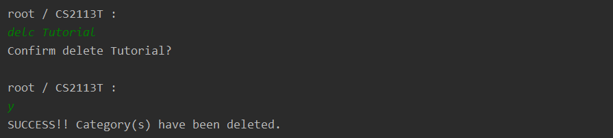     

<small><b>Before</b></small>     
     

<small><b>After</b></small>     
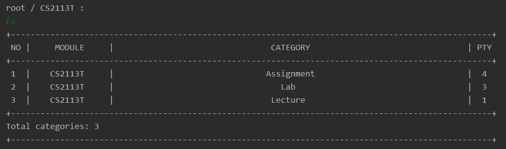    
<br>    
<small><u><b>Multiple Deletion</b></u></small>     
     

[Back To Top](#table-of-contents)  
<br>  

#### **c. Delete Tasks from your Task Lists**   
`delt` deletes <i>task(s)</i> from your <b>Task Lists</b>. The <b>Task List</b> contains all your added <i>tasks</i> of a <i>category</i> and can be viewed via the [<b>List Task</b>](#c-list-your-tasks) command.      

##### **Format**     
`delt [ <task keyword> -m <module keyword> -c <category keyword> -e -a ]`   

- `task keyword` -- The <i>keyword</i> to filter the <i>tasks'</i> <i>description</i> by        
- `module keyword` -- The <i>keyword</i> to filter the <i>modules'</i> <i>code</i> by       
- `category keyword` -- The <i>keyword</i> to filter the <i>categories'</i> <i>name</i> by     
  
  
##### **Example Usage**    
```  
delt urgent assignment -m cs2113t -c Assignment  
```
```  
delt assignment -c Assign  
```
```  
delt urgent assignment  
```

##### **Expected Outcome**     
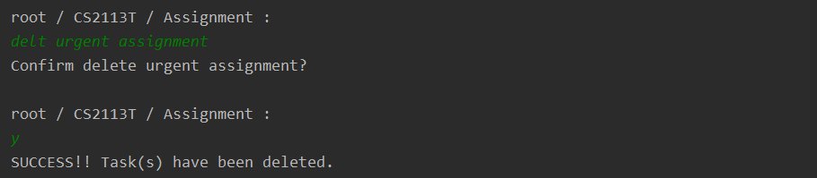  

<small><b>Before</b></small>    
  

<small><b>After</b></small>    
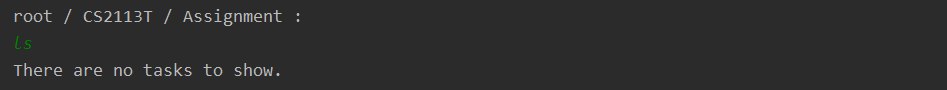  

[Back To Top](#table-of-contents)  
<br>  

#### **d. Delete Files from your File Lists**
`delf` deletes a _file_ from your _task_'s **File List**. The **File List** contains all your added _files_ and can be viewed via the [List File](#f-list-your-files) command.  

##### **Format**    
`delf [ <file keyword> -m <module keyword> -c <category keyword> -t <task keyword> -e -a ]`   

- `file keyword` -- The <i>keyword</i> to filter the <i>files'</i> <i>name</i> by         
- `module keyword` -- The <i>keyword</i> to filter the <i>modules'</i> <i>code</i> by       
- `category keyword` -- The <i>keyword</i> to filter the <i>categories'</i> <i>name</i> by       
- `task keyword` -- The <i>keyword</i> to filter the <i>tasks'</i> <i>description</i> by        
##### **Example Usage**  
```  
delf -m cs2113 -t tp  
```
```  
delf diag -a  
```

##### **Expected Outcome**    
<small><u><b>Have Matches</b></u></small>    
      
<br>    
<small><u><b>No Matches</b></u></small>     
      

[Back To Top](#table-of-contents)  
<br>  

#### **e. Delete Tags from your Task**      
`delg` deletes a _tag_ from your _task_'s **Tag List**. The **Tag List** contains all your added _tags_ to the _task_. (and can be viewed via the List Tag command).   

##### **Format**       
`delg [ <tag keywrod> -m <module keyword> -c <category keyword> -t <task keyword> ]`   

- `tag keyword` -- The <i>keyword</i> to filter the <i>tags'</i> <i>name</i> by         
- `module keyword` -- The <i>keyword</i> to filter the <i>modules'</i> <i>code</i> by       
- `category keyword` -- The <i>keyword</i> to filter the <i>categories'</i> <i>name</i> by       
- `task keyword` -- The <i>keyword</i> to filter the <i>tasks'</i> <i>description</i> by        
  
##### **Example Usage**  
```  
delg ur -m CS21 -c L  
```
```  
delg gen -c Lab 
```
```  
delg urgent  
```
```  
delg  
```

##### **Expected Outcome**   
  

<small><b>Before</b></small>    
  

<small><b>After</b></small>    
  =

[Back To Top](#table-of-contents)  

<br>   

### **4. Edit**    

Edits a <i>module</i>, <i>category</i>,  <i>task</i> or <i>file</i>.<br>    

<div class="alert alert-info">  
<i class="fa fa-info"></i> <b>Tip</b> <br>   
In many of the <b>Edit</b> commands, you have to enter the <i>directory path</i> of the <i>directory</i> you wish to edit the item. You <b>can</b> shorten the commands you enter by first entering into a directory. Then you do <b>not</b> need to enter the full <i>directory path</i> in your command!  &#128537;<br><br>  
To learn how to traverse the various directories, see the <b><a href="#5-change-directory">Change Directory</a></b> command.  <br><br>  
For more information on how and if you can <b>not</b> enter  the <i>full directory path</i>, see <a href="#can-i-not-enter-the-full-path">here</a>.  
</div>     


#### **a. Edit a Module in your Module List**    
`edm` edits a <i>module</i> in your <b>Module List</b>. The <b>Module List</b> contains all your added <i>modules</i> and can be viewed via the [<b>List Module</b>](#a-list-your-modules) command.    

##### **Format**   
`edm <module code> -m <new module code>`     
     
- `module code` -- The <i>module code</i> of the <i>module</i> to be edited     
- `new module code` -- The <u>new</u> <i>module code</i> of the <i>module</i>        
  
<div class="alert alert-warning">  
<i class="fa fa-exclamation"></i> <b>Note</b> <br>   
Similar to the <a href="#a-add-a-module-into-your-module-list"><b>Add Module</b></a> command, do make sure that the <code>new module code</code> that you enter is a valid <b>NUS module</b>.  <br>  
Also, ensure that you do not enter the same <code>new module code</code> as an existing <i>module</i> in the <b>Module List</b> &#128558;.  
</div>  

##### **Example Usage**    
```  
edm cs2102 -m cs2101 
```

##### **Expected Outcome**   
<small><u><b>Correct Edit</b></u></small>    
     
    
<small><b>Before</b></small>     
     

<small><b>After</b></small>   
  

<br>  
    
<small><u><b>Duplicate Module (Incorrect)</b></u></small>   
  

<br>  
    
<small><u><b>Invalid Module Code (Incorrect)</b></u></small>    
     

[Back To Top](#table-of-contents)  
<br>  

#### **b. Edit a Category in your Category List**      
`edc` edits a <i>category</i> in your <b>Category List</b>. The <b>Category List</b> contains all your added <i>categories</i> of a <i>module</i> and can be viewed via the [<b>List Category</b>](#b-list-your-categories) command.  

##### **Format**    
`edc <category name> -m <module code> { -c <new category name> -p <new priority> }`     

- `category name` -- The <i>name</i> of the <i>category</i> to be edited  
- `module code` -- The <i>module code</i> of the <i>module</i> containing the <i>category</i> to be edited     
- `new category name` -- The <u>new</u> <i>name</i> of the <i>category</i>        
- `new priority` -- The <u>new</u> <i>priority</i> of the <i>category</i>          
  
<div class="alert alert-warning">  
<i class="fa fa-exclamation"></i> <b>Note</b> <br>   
You need to enter at least one of <code>new category name</code> and <code>new priority</code>. If both are omitted, an error message would be shown! &#128555; <br><br> 
Similar to <code>category name</code>, the <code>new category name</code>  <b>cannot </b> exceed <b>15</b> characters. <br>  
In addition, similar to all the <code>priority</code> attribute in <b>Nuke</b>, the <code>new priority</code> must be between 0 and 20 inclusive.  
</div>   

##### **Example Usage**   
```  
edc Lab -m cs2113t -c Project -p 8
```

##### **Expected Outcome**    
<small><u><b>Correct Edit</b></u></small>    
    

<small><b>Before</b></small>     
     

<small><b>After</b></small>   
<br>  

<br>  
<small><u><b>Duplicate Category (Incorrect)</b></u></small>  
  

<br>  

<small><u><b>Invalid Priority (Incorrect)</b></u></small>  
  

<br>  

<small><u><b>Nothing to Edit (Incorrect)</b></u></small>    
  

[Back To Top](#table-of-contents)  
<br>   

#### **c. Edit a Task in your Task List**     
`edt` edits a <i>task</i> in your <b>Task List</b>. The <b>Task List</b> contains all your added <i>tasks</i> of a <i>category</i> and can be viewed via the [<b>List Task</b>](#c-list-your-tasks) command.   

##### **Format**    
`edt <task description> -m <module code> -c <category name>` <br>&nbsp; &nbsp;&nbsp; &nbsp;&nbsp; &nbsp;&nbsp; &nbsp;`{ -t <new task description> -d <new deadline> -p <new priority> }`    

- `task description` -- The <i>description</i> of the <i>task</i> to be edited        
- `module code` -- The <i>module code</i> of the <i>module</i> containing the <i>task</i> to be edited     
- `category name` -- The <i>name</i> of the <i>category</i> containing the <i>task</i> to be edited  
- `new task description` -- The <u>new</u> <i>description</i> of the <i>task</i>        
- `new deadline` -- The <u>new</u> <i>deadline</i> of the <i>task</i>        
- `new priority` -- The <u>new</u> <i>priority</i> of the <i>task</i>        
  
<div class="alert alert-warning">  
<i class="fa fa-exclamation"></i> <b>Note</b> <br>   
You need to enter at least one of <code>new task description</code>, <code>new deadline</code> and <code>new priority</code>. If all are omitted, an error message would be shown! &#128555; <br>  <br>  
The <code>new task description</code> <b>cannot </b> exceed <b>25</b> characters. <br>    
As with all <code>deadline</code> attribute, the <code>new deadline</code> must follow <b>Nuke</b>'s accepted <b><a href="#date-time-formats">Date Time Formats</a></b>. If the <i>date</i> is omitted, <b>Nuke</b> will set it to the current date on your device. If <i>time</i> is omitted, <b>Nuke</b> will set it to be <b>11:59PM</b>. <br><br>  
In addition, the <code>new priority</code> should also be between 0 and 20 inclusive.  
</div>  

##### **Example Usage**   
```  
edt tp -d sat 2359 -p 20  
```

##### **Expected Outcome**   
<small><u><b>Correct Edit</b></u></small>    
      

<small><b>Before</b></small>     
     

<small><b>After</b></small>   
<br>  

<br>       
<small><u><b>Duplicate Category (Incorrect)</b></u></small>    
     
<br>       
<small><u><b>Invalid Deadline (Incorrect)</b></u></small>    
     
<br>       
<small><u><b>Invalid Priority (Incorrect)</b></u></small>        
       
<br>       
<small><u><b>Nothing to Edit (Incorrect)</b></u></small>    
  

[Back To Top](#table-of-contents)  
<br>  

#### **d. Edit a File in your File List**   
`edf` edits a <i>file</i> in your <b>File List</b>. The <b>File List</b> contains all your added <i>files</i> of a <i>task</i> and can be viewed via the [<b>List File</b>](#f-list-your-files) command.   

##### **Format**    
`edt <file name> -m <module code> -c <category name> -t <task description> -f <new file name>`     
     

- `file name` -- The <i>name</i> of the <i>file</i> to be edited        
- `module code` -- The <i>module code</i> of the <i>module</i> containing the <i>file</i> to be edited     
- `category name` -- The <i>name</i> of the <i>category</i> containing the <i>file</i> to be edited  
- `task description` -- The <i>description</i> of the <i>task</i> containing the <i>file</i> to be edited        
- `new file name` -- The <u>new</u> <i>name</i> of the <i>file</i>        
  
<div class="alert alert-warning">  
<i class="fa fa-exclamation"></i> <b>Note</b> <br>   
Similar to <code>file name</code>, the <code>new file name</code>  <b>cannot </b> exceed <b>30</b> characters.   
</div>  

##### **Example Usage**     
 ```  
edf math report -f math report draft  
 ```

##### **Expected Outcome**   
<small><u><b>Correct Edit</b></u></small>    
     

<small><b>Before</b></small>     
     

<small><b>After</b></small>   
    
<br>        
<small><u><b>Duplicate File (Incorrect)</b></u></small>    
    

[Back To Top](#table-of-contents)  
<br>  

#### **e. Mark a Task as Done**   
Marks a <b>previously undone</b> <i>task</i> as <i>done</i>.    

<div class="alert alert-warning">  
<i class="fa fa-exclamation"></i> <b>Note</b> <br>   
If the <i>task</i> was <b>already done</b>, and you execute the command, you will be shown an error message instead!! &#128553;  
</div>  

##### **Format**   
`done <task description> -m <module code> -c <category name>`    

- `task description` -- The <i>description</i> of the <i>task</i> to be <i>done</i>    
- `module code` -- The <i>module code</i> of the <i>module</i> containing the <i>task</i>     
- `category name` -- The <i>name</i> of the   <i>category</i> containing the <i>task</i>     
  
##### **Example Usage**   
```  
done do lab 4 -m cs2106 -c Lab  
```

##### **Expected Outcome**   
<small><u><b>Done at Root Level</b></u></small>    
     

<small><b>Before</b></small>     
     

<small><b>After</b></small>   
   
<br>        
<small><u><b>Done at Task Level</b></u></small>    
    
<br>       
<small><u><b>Done an Already Done Task</b></u></small>    
  

[Back To Top](#table-of-contents)  

<br><br>    

### **5. Change Directory**    
`cd` traverses up and down the <b>Directory Tree</b> from your current directory.    

##### **Format**   
`cd <directory name>` to traverse down     
`cd ..` to traverse up     

- `directory name` -- The name of the next _directory_    
  
<div class="alert alert-warning">  
<i class="fa fa-exclamation"></i> <b>Note</b> <br>   
There will <b>not</b> be any message shown for successful traversal &#128528;. Instead, you will be able to see a change in the current directory path as shown in the positive traversing example below. <br>  
However, attempting to traverse ahead of the <b>Root</b> Directory (first directory) <i>or</i> beyond the <b>File</b> Directory <i>(last directory)</i> will result in an error message being shown &#128552;.  
</div>  

##### **Example Usage**  
```  
cd cs2113t  
```
```  
cd  
```

##### **Expected Outcome**   
<small><u><b>Correct Traversal</b></u></small>  
     
<br>    
        
<br>    
<small><u><b>Incorrect Traversal</b></u></small>  
    
<br>    
      

[Back To Top](#table-of-contents)  

<br><br>  

### **6. Open File**   
`open` opens your <i>file(s)</i> of a specified <i>task</i>. You can choose between opening a single <i>file</i> <i>or</i> <b>all</b> your <i>files</i> in the <b>File List</b>.     

##### **Format**   
`open [ <file name> ] -m <module code> -c <category name> -t <task description>`   

- `file name` -- The <i>name</i> of the <i>file</i> <i>(optional)</i>     
- `module code` -- The <i>module code</i> of the <i>module</i> containing the <i>file</i>     
- `category name` -- The <i>name</i> of the   <i>category</i> containing the <i>file</i>     
- `task description` -- The <i>description</i> of the <i>task</i> containing the <i>file</i>    
  
<div class="alert alert-info">  
<i class="fa fa-info"></i> <b>Info</b> <br>   
To open a single <i>file</i>, enter its <code>file name</code>. <bR>Otherwise, if you want to open <b>all</b> the <i>files</i> in the list, leave the <code>file name</code> blank.  
</div>  

##### **Example Usage**  
```   
open lab_4 -m cs2106 -c Lab -t do lab 4   
```
```  
open lab 4  
```

##### **Expected Outcome**   
<small><u><b>Opening at Root Level</b></u></small>     
      
<br>        
<small><u><b>Opening at Task Level</b></u></small>    
    

[Back To Top](#table-of-contents)  

<br><br>  

### **7. Info**   
`info` displays information about your current directory. It shows you the current directory's attributes, and a list of its child directories, <i>if any</i>. <br>   
For example, on the <b>Module</b> directory, the <b>Info</b> command will display the <i>module</i>'s <i>code</i> and <i>title</i>, as well as its <b>Category List</b>.      

##### **Format**   
`info`   
##### **Example Usage**     
```  
info  
```

##### **Expected Outcome**   
   

[Back To Top](#table-of-contents)  

<br><br>    

### **8. Undo**    
`undo` undoes a <i>change</i> made to the application.      

<div class="alert alert-info">  
<i class="fa fa-info"></i> <b>Info</b> <br>   
<i>Change</i> here refers to a successful <a href="#1-add"><b>Add</b></a>, <a href="#3-delete"><b>Delete</b></a>, <a href="#4-edit"><b>Edit</b></a> or <a href="#8-undo"><b>Undo</b></a> command. These commands changes your lists. The <b>Undo</b> command reverts these changes.  
</div>  

##### **Format**    
`undo`    

<div class="alert alert-warning">  
<i class="fa fa-exclamation"></i> <b>Note</b> <br>   
On successful undo, you will be moved back to the <b>Root</b> Directory &#128550;. This is to allow the application to correctly reload the correct state.<br>  
Also, do note that attempting to undo when no changes were made will result in an error message being shown &#128552;.  
</div>  

##### **Example Usage**    
```  
undo  
```

##### **Expected Outcome**  
<small><b><u>Correct Undo</u></b></small>  
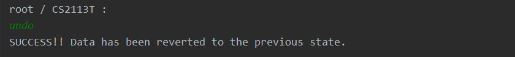    
<br>    
<small><b><u>Incorrect Undo</u></b></small>  
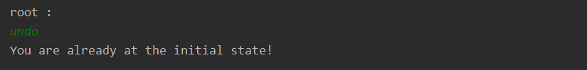    

[Back To Top](#table-of-contents)  

<br><br>    

### **9. Redo**   
`redo` redoes the change made by an earlier <b>[Undo](#8-undo)</b> command.   

##### **Format**    
`redo`   

<div class="alert alert-warning">  
<i class="fa fa-exclamation"></i> <b>Note</b> <br>   
On successful redo, you will be moved back to the <b>Root</b> Directory &#128550;. This is to allow the application to correctly reload the correct state.<br>  
Also, do note that attempting to redo when you are at the newest state <i>(i.e. the most recent change was not due to an <a href="#8-undo"><b>Undo</b></a> command)</i> will result in an error message being shown &#128552;.  
</div>  

##### **Example Usage**   
```  
redo  
```

##### **Expected Outcome**   
<small><u><b>Correct Redo</b></u></small>  
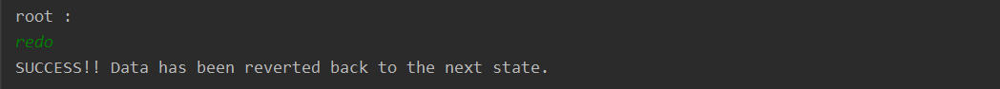    
<br>    
<small><u><b>Incorrect Redo</b></u></small>  
    

[Back To Top](#table-of-contents)  

<br>    

<hr>  

## **Miscellaneous Information**   
### **Help**   
In the event that you ever forget the usage of a command, you can look it up within the **Nuke** application itself. All you need to do is to enter the *keyword* `help` to show a command summary of all the available commands in <b>Nuke</b>.       

[Back To Top](#table-of-contents)  
<br>    

### **Exiting the Nuke Program**   
Exiting the **Nuke** program is simple. Simply enter `bye` to exit.    
Upon exiting, the program will [save](#saving) your entire Directory List into a file in your device.    

[Back To Top](#table-of-contents)  
<br>    

### **Loading and Saving**    
The **Nuke** program loads and saves your entire Directory List **automatically**, so there is no explicit way to freely load or save your file.      

#### **Loading**    
Loading is done once you start up the **Nuke** program. The data from the saved *directory list file* in your device is read to initialise your Directory List from when it was last saved.  

#### **Saving**   
Saving is done upon executing each of your commands in the **Nuke** program. Your Directory List will be saved into a *directory list file* in your device.      

[Back To Top](#table-of-contents)  
<br>    

### **Date Time Formats**   
Any *date time* data that you provide has to adhere to certain formats pre-defined by the **Nuke** program. Failure to do so will likely result in the program to be unable to recognise your input command, and a warning will be shown &#128550;.      
Instances when you may need to enter a *date time* will be when adding a _deadline_ to your _tasks_, or when specifying the <i>date</i> in the <b>[Due](#e-list-your-tasks-at-specified-time-period)</b> command.  
      
Here are the following *date time* formats:    
      
#### **Date Formats**   
There are **two** types *date* formats allowed.    

##### **1. Words**    
You may enter **only** the following *date* words.    
- `today` or `tdy` -- represents the <u>current</u> date    
- `tomorrow` or `tmr` -- represents the <u>next</u> date    
- `yesterday` or `yst` -- represents the <u>previous</u> date    
- `monday` or `mon` -- represents the next <b>Monday</b> from the current date    
- `tuesday` or `tue` -- represents the next <b>Tuesday</b> from the current date    
- `wednesday` or `wed` -- represents the next <b>Wednesday</b> from the current date    
- `thursday` or `thu` -- represents the next <b>Thursday</b> from the current date    
- `friday` or `fri` -- represents the next <b>Friday</b> from the current date    
- `saturday` or `sat` -- represents the next <b>Saturday</b> from the current date    
- `sunday` or `sun` -- represents the next <b>Sunday</b> from the current date    
  
<div class="alert alert-info">  
<i class="fa fa-info"></i> <b>Info</b> <br>   
All dates are taken with reference to the current date on your device.  <br>    
If you specify the <i>date</i> using the day of the week <i>(i.e. <code>monday</code> ... <code>sunday</code>)</i>, and the current day is the day itself, the <i>date</i> will be referred to the current date. For example, if you enter <code>wednesday</code> and it is <b>Wednesday</b> today, the <i>date</i> will be the current date.  
</div>  

##### **2. Standard Date Format**     
This refers to the typical dates that are represented with **numbers** and **delimiter symbols**.      

In this **Nuke** program, *dates* should be in the order of **day**, **month**, then an <u>optional</u> **year**. If the **year** is not provided, the program will automatically assume it to be the **current year**.  Also, the **day**, **month** and **year** should only be entered as **numbers** and not words *(e.g. January is not accepted for the **month** attribute)*.    
      
Regarding **delimiters**, the program will **only** consider `/` and `-` as valid delimiters for *dates*.  Delimiters are <u>optional</u> and may be omitted provided you include the **year** of the *date* <i>(e.g. 1/1/20, 1/1 and 010120 are accepted, but not 0101</i> &#128559;<i>)</i>.    

An **exhaustive** list of the standard *date* formats is given below for your reference.    
```  
01/01/2020, 1/01/2020, 01/1/2020, 1/1/2020,  
01/01/20, 1/01/20, 01/1/20, 1/1/20,  
01/01, 1/01, 01/1, 1/1,  
01-01-2020, 1-01-2020, 01-1-2020, 1-1-2020,  
01-01-20, 1-01-20, 01-1-20, 1-1-20,   
01-01, 1-01, 01-1, 1-1,   
01012020, 010120  
```

[Back To Top](#table-of-contents)  
<br>  

#### **Time Formats**    
The **Nuke** program accepts most time formats that are represented with **numbers**, **delimiter symbols** and <u>optional</u> **am-pm markers**.       
      
The *time* should be in the order of  **hour**, then **minute**. The **seconds** attribute of *time* should **not** be given. The **minute** attribute must be a **double** digit *(i.e. single digits must be padded with a 0 in front)*. The **minute** attribute is also <u>optional</u>, and should it be omitted, the **Nuke** program will automatically set the **minute** to be 0. Both the **12-h** format and the **24-h** format are valid *time* formats for this program.      
      
Regarding **delimiters**, the program will **only** consider `:` and `.` as valid delimiters for *time*.  Delimiters are <u>optional</u> and may be omitted.    

Lastly, the **am-pm marker** is an <u>optional</u> attribute, and should it be omitted, the **Nuke** program will automatically assume the *time* to follow the **24-h** format.    

An **exhaustive** list of the *time* formats is given below for your reference.    
```  
6:00pm, 18:00pm, 18:00, 
6.00am, 6.00am, 6.00,  
1130pm, 2330pm, 2330,  
3pm, 15pm, 15  
```

[Back To Top](#table-of-contents)  
<br>  

#### **Time Specifier Formats**  
The <i>time specifier</i> is used in conjunction with a <i>date</i> to define the <i>time period</i> for the <b>[Due](#e-list-your-tasks-at-specified-time-period)</b> command. The following words are considered valid <i>time specifiers</i> in the <b>Nuke</b> program.     

- `on` -- <u>on</u> the specified  <i>date</i>    
- `after` or `a` -- <u>after</u> the specified  <i>date</i>    
- `before` or `b` -- <u>before</u> the specified  <i>date</i>  
  

The <i>time specifier</i> is <u>optional</u> and if omitted, is set to `on`.      

[Back To Top](#table-of-contents)     

<br>  

<hr>  

## **Command Summary**   
A simple summary of the various commands are shown below:  

<div style="text-align: center"><span style="color: green"><small>Table <b>Command Summary</b></small></span></div>  


| Command<br>Word   | What and How?                                                                    |
|:---------------:|---------------------------------------------------------------------------------|
| [`mkdir`](#1-add)| Adds a new <i>child directory</i><br><b>Format</b>: `mkdir <directory name>`<br><b>Example</b>: `mkdir cs2113t` |
| [`addm`](#a-add-a-module-into-your-module-list) | Adds a new <i>module</i><br><b>Format</b>: `addm <module code>`<br><b>Example</b>: `addm cs2113t` |
| [`addc`](#b-add-a-category-into-your-category-list)| Adds a new <i>category</i><br><b>Format</b>: `addc <category name> -m <module code> [ -p <priority> ]`<br><b>Example</b>: `addc Project -m cs2113t -p 3` |
| [`addt`](#c-add-a-task-into-your-task-list)     | Adds a new <i>task</i><br><b>Format</b>: `addt <task description> -m <module code> -c <category name>`<br>&nbsp; &nbsp; &nbsp; &nbsp; &nbsp; &nbsp; &nbsp; &nbsp; &nbsp; &nbsp; `[ -d <deadline> -p <priority> ]`<br><b>Example</b>: `addt urgent assignment -m cs2113t -c Assignment -d tmr 2359 -p 15` |
| [`addf`](#d-add-a-file-into-your-file-list)   | Adds a new <i>file</i><br><b>Format</b>: `addf <file name> -m <module code> -c <category name> -t <task description>`<br>&nbsp; &nbsp; &nbsp; &nbsp; &nbsp; &nbsp; &nbsp; &nbsp; &nbsp; &nbsp; `-f <file path>`<br><b>Example</b>: `addm cs2113t` |
| [`addg`](#e-add-a-tag-to-your-task)     | Adds a new <i>tag</i><br><b>Format</b>: `addg <tag name> -m <module code> -c <category name> -t <task description>` <br><b>Example</b>: `addg urgent -m CS2113t -c Lab -t tp` |
| [`ls`](#2-list)| Shows the <i>child directories</i>; include <i>child directory name</i> to show it <i>child directories</i> instead<br><b>Format</b>: `ls [ <child directory name> ]`<br><b>Example</b>: `ls` &nbsp; &nbsp; `ls cs2113t` |
| [`lsm`](#a-list-your-modules)     | Shows filtered <i>modules</i><br><b>Format</b>: `lsm [ <module keyword> -e -a ]`<br><b>Example</b>: `lsm cs` |
| [`lsc`](#b-list-your-categories)     | Shows filtered <i>categories</i><br><b>Format</b>: `lsc [ <category keyword> -m <module code> -e -a ]`<br><b>Example</b>: `lsc tutorial -m cs2113 -e` |
| [`lst`](#c-list-your-tasks)     | Shows filtered <i>tasks</i><br><b>Format</b>: `lst [ <task keyword> -m <module keyword> -c <category keyword> -e -a ]`<br><b>Example</b>: `lst group -m cs -c assignment` |
| [`lsts`](#d-list-your-tasks-sorted-by-deadline-or-priority)| Shows undone <i>tasks</i> sorted by <i>deadline</i> or <i>priority</i><br><b>Format</b>: `lsts [ <module code> -d -p (choose at most one; default -d) ]`<br><b>Example</b>: `lsts` &nbsp; &nbsp; `lsts cs2113t -p` |
| [`due`](#e-list-your-tasks-at-specified-time-period) | Shows <i>tasks</i> at a specified <i>time period</i><br><b>Format</b>: `due <time specifier> <date> [ -a ]` <br><b>Example</b>: `due after sun -a` &nbsp; &nbsp; `due over` |
| [`lsf`](#f-list-your-files)   | Shows filtered <i>files</i><br><b>Format</b>: `lsf [ <file keyword> -m <module keyword> -c <category keyword>` <br>&nbsp; &nbsp; &nbsp; &nbsp; &nbsp; &nbsp; &nbsp; &nbsp; &nbsp; &nbsp; `-t <task keyword> -e -a ]` <br><b>Example</b>: `lsf -m cs -t tp -a` |
| [`lsg`](#g-list-your-tasks-tags)     | Shows filtered <i>tags</i><br><b>Format</b>: `lsg [ <tag keyword> -m <module keyword> -c <category keyword>` <br/>&nbsp; &nbsp; &nbsp; &nbsp; &nbsp; &nbsp; &nbsp; &nbsp; &nbsp; &nbsp; `-t <task keyword> -e -a ]` <br/><b>Example</b>: `lsg -m cs2113t -c Assignment -t tp -a` |
| [`rm`](#3-delete)| Deletes a <i>child directory</i><br><b>Format</b>: `rm <child directory name>`<br><b>Example</b>: `rm cs2102` |
| [`delm`](#a-delete-modules-from-your-module-lists) | Deletes filtered <i>modules</i><br><b>Format</b>: `delm [ <module keyword> -e -a ]`<br><b>Example</b>: `lsm cs` |
| [`delc`](#b-delete-categories-from-your-category-lists) | Deletes filtered <i>categories</i><br><b>Format</b>: `delc [ <category keyword> -m <module code> -e -a ]`<br><b>Example</b>: `delc lec -a` |
| [`delt`](#c-delete-tasks-from-your-task-lists) | Deletes filtered <i>tasks</i><br><b>Format</b>: `delt [ <task keyword> -m <module keyword> -c <category keyword> -e -a ]`<br><b>Example</b>: `delt assignment -c Assign` |
| [`delf`](#d-delete-files-from-your-file-lists) | Deletes filtered <i>files</i><br><b>Format</b>: `delf [ <file keyword> -m <module keyword> -c <category keyword>` <br>&nbsp; &nbsp; &nbsp; &nbsp; &nbsp; &nbsp; &nbsp; &nbsp; &nbsp; &nbsp; `-t <task keyword> -e -a ]` <br><b>Example</b>: `delf -m cs2113 -t tp` |
| [`delg`](#e-delete-tags-from-your-task) | Deletes filtered <i>tags</i><br><b>Format</b>: `delg [ <tag keyword> -m <module keyword> -c <category keyword>` <br/>&nbsp; &nbsp; &nbsp; &nbsp; &nbsp; &nbsp; &nbsp; &nbsp; &nbsp; &nbsp; `-t <task keyword> -e -a ]` <br/><b>Example</b>: `delg -m cs2113 -c Assignment -t tp` |
| [`edm`](#a-edit-a-module-in-your-module-list)  | Edits a <i>module</i><br><b>Format</b>: `edm <module code> -m <new module code>`<br><b>Example</b>: `edm cs2102 -m cs2101` |
| [`edc`](#b-edit-a-category-in-your-category-list)  | Edits a <i>category</i><br><b>Format</b>: `edc <category name> -m <module code>` <br>&nbsp; &nbsp; &nbsp; &nbsp; &nbsp; &nbsp; &nbsp; &nbsp; &nbsp; &nbsp; `{ -c <new category name> -p <new priority> }`<br><b>Example</b>: `edc Lab -m cs2113t -c Project -p 8` |
| [`edt`](#c-edit-a-task-in-your-task-list)  | Edits a <i>task</i><br><b>Format</b>: `edt <task description> -m <module code> -c <category name>`<br>&nbsp; &nbsp; &nbsp; &nbsp; &nbsp; &nbsp; &nbsp; &nbsp; &nbsp; &nbsp; `{ -t <new task description> -d <new deadline> -p <new priority> }`<br><b>Example</b>: `edt tp -d sat 2359 -p 20` |
| [`edf`](#d-edit-a-file-in-your-file-list)  | Edits a <i>file</i><br><b>Format</b>: `edt <file name> -m <module code> -c <category name> -t <task description>`<br>&nbsp; &nbsp; &nbsp; &nbsp; &nbsp; &nbsp; &nbsp; &nbsp; &nbsp; &nbsp; `-f <new file name>`<br><b>Example</b>: `edf math report -f math report draft` |
| [`done`](#e-mark-a-task-as-done)  | Marks a <i>task</i> as done<br><b>Format</b>: `done <task description> -m <module code> -c <category name>`<br><b>Example</b>: `done do lab 4 -m cs2106 -c Lab` |
| [`cd`](#5-change-directory)  | Traverses up and down the <b>Directory Tree</b><br><b>Format</b>: `cd <next directory name>` &nbsp; &nbsp; `cd ..`<br><b>Example</b>: `cd cs2113t`  &nbsp; &nbsp; `cd ..` |
| [`open`](#6-open-file)  | Opens <i>files</i><br><b>Format</b>: `open [ <file name> ] -m <module code> -c <category name>`<br>&nbsp; &nbsp; &nbsp; &nbsp; &nbsp; &nbsp; &nbsp; &nbsp; &nbsp; &nbsp; `-t <task description>`<br><b>Example</b>: `open lab_4 -m cs2106 -c Lab -t do lab 4` |
| [`info`](#7-info)  | Shows information about current <i>directory</i><br><b>Format</b>: `info`<br><b>Example</b>: `info` |
| [`undo`](#8-undo)  | Undoes a <i>change</i><br><b>Format</b>: `undo`<br><b>Example</b>: `undo` |
| [`redo`](#9-redo)  | Redoes a <i>change</i> made by an earlier undo <br><b>Format</b>: `redo`<br><b>Example</b>: `redo` |
| [`help`](#help)  | Shows <b>Command Summary</b><br><b>Format</b>: `help`<br><b>Example</b>: `help` |
| [`bye`](#exiting-the-nuke-program)  | Exits <b>Nuke</b> &#128557; <br><b>Format</b>: `bye` <br><b>Example</b>: `bye` |

<br>  
[Back To Top](#table-of-contents)  

<br>    


<hr>  

## **FAQ**  

### **Can I not enter the Full Path?**  
<div>  
Yes, you <b>can</b>! &#128521; <br>   
You do <b>not</b> have to keep entering the <i>path</i> to the <i>directory</i> at the start of most of the commands in <b>Nuke</b>, in particular the <b><a href="#1-add">Add</a></b> and  <b><a href="#4-edit">Edit</a></b> commands.<br> In other words, you do <b>not</b> have to include the <code>-m  &lt;module code&gt;</code>,  <code>-c  &lt;category name&gt;</code>,  <code>-t  &lt;task description&gt;</code> and  <code>-f  &lt;file name&gt;</code>. <br><br>  
<b>Nuke</b> is able to intelligently fill in the missing components in the <i>path</i> for you. Here are various examples on how you can utilise this feature of <b>Nuke</b> to your advantage: <br><br>  

<b>In each of the examples below, we set the context to be at the Category level, and the <i>current path</i> to be <code>root / CS2113T / Project</code></b> <br><br>  

<b><u>Commands targeting Current Directory</u></b><br>  
If you want to add a <i>task</i> into the current <i>category</i> that you are in, that is into the <code>Project</code> <i>category</i>, instead of entering <code>addt new task -m cs2113t -c Project -p 4</code>, you can simply enter <code>addt new task -p 4</code>. &#128522; <br><br>  

<b><u>Commands targeting Parent Directory</u></b><br>  
If you want to edit a <i>file</i> that has the path <code>root / CS2113T / Project / tp / image_1</code>, instead of entering <code>edf image_1 -m cs2113t -c Project -t tp -f new file name</code> you can just enter <code>edf image_1 -t tp -f new file name</code>. &#128522; <br><br>  

<b><u>Commands targeting Child Directory</u></b><br>  
If you want to add a <i>category</i> to the <code>CS2113T</code> <i>module</i>, instead of entering <code>addc new category -m cs2113t -p 3</code>, you can enter <code>addc new category -p 3</code>.  &#128522; <br><br>  

<b><u>Commands targeting Nearby Directory</u></b><br>  
If you want to edit a <i>task</i>  that has the path <code>root / CS2113T / Lecture / read lecture notes</code>, instead of entering <code>edt read lecture notes -m cs2113t -c Lecture -p 3 -d sun 3pm</code> you can just enter <code>edt read lecture notes -c Lecture -p 3 -d sun 3pm</code>. &#128522; <br>  
<br>  

Essentially, <b>Nuke</b> will fill the missing components in the <i>path</i> based on your current <i>directory path</i>. Hence, it would be good to use the <b><a href="#5-change-directory">Change Directory</a></b> command to move to the corresponding <i>directory</i> first, so you do not have to enter the <i>full path</i>.  
</div>  


[Back To Top](#table-of-contents)  
<br>  

### **How does the Filtering Process works?**  
<div>  
<b>Nuke</b> does filtering for <b><a href="#2-list">List</a></b> and  <b><a href="#3-delete">Delete</a></b> commands. <b>Nuke</b> filters for the set of items that contains the <i>keywords</i> that you provide in the command. Filtering is always done in a case-<b>insensitive</b> manner. All <b>matched</b> items will be shown as a list. <br><br>  

Consider this example: <br>  
Let's assume you have three <i>tasks</i> with <i>directory paths</i><br>   
1. <code>root / CS2113T / Project / do UG</code>,<br>  
2. <code>root / CS2113T / Project / peer review</code> and<br>  
3. <code>root / CS2113T / group project / do ug faq section</code>.<br>  

Now, entering the command <code>lst -m cs -c project -t ug</code> should fetch only the first and third <i>tasks</i>.<br><br>  

Furthermore, if an attribute is left <b>empty</b>, such as <code>lst -m cs -t ug</code>, where the <code>-c &lt;category keyword&gt;</code> attribute is missing, <b>Nuke</b> will simply ignore filtering for <b>all</b> of the <i>categories</i>. In this case, <b>Nuke</b> will select all <i>tasks</i> with <i>module</i> containing <code>cs</code> in their <i>module code</i> and <i>tasks</i> containing <code>ug</code> in their <i>task description</i>. <br><br>  

Another feature of the filtering is that it tries to filter from the current <i>directory</i>. For example, if you are in the <i>path</i>  <code>root / CS2113T</code>, then entering <code>lsc</code> will fetch all of the <i>module</i> <code>CS2113T</code> 's <i>categories</i> only, instead of fetching all your <i>categories</i>. Unless you specify the corresponding <i>keyword</i>, or choose to filter <b>all</b> as explained later, <b>Nuke</b> will always behave in such a manner when filtering. <br> <br>  

In addition, there are <b>two</b> extra conditions you can include to the filtering process. They are: <br><br>  

<b><u>Filter Exactly</u></b><br>  
This can be activated by including a <code>-e</code> at the back of your command. This filters for items that <b>matches exactly</b> the <i>keyword</i>, instead of just containing the <i>keyword</i>. <br>  
For example, for <i>modules</i> with <i>paths</i>:<br>  
<code>root / CS2113</code> and <br>  
<code>root / CS2113T</code><br>  
when the command <code>delm cs2113 -e</code> is entered, only the first <i>module</i> is shown. <br>  
The  case-<b>insensitive</b> filtering and <b>empty</b> <i>keyword</i> property still holds even when filtering <b>exactly</b>. <br> <br>  

<b><u>Filter All</u></b><br>  
Similarly, this can be activated by including a <code>-a</code> at the back of your command. This filters for items in your entire <b>Directory List</b>, and not just limited to the current <i>directory</i>, which is the default setting. <br> <br>  

You can mix both <code>-e</code> and <code>-a</code> to filter exactly the way you want. &#128521;  
</div>  

[Back To Top](#table-of-contents)

<br>    


<hr>  

## **Contact Us**   
<div>
If you have any further inquiries, or if you realised any <b>bugs</b> <i class="fa fa-bug"></i> while running the <B>Nuke</b> application, feel free to contact us at: <br><br>
<div style="text-align: center">
<i class="fa fa-facebook-square fa-lg" style="color:blue"></i> <a href="https://www.facebook.com/nukeproject/"><b>Facebook</b></a> 
&nbsp; &nbsp; &nbsp; &nbsp; &nbsp; &nbsp; 
<i class="fa fa-google fa-lg" style="color: red"></i> <a href="mailto:nusnuke2019@gmail.com"><b>Gmail</b></a>
&nbsp; &nbsp; &nbsp; &nbsp; &nbsp; &nbsp; 
<i class="fa fa-yahoo fa-lg" style="color: purple"></i> <a href="mailto:nukeproject@yahoo.com"><b>Yahoo! Mail</b></a> 
</div>


<br> <br>

We are currently still at the development stage of the <b>Nuke</b> application. Any feedback you give can help us to improve <b>Nuke</b> even further! &#128516;
</div>

[Back To Top](#table-of-contents)
