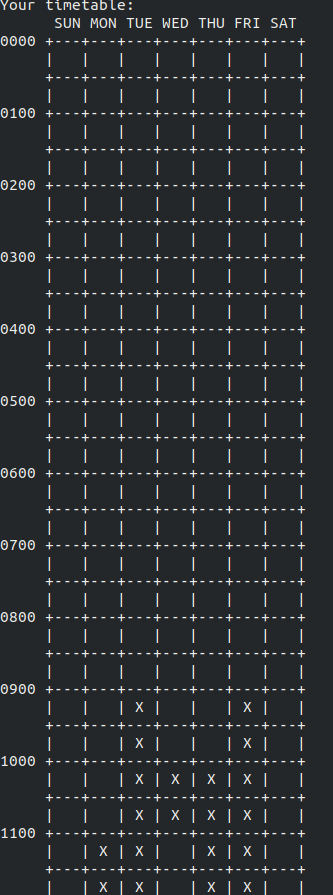
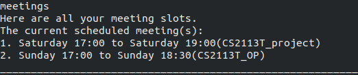

# WhenFree - User Guide
 * [1. Introduction](#introduction)  
 * [2. Quick Start](#quick-start)  
 * [3. Features](#features)
 * [4. FAQ](#faq)
 * [5. Command Summary](#command-summary)
 
<br/><br/>

## Introduction

WhenFree is a scheduler chatbot that helps you find common free time among your and your friends, 
using just the NUSMODS links to your school timetable.

WhenFree is for NUS students who want to save time gathering their friends' schedules to set up a 
meeting, whether for a long project discussion or a quick meal. With an easy-to-use command line interface, anyone can
set up and use this application easily by following along this User Guide.

Get ready the NUSMODS links of you and your friends, and let's get started!

<br/><br/>

## Quick Start

1. Ensure that you have Java 11 or later versions of Java installed on your computer. 
    - To check the version of Java on your computer, follow the instructions [here](https://www.wikihow.com/Check-Your-Java-Version-in-the-Windows-Command-Line). 
    - To download the latest version of Java on your computer, visit [here](https://www.oracle.com/java/technologies/javase-downloads.html).
2. Download the .jar file of our latest release of WhenFree, V2.1 [here](https://github.com/AY1920S2-CS2113T-T12-1/tp/releases).
3. Copy the downloaded .jar file to an empty folder.
4. Open Command Prompt or Terminal and navigate to the folder using ```cd <folder_path>```.
5. Run the .jar file using ```java -jar <file_name.jar>```.
[NOTE] Please resize the terminal to full screen mode to make full use of our CLI ASCII art.
You will see this welcome message if you have done the above steps correctly.

TODO: change image


The following part of the User Guide will explain the features of WhenFree in detail. You can follow along as we go through each of the features if you are starting out, or skip ahead to the [Command Summary](#command-summary) to see the commands of all features.

<br/><br/>

## Features 

- [Add a new contact](#add-a-new-contact)
- [List all contacts](#list-all-contacts-contacts)
- [Display timetable of selected contacts](#display-timetable-of-selected-contacts-timetable)
- [Schedule a new meeting](#schedule-a-new-meeting-schedule)
- [Edit a contact's timetable](#edit-a-contacts-timetable-edit)
- [Delete a meeting](#delete-a-meeting-delete--m)
- [Delete a contact](#delete-a-contact-delete--c)
- [List all meetings](#list-all-meetings-meetings)
- [Exit application](#exit-the-application-exit)

<br/>

### Add a new contact
Adds you or your friend into the list of contacts. 
You will need to key in `<Contact Name>` and `<NUSMODS link>` of the 
contact.
* You must add in your (main user's) contact before you can use the application. 
If you try to enter a command before adding in your contact, WhenFree will remind
you to key in your contact first. You can add as many contacts as you want thereafter.
* `<Contact Name>`  should be a single word containing only alpha characters. It should not contain any whitespaces.
* Detalied instructions to obtain the NUSMODS links to the NUSMODS timetable can be found in the [FAQ](#faq) section.

Format: 
    
    <Contact Name> <NUSMODS link>

Example of usage:

    Juan https://nusmods.com/timetable/sem-2/share?CG2023=LAB:03,PLEC:01,PTUT:01&CG2027=TUT:01,LEC:01&CG2028=TUT:01,LAB:02,LEC:01&CS2101=&CS2107=TUT:08,LEC:1&CS2113T=LEC:C01

Example output:

TODO: change image so that the words are the same font size


[&#8593; Return to list of Features](#features)

<br/>

### List all contacts: `contacts`
Displays index and name of all contacts stored in the program.
* This feature is usually used preceding [`Display timetable of selected contacts`](#display-timetable-of-selected-contacts-timetable),  [`Edit a contact's timetable`](#edit-a-contacts-timetable-edit) or `Delete a contact` features, to check for `<Contact Index>` and `<Contact Name>` of a contact.

Format:
    
    contacts 

Example of usage: 
    
    contacts

Example output:


[&#8593; Return to list of Features](#features)

<br/>

### Display timetable of selected contacts: `timetable`

There are 3 use cases illustrated below: to display the main user's timetable, to display the timetable of a selected contact, 
and to display a combined timetable of multiple selected contacts.
* For all 3 uses cases, the `timetable` command shows only the current week's timetable. **To see up to two weeks of timetable, enter `more` command after the `timetable` command.** 
- You can check `<Contact Index>` of the contact(s) whose timetable you wish to display, by listing all contacts using 
[`contacts`](#list-all-contacts-contacts).

**Use case 1:** Displays your (main user's) timetable.
    
Format: 
    
    timetable 
        
Example of usage: 
    
    timetable

Example output:

TODO: update image

    
A cross in a 30-minute square of the timetable represents "busy", while an empty square represents "free".

<br/>

**Use case 2:** Displays the timetable of a selected contact. You will need to key in `<Contact Index>` of the selected contact.

* Both `timetable` and `timetable 0 ` display your (main user's) timetable.

Format: 
    
    timetable <Contact Index>
    
Example of usage: 
    
    timetable 1
    
Example output:

TODO: update image


<br/>

**Use case 3:** Displays the combined timetable of multiple selected contacts. You will need to key in `<Contact Index>` of each of the selected contacts.
* You can enter as many contacts as you wish
   
Format: 
   
    timetable <Contact A Index> <Contact B index> ...
   
Example of usage: 
   
    timetable 0 1 2
    
Example output:

TODO: update image


[&#8593; Return to list of Features](#features)

<br/>

### Schedule a new meeting: `schedule`
Schedules a new meeting at a specified time slot and adds it into the meeting list. You will need to key in 
`<Meeting Name>`, and specify the meeting time slot with `<Start Day>` `<Start Time>` `<End Day>` `<End Time>`.
* You can schedule a meeting on only the current week and the next week, for which your timetable can be displayed with the 
[`timetable`](#display-timetable-of-selected-contacts-timetable) and `more` commands
* Hence, `<Start Day>` and `<End Day>` represents the date number you wish to schedule the meeting on, within the current 
week and the next week, from the current date onwards. For example, if the date today is 27 April:
    * You can schedule a meeting on 29 April this week with `<Start Day>` and `<End Day>` as `29`. 
    * You can schedule a meeting on 6 May next week with `<Start Day>` and `<End Day>` as `6`.
    * You will not be able to schedule a meeting with `<Start Day>` and `<End Day>` as `26`. Even though 26 April is within
    this week, the date has passed. The future date 26 May is also not within the current week and the next week.
* `<Start Time>` and `<End Time>` should be in the 24-hour HH:MM format. For example, the time 3pm should be represented
as `15:00`.
* `<Meeting Name>` should be a single word with no whitespace character.
* Scheduling a meeting will modify only your (main user's) timetable, to be busy at the specified time slot. 
Timetables of other contacts will not be modified.
* You cannot schedule a meeting if your timetable is busy at the specified time slot. When Free will remind you to check
your timetable if you try to schedule a meeting during a time slot which you are busy for.


Format: 

    schedule <Meeting Name> <Start Day> <Start Time> <End Day> <End Time>
    

Example of usage:

    schedule meeting 3 17:00 3 19:00

Example output:


<br/>

[&#8593; Return to list of Features](#features)

<br/>

### Edit a contact's timetable: `edit`
There are 2 use cases illustrated below: to edit a contact's timetable to **"busy"** for a specified time slot, and
to edit a contact's timetable to **"free"** for a specified time slot.
* You can edit the contact's timetable for only the current week and the next week, for which your timetable can be displayed 
with the [`timetable <Contact Index>`](#display-timetable-of-selected-contacts-timetable) and `more` commands
* Hence, `<Start Day>` and `<End Day>` represents the date number you wish to edit the timetable for, within the current 
week and the next week, from the current date onwards. For example, if the date today is 27 April:
    * You can edit the timetable on 29 April this week with `<Start Day>` and `<End Day>` as `29`. 
    * You can edit the timetable on 6 May next week with `<Start Day>` and `<End Day>` as `6`.
    * You will not be able to edit the timetable with `<Start Day>` and `<End Day>` as `26`. Even though 26 April is within
    this week, the date has passed. The future date 26 May is also not within the current week and the next week.
* `<Start Time>` and `<End Time>` should be in the 24-hour HH:MM format. For example, the time 3pm should be represented
as `15:00`.
* You can check `<Contact Index>` of the contact whose timetable you wish to edit, by listing all contacts using 
[`contacts`](#list-all-contacts-contacts).


**Use case 1:** Edits a contact's timetable to be **"busy"** for a specified time slot. You need to key in `<Contact Index>`
of the contact, and specify the time slot to be marked **"busy"** with `<Start Day>` `<Start Time>` `<End Day>` `<End Time>`.

Format: 
    
    edit busy <Contact Index> <Start Day> <Start Time> <End Day> <End Time>
    
Example of usage:
    
    edit busy 0 2 22:00 2 23:00
        
Example output:

TODO change image


<br/>

**Use case 2:** Edits a contact's timetable to be **"free"** for a specified time slot. You need to key in `<Contact Index>`
                of the contact, and specify the time slot to be marked **"free"** with `<Start Day>` `<Start Time>` `<End Day>` `<End Time>`.
    
Format: 
    
    edit free <Contact Index> <Start Day> <Start Time> <End Day> <End Time>
    
Example of usage:
 
    edit free 0 2 22:00 2 23:00
        
Example output:

TODO change image


[&#8593; Return to list of Features](#features)
    
<br/>

### Delete a meeting: `delete -m`
Deletes a scheduled meeting from the meeting list. You will need to key in **Meeting Index** of the meeting you wish 
to delete.

Format:
    
    delete -m <Meeting Index>

Example of usage:

    delete -m 1

Example output:

TODO change image


Note:
- You can check `<Meeting Index>` of the meeting you wish to delete, by first listing all meetings using [`meetings`](#list-all-meetings-meetings).
- Be careful to include the -m tag in `delete -m` when you wish to delete a meeting. 
- `delete -m` which is used to delete a meeting, should be differentiated from `delete -c` which is used to delete a contact.

[&#8593; Return to list of Features](#features)

<br/>

### Delete a contact: `delete -c`
Deletes a contact from the contact list. You will need to key in **Contact Index** of the contact you wish 
to delete.

Format: 
    
    delete -c <Contact Index>

Example of usage:

    delete -c 1
    
Example output:

TODO change image


Note:
- You can check `<Contact Index>` of the contact you wish to delete, by first listing all added contacts using [`contacts`](#list-all-contacts-contacts).
- Be careful to include the -c tag in `delete -c` when you wish to delete a contact. 
- `delete -c` which is used to delete a contact, should be differentiated from `delete -m` which is used to delete a meeting.

[&#8593; Return to list of Features](#features)

<br/>

### List all meetings: `meetings`
List all scheduled meetings stored in program.
* This feature is usually used preceding `Delete a meeting` feature, to check for `<Meeting Indec>` a meeting.

Format: 
    
    meetings

Example of usage: 

    meetings
    
Example output:



[&#8593; Return to list of Features](#features)

<br/>

### Exit the application: `exit`
Exits the application and ends the current session.

Format: 
    
    exit

Example of usage: 
    
    exit
    
Example output:


[&#8593; Return to list of Features](#features)

<br/><br/>

## FAQ
**Q**: How do I transfer my data to another computer? 

&ensp;&ensp;&ensp;&ensp;**A**: Copy the `data` folder in the program directory and paste into the selected directory 
containing the .jar file in another computer.

**Q**: How do I prevent file corruption? 

&ensp;&ensp;&ensp;&ensp;**A**: Ensure that you do not abruptly exit the application and do not edit delete the data file 
while application is still running, or outside of the application.

**Q**: How can I create a NUSMODS timetable?

&ensp;&ensp;&ensp;&ensp;**A**: Visit the [NUSMODS website](https://nusmods.com/) to create a NUSMODS timetable.

**Q**: How do I obtain the NUSMODS links to my NUSMODS timetable?

&ensp;&ensp;&ensp;&ensp;**A**: 
1) Visit the [NUSMODS website](https://nusmods.com/) in your browser. If you do not already have a NUSMODS timetable saved in your
browser, you can create a new one. Else, you will be brought to your saved NUSMODS timetable.
2) Click on the red "Share/Sync" button located at the bottom right of the page.
<br>
3) Click on the red copy icon next to the NUSMODS link in the pop-up box.
<br>

4) Paste the link into the CLI for the [`add a new contact`](#add-a-new-contact) feature.

[&#8593; Return to the top](#whenfree---user-guide)

<br/><br/>

## Command Summary
Feature | Format | Example usage
------- | ------ | -------------
Adding a new contact | `<name> <NUSMODS link>` | `Juan https://nusmods.com/timetable/sem-2/share?CG2023=LAB:03,PLEC:01,PTUT:01&CG2027=TUT:01,LEC:01&CG2028=TUT:01,LAB:02,LEC:01&CS2101=&CS2107=TUT:08,LEC:1&CS2113T=LEC:C01`
List all contacts | `contacts` | `contacts`
Display timetable of selected contacts | `timetable` <br/><br/> `timetable <Member Index>` <br/><br/> `timetable <Member A Index> <Member B Index>` | `timetable` <br/><br/> `timetable 1` <br/><br/> `timetable 0 1 2`
Schedule a new meeting | `schedule <Meeting Name> <Start Day> <Start Time> <End Day> <End Time>` | `schedule meeting 3 17:00 3 19:00`
Edit a contact's timetable | `edit busy <Contact Index> <Start Day> <Start Time> <End Day> <End Time>` <br/><br/> `edit free <Contact Index> <Start Day> <Start Time> <End Day> <End Time>` | `edit busy 0 2 22:00 2 23:00` <br/><br/> `edit busy 0 2 22:00 2 23:00`
Delete a meeting | `delete -m <Meeting Index>` | `delete -m 1`
Delete a contact | `delete -c <Contact Index>` | `delete -c 1`
List all scheduled meetings | `meetings` | `meetings`
Exit application | `exit` | `exit`

[&#8593; Return to the top](#whenfree---user-guide)
