# User Guide

## Introduction
The Exam Study Companion (ESC) is for students who want to improve on their grades by quizzing themselves through flashcards. ESC is a command line (CLI) program, with a simple, no frills user interface that is quick and easy to use.

ESC is a flashcard study program, where you are able to create cards and categorise them, and you can also quiz yourself using your flashcards.

ESC is meant to help students be able to study more effectively using the medium that they prefer, providing a simple, easy to use interface for the timestrapped student who prefers using CLI based applications and are able to type quickly. 

**For release v2.1, after adding the cards the user is unable to view the answers when listing cards.
   They are only able to view the answers when attempting the quiz function.**
   
## Quick Start
1. Ensure that you have Java 11 or above installed on your computer.
2. Download the latest version of `ESC` from [here](https://github.com/AY1920S2-CS2113-T15-2/tp/releases/tag/v2.1).
3. Run ESC on your command terminal using this command: `java -jar <directory>/esc-v2.1.jar`

The program is best viewed in a maximised window.

## Quick Use
1. Create a subject.
    * `addsubject s/<name>`
2. Create cards to add to your subject. 
    * `addcard s/<index> q/<question> a/<answer>`
3. Start a quiz to test yourself.
    * `quiz s/<index>`
    
A more detailed explanation of the features are covered in the following sections. 

## Features 
### Creating a Subject: `addsubject`
Creates a subject for categorisation of cards.

Format: `addsubject s/<SUBJECTNAME>`

* The `SUBJECTNAME` can be in a natural language format.

Example of usage: 
* `addsubject s/biology`
* `addsubject s/CHEM`

Screenshot showing addsubject:

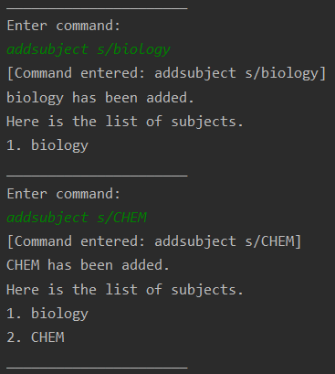

### Listing all Subjects
Lists all the current subjects.

Format & Usage: `listsubject`

Screenshot showing listsubject:

### Deleting a Subject
Deletes the specified subject AND all the cards in the subject.

Format: `deletesubject s/<INDEX>`

* The `INDEX` is based on the index of the subject. This can be found using the `listsubject` command.

Example of usage:
* `deletesubject s/1`
* `deletesubject s/4`

Screenshot showing deletesubject:

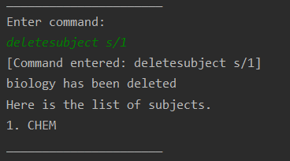

### Creating a Card
Creates a card and adds it to the specified subject.

Format: `addcard s/<INDEX> q/<QUESTION> a/<ANSWER>`
* The `INDEX` is based on the index of the subject. This can be found using the `listsubject` command.

Example of Usage:
* `addcard s/1 q/What year was NUS established? a/1980`
* `addcard s/2 q/How many electrons does oxygen have? a/8`

Screenshot showing addcard:

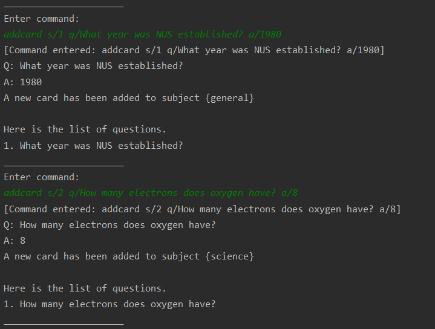

### Listing Cards in a Subject
Lists all the cards in the specified subject.

Format: `listcard s/<INDEX>`
* The `INDEX` is based on the index of the subject. This can be found using the `listsubject` command.

Example of Usage:
* `listcard s/1`
* `listcard s/2`

Screenshot showing listcard:

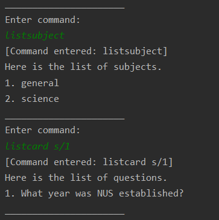

### Deleting a Card
Deletes the specified card from the specified category 

Format: `deletecard s/<S-INDEX> c/<C-INDEX>`
* The `S-INDEX` is based on the index of the subject. This can be found using the `listsubject` command.
* The `C-INDEX` is based on the index of the card. This can be found using the `listcard s/<S-INDEX>` command.

Example of Usage:
* `deletecard s/2 c/1`
* `deletecard s/5 c/17`

Screenshot showing deletecard:

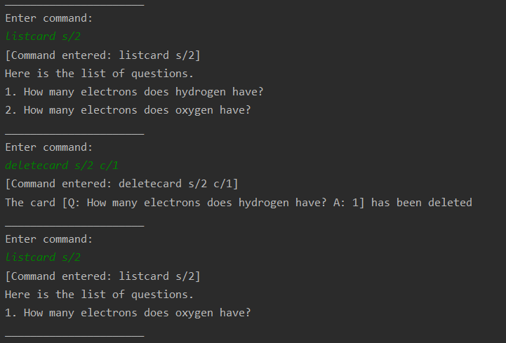

### Editing a Card
Edits the specified card 

Format: `editcard s/<S-INDEX> c/<C-INDEX> q/<QUESTION> a/<ANSWER>`
* The `S-INDEX` is based on the index of the subject. This can be found using the `listsubject` command.
* The `C-INDEX` is based on the index of the card. This can be found using the `listcard s/<S-INDEX>` command.

Example of Usage:
* `editcard s/1 c/1 q/what is this docunment a/user guide`

Screenshot showing editcard:

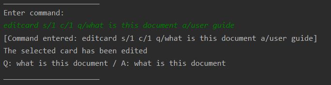

### Starting a Quiz
Starts a quiz of the specified number of questions from the specified subject.

Format: `quiz s/<INDEX> n/<NUMBER>`  OR  `quiz s/<INDEX>`
* The `INDEX` is based on the index of the subject. This can be found using the `listsubject` command.
* The `NUMBER` is the number of questions the user wishes to be quizzed on.
This is an optional field that can be omitted. 
* If the `NUMBER` is not specified or if the `NUMBER` exceeds the total number of stored questions
for that subject, ALL questions in that subject will be tested instead.
* A quiz can be aborted early by inputting `exitquiz` anytime during the quiz.

Example of Usage:
* `quiz s/2 n/15`
* `quiz s/1`

Screenshot showing quiz:

### Viewing Past Scores
Shows the previous scores of quizzes from the specified subject in chronological order.

Format: `score s/<INDEX>`
* The `INDEX` is based on the index of the subject. This can be found using the `listsubject` command.

Example of Usage:
* `score s/1`
* `score s/2`

Screenshot showing score:

### Adding New Event
Creates a new event and adds it to the app.

Format: `addevent e/<DESCRIPTION> d/<DATE>`
* The `DESCRIPTION` is a text description of the event to be input by the user.
* The accepted `DATE` formats are:
    1. dd-MM-yy, dd-MM-yyyy
    2. dd/MM/yy, dd/MM/yyyy
    3. dd.MM.yy, dd.MM.yyyy
    4. dd-MMM-yy, dd-MMM-yyyy (e.g. 1-May-2020)

Example of Usage:
* `addevent e/CS2113T exam d/2/5/2020`
* `addevent e/GE4214 final proj presentation d/16-04-2020`

Screenshot showing score:

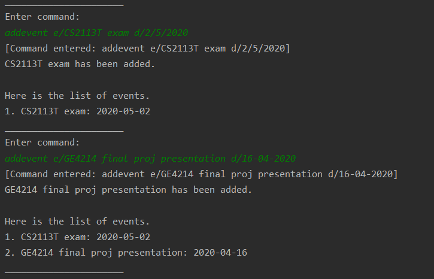

### Listing Stored Events
Lists all the stored events in the order they were added.

Format: `listevent`

Screenshot showing listevent:

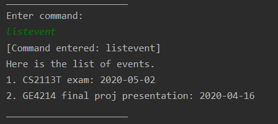

### Showing Upcoming Events
Shows all upcoming events within a user-specified time frame, listed in chronological order.

Format: `showupcoming d/<DATE RANGE>`
* The `DATE RANGE` defines the date range of upcoming events to show.

Example of Usage:
* `showupcoming d/30`
* `showupcoming d/5`

Screenshot showing showupcoming:

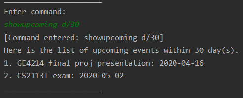

### Deleting an Event
Deletes an event based on its index.

Format: `deleteevent e/<INDEX>`
* The `INDEX` is based on the index of the event. This can be found using the `listevent` command.

Example of Usage:
* `deleteevent e/2`
* `deleteevent e/1`

Screenshot showing deleteevent:

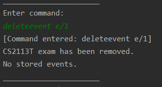

### Displaying the Help Page
Displays the list of available commands.

Format & Usage: `help`

Screenshot showing help:

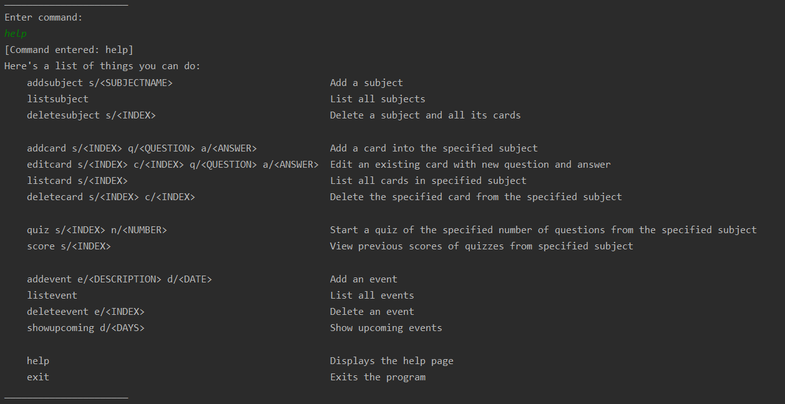

### Exiting the Program
Closes the program 

Format & Usage: `exit` 

## FAQ
**Q**: Can I import question packs from other people?

**A**: At the current stage, no, but it is in the development list for if we continue with this in future!

**Q**: If I exit the program, will all my existing cards be saved?

**A**: Yes! All your subjects, cards, events and scores are saved. To ensure that your data is not lost, do not delete the folder called 'data' that is created when you first run the program.

**Q**: If I delete a subject, what happens to the cards?

**A**: By deleting a subject, you'll delete everything in that subject. So be careful with this.

**Q**: Can I create a card that does not belong to any subject?

**A**: Sorry, you can't. You must need a subject for every card.

**Q**: Can I create a card that belongs to multiple subject?

**A**: Sorry, at current stage this is not supported.

**Q**: Will I be able to export the cards to a external file i.e. a text file?

**A**: Sorry, at current stage this is not supported.

**Q**: Can I add something else other than exam date to the program? 

**A**: Feel free to add anything you'd like.

**Q**: Will the app be able to mark my answers automatically?

**A**: This is not supported at the current stage of development, as users are allowed to add open-ended questions
which cannot be accurately marked automatically.

**Q**: How do I transfer my data to another computer/folder? 

**A**: Copy the 'data' folder to the computer/folder that the .JAR file is in.

## Command Summary
* Add a subject `addsubject s/<SUBJECTNAME>`
* List all subjects `listsubject`
* Delete a subject and all its cards `deletesubject s/<INDEX>`     
               
* Add a card into the specified subject `addcard s/<INDEX> q/<QUESTION> a/<ANSWER>`
* Edit an existing card with new question and answer `editcard s/<INDEX> c/<INDEX> q/<QUESTION> a/<ANSWER>`
* List all cards in specified subject `listcard s/<INDEX>`
* Delete the specified card from the specified category `deletecard s/<INDEX> c/<INDEX>`

* Start a quiz from the specified subject `quiz s/<INDEX>`
* Get previous scores of quizzes from specified subject `score s/<INDEX>`

* Add an event `addevent e/<DESCRIPTION> d/<DATE>`
* List all events `listevent`
* Delete an event `deleteevent e/<INDEX>`
* Show upcoming events `showupcoming d/<DAYS>`

* Displays the help page `help`
* Exits the program `exit` 
