# HappyPills - User Guide
By: `Team CS2113T-T12-2` Since `March 2020` License: `MIT`

## Table of Content
- [1. Introduction](#1-introduction)
- [2. Quick Start](#2-quick-start)
- [3. Features](#3-features)
    * [3.1. General Commands](#31-general-commands)
        + [3.1.1. View help: `help`](#311-view-help-help)
        + [3.1.2. Exit program: `exit`](#312-exit-program-exit)
        
    * [3.2. General Patient Information](#32-general-patient-information)
        + [3.2.1. Add Patient: `add patient`](#321-add-patient-add-patient)
        + [3.2.2. Edit Patient: `edit patient`](#322-edit-patient-edit-patient)
        + [3.2.3. Delete Patient: `delete patient`](#323-delete-patient-delete-patient)
        + [3.2.4. List All Patients: `list patient`](#324-list-all-patients-list-patient)
        + [3.2.5. Retrieve a Patient's Information: `get patient`](#325-retrieve-a-patients-information-get-patient)
        
    * [3.3. Patient Medical Records](#33-patient-medical-records)
        + [3.3.1. Add Patient Records : `add pr`](#331-add-patient-records-add-pr)
        + [3.3.2. Edit Patient Records : `edit pr`](#332-edit-patient-records-edit-pr)
        + [3.3.3. Delete Patient Records : `delete pr`](#333-delete-patient-records-delete-pr)
        + [3.3.4. List Patient Records : `list pr`](#334-list-patient-records-list-pr)
        + [3.3.5. Find Patient Records : `find pr`](#335-find-patient-records-find-pr)
    
    * [3.4. Appointments](#34-appointment-scheduling-commands)
        + [3.4.1. Add Appointment: `add appt`](#341-add-appointment-add-appt)
        + [3.4.2. Edit Appointment: `edit appt`](#342-edit-appointment-edit-appt)
        + [3.4.3. Delete Appointment: `delete appt`](#343-delete-appointment-delete-appt)
        + [3.4.4. List All Appointments: `list appt`](#344-list-all-appointments-list-appt)
        + [3.4.5. Find Patient's Appointments: `find appt`](#345-find-patients-appointments-find-appt)
        + [3.4.6. Mark Appointment as Done: `done appt`](#346-mark-appointment-as-done-done-appt)
- [4. Command Summary](#4-command-summary)
- [5. Useful Links](#5-useful-links)

## 1. Introduction 

HappyPills is a note-taking application that allows doctors to take down notes using Command Line Interface (CLI).
  
The application replaces all physical papers and is highly optimised for fast typing users.    
If you can type fast, HappyPills can help you to manage patients’ records **faster** than traditional Graphical 
User Interface (GUI) applications.    
All notes are **neatly organised** in HappyPills so that all your important information are **safely stored**.  
Say **HELLO** to neater desks and time-saving electronic notes with HappyPills! &#128522;

## 2. Quick Start
**Installation**
1. Ensure that you have `Java 11` or above installed in your computer. 
2. Click [here](https://github.com/AY1920S2-CS2113T-T12-2/tp/releases) to download the HappyPills JAR File.
3. Copy the file to the folder you want to use as your home folder for HappyPills.

**For all users**
1. Open Command Prompt in the directory where the JAR file is located.
2. Run the command `java -jar happypills.jar`.

3. When you start the application for the first time, you can type `help` to check all the available commands.
4. Refer to the features below for detailed instructions on how to use each command.

## 3. Features

HappyPills have three main features: `General Patient Information`, `Patient Medical Records` and `Appointment`. 

`General Patient Information` notes down the general details of the patient. (e.g. NRIC, name, phone number, date of birth, 
blood type and allergies).

`Patient Medical Records` documents the patient's previous visits to the doctor and includes detailed information of those visits
(e.g. patient's symptoms, diagnosis and date/time of the medical treatment).

`Appointment` helps the you schedule appointments with your patients (e.g. appointment date, time and 
reason for appointment). 

These features come together to help you easily manage your patients' information. You can now provide your patients 
with better service by being able to retrieve your patients' information quickly and easily.  

This section will elaborate more on how to use these features in HappyPills. 

### Command Format
- Words in `UPPER_CASE` are the parameters to be supplied by you **e.g.** in `add patient /ic NRIC`, `NRIC` is the input required from you.
- In case a tag is used multiple times in a command then its last instance will be taken and the previous instances will be overwritten.
- Items in square brackets are optional fields **e.g.** `/ic NRIC /a [ALLERGIES]` can be used as `/ic S1234567F` or as `/ic S1234567F /a Dust`
- Items in angle brackets indicates that only one field can be supplied at each time **e.g.** `/n<NAME> /p<PHONE_NUMBER> /dob<DOB>` can be used as `/nYAP` or `/p91122334` or `/dob18/06/2020`
- Parameters can be in any order **e.g.** if the command requires `/n NAME /ic NRIC` or `/ic NRIC /n NAME `
- All commands are case insensitive **e.g.** `help` or `HELP` or `HeLp` will display all the commands and their usage.

### Legend For Tags
- `/n` → Patient's Name

- `/ic` → Patient's NRIC

- `/p` → Patient's Phone Number

- `/dob` → Patient's Date of birth

- `/b` → Patient's Blood type

- `/a` → Patient's Allergies

- `/rm` → Patient's Remarks

- `/t` → Time of the Patient's appointment

- `/d` → Date of the Patient's appointment

- `/r` → Reason for the Patient's appointment

- `/sym` → Patient's Symptoms

- `/diag` → Patient's Diagnosis

### 3.1. General Commands 

#### 3.1.1. View Help: `help`

Displays the list of commands and their syntax.

##### Format: `help`

>***Expected output:***
> 
> 

<table>
  <col width="20">
  <col width="200">
 <tr>
   <td> &#8505; </td>
   <td>The help command is split into four different sections as highlighted by the boxes.</td>
 </tr>
</table>

 [&#8593; Return to Top](#table-of-content)

#### 3.1.2. Exit program: `exit`

Exits the program and ends the current session. 

##### Format: `exit`

>***Expected output:***
> 
> 

 [&#8593; Return to Top](#table-of-content)

### 3.2. General Patient Information

HappyPills can help users to manage their patients' information easily. 

#### 3.2.1. Add Patient: `add patient`

Add a patient into the database.
 
  <table>
    <col width="20">
    <col width="200">
   <tr>
     <td> &#8505; </td>
     <td>HappyPills will prompt you if there are any missing fields. Instead of having to type the whole command again, 
          you will only need to fill in the couple of fields you missed.
          You can also add a new patient with the specified parameters in any order.</td>
   </tr>
  </table>
  
###### Format:   

    add patient /ic NRIC /n NAME /p PHONE_NUMBER /dob DOB /b BLOOD_TYPE /a[ALLERGIES] /rm[REMARKS]
    
**Example:**

    add patient /ic S9876543F /n Eve /dob 22/05/1999 /b O-

>***Expected output:***
>
> 

<table>
  <col width="20">
  <col width="200">
 <tr>
   <td> &#8505; </td>
   <td>HappyPills will prompt you for any missing inputs that are necessary.</td>
 </tr>
</table>

Enter `/p 91265432` to add the missing field.

> ***Expected output:***
>
> 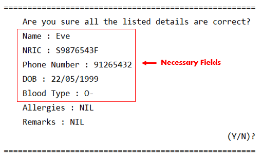

Enter `y` to confirm.

> ***Expected output:***
>    
> 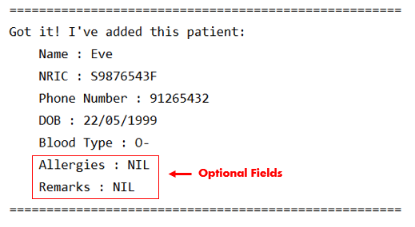

<table>
  <col width="20">
  <col width="200">
 <tr>
   <td> &#9888; </td>
   <td> Entering <code>n</code> will abort the command and HappyPills will not save the patients' information.</td>
    <!--This is a comment. Patient's information will be discarded if <code>n</code> is entered.-->
 </tr>
</table>

 [&#8593; Return to Top](#table-of-content)
 
#### 3.2.2. Edit Patient: `edit patient`

Edit information of a patient with the specified NRIC. 

##### Format: 
 
    edit patient NRIC /n<NAME> 
                      /p<PHONE_NUMBER> 
                      /dob<DATE_OF_BIRTH> 
                      /b<BLOOD_TYPE> 
                      /a<ALLERGIES> 
                      /rm<REMARKS>

<table>
  <col width="20">
  <col width="200">
 <tr>
   <td> &#9888; </td>
   <td> You can only edit <b>one</b> field at a time. Those fields that can be edited are in <code><></code>. 
   There should <b>no spaces</b> between the tag and the edited information.</td>
 </tr>
</table>

**Example:**

    edit patient S9876543F /p99112233

> ***Expected output:***
>
> 

 <table>
   <col width="20">
   <col width="200">
  <tr>
    <td> &#8505; </td>
    <td>If the patient is not found, the message below will be printed instead.</td>
  </tr>
 </table>
 
> ***Expected output:***
>
> 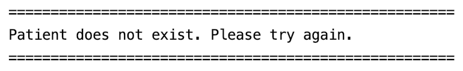

<table>
  <col width="20">
  <col width="200">
 <tr>
   <td> &#8505; </td>
   <td> NRIC <b>cannot</b> be edited because it is used to uniquely identify the patient.</td>
 </tr>
</table>

 [&#8593; Return to Top](#table-of-content)
 
#### 3.2.3. Delete Patient: `delete patient`

Delete a patient as specified by the NRIC. 

##### Format: 

    delete patient NRIC
    
**Example:**

    delete patient S1234567F

> ***Expected output:***
>
> 

<table>
  <col width="20">
  <col width="200">
 <tr>
   <td> &#8505; </td>
   <td> HappyPills will prompt for confirmation before deleting patient in the patient list. </td>
 </tr>
</table>

Enter `y` to confirm.

> ***Expected output:***
>    
> 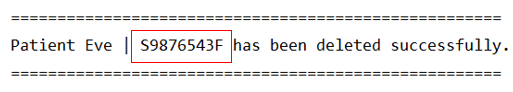

 <table>
   <col width="20">
   <col width="200">
  <tr>
    <td> &#8505; </td>
    <td>If the patient is not found, the message below will be printed instead.</td>
  </tr>
 </table>
 
> ***Expected output:***
>
> 

<table>
  <col width="20">
  <col width="200">
 <tr>
   <td> &#9888; </td>
   <td> Upon successful deletion, patient's information will no longer be retrievable. </td>
 </tr>
</table>

 [&#8593; Return to Top](#table-of-content)

#### 3.2.4. List All Patients: `list patient`

Display all the patients in the patient list. 

##### Format: 

    list patient
    
> ***Expected output:***
>
> 

 <table>
   <col width="20">
   <col width="200">
  <tr>
    <td> &#8505; </td>
    <td>If there are no patients in the list, the message below will be printed instead.</td>
  </tr>
 </table>
 
> ***Expected output:***
>
> 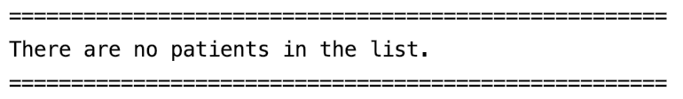

 [&#8593; Return to Top](#table-of-content)

#### 3.2.5. Retrieve a Patient's Information: `get patient`

Diaplay details of a patient with the specified NRIC.

##### Format: 

    get patient NRIC
    
**Example:**

    get patient T9999999N
    
> ***Expected output:***
>
> 

 <table>
   <col width="20">
   <col width="200">
  <tr>
    <td> &#8505; </td>
    <td>If the patient is not found, the message below will be printed instead.</td>
  </tr>
 </table>
 
> ***Expected output:***
>
> 

 [&#8593; Return to Top](#table-of-content)
 
### 3.3. Patient Medical Records 
 
#### 3.3.1. Add Patient Records: `add pr`
 
Add a patient's medical records into the database to support the diagnosis of a patient's illness 
and to justify the treatment carried out.

  <table>
    <col width="20">
    <col width="200">
   <tr>
     <td> &#8505; </td>
     <td>HappyPills will prompt you if there are any missing fields. Instead of having to type the whole command again, 
          you will only need to fill in the couple of fields you missed.
          You can also add a new patient record with the specified parameters in any order.</td>
   </tr>
  </table>
 
<table>
  <col width="20">
  <col width="200">
 <tr>
   <td> &#9888; </td>
   <td> Patient's records can only be added if the patient information exists in the database. </td>
 </tr>
</table>
 
##### Format:
 
    add pr /ic NRIC /sym SYMPTOMS /diag DIAGNOSIS /d DATE /t TIME
     
 **Example:**
     
    add pr /ic S9876543F /sym Cough /diag Fever /d 22/02/1992 /t 22:22
 
> ***Expected output:***
>
> 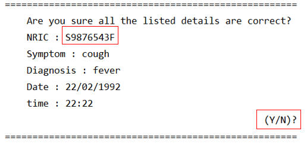
 
Enter `y` to confirm.
 
> ***Expected output:***
>
> 

<table>
  <col width="20">
  <col width="200">
 <tr>
   <td> &#9888; </td>
   <td> Entering <code>n</code> will abort the command and HappyPills will not save the patients' records.</td>
    <!--This is a comment. Patient's information will be discarded if <code>n</code> is entered.-->
 </tr>
</table>
 
  [&#8593; Return to Top](#table-of-content)

#### 3.3.2. Edit Patient Records: `edit pr`
 
 Edit a patient's past medical record using the patient's NRIC and the index of the patient's records 
 which can be obtained from the [`list pr`](#334-list-patient-records-list-pr) command.
 
##### Format:
 
    edit pr NRIC INDEX /sym<SYMPTOMS> 
                       /diag<DIAGNOSIS> 
                       /d<DATE> 
                       /t<TIME>
                        
 <table>
   <col width="20">
   <col width="200">
  <tr>
    <td> &#9888; </td>
    <td> You can only edit <b>one</b> field at a time. Those fields that can be edited are in <code><></code>. 
    There should <b>no spaces</b> between the tag and the edited information.</td>
  </tr>
 </table>
     
 **Example:**
 
    edit pr S9876543F 2 /t12:00
 
> ***Expected output:***
>
> 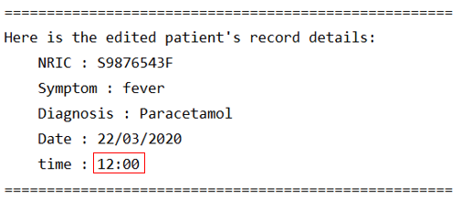
 
 <table>
   <col width="20">
   <col width="200">
  <tr>
    <td> &#8505; </td>
    <td>If the record is not found with the given input, the message below will be printed instead.</td>
  </tr>
 </table>
 
> ***Expected output:***
>
> 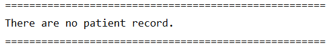
 
  [&#8593; Return to Top](#table-of-content)
  
#### 3.3.3. Delete Patient Records: `delete pr`
 
 Delete patient's medical records based on the given NRIC and the index of the patient's records 
 which can be obtained from the [`list pr`](#334-list-patient-records-list-pr) command.
 
##### Format:
 
    delete pr NRIC INDEX
 
 **Example:**
 
    delete pr S9876543F 1
 
> ***Expected output:***
>
> 
 
 <table>
   <col width="20">
   <col width="200">
  <tr>
    <td> &#8505; </td>
    <td>If the record is not found with the given input, the message below will be printed instead.</td>
  </tr>
 </table>
 
> ***Expected output:***
>
> 
 
  [&#8593; Return to Top](#table-of-content)  
 
#### 3.3.4. List Patient Records: `list pr`
 
 Display all patient records of a patient using his/her NRIC. The patient's records will be listed with their respective 
 index which is used for [`find pr`](#335-find-patient-records-find-pr), 
 [`edit pr`](#332-edit-patient-records-edit-pr) and [`delete pr`](#333-delete-patient-records-delete-pr) commands.
 
##### Format:
 
    list pr NRIC
 
 **Example:**
     
    list pr S9876543F
     
> ***Expected output:***
>
> 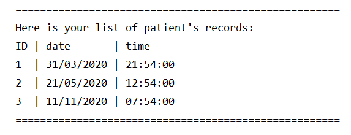
 
 <table>
   <col width="20">
   <col width="200">
  <tr>
    <td> &#8505; </td>
    <td>If the patient have no past medical records. The message below will be printed instead.</td>
  </tr>
 </table>
 
> ***Expected output:***
>
> 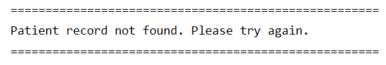
 
  [&#8593; Return to Top](#table-of-content)
  
   
#### 3.3.5. Find Patient Records: `find pr`

Display detailed information of a patient's visit using the NRIC and index of the patient's records 
which can be obtained from the [`list pr`](#334-list-patient-records-list-pr) command. 
 
##### Format:
 
    find pr NRIC INDEX
 
 **Example:**
 
    find pr S9876543F 2
 
> ***Expected output:***
>
> 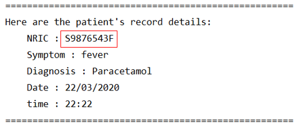
 
 <table>
   <col width="20">
   <col width="200">
  <tr>
    <td> &#8505; </td>
    <td>If no record is found with the given NRIC, the message below will be printed instead.</td>
  </tr>
 </table>
 
> ***Expected output:***
>
> 
 
  [&#8593; Return to Top](#table-of-content)
 
### 3.4. Appointment Scheduling Commands 
 
HappyPills helps to store appointment schedules. 
 
#### 3.4.1. Add Appointment: `add appt`
 
 Add a new appointment for a patient with the given NRIC. An Appointment ID will be allocated to the
 patient's appointment automatically.
 
  <table>
    <col width="20">
    <col width="200">
   <tr>
     <td> &#8505; </td>
     <td>HappyPills will prompt you if there are any missing fields. Instead of having to type the whole command again, 
          you will only need to fill in the couple of fields you missed.
          You can also add a new appointment with the specified parameters in any order.</td>
   </tr>
  </table>
 
  <table>
    <col width="20">
    <col width="200">
   <tr>
     <td> &#9888; </td>
     <td> Appointments can only be added for a patient if the patient exists in the database. </td>
   </tr>
  </table>
  
##### Format:
  
    add appt /ic NRIC /d DATE /t TIME /r REASON
          
  **Example:**
      
    add appt /ic S1234567F /d 01/02/2020 /t 12:00 /r sick
 
> ***Expected output:***
>
> 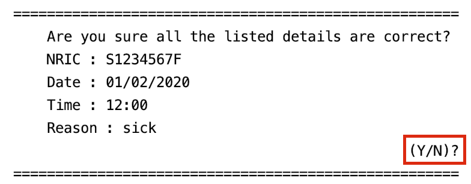
>
Enter `y` to confirm.
>
> 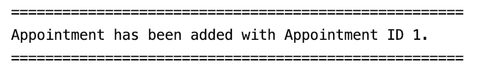
 
<table>
  <col width="20">
  <col width="200">
 <tr>
   <td> &#9888; </td>
   <td> Entering <code>n</code> will abort the command and HappyPills will not save the appointment.</td>
 </tr>
</table> 
 
  [&#8593; Return to Top](#table-of-content)
 
#### 3.4.2. Edit Appointment: `edit appt`
 
Edit information of an appointment using the patient's NRIC and Appointment ID which can be be obtained
from the [`list appt`](#344-list-all-appointments-list-appt) and [`find appt`](#345-find-patients-appointments-find-appt) commands.
  
##### Format:  
  
    edit appt NRIC apptID /d<DATE>
                          /t<TIME>
                          /r<REASON>
          
<table>
  <col width="20">
  <col width="200">
 <tr>
   <td> &#9888; </td>
   <td> You can only edit <b>one</b> field at a time. Those fields that can be edited are in <code><></code>. 
   There should <b>no spaces</b> between the tag and the edited information.</td>
 </tr>
</table>
          
  **Example:**
      
    edit appt S1234567F 1 /d12/02/2020
 
> ***Expected output:***
>
> 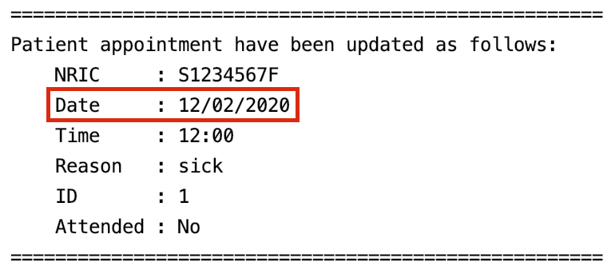

 <table>
   <col width="20">
   <col width="200">
  <tr>
    <td> &#8505; </td>
    <td>If the appointment is not found with the given input, the message below will be printed instead.</td>
  </tr>
 </table>
 
> ***Expected output:***
>
> 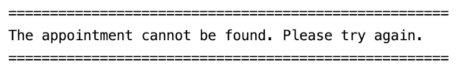
 
  [&#8593; Return to Top](#table-of-content)
 
#### 3.4.3. Delete Appointment: `delete appt`
 
 Delete an appointment of a patient using the patient's NRIC and Appointment ID which can be be obtained
 from the [`list appt`](#344-list-all-appointments-list-appt) and [`find appt`](#345-find-patients-appointments-find-appt) commands.
 
##### Format: 
 
    delete appt NRIC apptID
     
 **Example:**
 
    delete appt S1234567F 1
 
> ***Expected output:***
>
> 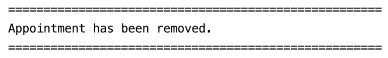
 
 <table>
   <col width="20">
   <col width="200">
  <tr>
    <td> &#8505; </td>
    <td>If the appointment is not found with the given input, the message below will be printed instead.</td>
  </tr>
 </table>
 
> ***Expected output:***
>
> 
 
  [&#8593; Return to Top](#table-of-content)
 
#### 3.4.4. List All Appointments: `list appt` 
 
Display all the existing appointments in the clinic. 
This can be used as a method to check for appointmentID which is used for the [`edit appt`](#342-edit-appointment-edit-appt), 
[`delete appt`](#343-delete-appointment-delete-appt) and [`done appt`](#346-mark-appointment-as-done-done-appt) commands. 
  
##### Format: 
  
    list appt
          
  **Example:**
 
> ***Expected output:***
>
> 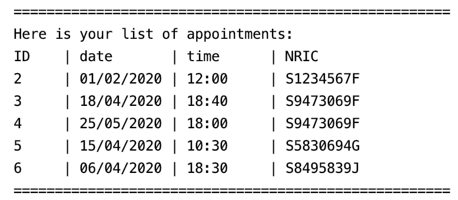

 <table>
   <col width="20">
   <col width="200">
  <tr>
    <td> &#8505; </td>
    <td>If there are no appointments found, the message below will be printed instead.</td>
  </tr>
 </table>
 
> ***Expected output:***
>
> 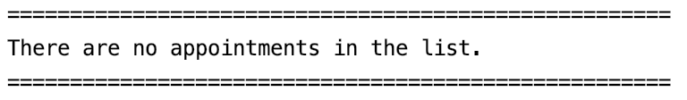
 
  [&#8593; Return to Top](#table-of-content)
 
#### 3.4.5. Find Patient's Appointments: `find appt`
 
Display all the appointments that a patient has using the patient's NRIC.
This can be used as a method to check for appointmentID which is used for the [`edit appt`](#342-edit-appointment-edit-appt), 
[`delete appt`](#343-delete-appointment-delete-appt) and [`done appt`](#346-mark-appointment-as-done-done-appt) commands. 

##### Format: 
  
    find appt NRIC
          
  **Example:**
      
    find appt S9473069F
 
> ***Expected output:***
>
> 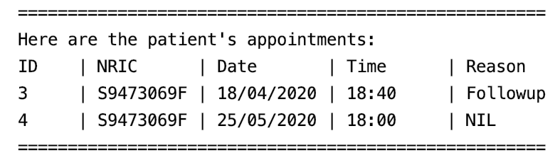

 <table>
   <col width="20">
   <col width="200">
  <tr>
    <td> &#8505; </td>
    <td>If the patient does not have any appointments, the message below will be printed instead.</td>
  </tr>
 </table>
 
> ***Expected output:***
>
> 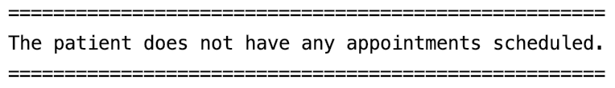
 
  [&#8593; Return to Top](#table-of-content)

#### 3.4.6. Mark Appointment as Done: `done appt` 

Mark appointments as done using the patinet's NRIC and Appointment ID which can be be obtained
from the [`list appt`](#344-list-all-appointments-list-appt) and [`find appt`](#345-find-patients-appointments-find-appt) commands.  
  
##### Format:
  
    done appt NRIC apptID
          
**Example:**
      
    done appt S9473069F 4 
 
> ***Expected output:***
>
> 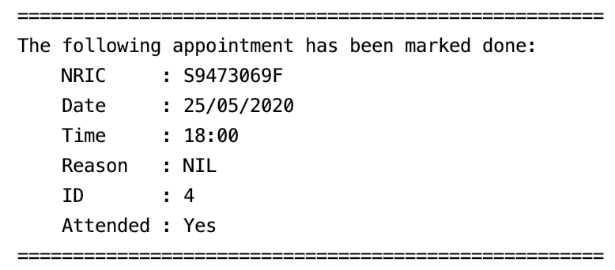

 <table>
   <col width="20">
   <col width="200">
  <tr>
    <td> &#8505; </td>
    <td>If the appointment is not found with the given input, the message below will be printed instead.</td>
  </tr>
 </table>
 
> ***Expected output:***
>
> 
 
  [&#8593; Return to Top](#table-of-content) 

## 4. Command Summary

#### General Patient Information

**Command** | **Format**
--------|----------
Add a Patient | `add patient /ic NRIC /n NAME /p PHONE_NUMBER /dob DATE_OF_BIRTH /b BLOOD_TYPE /a [ALLERGIES] /rm [REMARKS]`
Edit a Patient | `edit patient NRIC /n<NAME> or /p<PHONE_NUMBER> or /dob<DATE_OF_BIRTH> or /b<BLOOD_TYPE> or /a<ALLERGIES> or /rm<REMARKS>`
Delete a Patient | `delete patient NRIC`
List all Patients | `list patient`
Retrieve a Patient's Information | `get patient NRIC`

#### Patient Medical Records

**Command** | **Format**
--------|----------
Add a Patient Record | `add pr /ic NRIC /sym SYMPTOMS /diag DIAGNOSIS /d DATE /t TIME`
Edit a Patient Record | `edit pr NRIC INDEX /sym<SYMPTOMS> or /diag<DIAGNOSIS> or /d<DATE> or /t<TIME>`
Delete a Patient Record | `delete pr NRIC INDEX`
List all Patient Records | `list pr NRIC`
Find a Patient Record| `find pr NRIC INDEX`

#### Appointments

**Command** | **Format**
--------|----------
Add an Appointment | `add appt /ic NRIC /d DATE /t TIME /r REASON`
Edit an Appointment | `edit appt NRIC /d<DATE> or /t<TIME> or /r<REASON>`
Delete an Appointment | `delete appt NRIC APPT_ID`
List all Appointments | `list appt`
Find an Appointment| `find appt NRIC`
Mark an Appointment as Done | `done appt NRIC APPT_ID`

 [&#8593; Return to Top](#table-of-content)

## 5. Useful links:
* [Developer Guide](DeveloperGuide.md)
* [About Us](AboutUs.md)

 [&#8593; Return to Top](#table-of-content)
