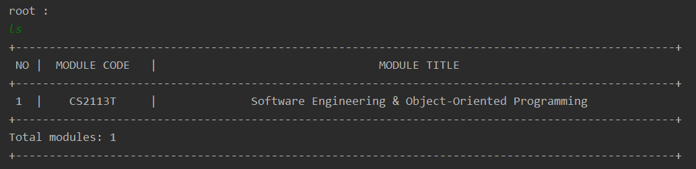
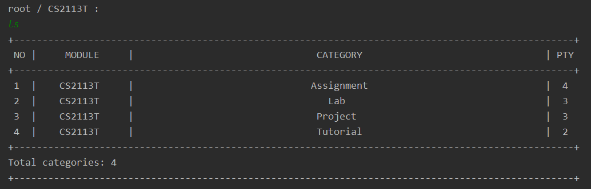
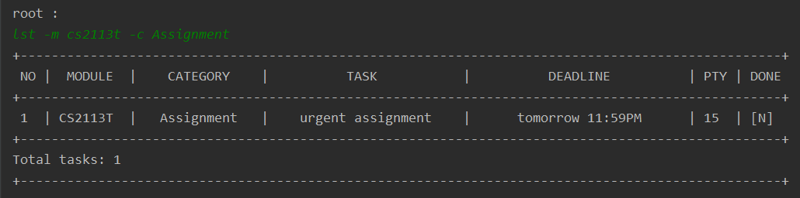
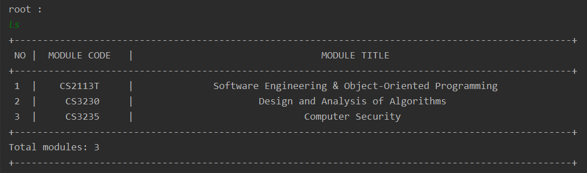
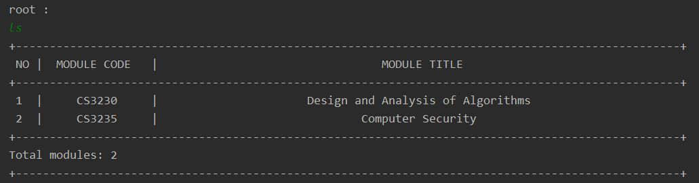
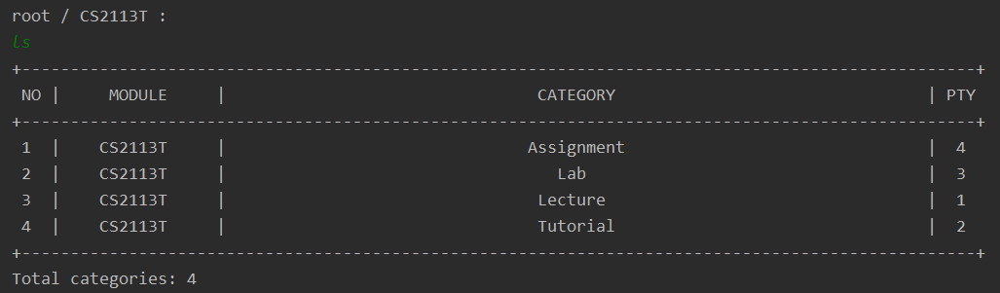

<head>
    <meta charset="UTF-8">
    <title>Nuke User Guide v2.1</title>
    <link href="//maxcdn.bootstrapcdn.com/font-awesome/4.2.0/css/font-awesome.min.css" rel="stylesheet">
</head>

<style type="text/css">
div {
	text-align: justify;
}

.alert {
  padding: 15px;
  margin-bottom: 20px;
  border: 1px solid transparent;
  border-radius: 4px;
}
	
.alert-success {
  background-color: #dff0d8;
  border-color: #d6e9c6;
  color: #3c763d;
}

.alert-info {
  background-color: #d9edf7;
  border-color: #bce8f1;
  color: #31708f;
}

.alert-warning {
  background-color: #fcf8e3;
  border-color: #faebcc;
  color: #8a6d3b;
}

.alert-error {
  background-color: #f2dede;
  border-color: #ebccd1;
  color: #a94442;
}
</style>
# **Nuke User Guide** <small>v2.1</small>     

By: `CS2113T-T13-2`      Since: `Feb 2020`    
<small>[Go to Webpage](https://ay1920s2-cs2113t-t13-2.github.io/tp/UserGuide.html)</small>   

     
## **Table of Contents**  

<big style="color: green">**Introduction** [&#10149;](#introduction)  </big>   
<br> <big style="color: green"> **Setting Up** [&#10149;](#setting-up)  </big>
<br> <big style="color: green"> **General Usage** [&#10149;](#general-usage)  </big>   
&nbsp; &nbsp; &nbsp; &nbsp; &#8226; **Nuke Structure** [&#10149;](#user-stories)   
&nbsp; &nbsp; &nbsp; &nbsp; &#8226; **Command Format** [&#10149;](#command-format)   
&nbsp; &nbsp; &nbsp; &nbsp; &#8226; **Command Prefixes** [&#10149;](#command-prefixes)   
<br> <big style="color: green">**Features** [&#10149;](#features)  </big>      
&nbsp; &nbsp; &nbsp; &nbsp;  **1. Add** [&#10149;](#1-add)  
&nbsp; &nbsp; &nbsp; &nbsp; &nbsp; &nbsp; &nbsp; &nbsp; a. Add a Module into your Module List [&#10149;](#a-add-a-module-into-your-module-list)    
&nbsp; &nbsp; &nbsp; &nbsp; &nbsp; &nbsp; &nbsp; &nbsp; b. Add a Category into your Category List [&#10149;](#b-add-a-category-into-your-category-list)    
&nbsp; &nbsp; &nbsp; &nbsp; &nbsp; &nbsp; &nbsp; &nbsp; c. Add a Task into your Task List [&#10149;](#c-add-a-task-into-your-task-list)    
&nbsp; &nbsp; &nbsp; &nbsp; &nbsp; &nbsp; &nbsp; &nbsp; d. Add a File into your File List [&#10149;](#d-add-a-file-into-your-file-list)    
&nbsp; &nbsp; &nbsp; &nbsp; **2. List** [&#10149;](#2-list)  
&nbsp; &nbsp; &nbsp; &nbsp; &nbsp; &nbsp; &nbsp; &nbsp; a. List your Modules [&#10149;](#a-list-your-modules)     
&nbsp; &nbsp; &nbsp; &nbsp; &nbsp; &nbsp; &nbsp; &nbsp; b. List your Categories [&#10149;](#b-list-your-categories)    
&nbsp; &nbsp; &nbsp; &nbsp; &nbsp; &nbsp; &nbsp; &nbsp; c. List your Tasks [&#10149;](#c-list-your-tasks)    
&nbsp; &nbsp; &nbsp; &nbsp; &nbsp; &nbsp; &nbsp; &nbsp; d. List your Tasks Sorted[&#10149;](#d-list-your-tasks-sorted)    
&nbsp; &nbsp; &nbsp; &nbsp; &nbsp; &nbsp; &nbsp; &nbsp; e. List your Files[&#10149;](#e-list-your-files)    
&nbsp; &nbsp; &nbsp; &nbsp; **3. Delete** [&#10149;](#3-delete)  
&nbsp; &nbsp; &nbsp; &nbsp; &nbsp; &nbsp; &nbsp; &nbsp; a. Delete Modules from your Module List [&#10149;](#a-delete-modules-from-your-module-list)    
&nbsp; &nbsp; &nbsp; &nbsp; &nbsp; &nbsp; &nbsp; &nbsp; b. Delete Categories from your Category List [&#10149;](#b-delete-categories-from-your-category-list)    
&nbsp; &nbsp; &nbsp; &nbsp; &nbsp; &nbsp; &nbsp; &nbsp; c. Delete Tasks from your Task List [&#10149;](#c-delete-tasks-from-your-task-list)    
&nbsp; &nbsp; &nbsp; &nbsp; &nbsp; &nbsp; &nbsp; &nbsp; d. Delete Files from your File List [&#10149;](#d-delete-files-from-your-file-list)    
&nbsp; &nbsp; &nbsp; &nbsp; **4. Edit** [&#10149;](#4-edit)  
&nbsp; &nbsp; &nbsp; &nbsp; &nbsp; &nbsp; &nbsp; &nbsp; a. Edit a Module in your Module List [&#10149;](#a-edit-a-module-in-your-module-list)    
&nbsp; &nbsp; &nbsp; &nbsp; &nbsp; &nbsp; &nbsp; &nbsp; b. Edit a Category in your Category List [&#10149;](#b-edit-a-category-in-your-category-list)    
&nbsp; &nbsp; &nbsp; &nbsp; &nbsp; &nbsp; &nbsp; &nbsp; c. Edit a Task in your Task List [&#10149;](#c-edit-a-task-in-your-task-list)    
&nbsp; &nbsp; &nbsp; &nbsp; &nbsp; &nbsp; &nbsp; &nbsp; d. Edit a File in your File List [&#10149;](#d-edit-a-file-in-your-file-list)    
&nbsp; &nbsp; &nbsp; &nbsp; &nbsp; &nbsp; &nbsp; &nbsp; e. Mark a Task as Done [&#10149;](#e-mark-a-task-as-done)    
&nbsp; &nbsp; &nbsp; &nbsp; **5. Change Directory** [&#10149;](#5-change-directory)    
&nbsp; &nbsp; &nbsp; &nbsp; **6. Open File** [&#10149;](#6-open-file)    
&nbsp; &nbsp; &nbsp; &nbsp; **7. Info** [&#10149;](#7-info)    
&nbsp; &nbsp; &nbsp; &nbsp; **8. Undo** [&#10149;](#8-undo)    
&nbsp; &nbsp; &nbsp; &nbsp; **9. Redo** [&#10149;](#9-redo)    
<br>  <big style="color: green"> **Miscellaneous Information** [&#10149;](#miscellaneous-information) </big>   
&nbsp; &nbsp; &nbsp; &nbsp; &#8226; **Help** [&#10149;](#help)  
&nbsp; &nbsp; &nbsp; &nbsp; &#8226; **Exiting the Nuke Program** [&#10149;](#exiting-the-nuke-program)  
&nbsp; &nbsp; &nbsp; &nbsp; &#8226; **Loading and Saving** [&#10149;](#loading-and-saving)  
&nbsp; &nbsp; &nbsp; &nbsp; &nbsp; &nbsp; &nbsp; &nbsp; -- Loading [&#10149;](#loading)    
&nbsp; &nbsp; &nbsp; &nbsp; &nbsp; &nbsp; &nbsp; &nbsp; -- Saving [&#10149;](#saving)    
&nbsp; &nbsp; &nbsp; &nbsp; &#8226; **Date Time Formats** [&#10149;](#date-time-formats)  
&nbsp; &nbsp; &nbsp; &nbsp; &nbsp; &nbsp; &nbsp; &nbsp; -- Date Formats [&#10149;](#date-formats)    
&nbsp; &nbsp; &nbsp; &nbsp; &nbsp; &nbsp; &nbsp; &nbsp; -- Time Formats [&#10149;](#time-formats)    
<br>  <big style="color: green"> **Command Summary** [&#10149;](#command-summary) </big>   
<br>  <big style="color: green"> **FAQ** [&#10149;](#faq) </big>   

<br>  

## **Introduction**  
<span style="text-align: justify; display: block">
This **Nuke** application is a simple yet powerful task management system that is dedicated to providing **NUS students** a more efficient way to organise their _modules_ and _tasks_.<br>  
You will be interacting with the application via the command line. With the **Nuke** application, you will be able to perform various operations to manage your _modules_ and _tasks_ such as adding, deleting and listing your  _modules_ and _tasks_. You may also add additional properties to your _tasks_ such as _files_, _deadlines_, and _priorities_.<br>  
**Nuke** facilitates users by automatically sorting user-added _tasks_ and displaying the most important and urgent ones to the users. In the long term, it strives to enhance the quality of NUS students’ lives by serving as the one-stop platform for efficient management of module tasks.<br>  
If you are an **NUS student** and have not tried out **Nuke** yet...  
What are you waiting for? Give **Nuke** a shot, and you will see how amazing it is!   
</span>
   
[Back To Top](#table-of-contents)

<br>

## **Setting Up**

[Back To Top](#table-of-contents)

<br>

## **General Usage**  
This section will explain the fundamental structure of the **Nuke** application, and important guidelines to follow to ensure smooth usage of the application.  

### **Nuke Structure**
**Nuke** follows the structure of a **Directory Tree** _(i.e. folder sub-folder structure)_. This Directory Tree comprises various levels:

<div style="text-align: center"><span style="color: green"><small>Table <b>Directory Levels</b></small></span></div>

| Directory Level | Description                                                                      |
|:---------------:|----------------------------------------------------------------------------------|
| **Root**        | The **base** of the Directory Tree. Only **one** root exists in the entire Tree.<br>Added _modules_ are in this level. |
| **Module**      | The **second** level of the Directory Tree.<br>Added _categories_ are in this level.   |
| **Category**    | The **third** level of the Directory Tree.<br>Added _tasks_ are in this level.    |
| **Task**        | The **fourth** level of the Directory Tree.<br>Added _files_ are in this level.       |
| **File**        | The **last** level of the Directory Tree.<br>Nothing else can be added.                                         |
  
<br>
  
Below is an illustration of a possible <b>Directory Tree</b> structure:    
<br>
  
<span style="color: green"><small><i>Figure <b>Sample Directory Tree</b></i></small></span>

<br>

#### Root   
The **Root** Directory is the **base** of the entire Directory Tree. Only **one** root exists in the entire Tree. _Modules_ are added into this level into a **Module List**. A _module_ consists of both a *module code* and a _module title_. 

<div class="alert alert-warning">
<i class="fa fa-exclamation"></i> <b>Note</b> <br> 
Only <b>NUS modules</b> are allowed to be added in <b>Nuke</b>.  
</div>

#### Module
The **Module** Directory is the **second** level of the Directory Tree.  Each _module_ has a **Category List** that has several _categories_ to categorise your _tasks_, such as Lecture, Tutorial and Assignment, so that you can further organise your _tasks_. A _category_ consists of a _name_ and a _priority_ to indicate the importance of the _tasks_ in that _category_.  
<div class="alert alert-info">
<i class="fa fa-info"></i> <b>Info</b> <br> 
Upon adding a <i>module</i>, <b>Nuke</b> automatically adds four <i>categories</i> into the <i>module</i>. They are Lecture, Tutorial, Assignment and Lab. So, you don't have to add those <i>categories</i> yourself!
</div>   

#### Category
The **Category** Directory is the **third** level of the Directory Tree. Each _category_ has a **Task List** that can contain any number of _tasks_, which are ideally related to the _category_. A _task_ has several attributes, namely the _description_, _deadline_ of the _task_ if any, _priority_ and the _done status_ of the _task_.

#### Task
The **Task** Directory is the **fourth** level of the Directory Tree. Each _task_ can have _files_ attached to the it. _Files_ are stored in the **File List**. The _file_ must have a _file name_ and the _path_ to the _file_.   

#### File
The **File** Directory is the **last** level of the Directory Tree. It contains no other directories.   

<div class="alert alert-warning">
<i class="fa fa-exclamation"></i> <b>Note</b> <br> 
The <b>Nuke</b> application adheres to this Directory Tree structure strictly. It is important to note that you can only add a directory into a directory which is <b><i>exactly</i> one level lower</b>. <br>
For example, you can only add a <i>task</i> into the <b>Category</b> directory, and not directly into the <b>Module</b> directory.
</div>

<div class="alert alert-info">
<i class="fa fa-info"></i> <b>Tip</b> <br> 
You can shorten the commands you enter by first entering into a directory. Then you do <b>not</b> need to enter the full <i>directory path</i> in your command! <br>
To learn how to traverse the various directories, see the <a href="#6-change-directory">Change Directory</a> command.
</div>   
  
[Back To Top](#table-of-contents)

<br>

## **Command Format**  
In this User Guide, the format for each feature _(command)_ will usually be of this form:  
`CommandWord <attr0> -pfix1 <attr1> ... [ -pfix2 <attr2> ... ] { -pfix3 <attr3> -pfix4 <attr4> ... }`

### **Command Word**
Each command you give to **Nuke** has to begin with its corresponding unique **command word**. This helps **Nuke** to know that you want it to execute a particular command.  

### **Attribute**
**Attributes** are information to be provided in the command. An **attribute** for the command will be wrapped in angular brackets `< >` to help you to recognise it.   

### **Prefix**
A **prefix** is used to provide additional supplementary information to the command. More information on the various **command prefixes** can be found [here](#command-prefixes).   

### **Optional**   
Some **attributes** and **prefixes** are _optional_ and the command can still execute properly even when omitted. However, they may be useful if you want to provide a more specific information to the command. Optional **attributes** and **prefixes** will be wrapped in square brackets `[ ]` to help you to recognise them.   

### **Any**
There are times when you may have to include at least one from a set of **attributes** and **prefixes**. You may choose to include one <i>or</i> more from the set, but <b>not</b> none of them. Such **attributes** and **prefixes** will be wrapped in curly brackets `{ }` to help you to recognise them.   
  
[Back To Top](#table-of-contents)
  
<br>

## **Command Prefixes**  
On many occasions, you may be required to enter more information to describe the commands you give to **Nuke**. For example, when adding a _task_, you may need to specify the _module_ and _category_ to add the _task_ into. You may also want to include additional attributes such as the _deadline_ and _priority_. All these information can only be recognised by **Nuke** if they are preceded by the correct **prefix**.<br>   
All **command prefixes** in **Nuke** begins with a `-` and followed by a **letter**. Below is the exhaustive list of **command prefixes** and general information that should follow after.   

<div style="text-align: center"><span style="color: green"><small>Table <b>Command Prefixes</b></small></span></div>

| Command Prefix | General Definition                                               |
|:--------------:|------------------------------------------------------------------|
| `-m`           | The _module code_ of the _**m**odule_                            |
| `-c`           | The _name_ of the _**c**ategory_                                 |
| `-t`           | The _description_ of the _**t**ask_                              |
| `-f`           | The _name_ or _path_ of the _**f**ile_                           |
| `-d`           | The _**d**eadline_ of the _task_                                 |
| `-p`           | The _**p**riority_ of the _category_ or _task_                   |
| `-e`           | To indicate whether filtering is done **e**xactly                |
| `-a`           | To indicate whether filtering is done across **a**ll directories |

<br>

<div class="alert alert-warning">
<i class="fa fa-exclamation"></i> <b>Note</b> <br> 
Because each <b>prefix</b> begins with a <code>-</code>, <b>Nuke</b> has to unfortunately restrict your choice of names for the directories. <br>
Specifically, each word in the name of your directory has to begin with a alpha-numeric <i>(i.e. non-symbol)</i> or underscore character.
</div>
  
[Back To Top](#table-of-contents)  

<br><br>  

## **Features**  
### **1. Add**  
Adds a _module_, _category_,  _task_ or <i>file</i> into their respective lists.<br>

As mentioned previously, **Nuke** follows the structure of a [**Directory Tree**](#nuke-structure) _(i.e. folder sub-folder structure)_. **Nuke** complements the Linux shell command by offering a generic add command word for creating a directory: `mkdir`  
<br>
Below sums up what `mkdir` does at each level of the Directory.

<div style="text-align: center"><span style="color: green"><small>Table <b>Generic Add</b></small></span></div>

| Current Level   | What Happens?                                                        |  
|:---------------:|----------------------------------------------------------------------|  
| <b>Root</b>     | `mkdir <module code>` adds a *module* into the current directory     |  
| <b>Module</b>   | `mkdir <category name>` adds a *category* into the current directory |  
| <b>Category</b> | `mkdir <task description>` adds a *task* into the current directory  |  
| <b>Task</b>     | `mkdir <file name>` adds a *file* into the current directory         |  
| <b>File</b>     | You cannot `mkdir` here! :pensive:                                   |  


The above commands have to be done in their corresponding directories. Conversely, the commands below can be done in any directory, but may require you to enter <i>additional</i> information.   

[Back To Top](#table-of-contents)


#### a. Add a Module into your Module List  
`addm` adds a _module_ into your **Module List**. The **Module List** contains all your added _modules_ and can be viewed via the [List Module command](#a-list-your-modules).

##### Format  
`addm <module code>`  
- `module code` -- The _module code_ of the   _module_  

<div class="alert alert-warning">
<i class="fa fa-exclamation"></i> <b>Note</b> <br> 
The <i>module code</i> is case-<b>insensitive</b>. However, it must correspond to a valid <b>NUS module</b>. Only <b>NUS modules</b> can be added in this version of <b>Nuke</b>.
</div>
 
##### Example Usage and Expected Outcome  
  


##### Before:


##### After:




  
[Back To Top](#table-of-contents)   

<br>

#### b. Add a Category into your Category List  
`addc` adds a _category_ into your **Category List**. The **Category List** contains all your added _categories_ in the _module_ and can be viewed via the [List Category](#b-list-your-categories) command.

##### Format  
`addc <category name> -m <module code> [ -p <priority> ]`  

- `category name` -- The _name_ of the   _category_
- `module code` -- The _module code_ of the _module_   to contain the _category_ to be added
- `priority` -- A number indicating the  _priority_ of the _category_ <i>(optional)</i>  

<div class="alert alert-warning">
<i class="fa fa-exclamation"></i> <b>Note</b> <br> 
The <code>priority</code> that you give must be a number between 0 and 20 inclusive. The bigger the number, the more important the category. If the <code>priority</code> is not given, then it will be set to <b>0</b>.  
</div>
<div class="alert alert-info">
<i class="fa fa-info"></i> <b>Tip</b> <br> 
You need <b>not</b> include the <b>module code</b> information if you are currently in that <i>module</i>'s directory. You can move to the  <i>module</i>'s directory via the <a href="#6-change-directory">Change Directory</a> Command.  
</div>

##### Example Usage
```
addc Project -m cs2113t -p 3
```

##### Expected Outcome    
```
SUCCESS!! Category Project is created.
```

##### before:


##### after:



[Back To Top](#table-of-contents)

<br>  

#### c. Add a Task into your Task List  
`addt` adds a _task_ into your **Task List**. The **Task List** contains all your added _tasks_ in the _category_ and can be viewed via the [List Task](#c-list-your-tasks) command.

##### Format  
`addt <task description> -m <module code> -c <category name> [ -d <deadline> -p <priority> ]`  

- `task description` -- The _description_ of the _task_  
- `module code` -- The _module code_ of the _module_   to contain the _category_ to be added  
- `category name` -- The _name_ of the   _category_  
- `deadline` -- The _deadline_ of the _task_  
- `priority` -- A number indicating the  _priority_ of the _category_   
> **Note**: You need **not** include the `module code` if you are currently in that _module_'s directory. Also, you need **not** include both `module code` and `category name`  if you are currently in that _category_'s directory. You can move to the  the respective directories via the [Change Directory](#6-change-directory) Command.  
> **Note**: The `priority` that you give must be a number between 0 and 100 inclusive. The bigger the number, the more important the task. If the `priority` is not given, then it will be set to the same _priority_ as it's _category_.  
> **Note**: The `deadline` provided consists of both a _date_ and a _time_. The `deadline` provided must adhere to the set of accepted [Date Time formats](#date-time-formats).   

##### Example Usage    

```
	addt urgent assignment -m cs2113t -c Assignment -d tmr 2359 -p 80
```

##### Expected Outcome    
```
root / CS2113T / Assignment :
addt urgent assignment -m cs2113t -c Assignment -d tmr 2359 -p 80
SUCCESS!! Task urgent assignment is created.
```
##### before:


##### after:


[Back To Top](#table-of-contents)

<br>

#### d. Add a File into your Task File List  
`addf` adds a _file_ into your _task_'s **File List**. The **File List** contains all your added _files_ and can be viewed via the [List File](#d-list-your-files) command.

##### Format  
`addf <file name> -m <module code> -c <category name> -t <task description> -f <file path>`  

- `file name` -- The _name_ of the _file_  
- `module code` -- The _module code_ of the _module_   to contain the _category_ to be added  
- `category name` -- The _name_ of the   _category_  
- `task decription` -- The _description_ of the _task_  
- `file path` -- the **Absolute** _path_ of the _file_   
> **Note**: You need **not** include the `module code` if you are currently in that _module_'s directory. Also, you need **not** include both `module code` and `category name`  if you are currently in that _category_'s directory. Moreover, you need **not** include `module code`, `category name` and `task description` if you are currently in that _task_'s directory. You can move to the  the respective directories via the [Change Directory](#6-change-directory) Command.  
> **Note**: The `file path` that you give must exist. Otherwise, an error message will be displayed.
> **Note**: The `file name` provided can be different from the real file name that is stored in the disk.   

##### Example Usage

```
	addt save.txt -m CS2113t -c Lab -t tp -f C:\Users\JUNIOR\Downloads\save.txt
```

```
	addt save.txt -t tp -f C:\Users\JUNIOR\Downloads\save.txt
```

```
	addt save.txt -f C:\Users\JUNIOR\Downloads\save.txt
```

##### Expected Outcome    
```
root / CS2113T / Lab / tp :
addt save.txt -m CS2113t -c Lab -t tp -f C:\Users\JUNIOR\Downloads\save.txt
SUCCESS!! File save.txt is added.
```

[Back To Top](#table-of-contents)

<br>

#### e. Add a Tag to your Task
Adds a _tag_ to your _task_'s **Tag List**. The **Tag List** contains all your added _tags_ to the _task_. (and can be viewed via the List File command. not available now).

##### Format  
`addg <tag info> -m <module code> -c <category name> -t <task description>`  

- `tag info` -- The _tag_ to be added  
- `module code` -- The _module code_ of the _module_ to contain the _category_ to be added  
- `category name` -- The _name_ of the   _category_  
- `task decription` -- The _description_ of the _task_  
> **Note**: You need **not** include the `module code` if you are currently in that _module_'s directory. Also, you need **not** include both `module code` and `category name`  if you are currently in that _category_'s directory. Moreover, you need **not** include `module code`, `category name` and `task description` if you are currently in that _task_'s directory. You can move to the  the respective directories via the [Change Directory](#6-change-directory) Command.  

##### Example Usage

```
	addg urgent -m CS2113t -c Lab -t tp
```

```
	addt urgent -t tp
```

```
	addt urgent
```

##### Expected Outcome    
```
root / CS2113T / Lab / tp :
addg urgent -m CS2113t -c Lab -t tp
Tag added!
```

[Back To Top](#table-of-contents)

<br>

### **2. List**  
Lists the _modules_, _categories_ or _tasks_ in their respective lists.<br>

As mentioned previously, **Nuke** follows the structure of a **Directory Tree** _(i.e. folder sub-folder structure)_. Therefore, **Nuke** also supports Linux file-system-related command for listing files in a directory: `ls`

- When you are at the **Root Directory**, `ls` will list out all your *module*s in your **Module List**. `ls <module code>` will list out all *category*s in the **Category List** in the *module*
- When you are at the **Module Directory**, `ls` will list out all the *category*s in your **Category List**. `ls <category name>` will list out all *task*s in the **Task List** in the *category*
- When you are at the **Category Directory**, `ls` will list out all the *task*s in your **Task List**.

The above mentioned commands have to be done in the corresponding directories, and the commands below can be done in any directories, but less generic.

#### a. List your Modules

List all *module*s in your **Module List**. The **Module List** contains all your added _modules_ and can be viewed via the List Module command.

##### Format  

`lsm [keyword]`   

> **Note**: If keyword is provided, `lsm` will list out all modules with module code containing the keyword, otherwise, `lsm` will list out all modules.

##### Example Usage    

```
	lsm
```

##### Expected Outcome 


#### b. List your Categories

List all *category*s in your **Category List**. The **Category List** contains all your added _categories_ in the _module_ and can be viewed via the List Category command.

##### Format  

`lsc [ -m <module code> ]`  

- `module code` -- The _module code_ of the _module_ to contain the _category_ to be added

> **Note**: You need **not** include the `module code` information if you are currently in that _module_'s directory. You can move to the  _module_'s directory via the [Change Directory](#6-change-directory) Command.

##### Example Usage

```
	lsc -m c3235
```

```
	lsc
```

##### Expected Outcome


#### c. List your Tasks  

List all the *task*s in your **Task List**. The **Task List** contains all your added _tasks_ in the _category_ and can be viewed via the List Task command.

##### Format  

```
lst [ -m <module code> -c <category name>]
```

> **Note**: You need **not** include the `module code` if you are currently in that _module_'s directory. Also, you need **not** include both `module code` and `category name`  if you are currently in that _category_'s directory. You can move to the  the respective directories via the [Change Directory](#6-change-directory) Command.  

##### Example Usage 

```
	lst -m cs3235 -c Assignment
```

```
	lst -c Assignment
```

```
	lst
```

##### Expected Outcome    



#### d. List your undo tasks in sorted order  

List all the undo *task*s in your **Task List**. The *task*s will be sorted in ascending order of `deadline` by deafault. User can also specify in the command to sort *task*s in descending order of `priority` by adding `-p` prefix.

##### Format  

```
lsts [ -d -p (choose 1; default -d) ]
```

> **Note**: You need **not** include the `-d` if you want to sort tasks in terms of `deadline`. You are supposed to choose only one prefix between `-d` and `-p`. 

##### Example Usage

```
	lsts
```

```
	lsts -p
```

##### Expected Outcome


#### e. List your tasks under specific module in sorted order 

List all the *task*s in one of added *module*s. The *task*s will be sorted in ascending order of `deadline` by deafault.

##### Format  

```
lsmtd <module code>
```

> **Note**: You need **not** include the `module code` if you are currently in that *module*'s directory. Sepcifying a `module code` will make the command to list tasks in that *module*.

##### Example Usage

```
	lsmtd
```

```
	lsmtd CS2113
```

##### Expected Outcome


### **3. Delete**  
Deletes _modules_, _categories_ or _tasks_ from their respective lists.<br>

As mentioned previously, **Nuke** follows the structure of a **Directory Tree** _(i.e. folder sub-folder structure)_. Therefore, **Nuke** also supports Linux file-system-related command for deleting a directory: `rm`

- When you are at the **Root Directory**, `rm <module code>` will remove a *module* from your **Module List**.
- When you are at the **Module Directory**, `rm <category name>` will remove a *category* from your **Category List**. 
- When you are at the **Category Directory**, `rm <task name>` will remove a _task_ from your **Task List**.

For Delete command, user will be prompted to confirm by entering `y` or `yes`  or to abort by entering `n` or `no` after entering the Delete command.

The above mentioned commands have to be done in the corresponding directories, and the commands below can be done in any directories, but less generic.

#### a. Delete Modules from your Module List

Delete a _module_ from your **Module List**. The **Module List** contains all your added _modules_ and can be viewed via the List Module command.

##### Format  

`delm <module code>`  

- `module code` -- The _module code_ of the _module_  

> **Note**: The _module code_ is **case-insensitive**. However, it must correspond to a valid **NUS module**. Only **NUS modules** can be deleted in this version of **Nuke**.

##### Example Usage    

```
	delm cs3235
```

##### Expected Outcome

```
root :
delm cs3235
Confirm delete CS3235 Computer Security?

root :
y
SUCCESS!! Module(s) have been deleted.
```

##### before:



##### after:




#### b. Delete Categories from your Category List   

Delete a _category_ from your **Category List**. The **Category List** contains all your added _categories_ in the _module_ and can be viewed via the List Category command.

##### Format  

`delc <category name> -m <module code>`  

- `category name` -- The _name_ of the   _category_
- `module code` -- The _module code_ of the _module_   to contain the _category_ to be added

> **Note**: You need **not** include the `module code` information if you are currently in that _module_'s directory. You can move to the  _module_'s directory via the [Change Directory](#6-change-directory) Command.

##### Example Usage    

`delc Lecture -m cs2113t` when not in the *module*'s  directory

`delc Lecture` when in the *module*'s directory

##### Expected Outcome    

```
root :
delc Lecture -m cs3235
Confirm delete Lecture?

root :
y
SUCCESS!! Category/Categories have been deleted.
```

##### before:



##### after:

  


#### c. Delete Tasks from your Task List     

Delete a _task_ from your **Task List**. The **Task List** contains all your added _tasks_ in the _category_ and can be viewed via the List Task command.

##### Format  

`delt <task description> -m <module code> -c <category name>`  

- `task description` -- The _description_ of the _task_
- `module code` -- The _module code_ of the _module_   to contain the _category_ to be added
- `category name` -- The _name_ of the   _category

> **Note**: You need **not** include the `module code` if you are currently in that _module_'s directory. Also, you need **not** include both `module code` and `category name`  if you are currently in that _category_'s directory. You can move to the  the respective directories via the [Change Directory](#6-change-directory) Command. 

##### Example Usage    

`delt urgent assignment -m cs3235 -c Assignment` when not in the *module*'s  directory

`delt urgent assignment -c Assignment` when not in the *category*'s directory

`delt urgent assignment` when in the *category*'s directory

##### Expected Outcome    

```
root :
delt urgent assignment -m cs3235 -c Assignment
Confirm delete urgent assignment?

root :
y
SUCCESS!! Task(s) have been deleted.
```

##### before:


##### after:


### **4. Edit**

Edits a _module_, _category_ or _task_ in their respective lists.<br>  

#### a. Edit a Module in your Module List  
```
	// To do
```

##### Format  
```
	// To do
```

##### Example Usage    
```
	// To do
```

##### Expected Outcome    
```
	// To do
```

<br>  

#### b. Edit a Category in your Category List  
```
	// To do
```

##### Format  
```
	// To do
```

##### Example Usage    
```
	// To do
```

##### Expected Outcome    
```
	// To do
```

<br>  

#### c. Edit a Task in your Task List  
```
	// To do
```

##### Format  
```
	// To do
```

##### Example Usage    
```
	// To do
```

##### Expected Outcome    
```
	// To do
```

<br><br>  

### 5. Mark a Task as Done  
Marks a task as *done*.

##### Format  
`done <task description> -m <module code> -c <category name>`  

- `task description` -- The _description_ of the _task_
- `module code` -- The _module code_ of the _module_   to contain the _category_ to be added
- `category name` -- The _name_ of the   _category_
  
##### Example Usage    
```
	done Tutorial 7 -m CS1231 -c Tutorial
```

##### Expected Outcome    

```
	SUCCESS!! Task has been updated.
```

<br><br>  

### **5. Change Directory** 
`cd` traverses up and down the Directory Tree from your current directory.  

##### Format  

`cd <directory name>` to traverse down   
`cd ..` to traverse up   

- `directory name` -- The name of the next _directory_   

<div class="alert alert-warning">
<i class="fa fa-exclamation"></i> <b>Note</b> <br> 
There will <b>not</b> be any message shown for successful traversal &#128528;. Instead, you will be able to see a change in the current directory path as shown in the positive traversing example below. <br>
However, attempting to traverse ahead of the <b>Root</b> Directory (first directory) <i>or</i> beyond the <b>File</b> Directory <i>(last directory)</i> will result in an error message being shown &#128552;.
</div>

##### Example Usage and Expected Outcome    
<small><u>Correct Traversal </u></small>
   <br>
     
<br>  
<small><u>Incorrect Traversal </u></small>
    <br>
    
 
<br><br>

### **6. Open File**   
`open` opens your <i>file(s)</i> of a specified <i>task</i>. You can choose between opening a single <i>file</i> <i>or</i> <b>all</b> your <i>files</i> in the <b>File List</b>.  

##### Format  

`open [ <file name> ] -m <module code> -c <category name> -t <task description>`  

- `file name` -- The <i>name</i> of the <i>file</i> <i>(optional)</i>   
- `module code` -- The <i>module code</i> of the <i>module</i> containing the <i>file</i>   
- `category name` -- The <i>name</i> of the   <i>category</i> containing the <i>file</i>   
- `task description` -- The <i>description</i> of the <i>task</i> containing the <i>file</i>  

<div class="alert alert-info">
<i class="fa fa-info"></i> <b>Info</b> <br> 
To open a single <i>file</i>, enter its <code>file name</code>. <bR>Otherwise, if you want to open <b>all</b> the <i>files</i> in the list, leave the <code>file name</code> blank.
</div>

##### Example Usage and Expected Outcome    
<small><u>Opening at Root Level</u></small>  
 
<br>
<small><u>Opening at Task Level</u></small>  
  

<br><br>

### **7. Info**  
`info` displays information about your current directory. It shows you the current directory's attributes, and a list of its child directories, <i>if any</i>. <br>
For example, on the <b>Module</b> directory, the <b>Info</b> command will display the <i>module</i>'s <i>code</i> and <i>title</i>, as well as its <b>Category List</b>.   

##### Format  

`info`   

##### Example Usage and Expected Outcome    


<br><br>

### **8. Undo** 
`undo` undoes a <i>change</i> made to the application.  

<div class="alert alert-info">
<i class="fa fa-info"></i> <b>Info</b> <br> 
<i>Change</i> here refers to a successful <a href="#1-add"><b>Add</b></a>, <a href="#3-delete"><b>Delete</b></a>, <a href="#4-edit"><b>Edit</b></a> or <a href="#8-undo"><b>Undo</b></a> command. These commands changes your lists. The <b>Undo</b> command reverts these changes.
</div>

##### Format  

`undo`   

<div class="alert alert-warning">
<i class="fa fa-exclamation"></i> <b>Note</b> <br> 
On successful undo, you will be moved back to the <b>Root</b> Directory &#128550;. This is to allow the application to correctly reload the correct state.<br>
Also, do note that attempting to undo when no changes were made will result in an error message being shown &#128552;.
</div>

##### Example Usage and Expected Outcome    
<small><u>Correct Undo</u></small>
  
<br>  
<small><u>Incorrect Undo</u></small>
  

<br><br>

### **9.Redo** 
`redo` redoes the change made by an earlier <b>[Undo](#8-undo)</b> command.

##### Format  

`redo`   

<div class="alert alert-warning">
<i class="fa fa-exclamation"></i> <b>Note</b> <br> 
On successful redo, you will be moved back to the <b>Root</b> Directory &#128550;. This is to allow the application to correctly reload the correct state.<br>
Also, do note that attempting to redo when you are at the newest state <i>(i.e. the most recent change was not due to an <a href="#8-undo"><b>Undo</b></a> command)</i> will result in an error message being shown &#128552;.
</div>

##### Example Usage and Expected Outcome    
<small><u>Correct Redo</u></small>
  
<br>  
<small><u>Incorrect Redo</u></small>
  

<br>
<hr>

## **Miscellaneous Information**  

### **Help**  
In the event that you ever forget the usage of a command, you can look it up within the **Nuke** application itself. All you need to do is to enter the *keyword* `help` to show a command summary of all the available commands in <b>Nuke</b>.     

<br>  

### **Exiting the Nuke Program**  
Exiting the **Nuke** program is simple. Simply enter `bye` to exit.  
Upon exiting, the program will [save](#saving) your entire Directory List into a file in your device.  

<br>  

### **Loading and Saving**  
The **Nuke** program loads and saves your entire Directory List **automatically**, so there is no explicit way to freely load or save your file.    

#### Loading 
Loading is done once you start up the **Nuke** program. The data from the saved *directory list file* in your device is read to initialise your Directory List from when it was last saved.

#### Saving  
Saving is done upon executing each of your commands in the **Nuke** program. Your Directory List will be saved into a *directory list file* in your device.    

<br>  

### **Date Time Formats**  
Any *date time* data that you provide has to adhere to certain formats pre-defined by the **Nuke** program. Failure to do so will likely result in the program to be unable to recognise your input command, and a warning will be shown.    
Instances when you may need to enter a *date time* will be when adding a _deadline_ to your _tasks_.
    
Here are the following *date time* formats:  
    
#### Date Formats  
There are **two** types *date* formats allowed.  

##### 1. Words  
You may enter **only** the following *date* words.  
- `today` or `tdy` -- represents the <u>current</u> date  
- `tomorrow` or `tmr` -- represents the <u>next</u> date  
- `yesterday` or `yst` -- represents the <u>previous</u> date  
  
> **Note**: All dates are taken with reference to the current date on your device.  
  
##### 2. Standard Date Format  
This refers to the typical dates that are represented with **numbers** and **delimiter symbols**.    

In this **Nuke** program, *dates* should be in the order of **day**, **month**, then an <u>optional</u> **year**. If the **year** is not provided, the program will automatically assume it to be the **current year**.  Also, the **day**, **month** and **year** should only be entered as **numbers** and not words *(e.g. January is not accepted for the **month** attribute)*.  
    
Regarding **delimiters**, the program will **only** consider `/` and `-` as valid delimiters for *dates*.  Delimiters are <u>optional</u> and may be omitted provided you include the **year** of the *date* *(e.g. 1/1/20, 1/1 and 010120 are accepted, but not 0101).*  

An **exhaustive** list of the standard *date* formats is given below for your reference.  
```
 dd/MM/yyyy, d/MM/yyyy, dd/M/yyyy, d/M/yyyy,   
 dd/MM/yy, d/MM/yy, dd/M/yy, d/M/yy,  
 dd/MM, d/MM, dd/M, d/M, dd-MM-yyyy, d-MM-yyyy, dd-M-yyyy, d-M-yyyy,   
 dd-MM-yy, d-MM-yy, dd-M-yy, d-M-yy,  
 dd-MM, d-MM, dd-M, d-M, ddMMyyyy, ddMMyy
```
> **Info**: `d` represents the **day** of the date. `M` represents the **month** of the date. `y` represents the **year** of the date.  

#### Time Formats  
The **Nuke** program accepts most time formats that are represented with **numbers**, **delimiter symbols** and <u>optional</u> **am-pm markers**.    
    
The *time* should be in the order of  **hour**, then **minute**. The **seconds** attribute of *time* should **not** be given. The **minute** attribute must be a **double** digit *(i.e. single digits must be padded with a 0 in front)*. The **minute** attribute is also <u>optional</u>, and should it be omitted, the **Nuke** program will automatically set the **minute** to be 0. Both the **12-h** format and the **24-h** format are valid *time* formats for this program.    
    
Regarding **delimiters**, the program will **only** consider `:` and `.` as valid delimiters for *time*.  Delimiters are <u>optional</u> and may be omitted.  

Lastly, the **am-pm marker** is an <u>optional</u> attribute, and should it be omitted, the **Nuke** program will automatically assume the *time* to follow the **24-h** format.  

An **exhaustive** list of the *time* formats is given below for your reference.  
```  
 h:mma, H:mma, H:mm, h.mma, 
 H.mma, H.mm, hmma, Hmma, Hmm, 
 ha, Ha, H
```
 > **Info**: `H` and `h` represents the **hour** for the 24-h and 12-h time format respectively. `m` represents the **minute**. `a` represents the **am-pm markers**.  

<br>
<hr>

## **Command Summary**

<br>
<hr>

## **FAQ**
