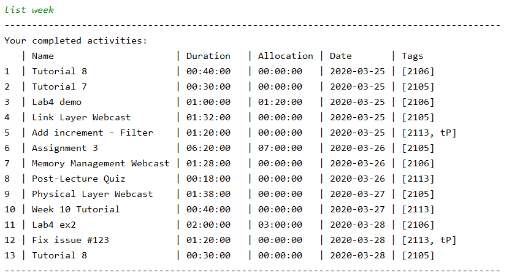

# User Guide

## Introduction

Jikan is a CLI time management tool that allows you to track the amount of time that you spend on different activities. This user guide will show you how to use the program effectively. 

## Quick Start
1. Ensure that you have Java 11 or above installed.
1. Download the latest version of `Jikan` from [here](https://github.com/AY1920S2-CS2113-T15-1/tp/releases).

Features 
=======
## Usage
Jikan lets you record how much time you spend on various activities so that you can easily see what took up the most time today / this week / this month.

To start, record your first activity using the `start ACTIVITY_NAME` command.

Add some tags to your activities to group similar activities together using `/t`.

Add allocated time to your activities using `/a`. Do note that the time allocated for an activity is represent by the target column in the diagram below. (These two words are used interchangeably).
 
When you are done with the activity, or want to move onto something else, tell Jikan to `end` and the Activity time will be recorded and saved to your list.

You can view all your activities using the `list` command. Activities will be shown in this format:

You can also view all your activities over a period of time by using `list` with extra parameters. For example `list week` will return a list of all activities this current week, as shown below.

Filter out the activities you want to see using the `find` or `filter` command. This is our list after filtering out all our activities tagged as `core`. 

To easily see what took up the most of your time, use the `graph` command to view a chart of your activities. 

Now it's clear that lab 3 ex3 took up the most of your time. 

Not done with an activity and want to continue it? Use the `continue` command to continue recording time for a previously started activity.

Finally, when you're done and want to close the app, simply say `bye` and Jikan will exit.

This is just a quick overview of what Jikan can do for you. For more details on each individual command, read the command guide below.

## Usage of Automated Cleaning

As Jikan is a time tracker application which works with various data files (data file for activities, log files for execution history
etc.), over time it can be a mess to deal with these data files especially when they get too big. Thus, Jikan provides automated cleaning
services for such situations.

### Activating the automated cleaning: `clean on | clean log on`
At runtime, users can switch on the automated cleaning services. Once the automated cleaning is activated, the application will
do an auto cleanup of files at the start of every execution until this services is switch off. Do note that the cleaning will only start from the next execution.
(i.e no cleaning will be done for the current execution which activated auto cleaning).

Note: \
`clean on` activates the cleaning of data files where activities are stored. \
`clean log on` activates the cleaning of log files where application execution history is stored.

### Deactivating the automated cleaning: `clean off | clean log off`
At runtime, users can switch off the automated cleaning services. Once deactivated, the application will
stop doing an auto cleanup of files at the start of every execution. Similarly, the changes only applies to the next execution.

Note:\
When the application is executed for the first time, the automated cleaning is deactivated by default and will remain so until it is activated by the user.

### Specifying how much data to clean: `clean /n NUMBER | clean log /n NUMBER`
At runtime, the user can manually set the amount of data to clean using these commands where NUMBER is an integer based on user input. 
Thus, `clean /n 5` will automatically clean the top 5 oldest activities from the activity list upon every startup (assuming automated cleaning
is activated).

Note:\
Default value for NUMBER for data files : 3\
Default value for NUMBER for log files : 10

## Graph Functions

### Graph out all targets and their progress: `graph targets`
Using this command, the user will get a graphical representation of all activities with targets and their progress with respect to 
the allocated time. 

  

## Finding and Filtering Activities

### Finding Activities by Name: `find`
Users can request for a sub-list of activities that has names containing a given keyword to be printed.

Format: `find KEYWORD`

### Filtering Activities by Tags: `filter`
Users can request for a sub-list of activities that has specific tags.

Format: `filter TAGNAME1 TAGNAME2`

### Further Finding/Filtering: `-s`
Users can chain `find` and `filter` commands to generate an even smaller sub-list of activities based on his/her needs. 
This is can be particularly useful when the user wants to generate a `graph`.

This flag applies to `find` and `filter` commands only. 

Format: 
* `filter -s TAGNAME1 TAGNAME2`
* `find -s keyword`

### Adding a to-do: `todo`
Adds a to-do item to the list of to-dos.

Format: `todo n/TODO_NAME d/DEADLINE`

* The `DEADLINE` can be in a natural language format.
* The `TODO_NAME` cannot contain punctuation.  

Example of usage: 

`todo n/Write the rest of the User Guide d/next week`

`todo n/Refactor the User Guide to remove passive voice d/13/04/2020`

## FAQ

## Command Guide

* Start an activity: `start ACTVITY_NAME` 
    * optional: `start ACTIVITY_NAME /a ALLOCATED_TIME /t TAGS`
* Abort an activity: `abort`
* Stop an activity: `end`
* Continue an activity: `continue ACTIVITY_NAME`
* List all activities: `list`
    * List today's activities: `list day` or `list daily`
    * List this week's activities: `list week` or `list weekly`
        * List a specific week's activities by day: `list week DATE` or `list weekly DATE`, 
        where `DATE` is in either `yyyy-MM-dd` or `dd/MM/yyyy` format
    * List this month's activities: `list month` or `list monthly`
        * List a specific month's activities by day: `list month DATE` or `list monthly DATE`, 
        where `DATE` is in either `yyyy-MM-dd` or `dd/MM/yyyy` format
    * List a specific day's activities: `list DATE`, where `DATE` is in either `yyyy-MM-dd` or `dd/MM/yyyy` format
    * List activities within a time frame: `list DATE1 DATE2`, where both `DATE1` and `DATE2` are 
    in either `yyyy-MM-dd` or `dd/MM/yyyy` format
* Edit an activity: `edit ACTIVITY_NAME [flag]`
    * Edit activity name: `edit ACTIVITY_NAME /en NEW_NAME`
    * Edit activity tags: `edit ACTIVITY_NAME /et NEW_TAG1 NEW_TAG2`
    * Edit activity allocated time: `edit ACTIVITY_NAME /ea NEW_ALLOCATED_TIME`
* Delete an activity: `delete ACTIVITY_NAME`
* Find activities with keyword: `find KEYWORD`
    * optional: `find -s KEYWORD` for more specific find
* Filter activities by tags: `filter TAG_NAME`
    * optional: `filter -s TAG1 TAG2` for more specific filter
* Set a goal for tags: `goal TAG_NAME /g DURATION`
* View goals for tags: `goal`
* Display graph by tags: `graph tags`
* Display graph by duration: `graph INTERVAL`
* Display graph by targets: `graph targets`
* Clean data files: `clean [command]`
    * Activate auto data cleaner: `clean on`
    * Activate auto log cleaner: `clean log on`
    * Deactivate auto data cleaner: `clean off`
    * Deactivate auto log cleaner: `clean log off`
    * Specify number of files to clean for data: `clean /n NUMBER`
    * Specify number of files to clean for logs: `clean log /n NUMBER`
* Terminate the program: `bye`
