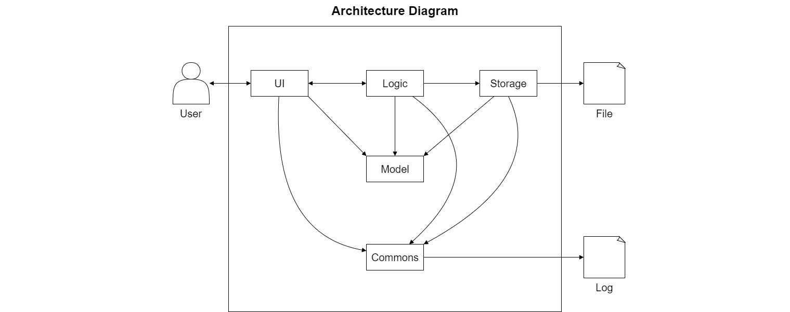
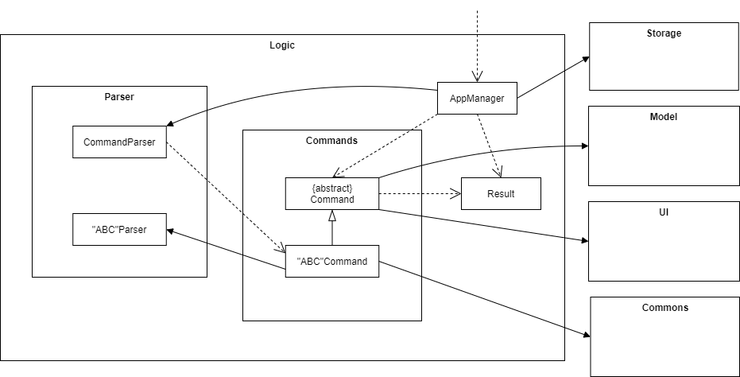
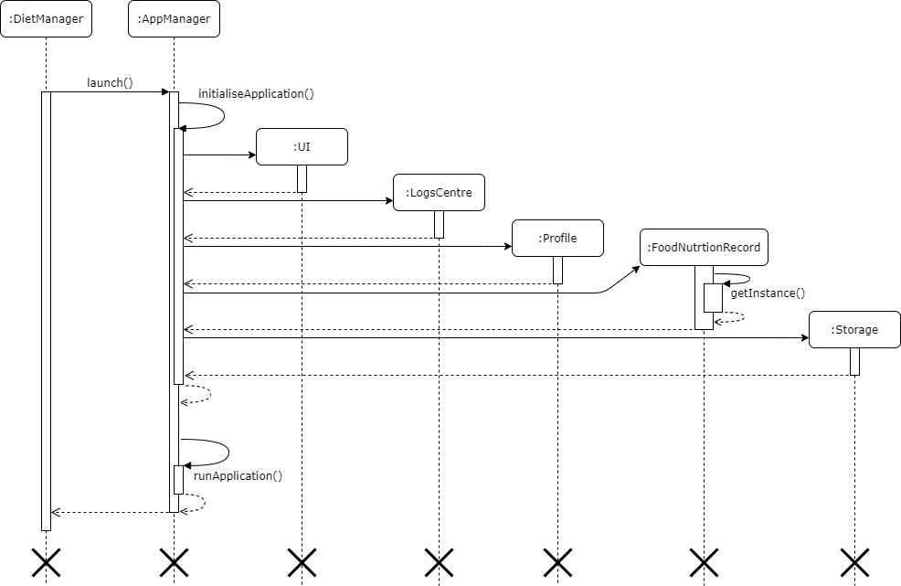
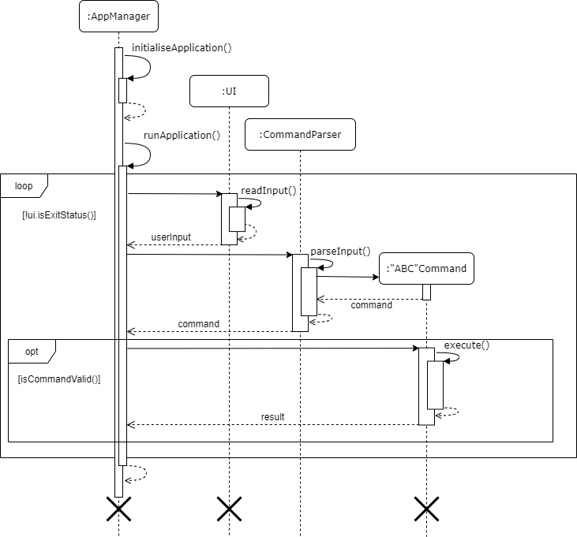

# Tan De Jun (@dejunnn) - Project Portfolio Page

## Content
1. [Overview](#overview)
2. [Summary of Contributions](#summary-of-contributions)
3. [Contributions to the User Guide](#contributions-to-the-user-guide)
4. [Contributions to the Developer Guide](#contributions-to-the-developer-guide)

## Overview

Diet Manager is an personal text-based chat-bot application used for managing an individual's diet.

Diet Manager is capable of tracking daily food intake and providing recommendations depending on a user's specified
health data.

## Summary of Contributions

### Code Contributed

**Diet Manager**: Link to code on tP Code Dashboard 
[**here**](https://nus-cs2113-ay1920s2.github.io/tp-dashboard/#breakdown=true&search=dejunnn).

### Enhancements implemented

Design:
* Designed project structure and workflow, established communication channels.
* Established project architecture, and modular component system for Diet Manager application.
* Designed and implemented Logic Flow for application and component management to promote modularity and extendability.

Commands Implemented:
* Profile: `set-profile`, `profile`, `set-name`, `set-age`, `set-age`, `set-height`, `set-weight-goal`, `set-weight`
* Food Nutrition Record: `list-food`
* Utility: `help`, `exit`

Commands Enhanced:
* Profile: `delete-weight`, `check-weight-progress`, `check-bmi`
* Food Nutrition Record: `addf`, `delf`
* Recipe: `new-recipe`, `show-recipe`
* Daily Food Record: `record-meal`, `check-meal`, `clear-records`, `check-required-cal`, `calculate`

Features Implemented:
* Logging: Established logging feature to track and record system behaviour.
* UI: Established UI structure and MessageBank to store standard system text outputs.
* Storage: Established reading, writing and saving features for data, as well as the creation of data files and directories.
* Parsing: Establish parsing functions to convert user input to machine readable code and prevent erroneous inputs from causing issues or bugs.
* Exceptions: Established the usage of exceptions to provide customised user outputs and improve user experience.

### Contributions to documentation

Established the framework and contributed to most sections of the 
[User Guide](https://ay1920s2-cs2113-t15-4.github.io/tp/UserGuide.html):

Sections wrote:
Introduction, Quick Start, Profile Features, Utility Features, FAQ, Command Summary

Sections enhanced:
Daily Food Record Features, Food Nutrition Record Features, Recipe Features

### Contributions to the DG: 

Established the framework and contributed to most sections of the 
[Developer Guide](https://ay1920s2-cs2113-t15-4.github.io/tp/DeveloperGuide.html):

Sections wrote:

* Design - Architecture, UI component, Storage component, Logic component, Model component, Commons component
* Implementation - Launch Application, Logic Management
* Product Scope - Target user profile, Value proposition
* User Stories, Non-Functional Requirements, Glossary, Instructions for Manual Testing

UML Diagrams drawn and added:

* Design: ArchitectureDiagram.png, UI-Component.png, Storage-Component.png, Logic-Component.png, Model-Component.png
* Implementation -  LaunchApplication.png, LogicFlow.png

### Contributions to team-based tasks 

* Created team organisation and settle administrative duties at start of tP
* Managed all Jar-file releases for team - v1.0, v2.0, v2.1
* Managed product website release, including PPP, User Guide, Developer Guide, Team information page
* Established clear milestones, creating and assigning issues and PRs to these milestones to aid in team progress
* Managed issue tracking, assignments, milestone tracking
* Established proper text-ui-testing and fixed bug experienced with runtest.bat and runtest.sh scripts
* Established proper JUnit testing for the team
* Officially reviewed the following PRs:
[#12](https://github.com/AY1920S2-CS2113-T15-4/tp/pull/12),
[#38](https://github.com/AY1920S2-CS2113-T15-4/tp/pull/38),
[#39](https://github.com/AY1920S2-CS2113-T15-4/tp/pull/39),
[#41](https://github.com/AY1920S2-CS2113-T15-4/tp/pull/41),
[#45](https://github.com/AY1920S2-CS2113-T15-4/tp/pull/45),
[#51](https://github.com/AY1920S2-CS2113-T15-4/tp/pull/51),
[#112](https://github.com/AY1920S2-CS2113-T15-4/tp/pull/112),
[#117](https://github.com/AY1920S2-CS2113-T15-4/tp/pull/117),
[#123](https://github.com/AY1920S2-CS2113-T15-4/tp/pull/123),
[#135](https://github.com/AY1920S2-CS2113-T15-4/tp/pull/135),
[#140](https://github.com/AY1920S2-CS2113-T15-4/tp/pull/140),
[#143](https://github.com/AY1920S2-CS2113-T15-4/tp/pull/143),
[#145](https://github.com/AY1920S2-CS2113-T15-4/tp/pull/145),
[#149](https://github.com/AY1920S2-CS2113-T15-4/tp/pull/149),
[#166](https://github.com/AY1920S2-CS2113-T15-4/tp/pull/166)
* Unofficially reviewed many other PRs and provided recommendations and feedback to team members on external communication channels

### Contributions beyond the project team

* Participated actively in Forums. Opened 2 issues,
[#65](https://github.com/nus-cs2113-AY1920S2/forum/issues/65),
[#105](https://github.com/nus-cs2113-AY1920S2/forum/issues/105),
and contributed to many more forum posts, either asking for help, clarifying certain doubts or trying to help other students.
* Helped to report 15 bugs during [Practical Exam Dry Run](https://github.com/dejunnn/ped)
* Provided useful feedback to groups and classmates during DG/UG review, as well as during code reviews.
* Assisted classmates from group AY1920S2-CS2113-T15-4, helping them figure out certain bugs, as well as teaching them how to implement certain functions.
    * Helped member #1 with implementing Storage and Logging features, and fix certain bugs with their application.
    * Helped member #2 with running JUnit tests, how to check coverage and fix certain bugs with their application.
    * Helped member #3 with text-ui-testing and with certain bugs with their application, as well as other questions and clarifications.

## Contributions to the User Guide

---

## 1 Introduction

Diet Manager is an personal text-based chat-bot application used for managing an individual's diet.

Diet Manager is capable of the following functions:
* Profile -uses a user's profile information to personalise diet recommendations.
* Daily Food Record - record and store daily food intake.
* Food Nutrition Record - record and store food caloric information.
* Recipe Generator - generates a recommended recipe depending on a user's profile information.

## 2 Quick Start

* Ensure that you have Java 11 or above installed in your Computer. <br>
* Download the latest version of DietManager-2.1.0.jar [here](https://github.com/AY1920S2-CS2113-T15-4/tp/releases). <br>
* Open and run the jar file by entering the following command in Windows PowerShell or Git Bash:

        java -jar DietManager-2.1.0.jar

* The application will first search for a data directory to store all relevant data files. <br>
* If no `data` directory is found, it will create a new `data` directory.

        INFO: New Directory created: data

* Next there are 4 data files that the application will search for. If any of these files are present,
the application will read and load the data from these files. Otherwise, it will create new data files
to store the relevant information.
    * profile
    
            INFO: No existing Profile found, new file created: profile.txt
            
    * food-nutrition-record
            
            INFO: No existing Food Nutrition Record found, new file created: food-nutrition-record.txt
            
    * recipe
    
            INFO: No existing Recipe file found, new file created: recipe.txt
            
    * daily-food-record
    
            INFO: No existing food record file found, new file created: daily-food-record.txt


* The application is now ready to be used by entering text-based commands into the command line

*Note that most command features are locked until a valid profile has been created. 
Only the `set-profile`, `help` and `exit` commands are usable upon first start-up*

      
        Please create a profile before using this command. Enter:
        set-profile {name} {age} {gender} {height} {weight} {weight goal}
   
## 3 Features 

Note that:
* Name is restricted to strings with no spaces.
* Food-Name is restricted to strings with no spaces.
* Age is restricted to whole numbers only.
* Gender is restricted to "male" or "female". Input is case-insensitive.
* Height has units in centimetres.
* Weight has units in kilograms.
* Calories has units in calories.
* Date is restricted to days in a week - SUNDAY to SATURDAY. Input is case-insensitive.
* Time-Period is restricted to MORNING, AFTERNOON, NIGHT. Input is case-insensitive.
* Activity-Level is restricted to LOW, MODERATE, HIGH. Input is case-insensitive.

## 3.1 Profile Features

### Set user profile
Creates a new profile

Format: `set-profile NAME AGE GENDER HEIGHT WEIGHT WEIGHTGOAL`

* If profile doesn't exist, the command will generate a new profile.
* If profile already exist, the command will overwrite the current profile and generate a new profile.

Example of usage:

`set-profile John 20 male 180 80 75`

* Expected Outcome:

    ```
    Your profile has been successfully updated.
    ```

### View user profile
View user profile details

Format: `profile`

* If profile information is present, displays it to the user.

Example of usage: 

`profile`

* Expected Outcome:

    ```
    Your profile information are as follows:
    Name:         John
    Age:          20 years old
    Gender:       male
    Height:       180.00 centimetres
    Weight        80.00 kilograms
    Weight Goal:  75.00 kilograms
    ```

## 4 FAQ

**Q**: What do I do if the application cannot be launched? 

**A**: Ensure that you have Java 11 and above installed on your device, 
and that you have the most updated version of the application.

**Q**: How do I transfer my data to another device? 

**A**: All recorded user-related data will be stored in a folder when running the application. 
Simply copying and moving that specific folder would be sufficient.

**Q**: What if I want to use this application for multiple users on the same device? 

**A**: The application is localised and user data is dependent on the specific data files present.
Simply switch the data files to that of another user, or have multiple folders present for multiple users.

**Q**: Can I directly change the data in the data files? 

**A**: You can, but it is strongly discouraged as it could lead to the data file being corrupt and the application
being forced to delete the data file and create a new one.

---

## Contributions to the Developer Guide

Below are short snippets of my contributions to the Developer Guide. I am unable to include more due to the page constraints.

---

### Architecture



The Architecture Diagram given above explains the high-level design of the Diet Manager Application.

The components involved are given below:

* `UI`: The Component responsible for reading user input and displaying command results.

* `Storage`: The Component responsible for reading, writing and saving of external data files.

* `Logic`: The Component responsible for managing the logic flow of the application and executing commands.

* `Model`: The Component responsible for storing information required by the application in-memory.

* `Commons`: A collection of classes used by multiple other components.

### Logic component



The `Logic` component is responsible for:
* Establishing the logic flow.
* Deciding how functional components interact with each other.

### Launch Application



#### Implementation

Upon startup of Diet Manager:
 1. `AppManager.launch()` is called.
 2. `AppManager` then constructs the relevant object required for the application to function. 
 These objects include, in the order of construction:
    * `UI` - User Interface functions
    * `LogsCentre` - Logging and system tracking functions
    * `Profile` - Holds user profile data in-memory
    * `FoodNutritionRecord` - Holds food nutrition data in-memory
    * `Storage` - Prepares data files for reading, writing and saving of information
 3. Once the objects have been created, `Storage` then loads any current data from data files (if any)
 into local memory for the application to access. If no data files are found, `Storage` creates new data
 files for future storage.
 4. All relevant components have now been initialised and the application is ready to be run.

#### Design and Enhancements

The modular system of initialising the application serves several purposes:
1. Reducing coupling and dependence between essential components upon startup
2. Aid in debugging by isolating the components
3. Future enhancements which might include the construction of additional components

This implementation can be further enhanced by further abstracting initialisation of different components,
which would be useful in the future when more components are added to enhance this application.

### Logic Management



#### Implementation

The logic flow of DietManager was intentionally made to be modular in design, and allow AppManager
to be the sole handler of all logic-based executions.

Upon running the application:
1. A check is done for the `ui.exitStatus()` of the application, and exits the loop if the user entered
 the exit command during the previous iteration.
2. `UI` calls `readInput()` to read in user input.
3. The String value of user input then gets passed back to `AppManager`.
4. The String value then gets parsed through `CommandParser` to generate a specific `Command`.
5. This command will then be passed back to `AppManager`.
6. `AppManager` checks if the command is valid using `isCommandValid()`.
7. If the command is valid, AppManger executes the command using `execute()`.
8. The command `Result` then gets returned to `AppManager`, where it will be displayed to the user.
9. The loop then continues, from steps 1 to 9.
10. If the user exits the application, the application will terminate and all created components will be destroyed.

#### Design and Enhancements

The modular system of running the application serves several purposes:
1. Reducing coupling and dependence between essential components upon startup
2. Aid in debugging by isolating the components
3. Future enhancements which might include the construction of additional components

The design of AppManager was done to prevent the possibility of errors occurring in multiple components
due to potential bugs, and narrows down the scope of potentially flawed components. 

This aids in testing and debugging of the application, as well as leaves space for future enhancements,
by allowing other components to interact with the application without having to change multiple different
 components to achieve this. This allows for greater accessibility and modularity.
 
 This implementation can be further enhanced by abstracting the logic flow of different components into
 separate classes. Thus each individual class will be responsible for the logic management of a particular component
 thus would allow for more modularity, testability and expandability.

---