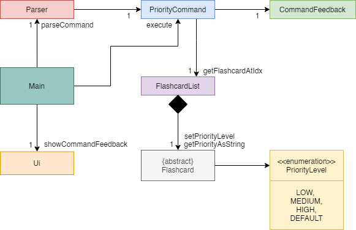

# Guo Lilian - Project Portfolio
## PROJECT: History Flashcard
## Overview
History Flashcard (HF) is an app for history students to create flashcards which summarize the 
most important information for historical events, figures and artifacts. 
HF is optimized for those who prefer to use a simple Command Line Interface (CLI), and includes 
features that help with memory retention and make information convenient to review.

## Summary of Contributions
- **Code contributed**: 
[Link](https://nus-cs2113-ay1920s2.github.io/tp-dashboard/#=undefined&search=g-lilian) 
to my code on tp code dashboard.

- **Enhancements implemented**:
    1. Mark flashcards as reviewed
       - Description: Allows the user to input `reviewed INDEX` to change a flashcard's review
       status to reviewed. This is so that users can keep track of which flashcards
       are already reviewed, in order to better plan their revision.
       - Highlights: This feature involved adding another variable to the abstract `Flashcard` 
           class to keep track of each flashcard's review status and modifying `Ui` 
           to display the review status alongside the flashcard name/descriptions.
    2. Assign priority to flashcards and list flashcards of a certain priority
       - Description: Allows the user to input `priority INDEX PRIORITY_LEVEL` to assign a 
       flashcard's priority level, and `list-priority PRIORITY_LEVEL` to list only flashcards with 
       the specified priority. Knowing the relative importance of a flashcard helps users decide 
       on which flashcards to review first.
       - Highlights: An enum was created for priority level to restrict the input argument to 
           `LOW`, `MEDIUM`, `HIGH`, or `DEFAULT`. The implementation was complicated by the need 
           to handle exceptions for incorrect input format.
    3. Show the details of a flashcard
       - Description: Allows the user to input `show INDEX` to display all fields of a flashcard, 
       so that they can review its specific details.
    4. List all existing groups
       - Description: Allows the user to input `show-groups` to display all existing groups. 
       After creating groups, users should be able to view them.
    5. List flashcards from a specific group
       - Description: Allows the user to input `list-group INDEX/GROUPNAME` to display all flashcards 
       belonging to a group. After creating groups, users should be able to list the flashcards present in a group.
       - Highlights: This implementation was complicated by the option to list based on either group name or 
          the group's index in the group list.
    6. List restricted timeline
       - Description: Allows the user to input `timeline [STARTDATE] [ENDDATE]` to display a sorted 
       list of existing flashcards belonging to a restricted period of time. This is so that 
       users can easily identify flashcards from a certain period for review.
       - Highlights: Additional considerations were required for `STARTDATE` and `ENDDATE` to be included as 
          optional parameters without affecting the function of `timeline` when inputted as a 
          standalone command.
    7. [Bug fix] Prevented users from entering start dates which are later than end dates when creating 
       flashcards or using the timeline command. 
       [Link to PR #188](https://github.com/AY1920S2-CS2113-T14-1/tp/pull/188)

- **Contributions to team-based tasks**:
   - Helped maintain the issue tracker
   - Modified Ui messages for various commands (`help`, study plan commands) to be more precise e.g. in 
   [PR #129](https://github.com/AY1920S2-CS2113-T14-1/tp/pull/129)
- **Non-feature-specific contributions to the user and developer guides**:
   - Added user stories for v2.0/2.1, product scope, and non-functional requirements to the DG
   - Added skeleton of commands and revised command formats in the UG
   - Updated UG headers and added navigator links at the top
- **Community contributions**:
   - PRs reviewed (with non-trivial review comments): 
   [#183](https://github.com/AY1920S2-CS2113-T14-1/tp/pull/183) 
   [#181](https://github.com/AY1920S2-CS2113-T14-1/tp/pull/181) 
   [#180](https://github.com/AY1920S2-CS2113-T14-1/tp/pull/180) 
   [#166](https://github.com/AY1920S2-CS2113-T14-1/tp/pull/166) 
   [#134](https://github.com/AY1920S2-CS2113-T14-1/tp/pull/134) 
   [#121](https://github.com/AY1920S2-CS2113-T14-1/tp/pull/121) 
   [#94](https://github.com/AY1920S2-CS2113-T14-1/tp/pull/94)
   - Forum discussions: 
   [#69](https://github.com/nus-cs2113-AY1920S2/forum/issues/69) 
   [#70](https://github.com/nus-cs2113-AY1920S2/forum/issues/70)

## Contributions to the User Guide
My feature-specific contributions to the User Guide are reproduced below:

#### Showing a Flashcard: `show`

Shows all fields from the flashcard at the specified index in the list.

Format: `show INDEX`

- The `INDEX` must be in a valid number format.

Example of usage:

`show 3`

#### Assigning Priority to a Flashcard: `priority`

Assign Priority Level `LOW`, `MEDIUM`, `HIGH` to the flashcard at the specified index.

Format: `priority INDEX PRIORITY_LEVEL`

- `INDEX`: must be in a valid number format
- `PRIORITY_LEVEL`: must be one of `LOW`, `MEDIUM`, `HIGH`, `DEFAULT`

Example of usage:

`priority 2 MEDIUM`

#### Listing Flashcards of a Specified Priority: `list-priority`

Lists all flashcards which match the specified priority level.

Format: `list-priority PRIORITY_LEVEL`

- `PRIORITY_LEVEL`: must be one of `LOW`, `MEDIUM`, `HIGH`, `DEFAULT`

#### Marking Flashcard as Reviewed: `reviewed`

Marks a flashcard at the specified index as reviewed.

Format: `reviewed INDEX`

- `INDEX`: must be in a valid number format

Example of usage:

`reviewed 1`

#### Displaying groups: `show-groups`

Lists all existing groups.

Format: `show-groups`

#### Listing flashcards in a group: `list-group`

Lists all flashcards in a group specified by GROUP_ID.
GROUP_ID can be the index of the group in the list generated by `show-groups`, or simply
the name of the group.

Format: `list-group GROUP_ID`

## Contributions to the Developer Guide
Features I described in the Developer Guide are reproduced below:

#### Set Priority Feature - Proposed Implementation

The Set Priority feature allows users to mark a flashcard with a specified priority level. The priority level is
then reflected when the user requests a list of existing flashcards.

`PriorityLevel` is stored as an enum with four fields: LOW, MEDIUM, HIGH and DEFAULT.

The feature implements the following operations:

- `Flashcard#setPriorityLevel()` - Sets a flashcard to a specified priority level (LOW/MEDIUM/HIGH).
- `Flashcard#getPriorityAsString()` - Return an icon indicating the flashcard's priority level.

The following class diagram shows the structures relevant to the Set Priority feature:

Given below is an example usage scenario and how the set priority mechanism behaves at each step.

Step 1. The user launches the application and creates a new `Flashcard` (of type Event, Person, or Other), 
with a default priority level of DEFAULT.

Step 2. The user executes `priority [flashcard index] [priority level]` command and the `setPriorityLevel` 
operation is invoked. Subsequently, the flashcard of specified index is retrieved from the main `FlashcardList` 
instance. Its priority level is set to the specified priority.

The following sequence diagram shows the relevant interactions behind `setPriorityLevel`:

