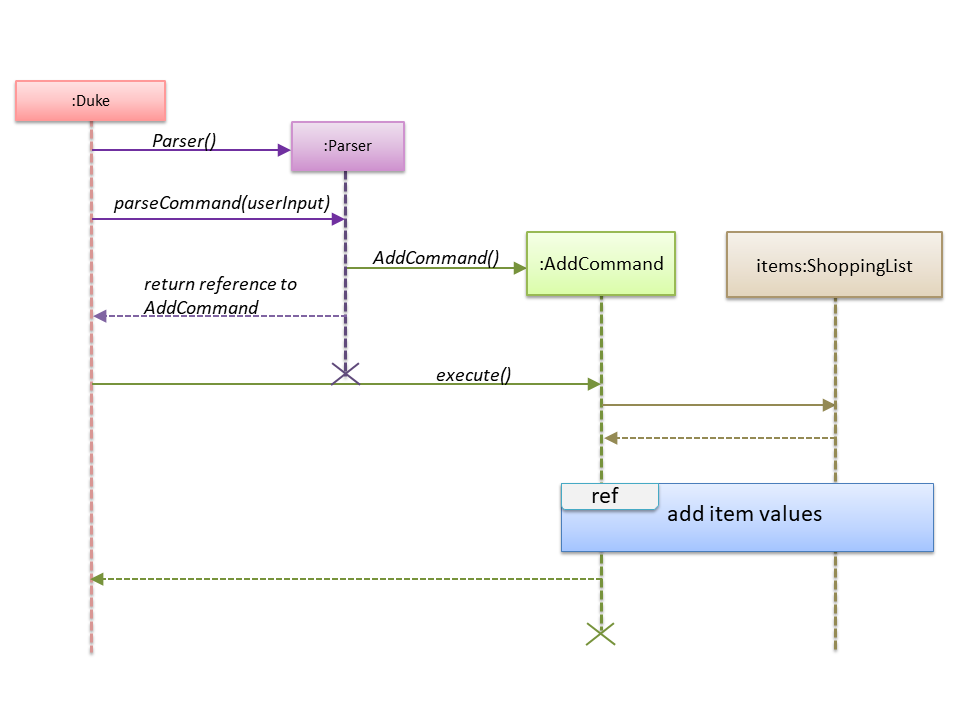
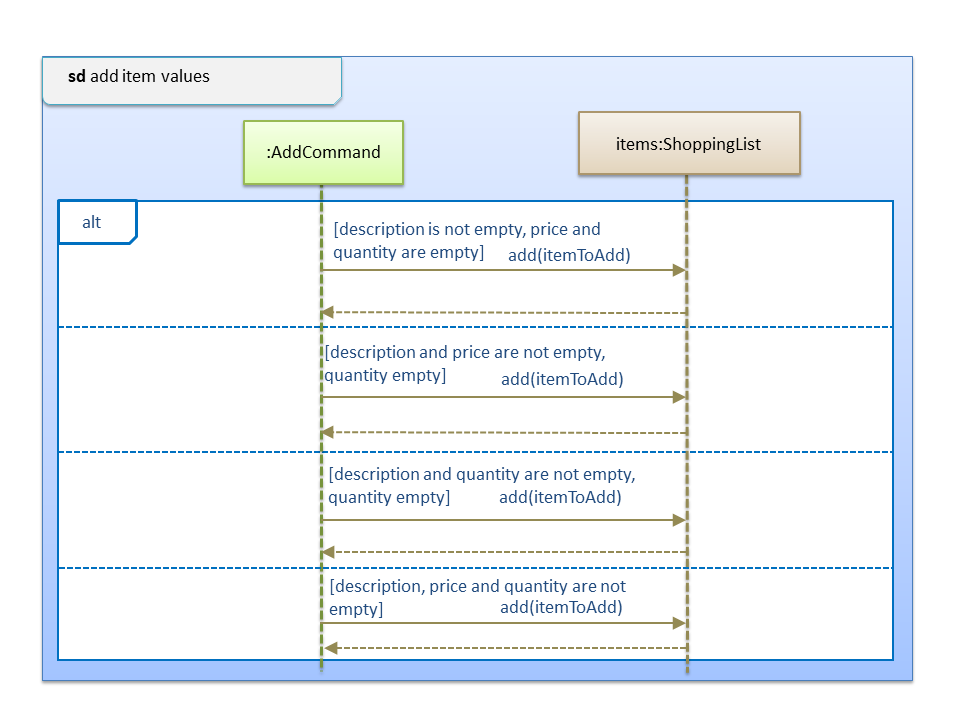

<!-- @@author jiajuinphoon -->
# JiaJuinPhoon - Project Portfolio
# PROJECT: SHOCO 

## Overview

SHOCO is a desktop application used for the managing and planning of shopping lists and budget. 
Users interact with it through the use of a command-line interface (CLI) and the program is written in Java.

### Summary of Contributions

* **Major enhancement:** Included the **ability to add items** in the shopping lists.
    * What it does: Allows the user to add values of the items in the shopping list. Such values are the description, price and quantity of the item.
    * Justification: This feature allows the user to immediately add any items into the list.  
    * Highlights: This features allows the user to add any value. The add command does not require any order in it's input (e.g alphabetical ordering of delimiters).

* **Minor enhancement:** Negative values entered for price and quantity are not accepted. Also, quantity does not accept values with pointer. This is for a realistic approach as items will never have negative prices and/or quantities in real life. 

* **Code contributed:** [[Functional code]](https://nus-cs2113-ay1920s2.github.io/tp-dashboard/#search=jiajuinphoon&sort=groupTitle&sortWithin=title&since=2020-03-01&timeframe=commit&mergegroup=false&groupSelect=groupByRepos&breakdown=false&tabOpen=true&tabType=authorship&tabAuthor=jiajuinphoon&tabRepo=AY1920S2-CS2113T-T13-1%2Ftp%5Bmaster%5D)

* **Other contributions:** 
    * Project Management:
        * Finish assigned bugs and PRs by the team member as soon as possible to increase the efficiency for them to implemen other feature.
    
    * Enhancements to existing features:
        * Fixed the error in the Logger <ins>[#82](https://github.com/AY1920S2-CS2113T-T13-1/tp/pull/82/files)</ins>
    * Documentation:
        * Wrote the Development Guide for Add Function: <ins>[#116](https://github.com/AY1920S2-CS2113T-T13-1/tp/pull/116/files)</ins> 
        * Wrote the User Guide for Add Function: <ins>[#116](https://github.com/AY1920S2-CS2113T-T13-1/tp/pull/116/files)</ins>
   
    * Community:
        * Fixed the bug in the reposense when the system did not distribute the parts properly (Eg: User A wrote a part for Development Guide but did not detect by the system.) <ins>[#130](https://github.com/AY1920S2-CS2113T-T13-1/tp/pull/130/files)</ins> 
       

### Contributions to the User Guide
> *Below are sections that I have contributed to the User Guide. They showcase my ability to write documentation targeting end-users.*

### Adding an item: `ADD`
Add the specified item in the shopping list.

Format: `ADD i/DESCRIPTION [p/PRICE] [q/QUANTITY]`

* The `DESCRIPTION` must exist.
* The `[QUANTITY]` must be a **positive integer**. *e.g 1, 2, 3 ..*
* The `[PRICE]` must be in **numerical** form (decimal form accepted).
* `[PRICE]` and `[QUANTITY]` are optional values, user can choose to provide the 
  respective values or omit them. The system will set the price and quantity to 
  the default values `0.0` and `1` 
* note that you can rearrange the delimiters (more will shown in the example.)

Example of usage: 

1. `ADD i/potato p/5.00 q/3` **OR** `ADD p/5.00 q/3 i/potato`
    * Add the description, price and quantity of this item in the shopping list
    
2. `ADD i/potato chips p/5.00`  **OR**  `ADD i/potato chips q/2` **OR** `ADD p/5.00 i/potato chips` 
   **OR** `ADD q/5 i/potato chips`
    * Add the description and price /  description and quantity /  of the item in the shopping list
    
3. `ADD i/potato chips` 
    * Add only description of the item in the shopping list

&nbsp;

---

### Contributions to the Developer Guide
> *Below are sections that I have contributed to the User Guide. They showcase my ability to write documentation targeting end-users.*
 
&nbsp;

### 3.1 Add feature
#### 3.1.1 Current implementation
 
 The add feature is implemented using an <code>AddCommand</code> class. This class extends from the main
 <code>Command</code> class. The user input **must contain at least a description** out of these parameters: 
 *description*, *price*, *quantity*. User can choose not to input price or quantity as the price will set to 
 default which is 0.0 if the user did not input any value for price. On the other hand, quantity will set to 
 default which is 1 if the user did not input any value for quantity. 
 
 Process of object creation:
 1. <code>Duke</code> class receives user input from the <code>Ui</code> class. 
 2. A <code>Parser</code> object is created to call its <code>parseCommand</code> method.
     * The <code>Parser</code> object instantiates an <code>AddCommand</code> object based on the user input.
 3. The <code>Duke</code> class calls the <code>AddCommand#execute</code> method of the <code>AddCommand</code> object.
 4. In the <code>AddCommand#execute</code> function, the <code>item</code> to be add is called from the <code>ShoppingList</code> 
    object, using items.add().
 5. In the SD, the AddCommand will add <code>item</code> if the description is provided and one / both price and 
    quantity is provided. 
 6. The <code>item</code> object with its' values is stored into the <code>ShoppingList</code> object.
 
 The following sequence diagram below shows how the add feature works. The details of the adding item's values
 are shown in a separate sequence diagram below:
 
 
 
 
 
#### 3.1.2 Design considerations

##### Aspect: Data structure to support the add feature

- Alternative 1 (current choice): User must provided a description for item, Duplicates are
                                  not allowed in the list. 
  - Pros: User has minimal potential to see unreasonable list in the Shopping List. For 
  example, having a item that has only price and quantity but without description and also
  a list that one item is recorded multiple times in the list.
  
  - Cons: Will significantly increase the code base as there is a need to check for the 
  presence of the variable in user input to avoid duplication, not human friendly in certain 
  scenario (eg: user wants to have duplicates because the item is for different occasion and 
  the user wants to record down twice without any elaboration).

- Alternative 2: Require user to provide all three values to successfully add the item into 
                 the list. Duplicates are allowed

  - Pros: User will have a neat and unity Shopping list, less deal with parameter (because users are
  forced to give all three variables). And the duplicates item are useful in certain specific condition.
  
  - Cons: User flexibility will decrease, because user must input all parameters even if he/she does not want to 
  provide certain variables such as price and quantity, which will result unsuccessful adding items into the list. 
  Also, duplicate items may confused the user, even though in some specific scenario, duplicate item may be useful to 
  the user.  
 
 Reasons for choosing Alternative 1 over alternative 2: By allowing user to just add the item without price,
 we can increase the flexibility. For instance, the user wants to buy milk but not sure how much does the milk
 cost and not sure how many milk they want to buy. So they can just add it into the list,
 and edit the price and quantity later when they knew the price and have decided the quantity. 

&nbsp;

<!-- @@author -->
