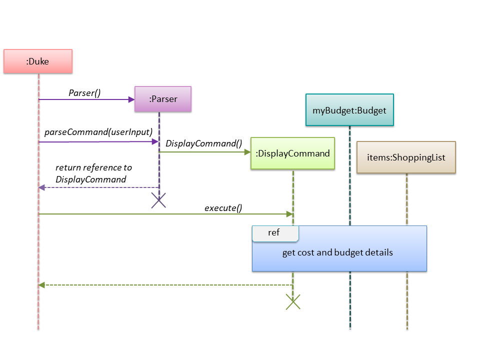
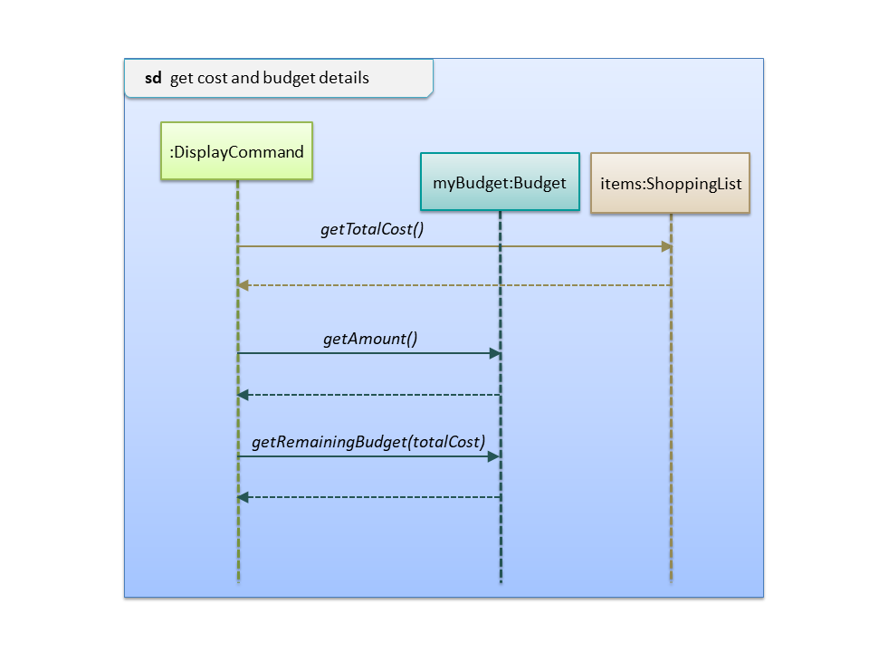

<!-- @@author JLoh579 -->
# Loh Ching Wei, Joshua - Project Portfolio 

## PROJECT: SHOCO

## Overview

SHOCO is a Command Line Interface (CLI) application used to manage shopping lists and related information.
It is written in Java and has about 4 kLoC.

## Summary of Contributions

- **Major enhancements:**
    - Added the ability to display user-entered data to the user
        - What it does: Shows the shopping list and its associated information, including price, quantity, total cost 
        and remaining budget, to the user.
        - Justification: This allows the user to see the current state of the information that he/she has added. 
        This helps the user make decisions easily, and is vital to the app's functioning.
        - Highlights: Much thought was needed to ensure the information was displayed in a clear and intuitive way.
        
    - Added store and load functionality
        - What it does: Stores changes to disk and loads the saved data upon start-up.
        - Justification: This allows the app to be useful between different runs, as it can remember previously 
        entered information. Without this, all work is lost upon program termination.
        - Highlights: I had to spend some time learning how to use GSON to implement this enhancement as I was new to it. 
        - Credits: As mentioned, this enhancement uses the open-source library GSON.
        I learned how to use GSON with the help of Zong Wei, a friend who had done this module last semester. 
        
- **Minor enhancement:**
    - Added the ability to clear the shopping list
        - Justification: Gives the user a quick way to start afresh.
        
- **Code contributed:** [[Functional code](https://nus-cs2113-ay1920s2.github.io/tp-dashboard/#search=jloh579&sort=groupTitle&sortWithin=title&since=2020-03-01&timeframe=commit&mergegroup=false&groupSelect=groupByRepos&breakdown=false)]

- **Other contributions:**
    - Project management: 
        - Closed v2.0 milestone on GitHub
        - Managed v2.0 release on GitHub
    - Documentation:
        - Added sections for display and clear command in the User Guide and Developer Guide (Pull request [#120](https://github.com/AY1920S2-CS2113T-T13-1/tp/pull/120))
        - Added user stories in the Developer Guide (Pull request [#120](https://github.com/AY1920S2-CS2113T-T13-1/tp/pull/120))
    - Community:
        - Pull requests reviewed (with non-trivial review comments): [#35](https://github.com/AY1920S2-CS2113T-T13-1/tp/pull/35), [#70](https://github.com/AY1920S2-CS2113T-T13-1/tp/pull/70),
        [#121](https://github.com/AY1920S2-CS2113T-T13-1/tp/pull/121))
        - Reported bugs and suggestions for other teams in the class (examples: [Incorrect example in UG](https://github.com/JLoh579/ped/issues/2), 
        [Program crash](https://github.com/JLoh579/ped/issues/5), [Missing feature](https://github.com/JLoh579/ped/issues/12))
        
## Contributions to the User Guide
> *Given below are sections I contributed to the User Guide. 
They showcase my ability to write documentation targeting end-users.*

### Displaying list and budget details: `DISPLAY`
Shows the shopping list, budget, cost of the items and the remaining budget.

Format: `DISPLAY` 

### Clearing the list: `CLEAR`
Clears all items in the shopping list. Automatically resets remaining budget to the user’s set budget.

Format: `CLEAR`

## Contributions to the Developer Guide
> *Given below are sections I contributed to the Developer Guide. They showcase my ability to write technical 
documentation and the technical depth of my contributions to the project.*

### 3.6 Display feature
This feature involves displaying the shopping list and budget details to the user.
#### 3.6.1 Current implementation

The display feature is implemented using a <code>DisplayCommand</code> class which extends the <code>Command</code> 
class. 
 
 The process is as follows:
1. <code>Duke</code> receives user input from <code>Ui</code>.
2. <code>Duke</code> calls <code>Parser#parseCommand()</code> to instantiate a <code>DisplayCommand</code> object based
on that user input.
3. <code>Duke</code> then calls <code>DisplayCommand#execute()</code>.
4. <code>DisplayCommand#execute()</code> makes a call to <code>ShoppingList#getTotalCost()</code> to find the cost of
the items.
5. <code>DisplayCommand#execute()</code> then calls  <code>Budget#getAmount()</code> and
<code>Budget#getRemainingBudget()</code>  to find the current budget and the remaining budget. 
6. The results are then printed to console.

The following sequence diagrams below show how the display feature works. Note the <code>Ui</code> class is
omitted to emphasise the other classes:

#### 3.6.2 Design considerations
##### Aspect: Data structure to support the display feature

- Alternative 1 (current choice): Object-oriented style with a separate class for <code>DisplayCommand</code>
 
  - Pros: Easy to add the display feature without having to change the logic of the code much as each command object
  is treated as a black box
  
  - Cons: Might significantly increase the code base with another class being added

- Alternative 2: Implement display feature in the <code>Duke</code> class

  - Pros: Will have less code to deal with as a new function is simply created in the <code>Duke</code> class
  
  - Cons: Handling the command under the <code>Duke</code> class results in longer methods. Thus, the code becomes 
  harder to navigate and understand. 
    
- Reason for choosing alternative 1: With each command type having its own class, we could work better in parallel and
also be able to trace functionality bugs more easily if each command class deals with its own functionality.

### 3.9 Clear list feature
 This feature involves clearing all items in the shopping list. Remaining budget is also set to the user’s set budget.
 
 #### 3.9.1 Current implementation
 The clear list feature is implemented using a <code>ClearCommand</code> class which extends the <code>Command</code> 
 class. 
 
  The process is as follows:
 1. <code>Duke</code> receives user input from <code>Ui</code>.
 2. <code>Duke</code> calls <code>Parser#parseCommand()</code> to instantiate a <code>ClearCommand</code> object based on that user input.
 3. <code>Duke</code> then calls <code>ClearCommand#execute()</code>.
 4. <code>ClearCommand#execute()</code> makes a call to <code>ShoppingList#clearList()</code>.
 
 The following sequence diagram below shows how the clear list feature works. Note the <code>Ui</code> class is
 omitted to emphasise the other classes:
   
 
   
 #### 3.9.2 Design considerations
   
 ##### Aspect: Data structure to support the clear list feature
   
 - Alternative 1 (current choice): Object-oriented style with a separate class for <code>ClearCommand</code>
  
   - Pros: Easy to add the clear list feature without having to change the logic of the code much as each command object
   is treated as a black box
   
   - Cons: Might significantly increase the code base with another class being added
 
 
 - Alternative 2: Implement clear list feature in the <code>Duke</code> class
 
   - Pros: Will have less code to deal with as a new function is simply created in the <code>Duke</code> class
   
   - Cons: Handling the command under the <code>Duke</code> class results in longer methods. Thus, the code becomes 
   harder to navigate and understand. 
   
 - Reason for choosing alternative 1: With each command type having its own class, we could work better in parallel and
 also be able to trace functionality bugs more easily if each command class deals with a different functionality.

<!-- @@author -->
