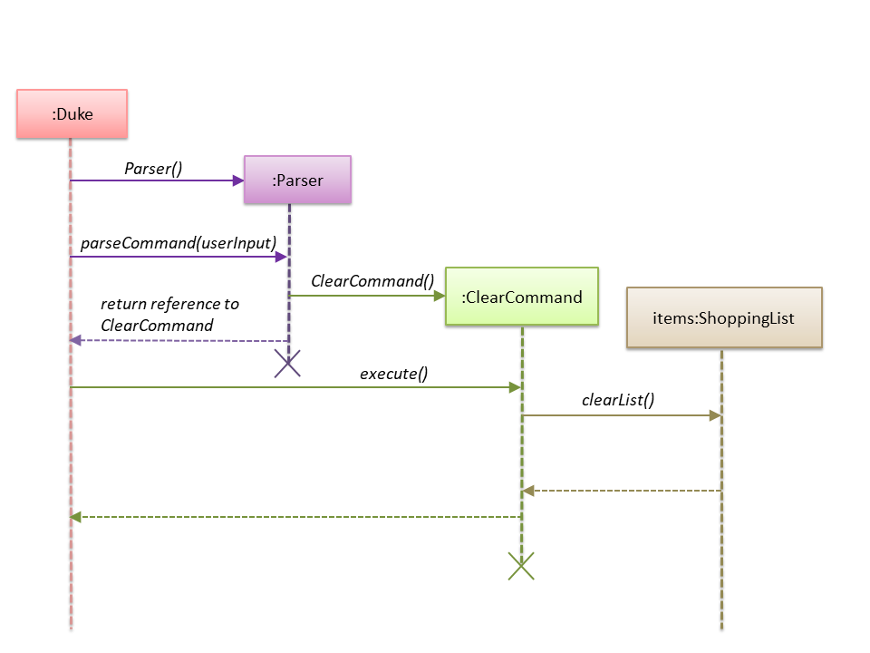

<!-- @@author JLoh579 -->
# Loh Ching Wei, Joshua - Project Portfolio 

## PROJECT: SHOCO

## Overview

SHOCO is a Command Line Interface (CLI) application which allows users to manage their shopping lists and 
budget information. 
It is written in Java and has about 5 kLoC.

## Summary of Contributions

- **Major enhancements:**
    - Added the ability to provide an overview of list and budget details 
        - What it does: Shows the shopping list and its associated information, including price, quantity, total cost 
        and remaining budget, to the user.
        - Justification: This allows the user to see the current state of the information that he/she has added. 
        This helps the user make decisions easily, and is vital to the app's functioning.
        - Highlights: Consideration was needed to ensure the details are shown in a clear and intuitive way.
        
    - Added store and load functionality
        - What it does: Stores changes to disk and loads the saved data upon start-up.
        - Justification: This allows the app to be useful even after closing and re-opening. Without this, all work
        is lost upon closing the program.
        - Highlights: I had to spend some time learning how to use GSON to implement this enhancement as I was new to it. 
        - Credits: As mentioned, this enhancement uses the open-source library GSON.
        I learned it quickly with the help of Chua Zong Wei, a friend who had done this module last semester. 
        
- **Minor enhancement:**
    - Added the ability to clear the shopping list
        - Justification: Gives the user a quick way to start afresh.
        
- **Code contributed:** [[Code](https://nus-cs2113-ay1920s2.github.io/tp-dashboard/#breakdown=true&search=jloh579&sort=groupTitle&sortWithin=title&since=2020-03-01&timeframe=commit&mergegroup=false&groupSelect=groupByRepos)]

- **Other contributions:**
    - Team-based tasks:
        - Made pull request for our team's repo ([#15](https://github.com/nus-cs2113-AY1920S2/tp/pull/15))
        - Managed release of v2.0 and v2.1 on GitHub ([Releases](https://github.com/AY1920S2-CS2113T-T13-1/tp/releases))
        - Simplified code for exiting the program, and for returning results of commands (Pull request [#73](https://github.com/AY1920S2-CS2113T-T13-1/tp/pull/73))
    - Documentation:
        - Added sections for display and clear command in the User Guide and Developer Guide (Pull request [#120](https://github.com/AY1920S2-CS2113T-T13-1/tp/pull/120))
        - Refine documentation by ensuring consistent spacing between sections, re-ordering sections so they flow 
        better, etc. (Pull request [#215](https://github.com/AY1920S2-CS2113T-T13-1/tp/pull/215))
    - Community:
        - Pull requests reviewed (with some review comments): [#35](https://github.com/AY1920S2-CS2113T-T13-1/tp/pull/35), [#70](https://github.com/AY1920S2-CS2113T-T13-1/tp/pull/70),
        [#121](https://github.com/AY1920S2-CS2113T-T13-1/tp/pull/121)
        - Reported bugs for another team in the class (Issues [#1 - #13](https://github.com/JLoh579/ped/issues))

## Contributions to the Developer Guide
> *Given below are sections I contributed to the Developer Guide. They showcase my ability to write technical 
documentation and the technical depth of my contributions to the project.*

### 3.2 Display feature
This feature involves displaying the shopping list and budget details to the user.
#### 3.2.1 Current implementation

The display feature is implemented using a <code>DisplayCommand</code> class which extends the <code>Command</code> 
class. 
 
The process is as follows:
1. <code>Duke</code> receives user input from <code>Ui</code>.
2. <code>Duke</code> calls <code>Parser#parseCommand()</code> to instantiate a <code>DisplayCommand</code> object based
on that user input.
3. <code>Duke</code> then calls <code>DisplayCommand#execute()</code>.
4. <code>DisplayCommand#execute()</code> makes a call to <code>ShoppingList#getTotalCost()</code> to find the cost of
the items.
5. <code>DisplayCommand#execute()</code> then calls  <code>Budget#getAmount()</code> and
<code>Budget#getRemainingBudget()</code>  to find the current budget and the remaining budget. 
6. The results are then printed to console.

The following sequence diagrams below show how the display feature works. Note the <code>Ui</code> class is
omitted to emphasise the other classes:

#### 3.2.2 Design considerations
##### Aspect: Data structure to support the display feature

- Alternative 1 (current choice): Object-oriented style with a separate class for <code>DisplayCommand</code>
 
  - Pros: Easy to add the display feature without having to change the logic of the code much as each command object
  is treated as a black box
  
  - Cons: Might significantly increase the code base with another class being added

- Alternative 2: Implement display feature in the <code>Duke</code> class

  - Pros: Will have less code to deal with as a new method is simply created in the <code>Duke</code> class
  
  - Cons: Handling the command under the <code>Duke</code> class results in longer methods. Thus, the code becomes 
  harder to navigate and understand. 
    
Reason for choosing alternative 1: With each command type having its own class, we could work better in parallel and
also be able to trace functionality bugs more easily if each command class deals with its own functionality.

***

### 3.9 Clear list feature
This feature involves clearing all items in the shopping list.
 
#### 3.9.1 Current implementation
The clear list feature is implemented using a <code>ClearCommand</code> class which extends the <code>Command</code> 
class. 
 
The process is as follows:
1. <code>Duke</code> receives user input from <code>Ui</code>.
2. <code>Duke</code> calls <code>Parser#parseCommand()</code> to instantiate a <code>ClearCommand</code> object based on that user input.
3. <code>Duke</code> then calls <code>ClearCommand#execute()</code>.
4. <code>ClearCommand#execute()</code> makes a call to <code>ShoppingList#clearList()</code>.
 
The following sequence diagram below shows how the clear list feature works. Note the <code>Ui</code> class is
omitted to emphasise the other classes:
   

   
#### 3.9.2 Design considerations
   
##### Aspect: Data structure to support the clear list feature
   
- Alternative 1 (current choice): Object-oriented style with a separate class for <code>ClearCommand</code>
 
  - Pros: Easy to add the clear list feature without having to change the logic of the code much as each command object
   is treated as a black box
   
  - Cons: Might significantly increase the code base with another class being added
 
 
- Alternative 2: Implement clear list feature in the <code>Duke</code> class
 
   - Pros: Will have less code to deal with as a new method is simply created in the <code>Duke</code> class
   
   - Cons: Handling the command under the <code>Duke</code> class results in longer methods. Thus, the code becomes 
   harder to navigate and understand. 
   
Reason for choosing alternative 1: With each command type having its own class, we could work better in parallel and
also be able to trace functionality bugs more easily if each command class deals with a different functionality.

<!-- @@author -->
