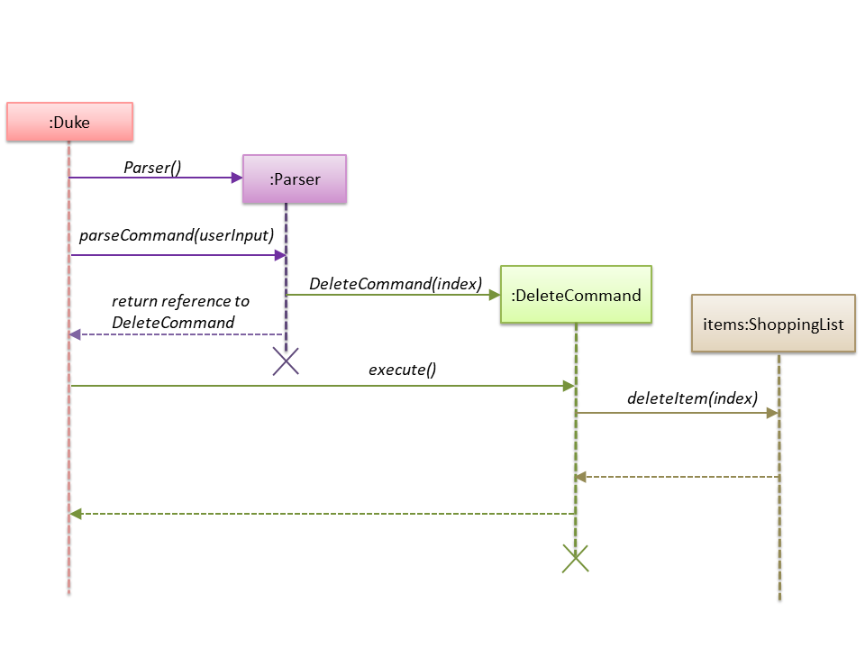
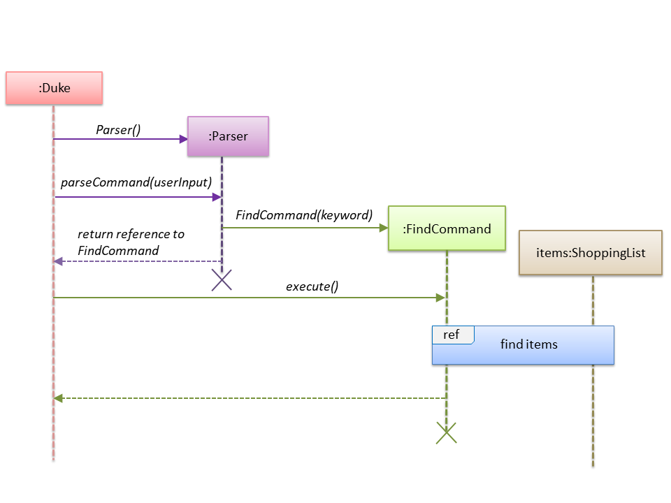
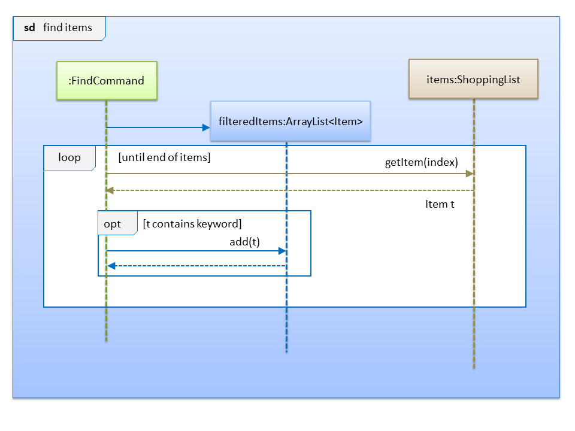
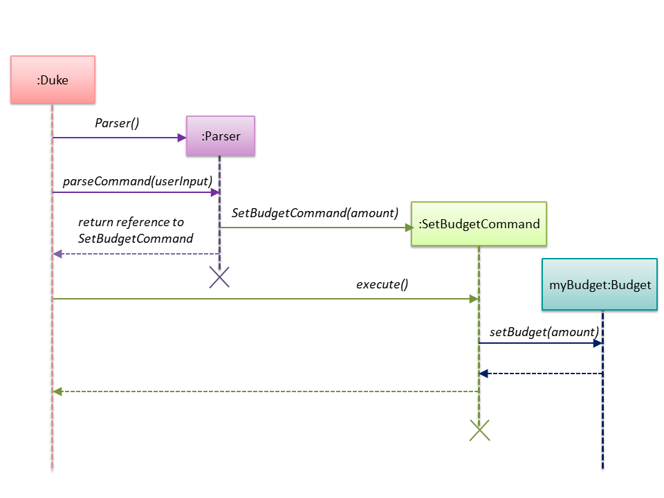

# Tan Kok Joon - Project Portfolio Page

## PROJECT: SHOCO v2.1

## Overview

SHOCO is a command-line interface (CLI) application written in Java that is used for managing and planning shopping lists
and budgets, mainly targeting the inconveniences of unplanned grocery shopping.

## Summary of Contributions

- **Major enhancements**:
   1. Added the **delete functionality**
      
      - What it does: Allows the user to remove an existing item from the shopping list.
      - Justification: This feature makes the application more complete as the user might have added an item to the shopping
      list by mistake and the application should allow the user to delete it easily.
      - Highlights: Much consideration had to be given to the various types of invalid user input that should be 
      rejected by the application such as invalid indices like negative numbers.

   2. Added the **set budget functionality**
     
      - What it does: Allows the user to specify a budget amount for his shopping list.
      - Justification: This achieves one of the key objectives of the product which is to help the user stay within budget.
      - Highlights: Careful consideration had to be given to what values to reject as input without restricting the user's freedom, such as negative
      values which are definitely unacceptable.
      
   3. Added the **search functionality**
     
      - What it does: Allows the user to find items in a long list by specifying keywords.
      - Justification: This will really improve user experience as it can be tedious to find something manually in a
      long list.
      - Highlights: To further improve user accessibility and convenience, case-insensitivity is allowed for the keywords.

- **Minor enhancements**: Added a feature to display a warning message to the user if the total cost of the items in his list has exceeded
his budget
     
- **Code contributed**: [[Functional code](https://nus-cs2113-ay1920s2.github.io/tp-dashboard/#search=kokjoon97&sort=groupTitle&sortWithin=title&since=2020-03-01&timeframe=commit&mergegroup=false&groupSelect=groupByRepos&breakdown=false)]

- **Other contributions**:

  - Documentation:
  
    - Wrote the sections outlining the use of the find, delete and set budget features (Pull request [#107](https://github.com/AY1920S2-CS2113T-T13-1/tp/pull/107))
    - Wrote the introduction segment (Pull request [#132](https://github.com/AY1920S2-CS2113T-T13-1/tp/pull/132))
    - Added more specific instructions on how to run the application (Pull request [#132](https://github.com/AY1920S2-CS2113T-T13-1/tp/pull/132))
    - Wrote additional information on how the application works (Pull request [#132](https://github.com/AY1920S2-CS2113T-T13-1/tp/pull/132))
    - Added a FAQ on restoring lost data (Pull request [#132](https://github.com/AY1920S2-CS2113T-T13-1/tp/pull/132))

  - Developer Guide:
  
    - Wrote appendices A and C (Pull request [#93](https://github.com/AY1920S2-CS2113T-T13-1/tp/pull/93))
    - Added a description of the class diagram (Pull request [#140](https://github.com/AY1920S2-CS2113T-T13-1/tp/pull/140))
    - Wrote the sections outlining the interactions between different classes for the find, delete and set budget features, including design considerations for each feature (Pull request [#165](https://github.com/AY1920S2-CS2113T-T13-1/tp/pull/165))
    - Added sequence diagrams for the find, delete and set budget features (Pull request [#165](https://github.com/AY1920S2-CS2113T-T13-1/tp/pull/165))
    
  - Team-based tasks:
  
    - Managed release `v1.0` on Github
    - Resolved CheckStyle violations in some parts of the code (Pull request [#44](https://github.com/AY1920S2-CS2113T-T13-1/tp/pull/44))
    - Fixed general issue with reading of multiple lines of user input (Pull request[#66](https://github.com/AY1920S2-CS2113T-T13-1/tp/pull/66))
    - Fixed major issue with failing of CI tests by making changes to runtest file (Pull request[#68](https://github.com/AY1920S2-CS2113T-T13-1/tp/pull/68))
    - Setting up of Logger with console and file handlers (Pull request[#70](https://github.com/AY1920S2-CS2113T-T13-1/tp/pull/70))
    
  - Review/mentoring contributions:
   
    - PRs reviewed (with changes suggested): [#35](https://github.com/AY1920S2-CS2113T-T13-1/tp/pull/35), [#38](https://github.com/AY1920S2-CS2113T-T13-1/tp/pull/38), [#39](https://github.com/AY1920S2-CS2113T-T13-1/tp/pull/39), [#40](https://github.com/AY1920S2-CS2113T-T13-1/tp/pull/40), [#42](https://github.com/AY1920S2-CS2113T-T13-1/tp/pull/42) ,[#139](https://github.com/AY1920S2-CS2113T-T13-1/tp/pull/139), [#163](https://github.com/AY1920S2-CS2113T-T13-1/tp/pull/163)

  - Beyond the project team:
  
    - Reported bugs and suggestions for other project teams: [Inaccurate documentation](https://github.com/kokjoon97/ped/issues/4), [broken link in UG](https://github.com/kokjoon97/ped/issues/13), [duplication bug](https://github.com/kokjoon97/ped/issues/5), [saving issue](https://github.com/kokjoon97/ped/issues/12)
    
## Contributions to the User Guide
> *Given below are sections I contributed to the User Guide. They showcase my ability to write documentation
> targeting end-users*

### Introduction

Have you ever encountered the problem of having to make multiple trips to the supermarket
because you forgot to get something important? Have you ever gone to the supermarket just to realise
you do not have enough cash on you?

If these problems sound familiar to you, fret not! With SHOCO, such troubles are now a thing of the
past.

SHOCO is a command-line interface (CLI) application that allows you to 
manage and plan your shopping list and budget. With better organisation and also a
budget tracker, we are here to enhance your grocery-shopping experience and make the woes of
grocery shopping disappear.
&nbsp;

### Quick Start

1. Ensure that you have Java 11 or above installed.
2. Download the latest version of `SHOCO` from [here](https://github.com/AY1920S2-CS2113T-T13-1/tp/releases).
3. Open the command prompt in the directory of the executable and type in the following command:
   `java -jar SHOCO.jar`
4. You are now all set to plan your shopping list!
&nbsp;

### Deleting an item: `DEL`
Removes an item from the list at the specified index.

Format: `DEL INDEX`

* The `INDEX` should be an integer.
* The `INDEX` should not be out of bounds of the shopping list.  

Example of usage: 

`DEL 3`

### Setting a budget: `SET`
Sets a budget for the user.

Format: `SET b/AMOUNT`

* The `AMOUNT` can be any decimal number that is between 0 to 5000.
* The `b/` phrase should be present in the command.  

Example of usage: 

`SET b/3.00`

### Finding an item: `FIND`
Filters the shopping list according to a keyword specified by the user.

Format: `FIND KEYWORD`

* The `KEYWORD` can be any word or phrase.
* The `KEYWORD` field should not be left empty.  

Example of usage: 

`FIND apple`

### Additional information

#### 1. Loading and saving your shopping list

All your shopping list and budget data are saved to JSON files after you
exit the application. This data is also retrieved from the same JSON files the next time you boot up
Shoco. No further action is required from you as this is an automatic process.

#### 2. Automated budget tracker

When the total cost of the items in your shopping list exceeds the stored budget amount, a message will be
displayed which states by how much you have overrun your current budget. This message will only
stop appearing when you increase your budget amount sufficiently or remove enough items from your list to keep within
your budget.

### FAQ

**Q**: Is it possible to restore a list that I have deleted?

**A**: Unfortunately, we are still working on this feature and there is no such functionality at this
point in time. It is however, possible to manually backup the `shoppinglist.json` file
from time to time so that if you unintentionally cleared your list, you can always replace the empty
`shoppinglist.json` file with your backed up version.

## Contributions to the Developer Guide
> *Given below are sections I contributed to the Developer Guide. They showcase my ability to write technical documentation
> and the technical depth of my contributions to the project.*

### 2. Overview of the SHOCO application

The <code>Duke</code> class manages all required resources in the execution of the application. These include
a <code>ShoppingList</code> object to keep track of the <code>Item</code> objects the user has added to his list and
a <code>Budget</code> object to store the user's budget.

<code>Duke</code> also has a <code>Storage</code> object for saving and loading data from memory - this data includes
the latest saved <code>ShoppingList</code> and <code>Budget</code>.

There is a dependency from <code>Duke</code> to <code>Parser</code> as it only creates an instance of the <code>Parser</code>
every time user input is received by the <code>Ui</code> and does not keep track of the <code>Parser</code> which is deleted
after it is done parsing the current user input. The <code>Parser</code> determines what command is being invoked by the
user before creating a new <code>Command</code> object. It then returns the reference to the new <code>Command</code> object 
to <code>Duke</code>. 

At any point in time, <code>Duke</code> only stores up to one <code>Command</code> and no more. This
<code>Command</code> has to be executed before <code>Duke</code> can receive more user input.

#### 3.3 Delete feature
##### 3.3.1 Current implementation

The delete feature is implemented using a <code>DeleteCommand</code> class which extends the main
<code>Command</code> class with an index representing that of the item to be deleted from the shopping
list. 

The process is as follows:
1. <code>Duke</code> receives user input from <code>Ui</code>.
2. <code>Duke</code> calls <code>Parser#parseCommand()</code> to instantiate a <code>DeleteCommand</code> object based on that user input.
3. <code>Duke</code> then calls <code>DeleteCommand#execute()</code>.
4. <code>DeleteCommand#execute()</code> makes another call to <code>ShoppingList#deleteItem()</code>.
5. The <code>Item</code> at the specified index is then removed from the <code>ShoppingList</code> object.

The following sequence diagram below shows how the delete feature works. Note the <code>Ui</code> class is
omitted in the sequence diagram to emphasise on the other classes:

#### 3.3.2 Design considerations

##### Aspect: Data structure to support the delete feature

- Alternative 1 (current choice): Object-oriented style with a separate class for <code>DeleteCommand</code>
 
  - Pros: Easy to add the delete feature without having to change the logic of the code much as each command object
  is treated as a black box
  
  - Cons: Might significantly increase the code base with another class being added

- Alternative 2: Implement delete feature in the <code>Duke</code> class

  - Pros: Will have less code to deal with as a new function is simply created in the <code>Duke</code> class
  
  - Cons: Code becomes less organised since for every other command that we have implemented, <code>Duke</code> class
    simply executes those commands as black boxes, without worrying about their internal details

- Reason for choosing alternative 1: By abstracting out different command types as separate classes, this allowed us
to work better in parallel and also be able to spot bugs more easily as each class deals with a different functionality.

#### 3.4 Find feature
##### 3.4.1 Current implementation

The find feature is implemented using a <code>FindCommand</code> class which extends the main
<code>Command</code> class with a String representing the keyword specified by the user.

The process is as follows:
1. <code>Duke</code> receives user input from <code>Ui</code>.
2. <code>Duke</code> calls <code>Parser#parseCommand()</code> to instantiate a <code>FindCommand</code> object based on that user input.
3. <code>Duke</code> then calls <code>FindCommand#execute()</code>.
4. <code>FindCommand#execute()</code> makes various calls to <code>ShoppingList#getItem()</code>
to check whether the <code>Item</code> at each specified index contains the given keyword.
5. Each <code>Item</code> that contains the keyword is then added to a new <code>ArrayList</code> named
 <code>filteredItems</code> that is maintained by the <code>FindCommand</code> object.
6. This list of matching results is then printed to standard output.

The following sequence diagram below shows how the <code>Duke</code> object creates the <code>FindCommand</code> object. Note the <code>Ui</code> class is
omitted in the sequence diagram to emphasise on the other classes:

This next sequence diagram will show how the <code>FindCommand</code> creates the <code>filteredItems</code> list:

#### 3.4.2 Design considerations

##### Aspect: Data structure to support the find feature

- Alternative 1 (current choice): Object-oriented style with a separate class for <code>FindCommand</code>
 
  - Pros: Easy to add the find feature without having to change the logic of the code much as each command object
  is treated as a black box
  
  - Cons: Might significantly increase the code base with another class being added

- Alternative 2: Implement find feature in the <code>Duke</code> class

  - Pros: Will have less code to deal with as a new function is simply created in the <code>Duke</code> class
  
  - Cons: Code becomes less organised since for every other command that we have implemented, <code>Duke</code> class
    simply executes those commands as black boxes, without worrying about their internal details
    
- Reason for choosing alternative 1: With each command type having its own class, we could work better in parallel and
also be able to trace functionality bugs more easily if each command class deals with a different functionality.

#### 3.8 Set budget feature
##### 3.8.1 Current implementation

The set budget feature is implemented using a <code>SetBudgetCommand</code> class which extends the main
<code>Command</code> class with a variable representing the budget amount.

The process is as follows:
1. <code>Duke</code> receives user input from <code>Ui</code>.
2. <code>Duke</code> calls <code>Parser#parseCommand()</code> to instantiate a <code>SetBudgetCommand</code> object based on that user input.
3. <code>Duke</code> then calls <code>SetBudgetCommand#execute()</code>.
4. <code>SetBudgetCommand#execute()</code> makes another call to <code>Budget#setBudget()</code>.
5. The amount in the <code>Budget</code> object is set to the amount specified by the user.

The following sequence diagram below shows how the set budget feature works. Note the <code>Ui</code> class is
omitted in the sequence diagram to emphasise on the other classes:

#### 3.8.2 Design considerations

##### Aspect: Data structure to support the set budget feature

- Alternative 1 (current choice): Object-oriented style with a separate class for <code>SetBudgetCommand</code>
 
  - Pros: Easy to add the set budget feature without having to change the logic of the code much as each command object
  is treated as a black box
  
  - Cons: Might significantly increase the code base with another class being added

- Alternative 2: Implement set budget feature in the <code>Duke</code> class

  - Pros: Will have less code to deal with as a new function is simply created in the <code>Duke</code> class
  
  - Cons: Code becomes less organised since for every other command that we have implemented, <code>Duke</code> class
  simply executes those commands as black boxes, without worrying about their internal details
  
- Reason for choosing alternative 1: By implementing each command type in a separate class, any bugs associated with a
particular functionality will not affect other functionalities that significantly. It would also make it easier for us to 
work in parallel.

#### Appendix A: Product Scope
This section talks about who this product targets and what it aims to achieve.

##### Target user profile

- Likes to cook at home and requires help keeping track of complex grocery shopping lists and
staying within budget
- Prefers to use command line interface applications as opposed to other kinds of applications or
paper
- Can type fast

##### Value proposition

- Make grocery shopping a breeze by offering greater flexibility in managing
shopping lists and also providing helpful features like budget tracking

#### Appendix C: Non-Functional Requirements

1. Should work on any OS that has Java 11 or later installed.
2. Should respond to any user commands within 2 seconds.
3. Should be easy to use even for people who have never used a command line interface before.