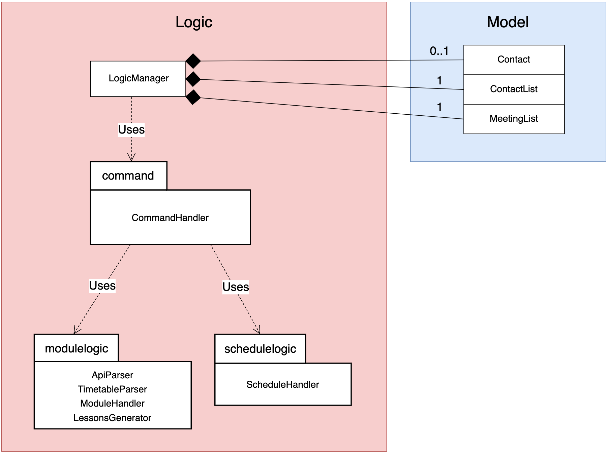

<H1> melovecarbs - Project Portfolio </H1>
  
# Project: WhenFree

##  Overview

  WhenFree is a command line based application capable of finding common time-slots among team members and schedule meetings accordingly. It also have additional features such as add/delete/edit meetings and can save the data onto hard-disk for future use.

## Summary of Contributions

### Code Contributed
Link : [RepoSense Dashboard](https://nus-cs2113-ay1920s2.github.io/tp-dashboard/#=undefined&search=melovecarbs)

### Enhancements implemented:
* **Major Enhancement:**  
    * Developed the foundation of WhenFree's architecture, ie the ```modulelogic``` component. 
    * This component is responsible for accessing NUSMODS api and parsing user's nusmods URL into the modules the user is taking. After which an algorithm using HashMap and HashSet is used to filter out the specific lesson details the user is taking. 
    * The filter lesson details are an integral part of WhenFree and is called as an API in other logic component.
    * This API call also takes into account the modules that doesn't follow the standard 13-week per semester convention (approximately 200 modules out of ~10,000 modules) and informs user to manually key in the timetable for those modules. 
    * Responsible for creating the Junit test classes in ```Logic.modulelogic``` component, ensuring that the >90% of the code from the component is covered and there are no defects since an error in this API might break the whole application which relies on nusmods URL to add contacts.
* **Major Enhancement:**  
    * Responsible for refactoring the architecture of the project source code to follow the UI-logic-model-storage component in V2.0 by creating additional manager class:```LogicManager.java``` to manage the component. 
    * Originally, the classes are all jumbled up and does not follow a specific set of order. 
    * By refactoring it into UI-logic-model-storage hierarchy, every class created is organized into their respective components and classes wouldn't be exposed to components it is not using, reducing the effect of coupling.
* **Minor Enhancement:** 
    * Developed the Contact class in the model component, which is responsible for holding all the information of a particular contact. 
    * The class stores the individual's timetable, as well as several methods to convert user's input into slots to be inserted into the timetable.
* **Minor Enhancement:** 
    * Added capabilities for meetings to be deleted and reflected onto user's timetable.
* **Contributions to documentation:**
	* Documented the ```modulelogic``` subcomponent in the ```logic``` component, as well as LogicManager responsible for managing all the subcomponents in logic component.
	* Documented the```common``` components which holds various classes with static variables used in other components.
* **Contributions to the DG:**
	* Documented design section: ```2.2.1 Architecture 2.2.3```
	* Documented design section: ```Logic component 2.2.6 Common component```
	* Documented implementation section: ```3.3.1 Add a new contact```
	* Docuemented implementation section: ```3.3.2 List all contacts```
	
* **Contributions to team-based tasks :**
	* Jointly released V1.0, V2.0 and V2.1 together with team mates, taking into account the must have features for each version.
	* Set up team organization and set up issues that needs to be solved for every milestone.
	* Set up shadowJar and related dependencies in gradle for the team.
	* Documented settings section: ```1. Setting Up``` of Developer Guide.
	* Documented Appendix A of Developer's guide: ```Appendix A: Product Scope```
	* Documented Appendix B of Developer's guide: ```Appendix B: User Stories```
	* Documented Appendix C of Developer's guide: ```Appendix C: Use Cases```
	* Documented Appendix D of Developer's guide: ```Appendix D: Non-functional requirement```
	* Documented Appendix E of Developer's guide: ```Appendix E: Glossary```
	* Documented Appendix F of Developer's guide: ```Appendix F: Instructions for Manual Testing```
    * Looked through all the issue feedback from PED dry run and fixed major issue that could cause our application to crash. Issues related to user guide are assigned to teammates respectively depending on their roles for this project.
    * Refactor code in WhenFree.java (application's main class) to be more compact.
    
* **Review/mentoring contributions:**
    * Provided help to team mates facing issues with gradle and checkStyle and how to resolve the errors caused by github CI tool. Ensuring that we abide by the rule of: "Do not merge any pull requests that doesn't pass the continuous integration tool", preventing errors from snowballing.
    * Provided the skeleton code of the application to kick-start the project and for everyone to have something to work on.
    * Provided help to teammates that were unsure of the syntax to use when writing UML sequence diagram from [this website](https://sequencediagram.org/) and sharing my source code under ```/docs/UML source code```.
    
* **Contributions beyond the project team:**
    * Provided solutions to problems/difficulties other teams were facing and discover bugs that causes wrong repl submission. For eg: [repl bug](https://github.com/nus-cs2113-AY1920S2/forum/issues/6), [issue other team faced](https://github.com/nus-cs2113-AY1920S2/forum/issues/104)
    * Reported 6 bugs during PED by following a methodological approach of Expected Behaviour of application-Current behaviour of application-Steps to reproduce-Detail description of the bug-Possible solution to the bug.
    
* **Contributions to the Developer Guide (Extracts)**: 

> :blush: Below are few of the examples of my contributions to the developer's guide.

### 2.1. Architecture
<br>

The architecture diagram above shows an overview of the high-level design of WhenFree. Meeting Organizer
adopts an n-tier style architecture where higher layers make use of the services provided by the lower layers.
Here is a quick overview of each layer and the components residing in it.
* UI: The CLI user interface of the application.
* Commons: A collection of classes containing constants such as messages for ```common.exception```, modules that can't be formatted, etc.
* Logic: The main control unit of the application which handles the business logic of the application.
* Model: Holds the data of the application in memory which is easily accessible by any methods that requires it.
* Storage: Writes data from Model layer to hard disk, as well as reading previously saved data from hard disk and storing it into Model layer.

### 2.3. Logic component
<br>

The LogicManager is the brain and backbone of the logic component. It depends on 3 sub-components for it to work.
First, ```command``` sub-component would be initialize to interpret the user commands. 
Afterwards, LogicManager instantiates```schedulelogic``` and ```modulelogic``` sub-components via ```CommandHandler``` to enable the generation of common time slots from NUSMODS links.
LogicManager forms a whole-part relationship with the classes in the Model component, mainly ```ContactList``` and ```MeetingList``` where all the data generated from user commands would be stored. Besides, ```LogicManager``` also stores a ```mainUser:Contact``` containing the user's timetable
which is used to store scheduled meetings.
