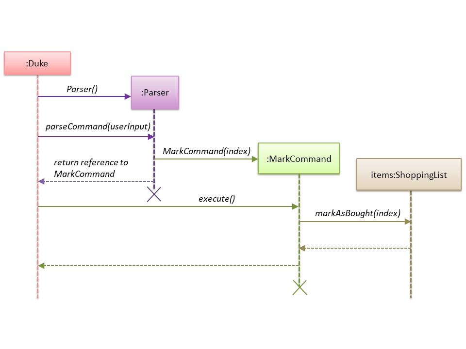
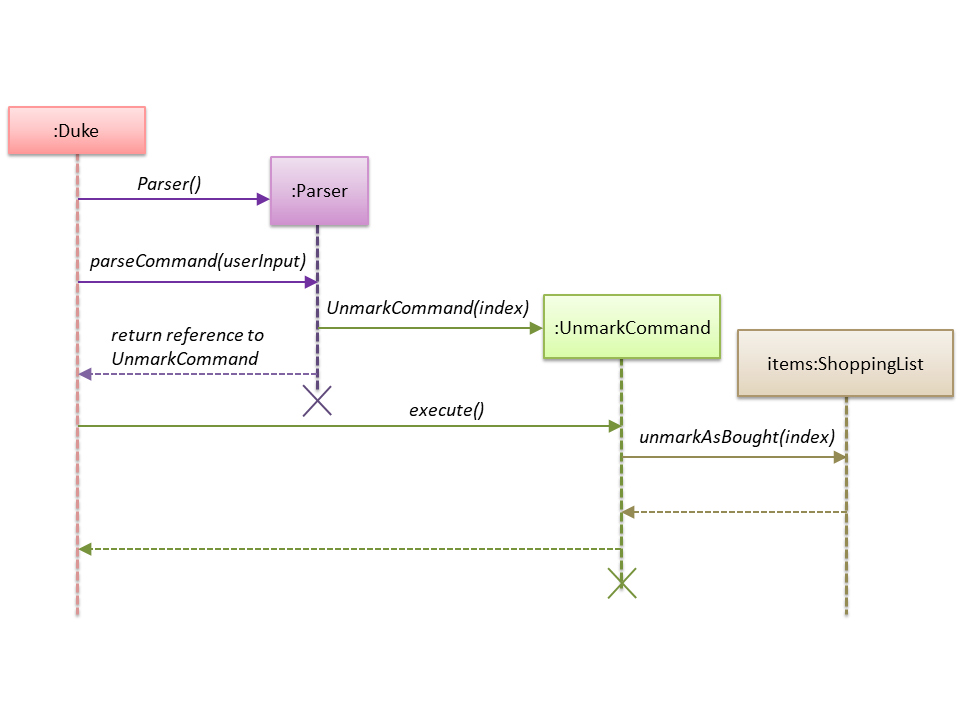
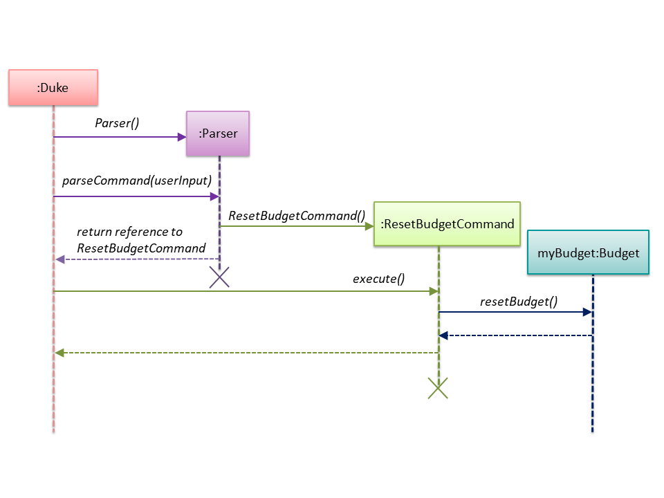

<!-- @@author Shannonwje -->
# ShannonWong - Project Portfolio
# PROJECT: SHOCO 

## Overview

SHOCO is a desktop application used for the managing and planning of shopping lists and budget. 
Users interact with it through the use of a command-line interface (CLI) and the program is written in Java.

## Summary of Contributions

* **Major enhancement 1:** Included the **ability to mark and unmark items** in the shopping lists.
    * What it does: Allows the users to mark items that are listed as unbought in the list. Allows users to unmark items that are listed as bought in the list as well.
    * Justification: This feature allows the user to see the items that have bought and thus filter out 
    * Highlights: This features allows the user mark or unmark any item in the list based on index, making it easy to navigate. Even if the item is marked already, using the marked feature will still show the success message, providing the user assurance that it has been marked as bought already. This applies to the unmark feature.

* **Minor enhancement 1:** Negative indexes or indexes greater than the size of the list are not accepted. This is for a realistic approach as items that do not exist in the list cannot be marked as done in real life, neither do negative indexes exist in real life. 

* **Major enhancement 2:** Included the **ability to reset the budget**.
    * What it does: Allows the users to set their budget back to the default value of $0.00
    * Justification: This helps the user to be able to start over in their budgeting so that they are better able to plan their grocery trips with a clear organisational plan and budgeting.
    * Highlights: While set budget requires the user to know the amount of budget before using, resetting the budget back to $0.00 can allow the user to see and have a better idea of how much budget they will need approximately, assuming that the items needed are recorded in the list already.

* **Code contributed:** [[Functional code]](https://nus-cs2113-ay1920s2.github.io/tp-dashboard/#search=shannonwje&sort=groupTitle&sortWithin=title&since=2020-03-01&timeframe=commit&mergegroup=false&groupSelect=groupByRepos&breakdown=false)

* **Other contributions:** 
    * Documentation:

	    * Wrote details about user guide (creators & date) (Pull request [#167](https://github.com/AY1920S2-CS2113T-T13-1/tp/pull/167))
	    * Rearranged and synced the order of both developer and user guide (Pull request [#167](https://github.com/AY1920S2-CS2113T-T13-1/tp/pull/167) and [#166](https://github.com/AY1920S2-CS2113T-T13-1/tp/pull/166))

    * Developer Guide:

	    * Wrote the overview description for the developer guide (Pull request [#131](https://github.com/AY1920S2-CS2113T-T13-1/tp/pull/131))
        * Wrote the sections outlining the interactions between different classes for the mark, unmark and reset budget features, including design considerations for the features mentioned (Pull request [#103](https://github.com/AY1920S2-CS2113T-T13-1/tp/pull/103) and [#166](https://github.com/AY1920S2-CS2113T-T13-1/tp/pull/166))
        * Added sequence diagrams to mark, unmark and reset budget features (Pull request [#103](https://github.com/AY1920S2-CS2113T-T13-1/tp/pull/103) and [#166](https://github.com/AY1920S2-CS2113T-T13-1/tp/pull/166))
        * Wrote to appendix B (Pull request [#103](https://github.com/AY1920S2-CS2113T-T13-1/tp/pull/103))
        * Edited Help feature sequence diagram, removed activation bar. (Pull request [#166](https://github.com/AY1920S2-CS2113T-T13-1/tp/pull/166))
        * Wrote test instructions for mark, unmark and reset budget features. (Pull request [#167](https://github.com/AY1920S2-CS2113T-T13-1/tp/pull/167))

    * Team-based tasks:

        * Resolved Checkstyle violations in some parts of the code. (Pull request [#46](https://github.com/AY1920S2-CS2113T-T13-1/tp/pull/46))
        * Added in the Display feature inside the Help Command. (Pull request [#81](https://github.com/AY1920S2-CS2113T-T13-1/tp/pull/81))
        * Edited the expected output test file to reflect the change of the help command output. (Pull request [#81](https://github.com/AY1920S2-CS2113T-T13-1/tp/pull/81))

    * Review/Mentoring contribution:

        * PRs reviewed, some with suggestions for changes. (Pull requests [#38](https://github.com/AY1920S2-CS2113T-T13-1/tp/pull/38), [#92](https://github.com/AY1920S2-CS2113T-T13-1/tp/pull/92) and [#120](https://github.com/AY1920S2-CS2113T-T13-1/tp/pull/120))

    * Beyond the project team:

	    *Reported feature flaws, documentation bugs and functionality bugs of varying severity for other project teams. (Pull requests [#1 - #7](https://github.com/Shannonwje/ped/issues))

## Contributions to the User Guide
> *Shown below are the sections that I have contributed to the User Guide. They showcase my ability to write documentation targeting end-users.*

By: `Team SHOCOTech`

Since: `Feb 2020`

Creators: `Trisha Labi` `Tan Kok Joon` `Jia Juin` `Joshua Loh` `Shannon Wong`

### Marking an item as bought: `MARK`
Marks an item from the list at the specified index as bought.
When first added initially, the item will have the status `[0]` 
to indicate that it is unmarked. After marking the item as bought, 
the status of item becomes `[B]`.

Format: `MARK INDEX`

* The `INDEX` should be a number.
* The `INDEX` should not be out of bounds of the shopping list.
  * Out of bounds indexes include negative indexes & indexes that are greater than the size of the shopping list.
* Indexes that are not numbers or are out of bounds will produce an error message indicating the error of the index.
* Marking an item whose status was previously `[B]` will be successful, assuring the success of the mark command executed.

Example of the usage: 

1. `MARK 5`
   * This marks the 5th item in your list as bought.
   * The status of the 5th item is now `[B]`

### Un-marking a marked item: `UNMARK`
Un-marks a marked-as-bought item from the list at the specified index.
After being marked as bought, the item will have the status `[B]`
to indicate that it is marked as bought. After unmarking the marked-as-bought
item, the status of the item becomes `[0]`.

Format: `UNMARK INDEX`

* The `INDEX` should be an number.
* The `INDEX` should not be out of bounds of the shopping list.
  * Out of bounds indexes include negative indexes & indexes that are greater than the size of the shopping list.
* Indexes that are not numbers or are out of bounds will produce an error message indicating the error of the index.
* Unmarking an item whose status was previously `[0]` will be successful, assuring the success of the unmark command executed.

Example of the usage:

1. `UNMARK 3`
   * This unmarks the 3rd item in your list as unbought.
   * The status of the 3rd item is now `[0]`

### Resetting a budget: `RES`
Resets the budget to be $0.00 for the user.

Format: `RES`

---

## Contributions to the Developer Guide
> *Shown below are sections I contributed to the Developer Guide. They showcase my ability to write technical documentation
> and the technical depth of my contributions to the project.*

### 2. Overview of the SHOCO application
The overview of the main classes in the application are shown in the class diagram below.
Omitted are the classes for the features implemented, the <code>LoadData</code>
class, <code>WriteData</code> class, <code>FileUtil</code> class and
<code>CommandLineTable</code> class.

#### 3.5 Mark and Unmark feature
##### 3.5.1 Current Implementation
  
 The mark and unmark feature is implemented using the <code>MarkCommand</code> and <code>UnmarkCommand</code> class
 which extends the main <code>Command</code> class with an index representing that of the item to be marked or
 unmarked as bought in the list.
 
 The process of object creation:
 1. The <code>Duke</code> class first receives user input from the <code>Ui</code>
 2. The <code>Duke</code> class then creates a <code>Parser</code> object and calls its <code>parseCommand</code> method
 to instantiate a <code>MarkCommand</code> or <code>UnmarkCommand</code> object based on the user input
 3. The <code>Duke</code> class then calls the <code>execute</code> method of the <code>MarkCommand</code> or 
 <code>UnmarkCommand</code> command object. This calls the <code>markAsBought</code> or <code>unmarkAsBought</code>
 method of the <code>shoppingList</code> object with the specified index.

 The following sequence diagram below shows how the Mark feature (Diagram 1) and Unmark feature (Diagram 2) works.
 Note the <code>Ui</code> class is omitted in the sequence diagram to emphasise on the other classes:
  
 Diagram 1:
 

  
Diagram 2:

  
##### 3.5.2 Design Considerations
  
###### Aspect: Data structure to support the Mark and Unmark Feature
  
 - Alternative 1 (current choice): Object-oriented style with a separate class for <code>MarkCommand</code>
  and <code>UnmarkCommand</code>

   - Pros: Easy to edit and add the mark and unmark feature without having to change the logic of the code in
    multiple files
    
   - Cons: Might significantly increase the code base with another class being added
    
- Alternative 2: Implement the mark and unmark feature in either the <code>Duke</code> or <code>Parser</code> class

    - Pros: Will have less code and classes to deal with, without having to create a whole new object to execute
      the command.
    
    - Cons: Code becomes harder to navigate and understand since the command is all handled under one class, thus makes
    having to edit the mark and unmark feature difficult.
    
- Reasons for choosing alternative 1: By having an individual class on it's own, any bugs found in the mark and unmark
feature can be found easier and therefore helps to resolve the issue more efficiently. Also, with the feature being
implemented in an object-oriented style, reading and tracing the application code would be easier, thus making adding
future features to the mark and unmark feature easier as well.

#### 3.8 Reset budget feature
##### 3.8.1 Current implementation

The reset budget feature is implemented using a <code>ResetBudgetCommand</code> class which extends the main
<code>Command</code> class with a variable representing the budget amount.

The <code>Duke</code> class first receives user input from the <code>Ui</code> class before it creates a 
<code>Parser</code> object and calls its <code>parseCommand</code> function to instantiate a 
<code>ResetBudgetCommand</code> object based on that user input.

The <code>Duke</code> class then calls the <code>execute</code> method of the <code>ResetBudgetCommand</code> object
which makes another call to the <code>resetBudget</code> function of the <code>Budget</code> object.

The following sequence diagram below shows how the reset budget feature works. Note the <code>Ui</code> class is
omitted in the sequence diagram to emphasise on the other classes:

##### 3.8.2 Design considerations

###### Aspect: Data structure to support the reset budget feature

- Alternative 1 (current choice): Object-oriented style with a separate class for <code>ResetBudgetCommand</code>
 
  - Pros: Easy to add the reset budget feature without having to change the logic of the code much as each command
  object is treated as a black box
  
  - Cons: Might significantly increase the code base with another class being added

- Alternative 2: Implement reset budget feature in the <code>Duke</code> or <code>Parser</code> class

  - Pros: Will have less code to deal with as a new function is simply created in the <code>Duke</code> class
  
  - Cons: Code becomes less organised since for every other command that we have implemented, <code>Duke</code> class
  simply executes those commands as black boxes, without worrying about their internal details
  
  
- Reason for choosing alternative 1: By implementing each command type in a separate class, any bugs associated with a 
particular functionality will not affect other functionalities that significantly. It would also make it easier for us
to work in parallel.

### E.3. Reset the budget and Marking & Unmarking an item

1. Reset the budget
       
    i. Test case: <code>RES</code> 

       Expected: Budget has been reset to $0.00
    
2. Marking an item

   i. Test case: <code>MARK</code> 

       Expected: Please provide a single numerical index number!
 
   ii. Test case: <code>MARK 5</code> 

       Assumption: there are 5 or more items in the list. The 5th item has a description of 'lemons', price of '$4.00' and quantity of '6'
       
       Expected: Yes! I've marked this item as bought:
                 [B] lemons $4.00 qty: 6
    
   iii. Test case: <code>MARK -10</code> 

       Expected: Oh No! This item does not exist in the list
    
   iv. Test case: <code>MARK 100</code> 

       Expected: Oh No! This item does not exist in the list
    
3. Unmarking an item

   i. Test case: <code>UNMARK</code> 

       Expected: Please provide a single numerical index number!
    
   ii. Test case: <code>UNMARK 5</code> 

       Assumption: there are 5 or more items in the list. The 5th item has a description of 'lemons', price of '$4.00' and quantity of '6'
       
       Expected: Yes! I've unmarked this item as bought:
                 [0] lemons $4.00 qty: 6
    
   iii. Test case: <code>UNMARK -10</code> 

       Expected: Oh No! This item does not exist in the list
    
   iv. Test case: <code>UNMARK 100</code> 

       Expected: Oh No! This item does not exist in the list
    
<!-- @@author -->