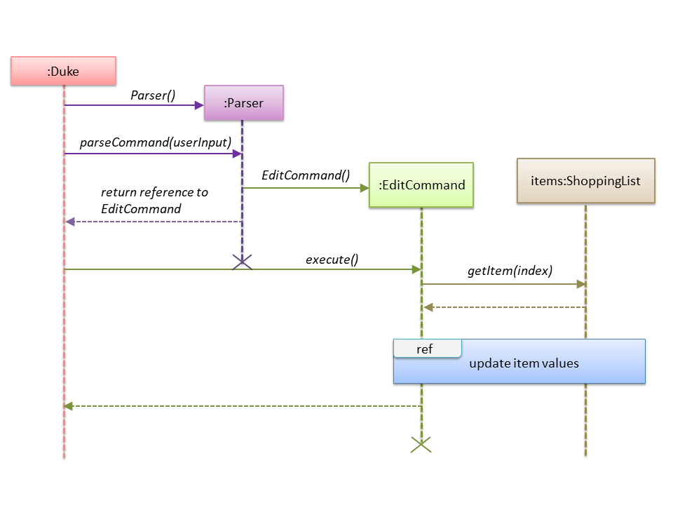
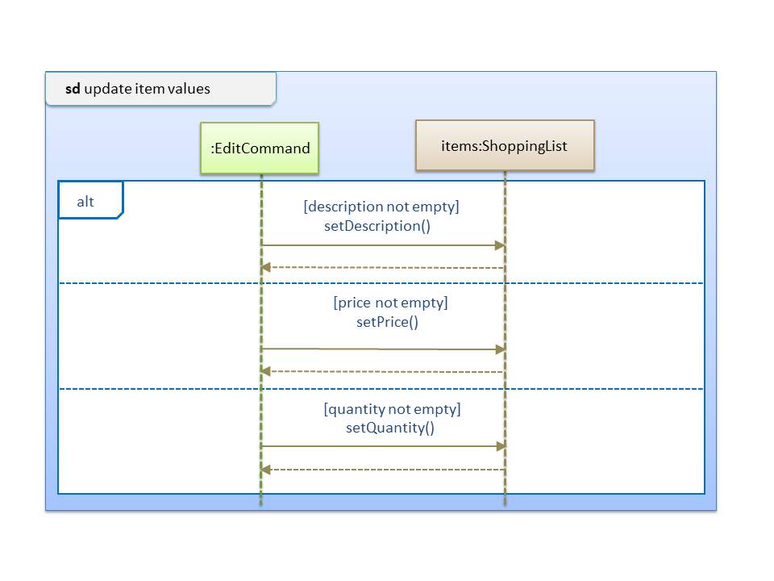
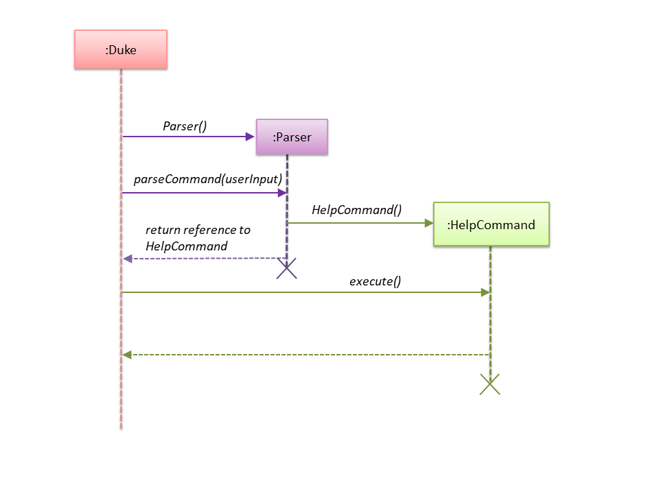

<!-- @@author trishaangelica -->
# Labi Trisha Angelica Vergara - Project Portfolio
## PROJECT: SHOCO 

## Overview

SHOCO is a desktop application used for the managing and planning of shopping lists and budgets. Users interact with it through the use of a command-line interface (CLI), the program is written in Java and has bout 5 kLoC.

### Summary of Contributions
* **Major enhancement 1:** Included the **ability to edit items** in the shopping list.
    * What it does: Allows the user to update values of an item in the shopping list. Such values include the description, price and quantity of an item.
    * Justification: This feature improves the product significantly because a user may make mistakes when adding an item (e.g typos made) and the app should provide a convenient way to rectify such mistakes.
    * Highlights: This enhancement allows the user to update any value of an item as the edit command does not require any order in its input (e.g alphabetical ordering of delimiters).
* **Minor enhancement 1:** Negative values entered for price and quantity are not accepted. This is for a realistic approach as items will never have negative prices and/or quantities in a real life scenario.

* **Major enhancement 2:** Added the **help function** for the SHOCO application.
    * What it does: Lists all acceptable commands, their purpose, valid parameters and examples of usage.   
    * Justification: This feature improves the product significantly because the user may forget how certain functions work and so, the app should provide a convenient way for them to check the accepted format.
     With the help feature embedded in the application, users need not solely rely on the SHOCO User Guide.
    * Highlights: This enhancement includes examples of command usages which makes the accepted command formats much more comprehensible to the user.  

* **Code contributed:** [[Functional code]](https://nus-cs2113-ay1920s2.github.io/tp-dashboard/#search=trishaangelica&sort=groupTitle&sortWithin=title&since=2020-03-01&timeframe=commit&mergegroup=false&groupSelect=groupByRepos&breakdown=false&tabOpen=true&tabType=authorship&tabAuthor=trishaangelica&tabRepo=AY1920S2-CS2113T-T13-1%2Ftp%5Bmaster%5D)

* **Other contributions:** 
    * Project Management:
        * Closed milestone v1.0 on GitHub
        * Assigned bugs and PRs to respective team members on GitHub. (Issues <ins>[#146-#162](https://github.com/AY1920S2-CS2113T-T13-1/tp/issues?q=is%3Aissue+is%3Aclosed+PE-D)</ins>)
    
    * Enhancements to existing features:
        * Included test cases for all commands in input.txt file (Pull Request <ins>[#69](https://github.com/AY1920S2-CS2113T-T13-1/tp/pull/69/files#diff-cc5b0804a9a39fce149b1b64e58378db)</ins>)
        * Added SHOCO logo for the application (Pull request <ins>[#88](https://github.com/AY1920S2-CS2113T-T13-1/tp/pull/88/files)</ins>)
        * Changed original list display to pretty-printing in a table (*Reused code from logicbig*) (Pull request <ins>[#54](https://github.com/AY1920S2-CS2113T-T13-1/tp/pull/54/files#diff-f5a2a66f3d795321ea951828c239db70)</ins>)
        
    * Documentation:
        * Added a navigable table of contents and "back to top" links for both SHOCO user guide and developer guide: <ins>[#111]((https://github.com/AY1920S2-CS2113T-T13-1/tp/pull/111))</ins> , <ins>[#112](https://github.com/AY1920S2-CS2113T-T13-1/tp/pull/112/files)</ins> , <ins>[#122](https://github.com/AY1920S2-CS2113T-T13-1/tp/pull/122/files)</ins>
        * Organized the "skeletal" base of the DG in order to provide team members with allocated sections for easier collaboration <ins>[#114](https://github.com/AY1920S2-CS2113T-T13-1/tp/pull/114/files)</ins>
        * Standardized colour and font of all diagrams in the DG for comprehensibility <ins>[#191](https://github.com/AY1920S2-CS2113T-T13-1/tp/pull/191)</ins> , <ins>[#210](https://github.com/AY1920S2-CS2113T-T13-1/tp/pull/210)</ins>
        * Added the Manual Testing Section of the DG <ins>[#204](https://github.com/AY1920S2-CS2113T-T13-1/tp/pull/204)</ins>
           
    * Community:
        * PRs reviewed (with non-trivial review comments): <ins>[#38](https://github.com/AY1920S2-CS2113T-T13-1/tp/pull/38)</ins> , <ins>[#169](https://github.com/AY1920S2-CS2113T-T13-1/tp/pull/169)</ins>
    
    * Beyond the project team:
        * Reported feature flaws, documentation bugs and functionality bugs of varying severity for other project teams. (Pull requests <ins>[#1 - #6](https://github.com/trishaangelica/ped/issues)</ins>)

### Contributions to the User Guide
> *Given below are sections that I have contributed to the User Guide. 
> They showcase my ability to write documentation targeting end-users.*

#### Table of Contents
* **[1. Introduction](https://ay1920s2-cs2113t-t13-1.github.io/tp/UserGuide.html#introduction)**
* **[2. Quick Start](https://ay1920s2-cs2113t-t13-1.github.io/tp/UserGuide.html#quick-start)**
* **[3. Features](https://ay1920s2-cs2113t-t13-1.github.io/tp/UserGuide.html#features)**
  * [3.1 Adding an item: `ADD`](https://ay1920s2-cs2113t-t13-1.github.io/tp/UserGuide.html#adding-an-item-add)
  * [3.2 Editing an item: `EDIT`](https://ay1920s2-cs2113t-t13-1.github.io/tp/UserGuide.html#editing-an-item-edit)
  * [3.3 Deleting an item: `DEL`](https://ay1920s2-cs2113t-t13-1.github.io/tp/UserGuide.html#deleting-an-item-del)
  * [3.4 Finding an item: `FIND`](https://ay1920s2-cs2113t-t13-1.github.io/tp/UserGuide.html#finding-an-item-find)
  * [3.5 Marking an item as bought: `MARK`](https://ay1920s2-cs2113t-t13-1.github.io/tp/UserGuide.html#marking-an-item-as-bought-mark)
  * [3.6 Un-marking a marked item: `UNMARK`](https://ay1920s2-cs2113t-t13-1.github.io/tp/UserGuide.html#un-marking-a-marked-item-unmark)
  * [3.7 Displaying list and budget details: `DISPLAY`](https://ay1920s2-cs2113t-t13-1.github.io/tp/UserGuide.html#displaying-list-and-budget-details-display)
  * [3.8 Setting a budget: `SET`](https://ay1920s2-cs2113t-t13-1.github.io/tp/UserGuide.html#setting-a-budget-set)
  * [3.9 Resetting a budget: `RES`](https://ay1920s2-cs2113t-t13-1.github.io/tp/UserGuide.html#resetting-a-budget-res)
  * [3.10 Clearing the list: `CLEAR`](https://ay1920s2-cs2113t-t13-1.github.io/tp/UserGuide.html#clearing-the-list-clear)
  * [3.11 Viewing help: `HELP`](https://ay1920s2-cs2113t-t13-1.github.io/tp/UserGuide.html#viewing-help-help)
  * [3.12 Exiting the Program: `BYE`](https://ay1920s2-cs2113t-t13-1.github.io/tp/UserGuide.html#exiting-the-program-bye)
* **[4. Additional information](https://ay1920s2-cs2113t-t13-1.github.io/tp/UserGuide.html#additional-information)**
* **[5. FAQ](https://ay1920s2-cs2113t-t13-1.github.io/tp/UserGuide.html#faq)**
* **[6. Command Summary](https://ay1920s2-cs2113t-t13-1.github.io/tp/UserGuide.html#command-summary)**

#### Editing an item: `EDIT`
 Edits the specified item in the shopping list.
 
 Format: `EDIT INDEX [i/DESCRIPTION] [p/PRICE] [q/QUANTITY]`
 
 * Edits the item at the specified `INDEX`. The `INDEX` refers to the index number 
 shown in the displayed shopping list. 
 * You can view an item's `INDEX` number by using the `DISPLAY` command. More info [here](https://ay1920s2-cs2113t-t13-1.github.io/tp/UserGuide.html#displaying-list-and-budget-details-display).
 * The `INDEX` and `[QUANTITY]` must be a **positive number**. *e.g 1, 2, 3 ..*
 * The `[PRICE]` must be in **positive numerical** form (decimal form accepted).
 * **At least one** of the three parameters (description/price/quantity) must be present in the command.
 > :information_source: You can rearrange the delimiters i/, p/ , q/ in <em>any</em> order. e.g `i/.. p/.. q/..` or `q/.. i/.. p/..`.
 
 Examples of usage: 
 
 1. `EDIT 3 i/potato p/5.00 q/3`
     * Edits the description, price and quantity of the 3rd item in the shopping list
     
 2. `EDIT 3 i/potato chips p/5.00`  **OR**  `EDIT 3 i/potato chips q/2`  **OR**  `EDIT 3 p/5.00 q/2`
     * Edits the description and price /  description and quantity /  price and quantity of the 
     3rd item in the shopping list
     
 3. `EDIT 3 i/potato chips` **OR** `EDIT 3 p/5.00` **OR** `EDIT 3 q/2`
     * Edits only description / only price / only quantity of the 3rd item in the shopping list
     
 &nbsp;

#### Viewing help: `HELP`
Shows the available commands, their purpose and how they are to be used.

Format: `HELP`

&nbsp;

#### Command Summary

* Add item `ADD i/DESCRIPTION [p/PRICE] [q/QUANTITY]`
* Edit item `EDIT INDEX [i/DESCRIPTION] [p/PRICE] [q/QUANTITY]`
* Delete item `DEL INDEX`
* Find item `FIND KEYWORD`
* Mark item `MARK INDEX`
* Un-mark item `UNMARK INDEX`
* Display list and budget details `DISPLAY`
* Set budget `SET b/AMOUNT`
* Reset budget `RES`
* Clear list `CLEAR`
* View help `HELP`
* Exit program `BYE`

&nbsp;

---

### Contributions to the Developer Guide
> *Given below are sections that I have contributed to the User Guide. 
> They showcase my ability to write documentation targeting end-users.*
 
&nbsp;
### 3.2 Edit feature
#### 3.2.1 Current implementation

The edit feature is implemented using an <code>EditCommand</code> class. This class extends from the main
<code>Command</code> class. The <code>Item</code> object to be edited is identified by the index number provided 
in the user input. In addition to the index number, the user input **must also contain at least one** of these parameters: 
*description*, *price*, *quantity*. 

The process is as follows:

1. <code>Duke</code> class receives user input from the <code>Ui</code> class. 
2. A <code>Parser</code> object is created.
3. <code>Duke</code> calls <code>Parser#parseCommand()</code> method to instantiate an <code>EditCommand</code> object based on the user input.
4. <code>Duke</code> class calls the <code>EditCommand#execute()</code> method.
5. In the <code>EditCommand#execute()</code> method, the <code>Item</code> object is retrieved through
<code>ShoppingList#getItem()</code>. The original description / price / quantity of the item is overwritten 
with the new values from the user input through the use of the <code>Item</code> class setter methods.
6. The <code>Item</code> object with its new values is stored back to the <code>ShoppingList</code> object.

The following sequence diagram below shows how the edit feature works. The details of updating the values of an item
have been omitted from the diagram. Those details are shown in a separate sequence diagram.

 The separate sequence diagram below shows how an item is updated with new values.

#### 3.2.2 Design considerations

##### Aspect: Data structure to support the edit feature

- Alternative 1 (current choice): Only parameters present in user input are treated as values to update.
  
  - Pros: User has the flexibility to choose which variables he/she wishes to update.
  
  - Cons: Might significantly increase the code base as there is a need to check for the 
    presence of the variable in user input.
 
 
- Alternative 2: Require all values of an <code>Item</code> object to be updated and parameters must be in alphabetical
order.
  - Pros: Will have less code to deal with having no additional parsing of the input string.
  
  - Cons: Less user flexibility; user must input all parameters even if he/she does not wish to update certain
  variables.

Reason for choosing alternative 1: By allowing users to update any values they want, it provides them with greater convenience and freedom as they do not need to follow strict command "rules/order". Furthermore, having greater freedom on input values makes it a hassle-free process for the users.

&nbsp;
 
### 3.10 View help feature
#### 3.10.1 Current implementation

The help feature is implemented using a <code>HelpCommand</code> class which extends the main
<code>Command</code> class. The <code>HelpCommand</code> class shows the program usage instructions to the user.

 The process is as follows:
 1. <code>Duke</code> receives user input from <code>Ui</code>.
 2. <code>Duke</code> calls <code>Parser#parseCommand()</code>. If the user input fails to match any of the 
 correct command keywords (<code>ADD</code>, <code>EDIT</code>, <code>DEL</code> etc.), or if the input matches the 
  <code>HELP</code> command keyword, a <code>HelpCommand</code> object will be instantiated.
 3. <code>Duke</code> calls <code>HelpCommand#execute()</code>.
 4. <code>HelpCommand#execute()</code> lists all the accepted command format SHOCO recognizes, their purpose and 1 or more examples
of usage.

The following sequence diagram below shows how the help feature works. Note, the <code>Ui</code> class is
omitted in the sequence diagram to emphasise on the other classes:

#### 3.10.2 Design considerations

##### Aspect: Data structure to support the help feature

- Alternative 1 (current choice): Object-oriented style with a separate class for <code>HelpCommand</code>
 
  - Pros: Easy to add the help feature without having to change the logic of the code much as each command
  object is treated as a black box
  
  - Cons: Might significantly increase the code base with another class being added

- Alternative 2: Implement help feature in the <code>Duke</code> or <code>Parser</code> class

  - Pros: Will have less code to deal with as a new function is simply created in the <code>Duke</code> class
  
  - Cons: Code becomes less organised since for every other command that we have implemented, <code>Duke</code> class
  simply executes those commands as black boxes, without worrying about their internal details

Reason for choosing alternative 1: By abstracting out different command types as separate classes, we could work better in parallel and also be able to spot bugs more easily as each class deals with a different functionality

&nbsp;

### Appendix D: Instructions for Manual Testing
> :information_source: These instructions only provide a starting point for testers to work on; testers are expected to do more _exploratory_ testing. 

#### Launch and Shutdown
1. Initial launch 
    
      i.    Download the [latest jar file](https://github.com/AY1920S2-CS2113T-T13-1/tp/releases).
        
      ii.   Copy it into an empty folder on your desktop.
        
      iii.  While inside the empty folder, open a command prompt window by typing <code>CMD</code> in the address bar of the folder.
        
      iv.   Run the command <code>java -jar SHOCO.jar</code>
      
      v.    If the font size of the command window is too big, you can make it smaller by <code>CTRL + scroll down</code> on your mouse.
            
        Expected: Shows a welcome message from SHOCO.

   &nbsp;

2. Shutdown
        
      i.    Enter the command <code>BYE</code> to exit the SHOCO application.
                
      ii.   Close the command terminal.
        
        Expected: Data is stored to shoppinglist.json and budget.json, the program is terminated.
  

   &nbsp;

#### Set and Reset a budget

1. Set a budget
       
    i. Test case: <code>SET b/500.00</code>

       Expected: Budget is set to $500.00
    
     &nbsp;

    ii. Test case: <code>SET b/10000</code>
       
        Expected: Budget is set to $5000.00, which is the maximum budget SHOCO allows.
     
     &nbsp;

    iii. Test case: <code>SET b/-100</code>
     
        Expected: Budget is reset to $0.00, which is the minimum budget SHOCO allows.
        
     &nbsp;

    iv. Other incorrect set budget commands to try: <code>SET b/xxx</code> (where xxx is not a number).
            
        Expected: An error message and the correct usage of the SET command is shown.
     
     &nbsp;
     
2. Reset the budget
       
    i. Test case: <code>RES</code> 

        Expected: Budget has been reset to $0.00
    
     &nbsp;
     
    ii. Other incorrect reset budget commands to try: <code>RES xxx</code> (where xxx is not a number).
                     
        Expected: An error message and the correct usage of the RES command is shown.
     
     &nbsp;

    
#### Add and Edit an item

1. Add an item 
        
    >:bulb: Tip: Before adding an item, you can run the <code>DISPLAY</code> command to prevent entering a duplicate description
       
    i. Test case: <code> ADD i/apple p/3.00 q/2 </code>
       
       Expected: An item with the description - "apple", price - "$3.00" and quantity - "2"  is added.
         
     > :bulb: You can run the <code>DISPLAY</code> command to check the newly added item.
                                                           
    &nbsp;

    ii. Test case: <code>ADD p/3.00</code>
     
        Expected: No item is added. Error message and a correct usage of the ADD command is shown.
         
     &nbsp;
       
    iii. Other incorrect ADD commands to try: <code>ADD</code>, <code>ADD p/xxx</code>, <code>ADD q/xxx</code> (where xxx is not a number).
        
        Expected: Similar to previous. 
    
    &nbsp;

2. Edit an item
     
    > :bulb: Tip: You can run the <code>DISPLAY</code> command to check if the item has been correctly updated.
      
    *Assumption: Valid index and description is provided. (No duplicate description allowed)*
           
    i. Test case: <code>EDIT 1 i/banana</code>
    
        Expected: The description of the first item is updated to "banana". 
        
     &nbsp;
    
    ii. Test case: <code>EDIT 1 p/5.60</code>
           
        Expected: The price of the first item is updated to "$5.60". 
         
     &nbsp;
    
    iii. Test case: <code>EDIT 1 q/3</code>
         
        Expected: The quantity of the first item is updated to "3". 
            
     &nbsp;
    
    iv. Other incorrect edit commands to try: <code>EDIT p/xxx</code> , <code>EDIT q/xxx</code>. (where xxx is not a number).
                
        Expected: An error message and the correct usage of the EDIT command is shown.
         
     &nbsp;
    
  
#### Find and Delete an item

1. Find an item based on keyword
       
    i. Test case: <code>FIND apple</code> 

       Expected: A list of items that contains "apple" in their description is displayed.
    
     &nbsp;

    ii. Test case: <code>FIND xxx</code> (where xxx is a keyword that is unmatched)
       
        Expected: An error message and the correct usage of the FIND command is shown.
     
     &nbsp;
 
2. Delete an item

     > :bulb: Tip: You can run the <code>DISPLAY</code> command to check the index of an item.
         
    i. Test case: <code>DEL 1</code> 

       Expected: The first item (if it exists), is deleted.
    
     &nbsp;

    ii. Test case: <code>DEL xxx</code> (where xxx is a not a number / the item does not exist yet)
       
        Expected: An error message and the correct usage of the DEL command is shown.
     
     &nbsp;

#### Display and Clear the shopping list

1. List all items in the shopping list
            
     i. Test case: <code>DISPLAY</code>
           
        Expected: A list of all the items and the current budget amount is displayed.
                                                                            
      &nbsp;

2. Clear all items in the shopping list
            
     i. Test case: <code>CLEAR</code>
           
        Expected: The shopping list is cleared.
                                                                            
      &nbsp;        
    
---
<!-- @@author -->
        